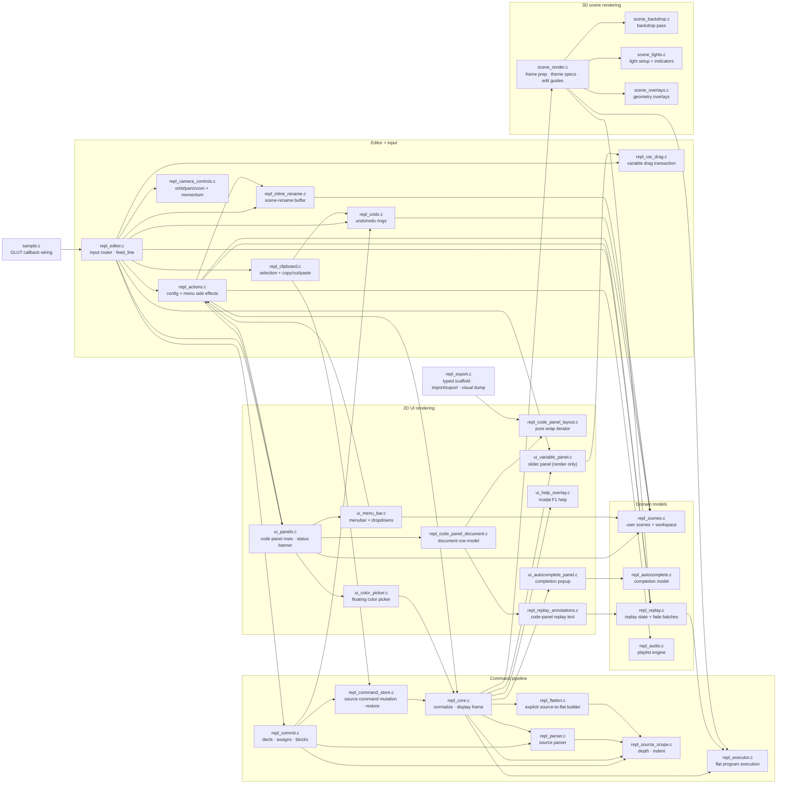

# REPL Module Guide

One-page lay of the land for the REPL source tree. For per-module
detail read [`ARCHITECTURE.md`](ARCHITECTURE.md). This doc covers the
layered overview, the ownership diagram, the render/model split, and
the current boundary/open-edge notes — it should read in under five
minutes.

## Responsibility Layers

Every source file belongs to one of six layers. File-name prefixes
follow the convention described in *Naming Notes* below:
`repl_*` for pipeline/input/models, `ui_*` for 2D rendering, and
`scene_*` for 3D rendering.

### 1. Command pipeline — source → flatten → execute

The central data flow. Edits mutate `g_cmds[]`; everything downstream
(execution, replay, overlays) reads the flattened array `g_flat_cmds[]`.

| Module | Role |
|--------|------|
| `repl_core` | Normalization, display frame, GL init |
| `repl_command_spec` | Declarative descriptors for fixed-arity GL commands |
| `repl_parser` | Source-line parser and canonical `GLCmd.source[]` generation |
| `repl_source_scope` | Source prefix-depth cache, indent helpers, block lookup |
| `repl_command_store` | Insert/delete/replace/load API over `g_cmds[]` |
| `repl_commit` | Float decls, variable assignments, structured block commits |
| `repl_flatten` | Explicit source-to-flat program builder (loops, functions, `if`) |
| `repl_executor` | Flat-program GL dispatch |
| `repl_eval` | Expression evaluator (recursive descent) |
| `cmd_format` | Pure indentation/depth computation (no GL) |

### 2. Editor + input

Accepts keystrokes/clicks, routes each event to the right subsystem,
and performs mutations through the command store.

| Module | Role |
|--------|------|
| `repl_editor` | Keyboard/mouse dispatcher, commit orchestration, `feed_line` |
| `repl_actions` | Config/menu side effects (single mutation lane for UI) |
| `repl_commit` | *(see pipeline)* — invoked from the editor's commit path |
| `repl_keys` | Keybinding constants |
| `repl_camera_controls` | Scene camera drag + momentum |
| `repl_clipboard` | Line selection and copy/cut/paste |
| `repl_undo` | Snapshot rings; example-promotion hook |
| `repl_search` | Search state and navigation |
| `repl_var_drag` | Variable slider drag transaction + writeback |
| `repl_inline_rename` | Scene-rename input buffer (surfaces via status strip) |

### 3. Domain models

Non-pipeline state that UI and input both read. None of these call
OpenGL.

| Module | Role |
|--------|------|
| `repl_scenes` | User-scene slots, workspace directory, LRU eviction |
| `repl_example_loader` | Built-in example loading + active tracking |
| `repl_examples` | Built-in example data |
| `repl_autocomplete` | Completion model: matches, selection, ghost, hints |
| `repl_autonormal` | Auto-generated `glNormal3f` maintenance |
| `repl_replay` | Replay state machine + fade batches |
| `repl_state` | Cross-cutting state catalog (`ReplUiState`, etc.) |

### 4. 2D UI rendering (code panel + overlays)

Pure renderers that read from the models above. Each module ends up
as one visible region on screen.

| Module | Role |
|--------|------|
| `ui_panels` | Code-panel rows, inline ghost/hint, scene status banner |
| `repl_code_panel_layout` | Pure text wrapping (no GL) — shared with export dumps + tests |
| `repl_code_panel_document` | Document row model (no GL) |
| `repl_replay_annotations` | Source-line replay text expansion |
| `ui_menu_bar` | Top-level menus, dropdowns, pinned buttons, search slot |
| `ui_color_picker` | Floating HSV/alpha picker + literal colour swatches |
| `ui_help_overlay` | Modal F1 help (Commands / Keys tabs) |
| `ui_variable_panel` | Floating variable slider panel (render-only) |
| `ui_autocomplete_panel` | Completion popup renderer |
| `ui_profile_panel` | CPU timing HUD |

### 5. 3D scene rendering

The viewport. Shared `SceneRenderConfig` / `FrameRenderContext`, guarded
helper passes, table-driven themes.

| Module | Role |
|--------|------|
| `scene_render` | Camera, render config/frame prep, grid/axes specs, edit guides |
| `scene_backdrop` | Backdrop pass (e.g. cityscape) |
| `scene_lights` | Light setup + indicator drawing |
| `scene_overlays` | Outline, vertex-number, and normal-vector overlays |

### 6. Persistence, audio, lifecycle

| Module | Role |
|--------|------|
| `repl_export` | Save/load, typed export scaffold, workspace headers, code-panel dumps |
| `repl_audio` | Playlist engine + persisted audio config |
| `sample` | `main()` + GLUT callback wiring |
| `gl_stub_counts` | `USE_GL_STUBS` symbol tracking |

## Ownership Diagram

Editor-adjacent modules split out of the old `repl_editor.c`, plus the
nearby modules they coordinate with. Cluster boxes match the layers
above. This is not every file — it's the coordination web that drives
most refactor decisions.

## Render / Model Split

For UI and scene layers the convention is paired modules:

- **Model** owns state + computation, makes no GL calls.
- **Panel / render** owns drawing, reads model state, performs no
  mutations.

Concrete pairs today:

| Model | Renderer |
|-------|----------|
| `repl_autocomplete` | `ui_autocomplete_panel` |
| `repl_code_panel_layout` + `repl_code_panel_document` | `ui_panels` |
| `repl_var_drag` (writeback) | `ui_variable_panel` |

The split is the boundary most likely to be violated by new code —
keep GL calls out of the model files and keep mutations out of the
render files.

## Current Boundaries

- `repl_editor.c` should keep shrinking toward ordered input routing and small
  editor-local state. It should delegate mutations once it knows which route
  owns an input event.
- `repl_actions.c` owns side effects that begin from config rows, F-key/Ctrl-key
  config shortcuts, and top-level menu items. UI code should ask it to execute
  actions instead of mutating scenes/files/config directly.
- `repl_camera_controls.c` owns only viewport camera state after UI routing has
  decided a mouse event belongs to the scene.
- `repl_undo.c` owns snapshots and the example-promotion hook that must run
  before mutating editor state.
- `repl_clipboard.c` owns selection and clipboard buffers. It mutates commands
  through `ReplCommandStore` and takes snapshots through `repl_undo.c`.
- `repl_code_panel_layout.c` owns pure text wrapping for code-panel rows:
  continuation indent, wrap break choice, row counts, segment lookup, and cursor
  row mapping. `ui_panels.c`, export visual dumps, and tests should consume this
  instead of carrying local copies.
- `repl_code_panel_document.c` owns the higher-level code-panel row model:
  header/body/footer row counts, replay-extra rows, cursor-follow scrolling,
  and document-line to command-line hit targets.
- `repl_replay_annotations.c` owns code-panel replay text expansion: source to
  flat-command mapping, variable substitution comments, and evaluated command
  display text.
- `ui_menu_bar.c` owns top-level menu/dropdown state, menu hit-testing,
  right-click config cycling, and the inline search slot in the menu bar.
- `ui_color_picker.c` owns the floating HSV/alpha picker state and literal
  color swatch rendering/mutation for color commands.
- `ui_help_overlay.c` owns the modal F1 help overlay.
- `ui_variable_panel.c` owns the floating variable slider panel rendering,
  geometry, and hit-test; value mutation happens in `repl_var_drag.c`.
- `ui_autocomplete_panel.c` owns the floating completion popup renderer;
  match/selection/hint state lives in `repl_autocomplete.c`.
- `repl_inline_rename.c` owns the inline scene-rename input buffer and key
  handling (surfaced through `set_status()`, no dedicated render pass).
- `repl_var_drag.c` owns the variable slider drag transaction: start/motion/
  reset, the linear-vs-log value mapping, and the writeback into
  `g_predef_vars` plus matching `CMD_VAR_ASSIGN` sources.
- `scene_render.c` now snapshots frame inputs in `SceneRenderConfig`: scene
  rect, camera, jitter, quality toggles, grid/axes choices, guide/vertex
  overlay toggles, and replay-derived limits. `FrameRenderContext` carries
  that config plus derived state such as the Focus-grid vertex and ocean-grid
  waterline classification. Helper-pass GL state stays local with small
  `glPushAttrib`/`glPopAttrib` wrappers. Standard grid/axes themes are table
  entries, while focus/ocean/adaptive-plane grid themes remain custom render
  paths. Backdrop rendering now delegates to `scene_backdrop.c`; per-pass
  light setup and light indicators delegate to `scene_lights.c`. Polygon
  outline/current-block highlighting, vertex-number labels, and normal-vector
  overlays delegate to `scene_overlays.c`, where one flat-command visitor keeps
  transform replay and tessellation block tracking consistent.

## Open Edges

- `ui_panels.c` still owns render-time iteration over code-panel rows, search
  match highlights inside source lines, and inline ghost/hint text rendering
  next to the input line.
- `repl_editor.c` still owns hidden-code-panel restore rules and the main
  keyboard/special/mouse route ordering.
- A few semantic value editors still rewrite fields inside existing commands
  directly (`ui_color_picker.c`, `repl_var_drag.c`, and declaration slot
  repair in commit paths). Bulk source-array restores now go through
  `repl_command_store_load()`.
- `sample.h` and `repl_state.h` still expose broad globals for compatibility.
  The current module splits are ownership boundaries, not yet context-object
  rewrites.

## Naming Notes

File prefixes partition the tree by responsibility:

- `repl_*` — pipeline, input, domain models. No OpenGL calls
  (except `repl_core.c`, which owns GL init and the display
  callback).
- `ui_*` — 2D rendering (code panel + floating overlays/popups).
  These files call OpenGL and read state from the `repl_*` models.
- `scene_*` — 3D viewport rendering.
- Bare (no prefix): `sample`, `cmd_format`, `gl_stub_counts`.

Deliberate exceptions that stay under `repl_*` even though they're
UI-adjacent:

- `repl_code_panel_layout` and `repl_code_panel_document` — pure
  text-wrap and row-count models. No GL. Shared by `ui_panels.c`,
  export dumps, and tests, so they belong with the models rather
  than with the renderers.
- `repl_replay_annotations` — source-to-flat-command text
  expansion. Also pure (no GL); same argument.
- `repl_inline_rename`, `repl_var_drag` — input buffers / drag
  transactions. They mutate state; they don't render.

The prefix tells you the layer; read the file's top-of-file
comment for the one-line charter.

## Where to put new code

- Adding a GL command? Pipeline layer — start in `repl_parser.c`
  (`parse_command`), then `repl_executor.c` (`execute_commands`),
  and `repl_flatten.c` if it needs expansion.
- Adding a keyboard shortcut? Editor layer — `repl_editor.c` if
  it's a new route, `repl_actions.c` if it piggybacks an existing
  config toggle.
- Adding a visual overlay? 2D UI layer (new `ui_*.c`) or scene
  layer (extend `scene_render.c` overlays) depending on whether it
  lives in the code panel or the viewport. If it has both a model
  half and a render half, split them into a `repl_*` (model) and
  `ui_*` (render) pair.
- Adding example content? `repl_examples.c`.
- Adding persisted state? Add the extern in `repl_state.h` and
  register the pointer in `repl_state.c`'s catalog.
