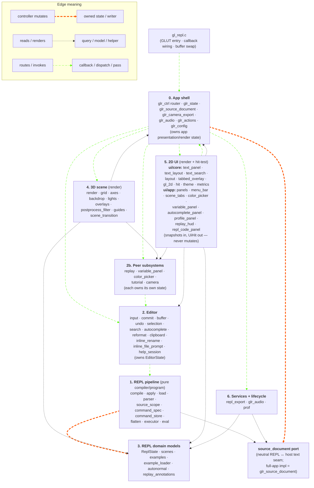

# REPL Module Guide — North Star

> **This document is the target ownership map.** The
> `editor-ownership-gap-cleanup` branch landed Phases A–J9 and the
> tree now matches the contract described here. The historical
> filename deferrals (`repl_camera_controls` → `glr_camera`,
> `repl_actions` → `glr_actions`) landed; `repl_commit` and
> `repl_editor` are deleted entirely. A small number of ratchets
> continue to drive transitional uses toward zero. New code follows
> this contract directly.

For per-module detail and frame-pipeline narrative read
[`ARCHITECTURE.md`](ARCHITECTURE.md). For the staged-cleanup history
(both plans landed) see
[`feature/done/push-architecture-refinement.md`](feature/done/push-architecture-refinement.md)
and [`feature/done/editor-owns-text-completion.md`](feature/done/editor-owns-text-completion.md).

## Four-Role Ownership Contract

```text
Editor = text model + controller.
    Owns text-document behavior: editable source text, read-only text documents,
    cursor, selection, scroll, search, autocomplete state, clipboard, undo/redo,
    cursor blink, keyboard/mouse handling for text documents, and source commit
    orchestration.

    The editor uses UI as its view. It exposes editor snapshots for UI to render,
    and it consumes neutral UI hit-test results to interpret mouse/pointer input.
    UI does not decide text behavior.

UI = view + hit-test/render services.
    Provides the view for the editor and other subsystems. Draws glyphs,
    highlights, gutters, panels, widgets. Measures text. Hit-tests visual
    rows/chars/buttons/swatches/sliders. Returns neutral UiHit results.
    Does not own text behavior or editor state.

REPL = validator/compiler for committed source.
    Given proposed source text + context, returns ReplCompiledChange or diagnostic.
    Does not own editor state. Does not own UI state. Does not write editor text.
    Does not call set_status.

glr_ctrl = thin router + frame/snapshot coordinator.
    Receives raw GLUT events, determines focus/region, asks UI for hit-test
    results, routes events to the owning subsystem, builds snapshots, and relays
    diagnostics/status messages. It does not implement editor behavior and does
    not drive the editor UI.
```

The key distinction:

```text
The editor drives text-document UI behavior.
The editor uses UI as its view.
glr_ctrl routes the event.
UI draws, measures, and hit-tests.
```

## Editor Uses UI As Its View

The editor is the model/controller for text documents. UI is the view
layer the editor uses to present that model and to map pixels back to
document positions.

```text
EditorState
  -> editor_build_view_snapshot(...)
  -> UI renders text, highlights, cursor, gutters, overlays, popup geometry

Mouse/pointer input
  -> UI hit-tests visual geometry and returns UiHit
  -> glr_ctrl routes the event + UiHit to the editor
  -> editor interprets the hit in terms of text-document behavior
```

UI can know about rectangles, rows, columns, glyph bounds, swatches,
and panel regions. UI should not know that Ctrl+G means search, that
Tab accepts an autocomplete candidate, that scrolling should follow
the cursor, or that a source-line edit requires a REPL commit. Those
are editor decisions.

The editor should not render glyphs or duplicate hit-test math. It
asks UI for view services. But UI should not own editor state or
editor policy.

```text
Editor model/controller:  what the text document is and how editing behaves
UI view:                  how that document appears and where the user clicked
glr_ctrl router:       which subsystem receives this event
REPL compiler:             whether committed source text is valid
```

Consequences:

- **State has three owners.** `ReplState` is the program. `EditorState`
  is the text-document session. `UiState` is transient UI/session
  chrome. Their storage lives in their owner modules (`src/repl/state.c`,
  `src/editor/state.c`, `src/ui/app/state.c`). `glr_ctrl` orchestrates them; it
  does not become a dumping ground for their bytes.
- **REPL compiles; it does not edit.** The editor calls
  `repl_compile(text, ctx) -> ReplCompiledChange | error`. On success,
  the editor writes its own text buffer and asks `repl_apply_*` to
  apply the parsed command to `ReplState` — both inside one editor
  undo transaction.
- **Editor commits are transactions.** A successful edit updates both
  editor text and REPL command state. A failed validation updates
  neither. Undo restores both sides together.
- **UI is view + hit-test, not a controller.** Renderers consume
  `UiRenderSnapshot`. Input handlers compute a `UiHit` and return.
  `glr_ctrl` dispatches based on `UiHit.kind`. There is no central
  dispatch enum; the editor and the peer subsystems are each their
  own controller.
- **Variable panel and replay are peer subsystems**, not slices of the
  editor. They have their own state + controllers. The editor doesn't
  know they exist. UI may render them; their input routes to them.
- **Read-only documents are also editor sessions.** The help overlay
  becomes a read-only editor session backed by a content provider —
  same scroll/search/cursor model as code editing, no commit path.

## State Owners

| State | Owns | Does not own |
|---|---|---|
| `ReplState` | Parsed command array, flat program, REPL variable state (scalar predefined vars plus fixed scratch arrays `A/B/C` of `REPL_SCRATCH_ARRAY_LEN` floats and the `func0..func9` user-alias table), scenes, import/export metadata | Render/presentation config (now `glr_state`, app layer), replay runtime state (peer), variable-panel state (peer), help-session state (peer), color-picker state (peer), editable text, cursor, selection, search query, UI visibility, pointer/viewport chrome |
| `glr_state` (app) | App-level presentation/render toggles (grid/axes themes, wireframe, overlays, backdrop, post-process filter, camera-rotate, etc.). Relocated off `ReplRuntimeState.{presentation,render}`; defaults from `glr_defaults.h` (`CFG_DEFAULT_*`). Read/written through the `glr_config` keyed bridge and per-scene snapshots | Program model, editable text, REPL grammar |
| `EditorState` | Editable text buffer, active input, cursor/edit-line, insert mode, selection, clipboard, search/autocomplete, scroll, **cursor blink** (the editor controls cursor visibility/blink — UI just renders), undo/redo, editor transactions | Variable-panel drag (now on the variable_panel peer), parsed command semantics, GL execution, menu chrome, transient status banners, render-output pixel coordinates |
| `UiState` | Viewport, pointer, status text TTL, help-overlay visibility (chrome flag), profile-panel visibility, panel-divider geometry (panel_frac + resizing_panel), camera viewport pose | Help-session tab/scroll (peer), variable-panel state (peer), program model, editable text, command validation, cursor blink (editor owns), per-frame render-output (uses `Ui*Output`) |
| `variable_panel` peer | Variable-panel visibility flag + slider drag transaction (var_idx, log_mode, start_value, start_x). Storage in `src/subsystems/variable_panel/variable_panel_state.c`. | Editor text behavior, REPL grammar |
| `replay` peer | Replay state machine: PC, mode, speed, accum, fade speed, src_line_idx, total_flat_cmds, expand_args. Storage in `src/subsystems/replay/replay_state.c`. | Editor text behavior, REPL grammar |
| `editor_help_session` peer | Help-overlay session state: tab_idx, scroll. Storage in `src/editor/help_session.c`. Visibility flag stays on `UiState.help` as chrome. | Help content (provided by content provider) |
| `color_picker` peer | Floating color-picker state, lifecycle, slider input handlers, source-line writeback through editor commit. Storage in `src/subsystems/color_picker/color_picker_state.c`; peer view + `ColorPickerInputResult` in `src/subsystems/color_picker/color_picker_state.h`. | Picker rendering / hit-test (lives on `src/ui/subsystems/color_picker.c`) |
| `tutorial` peer | Tutorial runtime state: active flag, tutorial idx, current step, locked-line array, fade timing, last match result. Storage in `src/subsystems/tutorial/tutorial_state.c`. Runner orchestration lives in `src/subsystems/tutorial/tutorial_runner.c`; command matching and ghost-text helpers live in `src/subsystems/tutorial/tutorial_match.c`; fade timing math lives in `src/subsystems/tutorial/tutorial_animation.c`. | Editor text behavior, REPL grammar, tutorial catalog (`src/repl/tutorials.c`) |

> The legacy forwarders (`ui_state_variable_panel*`, `editor_state_variable_drag*`,
> `repl_state_replay*`) were retired in Phases J5–J7. Production callers and
> tests use the peer accessors (`variable_panel_*`, `replay_state_*`)
> directly; `check-variable-panel-forwarders` and
> `check-replay-forwarders` are at baseline **0/0**.

`ReplState` owns the fixed scratch arrays `A/B/C[REPL_SCRATCH_ARRAY_LEN]`
as REPL language runtime state. They are not editor/UI state, do not
participate in variable-panel editing, and do not consume
`MAX_PREDEF_VARS` scalar slots. The exported `output.c` only emits the
arrays a snippet actually references — `export_collect_needs` scans for
`A[`/`B[`/`C[` use per-letter and skips unused arrays.

`ReplState.variables.func_aliases[REPL_FUNC_SLOT_COUNT][REPL_FUNC_NAME_MAX]`
backs the user-named function feature: any C identifier (not reserved /
not control-flow) maps to one of the 10 underlying `funcN` slots, so a
user can type `drawCube { ... }` instead of `func0 { ... }`. The alias
is purely a parser/display layer — the slot integer in `args[0]` is
still the load-bearing identity. Aliases round-trip through workspace
import/export via the `// @func N = name` directive.

## Repository Layout Rules

Source-backed modules keep paired `.c/.h` files at the repo root.
Header-only project helpers and vendored single-header dependencies
live under `include/`. Tests live under `tests/`, shared test helpers
under `tests/support/`, no-op GL headers under
`tests/gl-stubs/include/`.

`src/support/prof.c` is utility-like but compiled, so it stays as a root-level
source-backed module.

## Standalone Demo Binaries (Layer Independence Proofs)

Three binaries under `tools/` build with deliberately slim object
lists to make the layer boundaries observable:

- **`make teapot_demo`** (`tools/teapot_demo/teapot.c`) — drives
  `src/scene/` with a non-REPL geometry callback. Proves `scene_*`
  has no hard dependency on the REPL editor / controller / UI.
- **`make repl_demo`** (`tools/repl_demo/repl_demo.c`) — drives the
  REPL pipeline (parse → command store → flatten → execute) from
  static text. Proves the REPL pipeline has no hard dependency on
  editor input dispatch (`src/editor/input.c`), the controller
  (`src/app/glr_ctrl.c`), or the UI (`src/ui/`, `src/ui/subsystems/replay_hud.c`). The
  demo now backs the source lines with its own editor-free
  `source_document` implementation (`tools/repl_demo/source_document.c`,
  a tiny static line store) instead of linking `src/editor/state.c`'s
  `EditorBuffer` — the source-document port made that substitution
  possible. The `tools/repl_demo/stubs.c` file is now an empty,
  documentation-only canary: if a pipeline TU reaches back into
  app/editor/UI/peer code, the stub count guard fails instead of letting
  the dependency hide. Host effects, export bridges, source-document, and
  tutorial teardown dispatch keep reset fan-out, status, config, import,
  layout, and tutorial lifecycle edges out of the demo link set. See
  [`ARCHITECTURE.md`](ARCHITECTURE.md#standalone-repl-demo-coupling) for
  the detailed dependency table and guard list.
- **`make editor_demo`** (`tools/editor_demo/`) — a generic
  plain-text editor demo driven by its *own* input dispatcher
  (`tools/editor_demo/input.c`) and its *own* File menu
  (`tools/editor_demo/menu.c`). Per the Phase 8 cleavage in
  `plans/done/editor-demo.md`, `src/editor/input.c` is recognized
  as the **REPL editor's input dispatcher** (REPL key bindings +
  REPL-flavored controller), not a generic editor controller; the
  demo therefore does *not* link it. Same goes for `commit.c`,
  `clipboard.c`, `undo.c`, `reformat.c`, `search.c`, `completion.c`
  and the inline overlays — all REPL-flavored controllers, none
  linked by the demo. What *is* linked: `src/editor/state.c` (text
  buffer + cursor + selection + document data model),
  `src/editor/edit_ops.c` (generic primitives — char insert/delete,
  selection consume, used by both `src/editor/input.c` and
  `tools/editor_demo/input.c`), `src/ui/core/text_panel.c` + its layout
  / search helpers, `src/support/prof.c`. The demo is shim-free as of
  `plans/done/edit-line-ownership.md` Phase 5 — edit-line ownership
  moved to `EditorState.document.edit_line_idx`, the
  `tools/editor_demo/repl_shim.c` ledger file is gone, and the
  demo's input dispatcher reaches edit-line through
  `editor_state_edit_line` / `_set` like the REPL editor does.

All three demos default to `USE_GL_STUBS=1`-friendly object lists.
Run `./repl_demo` for a parse/flatten summary of the built-in samples;
`./repl_demo --execute` also runs the flat program against GL stubs.
Build with real GL (`make repl_demo`) and run `./repl_demo --render`
for an actual GLUT window — `1`/`2`/`3` cycle samples, space pauses
the sample-3 animation, `q`/Esc quits. Render mode shares the
parse/flatten/execute path with the headless mode; the only added
surface is GLUT bootstrap and a fixed orbit camera. `editor_demo`
runs as a link-only smoke test under `USE_GL_STUBS=1`; the real-GL
build opens a minimal text-editor window: typing inserts characters
via `edit_op_type_char`, backspace via `edit_op_backspace`, arrow
keys move the cursor within the input row, and the File menu shows
Load / Save (unimplemented v1 handlers — they just log) plus Quit.

## Naming Conventions

| Prefix | Owns |
|---|---|
| `repl_*` | Program model and compiler pipeline: parser, eval, command spec, source scope, compile, command store, flatten, executor, autonormal, examples, export. **No editor or UI state. No replay runtime state (that lives on the `replay` peer).** |
| `editor_*` | Text-document model + controller: line text, active input, cursor, scroll, selection, navigation, undo/redo, clipboard, search, autocomplete, cursor blink, commit orchestration. Includes read-only document sessions (e.g. help) backed by a content provider |
| `ui_*` | Screen-space rendering and hit-test/measurement services. Renderers consume snapshots; input handlers compute neutral `UiHit` results and return them. **Does not own state. Does not dispatch.** |
| `scene_*` | 3D rendering, camera/view transforms, world decorators, scene overlays. Camera input routes through `glr_ctrl` to scene/viewport controller |
| `glr_*` | Application router: GLUT callback registration, frame ordering, snapshot builders, raw-input → owning-subsystem dispatch (based on `UiHit.kind` / focus), diagnostic relay from REPL to editor + status |
| `variable_panel_*` | Peer subsystem: variable-slider visibility + drag transaction + writeback policy. Owns its own state |
| `replay_*` | Peer subsystem: replay state machine, PC, mode, fade batches |
| `prof` | Generic utility with no ownership of REPL/editor/UI state |

Treat prefixes as ownership boundaries, not naming aesthetics. A file
that crosses a boundary either splits or moves. The app-level audio
service is `src/app/glr_audio` with the `glr_audio_*` API (resolved
from the former neutral `audio`/`repl_audio` name).

Types follow the same rule with the PascalCase form of the prefix:
`Repl*` / `Editor*` / `Ui*` / `Scene*` / `Glr*` / `Replay*`,
`UI_*` / `GLR_*` for macros/enumerators. The prefix follows the
**owning directory**, not the concept the type models (e.g. the
editor-overlay snapshot types in `src/ui/app/editor.h` are `Ui*`, not
`Editor*`, because `src/ui/` owns that file).

### Sanctioned naming exceptions

These are intentional and must not be "fixed" by a future sweep:

- **Legacy GL/eval domain types** in `src/repl/` (cross-domain,
  deliberately un-prefixed): `GLCmd`, `CmdType`, `ExprVar`, `ExprCtx`,
  `TessVertex`, `FlatCmdLocalVars`, `FlatProgramView`,
  `CmdSyntaxCategory`, and the `cmd_type_name` thin alias.
- **REPL formatting**: `src/repl/format.h` `ReplFmt*`/`repl_format_*`
- **Root neutral helpers**: `include/gl_2d.h` `gl2d_*`, `src/scene/guides/transform_utils.h`
  `apply_tracked_transform` / `unwind_transform_stack`, and
  `src/ui/core/text_layout.h` `CodeLayout` / `CodeWrapIter` /
  `code_layout_*` (a pure utility shared by UI, export dumps, tests).
- **Intentional feature prefix**: `replay_ui_*` (e.g.
  `replay_ui_hud_render`) — feature-owned UI that knows replay
  concepts; audited by `check-replay-ui-isolation`.
- **Borrowed cross-module API types** — a header *referencing* a type
  another module owns is correct C design, not a defect:
  `ReplCompileContext` / `ReplCompiledChange` in
  `src/editor/commit.h`; the `Repl*` snapshot fields in
  `src/ui/app/snapshot.h`; the export / replay-annotation bridge types in
  `src/app/glr_ctrl.h`; and `VariablePanelViewState`
  (variable-panel-owned, surfaced by value through
  `src/subsystems/variable_panel/variable_panel_state.h`).

`make check-module-prefixes` (a denylist of the exact stale names the
naming cleanup removed; in the `check-state-ownership` aggregate) fails
if any eliminated prefix reappears under `src/`. It is a removed-name
denylist, not a blanket foreign-prefix sweep, so the borrowed-API
types above keep passing. See
`plans/in-review/module-naming-convention.md` for the full rename
record.

## Adding Or Migrating An Owner Module

1. Pick the owner first: REPL program state, editor session state, or UI
   chrome/render state.
2. Put live state in that owner's state struct. Do not hide frame state in
   file-local globals unless it is truly non-frame side storage, such as
   an undo ring or persisted scene slot.
3. Keep mutations on the owner side. Renderers read snapshots only.
   Render-time discoveries return through output structs that the
   controller actualizes.
4. Update the ownership checks in the same change. The capture/restore /
   reset path for `ReplState`, `EditorState`, and `UiState` must stay in
   lockstep with the state layout.

## Intended Frame Shape

```text
gl_repl.c (future src/app/glr_ctrl.c) GLUT callback
  -> glr_ctrl_* callback wrapper                  (routing role)
  -> UI hit-test:  ui_panels_hit_test(mx, my, variable_count) -> UiHit
  -> glr_ctrl dispatches on UiHit.kind to the OWNING subsystem:

       UI_HIT_CODE_TEXT     -> editor_handle_*(editor, raw_event, hit)
                                (cursor / scroll / selection / search /
                                 autocomplete / clipboard / undo /
                                 commit — editor controls all of these)
       UI_HIT_CODE_GUTTER   -> editor_handle_gutter(editor, hit)
       UI_HIT_HELP_PANEL    -> editor_help_session_handle_*(...)
                                (read-only editor session: scroll /
                                 search; no commit path)
       UI_HIT_COLOR_SWATCH  -> editor commit path (rewrites source text)
       UI_HIT_VARIABLE_SLIDER -> variable_panel_handle_*(...)
                                (peer subsystem — drag transaction)
       UI_HIT_REPLAY_BUTTON -> replay_handle_*(...)
                                (peer subsystem — toggle / step)
       UI_HIT_MENU_ITEM     -> glr_menu_route(...)
       UI_HIT_NONE          -> camera/viewport drag if over scene
                                -> scene_camera_handle_*(...)

Editor commit path (the only thing that crosses into REPL):
  ReplCompiledChange change;
  if (repl_compile(text, ctx, &change, err) != REPL_COMPILE_OK) {
      editor_record_diagnostic(err);
      glr_ctrl_set_status(err);    /* controller writes status */
      /* nothing else mutates */
  } else {
      editor_undo_begin_transaction();
        editor_buffer_apply(&change);          /* lines[][] only */
        repl_apply_compiled_change(&change);   /* cmds[]  only */
      editor_undo_commit_transaction();        /* atomic boundary */
      if (change.commit_message[0])
          glr_ctrl_set_status(change.commit_message);
  }

Display frame:
  -> rebuild autonormals / flat program if dirty
  -> push editor/UI snapshots
       (transformers, highlights, virtual lines, annotations)
  -> build SceneRenderConfig from ReplState + view/session state
  -> build UiRenderSnapshot from ReplState + EditorState + UiState
       + peer subsystem state (variable panel, replay)
  -> scene_render_3d_scene(&scene_cfg)
  -> ui_*_render(&ui_snap)               (snapshot-only; no state mutation)
  -> restore transient replay/predef state
```

`glr_ctrl` routes raw input to the right subsystem. The editor and
the peer subsystems are each their own controller — there is no
central dispatch enum and no "UI emits actions" layer.

## Responsibility Layers

### 1. REPL command pipeline — source text → parsed commands → flat execution

The user's program. The editor submits text; the REPL validates it,
stores parsed commands, flattens control structures, and executes flat
commands.

| Module | Role |
|--------|------|
| `glr_ctrl` | Application controller and input router. Owns frame order, snapshot construction, action dispatch, timer tick, and non-editor input routing (`glr_ctrl_router_*` helpers route replay, audio, config, save, camera, variable panel, scene press, scroll-wheel zoom to their owning subsystems). It is the only input-event mutation gate |
| `repl_command_spec` | Declarative command descriptors for fixed-arity GL-like commands |
| `repl_parser` | Parses one source line into `ReplParsedLine { GLCmd cmd; char text[] }`; no storage ownership |
| `repl_source_scope` | Computes source depth, indentation, and block context used by compile/format paths |
| `repl_compile` | Pure validation layer. Converts proposed source text + context into parsed command changes or diagnostics. Never mutates state. Reads existing source through the read-only `source_document` view |
| `repl_load` | Non-editor apply orchestration: compile → predef apply → source-document apply → command-store apply, mirroring the REPL halves of `editor_commit_apply_plan` without editor effects (cursor, insert mode, input buffer). Callers: save-file importer, example loader, tutorial comment injector, tests. Keeps `repl_compile` a pure validator |
| `repl_command_store` | Low-level `GLCmd` array mechanics only: insert, replace, delete, load. No text-buffer writes |
| `repl_flatten` | Builds the flat executable command stream from source commands, loops, functions, and `if` blocks |
| `repl_executor` | Narrow live-GL boundary that executes flat user geometry |
| `repl_eval` | Expression evaluator and predefined-variable lookup |
| `src/repl/format` | Pure text/indent/depth formatting helpers (`repl_format_*`) |

`GLCmd` is a parse-result record: type, args, flags, provenance. It does
not carry source text. Per-line text belongs to `EditorState`.

### 2. Editor — text, cursor, navigation, commit, undo

The editor owns what the user is editing and the transaction that turns a
text edit into a committed program change.

| Module | Role |
|--------|------|
| `editor_input` | Editor's pure text-document controller. Receives key/mouse events from `glr_ctrl` only after the controller has already filtered out non-editor concerns (replay, audio, config, save, camera, variable panel, scene press, scroll-wheel zoom). Mutates `EditorState` directly: cursor, selection, scroll, search, autocomplete navigation, clipboard, undo. Also exposes hit-test predicates (`editor_input_point_in_code_panel`, etc.) and the `EditorInputDispatchEffects` accumulation API that the controller consumes. `repl_editor.{c,h}` is deleted; this module is the sole dispatch boundary |
| `editor_commit` | Transaction boundary for commits: compile, undo snapshot, text-buffer write, REPL apply, dirty-state updates |
| `editor_state` | Owns `EditorState`: canonical per-line text buffer, active input, cursor, edit line, insert mode, **input-buffer selection anchor (`anchor_pos` on `EditorInputState`)**, line-range selection, search, autocomplete, scroll, undo/redo, transformers, highlights, virtual lines. The clipboard is a tagged union (`EditorClipboardKind`: EMPTY / LINES / INPUT_TEXT) so partial-line copy/cut and whole-line copy/cut share one slot. Single writer for editor buffer text |
| `editor_undo` | Undo/redo transaction rings that restore editor text and REPL command state together |
| `editor_clipboard` | Selection anchors plus copy/cut/paste payloads, including parallel text sidecars |
| `editor_search` | Search query, match tracking, row/char hits, next/previous navigation |
| `src/app/glr_completion.c` | REPL-side completion provider. Walks command spec, predef-var table, and source `CMD_FUNC_DEF` entries; produces matches, ghost text, parameter hints. Registers itself with `editor_completion` at startup; the editor only invokes the provider, it does not know about variables or GL command names directly |
| `editor_inline_rename` | Inline scene-name edit buffer and validation |
| `editor_inline_file_prompt` | Inline status-bar save/load filename prompt (parallel to `inline_rename`). Enter clears the undo ring and runs the file-import path (`repl_load_scene_runtime`) — same pipeline `./gl-repl <file>` uses at startup |
| `editor_reformat` | Whole-document reindent (Ctrl+R) over the editor buffer |
| `editor_help_session` | Read-only editor session backed by a help-text content provider. Uses the same scroll/search/cursor model as code editing; no commit path. Help visibility flag stays on `UiState` |

If accepting a keystroke can change line text, cursor position, scroll,
selection, search/autocomplete state, or undo history, the code belongs
in the editor layer.

Code-panel row construction is no longer editor-owned. Generic text-panel
rendering and hit-test live in `ui_text_panel`; the REPL/editor adapter that
turns snapshots into panel rows lives in `ui_repl_code_panel`.

### 2b. Peer subsystems (carved out of editor / UI)

Variable panel and replay are *not* part of the editor and *not* part
of UI. They are independent subsystems with their own state +
controllers; UI may render them; their input routes to them through
`glr_ctrl`.

| Module | Role |
|--------|------|
| `variable_panel` | Peer subsystem: owns visibility flag + slider drag transaction in a single `VariablePanelState`. Storage lives in `src/subsystems/variable_panel/variable_panel_state.c`. |
| `variable_panel_drag` | Implementation behind `variable_panel`'s drag transaction (begin/motion/reset, value writeback, source-line rewrite). Reads/writes through `variable_panel_drag_mut()`; legacy `repl_var_drag_*` symbol surface ratchets toward zero |
| `replay_state` | Peer subsystem: owns `ReplayRuntimeState` storage in `src/subsystems/replay/replay_state.c`. Narrow accessors (`replay_active`, `replay_pc`, `replay_mode`, …) plus `replay_state_view()` for the per-frame snapshot fill |
| `replay` | Replay state machine implementation behind `replay_state`: PC stepping, mode toggling, fade batches. Routes via `replay_handle_pin_clicked` / `replay_handle_key` / `replay_handle_special` |
| `editor_help_session` | Peer subsystem: read-only editor session for the help overlay (tab_idx, scroll). Visibility flag stays on `UiState.help` as chrome |
| `color_picker` | Peer subsystem: floating HSV/alpha picker. Owns `g_cp_*` state, lifecycle (`color_picker_start` / `_stop` / `_active_line` / `_can_edit_cmd`), input handlers (`color_picker_handle_press` / `_motion` / `_release` returning `ColorPickerInputResult`), and source-line writeback through `editor_commit_apply_external_change`. Exposes `color_picker_view()` for renderers and `color_picker_hsv_to_rgb` as a shared color-math helper. Storage lives in `src/subsystems/color_picker/color_picker_state.c`; renderer lives separately in `src/ui/subsystems/color_picker.c` |
| `tutorial_state` | Peer subsystem: owns `TutorialRuntimeState` storage in `src/subsystems/tutorial/tutorial_state.c`. Narrow accessor (`tutorial_active`) plus `tutorial_state_view()` for the per-frame snapshot fill. Snapshot capture/restore exists for tests and verification; tutorials remain linear and undo-blocked while active. |
| `tutorial` | Runner behind `tutorial_state`. `tutorial_start` / `_stop` orchestrate the transient-scene boundary via `repl_scenes_enter_transient_scene` + `repl_scenes_reset_for_transient`. Three step kinds (COMMAND / SET / REQUIRE) are walked by a shared iterative `tutorial_enter_step` + advance loop: COMMAND uses the original "type the expected GL call" flow; SET applies `cfg_slug = cfg_value` on entry (via `repl_cfg_set_int`) and advances when `tutorial_handle_ack_key` consumes Enter / Tab / Space from the `glr_ctrl_keyboard` router; REQUIRE advances when `tutorial_notify_state_changed` (hooked into `glr_config_set`) observes the watched slug reach its target. `tutorial_handle_commit_attempt` + the editor-precheck shim (`tutorial_reject_noncommand_commit_with_hint`) gate commits; `tutorial_guard_source_change` hard-rejects ALL mutations while a non-COMMAND step is active, in addition to enforcing locked rows everywhere editor / clipboard / reformat / clear writes. Restore-on-stop cfg lifecycle: a `fill_scene_subset`+tutorial-slugs baseline is captured BEFORE `presentation_reset` and written back by `tutorial_teardown` — which replaces the direct `tutorial_state_reset` calls at every active-tutorial teardown site (stop, completion, workspace / scene / example load, `glr_ctrl_reset_all`) so a workspace-load stash never enshrines tutorial-mutated cfg as the new baseline. Per-character reveal runs at a fixed `TUTORIAL_FADE_CHARS_PER_SEC` rate, not a fixed total duration |
| `repl_help_text` | REPL-side producer of neutral F1 help text. Walks `k_func_completions[]`, groups by `ReplHelpGroup`, emits per-command rows with header sections; appends hand-written language-level sections (Math operators, Variables, For-Loops, …) verbatim. `glr_ctrl` adapts the neutral content to `UiOverlayContent`; renderer (`src/ui/core/tabbed_overlay.c`) is feature-agnostic |

Peer subsystems may *produce* overlays consumed by the editor (replay
annotations are virtual lines the editor can render). They do not
*become* editor-owned.

### 3. REPL domain models

Program-side state that is not the source command array itself.

| Module | Role |
|--------|------|
| `repl_state` | Owns `ReplState`: program state, capture/restore/reset for REPL-owned slices only |
| `repl_config` | Config descriptor table for menu toggles and persisted render/audio settings |
| `repl_scenes` | User-scene slots, workspace directory, LRU eviction, and scene-side command/text snapshots |
| `repl_example_loader` | Built-in example loading and active-example tracking |
| `repl_examples` | Built-in example source data + catalog metadata: `ReplExampleEntry` carries a tag bitmask (`repl_example_tag_*` query API) and an optional `.subheading` (`repl_example_subheading`) that drives Scene flyout grouping. Symmetric with the tutorial catalog axes |
| `repl_autonormal` | Auto-generated `glNormal3f` maintenance and feeding-command lookup |
| `repl_replay` | Replay state machine, replay PC/mode, fade batches, replay timing |
| `replay_annotations` | Replay annotation cache and virtual-line production; takes `EditorBufferView` explicitly |
| `repl_debug` | Program/debug dump helpers; takes editor text views when it needs source text |

These modules may consume editor text through the neutral
`source_document` port (`SourceTextView` reads and `source_document_*`
mutations, backed by `glr_source_document.c` over `EditorState`) or, for
the few remaining direct readers, explicit `EditorBufferView`
parameters. They must not discover or mutate editor state globally.

### 4. 3D scene rendering

`scene_*` owns the 3D view. Scene renderers consume snapshots/configs and
never read `ReplState`, `EditorState`, or `UiState` directly.

| Module | Role |
|--------|------|
| `src/scene/render` | 3D frame setup: viewport, clear, projection, camera, accumulation loop, user-geometry execution hook |
| `src/scene/render_types` | Scene config/context types and narrow callback interfaces |
| `src/scene/grid` | Grid rendering and grid themes |
| `src/scene/axes` | Axis rendering and axis themes |
| `src/scene/scene_transition` | Pure grid/axes show↔hide fade state machine (no GL); controller diffs theme, renderer scales color alpha by opacity |
| `src/scene/backdrop` | Backdrop/environment rendering |
| `src/scene/lights` | Baseline lighting and light indicators |
| `src/scene/overlays` | Tiny per-vertex GL primitives (vertex-number labels, normal arrows). REPL-walking overlays moved out to `src/app/glr_ctrl.c`. |
| `src/scene/postprocess_filter` | Optional full-frame post-process pass (e.g. chromatic aberration): captures the scene rect to a texture and redraws channel-offset passes. Pure fixed-function GL; driven once per frame by `src/scene/render` |
| `src/scene/themes` | Shared scene theme enums (grid/axes themes, backdrop modes, grid spacing/extent) — the vocabulary app/UI config code and scene renderers share (header-only) |
| `src/scene/guides/geometry_guides.c` | Vertex/primitive guide rendering from a `SceneGuideSnapshot`. The controller fills the snapshot's cursor args from the flat program (funcN-local resolution) before calling in — see CLAUDE.md "Cursor Edit Guides" |
| `src/scene/guides/transform_guides.c` | Transform-guide rendering from a `SceneGuideSnapshot` (REPL-aware) |
| `glr_camera` | Camera/view transform helpers — orbit/pan/zoom drag state machine. `glr_ctrl_router_handle_camera_mouse` drives input; scene consumes final camera state through `SceneRenderConfig`. (Future `scene_camera_controls` move is still possible if the scene/viewport split lands.) |
| `transform_utils` | Header-only GL matrix helpers (at repo root). Consumed by `src/app/glr_ctrl.c` and `src/scene/guides/transform_guides.c` |
| `guides_shared` | Shared guide snapshot/planning types for REPL-aware 3D overlays (root, paired with the guides modules) |

Scene code renders. It does not parse, edit, save, or dispatch UI actions.

### 5. 2D UI rendering and hit-test

Generic `ui_*` modules are reusable screen-space view/hit-test
services. They render from snapshots and return neutral `UiHit`
results to `glr_ctrl`, which dispatches to the owning subsystem.
UI does **not** own state and does **not** dispatch.

Feature-owned UI may live under the feature prefix instead — for
example `replay_ui_*` for the replay subsystem's HUD/buttons.
Feature-UI modules may know their feature's semantics and route hits
to that feature's controller (e.g. call `replay_handle_*`), but they
must not own unrelated editor / REPL / app-router state and must not
call parser / compile / apply. This keeps generic `ui_*` modules
fully feature-agnostic without slowly punching holes through their
allowlists. The contract is enforced by a per-feature lighter guard:
`scripts/check-replay-ui-isolation.sh` covers `replay_ui_*`.

| Module | Role |
|--------|------|
| `ui_state` | Owns `UiState`: viewport, pointer, status text TTL, panel visibility, panel-divider geometry, camera viewport pose. *Not* cursor blink (that's editor). Small chrome value types live in `ui_state_types` (re-exported by `repl_state_views` for older consumers) |
| `ui_snapshot` | Defines `UiRenderSnapshot`, the read-only bundle passed to every UI renderer |
| `ui_editor` | Editor-overlay snapshot types: transformers, highlights, virtual lines |
| `ui_hit` | Defines `UiHitKind` + `UiHit`, the passive UI → controller contract. UI hit-test functions return `UiHit`; `glr_ctrl` dispatches on it |
| `ui_panels` | Top-level panel bridge: delegates code-panel rendering/hit-test to `ui_repl_code_panel`, renders the scene status banner, and prioritizes overlay/menu hit-tests before returning `UiHit` |
| `ui_text_panel` | Generic text-panel renderer and hit-tester over `UiTextPanelSnapshot`; owns wrapping, row drawing, cursor/search visuals, and generic text hit mapping. REPL/editor-free, guarded by `check-ui-text-panel-pure` |
| `ui_text_search` | Pure case-insensitive substring search helpers (`ui_text_matches_at`, `ui_text_find_next_in_text`). REPL/editor-free; used by `editor_search` |
| `ui_repl_code_panel` | REPL-aware adapter over `ui_text_panel`: builds rows from `UiRenderSnapshot`, editor buffer/virtual-line views, command metadata, tutorial fade, replay annotations, and color-transformer state; rewrites generic hits back to source-line targets |
| `ui_layout` | Pure scene/code-panel rectangle geometry |
| `ui_text_layout` (`src/ui/core/text_layout.c`, was `code_panel_layout`) | Pure text wrapping and visual-line iteration (`CodeLayout` / `CodeWrapIter`). Symbol prefix is still `repl_code_panel_layout_*` pending the deferred rename |
| `ui_menu_bar` | Menu bar, dropdowns, pinned buttons, search entry, and menu hit-testing. One generic `(menu_id, parent_row)` flyout-submenu engine shared by the Scene example-tag menu, the Tutorials tag menu, and the Config section/All menu (provider resolves Scene→`repl_example_*`, Tutorials→`repl_tutorial_*`, Config→`glr_config_section_*`). Scene + Tutorials per-tag flyouts share one `CatalogFlyoutOps` vtable + `catalog_flyout_row_at()` walker so the subheading-grouping emit rule (`### <subheading>` chrome headers between contiguous same-subheading entries) has a single home for both catalogs |
| `ui_scene_tabs` | Scene tab strip below the menu bar: snapshot-pure render + whole-band hit-test; tab set derived each frame from scene state, no persistent model. Geometry via the shared `ui_layout_code_panel_rect()` like `ui_menu_bar` |
| `src/ui/subsystems/color_picker.c` | **Feature-UI** (color-picker peer): pure renderer + hit-test over `ColorPickerView`. State, lifecycle, and source-line writeback live on the `src/subsystems/color_picker/color_picker_state.c` peer; the UI side is mutator- and live-state-free, audited by `check-color-picker-ui-isolation` |
| `ui_tabbed_overlay` | Generic modal tabbed text overlay renderer. Takes a `UiOverlayState` (visible / tab_idx / scroll / viewport / `UiOverlayContent`) and draws a titled, paged reference card. Knows nothing about REPL semantics. Currently consumed by the F1 help; available for future modal text panels |
| `ui_variable_panel` | Renderer for the variable-slider panel (the panel chrome — the *peer subsystem* owns drag/visibility state). Input returns `UI_HIT_VARIABLE_SLIDER` |
| `ui_autocomplete_panel` | Completion popup renderer; reads `EditorState.autocomplete` |
| `ui_profile_panel` | CPU timing HUD renderer |
| `replay_ui_hud` | **Feature-UI** (replay peer): 2D replay HUD; reads replay peer subsystem state through snapshot. Lives under the `replay_ui_*` prefix because it knows replay concepts (mode / PC / play-paused-done / speed); audited by `check-replay-ui-isolation` |

Files no longer in this layer:

- `ui_help_overlay` → split. The session state (`tab_idx`, `scroll`)
  moved to `src/editor/help_session.c` (Layer 2). The renderer became the
  generic, REPL-agnostic `src/ui/core/tabbed_overlay.c`; the per-row text
  content is built REPL-side by `src/repl/help_text.c` from
  `k_func_completions[]` and adapted by `glr_ctrl` so adding a new GL command auto-populates
  the F1 overlay.
- `ui_color_picker` → split into `src/subsystems/color_picker/color_picker_state.c` (peer state +
  lifecycle + writeback) and `src/ui/subsystems/color_picker.c` (renderer +
  hit-test). The picker UI is a pure renderer over `ColorPickerView`;
  the peer is the only mutator. Locked in by
  `check-color-picker-ui-isolation` (stricter than the replay-UI
  guard).
- `ui_action` / `ui_action_dispatch` (planned but never landed) — the
  corrected contract uses `UiHit` (passive) instead of `UiAction`
  (dispatch enum), so these modules are not introduced.

A UI renderer may draw. A UI input handler may hit-test and return a
`UiHit`. Neither may directly mutate REPL / editor / peer-subsystem
state.

### 6. Persistence, audio, instrumentation, lifecycle

| Module | Role |
|--------|------|
| `repl_export` | Save/load, typed export scaffold, workspace headers, code-panel dumps. Reads source via the `source_document` view; camera/cfg formatting delegated to app-side bridges and neutral cfg-baseline helpers |
| `repl_cfg_baseline` | Neutral cfg bag/bridge and `// @cfg <slug>` parser: owns `ReplConfigBag`, `ReplConfigBridge`, and `repl_config_extract_slug` for export/import, scene snapshots, and tutorial baselines |
| `src/app/glr_camera_export` | Camera-block format owner: translates camera state ↔ the `// camera` block + `glRotatef`/`glTranslatef` text in saved files. Implements `ReplExportCameraBridge` so `repl_export` never parses/formats GL strings |
| `src/app/glr_source_document` | Full-app adapter binding the neutral `source_document` port (read view + insert/replace/load/clear/apply) to the `EditorState` text buffer, so REPL pipeline TUs never reach into editor state directly |
| `src/app/glr_state` | Storage + accessors for app-level presentation/render state relocated off `ReplRuntimeState`; reached through the `glr_config` keyed bridge |
| `src/app/glr_audio` | App-level playlist engine and persisted audio config (`glr_audio_*`) |
| `prof` | Project-wide CPU timing instrumentation |
| `gl_repl` | `main()`, GLUT callback registration, buffer swap |
| `gl_stub_counts` | `USE_GL_STUBS` symbol tracking for `tests/gl-stubs` headers |

## Ownership / Coordination Diagram

The coordination diagram shows the post-cleanup target under the
M/V/C+compiler+router contract. UI returns neutral `UiHit` results;
`glr_ctrl` dispatches to the owning subsystem; the editor and the
peer subsystems are each their own controller. There is no central
`UiAction` dispatch enum.

Relationship kinds:

- `e1@==>` — delegated mutation / write-owning path (subsystem
  controller mutating its own state).
- `-.->` — read/query/render dependency.
- `i1@-->` — invoke/route/dataflow path (raw event routing or
  function-call invocation across subsystem boundaries).

### Layer view

This high-level view groups every module into its responsibility layer
and shows the dominant cross-layer relationships. Within each layer the
controller mutates its own state — those self-loops are left implicit.
Use this view to orient; use the file-level diagram below to see who
talks to whom.



Reading the layer view:

- Input flows one way: GLUT → `gl_repl.c` → app shell → owning
  subsystem. UI's role on the input side is passive: it computes a
  `UiHit` and hands it back.
- The editor and peer subsystems are each their own controller. The
  only path that crosses into the REPL pipeline is `editor → repl`
  (commit transaction).
- The REPL pipeline is a pure compiler/program layer: it mutates the
  REPL domain models but never reads editor or UI state directly.
- Source text crosses the REPL/host boundary through the
  `source_document` port. The app shell provides the
  `EditorState`-backed adapter; the editor remains the single
  underlying writer.
- Scene and UI render are read-only — they consume snapshots and
  never mutate.

### File-level view

```mermaid
flowchart LR
    subgraph legend["Edge meaning"]
        lmut_a["controller mutates"] e1@==> lmut_b["owned state / writer"]
        lread_a["reads / renders"] -.-> lread_b["query / model / helper"]
        lflow_a["routes / invokes"] i1@--> lflow_b["callback / dispatch / pass"]
    end

    gl_repl["gl_repl.c<br/>GLUT callback wiring · buffer swap"]

    subgraph app["0. App shell (router · bridges · app state)"]
        ctrl["src/app/glr_ctrl.c<br/>raw input router · frame/snapshot coordinator<br/>non-editor router helpers · timer tick<br/>does NOT drive editor behavior"]
        glrstate["src/app/glr_state.c<br/>app presentation/render state<br/>(moved off ReplState)"]
        glrsrcdoc["src/app/glr_source_document.c<br/>source_document port → EditorState"]
        glrcamexport["src/app/glr_camera_export.c<br/>camera ↔ export-text bridge"]
    end

    subgraph repl_pipeline["1. REPL compiler/program pipeline"]
        compile["src/repl/compile.c<br/>pure validation → ReplCompiledChange"]
        load["src/repl/load.c<br/>non-editor load apply<br/>(compile → apply, no editor effects)"]
        parser["src/repl/parser.c<br/>line parser"]
        scope["src/repl/source_scope.c<br/>depth · indent · context"]
        flatten["src/repl/flatten.c<br/>source-to-flat builder"]
        exec["src/repl/executor.c<br/>flat command execution"]
        store["src/repl/command_store.c<br/>GLCmd array only"]
    end

    subgraph editor["2. Editor (text model + controller)"]
        einput["src/editor/input.c<br/>REPL editor input dispatcher<br/>(REPL key bindings + REPL-flavored<br/>orchestration on top of edit_ops)"]
        eedops["src/editor/edit_ops.c<br/>generic text-editing primitives<br/>(char insert / delete / selection consume)<br/>(shared by REPL input.c and tools/editor_demo/input.c)"]
        ecommit["src/editor/commit.c<br/>commit transaction<br/>(compile + undo + buffer + apply)"]
        estate["src/editor/state.c<br/>EditorState storage<br/>(buffer · cursor · scroll · selection ·<br/>autocomplete · search · transformers)"]
        eundo["src/editor/undo.c<br/>transaction snapshots"]
        eclip["src/editor/clipboard.c<br/>cut/copy/paste"]
        esearch["src/editor/search.c<br/>query · hit tracking"]
        eac["src/app/glr_completion.c<br/>REPL-side provider<br/>(registers with editor_completion)"]
        ecompl["src/editor/completion.c<br/>completion-provider registry"]
        ehelpsess["src/editor/help_session.c<br/>read-only editor session<br/>(carved from ui_help_overlay state)"]
        erename["src/editor/inline_rename.c<br/>rename buffer"]
        efileprompt["src/editor/inline_file_prompt.c<br/>inline save/load file prompt"]
        ereformat["src/editor/reformat.c<br/>whole-document reindent"]
    end

    subgraph peers["2b. Peer subsystems (own state + controller)"]
        vpanel["src/subsystems/variable_panel/variable_panel_state.c + src/subsystems/variable_panel/variable_panel_drag.c<br/>(was repl_var_drag)<br/>visibility + drag transaction"]
        replay_sys["src/subsystems/replay/replay_playback.c + replay_fade.c + replay_input.c<br/>+ replay.c + replay_state.c<br/>(was repl_replay)<br/>state machine · fades · walkers"]
        cpicker["src/subsystems/color_picker/color_picker_state.c<br/>(was inside ui_color_picker)<br/>HSV/alpha state · lifecycle · writeback"]
        tutorial_sys["src/subsystems/tutorial/tutorial_runner.c + tutorial_animation.c + tutorial_match.c<br/>+ src/subsystems/tutorial/tutorial_state.c<br/>(catalog in src/repl/tutorials.c)<br/>runner · matching · fade timing"]
        camera["src/app/glr_camera.c<br/>orbit/pan/zoom transform"]
    end

    subgraph models["3. REPL domain models"]
        state["src/repl/state.c<br/>ReplState"]
        scenes["src/repl/scenes.c<br/>user scenes · workspace"]
        replay_ann["src/repl/replay_annotations.c<br/>takes EditorBufferView"]
        autonormal["src/repl/autonormal.c<br/>autonormals · feeding cmds"]
    end

    subgraph services["6. Services + lifecycle"]
        audio["glr_audio.c<br/>playlist"]
        prof["src/support/prof.c<br/>instrumentation"]
        export["src/repl/export.c<br/>save/load · reads source_document view"]
    end

    subgraph ui_layer["5. 2D UI rendering + hit-test"]
        uistate["src/ui/app/state.c<br/>UiState (chrome only)"]
        uihit["src/ui/core/hit.h<br/>UiHit · UiHitKind"]
        uipanels["src/ui/app/panels.c<br/>panel bridge · statusbar<br/>(returns UiHit)"]
        uireplcp["src/ui/app/repl_code_panel.c<br/>REPL code-panel adapter"]
        uitextpanel["src/ui/core/text_panel.c<br/>generic text panel"]
        uitextsearch["src/ui/core/text_search.c<br/>pure substring search"]
        uimenu["src/ui/app/menu_bar.c<br/>menubar + dropdowns<br/>(returns UiHit)"]
        uiscenetabs["src/ui/app/scene_tabs.c<br/>scene tab strip<br/>(returns UiHit)"]
        uicolor["src/ui/subsystems/color_picker.c<br/>color picker render + hit-test<br/>(feature-UI · reads ColorPickerView)"]
        uitabbed["src/ui/core/tabbed_overlay.c<br/>generic modal tabbed text<br/>(content from src/repl/help_text.c)"]
        uivpanel["src/ui/subsystems/variable_panel.c<br/>variable panel chrome"]
        uiac["src/ui/app/autocomplete_panel.c<br/>completion popup"]
        uiprof["src/ui/app/profile_panel.c<br/>timing HUD"]
        uirhud["src/ui/subsystems/replay_hud.c<br/>replay HUD (feature-UI)"]
        uilayout["src/ui/core/layout.c<br/>rect geometry"]
        uicplay["src/ui/core/text_layout.c<br/>wrap iterator"]
    end

    subgraph scene_layer["4. 3D scene rendering"]
        sceneR["src/scene/render.c<br/>3D frame"]
        sgeomg["src/scene/guides/geometry_guides.c<br/>geometry guides<br/>(REPL-aware)"]
        sxformg["src/scene/guides/transform_guides.c<br/>transform guides<br/>(REPL-aware)"]
        sgrid["src/scene/grid.c<br/>grid"]
        saxes["src/scene/axes.c<br/>axes"]
        sbackdrop["src/scene/backdrop.c<br/>backdrop"]
        slights["src/scene/lights.c<br/>lights"]
        soverlays["src/scene/overlays.c<br/>overlay primitives"]
        spost["src/scene/postprocess_filter.c<br/>post-process pass<br/>(chromatic aberration)"]
    end

    %% gl_repl.c hands raw GLUT events to the controller
    gl_repl i2@--> ctrl

    %% UI files compute UiHit (passive) and hand it to the controller.
    %% These are routes/invocations, not "delegated mutations".
    uipanels i3@--> ctrl
    uimenu i4@--> ctrl
    uicolor i5@--> ctrl
    uivpanel i6@--> ctrl

    %% Controller routes raw events to the owning subsystem based on
    %% UiHit.kind (or focus). Non-editor concerns (replay, audio,
    %% config, save, camera, variable panel, scene press, scroll-wheel
    %% zoom) are routed by glr_ctrl_router_* helpers BEFORE the
    %% editor dispatch entry points run. These are routing edges, not
    %% mutation delegations — the editor and peers are each their own
    %% controller.
    ctrl i7@--> einput
    ctrl i8@--> ehelpsess
    ctrl i9@--> vpanel
    ctrl i10@--> replay_sys
    ctrl i11@--> camera
    ctrl i33@--> audio

    %% Editor controllers mutate their own state directly.
    einput e10@==> estate
    einput e3@==> esearch
    einput e4@==> eac
    einput e5@==> eclip
    einput i41@--> efileprompt
    einput i42@--> ereformat
    efileprompt -.-> scenes
    eac -.-> ecompl
    esearch -.-> uitextsearch

    %% Editor commit transaction is the editor's mutation path into REPL state.
    einput i12@--> ecommit
    ecommit i13@--> compile
    ecommit e6@==> eundo
    ecommit e7@==> estate
    ecommit e8@==> store

    %% Editor uses UI as its view: ctrl builds the per-frame snapshot
    %% inline (glr_ctrl_build_ui_snapshot) and pushes it to UI
    %% renderers via the ctrl→ui edges below. UI does not own editor
    %% state; it draws what the editor publishes through ctrl.

    %% Clipboard cut/paste is a commit (rewrites text + cmds).
    eclip i14@--> ecommit

    %% Color picker peer drives the writeback (UI side just renders +
    %% reports UiHit). cpicker -> ecommit is the only mutation path.
    cpicker i15@--> ecommit
    ctrl i34@--> cpicker

    %% REPL compile is pure (no mutation edges OUT). It may read the
    %% read-only source-document view through the port.
    compile -.-> parser
    compile -.-> scope
    parser -.-> scope
    store -.-> state

    %% Source-document port: the neutral REPL <-> editor text seam.
    %% REPL pipeline TUs read/write source lines through source_document_*
    %% (backed by glr_source_document.c, which adapts EditorState) instead
    %% of touching editor state directly. repl_load drives the non-editor
    %% apply path (compile -> apply) used by file/example/tutorial loads.
    glrsrcdoc e11@==> estate
    compile -.-> glrsrcdoc
    scenes -.-> glrsrcdoc
    export -.-> glrsrcdoc
    load i35@--> compile
    load i36@--> store
    load i37@--> glrsrcdoc
    tutorial_sys i38@--> load

    %% App-owned presentation/render state (relocated off ReplState) and
    %% the camera<->export-text bridge.
    ctrl -.-> glrstate
    sceneR -.-> glrstate
    export i39@--> glrcamexport
    glrcamexport -.-> camera

    %% Render fan-out from controller.
    ctrl i16@--> sceneR
    ctrl i17@--> uipanels
    ctrl i18@--> uimenu
    ctrl i19@--> uivpanel
    ctrl i20@--> uiac
    ctrl i21@--> uirhud
    ctrl i22@--> uiprof

    %% Snapshot reads
    ctrl -.-> state
    ctrl -.-> estate
    ctrl -.-> uistate
    ctrl -.-> autonormal
    ctrl -.-> replay_ann
    ctrl -.-> vpanel
    ctrl -.-> replay_sys
    ctrl -.-> camera
    ctrl -.-> export

    %% Scene render fan-out
    sceneR i23@--> exec
    sceneR i24@--> sgeomg
    sceneR i25@--> sxformg
    sceneR i26@--> sbackdrop
    sceneR i27@--> slights
    sceneR i28@--> soverlays
    sceneR i29@--> sgrid
    sceneR i30@--> saxes
    sceneR i40@--> spost
    sceneR -.-> camera
    sceneR -.-> replay_sys

    %% REPL domain reads
    replay_ann -.-> replay_sys
    replay_ann -.-> state
    autonormal -.-> scope
    autonormal -.-> state
    replay_sys i31@--> exec

    %% UI render reads (read-only; UI never mutates)
    uipanels -.-> uistate
    uipanels -.-> uireplcp
    uireplcp -.-> uitextpanel
    uireplcp -.-> uicplay
    uitextpanel -.-> uicplay
    uipanels -.-> uilayout
    uipanels -.-> uicolor
    uiac -.-> eac
    uiprof -.-> prof
    uivpanel -.-> vpanel
    export -.-> estate

    classDef animateE stroke:#f50,stroke-dasharray: 9\,5,stroke-dashoffset: 900,animation: dash 90s linear infinite;
    classDef animateF stroke:#5f0,stroke-dasharray: 9\,5,stroke-dashoffset: 900,animation: dash 90s linear infinite;

    class e1,e2,e3,e4,e5,e6,e7,e8,e9,e10,e11 animateE
    class i1,i2,i3,i4,i5,i6,i7,i8,i9,i10,i11,i12,i13,i14,i15,i16,i17,i18,i19,i20,i21,i22,i23,i24,i25,i26,i27,i28,i29,i30,i31,i32,i33,i34,i35,i36,i37,i38,i39,i40,i41,i42 animateF
```



Reading the diagram:

- Input flows in one direction: GLUT → `glr_ctrl` → owning
  subsystem. UI computes a passive `UiHit` along the way; it never
  mutates state. There is no central dispatch enum.
- The editor and the peer subsystems (variable_panel, replay) are
  each their own controller. They mutate their own state directly
  (orange edges stay *inside* their cluster).
- `editor_commit` is the only path that crosses into REPL via
  `repl_compile`. On success it updates undo + buffer + cmd-store as
  one transaction. On failure nothing mutates.
- `repl_compile` is pure: no outgoing mutation edges. It reads parser +
  scope and the read-only `source_document` view (`glr_source_document`).
  `repl_command_store` mutates command arrays only; line-text writes
  from REPL TUs go through the `source_document` port, whose full-app
  adapter (`glr_source_document`) delegates to `editor_buffer` (still
  the single underlying writer).
- `repl_load` is the non-editor apply path: it drives compile → apply
  through the `source_document` port and command store, with no editor
  effects.
- `repl_export` reads source through the `source_document` view and
  delegates camera/cfg text formatting to the app-side bridges
  (`glr_camera_export`); `replay_annotations` still receives an explicit
  `EditorBufferView`. Neither reaches into editor state.
- UI render is read-only. UI input is hit-test-and-return.

## Boundary Rules

### Live OpenGL / GLU calls

Allowed:

```text
scene_*.c
ui_*.c render paths
src/repl/executor.c
gl_repl.c        future src/app/glr_ctrl.c
```

Parser/spec/export/example modules may emit GL command names as text.
That is not a live GL call.

### State boundaries

```text
check-views-no-owners
    scene_*.c and ui_*.c include view headers only; never owner headers.

check-ui-no-repl-state-read
    ui_*_render*() functions take const UiRenderSnapshot *snap and read
    only from it.

check-ui-returns-hits-only             (Phase 4 — replaces the planned
                                        check-ui-emits-actions-only)
    ui_*.c input handlers do not call glr_action_*, repl_command_store_*,
    editor_*_mut*, repl_state_*_mut*, or peer-subsystem mutators
    directly. They compute a UiHit and return it. The corrected
    contract has glr_ctrl dispatch on UiHit.kind to the owning
    subsystem; UI does not own dispatch. Baseline 5 (lowered from
    8 in Phase J2.2 once the controller took over code-panel press,
    drag, menu activation, and color-picker open/close/press/motion/
    release dispatch).

check-ui-panels-no-mutators            (Phase J2.2 hard guard)
    src/ui/app/panels.c is hit-test only. The legacy code-panel press / click /
    drag / release / scene-press / motion / mouse-release / escape
    forwarders + color-picker open/close/press/motion/release + replay
    pin + search + menu open/close/activate calls are all routed by
    glr_ctrl. Any reappearance fails the build with no allowlist.

check-replay-ui-isolation              (feature-UI prefix discipline)
    replay_ui_*.c is feature-owned UI: it may render the replay HUD,
    hit-test replay-specific controls, route hits via replay_handle_*,
    and read replay snapshots. It must not mutate editor/REPL state,
    call parser/compile/apply, or grow generic ui_* responsibilities.
    A separate lighter guard for feature UI keeps the generic ui_*
    allowlists clean of feature-specific exemptions.

check-glr-ctrl-not-editor-mirror         (Phase 4)
    glr_ctrl must not accumulate one wrapper per editor operation.
    New editor behavior belongs behind editor_handle_* or editor_*
    APIs. glr_ctrl routes raw input to the owning subsystem and
    builds frame snapshots; it does not implement editor behavior or
    duplicate the editor's API surface.

check-no-repl-editor-input-shim        (Phase J1)
    src/editor/input.c must not include the deleted repl_editor.h or call
    legacy repl_*_func dispatch bodies. The input dispatch boundary
    is closed: src/editor/input.c handles editor-text-model concerns only;
    non-editor routing lives in glr_ctrl_router_* helpers.

check-editor-ownership-budget          (landed commit 11)
    Ratchets the transitional ui-forwarder line count in src/repl/state.c
    and the src/ui/app/state.h -> src/repl/state_views.h include count strictly
    downward.
```

### Layout geometry

`src/ui/core/layout.c` owns scene/code-panel rectangle geometry. Non-UI callers
may include `src/ui/core/layout.h` because the module is pure geometry, not UI
state.

### UI / scene independence

`ui_*` and `scene_*` should not include each other's headers. Shared
render-neutral types belong in explicit shared headers such as
`src/scene/render_types.h` or `src/ui/app/snapshot.h`.

## Where To Put New Code

| Need | Home |
|---|---|
| New REPL syntax | `repl_parser`, `repl_command_spec`, `repl_compile`, `repl_flatten`, `repl_executor` |
| New user-geometry execution behavior | `repl_executor` |
| New 3D world decorator | `scene_*` |
| New 3D REPL-aware overlay | `scene_*`, consuming snapshots/configs from `SceneRenderConfig` |
| New 2D UI render | `ui_*` render path, snapshot-only |
| New 2D UI input behavior | `ui_*` hit-test that returns a `UiHit`; if a new region needs distinguishing, add a `UiHitKind` value |
| New owning subsystem (variable panel, replay, etc.) | Its own `subsystem_*` files plus a route from `glr_ctrl` based on `UiHit.kind` |
| New cross-owner frame wiring | `glr_ctrl` |
| New app lifecycle/window wiring | `gl_repl.c` (GLUT entry) |
| New text-buffer mutation | `editor_buffer_*` |
| New editor cursor/navigation behavior | `editor_document` / `editor_input` |
| New commit behavior | `editor_commit` + pure `repl_compile` validator |
| New cmd-array mutation | `repl_apply_*`; low-level shifts stay inside `repl_command_store` |
| New editor session state | `EditorState` slice |
| New UI visibility/status/chrome state | `UiState` slice |
| New program/persistence state | `ReplState` slice |
| New header-only render helper | `include/` |

## Current Status vs. Target

This document describes the **target**. The
`editor-ownership-gap-cleanup` branch landed Phases A through J2,
which closed the M/V/C+compiler+router contract end-to-end
including the input dispatch boundary and the code-panel press
side-effect routing. As of that branch landing:

- **Three-state split: done.** `EditorState`, `UiState`, and
  `ReplRuntimeState` each own their respective slices. The
  variable_panel and replay peers carved their state out as standalone
  modules (Phase F).
- **`repl_compile` / `repl_apply_*` API: done.** Compile is a pure
  validator; apply is a pure mutator. Both produce / consume
  `ReplCompiledChange`. Status side effects are forbidden by hard
  guard (`check-no-set-status-in-compile-apply`).
- **Editor-buffer single-writer: done.** `editor_buffer_*` is the
  sole writer; the `repl_command_store_*_with_line[s]` overloads are
  gone (Phase B).
- **`EditorBufferView` for REPL readers: done.** Hard-guarded by
  `check-repl-no-direct-buffer-read` with an allowlist for
  transitional readers.
- **`source_document` port: landed (in-flight decouple plan).** The
  neutral `source_document` port (`SourceTextView` + `source_document_*`)
  is the text seam between REPL pipeline TUs and the host. The full app
  binds it to `EditorState` through `glr_source_document.c`; the standalone
  `repl_demo` links a tiny editor-free implementation. `repl_load.c` owns
  the non-editor apply path so `repl_compile.c` stays a pure validator.
- **Presentation/render state off `ReplState`: landed.** The fields
  that lived on `ReplRuntimeState.{presentation,render}` moved to the
  app-level `glr_state.c`, reached through the `glr_config` keyed
  bridge. Camera/cfg export formatting moved to the
  `glr_camera_export.c` / cfg bridges so `repl_export.c` no longer parses
  or formats GL strings.
- **Input routing: done.** `ui_panels_hit_test`, `ui_menu_bar_hit_test`,
  `ui_color_picker_hit_test`, `ui_variable_panel_hit_test` produce

  passive `UiHit` results; `check-ui-returns-hits-only` is now at
  **0/0** — every legacy mid-input/mid-render mutator in `ui_*.c` is
  gone. Color-picker writeback routes through
  `editor_commit_apply_external_change`; the cursor-pixel publish
  routes through the per-frame `UiCodePanelOutput` struct that
  `ui_panels_render_code_panel` fills and `glr_ctrl` actualizes
  by passing the coords directly to `ui_autocomplete_panel_render`.
  The `cursor_px` / `cursor_py` fields on
  `UiCodePanelRuntimeState`, the `glr_action_set_cursor_pixel`
  setter, and the `check-cursor-px-encapsulated` guard were deleted
  along with the data — it was rendering ephemera, not state.
- **Code-panel press side effects: routed (Phase J2).**
  `glr_ctrl_router_handle_code_panel_hit(UiHit, x, y)` dispatches
  every code-panel press / drag / release / menu activation /
  pin-button / inline-color-swatch / floating-picker control / panel-
  divider hit by `UiHit.kind`. `src/ui/app/panels.c` is hit-test only —
  the press / click / drag / release / scene-press / motion / mouse-
  release / escape forwarders are deleted. Hard-guarded by
  `check-ui-panels-no-mutators`. Drag-anchor state moved into
  `src/app/glr_ctrl.c`; `route_menu_button_hit` / `route_menu_item_hit`
  use `UI_HIT_MENU_BUTTON` vs `UI_HIT_MENU_ITEM` to disambiguate
  top-level button clicks from open-dropdown row clicks via the
  payload's `cmd_idx` / `item_idx` rather than reading menu state
  back through `ui_menu_bar`.
- **Input dispatch boundary: closed (Phase J1).** `repl_editor.{c,h}`
  is deleted. All keyboard, special-key, mouse, motion, and
  mousewheel dispatch migrated into `src/editor/input.c` (editor-text
  concerns only) and `src/app/glr_ctrl.c` (non-editor routing via
  `glr_ctrl_router_*` helpers: replay, audio, config, save,
  camera, variable panel, scene press, scroll-wheel zoom). Timer
  dispatch inlined into `glr_ctrl_timer` / `glr_ctrl_tick`.
  Hard-guarded by `check-no-repl-editor-input-shim`.
- **Peer subsystems: done.** `variable_panel`, `replay`, and
  `editor_help_session` each own their state separately from
  `EditorState` / `UiState` / `ReplState`.
- **Read-only-document seam: done.** `editor_help_session` is the
  read-only editor session backing the help overlay. The
  `EditorCompletionProvider` registry decouples editor input
  dispatch from REPL grammar (Phase G).
- **Commit dispatch is editor-side: done.** `editor_try_commit_*`
  dispatchers live in `src/editor/commit.c`. `repl_commit.c` is deleted
  and hard-guarded against return (Phase H.5). `editor_try_commit_float_decl`
  and `editor_try_commit_assign_variable` now route through
  `editor_commit_apply_plan`.
- **Parser diagnostic flow: data, not side effects.** `src/repl/parser.c`
  writes diagnostics to `ReplParseContext.err_buf`. The parser core
  has zero `set_status` calls; the legacy no-ctx wrappers
  (`repl_parser_parse_command` / `_with_vars`) keep one bridge for
  the test harness, ratcheted by `check-no-set-status-in-repl-parser`
  (baseline 1 → 0).
- **File renames: done.** `repl_undo` → `editor_undo`,
  `repl_clipboard` → `editor_clipboard`, `repl_search` →
  `editor_search`, `repl_inline_rename` → `editor_inline_rename`,
  `repl_var_drag` → `variable_panel_drag`,
  `repl_replay` → `replay`, `repl_layout` → `ui_layout`,
  `repl_code_panel_layout` → `ui_code_panel_layout`,
  `repl_code_panel_document` → split into `ui_text_panel` plus
  `ui_repl_code_panel` (`src/editor/code_panel_document.c` deleted),
  `repl_editor` → deleted (dispatch split between `editor_input`
  and `glr_ctrl`), `repl_camera_controls` → `glr_camera`,
  `repl_actions` → `glr_actions`. The `glr_*` namespace covers the
  app-shell (router + camera + menu/config actions); the previously
  noted deferrals have landed.
- **Hard guards: in place.** `make check-state-ownership` runs the
  ownership/boundary ratchets, while `make check` also adds
  `check-gl-boundaries` and `check-layer-coupling`.
  `check-public-api-usage` is informational. Recent guards include
  `check-color-picker-ui-isolation` (the picker peer split —
  `src/ui/subsystems/color_picker.c` is renderer + hit-test only, no state
  reads / mutations / parser / commit), `check-replay-ui-isolation`
  (Phase J3.1, the feature-UI prefix discipline), and
  `check-repl-no-direct-tutorial-runner` (REPL pipeline files request
  tutorial cleanup through `ReplHostEffects`, keeping `repl_demo`
  stub-free). `check-output-actualization` actively scans
  `UiCodePanelOutput` and verifies `src/app/glr_ctrl.c` reads every
  field.
- **Migration ratchets: all at 0/0.** `check-ui-returns-hits-only`,
  `check-no-set-status-in-repl-parser`, `check-replay-forwarders`,
  and `check-variable-panel-forwarders` all reach 0/0 after Phase
  J3–J7 retired the legacy bridge code (parser no-ctx wrappers,
  `repl_state_replay*` forwarders, `editor_state_variable_drag*`
  / `ui_state_variable_panel*` / `repl_var_drag_*` shims). The
  canonical peer accessors are the only entry points.

The deferred items still on the books:

- `ui_layout` / `ui_text_layout` parameterization so geometry
  helpers stop reading `repl_state_presentation()` (currently
  allowlisted under `check-no-facade-include-in-views`).
- `ui_text_layout` symbol rename: the file was renamed to
  `src/ui/core/text_layout.c` but its public functions are still
  prefixed `repl_code_panel_layout_*` / `repl_code_panel_wrap_iter_*`.
  The function names should follow the `ui_*` filename in a follow-up.
- `audio` namespace audit — resolved: app service is now
  `src/app/glr_audio` with the `glr_audio_*` API.
- `editor_reset_transients` symbol rename: the function lives in
  `src/editor/input.c` and resets editor + camera + menu + picker +
  code-panel-drag transients; the `repl_editor_*` prefix is leftover from
  the deleted `repl_editor.{c,h}`. Follow-up should rename to
  `editor_input_reset_transients` (or split the cross-subsystem reset).

REPL pipeline corner cases that deserve focused regression tests are
listed in [`ARCHITECTURE.md`](ARCHITECTURE.md) under
*Known REPL Corner Cases & Coverage Gaps*.

See `feature/done/editor-ownership-gap-cleanup.md` for the audit script and
baseline counts; `feature/editor-owns-text-completion.md` for the
phase-by-phase commit ledger that delivered this state; and
`feature/done/editor-text-model-controller.md` for the corrected
contract that this document reflects.

## Open Refactor Edges

Phase 1 of the earlier refinement plan is complete. Most of refinement
Phase 2 has landed (R1, R2, R3, R4 controller-side, R5, R6, R7).
`feature/editor-owns-text.md` Steps 2–6 completed the data-shape half of
editor-owned text. Phase J1 closed the input dispatch boundary
(`repl_editor.{c,h}` deleted). Phase J2 routed code-panel press side
effects through `UiHit` dispatch (`src/ui/app/panels.c` is hit-test only).
Phase J3 routed color-picker writeback through
`editor_commit_apply_external_change` and renamed the replay HUD to
the feature-UI `replay_ui_*` prefix. Phase J4 introduced
`UiCodePanelOutput` so the editor cursor pixel flows back through a
per-frame render-output struct rather than a state mutation; UI is
now mutator-free in input AND render paths. Phases J5–J7 retired
every legacy forwarder shim across parser, replay, and
variable_panel. Phase J8 added macOS Cmd-key support
(`editor_input_normalize_super_to_ctrl`). Phase J9 made code-panel
syntax highlighting metadata-driven via `CmdSyntaxCategory` on
`ReplCommandTypeSpec`.

Outstanding tracks:

```text
R10-phase1                    reassess "stale" GLUT decls in src/repl/core.h
R10-ph2-5                     dissolve src/repl/core.c into natural owners
R11 (tail)                    shrink remaining allowlists (bench_repl.c)
R12                           consolidate public REPL APIs into one repl.h
R9                            optional: split src/repl/export.c
Color scheme + syntax         deferred sub-task of editor-owns-text Step 6

Completed:
R8 (sample -> gl-repl rename) + src/ restructure (subsystems split,
ui core/app split, prof + transform_utils relocations) — landed in
plans/active/src-shuffle-final.md.
```

`feature/state-ownership-finalize.md` (residual of the original
`gold-standard-state-ownership.md` plan, retired 2026-05-11):

- Stages 0/1 (Makefile checks, capture/restore) — landed.
- Stages 2/3 (by-value read getters, UI-facing leaf state) — landed.
- Stage 4 (cursor-pixel `UiCodePanelOutput` actualization) — landed.
- Stage 5 (medium slices return by-value or view structs, UI no longer
  reads `repl_state_presentation/replay/render` directly) — landed.
- Stage 6 (`repl_undo` on top of `repl_state_capture()`) — abandoned;
  superseded by the deliberate editor/REPL undo split documented in
  `feature/done/editor-input-selection.md` Phase A item 6.
- Stage 7 (UI snapshot purity) — render boundary done; input-bridge
  conversion is the deferred Phase C of
  `feature/done/push-architecture-ui.md`, explicitly optional and
  not pursued.
- Stages 8/9 (collapse views/owners headers, domain-helper audit,
  capture-semantics docs) — open. See
  `feature/state-ownership-finalize.md`.
