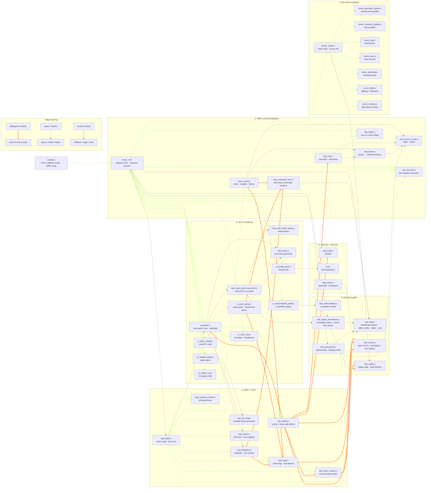

# REPL Module Guide

This is the quick map for the immediate-mode REPL source tree. For the deeper
ownership reference, see [`ARCHITECTURE.md`](ARCHITECTURE.md). For the staged
cleanup plan, see
[`feature/push-architecture-refinement.md`](feature/push-architecture-refinement.md).

The current target is the Option B controller architecture from the refinement
plan. The older `ReplGeometryRenderPlan` plus generic scene-callback direction
is superseded.

## Ownership Split

```text
repl_*        = REPL language, source model, flat program, replay model, input/model controllers
imrepl_ctrl   = app-frame controller between REPL state and scene/UI rendering
scene_*       = 3D stage: camera, frame setup, decorators, 3D overlays
ui_*          = 2D editor chrome: panels, menus, overlays, popups, HUDs
sample.c/h    = current GLUT app shell and legacy shared header
imrepl.c/h    = future app shell/shared header name, replacing sample.c/h
```

Treat prefixes as ownership boundaries, not as a catch-all naming scheme.
`repl_*` is for REPL language/editor/source/replay model behavior. App-shell
and app-service code belongs under `imrepl_*` once the deferred rename lands;
generic instrumentation keeps neutral names such as `prof`. `repl_audio` is a
legacy-named app service and should be revisited in the namespace audit rather
than copied as a pattern.

`scene_*` and `ui_*` are views. They render from per-frame config or model
snapshots. They should not own REPL mutation paths.

`repl_*` owns the user program, editor/controller behavior, replay policy, and
the data snapshots passed to the views. `imrepl_ctrl.c` owns frame-level
scene/UI render wiring. It is deliberately outside the `repl_*` namespace.

`sample.c` and `sample.h` keep their current names during controller extraction
to avoid burying architecture changes under include churn. Rename them to
`imrepl.c` / `imrepl.h` in a later mechanical pass.

## Repository Layout Rules

Source-backed modules keep paired `.c/.h` files together at the repo root.
Header-only project helpers and vendored single-header dependencies live under
`include/`; `gl_2d.h` belongs there because it is header-only. Tests live under
`tests/`, shared test helpers under `tests/support/`, and no-op GL headers under
`tests/gl-stubs/include/`.

`cmd_format` and `prof` are utility-like, but both have compiled `.c` modules,
so they stay as root-level source-backed modules rather than moving to
`include/` or a generic utility bucket.

## Adding Or Migrating An Owner Module

When a module starts owning mutable REPL state, follow the Stage-1 template:

1. Put the live bytes in `ReplRuntimeState` unless the state is intentionally a
   sidecar such as undo rings or user-scene slots. If it is a sidecar, call
   that out explicitly instead of describing it as runtime-state migration.
2. Add a named runtime slice in `repl_state.h`, wire it into
   `static ReplRuntimeState g_repl_state;`, and say whether the read path is
   currently `facade-backed`, `direct-runtime`, or `value-getter`.
3. Keep mutations on the owner side. Scene/UI renderers read snapshots only;
   render-time discoveries return through output structs that the controller
   actualizes back into state.
4. Extend the ownership tests in the same change: keep
   `repl_state_capture()`, `repl_state_restore()`, and `repl_state_reset_all()`
   current for runtime slices, and add focused behavior coverage in the
   module's own tests.

## Core Tenets

1. **The REPL owns the user program.** It parses source, stores source commands,
   flattens loops/functions/conditionals, owns variables, and owns replay
   policy.
2. **The executor is the narrow live-GL gate.** `repl_executor.c` turns a
   `FlatProgramView` into user geometry GL calls.
3. **The scene owns the 3D stage.** Scene sets viewport, projection, camera,
   accumulation, lighting baseline, grid, axes, backdrop, orbit target, and 3D
   overlays from config.
4. **The UI owns 2D editor chrome.** UI renderers draw from snapshots and route
   mutations through REPL-owned action/store APIs.
5. **The controller wires the frame.** `imrepl_ctrl.c` builds
   `SceneRenderConfig`, calls `scene_render_3d_scene(&cfg)`, then drives UI
   rendering. `repl_core.c` keeps model/pipeline work.
6. **Replay stays REPL-owned.** Scene may render transitional replay visuals,
   but replay PC/mode/baseline/fade policy belongs in `repl_replay.c` or a
   future replay-plan module.

## Intended Frame Shape

At the top level, `sample.c` registers the GLUT display callback and forwards
directly to the controller (no shim layer):

```text
sample.c glutDisplayFunc -> imrepl_ctrl_display_frame
  -> rebuild autonormals / flat program if dirty
  -> prepare replay frame clamp if needed
  -> build SceneRenderConfig from REPL state
  -> scene_render_3d_scene(&scene_cfg)
  -> render UI panels / popups / HUDs
  -> restore temporary replay/predef state
```

Inside the scene:

```text
scene_render_3d_scene(&scene_cfg)
  -> set viewport / clear / projection / camera / quality state
  -> execute user geometry through the narrow execution boundary
  -> render replay fade/highlight visuals while still transitional
  -> render scene-owned decorators
  -> render REPL-aware 3D overlays from supplied snapshots
  -> finish accumulation-buffer sample/frame
```

The scene decides ordering of 3D passes. The REPL/controller decides the data
and semantics behind those passes.

## Responsibility Layers

### 1. REPL command pipeline: source -> flatten -> execute

Edits mutate the source command array. Execution, replay, export, and geometry
annotations consume the flattened program or snapshots derived from it.

| Module | Role |
|--------|------|
| `repl_core` | Core REPL model/pipeline, normalization wrapper, and legacy lifecycle wrappers that forward to the controller |
| `imrepl_ctrl` | App-frame controller: display/reshape, scene config build, snapshot pushers, scene/UI render ordering |
| `repl_command_spec` | Declarative descriptors for fixed-arity GL-like commands |
| `repl_parser` | Source-line parser; returns `ReplParsedLine { GLCmd cmd; char text[] }` (the editor-buffer canonical text + the parse-result struct) |
| `repl_source_scope` | Source prefix-depth cache, indent helpers, block lookup |
| `repl_pipeline` | Public pipeline and lifecycle surface for frame orchestration (`flatten`, autonormal, replay/bootstrap snapshots) |
| `repl_command_store` | Insert/delete/replace/load API over the source command array; text-aware (`_with_lines` / `_with_line`) so the editor buffer moves in lockstep with command arrays |
| `repl_commit` | Float declarations, variable assignments, structured block commits |
| `repl_flatten` | Source-to-flat program builder for loops, functions, and `if` blocks |
| `repl_executor` | Narrow live-GL dispatch boundary for flat user geometry |
| `repl_eval` | Expression evaluator |
| `cmd_format` | Pure indentation/depth computation |

`GLCmd` is a pure parse-result struct (type, args, flags). Per-line text
lives in `ReplEditorBuffer` (one slot in `ReplRuntimeState`), and undo
snapshots / user-scene slots / the clipboard each carry parallel
`lines[][]` sidecars so text moves with commands through every persistence
path.

### 2. Editor and input controllers

These modules route input and mutate REPL-owned state through focused ownership
APIs.

| Module | Role |
|--------|------|
| `repl_editor` | Keyboard/mouse dispatcher, commit orchestration, `feed_line` |
| `repl_actions` | Config/menu side effects and action dispatch |
| `repl_keys` | Keybinding constants |
| `repl_camera_controls` | Scene camera drag and momentum state |
| `repl_clipboard` | Line selection and copy/cut/paste |
| `repl_undo` | Snapshot rings and restore paths |
| `repl_search` | Search state and navigation |
| `repl_var_drag` | Variable slider drag transaction and writeback |
| `repl_inline_rename` | Scene rename input buffer |

Input/controller modules may mutate models. Render modules should not. Some
input modules still include `repl_layout.h` for hit-testing; that is a known
boundary exception outside the Phase 1 scene-controller extraction.

### 3. REPL domain models

These modules own REPL state that is not itself a renderer.

| Module | Role |
|--------|------|
| `repl_state` | Typed runtime-state facade. Owns `ReplRuntimeState` plus the per-frame editor snapshot slices (`editor_buffer`, `editor_transformers`, `editor_highlights`, `editor_virtual_lines`) |
| `repl_config` | Config descriptor table backing menu toggles + persisted audio/render config |
| `repl_scenes` | User-scene slots, workspace directory, LRU eviction. Slots carry `cmds[]` + parallel `lines[][]` text sidecar |
| `repl_example_loader` | Built-in example loading and active tracking |
| `repl_examples` | Built-in example data |
| `repl_autocomplete` | Completion model: matches, selection, ghost text, hints |
| `repl_autonormal` | Auto-generated `glNormal3f` maintenance + feeding-cmd lookups consumed by the highlight push helper |
| `repl_replay` | Replay state machine, replay PC/mode, fade/highlight inputs |
| `repl_replay_annotations` | Replay-time annotation cache + virtual-line refresh (`prepare()` refills `editor_virtual_lines`) |
| `repl_debug` | Debug dump / diagnostic helpers |

`repl_replay` owns replay semantics. Scene rendering should consume replay
snapshots or documented transitional helpers, not own replay state.

### 4. 3D scene rendering

`scene_*` owns the 3D frame and world/decorator passes. Under Option B, scene
code may consume `FlatProgramView` and command provenance when those values are
on the per-frame config or guide snapshots.

| Module | Role |
|--------|------|
| `scene_render` | 3D frame setup from explicit config, viewport, clear, projection, camera, accumulation loop, user-geometry execution point, transitional replay/HUD code |
| `scene_render_types` | Scene config/context types, including focus/guide snapshots and the narrow execution hook |
| `scene_grid` | Grid theme rendering |
| `scene_axes` | Axes theme rendering |
| `scene_backdrop` | Backdrop/environment rendering |
| `scene_lights` | Scene lighting baseline and light indicators |
| `scene_transform_utils` | Small GL matrix helpers used by renderers |
| `scene_guides_shared` | Snapshot/planning types for REPL-aware 3D guides |
| `scene_geometry_guides` | REPL-aware vertex/primitive guide rendering from snapshots |
| `scene_transform_guides` | REPL-aware transform guide rendering from snapshots |
| `scene_overlays` | REPL-aware outlines, labels, normals |
| `ui_replay_hud` | 2D replay HUD rendered from `SceneRenderConfig` in the UI layer |

Neutral scene files should stay free of REPL state access. `scene_render.c`
still has transitional direct REPL reads for fade batches and accumulation AA.
R1 in `feature/push-architecture-refinement.md` removes all of these: the
controller builds a `ReplayFadePlan` snapshot; the replay HUD now lives in
`ui_replay_hud.c`; and accumulation-AA settings move to `SceneRenderConfig`.

### 5. 2D UI rendering

`ui_*` owns screen-space drawing from a per-frame `UiRenderSnapshot`.

| Module | Role |
|--------|------|
| `ui_snapshot` | `UiRenderSnapshot` definition; the read-only bundle the controller hands to every `ui_*_render*()` entry point |
| `ui_editor` | Editor-overlay snapshot family: `EditorTransformerList` (color/numeric inline editors), `EditorHighlightList` (feeding cmd + replay PC + search), `EditorVirtualLineList` (replay annotation rows) |
| `ui_panels` | Code-panel rows, overlay viewport bracket, scene status banner |
| `repl_layout` | Pure scene/code-panel rectangle geometry, no GL |
| `ui_menu_bar` | Menus, dropdowns, pinned buttons, search slot |
| `ui_color_picker` | Floating HSV/alpha picker and inline color swatches (rendered from `EditorTransformer` entries) |
| `ui_help_overlay` | Modal F1 help |
| `ui_variable_panel` | Floating variable slider panel |
| `ui_autocomplete_panel` | Completion popup |
| `ui_profile_panel` | CPU timing HUD |
| `repl_code_panel_layout` | Pure text wrapping model, no GL |
| `repl_code_panel_document` | Code-panel row/document model, no GL |

`UiRenderSnapshot` is built once per frame by
`imrepl_ctrl_build_ui_snapshot()` and consumed by every `ui_*_render*()`
function. It carries by-value state slices, pointer-shaped read-only
views, and pointers to the controller-pushed editor lists
(`editor_transformers`, `editor_highlights`, `editor_virtual_lines`),
plus per-frame derived metadata such as `selection_lo/_hi`,
`active_indent_chars`, `in_begin_block`, and `current_begin_mode` so the
render path never re-derives them.

The `check-ui-no-repl-state-read` and `check-ui-renderer-takes-view`
Makefile guards enforce the snapshot-shaped signature. Mutations go
through `repl_actions`, `repl_command_store`, `repl_var_drag`, or
another REPL-owned mutation API; input-bridge helpers in `ui_*.c`
(`*_hit`, `*_rect`, press/motion handlers) still query live state
pending the Phase C output-list work in
`feature/push-architecture-ui.md`.

### 6. Persistence, audio, instrumentation, lifecycle

| Module | Role |
|--------|------|
| `repl_export` | Save/load, typed export scaffold, workspace headers, code-panel dumps |
| `repl_audio` | Legacy-named app-level playlist engine and persisted audio config; namespace audit candidate |
| `prof` | Project-wide CPU timing instrumentation |
| `sample` | Current `main()`, GLUT callback wiring, buffer swap, and legacy shared header; future rename target is `imrepl` |
| `gl_stub_counts` | `USE_GL_STUBS` symbol tracking for `tests/gl-stubs` headers |

## Ownership / Coordination Diagram

The coordination web that drives most refactor decisions. Cluster boxes
match the responsibility layers above. This is hand-curated for
architectural clarity rather than a literal call-graph dump; verify
against `make callgraph-files` (which writes `callgraph-files.mmd` from
the same six layers as `scripts/callgraph_file_groups.json`).

Three relationship kinds, each with a distinct stroke:

- `e1@==>` — delegated mutation / write-owning path (orange, animated).
- `-.->` — read / query / render dependency (default dotted).
- `i1@-->` — invoke / stage / dataflow path (green, animated).



A few edges in the diagram (`scene_render → scene_geometry_guides`,
`ui_variable_panel → repl_var_drag`) are real per the source but absent
from the static `make callgraph-files` output because the analyzer
doesn't always trace through indirect-call helpers; treat the curated
diagram as the architectural truth and the auto-generated graph as the
strictly-static cross-check.

`scene_render → repl_executor` is intentionally NOT shown: the scene
calls user geometry through a callback adapter installed by the
controller (`scene_execute_adapter` in `imrepl_ctrl.c`), not directly.

## Scene Render Config Direction

`SceneRenderConfig` is the scene's explicit per-frame input. In this codebase it
is allowed to carry REPL-aware data because there is one frontend and no plugin
host requirement.

The controller builds it once per frame. It should include:

* scene rectangle and window dimensions
* camera pose and camera-motion glow
* quality flags and accumulation settings
* grid/axes/backdrop/light settings
* flat program view for execution and overlays
* guide/focus/replay snapshots needed by 3D overlay passes
* the existing narrow execution hook, until direct executor call cleanup is
  worth doing

Scene-local jitter no longer belongs in the config. `FrameRenderContext` holds
the per-pass state the scene helpers share.

It should not require `scene_render.c` to call `scene_render_config_build()` or
pull from `repl_state_*` during the frame.

## Boundary Rules

### Live OpenGL / GLU calls

Allowed:

```text
scene_*.c
ui_*.c
repl_executor.c
sample.c        future `imrepl.c`
```

Parser/spec/export/example modules may contain GL command names as text. That
is not a live GL call.

### Scene/UI includes from `repl_*`

Current rule:

```text
imrepl_ctrl.c may include scene/UI render headers.
repl_core.c should not include scene/UI headers after the controller move.
```

Existing exceptions: `repl_editor.c`, `repl_actions.c`, and `repl_export.c`
include selected `ui_*` headers. The `repl_editor.c` exception is eliminated
in Phase 2 by moving cross-layer input routing to `imrepl_ctrl.c`. Do not
silently expand these exceptions.

### Typed-state facade boundary (Phase 2 target)

`repl_state.h` will split into two headers (R6 in the refinement plan):

```text
repl_state_views.h   — read-only accessors; safe to include from scene_* and ui_*
repl_state_owners.h  — mutating accessors; owner modules and controller only
```

The rule is enforced by Makefile checks such as `check-scene-no-repl-state-mut`,
`check-state-boundaries`, and `check-views-no-owners`. `scene_*.c` and
`ui_*.c` include `repl_state_views.h` only; any accidental include of
`repl_state_owners.h` in those files is now caught automatically.

### Layout geometry (Phase 2 target)

`repl_layout.c` / `repl_layout.h` own `repl_layout_scene_rect` and
`repl_layout_code_panel_rect` (R3). Non-UI callers
(`imrepl_ctrl.c`, `repl_editor.c`, `repl_export.c`, tests) include
`repl_layout.h`; `ui_panels.h` stays on the UI/render side.

### UI / scene independence

`ui_*` and `scene_*` should not include each other's headers. Shared
render-neutral helpers belong in explicit shared headers.

## Where To Put New Code

* New REPL syntax: `repl_parser.c`, `repl_command_spec.c`,
  `repl_commit.c`, `repl_flatten.c`, and `repl_executor.c` as needed.
* New user-geometry execution behavior: `repl_executor.c`.
* New 3D world decorator: `scene_*`.
* New 3D REPL-aware overlay: current home is still `scene_*`, consuming
  `FlatProgramView` or guide snapshots from `SceneRenderConfig`.
* New 2D UI: `ui_*` renderer plus REPL-owned model/action code when mutation
  is needed.
* New per-frame scene/UI wiring: `imrepl_ctrl.c`.
* New app lifecycle/window wiring: `sample.c` for now, `imrepl.c` after the
  deferred rename.
* New command mutation: `repl_command_store_*`.
* New header-only rendering/helper code: `include/`.
* New tests: `tests/`; shared test-only helpers: `tests/support/`.
* New no-op GL stub declarations: `tests/gl-stubs/include/`.

## Open Refactor Edges

Phase 1 is complete. Most of Phase 2 has now landed (R1, R2, R3, R4
controller-side, R5, R6, R7). See
`feature/push-architecture-refinement.md` for the per-recommendation
status table.

The editor-owns-text migration (Steps 2–6) is also complete: `GLCmd.source[]`
is gone; `ReplEditorBuffer` owns canonical line text; the controller
pushes `EditorTransformerList` / `EditorHighlightList` /
`EditorVirtualLineList` per frame for the code-panel render path. Color
scheme + syntax keyword extraction (a sub-task of Step 6) is deferred
until a configurable theme actually has a consumer.

Remaining work, in suggested order:

```
R10-phase1  reassess: the "stale" GLUT decls in repl_core.h are actually
            live (called from imrepl_ctrl.c). Decide whether to move them
            to repl_editor.h or leave them until R10-phase5.
R10-ph2-5   dissolve repl_core.c into natural owners
            (parse+normalize → repl_parser.c, collect_visible_vars →
             repl_source_scope.c, repl_reformat.c, startup → repl_scenes.c,
             debug dumps → repl_state.c)
R11 (tail)  shrink remaining allowlists (bench_repl.c repl_core_internal.h)
R12         consolidate public REPL APIs into one concise repl.h
R8          sample → imrepl rename (last, mechanical)
R9          optional: split repl_export.c

Phase B residuals (push-architecture-ui.md): repl_code_panel_document_build /
            apply_follow_scroll still read live state internally during the
            render frame; repl_replay_code_panel_get_command_display_text
            also pulls live state. Deeper refactor; deferred.

Phase C    convert UI input handlers from synchronous repl_action_* /
           repl_clipboard_* / repl_state_*() calls to a UiAction list the
           controller dispatches. Explicitly optional in the doc.

Color scheme + syntax (editor-owns-text.md Step 6 sub-task) — deferred.
```

A parallel state-ownership track is tracked in
`feature/gold-standard-state-ownership.md`:

- Stage 0/1 (Makefile checks, `ReplRuntimeState` real, capture/restore) — ✅ done.
- Stage 2 (by-value read getters) — ✅ pilot done; broadly applied.
- Stage 3 (UI-facing leaf state) — ⚠️ mostly done.
- Stage 4 (cursor-pixel `Ui*Output` actualization) — ⚠️ partial: action
  helper exists, but the controller-actualized `UiPanelsOutput` pattern
  is not in place.
- Stage 5 (medium slices) — ⚠️ partial.
- Stage 6 (`repl_undo` on top of `repl_state_capture()`) — ❌ not started.
- Stage 7 (UI snapshot purity) — ✅ render boundary done; input-bridge
  cleanup deferred to Phase C of `feature/push-architecture-ui.md`.
- Stage 8 (collapse views/owners headers) — ❌ not started.
