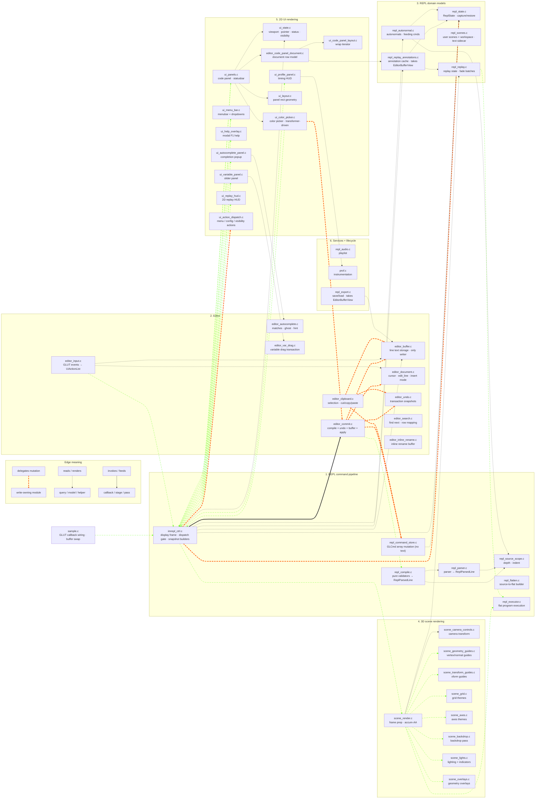

# REPL Module Guide — North Star

> **This document describes the *target* end-state**, not what
> `git ls-files` currently produces. It is the destination that
> `feature/editor-owns-text-completion.md` and
> `feature/editor-ownership-gap-cleanup.md` are landing toward. Treat it
> as the contract every new module must obey on entry and every legacy
> module must move toward.
>
> Files marked **(legacy name)** still live under their pre-rename
> identifier in the working tree. They will rename in
> `editor-ownership-gap-cleanup` Phase 5 with header redirects during
> the transition. Until then, the *responsibility* described here is
> binding even if the *file name* hasn't caught up.

For per-module detail and frame-pipeline narrative read
[`ARCHITECTURE.md`](ARCHITECTURE.md). For the staged cleanup plan see
[`feature/push-architecture-refinement.md`](feature/push-architecture-refinement.md)
and [`feature/editor-owns-text-completion.md`](feature/editor-owns-text-completion.md).

## Three-Layer Ownership Contract

```
Editor owns editable text, cursor, selection, navigation, and undo
transactions.

REPL owns validation / compilation of committed editor text into
command / state changes.

UI owns rendering and hit-testing, and emits editor actions rather
than mutating REPL / editor state directly.
```

Implications:

- **State is partitioned into three structs.** `ReplState` (program),
  `EditorState` (text + cursor + navigation + undo + selection +
  clipboard + autocomplete + search + drag transactions), `UiState`
  (viewport + pointer + visibility flags + transient chrome). All three
  live as static singletons in the controller.
- **REPL is a pure compiler.** Editor calls `repl_compile(text, ctx) →
  ParsedLine | error`. On success the editor writes its own buffer with
  the parser's normalized text, pushes onto its undo ring, and asks
  `repl_apply_*` to apply the parsed cmd to REPL state.
- **UI is a render + dispatch layer.** Render code consumes
  `UiRenderSnapshot` (already enforced); input handlers fill a
  `UiActionList` that `imrepl_ctrl_dispatch_action()` is the *only*
  legal mutation gate for.

## Repository Layout Rules

Source-backed modules keep paired `.c/.h` files at the repo root.
Header-only project helpers and vendored single-header dependencies
live under `include/`. Tests live under `tests/`, shared test helpers
under `tests/support/`, no-op GL headers under
`tests/gl-stubs/include/`.

`prof.c` is utility-like but compiled, so it stays as a root-level
source-backed module.

## Naming Conventions

| Prefix | Owns |
|---|---|
| `repl_*` | Program model: parser, eval, command-spec, source-scope, flatten, executor, command-store, compiler, autonormal, replay, replay-annotations, examples, export. **No editor / UI state.** |
| `editor_*` | Editable text, cursor, selection, navigation, undo, clipboard, search, autocomplete, drag transactions, commit orchestration, input router |
| `ui_*` | Render entry points, snapshot consumers, input handlers that emit `UiAction`, panel chrome |
| `scene_*` | 3D rendering, camera transforms, decorators, overlays |
| `imrepl_*` | App-frame controller, dispatch gate, snapshot builders |
| `prof`, `cmd_format` | Generic utilities |

Treat prefixes as ownership boundaries, not naming aesthetics. A file
that drifts across the boundary either renames or splits. The
`repl_audio` prefix is legacy and gets revisited in the namespace
audit.

## Adding Or Migrating An Owner Module

1. Decide which of the three contracts the module belongs to: REPL
   (program), Editor (text + session), or UI (render + dispatch).
2. Put live bytes in the matching state struct (`ReplState`,
   `EditorState`, or `UiState`) — never in a sidecar unless explicitly
   non-frame state (undo rings are a sidecar; user-scene slots are a
   sidecar; everything else lives in one of the three structs).
3. Mutations stay on the owner side. Renderers read snapshots only;
   render-time discoveries return through `Ui*Output` structs the
   controller actualizes back into state.
4. Extend ownership tests in the same change: `repl_state_capture()`,
   `editor_state_capture()`, `ui_state_capture()` and their `restore` /
   `reset_all` counterparts must stay current. Add focused behavior
   coverage in the module's own tests.

## Intended Frame Shape

```text
sample.c (future imrepl.c) glutDisplayFunc -> imrepl_ctrl_display_frame

  -> rebuild autonormals / flat program if dirty
  -> push editor snapshots                        [PROF_SNAPSHOT_OTHER]
       (transformers, highlights, virtual lines,
        annotation prepare)
  -> build SceneRenderConfig from ReplState       [PROF_SNAPSHOT_SCENE_CONFIG]
  -> build UiRenderSnapshot from Repl/Editor/Ui   [PROF_SNAPSHOT_UI]
  -> scene_render_3d_scene(&scene_cfg)            [PROF_SCENE_3D]
  -> ui_panels_render_code_panel(&ui_snap)        [PROF_CODE_PANEL]
  -> ui_*_render(&ui_snap) overlays               [PROF_UI_PANELS]
  -> ui_profile_panel_render(&ui_snap)
  -> restore transient replay/predef state

input event:
  GLUT callback -> imrepl_ctrl_dispatch_action(action)
                   -> on commit:
                        repl_compile(text, ctx) -> ParsedLine | error
                        on success:
                            editor_undo_push(prior)
                            editor_buffer_replace(idx, parsed.text)
                            repl_apply_replace(idx, parsed.cmd)
                   -> on REPL-side action: mutates ReplState
                   -> on editor-side action: mutates EditorState
                   -> on UI-side action: mutates UiState
```

`imrepl_ctrl` is the *only* dispatcher. UI input handlers fill
`UiActionList`; they do not mutate state.

## Responsibility Layers

### 1. REPL command pipeline — source → flatten → execute

The user's program. Edits land via `repl_apply_*`; downstream stages
consume the flattened array.

| Module | Role |
|--------|------|
| `imrepl_ctrl` | App-frame controller. Owns dispatch gate, snapshot builders, frame ordering. The only mutation point for input events |
| `repl_command_spec` | Declarative descriptors for fixed-arity GL-like commands |
| `repl_parser` | Source-line parser; returns `ReplParsedLine { GLCmd cmd; char text[] }` |
| `repl_source_scope` | Source prefix-depth cache, indent helpers, block lookup |
| `repl_compile` | Pure validators (`try_compile_float_decl`, `_for_loop`, `_func_def`, `_if_block`, `_close_brace`, `_var_assign`). Returns `ReplParsedLine` + error; never mutates |
| `repl_command_store` | `GLCmd` array mutation only — no text. `repl_apply_insert/replace/delete/load` are the sole API |
| `repl_flatten` | Source-to-flat program builder for loops, functions, `if` blocks |
| `repl_executor` | Narrow live-GL dispatch boundary for flat user geometry |
| `repl_eval` | Expression evaluator (recursive descent) |
| `cmd_format` | Pure indentation / depth computation |

`GLCmd` is a pure parse-result struct (type, args, flags, provenance).
Per-line text is never inside REPL state.

### 2. Editor — text, cursor, navigation, undo

The text editor model. Owns the editing buffer + every transient that
makes editing feel like editing.

| Module | Role |
|--------|------|
| `editor_input` *(was repl_editor.c — input router half)* | GLUT key/mouse callbacks; converts events into `UiActionList` and forwards to `imrepl_ctrl_dispatch_action` |
| `editor_commit` *(was repl_editor.c + repl_commit.c orchestration half)* | Coordinates `repl_compile` validation + `editor_undo_push` + `editor_buffer_*` writes + `repl_apply_*`. Single transaction boundary |
| `editor_buffer` *(new)* | Per-line canonical text mutation API: insert / replace / delete / load. The single owner of line-text storage |
| `editor_document` *(new — extracted from repl_editor.c)* | Cursor, edit_line, insert mode, pending newline, navigation primitives |
| `editor_undo` *(was repl_undo.c)* | Snapshot rings (text + cmds), atomic transaction boundaries, redo stack |
| `editor_clipboard` *(was repl_clipboard.c)* | Line selection anchors, copy / cut / paste with parallel `lines[][]` text sidecar |
| `editor_search` *(was repl_search.c)* | Search query + hit row/char tracking, find-next / find-prev navigation |
| `editor_autocomplete` *(was repl_autocomplete.c)* | Match list, ghost text, hint, mode tracking |
| `editor_inline_rename` *(was repl_inline_rename.c)* | Inline rename input buffer for scene names |
| `editor_var_drag` *(was repl_var_drag.c)* | Variable slider drag transaction; linear / log writeback |

The editor owns text. Anything that accepts a keystroke and ends up
changing on-screen line content lives here.

### 3. REPL domain models

State that's part of the program but not directly the source array.

| Module | Role |
|--------|------|
| `repl_state` | Owns `ReplState`. Capture / restore / reset_all entry points |
| `repl_config` | Config descriptor table backing menu toggles + persisted audio/render config |
| `repl_scenes` | User-scene slots, workspace directory, LRU eviction. Slots carry `cmds[]` + parallel `lines[][]` text sidecar |
| `repl_example_loader` | Built-in example loading and active tracking |
| `repl_examples` | Built-in example data |
| `repl_autonormal` | Auto-generated `glNormal3f` maintenance + feeding-cmd lookups |
| `repl_replay` | Replay state machine, replay PC / mode, fade / highlight inputs |
| `repl_replay_annotations` | Annotation cache + virtual-line refresh. `prepare(EditorBufferView)` takes the buffer view explicitly |
| `repl_debug` | Debug dump / diagnostic helpers |

These modules read text via `EditorBufferView` parameters when they
need it. None reach into editor state directly.

### 4. 3D scene rendering

`scene_*` owns the 3D frame and world / decorator passes. Reads
`SceneRenderConfig` and `FrameRenderContext`; never reads `ReplState`,
`EditorState`, or `UiState` directly.

| Module | Role |
|--------|------|
| `scene_render` | 3D frame setup, viewport, clear, projection, camera, accumulation loop, user-geometry execution point |
| `scene_render_types` | Scene config / context types, focus / guide snapshots, narrow execution hook |
| `scene_grid` | Grid theme rendering |
| `scene_axes` | Axes theme rendering |
| `scene_backdrop` | Backdrop / environment rendering |
| `scene_lights` | Scene lighting baseline + light indicators |
| `scene_overlays` | REPL-aware outlines, vertex labels, normal vectors |
| `scene_geometry_guides` | Vertex / primitive guide rendering from snapshots |
| `scene_transform_guides` | Transform guide rendering from snapshots |
| `scene_camera_controls` *(was repl_camera_controls.c)* | Scene camera transform application; mouse-driven nav lives in `EditorState.camera_nav` and dispatches `UI_ACTION_CAMERA_*` |
| `scene_transform_utils` | Small GL matrix helpers used by renderers |
| `scene_guides_shared` | Snapshot / planning types for REPL-aware 3D guides |
| `ui_replay_hud` | 2D replay HUD rendered from `SceneRenderConfig` (lives in UI layer, included here because it's adjacent to scene_render output) |

### 5. 2D UI rendering

`ui_*` owns screen-space drawing from a per-frame `UiRenderSnapshot`
and emits `UiAction` from input handlers.

| Module | Role |
|--------|------|
| `ui_snapshot` | `UiRenderSnapshot` definition; the read-only bundle the controller hands to every `ui_*_render*()` entry point |
| `ui_editor` | Editor-overlay snapshot family: `EditorTransformerList` (color / numeric inline editors), `EditorHighlightList` (feeding cmd + replay PC + search), `EditorVirtualLineList` (replay annotation rows) |
| `ui_action` *(new)* | `UiAction` / `UiActionKind` / `UiActionList` definitions. The UI → controller contract |
| `ui_action_dispatch` *(new — split from repl_actions.c)* | UI-flavored action dispatch: menu activation, config toggle, panel visibility |
| `ui_panels` | Code-panel rows, status banner. Render path consumes snapshot; input path emits `UiActionList` |
| `ui_layout` *(was repl_layout.c)* | Pure scene / code-panel rectangle geometry, no GL |
| `ui_code_panel_layout` *(was repl_code_panel_layout.c)* | Pure text wrapping model, no GL |
| `editor_code_panel_document` *(was repl_code_panel_document.c — owns scroll + hit-test, editor-state-shaped)* | Code-panel row / document model; reads from `EditorState` and `UiState` |
| `ui_menu_bar` | Menus, dropdowns, pinned buttons, search slot. Input emits `UiAction` |
| `ui_color_picker` | Floating HSV/alpha picker; render reads `EditorTransformer` snapshot, input emits `UI_ACTION_COLOR_PICKER_*` |
| `ui_help_overlay` | Modal F1 help. Visibility on `UiState` |
| `ui_variable_panel` | Floating variable slider panel. Visibility on `UiState`; render reads `EditorState.variable_drag` |
| `ui_autocomplete_panel` | Completion popup; reads `EditorState.autocomplete` |
| `ui_profile_panel` | CPU timing HUD |

`UiRenderSnapshot` is built once per frame by
`imrepl_ctrl_build_ui_snapshot()` and consumed by every `ui_*_render*()`
function. It carries pointer-shaped read-only views into `ReplState`,
`EditorState`, and `UiState`.

The `check-ui-no-repl-state-read` and `check-ui-renderer-takes-view`
Makefile guards enforce the snapshot-shaped signature for renderers.
The `check-ui-emits-actions-only` guard (Phase 4) forbids direct
mutation calls from UI input handlers.

### 6. Persistence, audio, instrumentation, lifecycle

| Module | Role |
|--------|------|
| `repl_export` | Save / load, typed export scaffold, workspace headers, code-panel dumps. Takes `EditorBufferView` for text |
| `repl_audio` | Legacy-named app-level playlist engine and persisted audio config |
| `prof` | Project-wide CPU timing instrumentation |
| `sample` *(future imrepl)* | Current `main()`, GLUT callback wiring, buffer swap |
| `gl_stub_counts` | `USE_GL_STUBS` symbol tracking for `tests/gl-stubs` headers |

## Ownership / Coordination Diagram

The coordination web that drives most refactor decisions, in the
post-cleanup arrangement. Cluster boxes match the responsibility layers
above; arrows show how the three contracts interact.

Three relationship kinds, each with a distinct stroke:

- `e1@==>` — delegated mutation / write-owning path (orange, animated).
- `-.->` — read / query / render dependency (default dotted).
- `i1@-->` — invoke / stage / dataflow path (green, animated).



**Reading the diagram:**

- All input flows through one path: GLUT callback → UI handler emits
  `UiAction` → `imrepl_ctrl` dispatches. There is no other mutation
  entry point.
- `ecommit` is the editor's transaction boundary. It calls `repl_compile`
  (pure), then atomically updates undo + buffer + cmd-store on success.
- `repl_command_store` mutates `GLCmd` arrays only; the editor buffer
  is mutated by `editor_buffer` exclusively.
- `repl_replay_annotations` and `repl_export` receive `EditorBufferView`
  through their APIs — they do not reach into editor state directly.
- UI render is dotted (read-only) all the way across. UI mutation is
  only via the orange edge to `imrepl_ctrl`.

## Boundary Rules

### Live OpenGL / GLU calls

Allowed:

```text
scene_*.c
ui_*.c (render only)
repl_executor.c
sample.c        future imrepl.c
```

Parser / spec / export / example modules may emit GL command names as
text. Not a live call.

### State boundaries

Three Makefile-enforced rules:

```text
check-views-no-owners
    scene_*.c and ui_*.c include only the *_views.h headers; never *_owners.h.

check-ui-no-repl-state-read
    ui_*_render*() functions take const UiRenderSnapshot *snap and read
    only from it.

check-ui-emits-actions-only            (Phase 4)
    ui_*.c input handlers do not call repl_action_*, repl_command_store_*,
    editor_*_mut*, repl_state_*_mut* directly. They emit UiAction.
```

### Layout geometry

`ui_layout.c` (was `repl_layout.c`) owns scene / code-panel rectangle
geometry. Non-UI callers include `ui_layout.h`.

### UI / scene independence

`ui_*` and `scene_*` should not include each other's headers. Shared
render-neutral helpers belong in explicit shared headers
(e.g. `scene_render_types.h`, `ui_snapshot.h`).

## Where To Put New Code

| Need | Home |
|---|---|
| New REPL syntax | `repl_parser`, `repl_command_spec`, `repl_compile`, `repl_flatten`, `repl_executor` |
| New user-geometry execution behavior | `repl_executor` |
| New 3D world decorator | `scene_*` |
| New 3D REPL-aware overlay | `scene_*`, consuming `FlatProgramView` or guide snapshots from `SceneRenderConfig` |
| New 2D UI render | `ui_*` (snapshot-only render path) |
| New 2D UI input handler | `ui_*` (emits `UiAction`) + new `UiActionKind` if needed |
| New per-frame scene/UI wiring | `imrepl_ctrl` |
| New app lifecycle / window wiring | `sample` (future `imrepl`) |
| New text-buffer mutation | `editor_buffer_*` |
| New cmd-array mutation | `repl_apply_*` (or `repl_command_store_*` for low-level shifts) |
| New editor session state | `EditorState` slice |
| New visibility flag / chrome bit | `UiState` slice |
| New header-only render helper | `include/` |

## Current Status vs. Target

This document describes the **target**. As of writing:

- Three-state split: **not yet** — slices live on `ReplRuntimeState`.
  `editor-ownership-gap-cleanup` Phase 1 carves them out.
- `repl_compile` / `repl_apply_*` API: **not yet** — `repl_commit.c`
  still mixes validation and mutation. Phase 3 splits.
- Editor-buffer single-writer: **not yet** —
  `repl_command_store_*_with_line[s]` writes both. Phase 2 drops the
  text-aware overload.
- `EditorBufferView` for REPL readers: **not yet** —
  `repl_replay_annotations.c` and `repl_export.c` reach into REPL
  state. Phase 2 converts to view parameters.
- `UiAction` dispatch: **not yet** — UI input handlers call mutators
  inline. Phase 4 introduces the dispatch gate.
- File renames: **not yet** — `repl_undo`, `repl_clipboard`, etc. still
  carry the legacy prefix. Phase 5 renames with redirect headers.

See `feature/editor-ownership-gap-cleanup.md` for the audit script and
baseline counts; that file tracks observed drift commit by commit.

## Open Refactor Edges

Phase 1 (refinement plan) is complete. Most of Phase 2 has landed (R1,
R2, R3, R4 controller-side, R5, R6, R7).
`feature/editor-owns-text.md` Steps 2–6 (data shape) is complete.

Outstanding tracks:

```
editor-ownership-gap-cleanup  three-layer ownership split (this plan)
R10-phase1                    reassess "stale" GLUT decls in repl_core.h
R10-ph2-5                     dissolve repl_core.c into natural owners
R11 (tail)                    shrink remaining allowlists (bench_repl.c)
R12                           consolidate public REPL APIs into one repl.h
R8                            sample → imrepl rename (mechanical, last)
R9                            optional: split repl_export.c
Color scheme + syntax         deferred sub-task of editor-owns-text Step 6
```

`feature/gold-standard-state-ownership.md`:

- Stage 0/1 (Makefile checks, capture/restore) — ✅ done.
- Stage 2 (by-value read getters) — ✅ broadly applied.
- Stage 3 (UI-facing leaf state) — ✅ once Phase 1 of this plan lands.
- Stage 4 (cursor-pixel `Ui*Output`) — ⚠️ partial.
- Stage 5 (medium slices) — ⚠️ partial.
- Stage 6 (`repl_undo` on top of `repl_state_capture()`) — ❌; this
  plan supersedes via `editor_state_capture()` symmetry.
- Stage 7 (UI snapshot purity) — ✅ render boundary done; input-bridge
  cleanup is Phase 4 of this plan.
- Stage 8 (collapse views/owners headers) — ❌; revisit after Phase 5
  rename.
