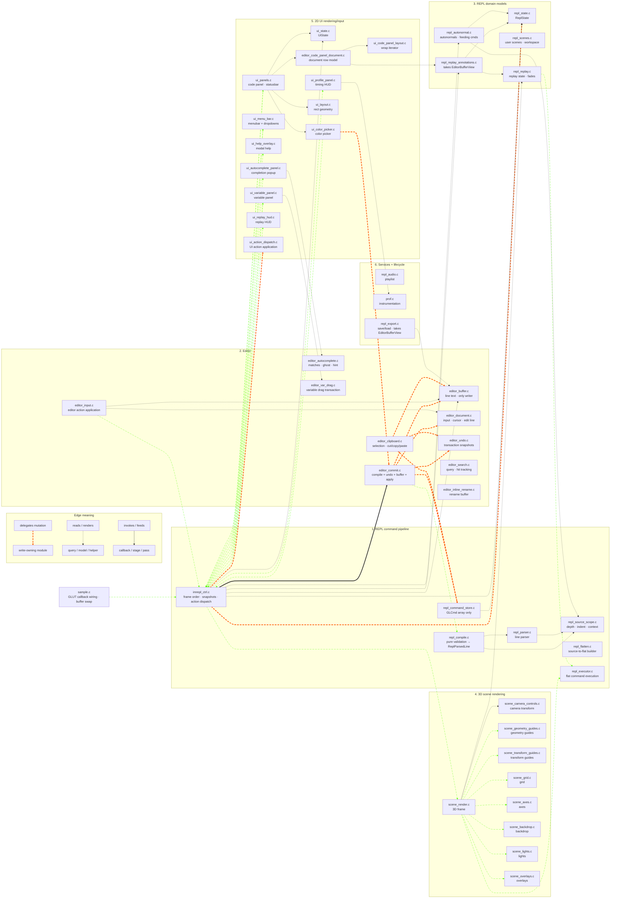

# REPL Module Guide — North Star

> **This document is the target ownership map.** It describes where the
> project is going, not necessarily the files that exist in the working
> tree today. New code should follow this contract immediately; legacy
> code should move toward it as the `editor-ownership-gap-cleanup` phases
> land.
>
> Files marked **(legacy name)** still have their old names today. They
> rename in Phase 5 with temporary redirect headers. Until then, the
> responsibility described here is binding even when the filename has not
> caught up.

For per-module detail and frame-pipeline narrative read
[`ARCHITECTURE.md`](ARCHITECTURE.md). For the staged cleanup plan see
[`feature/push-architecture-refinement.md`](feature/push-architecture-refinement.md)
and [`feature/editor-owns-text-completion.md`](feature/editor-owns-text-completion.md).

## Three-Layer Ownership Contract

```text
Editor owns editable text, cursor, selection, navigation, and undo
transactions.

REPL owns validation and compilation of committed editor text into
program state.

UI owns rendering and hit-testing. UI input handlers emit actions; they
do not mutate REPL or editor state directly.
```

Consequences:

- **State has three owners.** `ReplState` is the program. `EditorState`
  is the editing session. `UiState` is transient UI/session chrome.
  Their storage lives in their owner modules (`repl_state.c`,
  `editor_state.c`, `ui_state.c`). `imrepl_ctrl` orchestrates them; it
  does not become a dumping ground for their bytes.
- **REPL compiles; it does not edit.** The editor calls
  `repl_compile(text, ctx) -> ParsedLine | error`. On success, the
  editor writes its own text buffer and asks `repl_apply_*` to apply the
  parsed command to `ReplState`.
- **Editor commits are transactions.** A successful edit updates both
  editor text and REPL command state. A failed validation updates
  neither. Undo restores both sides together.
- **UI is input/output glue, not a state owner.** Renderers consume
  `UiRenderSnapshot`. Input handlers emit `UiActionList`. The controller
  dispatches those actions to the correct owner.

## State Owners

| State | Owns | Does not own |
|---|---|---|
| `ReplState` | Parsed command array, flat program, variables, replay, scenes, import/export metadata, persistent render/presentation config | Editable text, cursor, selection, search query, UI visibility, pointer/viewport chrome |
| `EditorState` | Editable text buffer, active input, cursor/edit-line, insert mode, selection, clipboard, search/autocomplete, undo/redo, editor transactions | Parsed command semantics, GL execution, menu chrome, transient status banners |
| `UiState` | Viewport, pointer, status text, help/profile/panel visibility, cursor blink/render-only UI state | Program model, editable text, command validation |

## Repository Layout Rules

Source-backed modules keep paired `.c/.h` files at the repo root.
Header-only project helpers and vendored single-header dependencies
live under `include/`. Tests live under `tests/`, shared test helpers
under `tests/support/`, no-op GL headers under
`tests/gl-stubs/include/`.

`prof.c` is utility-like but compiled, so it stays as a root-level
source-backed module.

## Naming Conventions

| Prefix | Owns |
|---|---|
| `repl_*` | Program model and compiler pipeline: parser, eval, command spec, source scope, compile, command store, flatten, executor, autonormal, replay, examples, export. **No editor or UI state.** |
| `editor_*` | Editing model: line text, active input, cursor, selection, navigation, undo/redo, clipboard, search, autocomplete, drag transactions, commit orchestration |
| `ui_*` | Screen-space rendering, layout/hit-test helpers, panel chrome, input handlers that emit `UiAction` |
| `scene_*` | 3D rendering, camera/view transforms, world decorators, scene overlays |
| `imrepl_*` | Application controller: frame ordering, snapshot builders, action dispatch gate, cross-owner orchestration |
| `prof`, `cmd_format` | Generic utilities with no ownership of REPL/editor/UI state |

Treat prefixes as ownership boundaries, not naming aesthetics. A file
that crosses a boundary either splits or moves. `repl_audio` is legacy
and gets revisited in the namespace audit.

## Adding Or Migrating An Owner Module

1. Pick the owner first: REPL program state, editor session state, or UI
   chrome/render state.
2. Put live state in that owner's state struct. Do not hide frame state in
   file-local globals unless it is truly non-frame side storage, such as
   an undo ring or persisted scene slot.
3. Keep mutations on the owner side. Renderers read snapshots only.
   Render-time discoveries return through output structs that the
   controller actualizes.
4. Update the ownership checks in the same change. The capture/restore /
   reset path for `ReplState`, `EditorState`, and `UiState` must stay in
   lockstep with the state layout.

## Intended Frame Shape

```text
sample.c (future imrepl.c) GLUT callback
  -> imrepl_ctrl_* callback wrapper
  -> UI/editor input handler builds UiActionList
  -> imrepl_ctrl_dispatch_actions(actions)
       -> UI action:     mutates UiState
       -> editor action: mutates EditorState
       -> REPL action:   mutates ReplState
       -> commit action:
            capture prior editor + REPL state for undo
            repl_compile(text, ctx) -> ParsedLine | error
            on error: leave editor text and REPL command state unchanged
            on success:
                editor_buffer_replace(idx, parsed.text)
                repl_apply_replace(idx, parsed.cmd)
                editor_undo_push(prior)

display frame:
  -> rebuild autonormals / flat program if dirty
  -> push editor/UI snapshots
       (transformers, highlights, virtual lines, annotations)
  -> build SceneRenderConfig from ReplState + view/session state
  -> build UiRenderSnapshot from ReplState + EditorState + UiState
  -> scene_render_3d_scene(&scene_cfg)
  -> ui_*_render(&ui_snap)
  -> restore transient replay/predef state
```

`imrepl_ctrl` is the only dispatcher. UI input handlers fill
`UiActionList`; they do not mutate state.

## Responsibility Layers

### 1. REPL command pipeline — source text → parsed commands → flat execution

The user's program. The editor submits text; the REPL validates it,
stores parsed commands, flattens control structures, and executes flat
commands.

| Module | Role |
|--------|------|
| `imrepl_ctrl` | Application controller. Owns frame order, snapshot construction, and action dispatch. It is the only input-event mutation gate |
| `repl_command_spec` | Declarative command descriptors for fixed-arity GL-like commands |
| `repl_parser` | Parses one source line into `ReplParsedLine { GLCmd cmd; char text[] }`; no storage ownership |
| `repl_source_scope` | Computes source depth, indentation, and block context used by compile/format paths |
| `repl_compile` | Pure validation layer. Converts proposed editor text + context into parsed command changes or diagnostics. Never mutates state |
| `repl_command_store` | Low-level `GLCmd` array mechanics only: insert, replace, delete, load. No text-buffer writes |
| `repl_flatten` | Builds the flat executable command stream from source commands, loops, functions, and `if` blocks |
| `repl_executor` | Narrow live-GL boundary that executes flat user geometry |
| `repl_eval` | Expression evaluator and predefined-variable lookup |
| `cmd_format` | Pure text/indent/depth formatting helpers |

`GLCmd` is a parse-result record: type, args, flags, provenance. It does
not carry source text. Per-line text belongs to `EditorState`.

### 2. Editor — text, cursor, navigation, commit, undo

The editor owns what the user is editing and the transaction that turns a
text edit into a committed program change.

| Module | Role |
|--------|------|
| `editor_input` *(legacy: part of `repl_editor.c`)* | Applies editor-facing input actions to cursor/text/navigation state. It is not the GLUT owner; GLUT enters through `imrepl_ctrl` |
| `editor_commit` *(legacy: `repl_editor.c` + mutation half of `repl_commit.c`)* | Transaction boundary for commits: compile, undo snapshot, text-buffer write, REPL apply, dirty-state updates |
| `editor_buffer` *(new)* | Sole writer for canonical per-line text: insert, replace, delete, load, clear |
| `editor_document` *(new)* | Active input buffer, cursor position, edit line, insert mode, pending newline, and navigation primitives |
| `editor_undo` *(legacy: `repl_undo.c`)* | Undo/redo transaction rings that restore editor text and REPL command state together |
| `editor_clipboard` *(legacy: `repl_clipboard.c`)* | Selection anchors plus copy/cut/paste payloads, including parallel text sidecars |
| `editor_search` *(legacy: `repl_search.c`)* | Search query, match tracking, row/char hits, next/previous navigation |
| `editor_autocomplete` *(legacy: `repl_autocomplete.c`)* | Completion matches, insertion candidates, ghost text, and hints |
| `editor_inline_rename` *(legacy: `repl_inline_rename.c`)* | Inline scene-name edit buffer and validation |
| `editor_var_drag` *(legacy: `repl_var_drag.c`)* | Variable-slider drag transaction and writeback policy |
| `editor_code_panel_document` *(legacy: `repl_code_panel_document.c`)* | Code-panel document row model, scroll state, hit-test mapping, and editor-visible line metadata |

If accepting a keystroke can change line text, cursor position, selection,
or undo history, the code belongs in the editor layer.

### 3. REPL domain models

Program-side state that is not the source command array itself.

| Module | Role |
|--------|------|
| `repl_state` | Owns `ReplState`: program state, capture/restore/reset for REPL-owned slices only |
| `repl_config` | Config descriptor table for menu toggles and persisted render/audio settings |
| `repl_scenes` | User-scene slots, workspace directory, LRU eviction, and scene-side command/text snapshots |
| `repl_example_loader` | Built-in example loading and active-example tracking |
| `repl_examples` | Built-in example source data |
| `repl_autonormal` | Auto-generated `glNormal3f` maintenance and feeding-command lookup |
| `repl_replay` | Replay state machine, replay PC/mode, fade batches, replay timing |
| `repl_replay_annotations` | Replay annotation cache and virtual-line production; takes `EditorBufferView` explicitly |
| `repl_debug` | Program/debug dump helpers; takes editor text views when it needs source text |

These modules may consume editor text through explicit
`EditorBufferView` parameters. They must not discover or mutate editor
state globally.

### 4. 3D scene rendering

`scene_*` owns the 3D view. Scene renderers consume snapshots/configs and
never read `ReplState`, `EditorState`, or `UiState` directly.

| Module | Role |
|--------|------|
| `scene_render` | 3D frame setup: viewport, clear, projection, camera, accumulation loop, user-geometry execution hook |
| `scene_render_types` | Scene config/context types and narrow callback interfaces |
| `scene_grid` | Grid rendering and grid themes |
| `scene_axes` | Axis rendering and axis themes |
| `scene_backdrop` | Backdrop/environment rendering |
| `scene_lights` | Baseline lighting and light indicators |
| `scene_overlays` | REPL-aware outlines, vertex labels, normal vectors, and selection-like overlays |
| `scene_geometry_guides` | Vertex/primitive guide rendering from snapshots |
| `scene_transform_guides` | Transform-guide rendering from snapshots |
| `scene_camera_controls` *(legacy: `repl_camera_controls.c`)* | Camera/view transform helpers. Input arrives as `UI_ACTION_CAMERA_*`; scene consumes final camera state through `SceneRenderConfig` |
| `scene_transform_utils` | Small GL matrix helpers used by renderers |
| `scene_guides_shared` | Shared guide snapshot/planning types for REPL-aware 3D overlays |

Scene code renders. It does not parse, edit, save, or dispatch UI actions.

### 5. 2D UI rendering and input

`ui_*` owns screen-space drawing and hit-testing. Render paths consume
snapshots. Input paths emit actions.

| Module | Role |
|--------|------|
| `ui_state` | Owns `UiState`: viewport, pointer, status text, panel visibility, cursor blink, transient chrome |
| `ui_snapshot` | Defines `UiRenderSnapshot`, the read-only bundle passed to every UI renderer |
| `ui_editor` | Editor-overlay snapshot types: transformers, highlights, virtual lines |
| `ui_action` *(new)* | Defines `UiActionKind`, `UiAction`, and `UiActionList`, the UI-to-controller contract |
| `ui_action_dispatch` *(new; split from `repl_actions.c`)* | Applies UI-facing actions such as menu activation, config toggles, visibility changes |
| `ui_panels` | Code-panel and status-banner rendering; input hit-tests emit `UiActionList` |
| `ui_layout` *(legacy: `repl_layout.c`)* | Pure scene/code-panel rectangle geometry |
| `ui_code_panel_layout` *(legacy: `repl_code_panel_layout.c`)* | Pure text wrapping and visual-line iteration |
| `ui_menu_bar` | Menu bar, dropdowns, pinned buttons, search entry, and menu hit-testing |
| `ui_color_picker` | Floating HSV/alpha picker; render reads transformer snapshots, input emits color actions |
| `ui_help_overlay` | Modal help overlay; visibility belongs to `UiState` |
| `ui_variable_panel` | Floating variable-slider panel; render reads variable/drag snapshots, input emits drag actions |
| `ui_autocomplete_panel` | Completion popup renderer |
| `ui_profile_panel` | CPU timing HUD renderer |
| `ui_replay_hud` | 2D replay HUD rendered from replay/scene snapshot data |

A UI renderer may draw. A UI input handler may hit-test and emit actions.
Neither may directly mutate REPL/editor state.

### 6. Persistence, audio, instrumentation, lifecycle

| Module | Role |
|--------|------|
| `repl_export` | Save/load, typed export scaffold, workspace headers, code-panel dumps. Takes `EditorBufferView` for source text |
| `repl_audio` | Legacy-named app-level playlist engine and persisted audio config |
| `prof` | Project-wide CPU timing instrumentation |
| `sample` *(future `imrepl`)* | Current `main()`, GLUT callback registration, buffer swap |
| `gl_stub_counts` | `USE_GL_STUBS` symbol tracking for `tests/gl-stubs` headers |

## Ownership / Coordination Diagram

The coordination diagram shows the post-cleanup target. Cluster names
match the responsibility layers above.

Relationship kinds:

- `e1@==>` — delegated mutation / write-owning path.
- `-.->` — read/query/render dependency.
- `i1@-->` — invoke/stage/dataflow path.



Reading the diagram:

- Input has one write path: UI/editor input emits actions;
  `imrepl_ctrl` dispatches them.
- `editor_commit` is the transaction boundary. It compiles without
  mutation, then updates undo, editor text, and REPL command state.
- `repl_command_store` mutates command arrays only. `editor_buffer`
  mutates line text only.
- `repl_replay_annotations` and `repl_export` receive
  `EditorBufferView`; they do not reach into editor state.
- UI render is read-only. UI mutation happens only by emitting actions.

## Boundary Rules

### Live OpenGL / GLU calls

Allowed:

```text
scene_*.c
ui_*.c render paths
repl_executor.c
sample.c        future imrepl.c
```

Parser/spec/export/example modules may emit GL command names as text.
That is not a live GL call.

### State boundaries

```text
check-views-no-owners
    scene_*.c and ui_*.c include view headers only; never owner headers.

check-ui-no-repl-state-read
    ui_*_render*() functions take const UiRenderSnapshot *snap and read
    only from it.

check-ui-emits-actions-only            (Phase 4)
    ui_*.c input handlers do not call repl_action_*, repl_command_store_*,
    editor_*_mut*, or repl_state_*_mut* directly. They emit UiAction.
```

### Layout geometry

`ui_layout.c` owns scene/code-panel rectangle geometry. Non-UI callers
may include `ui_layout.h` because the module is pure geometry, not UI
state.

### UI / scene independence

`ui_*` and `scene_*` should not include each other's headers. Shared
render-neutral types belong in explicit shared headers such as
`scene_render_types.h` or `ui_snapshot.h`.

## Where To Put New Code

| Need | Home |
|---|---|
| New REPL syntax | `repl_parser`, `repl_command_spec`, `repl_compile`, `repl_flatten`, `repl_executor` |
| New user-geometry execution behavior | `repl_executor` |
| New 3D world decorator | `scene_*` |
| New 3D REPL-aware overlay | `scene_*`, consuming snapshots/configs from `SceneRenderConfig` |
| New 2D UI render | `ui_*` render path, snapshot-only |
| New 2D UI input behavior | `ui_*` hit-test/action emission plus `UiActionKind` if needed |
| New cross-owner frame wiring | `imrepl_ctrl` |
| New app lifecycle/window wiring | `sample` now, future `imrepl` |
| New text-buffer mutation | `editor_buffer_*` |
| New editor cursor/navigation behavior | `editor_document` / `editor_input` |
| New commit behavior | `editor_commit` + pure `repl_compile` validator |
| New cmd-array mutation | `repl_apply_*`; low-level shifts stay inside `repl_command_store` |
| New editor session state | `EditorState` slice |
| New UI visibility/status/chrome state | `UiState` slice |
| New program/persistence state | `ReplState` slice |
| New header-only render helper | `include/` |

## Current Status vs. Target

This document describes the **target**. As of writing:

- Three-state split: **not yet** — slices live on `ReplRuntimeState`.
  `editor-ownership-gap-cleanup` Phase 1 carves them out.
- `repl_compile` / `repl_apply_*` API: **not yet** — `repl_commit.c`
  still mixes validation and mutation. Phase 3 splits.
- Editor-buffer single-writer: **not yet** —
  `repl_command_store_*_with_line[s]` writes both. Phase 2 drops the
  text-aware overload.
- `EditorBufferView` for REPL readers: **not yet** —
  `repl_replay_annotations.c` and `repl_export.c` reach into REPL
  state. Phase 2 converts to view parameters.
- `UiAction` dispatch: **not yet** — UI input handlers call mutators
  inline. Phase 4 introduces the dispatch gate.
- File renames: **not yet** — `repl_undo`, `repl_clipboard`, etc. still
  carry the legacy prefix. Phase 5 renames with redirect headers.

See `feature/editor-ownership-gap-cleanup.md` for the audit script and
baseline counts; that file tracks observed drift commit by commit.

## Open Refactor Edges

Phase 1 of the earlier refinement plan is complete. Most of refinement
Phase 2 has landed (R1, R2, R3, R4 controller-side, R5, R6, R7).
`feature/editor-owns-text.md` Steps 2–6 completed the data-shape half of
editor-owned text.

Outstanding tracks:

```text
editor-ownership-gap-cleanup  three-layer ownership split (this plan)
R10-phase1                    reassess "stale" GLUT decls in repl_core.h
R10-ph2-5                     dissolve repl_core.c into natural owners
R11 (tail)                    shrink remaining allowlists (bench_repl.c)
R12                           consolidate public REPL APIs into one repl.h
R8                            sample -> imrepl rename (mechanical, last)
R9                            optional: split repl_export.c
Color scheme + syntax         deferred sub-task of editor-owns-text Step 6
```

`feature/gold-standard-state-ownership.md`:

- Stage 0/1 (Makefile checks, capture/restore) — done.
- Stage 2 (by-value read getters) — broadly applied.
- Stage 3 (UI-facing leaf state) — complete once Phase 1 of this plan
  lands.
- Stage 4 (cursor-pixel `Ui*Output`) — partial.
- Stage 5 (medium slices) — partial.
- Stage 6 (`repl_undo` on top of `repl_state_capture()`) — superseded by
  `editor_state_capture()` symmetry.
- Stage 7 (UI snapshot purity) — render boundary done; input-bridge
  cleanup is Phase 4 of this plan.
- Stage 8 (collapse views/owners headers) — revisit after Phase 5 rename.
