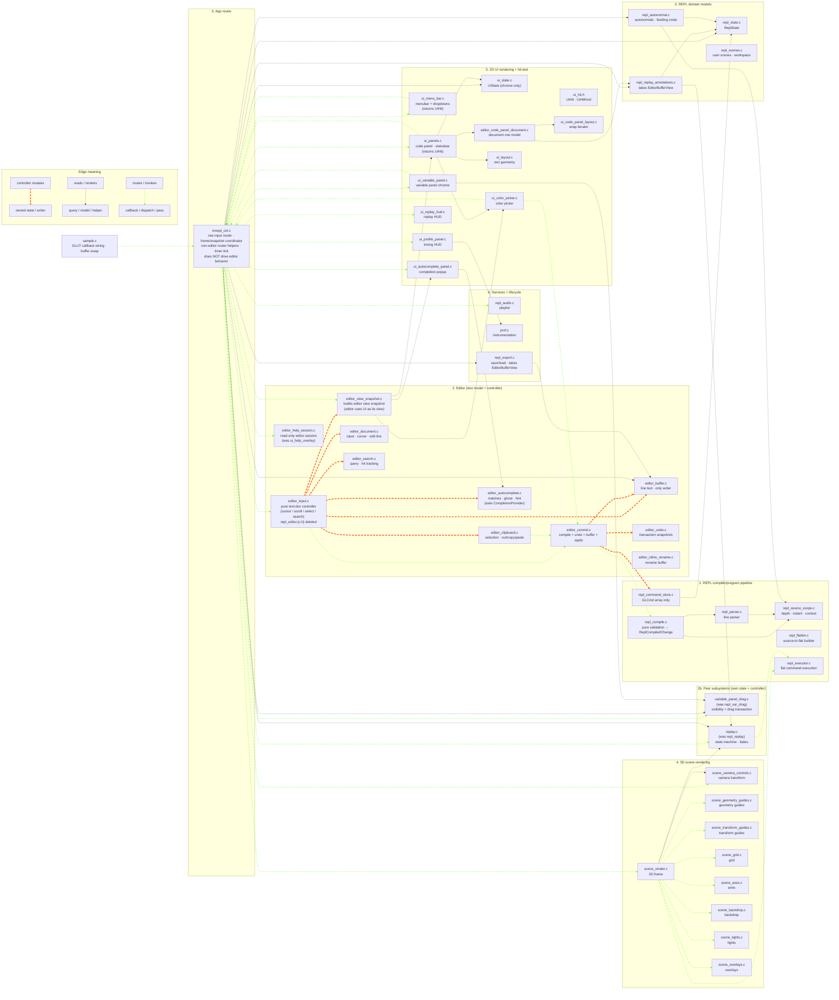

# REPL Module Guide — North Star

> **This document is the target ownership map.** The
> `editor-ownership-gap-cleanup` branch landed Phases A–J2 and the
> tree now matches the contract described here. Two filename
> deferrals remain (`repl_camera_controls`, `repl_actions` —
> waiting on the scene/viewport split and the app-shell namespace
> work; `repl_commit` and `repl_editor` are both deleted entirely)
> and a small number of ratchets continue to drive transitional
> uses toward zero. New code follows this contract directly.

For per-module detail and frame-pipeline narrative read
[`ARCHITECTURE.md`](ARCHITECTURE.md). For the staged cleanup plan see
[`feature/push-architecture-refinement.md`](feature/push-architecture-refinement.md)
and [`feature/editor-owns-text-completion.md`](feature/editor-owns-text-completion.md).

## Four-Role Ownership Contract

```text
Editor = text model + controller.
    Owns text-document behavior: editable source text, read-only text documents,
    cursor, selection, scroll, search, autocomplete state, clipboard, undo/redo,
    cursor blink, keyboard/mouse handling for text documents, and source commit
    orchestration.

    The editor uses UI as its view. It exposes editor snapshots for UI to render,
    and it consumes neutral UI hit-test results to interpret mouse/pointer input.
    UI does not decide text behavior.

UI = view + hit-test/render services.
    Provides the view for the editor and other subsystems. Draws glyphs,
    highlights, gutters, panels, widgets. Measures text. Hit-tests visual
    rows/chars/buttons/swatches/sliders. Returns neutral UiHit results.
    Does not own text behavior or editor state.

REPL = validator/compiler for committed source.
    Given proposed source text + context, returns ReplCompiledChange or diagnostic.
    Does not own editor state. Does not own UI state. Does not write editor text.
    Does not call set_status.

imrepl_ctrl = thin router + frame/snapshot coordinator.
    Receives raw GLUT events, determines focus/region, asks UI for hit-test
    results, routes events to the owning subsystem, builds snapshots, and relays
    diagnostics/status messages. It does not implement editor behavior and does
    not drive the editor UI.
```

The key distinction:

```text
The editor drives text-document UI behavior.
The editor uses UI as its view.
imrepl_ctrl routes the event.
UI draws, measures, and hit-tests.
```

## Editor Uses UI As Its View

The editor is the model/controller for text documents. UI is the view
layer the editor uses to present that model and to map pixels back to
document positions.

```text
EditorState
  -> editor_build_view_snapshot(...)
  -> UI renders text, highlights, cursor, gutters, overlays, popup geometry

Mouse/pointer input
  -> UI hit-tests visual geometry and returns UiHit
  -> imrepl_ctrl routes the event + UiHit to the editor
  -> editor interprets the hit in terms of text-document behavior
```

UI can know about rectangles, rows, columns, glyph bounds, swatches,
and panel regions. UI should not know that Ctrl+G means search, that
Tab accepts an autocomplete candidate, that scrolling should follow
the cursor, or that a source-line edit requires a REPL commit. Those
are editor decisions.

The editor should not render glyphs or duplicate hit-test math. It
asks UI for view services. But UI should not own editor state or
editor policy.

```text
Editor model/controller:  what the text document is and how editing behaves
UI view:                  how that document appears and where the user clicked
imrepl_ctrl router:       which subsystem receives this event
REPL compiler:             whether committed source text is valid
```

Consequences:

- **State has three owners.** `ReplState` is the program. `EditorState`
  is the text-document session. `UiState` is transient UI/session
  chrome. Their storage lives in their owner modules (`repl_state.c`,
  `editor_state.c`, `ui_state.c`). `imrepl_ctrl` orchestrates them; it
  does not become a dumping ground for their bytes.
- **REPL compiles; it does not edit.** The editor calls
  `repl_compile(text, ctx) -> ReplCompiledChange | error`. On success,
  the editor writes its own text buffer and asks `repl_apply_*` to
  apply the parsed command to `ReplState` — both inside one editor
  undo transaction.
- **Editor commits are transactions.** A successful edit updates both
  editor text and REPL command state. A failed validation updates
  neither. Undo restores both sides together.
- **UI is view + hit-test, not a controller.** Renderers consume
  `UiRenderSnapshot`. Input handlers compute a `UiHit` and return.
  `imrepl_ctrl` dispatches based on `UiHit.kind`. There is no central
  dispatch enum; the editor and the peer subsystems are each their
  own controller.
- **Variable panel and replay are peer subsystems**, not slices of the
  editor. They have their own state + controllers. The editor doesn't
  know they exist. UI may render them; their input routes to them.
- **Read-only documents are also editor sessions.** The help overlay
  becomes a read-only editor session backed by a content provider —
  same scroll/search/cursor model as code editing, no commit path.

## State Owners

| State | Owns | Does not own |
|---|---|---|
| `ReplState` | Parsed command array, flat program, variables, scenes, import/export metadata, persistent render/presentation config | Replay runtime state (peer), variable-panel state (peer), help-session state (peer), editable text, cursor, selection, search query, UI visibility, pointer/viewport chrome |
| `EditorState` | Editable text buffer, active input, cursor/edit-line, insert mode, selection, clipboard, search/autocomplete, scroll, **cursor blink** (the editor controls cursor visibility/blink — UI just renders), undo/redo, editor transactions | Variable-panel drag (now on the variable_panel peer), parsed command semantics, GL execution, menu chrome, transient status banners, render-output pixel coordinates |
| `UiState` | Viewport, pointer, status text TTL, help-overlay visibility (chrome flag), profile-panel visibility, panel-divider geometry (panel_frac + resizing_panel), camera viewport pose | Help-session tab/scroll (peer), variable-panel state (peer), program model, editable text, command validation, cursor blink (editor owns), per-frame render-output (uses `Ui*Output`) |
| `variable_panel` peer | Variable-panel visibility flag + slider drag transaction (var_idx, log_mode, start_value, start_x). Storage in `variable_panel.c`. | Editor text behavior, REPL grammar |
| `replay` peer | Replay state machine: PC, mode, speed, accum, fade speed, src_line_idx, total_flat_cmds, expand_args. Storage in `replay_state.c`. | Editor text behavior, REPL grammar |
| `editor_help_session` peer | Help-overlay session state: tab_idx, scroll. Storage in `editor_help_session.c`. Visibility flag stays on `UiState.help` as chrome. | Help content (provided by content provider) |

> Legacy forwarders (`ui_state_variable_panel*`, `editor_state_variable_drag*`,
> `repl_state_replay*`) still resolve via shims in their original
> headers so test fixtures keep compiling. Production callers go
> through the peer accessors directly. The forwarders are tracked
> by `check-variable-panel-forwarders` (baseline 87) and
> `check-replay-forwarders` (baseline 37) and ratchet toward zero
> as the test harness migrates.

## Repository Layout Rules

Source-backed modules keep paired `.c/.h` files at the repo root.
Header-only project helpers and vendored single-header dependencies
live under `include/`. Tests live under `tests/`, shared test helpers
under `tests/support/`, no-op GL headers under
`tests/gl-stubs/include/`.

`prof.c` is utility-like but compiled, so it stays as a root-level
source-backed module.

## Naming Conventions

| Prefix | Owns |
|---|---|
| `repl_*` | Program model and compiler pipeline: parser, eval, command spec, source scope, compile, command store, flatten, executor, autonormal, examples, export. **No editor or UI state. No replay runtime state (that lives on the `replay` peer).** |
| `editor_*` | Text-document model + controller: line text, active input, cursor, scroll, selection, navigation, undo/redo, clipboard, search, autocomplete, cursor blink, commit orchestration. Includes read-only document sessions (e.g. help) backed by a content provider |
| `ui_*` | Screen-space rendering and hit-test/measurement services. Renderers consume snapshots; input handlers compute neutral `UiHit` results and return them. **Does not own state. Does not dispatch.** |
| `scene_*` | 3D rendering, camera/view transforms, world decorators, scene overlays. Camera input routes through `imrepl_ctrl` to scene/viewport controller |
| `imrepl_*` | Application router: GLUT callback registration, frame ordering, snapshot builders, raw-input → owning-subsystem dispatch (based on `UiHit.kind` / focus), diagnostic relay from REPL to editor + status |
| `variable_panel_*` | Peer subsystem: variable-slider visibility + drag transaction + writeback policy. Owns its own state |
| `replay_*` | Peer subsystem: replay state machine, PC, mode, fade batches |
| `prof`, `cmd_format` | Generic utilities with no ownership of REPL/editor/UI state |

Treat prefixes as ownership boundaries, not naming aesthetics. A file
that crosses a boundary either splits or moves. `repl_audio` is legacy
and gets revisited in the namespace audit.

## Adding Or Migrating An Owner Module

1. Pick the owner first: REPL program state, editor session state, or UI
   chrome/render state.
2. Put live state in that owner's state struct. Do not hide frame state in
   file-local globals unless it is truly non-frame side storage, such as
   an undo ring or persisted scene slot.
3. Keep mutations on the owner side. Renderers read snapshots only.
   Render-time discoveries return through output structs that the
   controller actualizes.
4. Update the ownership checks in the same change. The capture/restore /
   reset path for `ReplState`, `EditorState`, and `UiState` must stay in
   lockstep with the state layout.

## Intended Frame Shape

```text
sample.c (future imrepl.c) GLUT callback
  -> imrepl_ctrl_* callback wrapper                  (routing role)
  -> UI hit-test:  ui_panels_hit_test(snap, mx, my) -> UiHit
  -> imrepl_ctrl dispatches on UiHit.kind to the OWNING subsystem:

       UI_HIT_CODE_TEXT     -> editor_handle_*(editor, raw_event, hit)
                                (cursor / scroll / selection / search /
                                 autocomplete / clipboard / undo /
                                 commit — editor controls all of these)
       UI_HIT_CODE_GUTTER   -> editor_handle_gutter(editor, hit)
       UI_HIT_HELP_PANEL    -> editor_help_session_handle_*(...)
                                (read-only editor session: scroll /
                                 search; no commit path)
       UI_HIT_COLOR_SWATCH  -> editor commit path (rewrites source text)
       UI_HIT_VARIABLE_SLIDER -> variable_panel_handle_*(...)
                                (peer subsystem — drag transaction)
       UI_HIT_REPLAY_BUTTON -> replay_handle_*(...)
                                (peer subsystem — toggle / step)
       UI_HIT_MENU_ITEM     -> imrepl_menu_route(...)
       UI_HIT_NONE          -> camera/viewport drag if over scene
                                -> scene_camera_handle_*(...)

Editor commit path (the only thing that crosses into REPL):
  ReplCompiledChange change;
  if (repl_compile(text, ctx, &change, err) != REPL_COMPILE_OK) {
      editor_record_diagnostic(err);
      imrepl_ctrl_set_status(err);    /* controller writes status */
      /* nothing else mutates */
  } else {
      editor_undo_begin_transaction();
        editor_buffer_apply(&change);          /* lines[][] only */
        repl_apply_compiled_change(&change);   /* cmds[]  only */
      editor_undo_commit_transaction();        /* atomic boundary */
      if (change.commit_message[0])
          imrepl_ctrl_set_status(change.commit_message);
  }

Display frame:
  -> rebuild autonormals / flat program if dirty
  -> push editor/UI snapshots
       (transformers, highlights, virtual lines, annotations)
  -> build SceneRenderConfig from ReplState + view/session state
  -> build UiRenderSnapshot from ReplState + EditorState + UiState
       + peer subsystem state (variable panel, replay)
  -> scene_render_3d_scene(&scene_cfg)
  -> ui_*_render(&ui_snap)               (snapshot-only; no state mutation)
  -> restore transient replay/predef state
```

`imrepl_ctrl` routes raw input to the right subsystem. The editor and
the peer subsystems are each their own controller — there is no
central dispatch enum and no "UI emits actions" layer.

## Responsibility Layers

### 1. REPL command pipeline — source text → parsed commands → flat execution

The user's program. The editor submits text; the REPL validates it,
stores parsed commands, flattens control structures, and executes flat
commands.

| Module | Role |
|--------|------|
| `imrepl_ctrl` | Application controller and input router. Owns frame order, snapshot construction, action dispatch, timer tick, and non-editor input routing (`imrepl_ctrl_router_*` helpers route replay, audio, config, save, camera, variable panel, scene press, scroll-wheel zoom to their owning subsystems). It is the only input-event mutation gate |
| `repl_command_spec` | Declarative command descriptors for fixed-arity GL-like commands |
| `repl_parser` | Parses one source line into `ReplParsedLine { GLCmd cmd; char text[] }`; no storage ownership |
| `repl_source_scope` | Computes source depth, indentation, and block context used by compile/format paths |
| `repl_compile` | Pure validation layer. Converts proposed editor text + context into parsed command changes or diagnostics. Never mutates state |
| `repl_command_store` | Low-level `GLCmd` array mechanics only: insert, replace, delete, load. No text-buffer writes |
| `repl_flatten` | Builds the flat executable command stream from source commands, loops, functions, and `if` blocks |
| `repl_executor` | Narrow live-GL boundary that executes flat user geometry |
| `repl_eval` | Expression evaluator and predefined-variable lookup |
| `cmd_format` | Pure text/indent/depth formatting helpers |

`GLCmd` is a parse-result record: type, args, flags, provenance. It does
not carry source text. Per-line text belongs to `EditorState`.

### 2. Editor — text, cursor, navigation, commit, undo

The editor owns what the user is editing and the transaction that turns a
text edit into a committed program change.

| Module | Role |
|--------|------|
| `editor_input` | Editor's pure text-document controller. Receives key/mouse events from `imrepl_ctrl` only after the controller has already filtered out non-editor concerns (replay, audio, config, save, camera, variable panel, scene press, scroll-wheel zoom). Mutates `EditorState` directly: cursor, selection, scroll, search, autocomplete navigation, clipboard, undo. Also exposes hit-test predicates (`editor_input_point_in_code_panel`, etc.) and the `ReplInputDispatchEffects` accumulation API that the controller consumes. `repl_editor.{c,h}` is deleted; this module is the sole dispatch boundary |
| `editor_commit` | Transaction boundary for commits: compile, undo snapshot, text-buffer write, REPL apply, dirty-state updates |
| `editor_buffer` *(new)* | Sole writer for canonical per-line text: insert, replace, delete, load, clear |
| `editor_document` *(new)* | Active input buffer, cursor position, edit line, insert mode, pending newline, and navigation primitives |
| `editor_undo` | Undo/redo transaction rings that restore editor text and REPL command state together |
| `editor_clipboard` | Selection anchors plus copy/cut/paste payloads, including parallel text sidecars |
| `editor_search` | Search query, match tracking, row/char hits, next/previous navigation |
| `editor_autocomplete` | Completion popup state, ghost text, hints. Asks a registered `EditorCompletionProvider` for candidates — does *not* know about variables or GL command names directly |
| `editor_inline_rename` | Inline scene-name edit buffer and validation |
| `editor_help_session` | Read-only editor session backed by a help-text content provider. Uses the same scroll/search/cursor model as code editing; no commit path. Help visibility flag stays on `UiState` |
| `editor_code_panel_document` | Code-panel document row model, scroll state, hit-test mapping, and editor-visible line metadata |

If accepting a keystroke can change line text, cursor position, scroll,
selection, search/autocomplete state, or undo history, the code belongs
in the editor layer.

### 2b. Peer subsystems (carved out of editor / UI)

Variable panel and replay are *not* part of the editor and *not* part
of UI. They are independent subsystems with their own state +
controllers; UI may render them; their input routes to them through
`imrepl_ctrl`.

| Module | Role |
|--------|------|
| `variable_panel` | Peer subsystem: owns visibility flag + slider drag transaction in a single `VariablePanelState`. Storage lives in `variable_panel.c`. |
| `variable_panel_drag` | Implementation behind `variable_panel`'s drag transaction (begin/motion/reset, value writeback, source-line rewrite). Reads/writes through `variable_panel_drag_mut()`; legacy `repl_var_drag_*` symbol surface ratchets toward zero |
| `replay_state` | Peer subsystem: owns `ReplReplayRuntimeState` storage in `replay_state.c`. Narrow accessors (`replay_active`, `replay_pc`, `replay_mode`, …) plus `replay_state_view()` for the per-frame snapshot fill |
| `replay` | Replay state machine implementation behind `replay_state`: PC stepping, mode toggling, fade batches. Routes via `replay_handle_pin_clicked` / `replay_handle_key` / `replay_handle_special` |
| `editor_help_session` | Peer subsystem: read-only editor session for the help overlay (tab_idx, scroll). Visibility flag stays on `UiState.help` as chrome |

Peer subsystems may *produce* overlays consumed by the editor (replay
annotations are virtual lines the editor can render). They do not
*become* editor-owned.

### 3. REPL domain models

Program-side state that is not the source command array itself.

| Module | Role |
|--------|------|
| `repl_state` | Owns `ReplState`: program state, capture/restore/reset for REPL-owned slices only |
| `repl_config` | Config descriptor table for menu toggles and persisted render/audio settings |
| `repl_scenes` | User-scene slots, workspace directory, LRU eviction, and scene-side command/text snapshots |
| `repl_example_loader` | Built-in example loading and active-example tracking |
| `repl_examples` | Built-in example source data |
| `repl_autonormal` | Auto-generated `glNormal3f` maintenance and feeding-command lookup |
| `repl_replay` | Replay state machine, replay PC/mode, fade batches, replay timing |
| `repl_replay_annotations` | Replay annotation cache and virtual-line production; takes `EditorBufferView` explicitly |
| `repl_debug` | Program/debug dump helpers; takes editor text views when it needs source text |

These modules may consume editor text through explicit
`EditorBufferView` parameters. They must not discover or mutate editor
state globally.

### 4. 3D scene rendering

`scene_*` owns the 3D view. Scene renderers consume snapshots/configs and
never read `ReplState`, `EditorState`, or `UiState` directly.

| Module | Role |
|--------|------|
| `scene_render` | 3D frame setup: viewport, clear, projection, camera, accumulation loop, user-geometry execution hook |
| `scene_render_types` | Scene config/context types and narrow callback interfaces |
| `scene_grid` | Grid rendering and grid themes |
| `scene_axes` | Axis rendering and axis themes |
| `scene_backdrop` | Backdrop/environment rendering |
| `scene_lights` | Baseline lighting and light indicators |
| `scene_overlays` | REPL-aware outlines, vertex labels, normal vectors, and selection-like overlays |
| `scene_geometry_guides` | Vertex/primitive guide rendering from snapshots |
| `scene_transform_guides` | Transform-guide rendering from snapshots |
| `scene_camera_controls` *(legacy: `repl_camera_controls.c`)* | Camera/view transform helpers. Input arrives as `UI_ACTION_CAMERA_*`; scene consumes final camera state through `SceneRenderConfig` |
| `scene_transform_utils` | Small GL matrix helpers used by renderers |
| `scene_guides_shared` | Shared guide snapshot/planning types for REPL-aware 3D overlays |

Scene code renders. It does not parse, edit, save, or dispatch UI actions.

### 5. 2D UI rendering and hit-test

`ui_*` owns screen-space drawing and hit-testing. Render paths consume
snapshots. Input paths return neutral `UiHit` results to `imrepl_ctrl`,
which dispatches to the owning subsystem. UI does **not** own state and
does **not** dispatch.

| Module | Role |
|--------|------|
| `ui_state` | Owns `UiState`: viewport, pointer, status text TTL, panel visibility, panel-divider geometry, camera viewport pose. *Not* cursor blink (that's editor) |
| `ui_snapshot` | Defines `UiRenderSnapshot`, the read-only bundle passed to every UI renderer |
| `ui_editor` | Editor-overlay snapshot types: transformers, highlights, virtual lines |
| `ui_hit` *(new — replaces `ui_action`)* | Defines `UiHitKind` + `UiHit`, the passive UI → controller contract. UI hit-test functions return `UiHit`; `imrepl_ctrl` dispatches on it |
| `ui_panels` | Code-panel and status-banner rendering; input hit-tests return `UiHit` |
| `ui_layout` | Pure scene/code-panel rectangle geometry |
| `ui_code_panel_layout` | Pure text wrapping and visual-line iteration |
| `ui_menu_bar` | Menu bar, dropdowns, pinned buttons, search entry, and menu hit-testing |
| `ui_color_picker` | Floating HSV/alpha picker; render reads transformer snapshots, input returns `UI_HIT_COLOR_SWATCH` (commit path runs through editor) |
| `ui_variable_panel` | Renderer for the variable-slider panel (the panel chrome — the *peer subsystem* owns drag/visibility state). Input returns `UI_HIT_VARIABLE_SLIDER` |
| `ui_autocomplete_panel` | Completion popup renderer; reads `EditorState.autocomplete` |
| `ui_profile_panel` | CPU timing HUD renderer |
| `ui_replay_hud` | 2D replay HUD; reads replay peer subsystem state through snapshot |

Files no longer in this layer:

- `ui_help_overlay` → `editor_help_session` (read-only editor session;
  see Layer 2). The visibility *flag* stays in `UiState`; the document
  *content + scroll + search* moves into editor session state.
- `ui_action` / `ui_action_dispatch` (planned but never landed) — the
  corrected contract uses `UiHit` (passive) instead of `UiAction`
  (dispatch enum), so these modules are not introduced.

A UI renderer may draw. A UI input handler may hit-test and return a
`UiHit`. Neither may directly mutate REPL / editor / peer-subsystem
state.

### 6. Persistence, audio, instrumentation, lifecycle

| Module | Role |
|--------|------|
| `repl_export` | Save/load, typed export scaffold, workspace headers, code-panel dumps. Takes `EditorBufferView` for source text |
| `repl_audio` | Legacy-named app-level playlist engine and persisted audio config |
| `prof` | Project-wide CPU timing instrumentation |
| `sample` *(future `imrepl`)* | Current `main()`, GLUT callback registration, buffer swap |
| `gl_stub_counts` | `USE_GL_STUBS` symbol tracking for `tests/gl-stubs` headers |

## Ownership / Coordination Diagram

The coordination diagram shows the post-cleanup target under the
M/V/C+compiler+router contract. UI returns neutral `UiHit` results;
`imrepl_ctrl` dispatches to the owning subsystem; the editor and the
peer subsystems are each their own controller. There is no central
`UiAction` dispatch enum.

Relationship kinds:

- `e1@==>` — delegated mutation / write-owning path (subsystem
  controller mutating its own state).
- `-.->` — read/query/render dependency.
- `i1@-->` — invoke/route/dataflow path (raw event routing or
  function-call invocation across subsystem boundaries).



Reading the diagram:

- Input flows in one direction: GLUT → `imrepl_ctrl` → owning
  subsystem. UI computes a passive `UiHit` along the way; it never
  mutates state. There is no central dispatch enum.
- The editor and the peer subsystems (variable_panel, replay) are
  each their own controller. They mutate their own state directly
  (orange edges stay *inside* their cluster).
- `editor_commit` is the only path that crosses into REPL via
  `repl_compile`. On success it updates undo + buffer + cmd-store as
  one transaction. On failure nothing mutates.
- `repl_compile` is pure: incoming dotted edges only (reads parser +
  scope), no outgoing mutation edges. `repl_command_store` mutates
  command arrays only; `editor_buffer` mutates line text only.
- `repl_replay_annotations` and `repl_export` receive
  `EditorBufferView`; they do not reach into editor state.
- UI render is read-only. UI input is hit-test-and-return.

## Boundary Rules

### Live OpenGL / GLU calls

Allowed:

```text
scene_*.c
ui_*.c render paths
repl_executor.c
sample.c        future imrepl.c
```

Parser/spec/export/example modules may emit GL command names as text.
That is not a live GL call.

### State boundaries

```text
check-views-no-owners
    scene_*.c and ui_*.c include view headers only; never owner headers.

check-ui-no-repl-state-read
    ui_*_render*() functions take const UiRenderSnapshot *snap and read
    only from it.

check-ui-returns-hits-only             (Phase 4 — replaces the planned
                                        check-ui-emits-actions-only)
    ui_*.c input handlers do not call repl_action_*, repl_command_store_*,
    editor_*_mut*, repl_state_*_mut*, or peer-subsystem mutators
    directly. They compute a UiHit and return it. The corrected
    contract has imrepl_ctrl dispatch on UiHit.kind to the owning
    subsystem; UI does not own dispatch. Baseline 5 (lowered from
    8 in Phase J2.2 once the controller took over code-panel press,
    drag, menu activation, and color-picker open/close/press/motion/
    release dispatch).

check-ui-panels-no-mutators            (Phase J2.2 hard guard)
    ui_panels.c is hit-test only. The legacy code-panel press / click /
    drag / release / scene-press / motion / mouse-release / escape
    forwarders + color-picker open/close/press/motion/release + replay
    pin + search + menu open/close/activate calls are all routed by
    imrepl_ctrl. Any reappearance fails the build with no allowlist.

check-imrepl-not-editor-mirror         (Phase 4)
    imrepl_ctrl must not accumulate one wrapper per editor operation.
    New editor behavior belongs behind editor_handle_* or editor_*
    APIs. imrepl_ctrl routes raw input to the owning subsystem and
    builds frame snapshots; it does not implement editor behavior or
    duplicate the editor's API surface.

check-no-repl-editor-input-shim        (Phase J1)
    editor_input.c must not include the deleted repl_editor.h or call
    legacy repl_*_func dispatch bodies. The input dispatch boundary
    is closed: editor_input.c handles editor-text-model concerns only;
    non-editor routing lives in imrepl_ctrl_router_* helpers.

check-editor-ownership-budget          (landed commit 11)
    Ratchets the transitional ui-forwarder line count in repl_state.c
    and the ui_state.h -> repl_state_views.h include count strictly
    downward.
```

### Layout geometry

`ui_layout.c` owns scene/code-panel rectangle geometry. Non-UI callers
may include `ui_layout.h` because the module is pure geometry, not UI
state.

### UI / scene independence

`ui_*` and `scene_*` should not include each other's headers. Shared
render-neutral types belong in explicit shared headers such as
`scene_render_types.h` or `ui_snapshot.h`.

## Where To Put New Code

| Need | Home |
|---|---|
| New REPL syntax | `repl_parser`, `repl_command_spec`, `repl_compile`, `repl_flatten`, `repl_executor` |
| New user-geometry execution behavior | `repl_executor` |
| New 3D world decorator | `scene_*` |
| New 3D REPL-aware overlay | `scene_*`, consuming snapshots/configs from `SceneRenderConfig` |
| New 2D UI render | `ui_*` render path, snapshot-only |
| New 2D UI input behavior | `ui_*` hit-test that returns a `UiHit`; if a new region needs distinguishing, add a `UiHitKind` value |
| New owning subsystem (variable panel, replay, etc.) | Its own `subsystem_*` files plus a route from `imrepl_ctrl` based on `UiHit.kind` |
| New cross-owner frame wiring | `imrepl_ctrl` |
| New app lifecycle/window wiring | `sample` now, future `imrepl` |
| New text-buffer mutation | `editor_buffer_*` |
| New editor cursor/navigation behavior | `editor_document` / `editor_input` |
| New commit behavior | `editor_commit` + pure `repl_compile` validator |
| New cmd-array mutation | `repl_apply_*`; low-level shifts stay inside `repl_command_store` |
| New editor session state | `EditorState` slice |
| New UI visibility/status/chrome state | `UiState` slice |
| New program/persistence state | `ReplState` slice |
| New header-only render helper | `include/` |

## Current Status vs. Target

This document describes the **target**. The
`editor-ownership-gap-cleanup` branch landed Phases A through J2,
which closed the M/V/C+compiler+router contract end-to-end
including the input dispatch boundary and the code-panel press
side-effect routing. As of that branch landing:

- **Three-state split: done.** `EditorState`, `UiState`, and
  `ReplRuntimeState` each own their respective slices. The
  variable_panel and replay peers carved their state out as standalone
  modules (Phase F).
- **`repl_compile` / `repl_apply_*` API: done.** Compile is a pure
  validator; apply is a pure mutator. Both produce / consume
  `ReplCompiledChange`. Status side effects are forbidden by hard
  guard (`check-no-set-status-in-compile-apply`).
- **Editor-buffer single-writer: done.** `editor_buffer_*` is the
  sole writer; the `repl_command_store_*_with_line[s]` overloads are
  gone (Phase B).
- **`EditorBufferView` for REPL readers: done.** Hard-guarded by
  `check-repl-no-direct-buffer-read` with an allowlist for
  transitional readers.
- **Input routing: done.** `ui_panels_hit_test`, `ui_menu_bar_hit_test`,
  `ui_color_picker_hit_test`, `ui_variable_panel_hit_test` produce
  passive `UiHit` results; mutating press handlers track toward zero
  via `check-ui-returns-hits-only` (baseline 5, ratchets down). The
  remaining five hits are 4 `ui_color_picker.c` color-writeback
  callsites (separate refactor: route through
  `editor_commit_apply_plan`) plus 1 render-time
  `repl_action_set_cursor_pixel` publish in `ui_panels.c`.
- **Code-panel press side effects: routed (Phase J2).**
  `imrepl_ctrl_router_handle_code_panel_hit(UiHit, x, y)` dispatches
  every code-panel press / drag / release / menu activation /
  pin-button / inline-color-swatch / floating-picker control / panel-
  divider hit by `UiHit.kind`. `ui_panels.c` is hit-test only —
  the press / click / drag / release / scene-press / motion / mouse-
  release / escape forwarders are deleted. Hard-guarded by
  `check-ui-panels-no-mutators`. Drag-anchor state moved into
  `imrepl_ctrl.c`; `route_menu_button_hit` / `route_menu_item_hit`
  use `UI_HIT_MENU_BUTTON` vs `UI_HIT_MENU_ITEM` to disambiguate
  top-level button clicks from open-dropdown row clicks via the
  payload's `cmd_idx` / `item_idx` rather than reading menu state
  back through `ui_menu_bar`.
- **Input dispatch boundary: closed (Phase J1).** `repl_editor.{c,h}`
  is deleted. All keyboard, special-key, mouse, motion, and
  mousewheel dispatch migrated into `editor_input.c` (editor-text
  concerns only) and `imrepl_ctrl.c` (non-editor routing via
  `imrepl_ctrl_router_*` helpers: replay, audio, config, save,
  camera, variable panel, scene press, scroll-wheel zoom). Timer
  dispatch inlined into `imrepl_ctrl_timer` / `imrepl_ctrl_tick`.
  Hard-guarded by `check-no-repl-editor-input-shim`.
- **Peer subsystems: done.** `variable_panel`, `replay`, and
  `editor_help_session` each own their state separately from
  `EditorState` / `UiState` / `ReplState`.
- **Read-only-document seam: done.** `editor_help_session` is the
  read-only editor session backing the help overlay. The
  `EditorCompletionProvider` registry decouples editor input
  dispatch from REPL grammar (Phase G).
- **Commit dispatch is editor-side: done.** `try_commit_*`
  dispatchers live in `editor_commit.c`. `repl_commit.c` is deleted
  and hard-guarded against return (Phase H.5). `try_commit_float_decl`
  and `try_assign_variable` now route through
  `editor_commit_apply_plan`.
- **Parser diagnostic flow: data, not side effects.** `repl_parser.c`
  writes diagnostics to `ReplParseContext.err_buf`. The parser core
  has zero `set_status` calls; the legacy no-ctx wrappers
  (`repl_parser_parse_command` / `_with_vars`) keep one bridge for
  the test harness, ratcheted by `check-no-set-status-in-repl-parser`
  (baseline 1 → 0).
- **File renames: done.** `repl_undo` → `editor_undo`,
  `repl_clipboard` → `editor_clipboard`, `repl_search` →
  `editor_search`, `repl_autocomplete` → `editor_autocomplete`,
  `repl_inline_rename` → `editor_inline_rename`,
  `repl_var_drag` → `variable_panel_drag`,
  `repl_replay` → `replay`, `repl_layout` → `ui_layout`,
  `repl_code_panel_layout` → `ui_code_panel_layout`,
  `repl_code_panel_document` → `editor_code_panel_document`,
  `repl_editor` → deleted (dispatch split between `editor_input`
  and `imrepl_ctrl`). Two files (`repl_camera_controls`,
  `repl_actions`) remain on the legacy prefix with explicit
  blockers documented in the plan.
- **Hard guards: 33 in place.** `make check-state-ownership` runs
  the full inventory (30 sub-targets, including the new
  `check-ui-panels-no-mutators` from Phase J2.3) plus
  `check-gl-boundaries`, `check-layer-coupling`, and
  `check-public-api-usage`.

The deferred items still on the books:

- `repl_camera_controls` rename (waiting on scene/viewport split).
- `repl_actions` rename (waiting on app-shell namespace work).
- Test harness migration off the legacy no-ctx parser wrappers,
  which would let `check-no-set-status-in-repl-parser` ratchet from
  1 → 0.
- `ui_layout` / `ui_code_panel_layout` parameterization so geometry
  helpers stop reading `repl_state_presentation()` (currently
  allowlisted under `check-no-facade-include-in-views`).
- Variable-panel and replay forwarder ratchets (87 + 37) shrink as
  test fixtures migrate to the peer accessors directly.

See `feature/editor-ownership-gap-cleanup.md` for the audit script and
baseline counts; `feature/editor-owns-text-completion.md` for the
phase-by-phase commit ledger that delivered this state; and
`feature/editor-text-model-controller.md` for the corrected
contract that this document reflects.

## Open Refactor Edges

Phase 1 of the earlier refinement plan is complete. Most of refinement
Phase 2 has landed (R1, R2, R3, R4 controller-side, R5, R6, R7).
`feature/editor-owns-text.md` Steps 2–6 completed the data-shape half of
editor-owned text. Phase J1 closed the input dispatch boundary
(`repl_editor.{c,h}` deleted). Phase J2 routed code-panel press side
effects through `UiHit` dispatch in `imrepl_ctrl`
(`ui_panels.c` is hit-test only, hard-guarded by
`check-ui-panels-no-mutators`).

Outstanding tracks:

```text
R10-phase1                    reassess "stale" GLUT decls in repl_core.h
R10-ph2-5                     dissolve repl_core.c into natural owners
R11 (tail)                    shrink remaining allowlists (bench_repl.c)
R12                           consolidate public REPL APIs into one repl.h
R8                            sample -> imrepl rename (mechanical, last)
R9                            optional: split repl_export.c
Color scheme + syntax         deferred sub-task of editor-owns-text Step 6
```

`feature/gold-standard-state-ownership.md`:

- Stage 0/1 (Makefile checks, capture/restore) — done.
- Stage 2 (by-value read getters) — broadly applied.
- Stage 3 (UI-facing leaf state) — complete once Phase 1 of this plan
  lands.
- Stage 4 (cursor-pixel `Ui*Output`) — partial.
- Stage 5 (medium slices) — partial.
- Stage 6 (`repl_undo` on top of `repl_state_capture()`) — superseded by
  `editor_state_capture()` symmetry.
- Stage 7 (UI snapshot purity) — render boundary done; input-bridge
  cleanup is Phase 4 of this plan.
- Stage 8 (collapse views/owners headers) — revisit after Phase 5 rename.
