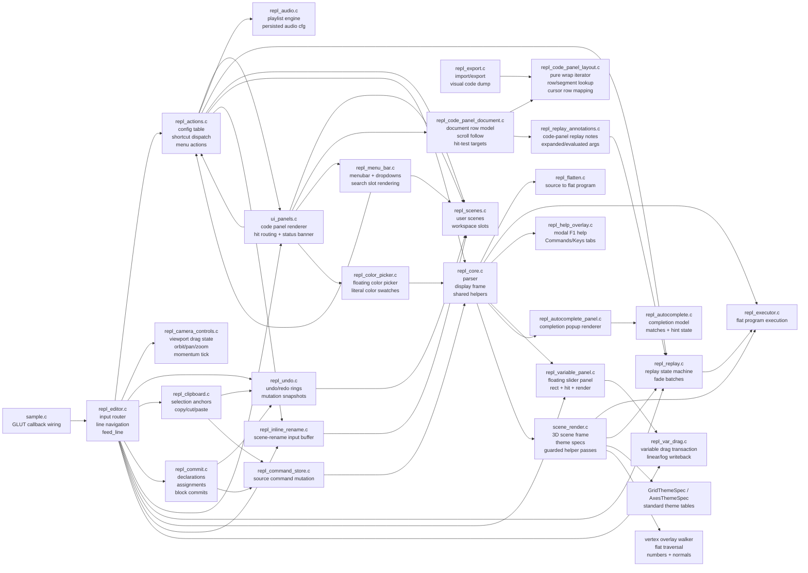

# REPL Refactor Map

This is a working ownership map for the editor-adjacent cleanup slices. It is
not the full architecture; it tracks the modules split out of the old
`repl_editor.c` and the nearby modules they coordinate with.

## Current Boundaries

- `repl_editor.c` should keep shrinking toward ordered input routing and small
  editor-local state. It should delegate mutations once it knows which route
  owns an input event.
- `repl_actions.c` owns side effects that begin from config rows, F-key/Ctrl-key
  config shortcuts, and top-level menu items. UI code should ask it to execute
  actions instead of mutating scenes/files/config directly.
- `repl_camera_controls.c` owns only viewport camera state after UI routing has
  decided a mouse event belongs to the scene.
- `repl_undo.c` owns snapshots and the example-promotion hook that must run
  before mutating editor state.
- `repl_clipboard.c` owns selection and clipboard buffers. It mutates commands
  through `ReplCommandStore` and takes snapshots through `repl_undo.c`.
- `repl_code_panel_layout.c` owns pure text wrapping for code-panel rows:
  continuation indent, wrap break choice, row counts, segment lookup, and cursor
  row mapping. `ui_panels.c`, export visual dumps, and tests should consume this
  instead of carrying local copies.
- `repl_code_panel_document.c` owns the higher-level code-panel row model:
  header/body/footer row counts, replay-extra rows, cursor-follow scrolling,
  and document-line to command-line hit targets.
- `repl_replay_annotations.c` owns code-panel replay text expansion: source to
  flat-command mapping, variable substitution comments, and evaluated command
  display text.
- `repl_menu_bar.c` owns top-level menu/dropdown state, menu hit-testing,
  right-click config cycling, and the inline search slot in the menu bar.
- `repl_color_picker.c` owns the floating HSV/alpha picker state and literal
  color swatch rendering/mutation for color commands.
- `repl_help_overlay.c` owns the modal F1 help overlay.
- `repl_variable_panel.c` owns the floating variable slider panel rendering,
  geometry, and hit-test; value mutation happens in `repl_var_drag.c`.
- `repl_autocomplete_panel.c` owns the floating completion popup renderer;
  match/selection/hint state lives in `repl_autocomplete.c`.
- `repl_inline_rename.c` owns the inline scene-rename input buffer and key
  handling (surfaced through `set_status()`, no dedicated render pass).
- `repl_var_drag.c` owns the variable slider drag transaction: start/motion/
  reset, the linear-vs-log value mapping, and the writeback into
  `g_predef_vars` plus matching `CMD_VAR_ASSIGN` sources.
- `scene_render.c` now keeps helper-pass GL state local with small
  `glPushAttrib`/`glPopAttrib` wrappers. Standard grid/axes themes are table
  entries, while focus/ocean/adaptive-plane grid themes remain custom render
  paths. Vertex-number and normal-vector overlays share one flat-command
  visitor so transform replay and tessellation block tracking stay consistent.

## Open Edges

- `ui_panels.c` still owns render-time iteration over code-panel rows, search
  match highlights inside source lines, and inline ghost/hint text rendering
  next to the input line.
- `repl_editor.c` still owns hidden-code-panel restore rules and the main
  keyboard/special/mouse route ordering.
- `sample.h` and `repl_state.h` still expose broad globals for compatibility.
  The current module splits are ownership boundaries, not yet context-object
  rewrites.
