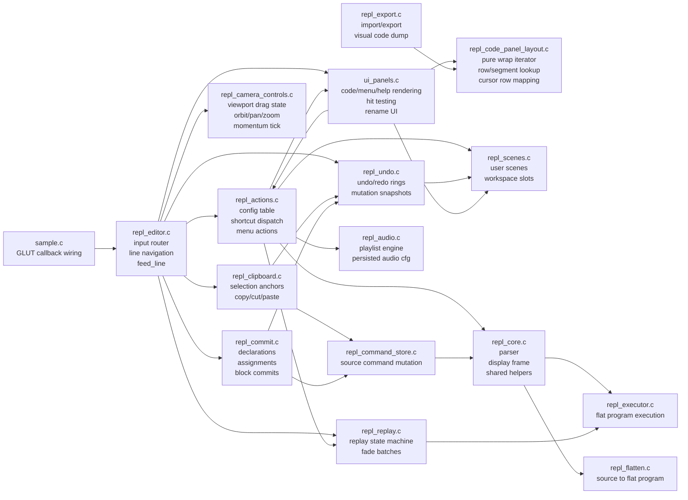

# REPL Refactor Map

This is a working ownership map for the editor-adjacent cleanup slices. It is
not the full architecture; it tracks the modules split out of the old
`repl_editor.c` and the nearby modules they coordinate with.

## Current Boundaries

- `repl_editor.c` should keep shrinking toward ordered input routing and small
  editor-local state. It should delegate mutations once it knows which route
  owns an input event.
- `repl_actions.c` owns side effects that begin from config rows, F-key/Ctrl-key
  config shortcuts, and top-level menu items. UI code should ask it to execute
  actions instead of mutating scenes/files/config directly.
- `repl_camera_controls.c` owns only viewport camera state after UI routing has
  decided a mouse event belongs to the scene.
- `repl_undo.c` owns snapshots and the example-promotion hook that must run
  before mutating editor state.
- `repl_clipboard.c` owns selection and clipboard buffers. It mutates commands
  through `ReplCommandStore` and takes snapshots through `repl_undo.c`.
- `repl_code_panel_layout.c` owns pure text wrapping for code-panel rows:
  continuation indent, wrap break choice, row counts, segment lookup, and cursor
  row mapping. `ui_panels.c`, export visual dumps, and tests should consume this
  instead of carrying local copies.

## Open Edges

- `ui_panels.c` still owns menu layout, render-time code panel row iteration,
  hit testing, and inline rename UI. Code-panel wrapping is shared, but the
  broader document row model is still embedded in UI code.
- `repl_editor.c` still owns variable slider dragging, hidden-code-panel restore
  rules, and the main keyboard/special/mouse route ordering.
- `sample.h` and `repl_state.h` still expose broad globals for compatibility.
  The current module splits are ownership boundaries, not yet context-object
  rewrites.
