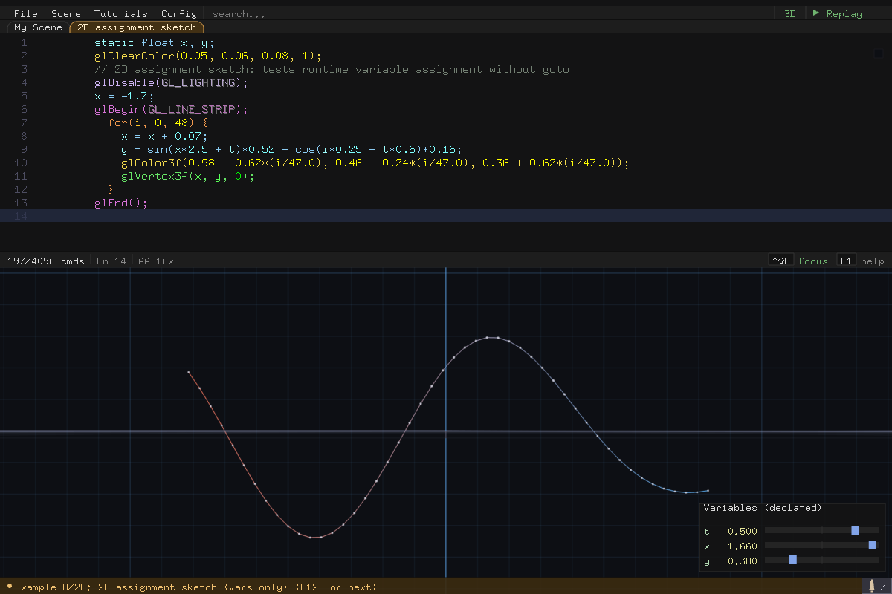

# gl-repl User Guide

gl-repl is an interactive OpenGL interpreter. You type classic immediate-mode
GL commands, press `;` to run each one, and watch the geometry build up live
in a 3D viewport. Every command stays in an editable code panel, so a scene is
a readable list of GL calls you can revisit, tweak, animate, replay
step-by-step, and export as a standalone C program.


This guide covers every user-facing feature. For build instructions and
project internals, see [`README.md`](README.md) and
[`ARCHITECTURE.md`](ARCHITECTURE.md).

## Contents

- [Getting Started](#getting-started)
- [Entering & Editing Code](#entering--editing-code)
- [The REPL Language](#the-repl-language)
- [Animation & the Time Variable](#animation--the-time-variable)
- [The Variable Panel](#the-variable-panel)
- [Tunable Variables (`// @tune`)](#tunable-variables--tune)
- [Camera & Views](#camera--views)
- [Scene Display Options](#scene-display-options)
- [Replay](#replay)
- [Tutorials](#tutorials)
- [Built-in Examples](#built-in-examples)
- [Scenes & Workspaces](#scenes--workspaces)
- [Exporting & Importing](#exporting--importing)
- [Performance & Scope](#performance--scope)
- [Music](#music)
- [Command-Line Options](#command-line-options)
- [Profiling & Diagnostics](#profiling--diagnostics)
- [Keyboard & Mouse Reference](#keyboard--mouse-reference)

---

## Getting Started

Run a fresh session, or reload earlier work:

```bash
./gl-repl                  # fresh session
./gl-repl output.c         # reload a saved scene
./gl-repl workspace/       # load every *.c in a directory as scenes
```

### The window


- **Code panel** — the live, editable list of GL commands. By default it sits
  above the viewport; cycle its position (Left / Top / Bottom / Hidden) with
  **Ctrl+B** or the *Code panel* config item.
- **3D viewport** — your geometry, rendered every frame. Drag to orbit,
  scroll to zoom.
- **Menu bar** — *File*, *Scene*, *Tutorials*, *Config* dropdowns, a
  *search...* slot (same as Ctrl+F), and the *Replay* button at the far
  right.
- **Scene tabs** — one tab per saved scene, below the menu bar. Click to
  switch.
- **Status bar** — between panel and viewport: command count, current line,
  the accumulation indicator (`AA 2x` / `Blur 8x`), and clickable keycaps
  for *focus* (code focus) and *F1 help*.
- **Message line** — the bottom row shows the most recent status message.
  Click the small button at its right end to pop up the recent-message
  history.
- **Variable panel** — bottom-right overlay listing every declared variable
  with a draggable slider (see [The Variable Panel](#the-variable-panel)).

### Your first triangle

Type each line and press `;` to commit it — the `;` keystroke runs the line,
you don't type a literal semicolon at the end:

```c
glColor3f(1, 0.6, 0.1)
glBegin(GL_TRIANGLES)
glVertex3f(0, 1, 0)
glVertex3f(-1, -1, 0)
glVertex3f(1, -1, 0)
glEnd()
```

The triangle appears as soon as the vertices commit. Now:

- Drag in the viewport to orbit, scroll to zoom.
- Press **Ctrl+T** and change a vertex to `glVertex3f(sin(t), 1, 0)` to
  animate it.
- Press **F12** to flip through the built-in examples for ideas.
- Press **F1** for the built-in help overlay — its *Commands* tab lists every
  supported command, and its *Keys* tab is the full keyboard reference. Esc
  or a click outside dismisses it.

---

## Entering & Editing Code

### Committing lines

- **`;`** commits the current input line (the semicolon is the trigger key,
  not part of the text).
- **Enter** inserts a new line below the cursor (variable statements and
  block syntax like `for(...) {` also commit on Enter).
- **Up/Down** move between lines; loading an existing line into the input
  lets you edit and re-commit it in place.
- **Esc** clears the input line (or closes whichever overlay is open).
- A line that fails to parse is *not* committed — the status line explains
  why, and your input stays put for fixing.

### Selection

- **Shift+Left/Right** extends a character selection inside the input row;
  **Shift+Home/End** extends to the row start/end.
- **Shift+Up/Down** selects whole lines.
- **Click+drag** over the active row selects characters; dragging in the
  line-number gutter selects whole lines.
- **Double-click** selects the word under the cursor.
- **Shift+click** extends a selection from the cursor to the click point —
  same row gives a character selection, a different row gives a line range.

### Clipboard & undo

- **Ctrl+C / Ctrl+X / Ctrl+V** — copy / cut / paste. A character selection in
  the input row wins over a line selection: the substring is copied/cut and
  pasted at the cursor. With no character selection, whole command lines are
  copied/cut/pasted.
- **Ctrl+Z** undo, **Ctrl+Y** (or Ctrl+Shift+Z) redo. Undo covers source
  mutations — deletes, pastes, reformat, commits.
- **Ctrl+D** deletes the current line or selection; **Ctrl+L** clears all
  commands.

### Autocomplete

Press **Tab** while typing:

- A unique match completes in place; multiple matches pop up a list (Tab or
  Enter accepts, arrows move).
- Ghost text shows the pending completion inline.
- After typing `foo(`, a parameter hint appears for GL commands and your own
  functions.
- Inside an enum argument slot (e.g. `glEnable(`), completion offers the GL
  constants valid for that slot.

### Search

**Ctrl+F** (or click the *search...* slot in the menu bar) opens
case-insensitive substring search over the whole buffer. Type to refine,
**Enter** jumps to the next match, **Esc** closes. Matches are highlighted in
the code panel.

### Buffer operations

| Key | Action |
|---|---|
| Ctrl+\ | Reformat all lines (re-indent blocks) |
| Ctrl+/ | Toggle `//` comment on the current line |
| Ctrl+Shift+S | Split a multi-name `float` declaration into one decl per line (also File → Split Declaration) |
| Ctrl+Shift+F | Code focus — hide boilerplate chrome and keep just your code (also the *focus* keycap) |
| Ctrl+B | Cycle code panel layout: Left / Top / Bottom / Hidden |
| PgUp / PgDn | Scroll the active panel or overlay |

Two more code-panel toggles live in the Config menu: **Wrap at commas**
(long calls wrap at argument boundaries), **Syntax highlight**
(Off / On / On+Shadow), and **Paren match** / **Paren scope** (highlight the
matching bracket under the caret, and the span of the enclosing parens).

### Inline numeric stepper

Put the cursor on any number in a committed line and a small up/down stepper
appears:

- **Click** the arrows to nudge the value (step scales with the value's
  magnitude).
- **Right-click** steps coarse (×10); **Shift+click** steps fine (×1/5).

The line re-commits automatically, so the scene updates as you click.

### Inline color swatch & color picker

Committed `glColor3f` / `glColor4f` / `glClearColor` / `glMaterialfv` lines
show a small color swatch at the right edge of the code panel. Click it to
open the floating color picker:

- An HSV square plus hue strip (and an alpha strip for 4-component colors).
- Three palette tabs: **Basic** (common named colors), **Full** (hue ×
  tint/shade grid with a greyscale ramp), **Harmony** (the current color plus
  a tetradic set derived live from it).
- Every change writes straight back to the source line, so the scene follows
  the picker in real time. Click outside to close.

---

## The REPL Language

### Supported GL commands

```
glBegin(MODE), glEnd()
glVertex3f(x,y,z), glVertex2f(x,y)
glNormal3f(x,y,z)
glColor3f(r,g,b), glColor4f(r,g,b,a)
glClearColor(r,g,b,a)        background clear color; channels clamp to >= 0.15
glTranslatef(x,y,z), glScalef(sx,sy,sz), glRotatef(deg,x,y,z)
glPushMatrix(), glPopMatrix(), glLoadIdentity()
glEnable(CAP), glDisable(CAP)
  CAP: GL_DEPTH_TEST, GL_LIGHTING, GL_COLOR_MATERIAL, GL_NORMALIZE,
       GL_LINE_SMOOTH, GL_POINT_SMOOTH, GL_BLEND, GL_CULL_FACE,
       GL_LIGHT0..GL_LIGHT3
glShadeModel(MODE)
glPointSize(size), glLineWidth(width)
glPointParameterfv(GL_POINT_DISTANCE_ATTENUATION, const, linear, quadratic)
glBlendFunc(GL_SRC_ALPHA, GL_ONE_MINUS_SRC_ALPHA | GL_ONE)
glColorMaterial(face, mode)
glMaterialfv(face, pname, (GLfloat[]){r, g, b, a})
glLightModeli(pname, param), glFrontFace(mode)
glDepthFunc(func), glDepthMask(GL_TRUE|GL_FALSE)
glColorMask(r, g, b, a)      each channel GL_TRUE/GL_FALSE or 0/1
glRasterPos3f(x, y, z)       position for bitmap text (see label below)
```

`glMaterialfv` also accepts the flat shorthand
`glMaterialfv(face, pname, r, g, b, a)` — the parser rewrites it to the
compound-literal form.

### GLUT solid shapes

```
glutSolidTorus(inner, outer, nsides, rings)
glutSolidCube(size)
glutSolidSphere(radius, slices, stacks)
glutSolidTeapot(size)
glutSolidCone(base, height, slices, stacks)
```

### GLU tessellator (concave / complex polygons)


`gluTess` polygons handle concave outlines, and multiple contours in one
polygon create holes (opposite winding). See built-in examples *GLU
tessellator (concave arrow)* and *(concave arrow cutout)* for the syntax in
action.

### Bitmap text — `label()`


```c
glRasterPos3f(x, y, z);      // place the text anchor (transforms apply)
label("Earth phase = %f", t);
```

- `label("fmt", a, b, c, d)` draws bitmap text at the current raster
  position. Up to 4 substitution args; `%f` substitutes a value, `%%` is a
  literal percent. Format strings are limited to 64 characters and may not
  contain `//`, `(`, `)`, `,`, or backslashes.
- This is a REPL convenience, not a real GL call — exported C files include
  a self-contained `label()` helper so they still compile standalone.

### Math expressions

Every numeric argument is a full expression, evaluated when the line runs:

- **Operators:** `+ - * / %` and parentheses; comparisons
  `> < >= <= == !=`; logical `&& || !`.
- **Functions:** `sin`, `cos`, `tan`, `sqrt`, `abs`, `pow`, `log` (base 10),
  `ln` (base e), `min`, `max`, `floor`, `ceil`, `fmod`, `rem`,
  `rand(seed[, iter])`, `rand2(seed[, iter])`.
- **Constants:** `PI`, `TAU`, `e`.

`rand` returns a deterministic value in `[0, 1]` for a given (seed, iter)
pair; `rand2` is the same hash mapped to `[-1, 1]` — useful for centered
jitter. Determinism means particle systems look the same every frame and
every run.

### Variables

```c
float x, y, z;          // declare before use
x = 1.5;                // assign (any expression)
glVertex3f(x, y, z);    // use anywhere a number is expected
```

- Declarations are hoisted to the top of the program automatically, so every
  reference follows its declaration.
- Up to 23 user variables (plus the predefined `t`).
- Variables persist across commits and are saved/loaded with the scene.
- Initializers are allowed: `float n = 1;`.

### Scratch arrays

`A[8]`, `B[8]`, and `C[8]` are three fixed global arrays for loop and
recursive algorithms:

```c
A[0] = 0;
A[1] = 1;
A[0] = A[0] + (A[1] - A[0]) * 0.25;
glVertex3f(A[0], 0, 0);
```

Indices truncate to int and must stay in `0..7`. Like variables, scratch
arrays persist and round-trip through save/load.

### For-loops

```c
for(i, 0, 24) glVertex3f(cos(i*TAU/24), sin(i*TAU/24), 0);

for(i, 0, n, 2) {        // optional step argument; multi-line body
    glVertex3f(i, 0, 0);
}
```

Nesting is supported up to 4 levels. Loop bounds can be expressions (and can
animate with `t`).

### Functions

```c
func1(radius, sides) {            // func0..func9, up to 10 params
    for(i, 0, sides) {
        glVertex3f(radius*cos(i*TAU/sides), radius*sin(i*TAU/sides), 0);
    }
}
drawCube() {                      // or any name — aliases to a free funcN slot
    glutSolidCube(1);
}

func1(1.5, 6);                    // call (parens always required)
drawCube();
```

Ten function slots are available. Recursion works when paired with an
`if(...)` guard — see the *Recursive triangle tree* example.

### Conditionals

```c
if(t > 1) {
    glColor3f(1, 0, 0);
}
```

### Labels & goto (experimental, top-level only)

```c
:loop                    // declare a jump target (colon syntax)
goto loop                // jump back; pair with if(...) to exit
```

(Note the distinction: `:name` / `name:` is a goto target; `label("...")` is
the bitmap-text call.)

### Comments

Type `// text` directly to add a comment line. `Ctrl+/` toggles a comment on
an existing line. A `// @tune` tag on a `float` declaration marks it as a
tunable knob (see [Tunable Variables](#tunable-variables--tune)).

---

## Animation & the Time Variable


`t` is the one predefined variable. While playing it advances a fixed 1/60 s
per rendered frame; use it in any expression:

```c
glRotatef(t*45, 0, 1, 0);
glVertex3f(sin(t), cos(t), 0);
```

- **Ctrl+T** plays/pauses time (the *Auto time* config item is the same
  toggle).
- **Ctrl+Shift+T** resets `t` to 0.
- You can drag `t` backwards in the variable panel, then resume from there.
- `--time <secs>` (or the `GLR_TIME` env var) sets the starting `t` when
  launching — handy for headless captures of a later moment.

Geometry re-evaluates every frame, so anything written in terms of `t`
animates: loop bounds, colors, transforms, vertex positions.

---

## The Variable Panel


The variable panel (bottom-right) lists `t` plus every declared variable with
its current value and a slider:

- **Left-click drag** on a row scrubs the value linearly.
- **Right-click drag** scrubs logarithmically — fine control near zero,
  coarse far away.
- Toggle the panel with **Ctrl+Shift+P** or the *Variable panel* config item.

Edits write back through the normal commit pipeline, so scrubbing a slider
is equivalent to retyping the assignment — undo works, and the scene follows
live.

---

## Tunable Variables (`// @tune`)

Use `// @tune` on a `float` declaration when a scene parameter should become
a keyboard-adjustable knob in the exported standalone C program.

```c
float amp = 1.5; // @tune
float freq = 2;  // @tune

glBegin(GL_TRIANGLES);
glVertex3f(amp, 0, 0);
glVertex3f(0, freq, 0);
glVertex3f(0, 0, amp);
glEnd();
```

The tag is a bare trailing comment token. It matches `// @tune`, not names
like `// @tuned=5`. If a declaration line contains multiple names, every name
on that line is tagged:

```c
float amp = 1, freq = 2; // @tune
```

Tagged variables are still normal REPL variables while you are authoring. In
the variable panel, tagged rows get an accent mark so you can see which
values will export as knobs:


### Exported controls

When you save/export C, each tagged variable becomes a keyboard knob in the
standalone program. The generated program also draws a small HUD listing each
knob, its current value, and its keys.

Knobs are assigned in declaration order:

| Knob | Raise | Lower |
|---|---:|---:|
| 1 | `q` | `a` |
| 2 | `w` | `s` |
| 3 | `e` | `d` |
| 4 | `r` | `f` |
| 5 | `t` | `g` |
| 6 | `y` | `h` |
| 7 | `u` | `j` |
| 8 | `i` | `k` |
| 9 | `o` | `l` |

Only the first 9 tagged variables get keyboard controls. If more are tagged,
the export keeps the first 9 and writes a note in the generated C that the
rest were capped.

### Step size

The exported knobs use the same step size as the in-app numeric swatch:

| Current value magnitude | Step |
|---:|---:|
| `< 10` | `0.05` |
| `10..99.999` | `0.5` |
| `100..999.999` | `5` |

The same modifier keys apply in the exported program:

| Modifier | Effect |
|---|---:|
| Shift | fine step, `x0.2` |
| Ctrl | coarse step, `x10` |
| Shift+Ctrl | fine then coarse, `x2` total |

There is no range clamp. A tunable can go negative or very large if you keep
pressing its keys.

### Values that stick

A tunable only persists if your display body does not overwrite it every
frame. This works:

```c
float radius = 2; // @tune

glutSolidSphere(radius, 32, 16);
```

This appears inert in the exported program because the assignment runs again
on every display call:

```c
float radius = 2; // @tune

radius = 2;
glutSolidSphere(radius, 32, 16);
```

Use tunables for parameter-style values that the scene reads, not values the
scene recomputes unconditionally each frame.

### Export and reload

`// @tune` survives export/import round trips. The exported C carries a
marker for each tagged declaration, and reloading that file reconstructs the
original declaration with `// @tune` so the variable-panel badge and future
exports keep working.

The generated keyboard controls live only in the standalone exported C.
Inside gl-repl, adjust values through the variable panel or inline numeric
swatches.

---

## Camera & Views

| Input | Action |
|---|---|
| Left-drag (viewport) | Orbit around the target |
| Right-drag | Pan in the XZ plane |
| Shift+Right-drag | Pan vertically (Y) |
| Scroll wheel | Zoom, with momentum |
| Ctrl+Shift+O | Focus origin — ease the orbit target back to (0,0,0) |
| Ctrl+Shift+C | Reset the camera to its default pose (eased) |
| Ctrl+Shift+R | Toggle camera auto-rotate |
| Ctrl+Shift+V | Toggle View mode: 3D perspective / 2D ortho |

### 2D mode



*View mode* (Ctrl+Shift+V, or the CAMERA section of the Config menu) switches
between the 3D perspective camera and a flat 2D orthographic projection —
useful for plots, sketches, and UI-like drawings. Examples that declare
`@cfg view_mode = 1` start in 2D automatically.

---

## Scene Display Options

### The Config menu

Open the **Config** dropdown (or press **`** backquote). Items are grouped
into sections — hovering a section opens a flyout of its items, and the
trailing **All** row shows the entire table at once (the mouse wheel scrolls
flyouts taller than the window):

- **RENDERING** — MSAA, Line smooth, Accum effect, Accum passes, Wireframe,
  Point attenuation
- **TIME & REPLAY** — Auto time, Replay, Replay mode, Replay expand
- **OVERLAYS & SCENE** — Grid, Grid major, Grid extent, Axes, Xform guides,
  Light indicators, Light theme, Backdrop, Auto-normals
- **CAMERA** — View mode, Camera rotate, Focus origin, Reset camera
- **GEOMETRY** — Vertex labels, Normal vectors, Vertex outlines, Vertex
  points, Poly highlight
- **INTERFACE** — Variable panel, CPU profile, Memory profile, Code panel,
  Wrap at commas, Syntax highlight, Paren match, Paren scope
- **AUDIO** — Audio on/off

**Left-click** a flyout item to cycle it forward, **right-click** to cycle
backward. Multi-state items show their current state name.

Function keys drive the most common cycles directly (**Shift+F\<n\>** steps
backward):

| Key | Cycles |
|---|---|
| F2 | Accum effect (Off / AA / Blur / Blur Cam) |
| F3 | Grid theme |
| F4 | Axes theme |
| F5 | Vertex labels |
| F6 | Backdrop |
| F7 | Grid extent |
| F8 | Transform guide mode |
| F9 | Light theme |
| F10 | Syntax highlight |

### Grid & axes


Thirteen grid themes (**F3**): Off, Classic, Fog, Tron, Ember, Faint, Focus,
Ocean, XZ Ruler *(default)*, Adaptive Planes, Radar, Aurora, Synthwave.
**Grid major** (Ctrl+O) cycles the major-tick spacing (1/2/5/10) and **Grid
extent** (F7) the grid's reach (Close / Mid / Far). Theme changes cross-fade,
so a newly chosen grid takes a few seconds to fully appear.

Seven axes themes (**F4**): Off *(default)*, Classic, Pulse, Neon, Compass,
Gizmo, Ruler.


### Backdrops


**F6** cycles the scene backdrop: Off *(default)*, Cityscape, Stars,
City+Stars, Sunset, Aurora.

### Lighting


**Light themes** (**F9**) are preset light rigs: Default (three colored
keys), Headlight (light 0 rides the camera), Solar (light 0 at the world
origin — for orbit/planet scenes), Studio (warm key / cool rim / warm fill),
Neon (saturated magenta/cyan/lime triad). A theme only positions and colors
the four light slots — your program still chooses which ones are on via
`glEnable(GL_LIGHT0..3)`.

**Light indicators** (Ctrl+Shift+L) draw a marker at each light's position
(labelled `L0..L3`, with *off* noted for disabled lights), so you can see
where the rig sits.

### Geometry overlays


- **Vertex labels** (F5): Off / Index / Index+Pos / Index+World — numbers
  each vertex of the primitive at the cursor, optionally with its
  coordinates.
- **Normal vectors** (Ctrl+Shift+N): draws each vertex's normal as an arrow.
- **Vertex outlines** (Ctrl+Shift+E) and **Vertex points**: outline polygons
  and mark vertices *(both on by default)*.
- **Poly highlight**: highlights the polygon under the cursor line.
- **Auto-normals**: maintains generated `glNormal3f` lines for your
  geometry so lighting works without hand-written normals.

A cursor crosshair guide also marks the vertex your cursor line refers to,
with its position label — move the cursor through a `glBegin` block and the
guide follows:


### Transform guides

With **Xform guides** on (F8), placing the cursor on a committed
`glTranslatef` / `glRotatef` / `glScalef` line draws an overlay arrow or arc
showing what that line does — color-coded by axis (X=red, Y=green, Z=blue
blends). Two modes:

- **World** — the guide is drawn in world axes at the world origin: the
  strict OpenGL reverse-order reading of your line, independent of
  surrounding transforms.
- **Frame** *(default)* — the guide anchors at the position the pre-cursor
  transforms have carried the origin to, lining up visually with geometry
  drawn earlier.

See the *Transform Guides* section of [`README.md`](README.md) for the full
semantics (the "before" point, draw-call cutoffs, and worked examples). The
*Transform stress* example (F12 to cycle to it) is built to exercise them.

### Wireframe


**Ctrl+G** toggles wireframe rendering (`glPolygonMode(GL_LINE)` over the
whole scene). Tip: vertex outlines/points are on by default and draw over
the wires; turn them off for a clean wireframe look.

### Rendering quality

- **MSAA** (Ctrl+U) — hardware multisampling on/off.
- **Line smooth** — GL line antialiasing.
- **Accum effect** (F2) + **Accum passes** (Ctrl+= / Ctrl+−) — the
  accumulation buffer drives antialiasing and motion blur:
  - **AA** *(default, 2 passes)* — jitters the camera frustum per pass.
  - **Blur** — re-renders the scene per pass across the frame's motion:
    camera motion when the camera is moving, otherwise the animation-time
    window (so spinning geometry smears realistically).
  - **Blur Cam** — blurs camera motion only; falls back to AA when still.
  - Passes: 1/2/4/8/12/16. The status bar shows the active mode
    (`AA 2x`, `Blur 16x`). Blur is expensive — every pass is a full scene
    render. `--noaccum` disables the accumulation buffer entirely.

  

- **Point attenuation** — distance-attenuated point sprites
  (`glPointParameterfv`); used by the glow/particle examples. On hardware
  without the entry point the REPL falls back to a distance-based
  `glPointSize` approximation.

  

- **Post-process filter** (Ctrl+N) — experimental viewport filters: Off /
  Chromatic aberration / Vignette.

---

## Replay


Replay executes your program one command at a time so you can watch the
scene assemble — geometry appears incrementally, older geometry fades in a
ghosted pass, and the code panel highlights each line as it runs, with
loop-variable values substituted into the displayed text.

| Key | Action |
|---|---|
| Ctrl+R (or the Replay button) | Start / stop replay |
| Space | Pause / resume |
| + / − | Faster / slower |
| Left / Right | Step backward / forward (while paused) |
| Ctrl+K | Jump the replay to the cursor line (first geometry at/after it) |
| m / M | Toggle replay mode: Polygon / Vertex granularity |
| Esc | Stop replay |

The HUD at the bottom of the viewport shows play state, position, and speed.
Two related config items: **Replay mode** (Polygon steps a primitive at a
time, Vertex steps a vertex at a time) and **Replay expand** (whether loops
expand iteration-by-iteration).

---

## Tutorials

The **Tutorials** menu offers guided, step-by-step lessons rendered directly
in the code panel — instruction comments appear with a typewriter reveal, and
each step either asks you to type a command (autocomplete ghost text shows
the expected call), change a setting, or drag a variable slider to a target.

- Tutorials are grouped by tag (hover a tag row for its flyout); flyouts
  group entries under difficulty subheadings.
- While a tutorial is active, the menu gains **Restart Tutorial** and
  **Exit Tutorial** entries.
- Instruction lines are locked — the tutorial guards them against edits
  until you finish or exit.
- The starter set: *First Triangle*, *Color & Transform*, *Feature Tour*,
  *Variable Slider*, and *Depth Test Triangle*.

---

## Built-in Examples

**F12** cycles forward through the 27 built-in examples (then your saved
scenes, then back); **Shift+F12** cycles backward. The Scene menu lists them
grouped by tag. `./gl-repl --list-examples` prints the set:

```
 0  Lit cube                      14  Scratch arrays (de Casteljau)
 1  2D assignment sketch          15  Torus knot (animated)
 2  Animated ring (for + t)       16  Glow sprites (blend + attenuation)
 3  Conditional colors (if + t)   17  Snowfall demo (550 particles)
 4  Function demo (named func)    18  Swaying grass field (rand + t)
 5  Function polygons             19  Jellyfish (glDepthMask translucency)
 6  Function branching            20  Transform stress (guides)
 7  Recursive triangle tree       21  GLU tessellator (concave arrow)
 8  Parametric torus              22  GLU tessellator (arrow cutout)
 9  Animated wave surface         23  Stress test (all features)
10  Procedural terrain            24  Annotated orbit plot (labels)
11  Animated spirograph curve     25  Orrery (labels track 3D orbits)
12  Traveling ripple ring         26  Whale (particle system + lit model)
13  Bezier curve with guides
```

Examples may carry their own presentation presets (grid theme, backdrop,
camera, 2D mode...). Loading an example resets the scene-presentation
settings to defaults first, then applies the example's presets — so examples
always look as authored, and your camera carries over unless the example
sets its own.

Editing an example automatically promotes it to a user scene (see the next
section) — you never modify the built-ins themselves.

---

## Scenes & Workspaces

gl-repl keeps up to 8 scenes in memory, shown as tabs below the menu bar.

- **Slot 0 is "home"** — your pre-example editor state, captured the first
  time you load an example, never evicted.
- **Auto-promotion** — editing a built-in example forks it into a fresh
  scene slot named after the example. Subsequent edits accumulate there.
- **Rename** — File → Rename Scene opens an inline prompt in the status bar
  (Enter commits, Esc cancels). Names become filenames on export, so `/`,
  `\` and `:` are filtered.
- **Switching** — click a scene tab, or cycle with F12 / Shift+F12.

### Saving and loading

| Menu | Action |
|---|---|
| File → New Scene | Start a fresh scene |
| File → Save Scene (Ctrl+S) | Export the active scene as standalone C |
| File → Load Scene | Load a `.c` file into a new scene slot |
| File → Save Workspace | Write every open scene as `<name>.c` in a directory |
| File → Load Workspace | Load every `*.c` in a directory as scenes |

A workspace is just a directory of exported scene files. Once one is bound,
scene slots that overflow the 8-slot limit are evicted to disk
(least-recently-used) instead of being lost. Single files and workspaces
round-trip freely — scene names and the workspace binding are carried in
`@scene-name` / `@workspace-dir` header comments.

---

## Exporting & Importing

### Standalone C export

**Ctrl+S** (File → Save Scene) writes a complete, compilable GLUT/OpenGL C
program — header comments carry the REPL state (variables, config, camera),
your functions become C functions, and your commands become the `display()`
body. The generated file is **C89-compliant**, so it builds anywhere a GL/GLUT
toolchain exists, old machines included:

```bash
cc -std=c89 -Wall -o scene output.c -lglut -lGL -lGLU -lm     # Linux
cc -std=c89 -Wall -o scene output.c -framework OpenGL -framework GLUT -lm  # macOS
```

Everything round-trips: `./gl-repl output.c` reloads the file with
variables, settings, camera, scene name, and `// @tune` tags intact.

`Ctrl+Q` quits and saves a recovery copy to a temp file.

### Editing exported code & reimporting

The exported file is meant to be worked on. You can extend it by hand in C
and load it back — on reload, the commands between the `// Snippet start` /
`// Snippet end` markers are imported, so edits inside that span come home to
the REPL. Two rules keep the round trip clean:

- **Stay inside the REPL language** for the snippet section — the supported
  commands and syntax in [The REPL Language](#the-repl-language). Lines the
  importer doesn't recognize are skipped with a warning. (Anything goes
  *outside* the snippet markers, but those edits live only in the C file.)
- **Stay within the command budget** — the document and its flattened
  program each hold 4096 commands (the status bar shows usage, e.g.
  `1345/4096 cmds`). Loops count once as source but every unrolled iteration
  lands in the flat program, so a heavy particle loop reaches the cap long
  before line 4096.

> **Advanced — extending the REPL itself.** If you want a GL call the REPL
> doesn't speak yet, the interpreter is built to be extended: see
> [*Adding A New Command*](ARCHITECTURE.md#adding-a-new-command) in
> `ARCHITECTURE.md` for the full recipe (command type, spec-table row,
> executor case, replay annotation, help text, save/load round-trip). To
> raise the command budget, bump `MAX_COMMANDS` in `config.h` — it is
> `#ifndef`-guarded, so `-DMAX_COMMANDS=8192` on the compiler command line
> works without editing the file. Expect proportionally more per-frame work:
> the flattened program re-executes every frame.

### Mesh export (PLY)

**F11** (File → Export .ply) captures the current scene as an ASCII PLY mesh
named after the active scene — `glVertex` polygons, GLU-tessellated shapes,
and GLUT solids all export through one GL feedback pass. Authored per-vertex
normals are preserved; the rest are synthesized and smoothed. Line
primitives export as PLY edges.

Headless / scripted capture:

```bash
./gl-repl --example 8 --export-ply out.ply                 # capture frame 1, exit
./gl-repl --example 8 --export-ply out.ply --export-ply-srgb   # decode colors sRGB->linear
```

Use `--export-ply-srgb` when the viewer is color-managed and treats PLY
colors as linear (otherwise the mesh looks washed out).

---

## Performance & Scope

The REPL is an interpreter. Every frame it re-evaluates expressions, and
while anything is animating it re-flattens the whole program — loops
unrolled, functions inlined, every argument expression parsed and evaluated
again. That is what makes the live experience possible (edit any line, drag
any slider, scrub time backwards), but it costs real CPU.

The exported C program has none of that machinery — it is the same scene as
plain compiled GL calls, roughly **100× lighter on the CPU**. So the
workflow for pushing limits is:

1. Sketch and tune the scene in the REPL until it looks right.
2. Tag the parameters you still want to play with as `// @tune`.
3. Export, compile, and push the numbers (particle counts, tessellation,
   iteration depth) in the standalone program — via the exported tune knobs
   or by editing the C directly.

A scene that drops frames in the REPL at 500 particles will typically run
thousands in the export without effort.

That division of labor is by design: the REPL is a **launchpad, debugging
aid, and educational environment** — a place to see immediate-mode GL
respond line by line — not a platform to build a complete application on.
The export is the product; the REPL is where it is born.

> **Honest footnote on interpreter speed.** There is plenty of low-hanging
> fruit in the interpreter — identifier lookup is a series of string
> compares where a trie would do, and the per-frame flatten is a complete
> pass where a partial recompile of only the dirty range would suffice.
> These are deliberate omissions: optimizing further heads toward building
> a virtual machine, and the project's complexity has already grown well
> past its original intention. If the REPL feels slow, that's the signal to
> export.

---

## Music

gl-repl plays background `.mp3`s found at startup, in filename order, from
three places combined:

1. **`./assets`** next to where you run it — override with `--assets <dir>`
   or `GLR_ASSETS_DIR`.
2. **Bundled with the app** — the macOS `gl-repl.app` ships a sample track.
3. **Your music folder** — `~/Library/Application Support/gl-repl/Music` on
   macOS (XDG data dir on Linux), created on first run; drop `.mp3`s there.

| Key | Action |
|---|---|
| Ctrl+Shift+A | Toggle audio off / on |
| Ctrl+Left / Ctrl+Right | Previous / next track |

`--no-audio` skips audio entirely. The audio on/off state persists across
runs.

---

## Command-Line Options

```
./gl-repl [file.c | workspace-dir]   load a saved scene or a directory of scenes

--example <name|idx>   start on a built-in example (case-insensitive name or index)
--list-examples        print the built-in examples and exit
--time <secs>          initial animation time t (also GLR_TIME; --time wins)
--export-ply <path>    capture frame 1 geometry to PLY, then exit
--export-ply-srgb      decode vertex colors sRGB -> linear during PLY export
--assets <dir>         scan this dir for *.mp3 (also GLR_ASSETS_DIR)
--no-audio             skip audio init entirely
--noaccum              disable the accumulation buffer (AA + motion blur)
--dump-code            print the loaded buffer to stdout
--detailed-prof        verbose startup timing trace (also GLR_DETAILED_PROF=1)
-h, --help             usage
```

Useful environment variables: `GLR_TIME`, `GLR_ASSETS_DIR`,
`GLR_NO_POINT_PARAMETER=1` (force the no-`glPointParameterfv` fallback),
`GLR_AUDIO_HITCH_MS` (audio worker stall-warning threshold).

For fully headless rendering — screenshots and GIF/MP4 recordings with no
window at all — build with `FREEGLUT_OSMESA=1` and see *Headless Rendering
(OSMesa)* in [`README.md`](README.md). All screenshots and GIFs in this
guide were captured that way.

---

## Profiling & Diagnostics

- **CPU profile** (Ctrl+W) — overlay panel of per-frame section timings
  (Off / On / Details).
- **Memory profile** (Ctrl+Shift+W) — RSS history, baseline, and delta.
- **Message history** — click the button at the right end of the bottom
  message line to review recent status messages.
- **Ctrl+P** — dump debug state to stdout.
- Startup prints an init trace (`[init +N.NNNs] <phase>`) to stderr — useful
  for locating slow startup phases; `--detailed-prof` adds finer phases.

---

## Keyboard & Mouse Reference

Press **F1** in-app for the always-current version of this list (the Keys
tab), plus the full command reference (the Commands tab).

### Editing

| Key | Action |
|---|---|
| `;` | Commit current line |
| Enter | Insert new line |
| Backspace | Delete character or selected lines |
| Tab | Autocomplete (Tab/Enter accepts) |
| Up / Down | Navigate lines |
| Left / Right | Move cursor within line |
| Home / Ctrl+A | Start of line |
| End / Ctrl+E | End of line |
| Shift+Arrows / Home / End | Extend selection |
| Ctrl+C / Ctrl+X / Ctrl+V | Copy / cut / paste |
| Ctrl+Z / Ctrl+Y | Undo / redo |
| Ctrl+D | Delete line or selection |
| Ctrl+L | Clear all commands |
| Ctrl+F | Search |
| Ctrl+\ | Reformat buffer |
| Ctrl+/ | Toggle comment |
| Ctrl+Shift+S | Split multi-variable declaration |
| Ctrl+Shift+F | Toggle code focus |
| Ctrl+B | Cycle code panel layout |
| Esc | Clear input / close overlay |

### Scene & rendering

| Key | Action |
|---|---|
| Ctrl+T | Play/pause time (Ctrl+Shift+T resets t) |
| Ctrl+R | Start/stop replay (Ctrl+K jump to cursor) |
| Ctrl+G | Wireframe |
| Ctrl+U | MSAA |
| Ctrl+O | Grid major spacing |
| Ctrl+N | Post-process filter |
| Ctrl+= / Ctrl+− | Accum passes up/down |
| Ctrl+Shift+N | Normal vectors |
| Ctrl+Shift+E | Vertex outlines |
| Ctrl+Shift+L | Light indicators |
| Ctrl+Shift+P | Variable panel |
| Ctrl+W / Ctrl+Shift+W | CPU / memory profile panel |
| F2–F10 | Config cycles (Shift steps backward) — see [Scene Display Options](#scene-display-options) |
| F11 | Export .ply |
| F12 / Shift+F12 | Next / previous example or scene |
| F1 | Help overlay |
| ` | Open Config menu |

### Camera

| Key | Action |
|---|---|
| Left-drag | Orbit |
| Right-drag | Pan XZ (Shift+Right-drag: pan Y) |
| Scroll | Zoom (with momentum) |
| Ctrl+Shift+O | Focus origin |
| Ctrl+Shift+C | Reset camera |
| Ctrl+Shift+R | Auto-rotate |
| Ctrl+Shift+V | 2D / 3D view mode |

### Session & audio

| Key | Action |
|---|---|
| Ctrl+S | Save scene |
| Ctrl+Q | Quit (saves recovery file) |
| Ctrl+P | Debug state dump |
| Ctrl+Shift+A | Audio on/off |
| Ctrl+Left / Ctrl+Right | Previous / next track |

> **macOS note:** Cmd+letter works the same as Ctrl+letter. F11 may be
> claimed by the system's "Show Desktop" — use File → Export .ply instead.
