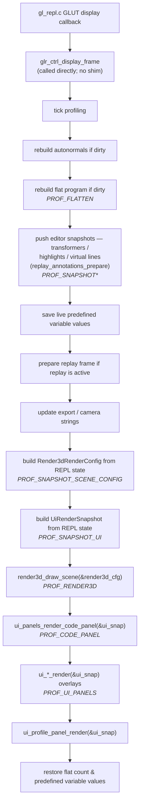
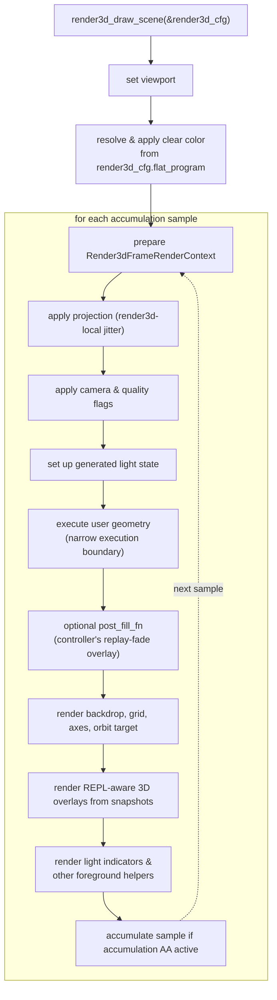

# Architecture

This document explains the application-level architecture of the OpenGL
immediate-mode REPL: ownership, frame coordination, view boundaries, and the
cross-layer designs that depend on them. It is both an orientation for new
contributors and a reference for maintainers changing those boundaries.

Use the companion documents according to the question you are answering:

| Need | Start here |
|---|---|
| Find a module or decide where new code belongs | [`MODULES.md`](MODULES.md) |
| Understand the REPL interpreter itself | [`src/repl/README.md`](../src/repl/README.md), then [`src/repl/ARCHITECTURE.md`](../src/repl/ARCHITECTURE.md) |
| Learn user-visible behavior | [`USER_GUIDE.md`](USER_GUIDE.md) |
| Use advanced builds, capture, export, or diagnostics | [`ADVANCED_USAGE.md`](ADVANCED_USAGE.md) |
| Understand one source subsystem in detail | Its local `README.md` under `src/` |

Read [Direction](#direction), [Ownership Model](#ownership-model),
[Core Tenets](#core-tenets), and [Target Frame Pipeline](#target-frame-pipeline)
for the architectural overview. The layer and boundary sections are the working
contracts. [Core Subsystem Features & Integrations](#core-subsystem-features--integrations)
records load-bearing applications of those contracts, and
[Developer Playbook](#developer-playbook) is the task-oriented reference.

## Direction

The project has one application frontend, built for native GLUT and for the web
through Emscripten's GLUT integration. That frontend hosts a text editor, a REPL
language pipeline, and 2D/3D renderers. Because those build targets share the
same application composition, the useful boundary is not a generic render3d
plugin API. It is an explicit flow of owned state into frame snapshots:

```text
REPL / editor / app state  ──▶  controller-built snapshots  ──▶  render3d / UI renderers
```

The REPL turns editable source into the live, user-programmed geometry. The
render3d module draws the stage around it: camera, projection, lights, grid,
axes, backdrop, accumulation, and guide overlays. The editor owns text-document
behavior; the UI presents that editor and the rest of the screen-space chrome.
The app controller coordinates the frame by reading owned state, building
snapshots, and handing those snapshots to the renderers.

[`src/app/glr_ctrl.c`](../src/app/glr_ctrl.c) is that composition point in code. Focused REPL owners
(`compile`, `load`, `normalize`, `reformat`, `bootstrap`, `program_query`,
`time`, and friends) own the source/program pipeline, while
[`src/render3d/render.c`](../src/render3d/render.c) consumes explicit per-frame config. New work should keep
that shape: add narrowly owned modules and explicit data handoffs instead of
recreating a central REPL core bucket or turning `render3d_*` into a plugin host.

## Ownership Model

Prefixes identify the owning layer:

```text
repl_*        = language, source model, flat program, replay model, input/model controllers
glr_*         = app-shell namespace: app router (glr_ctrl), camera (glr_camera),
                menu/config actions (glr_actions, glr_config), app-frame
                presentation/render-policy state (glr_state), source-document
                adapter (glr_source_document), CLI debug dumps (glr_debug)
editor_*      = text-document model + controller (under src/editor/), incl. the
                document cursor (edit-line) and the editable line buffer
render3d_*    = 3D stage: camera, projection, frame setup, decorators, 3D overlays
ui_*          = 2D editor chrome: code panel, menus, overlays, popups, HUDs
gl_repl.c/h   = GLUT entry point and small shared header
                (a `glr_*`-namespaced shell rename is on the open list)
```

> [!NOTE]
> `render3d_*` is the existing prefix, but the concept is closer to the rendered
> world or stage. It owns the camera-facing environment around the user program,
> not the saved user-scene slots (`repl_scenes`) or the REPL geometry itself.
> `world_*` or `stage_*` would describe that boundary more directly if it were
> named from scratch.

The prefix is an ownership signal, not a generic sample prefix. New `repl_*`
modules should own REPL language, source, workspace, replay, or command-model
behavior; text-document behavior belongs under `editor_*`. App-shell services
belong under `glr_*`, including
[`src/app/glr_audio.c`](../src/app/glr_audio.c) (`glr_audio_*`). Generic infrastructure keeps neutral
names such as `prof`. `gl_repl.c/h` is the one remaining name outside the
scheme; treat it as the GLUT shell entry point, not as a naming precedent.

The ownership contract is:

```text
The REPL owns the user program.
The render3d module owns the 3D stage.
The editor owns text-document behavior; UI renders its 2D view.
The controller translates REPL state into per-frame view inputs.
```

Render3d modules may consume [`FlatProgramView`](../src/repl/flatten.h#L46), [`CmdType`](../src/repl/command.h#L37), and other
command-domain data when that data is already present in the
[`Render3dRenderConfig`](../src/render3d/render_types.h#L135) or a derived frame snapshot. They should not fetch REPL
globals or call `repl_state_*` APIs directly during rendering.

## Core Tenets

The ownership model becomes enforceable through these rules:

1. **The REPL owns the user program.** It parses source, stores source commands,
   flattens loops/functions/conditionals, owns predefined variables, and owns
   replay policy.
2. **The executor is the narrow live-GL gate for user geometry.**
   [`src/repl/executor.c`](../src/repl/executor.c) turns a flat program into OpenGL calls. General `repl_*`
   modules should not casually call OpenGL.
3. **The render3d module owns the stage, not the editor.** It sets viewport, clear,
   projection, camera, accumulation, baseline lighting, grid, axes, backdrop,
   light indicators, orbit target, and 3D overlay passes from config.
4. **The UI owns screen-space presentation.** UI renderers draw code rows,
   menus, popups, color picker, help, status, and profile views from snapshots
   and route mutations through the owning editor, REPL, or peer-subsystem path.
5. **The controller is the mixed layer.** The frame controller builds render3d and
   UI inputs from REPL state, calls the render3d renderer, then calls UI renderers.
   This role belongs in [`src/app/glr_ctrl.c`](../src/app/glr_ctrl.c).
6. **Replay is REPL policy.** Replay state machine, PC, mode, replay-only overlay
   toggles, baseline values, and fade/highlight decisions belong in
   `src/subsystems/replay/` (primarily
   [`replay_playback.c`](../src/subsystems/replay/replay_playback.c),
   [`replay_fade.c`](../src/subsystems/replay/replay_fade.c), and
   [`replay.c`](../src/subsystems/replay/replay.c)). Any render3d use of replay
   data should be via snapshots or
   documented transitional helpers.

## Target Frame Pipeline

Top-level frame orchestration belongs in the controller:



Profile sections wrap each producer so snapshot construction time is
visible: `PROF_SNAPSHOT` is the aggregate, with sub-sections for
transformers, highlights, virtual lines, scene config, and ui snapshot
(see [`src/support/cpuprof.h`](../src/support/cpuprof.h)).

The render3d frame consumes the explicit config:



The exact ordering may preserve current visuals. The ownership rule still
holds: the controller prepares the data, the render3d module decides where stage and
overlay passes occur, and the REPL owns the command/replay semantics behind the
data.

## Two-Level Command Model

> [!NOTE]
> This section is the app-level summary. For the full treatment of the
> `src/repl` interpreter — the [`GLCmd`](../src/repl/command.h#L90) record and provenance, the
> compile→apply edit flow, the flatten→execute frame flow, the [`ReplRuntimeState`](../src/repl/state.h#L18)
> ownership slices, and the host-effects bridge — see the module-local deep
> dive [`src/repl/ARCHITECTURE.md`](../src/repl/ARCHITECTURE.md) (with a worked
> `repl_demo --trace` walkthrough), oriented by [`src/repl/README.md`](../src/repl/README.md).

The REPL keeps source commands and flattened commands separate.

```text
source commands
    one visible / editor line per command
    │
    │ flatten
    ▼
flattened commands
    loops expanded · functions inlined ·
    conditionals resolved · provenance retained
```

Source commands are the editing model.

Flattened commands are the execution, replay, export, and 3D annotation model.

Code outside the command pipeline should use [`FlatProgramView`](../src/repl/flatten.h#L46) or a snapshot
derived from it instead of poking raw global arrays.

### Flatten cache and render-pass reuse

[`repl_flatten_commands()`](../src/repl/pipeline.h#L21) is the expensive interpreter boundary. It expands
loops/functions/conditionals, evaluates expressions and variable/scratch
assignments against the current bindings, and stores resolved [`GLCmd`](../src/repl/command.h#L90) records
in the flat program. For example:

```c
x = 2;
y = pow(2, x);
glVertex2f(x, y);
```

is cached as numeric flat commands: assignment records whose `args[]` carry
`2` and `4`, followed by a `CMD_VERTEX2F` whose `args[]` are `{ 2, 4 }`.
The cache is not an OpenGL display list, VBO, or already-submitted driver
command stream; [`src/repl/executor.c`](../src/repl/executor.c) still walks the cached `GLCmd[]` and
emits calls such as `glVertex2f(cmd.args[0], cmd.args[1])`.

[`repl_refresh_flat_program()`](../src/repl/pipeline.h) is the single live
freshness boundary used by the frame, exports, diagnostics, and replay
freshness checks. It chooses no work, an in-place value rebake, or a full
flatten from the dependency/dirty state and owns the matching profiler
section. A failed rebake restores its value-table baseline and full-flattens
before returning. While animation is playing, advancing `t` is routed by its
dependency bit: stable value-only scenes rebake, while `t`-dependent loops or
conditions full-flatten. Ordinary jitter AA, replay overlay passes, and vertex
outlines reuse the same frame-level
[`FlatProgramView`](../src/repl/flatten.h#L46)/snapshot instead of reparsing, reflattening, or re-evaluating
expressions per sample. Those passes may reapply precomputed assignment
commands from `args[]` while walking the flat stream, but the frame/probe
side-effect brackets restore predefined variables and scratch arrays so
self-referential assignments do not compound across AA samples.

**Dependency-aware rebaking is load-bearing for accumulation time blur.** Time
blur is the exception to the frame-level reuse above: each of its 2/4/8/12/16
samples sets a different transient `t` and calls
[`repl_refresh_flat_program_for_deps()`](../src/repl/pipeline.h#L26) before rendering. Phase 3 routes each
sample through the existing flat topology when `t` changes values only; scenes
whose loops, selected branches, or call snapshots depend on `t` still take the
full-flatten fallback. A saving that looks modest in a one-refresh benchmark is
therefore paid back once per sample—up to sixteen times in one displayed
frame. In practice this is what makes **Accum Blur** feasible for most
stable-topology examples, especially in the Emscripten build where repeated
full flattening is substantially more expensive. Evaluate this optimization
with accumulated *frame* cost, not only the steady-state cost of one refresh.

### Editor-Owned Text

[`GLCmd`](../src/repl/command.h#L90) is a pure parse-result struct: `type`, `args[]`, validity / vars
flags, and provenance fields (`src_cmd_idx`, `call_src_cmd_idx`, etc.).
There is no `source[]` member. Per-line canonical text lives in
`EditorBuffer.lines[MAX_EDITOR_COMMANDS][MAX_LINE_LEN]` inside **[`EditorState`](../src/editor/state.h#L175)**
([`src/editor/state.c`](../src/editor/state.c)), the editor's writable document model — *not* in
[`ReplRuntimeState`](../src/repl/state.h#L18). The parser returns both the [`GLCmd`](../src/repl/command.h#L90) and the canonical
text in `ReplParsedLine { GLCmd cmd; char text[MAX_LINE_LEN] }`; commit
code passes both to text-aware command-store APIs
(`repl_command_store_*_with_line[s]`) so the text buffer moves in lockstep
with the command array.

**The neutral source-document port.** The REPL pipeline must not depend on
[`EditorState`](../src/editor/state.h#L175), so it never touches the editor buffer directly. Instead it
reads and mutates source text through the neutral port in
[`source_document.h`](../source_document.h):

* Reads go through [`source_document_view()`](../source_document.h#L69) → [`SourceTextView`](../source_document.h#L27) (a
  `const char (*lines)[MAX_LINE_LEN]` + count), sliced by
  `source_text_line(view, idx)` (out-of-range returns `""`). Consumers:
  [`executor.c`](../src/repl/executor.c) (display text), [`export.c`](../src/repl/export.c), [`flatten.c`](../src/repl/flatten.c) (reparse),
  [`compile.c`](../src/repl/compile.c), [`src/subsystems/replay/replay_annotations.c`](../src/subsystems/replay/replay_annotations.c).
* Mutations go through [`source_document_apply_change()`](../source_document.h#L72) /
  [`source_document_insert_line()`](../source_document.h#L73) / `_replace_line()` / `_load_lines()` /
  `_clear()`, driven by a [`SourceTextChange`](../source_document.h#L55) descriptor.

Hosts provide the backing implementation by link-time symbol resolution,
not a runtime callback table:

| Host | Backing implementation |
|---|---|
| Full app | [`src/app/glr_source_document.c`](../src/app/glr_source_document.c) — forwards to [`EditorState`](../src/editor/state.h#L175) |
| Standalone `repl_demo` | [`tools/repl_demo/source_document.c`](../tools/repl_demo/source_document.c) — tiny editor-free line store |
| Tests | whichever adapter the scenario links |

`check-repl-no-direct-editor`, `check-repl-no-direct-buffer-read`,
`check-no-store-text-api`, and `check-source-document-port-owners` (all in
the `check-state-ownership` gate) enforce that `src/repl/*` reaches text
only through this port.

Persistence sidecars carry parallel `lines[][]` arrays:

| Persisted form | Module |
|---|---|
| Undo / redo snapshots | `editor_undo` (`EditorUndoSnapshot.editor_lines`) |
| User-scene slots | `repl_scenes` (workspace save / load + LRU eviction) |
| Clipboard cmds | `EditorClipboardState.lines` |
| Single-file / workspace export | `repl_export` (no extra sidecar; reads the source-document port) |

Flat commands have no text of their own. A flat command maps to its
source line through `src_cmd_idx`, resolved via
`source_text_line(source_document_view(), src_cmd_idx)`.

### Document Cursor Ownership

The active edit-line cursor is **editor-owned**: it lives in
`EditorState.document.edit_line_idx` ([`EditorDocumentState`](../src/editor/state.h#L171)) and is read
and written through [`editor_state_edit_line()`](../src/editor/state.h#L347) / `_set()` / `_clamp()`.
There is no `repl_state_edit_line()` and no cursor pointer inside
[`ReplCommandStore`](../src/repl/command_store.h#L47). The REPL pipeline never reaches into editor cursor
storage:

* The parse / compile / flatten / load layers take the cursor as an
  **explicit `int` parameter** (and cursor-shifting store/apply ops update
  a caller-owned `int *cursor_inout`).
* Higher-level pipeline entry points that genuinely need to move the
  cursor (e.g. [`scenes.c`](../src/repl/scenes.c)) go through the [`ReplHostEffects`](../src/repl/host_effects.h#L38)
  `edit_line_get` / `edit_line_set` hooks (`repl_dispatch_edit_line_*`),
  which are no-ops when no host bridge is installed.

This keeps invariant β (REPL → editor symbol references forbidden) intact;
`check-repl-no-direct-editor` is the build guard.

## Command Lifecycle

A user line follows this path:

```text
input text
    │
    ▼
commit handler
    │
    ▼
parser
    │
    ▼
source command store
    │
    ▼
flatten
    │
    ▼
render3d config / overlay snapshots
    │
    ▼
executor boundary
```

Owned stages:

| Stage | Owner |
|-------|-------|
| GLUT input dispatch (cross-subsystem routing) | [`src/app/glr_ctrl.c`](../src/app/glr_ctrl.c) |
| Editor text-document input + commit orchestration | [`src/editor/input.c`](../src/editor/input.c) + [`src/editor/commit.c`](../src/editor/commit.c) |
| Parsing | [`src/repl/parser.c`](../src/repl/parser.c) |
| Validation / compilation (pure, returns [`ReplCompiledChange`](../src/repl/compile.h#L130)) | [`src/repl/compile.c`](../src/repl/compile.c) |
| Apply (writes REPL runtime state only) | [`src/repl/apply.c`](../src/repl/apply.c) |
| Source command mutation (low-level shifts) | [`src/repl/command_store.c`](../src/repl/command_store.c) |
| Source scope/depth | [`src/repl/source_scope.c`](../src/repl/source_scope.c) |
| Flattening | [`src/repl/flatten.c`](../src/repl/flatten.c) |
| User geometry execution | [`src/repl/executor.c`](../src/repl/executor.c) |
| Export/import | [`src/repl/export.c`](../src/repl/export.c) |

Note: `repl_editor.{c,h}` and `repl_commit.{c,h}` are not part of the current
design. Their responsibilities belong to the entries above.
`check-no-repl-editor-input-shim` and `check-no-repl-commit` hard-guard
against either filename returning.

Outside code that needs to inject commands should use the public command/input
paths instead of directly mutating command arrays.

## Controller-Pushed Editor Snapshots

After the command pipeline has produced the current program, the controller
builds per-frame editor-overlay data once for read-only UI consumption. The
snapshot family lives in [`src/ui/app/editor.h`](../src/ui/app/editor.h):

| List | Push helper | What it carries |
|---|---|---|
| `UiTransformerList editor_transformers` | `glr_ctrl_push_color_transformers()` | One entry per editable color command (line index + RGBA + alpha/clear flags). Drives inline swatches and color-picker hit-testing. |
| `UiHighlightList editor_highlights` | `glr_ctrl_push_highlights()` | Feeding-normal and feeding-color commands, replay PC, search match, and selection. Drives gutter accents and row backgrounds. |
| `UiVirtualLineList editor_virtual_lines` | [`replay_annotations_prepare()`](../src/subsystems/replay/replay_annotations.h#L73), via `_refresh_virtual_lines()` | Replay-time substitution and evaluation rows attached to the current source line. Layout, scrolling, hit-testing, and rendering share this list, so virtual-row counts have one source of truth. |

All three lists are named slices on [`ReplRuntimeState`](../src/repl/state.h#L18). Read-only
accessors live in [`src/repl/state_views.h`](../src/repl/state_views.h); clear and append operations
live in [`src/repl/state_owners.h`](../src/repl/state_owners.h).
`UiRenderSnapshot.editor_transformers`, `editor_highlights`, and
`editor_virtual_lines` point into those slices. Future transformer kinds, such
as a numeric slider, should extend this snapshot path rather than make the UI
query live state.

## Controller Layer

The controller layer is the home for app-frame wiring.

Responsibilities:

* rebuild flat program and autonormals when dirty
* prepare replay frame clamps and restore state after rendering
* build [`Render3dRenderConfig`](../src/render3d/render_types.h#L135) and any guide/focus snapshots from REPL state
* call `render3d_draw_scene(&config)`
* call UI renderers in the correct order
* keep profiling section boundaries around render3d and UI rendering

[`src/app/glr_ctrl.c`](../src/app/glr_ctrl.c) may include both REPL headers and render3d/UI headers. Ordinary REPL
model modules should not.

[`gl_repl.c`](../gl_repl.c) and [`gl_repl.h`](../gl_repl.h) carry the GLUT app entry point and small shared
types/constants. A `glr_*`-namespaced rename of the shell is open work, and
should remain mechanical because [`gl_repl.h`](../gl_repl.h) is included broadly.

## Render3d Render Config

[`Render3dRenderConfig`](../src/render3d/render_types.h#L135) is the render3d module's explicit per-frame input. It may carry
REPL-aware data because this sample has one frontend and no plugin-host
requirement.

The controller builds the config once per frame, and [`render3d_draw_scene()`](../src/render3d/render.h#L136)
consumes it directly without calling back into REPL globals or rebuilding the
frame inputs itself. The config currently carries the execute callback,
[`FlatProgramView`](../src/repl/flatten.h#L46), viewport, camera, animation, quality flags, lighting,
backdrop, overlay toggles, replay/HUD layout, grid tables, cursor-block
metadata, and the [`Render3dFocusVertex`](../src/render3d/render_types.h#L127) / [`Render3dGuideSnapshot`](../src/render3d/guides/guides_shared.h#L44) snapshots needed by
3D overlays.

Render3d-local accumulation jitter does not live in the config. Derived
per-pass data belongs in [`Render3dFrameRenderContext`](../src/render3d/render_types.h#L305), for example camera world height,
focus vertex, and other values that helper renderers should share.

## Render3d Layer

Render3d modules own 3D rendering and 3D helper visuals.

Responsibilities:

* viewport and projection setup
* camera transform
* accumulation-buffer sampling with render3d-local jitter
* generated 3D light positions and colors
* grid, axes, backdrop, light indicators, orbit target
* REPL-aware 3D overlays while they remain under `render3d_*`
* replay fade rendering owned by the replay peer
  ([`src/subsystems/replay/replay_render.c`](../src/subsystems/replay/replay_render.c)); render3d calls it as a
  fade pass but does not own the replay GL code

Neutral render3d modules such as [`src/render3d/grid.c`](../src/render3d/grid.c), [`src/render3d/axes.c`](../src/render3d/axes.c),
[`src/render3d/backdrop.c`](../src/render3d/backdrop.c), and [`src/render3d/lights.c`](../src/render3d/lights.c) should remain free of REPL
state access. REPL-aware overlays live under `src/render3d/guides/` and consume
the explicit [`Render3dGuideSnapshot`](../src/render3d/guides/guides_shared.h#L44) rather than pulling globals directly.

The default color-material enable/mode, two-sided lighting, specular color,
and shininess are ordinary editable scene commands. Fresh scenes, Clear All,
and built-in examples place those commands in the per-frame program so code
focus exposes the state that controls the rendered material. Generated light
colors remain initialization state.

### Render3d feature references

The following case studies record rendering behavior whose implementation
depends on the layer contract above. Each starts from the visual or interaction
goal, identifies the owning data path, and records the invariant or regression
trap that future changes must preserve.

#### Grid Edge-Fade Dissolve (world-radial alpha)

The reference-grid line themes dissolve their **alpha to 0 by world
radial distance from the origin** (`sqrt(x² + z²)`), reaching full
transparency at the grid extent. This is what lets the grid fade into
whatever backdrop is behind it. Do not use GL fog for this effect: fog fades
toward the **clear color**, which is wrong when a backdrop paints a different
sky behind the grid.

Pieces, all in [`src/render3d/grid.c`](../src/render3d/grid.c):

* `render3d_grid_theme_uses_edge_fade(theme)` — the membership predicate
  (declared in [`grid.h`](../src/render3d/grid.h), pure, test-visible). True for the table-driven
  line themes (minus FOG) plus the two custom-path line grids (XZ Ruler,
  Star Chart).
* `grid_edge_fade_build()` — once per frame, caches `fade_end` / `band`
  and the offset-0 breakpoint ramp (used by the origin axes, which run
  through the origin so radius == |along|). `fade_end = extent` steady,
  and `extent * opacity` so the front sweeps inward during a hide
  transition (the same machinery is the grid's in/out animation — there
  is no separate transition fog for these themes).
* `draw_grid_line_pair()` / `grid_radial_mul()` — for each grid line at
  perpendicular offset `v`, subdivides at the radii where
  `sqrt(v² + a²)` crosses `fade_start`/`fade_end` and scales per-vertex
  alpha by the radial ramp. `GRID_EDGE_FADE_BAND` is the ramp width.
* `grid_apply_far_fog()` early-returns with `glDisable(GL_FOG)` for any
  edge-fade theme, so they never inherit the clear-color distance fog.

**Two structural traps are easy to repeat:**

1. **Per-vertex alpha needs subdivision, and the fade axis matters.**
   A two-vertex `GL_LINES` segment can carry only endpoint alpha, so an
   opaque middle with faded ends requires subdivision. Fading along each
   line is also insufficient: cross-view lines retain full alpha at their
   centers and still stack into a horizon smudge. World-radial distance
   dims those centers by their perpendicular offset and covers both line
   families.

2. **Disabling fog per-theme silently misses the custom themes.** Any
   switch must use the shared predicate, not convenient spec-table
   membership, because custom-path themes participate too. The regression
   test
   (`test_scene_grid_fog_matches_predicate`) asserts fog emission against
   [`render3d_grid_theme_uses_edge_fade()`](../src/render3d/grid.h#L55) for *every* theme at *every* extent, so
   a theme added to one set but not the other fails CI.

The underlying failure is alpha overdraw. Standard
`GL_SRC_ALPHA, GL_ONE_MINUS_SRC_ALPHA` blending of N stacked layers of
color C over background B converges to `C + (B − C)·(1−a)^N → C`. At a
grazing angles, many far-field lines collapse into a few pixels and converge
on the line color instead of the backdrop. Radial alpha bounds that accumulation.
`GL_MIN`/`GL_MAX` would also bound it but would discard soft alpha and
anti-aliasing, so the design retains standard blending.

Before (clear-color fog → dark horizon band) and after (world-radial
alpha dissolve), same theme/camera/backdrop:


**Per-theme fade ownership** (which mechanism each grid theme dissolves
with — keep this current when adding a theme):

| Theme(s) | Dissolve mechanism |
|---|---|
| Classic, Tron, Ember, Faint, Aurora, Synthwave | World-radial alpha (spec-table, via `draw_grid_line_pair`) |
| XZ Ruler, Star Chart | World-radial alpha (custom path, but lines route through `draw_grid_line_pair`; in the edge-fade predicate) |
| Focus | Own alpha fade by distance from the focus point (bounded magnifier) |
| Adaptive Planes | Own alpha fade by camera orientation (vertical planes) |
| Ocean, Frozen Lake | Intentional **environment fog/tint** to their *own* color (underwater teal / glacial), full-frame — not the clear color |
| Fog | Fog by design (EXP2 to clear color) |
| Radar | Opts into NV distance fog for its rings (covered by `test_nv_fog_distance_radial_optin`) |
| Tilled Field | Opaque depth-written terrain — no translucent-line stacking |
| Sketchbook, Neon Graph | Own alpha fade (`grid_color` xn_alpha); XY-plane 2D themes, not on the radial path |
| Graph Planes | Own alpha fade (`grid_color` xn_alpha) + per-plane camera-orientation weight; 3D adaptive labelled planes |

Open follow-up: Radar, Fog, Tilled Field, Focus, and Adaptive Planes are
*not* on the world-radial path. Ocean/Frozen are deliberate (they own
their atmosphere and fade to their own color). The others can still fog
to the clear color when a backdrop is on; converting Radar (fade its
rings by radius — a natural radial fit) and gating the residual
clear-color fog on `backdrop == OFF` would close the gap.

#### 2D grid themes (Sketchbook + Neon Graph)

`Sketchbook` and `Neon Graph` are purpose-built for the **2D ortho view**.
Unlike every other theme — which draws its graticule in the XZ ground
plane — these draw in the **XY plane** at `z = GRID_2D_Z` (just behind the
z=0 user geometry), so they read as a flat, front-facing grid when the
camera looks down −Z. In 3D they render as a vertical wall at z=0;
filtering theme availability by view mode is a deliberate later step (the
look was the first goal). Both use the shared scene accent palette, route line
alpha through `grid_color()` (so the show/hide fade still applies), and
carry no [`GridThemeSpec`](../src/render3d/grid.c#L136), so [`render3d_grid_theme_uses_edge_fade()`](../src/render3d/grid.h#L55) is
false and the radial edge-fade machinery is skipped. They live as custom
arms in `grid_dispatch_theme` in [`src/render3d/grid.c`](../src/render3d/grid.c).

- **Sketchbook** is a hand-drawn coordinate graph: each cell line is a
  multi-segment `GL_LINE_STRIP` offset by a frame-stable `grid_sketch_wobble()`
  (tapered to zero at the ends so corners still meet), drawn in two passes
  (bold + faint) for an inked feel. Lines snap to real world coordinates
  at the configurable `major` spacing and are **labelled with their actual
  value** via GLUT stroke glyphs (`grid_stroke_text`), so the labels line
  up with the gridlines. It fits the live view by reading the visible
  world half-extents straight off the ortho `GL_PROJECTION` matrix
  (`half = 1/|proj[diag]|`), centred on the camera pan, clamped so the 3D
  fallback can't explode the loop counts.
- **Neon Graph** is a glowing graph-paper grid: faint azure minors,
  brighter violet majors, an additive bloom pass, glowing nodes at the
  major intersections, and a pulsing coral origin cross. No text.

A third theme, **Graph Planes**, is the **3D** counterpart — an
adaptive-planes coordinate graph. It draws three bounded grid planes (XY
azure, ZY amber, XZ floor grey) spanning the grid `extent`; each plane's
brightness tracks how head-on the camera is to it (face weights
`xy_w`/`zy_w`/`xz_w` from `cam_rx`/`cam_ry`, which sum to 1), so a plane
edge-on to the camera fades to near nothing and the facing one is the
bright readable graph. Only the plane the camera is **nearly orthogonal
to** (face weight past a threshold) is labelled — so one X/Y, X/Z or Z/Y
plane at a time — with both in-plane axes' real coordinate values, fading
in as the view squares up. Labels are billboarded to the camera
(`grid_stroke_text_billboard`, an explicit screen-right/up world basis)
and anchored at the **visible** view edges so both axes stay on screen:
the visible half-extents come from the perspective projection
(`half = cam_dist / |proj[diag]|`) clamped to the grid extent. It is a
3D theme; in the 2D ortho view it is not meaningful (the view-mode
filtering follow-up covers hiding such mismatches).

The GLUT stroke font (`glutStrokeCharacter` / `glutStrokeWidth` /
`GLUT_STROKE_ROMAN`) is used for the scalable inked labels (and
`glMultMatrixf` for the billboard basis); the no-op stub equivalents
were added to [`tests/gl-stubs/include/GL/freeglut.h`](../tests/gl-stubs/include/GL/freeglut.h) and
[`tests/gl-stubs/include/GL/gl.h`](../tests/gl-stubs/include/GL/gl.h) so `USE_GL_STUBS` builds still compile.

#### Edit Overlays: polygon outlines on geometry

[`src/subsystems/edit_overlays/edit_overlays.c`](../src/subsystems/edit_overlays/edit_overlays.c) draws the "Vertex
outlines" (F7, `show_vertex_outlines`) and cursor "highlight current
polygon" (`highlight_current_poly`) overlays. `edit_overlays_render_outlines`
sets the shared overlay GL state once — lighting off, depth test on with
`glDepthMask(GL_FALSE)`, `glPolygonMode(GL_FRONT_AND_BACK, GL_LINE)`, and
`glEnable(GL_POLYGON_OFFSET_LINE)` with the negative
`REPL_OUTLINE_POLYGON_OFFSET_{FACTOR,UNITS}` (pulls the wireframe in
front of the filled surface so edges read cleanly without z-fighting) —
then runs **three** walk passes over the flat program, each tracking the
modelview with `apply_tracked_transform` / `unwind_transform_stack`:

1. `render_outlines_glbegin_pass` — re-issues `glBegin`/`glVertex` blocks
   as line geometry from the REPL-tracked vertices.
2. `render_outlines_tess_pass` — the same for tessellated polygons
   (`gluTess*` contours), drawn as `GL_LINE_LOOP`.
3. `render_outlines_glut_pass` — for `glutSolid*` shapes.

These passes consume `OverlayWalkCtx.program`, populated once per frame from
`repl_state_flat_program_view()` by the controller's overlay snapshot pack.
With accumulation AA the outline hook runs once per jitter sample, so the flat
program walks repeat per sample, but the source interpreter, expression
evaluator, and flattener are not re-entered.

The third pass exists because **GLUT solid shapes emit no REPL-tracked
vertices** — the geometry is generated inside GLU/freeglut, so the first
two passes have nothing to trace. Instead, each shape is *re-drawn* under
the already-active `glPolygonMode(GL_LINE)` + polygon offset, letting the
GL pipeline rasterize the wireframe itself. The actual `glutSolid*` call
goes through [`repl_executor_draw_glut_solid()`](../src/repl/executor.h#L197) (shared with the live
render loop in [`src/repl/executor.c`](../src/repl/executor.c), so the dispatch stays in one place
and the GLUT-symbol call site stays inside the executor TU). The
membership predicate is [`repl_cmd_is_glut_solid()`](../src/repl/command.h#L193) in [`src/repl/command.h`](../src/repl/command.h)
— the single source that also feeds `repl_cmd_starts_geometry_emit` and
`repl_cmd_consumes_current_color` (a new `glutSolid*` [`CmdType`](../src/repl/command.h#L37) joins all
three at once; `test_is_glut_solid_predicate` in [`tests/test_replay_walk.c`](../tests/test_replay_walk.c)
pins the set). Cursor-on-the-line picks `RENDER3D_CLR_OUTLINE_ACTIVE` at a
thicker line; otherwise the standing outline uses `RENDER3D_CLR_OUTLINE_EDGE`.
Coverage: `test_draw_glut_solid_dispatch` (executor helper, stub counts)
and section 14b of [`tests/test_repl_core_internal.c`](../tests/test_repl_core_internal.c) (drives the full pass
and asserts the shape is redrawn + polygon-mode/offset toggled, gated on
`GL_STUBS`).

The "Vertex points" overlay keeps its manual `glVertex*` walk for authored
vertices and replay-only anchors, but has the same generated-geometry escape
hatch for `glutSolid*`: when the user vertex-points toggle is on,
`render_vertex_points_glut_pass` redraws GLUT solids under
`glPolygonMode(GL_FRONT_AND_BACK, GL_POINT)`, then restores `GL_FILL`. This is
intentionally not used for replay-only mode, where the overlay means "the
single current authored anchor" rather than "every generated mesh vertex."

#### Cursor Edit Guides

The vertex/normal guides drawn at the cursor line
([`src/render3d/guides/geometry_guides.c`](../src/render3d/guides/geometry_guides.c)) render from a [`Render3dGuideSnapshot`](../src/render3d/guides/guides_shared.h#L44).
The snapshot initially comes from `glr_ctrl_build_guide_snapshot()`, but text
parsing the input line can only evaluate predefined variables. It cannot resolve
funcN-local parameters or loop-assigned values, so the controller must override
cursor arguments from the **flat** command stream before rendering guides inside
functions or loops.

[`edit_overlays_render_cursor_guides()`](../src/subsystems/edit_overlays/edit_overlays.h#L112) walks the current [`FlatProgramView`](../src/repl/flatten.h#L46) via
the replay/user-vertex walkers while tracking the modelview with
`apply_tracked_transform` / `unwind_transform_stack`. At the cursor's first flat
command, [`cursor_guide_snapshot_with_flat_args()`](../src/subsystems/edit_overlays/edit_overlays.h#L122) replaces `vertex_args` or
`normal_args` from the already-substituted flat command. For normal guides it
also walks forward to find the live anchor point, because source-line parsing
alone cannot know the world-space vertex the normal belongs to. Argument-slot
parsing uses [`repl_scan_next_arg_delim()`](../src/repl/eval.h#L428) so nested expressions such as
`cos(i + phase)` do not truncate at an inner comma/paren.

##### Live transform guides (render-while-typing)

Transform guides ([`src/render3d/guides/transform_guides.c`](../src/render3d/guides/transform_guides.c),
`glTranslatef`/`glScalef`/`glRotatef`) render **live as you type**, before the
line is committed — the same render-while-typing affordance the vertex guides
have. The split mirrors the vertex path: the controller pre-evaluates the
partial input into `Render3dGuideSnapshot.xform_args[4]` / `xform_filled[4]`
(`parse_arg_slots()` in [`glr_ctrl.c`](../src/app/glr_ctrl.c), no eval in the render3d module), and the
render3d module re-derives the transform *kind* from the input prefix
(`transform_input_kind()`, a strncmp like `input_is_vertex_kind`) and fills the
untyped slots with the transform identity — **0 for translate/rotate, 1 for
scale** (`transform_live_cmd()`).

[`render3d_transform_guides_render_if_due()`](../src/render3d/guides/transform_guides.h#L23) uses those live args only when the
input buffer **diverges** from the committed line
(`!transform_input_matches_committed()` and not replaying); when the buffer
matches (the parked / no-edit-yet case), it draws the committed flat args
exactly as before. So one synthetic-cmd path covers both "edit a committed
transform" and "compose a new one".

**Anchoring, and the first-composition gotcha.** A live transform line usually
has no flat expansion yet (it isn't committed), so [`render3d_transform_guides_prepare()`](../src/render3d/guides/transform_guides.h#L17)
anchors at the *insertion point* — the first flat command at/after the cursor's
source line, or the **flat tail** for an appended line. Crucially,
[`render3d_transform_guides_render_if_due()`](../src/render3d/guides/transform_guides.h#L23) is **position-independent**: it
recomputes its own anchor frame (`compute_before_cursor_matrix` /
`compute_after_cursor_origin` walk the flat program themselves and
`glLoadMatrixf` an absolute matrix), so it does *not* depend on where the
vertex walk happens to be.

That independence is what makes [`edit_overlays_render_cursor_guides()`](../src/subsystems/edit_overlays/edit_overlays.h#L112) flush the
transform guide **after** the walk (and even when there is *no* walk):

* The flat-program walk drives the geometry guides (which *do* render in the
  walk's accumulated modelview) and consumes the transform plan for the
  committed / replay / mid-document cases.
* An **empty flat program** (e.g. a transform is the very first thing typed in a
  scene) skips the walk — but the post-walk flush still renders the guide. This
  is why the `cmd_count <= 0` early-out must bypass only the walk, not the
  post-walk flush.
* A **tail-anchored** plan (`cursor_flat_idx == cmd_count`) never matches a
  per-cmd walk index, so it too renders in the post-walk flush.

This is the transform analog of the vertex guide's `on_end` / `in_block`
append-row path (vertices typed inside an unterminated `glBegin` block render at
walk end); transforms have no enclosing block, so the position-independent
post-walk flush plays that role instead.

## UI Layer

The UI layer owns 2D editor rendering.

Responsibilities:

* code panel
* menus and dropdowns
* search slot
* autocomplete popup
* variable panel
* color picker
* help overlay
* profile HUD
* status banners and other screen-space overlays

UI renderers draw from a single per-frame [`UiRenderSnapshot`](../src/ui/app/snapshot.h#L70) (defined in
[`src/ui/app/snapshot.h`](../src/ui/app/snapshot.h)) that the controller builds once via
[`glr_ctrl_build_ui_snapshot()`](../src/app/glr_ctrl.h#L107) and passes to every `ui_*_render*()`
entry point. Render code does not call `repl_state_*()` directly. The
`check-ui-no-repl-state-read` Makefile guard enforces the snapshot-shaped
signature for audited renderers.

[`UiRenderSnapshot`](../src/ui/app/snapshot.h#L70) carries:

* by-value value-type slices (code_panel, replay, search, autocomplete,
  status, …) — small structs cheap to copy. Scene-presentation policy
  and most render config live **app-side**
  on `glr_state` ([`src/app/glr_state.c`](../src/app/glr_state.c)), not on [`ReplRuntimeState`](../src/repl/state.h#L18); the
  controller reads them from there when filling the snapshot. Only the
  REPL-owned render *tail* ([`ReplRenderState`](../src/repl/state_views.h#L118): per-light state + clear
  color) remains a REPL slice.
* pointer-shaped read-only views ([`ReplVariableView`](../src/repl/state_views.h#L100), [`EditorInputView`](../src/editor/state.h#L68),
  [`ReplImportExportView`](../src/repl/state_views.h#L147), [`FlatProgramView`](../src/repl/flatten.h#L46), [`ReplPredefView`](../src/repl/eval.h#L178))
* document/flat metadata (`document_cmds`, `document_count`, `edit_line`
  — sourced editor-side via [`editor_state_edit_line()`](../src/editor/state.h#L347),
  `flat_program_count`, …)
* user-scene names + slot-used flags
* the controller-pushed editor snapshot pointers
  (`editor_transformers`, `editor_highlights`, `editor_virtual_lines`)
* per-frame derived metadata so the render path never re-derives:
  `selection_active / selection_lo / selection_hi`,
  `active_indent_chars`, `trailing_indent_chars`, `in_begin_block`,
  `current_begin_mode`

Slices that would have been heavy to copy are deliberately excluded:
[`EditorClipboardState`](../src/editor/state.h#L106) (~1.88 MB with the lines sidecar) is not on the
snapshot — the per-row selection band reads `selection_lo/_hi` instead.

**Two selection models, one clipboard.** `selection_lo/_hi` above is
the *line-range* selection used by gutter drag and the multi-line
clipboard (`anchor_idx`/`end_idx` on [`EditorSelectionState`](../src/editor/state.h#L80)). The
*input-buffer* selection is a separate character-range model on
`EditorInputState.anchor_pos`, scoped to the active edit row only
— shift+arrow, double-click word, drag-on-edit-row, and partial-line
copy/cut/paste all drive that anchor. The two share one tagged
clipboard object ([`EditorClipboardState`](../src/editor/state.h#L106) carries an [`EditorClipboardKind`](../src/editor/state.h#L100)
discriminator plus both a line array and an `input_text` slot) so
`Ctrl+V` after a partial copy pastes characters and `Ctrl+V` after a
line copy still pastes whole commands. Input selection wins over
line-range for `Ctrl+C` / `Ctrl+X` priority; the editor input-selection
tests cover the edge cases.

Mutations route through `repl_actions`, `repl_command_store`,
`variable_panel_drag`, or another REPL-owned mutation path. UI input
hit-tests (`*_hit_test`, `*_rect`) compute neutral [`UiHit`](../src/ui/core/hit.h#L51) values and
return — `glr_ctrl_router_handle_code_panel_hit` dispatches by
`UiHit.kind` to the owning subsystem. Render-side
discoveries (e.g. the editor cursor pixel computed during the generic
text-panel pass) flow back through per-frame `Ui*Output` structs that
the controller actualizes after the render call. [`UiCodePanelOutput`](../src/ui/app/panels.h#L37) is
the code-panel instance of that pattern, and `check-output-actualization`
hard-guards it. `ui_repl_code_panel_build_layout` takes a
`const UiRenderSnapshot *` and is driven by the controller
([`glr_ctrl.c`](../src/app/glr_ctrl.c)), `ui_repl_code_panel_apply_follow_scroll` is gone, and
`replay_code_panel_get_command_display_text` takes an explicit
[`SourceTextView`](../source_document.h#L27) supplied by the controller's annotation-prep pass
rather than reading live state.

### UI feature references

These references describe designs that exercise the snapshot, hit-test, and
mutation boundaries above. They are grouped here so the core UI contract is
complete before the implementation-specific material begins.

#### Menu Flyouts And Tutorial Catalogs

The menu bar uses one submenu/flyout engine in [`src/ui/app/menu_bar.c`](../src/ui/app/menu_bar.c). The
engine is UI-pure: providers expose row count, row labels, absolute target
indices, row kind, and active state; hit-tests return [`UiHit`](../src/ui/core/hit.h#L51) values, and the
controller routes the hit to the owner.

**Config menu.** `g_cfg_items[]` in [`src/app/glr_actions.c`](../src/app/glr_actions.c) is the
descriptor table for config rows. `### ` rows are section headers, and the
Config dropdown renders one hover-only parent row per section plus a synthetic
`All` parent. The section model lives in [`src/app/glr_config.c`](../src/app/glr_config.c)
(`glr_config_section_count/_label/_range`, `glr_config_row_kind`); the `All`
row is owned by the menu layer so it is not double-counted as real config data.
Flyout item clicks route through `UI_HIT_SUBMENU_ITEM` to
`glr_cfg_cycle_row(idx, +1)` and keep the dropdown open; right-press over a
config flyout item cycles backward. Tall flyouts are clamped to the viewport and
page on mouse wheel through `ui_menu_bar_handle_wheel_scroll`, which is called
before code-panel/camera wheel handlers so scroll does not leak behind menus.

**Tutorial menu.** Tutorials use the same flyout engine, but the catalog owner
is `src/repl/tutorials.{c,h}`. Each tutorial entry declares a
[`ReplTutorialTagMask`](../src/repl/tutorials.h#L174); the synthetic `ALL` tag is folded into every entry's
mask by `repl_tutorial_tag_mask`, so catalog literals only name real domain
tags. Top-level visible rows are tags ([`repl_tutorial_visible_tag_count()`](../src/repl/tutorials.h#L301)
hides unused tags), followed by `Restart Tutorial` / `Exit Tutorial` rows while
a tutorial is active. Tag rows are inert hover-only parents; selecting a flyout
tutorial routes through the controller to `tutorial_start(index)` and dismisses
the menu.

Catalog subheadings are free-form strings on tutorial/example entries, not a
fixed enum. The shared catalog flyout walker emits a `### subheading` chrome row
for each contiguous run with the same subheading, so entries sharing a
subheading must be contiguous within each tag view. The metadata tests
(`test_catalog_tag_metadata`, `test_catalog_subheading_metadata`, and the
example equivalent) enforce non-zero tags, known bits only, and no interleaved
subheading runs.

#### UI Color Theming

All 2D UI chrome resolves color through [`src/ui/core/theme.h`](../src/ui/core/theme.h) (header-only,
the [`gl_2d.h`](../src/ui/core/gl_2d.h) pattern) instead of scattered `glColor*` literals. It
defines ~20 semantic `UI_TOK_*` tokens and a
`g_ui_theme_table[UiTheme][UI_TOK_COUNT]` with six rows (green default,
plus warm / cyan / amber / violet / mono from the design-rework
bundle). Neutral chrome columns are identical across rows; only the
three accent-derived tokens (`UI_TOK_ACCENT`,
`UI_TOK_DROPDOWN_ITEM_HOVER_BG`, `UI_TOK_ACCENT_GLOW_BG`) vary per
scheme. Inline `ui_clr(tok)` / `ui_clr_a(tok, alpha)` set the GL color;
the token is a compile-time constant so the lookup folds to a fixed
`.rodata` read.

Color falls into three buckets:

1. **Theme token** — accent + shared neutral chrome (surfaces, borders,
   dividers, text tiers, hover/selection): `ui_clr(UI_TOK_*)`.
2. **Named constant** — fixed, non-theme one-offs that must keep their
   hue in every scheme: the ephemeral example-tab amber, the
   variable-row data palette, dim/stale text tiers, the `#000` menubar
   rule. A local `static const` documented at the use site. (The status
   banner, messages bell/list, and inline-rename modal strip moved to
   bucket 1: neutral `RAISED`/`BORDER` surfaces with severity carried by
   the dot/text/edge-stripe via `UI_TOK_ACCENT` /
   `UI_TOK_STATUS_ERR[_TEXT]`, and the modal strip on the
   accent-derived tokens so it re-tints per scheme.)
3. **Left as-is** — computed/domain palettes that must not follow the
   accent: [`src/ui/subsystems/color_picker.c`](../src/ui/subsystems/color_picker.c) HSV math,
   [`src/ui/app/repl_code_panel.c`](../src/ui/app/repl_code_panel.c) syntax-highlight palette, the
   [`src/ui/support/cpuprof.c`](../src/ui/support/cpuprof.c) FPS gauge (red must keep meaning
   "over budget"), [`src/ui/core/text_panel.c`](../src/ui/core/text_panel.c) `k_clr_*` editor
   sub-palette. Each carries a one-line pointer back to [`src/ui/core/theme.h`](../src/ui/core/theme.h).

**Selecting the scheme.** `UI_THEME_DEFAULT` in [`config.h`](../config.h) is the
single compile-time knob: a bare integer (`0` green … `5` mono — kept
type-free so [`config.h`](../config.h) stays clear of UI types per its dependency
note) used to initialize `g_ui_theme`. It is `#ifndef`-guarded and
build-overridable, e.g. `make gl-repl CPPFLAGS=-DUI_THEME_DEFAULT=1`;
[`theme.h`](../src/ui/core/theme.h) `STATIC_ASSERT`s the value is in range against the [`UiTheme`](../src/ui/core/theme.h#L65)
enum. The [`ui_theme_select()`](../src/ui/core/theme.h#L117) / [`ui_theme_active()`](../src/ui/core/theme.h#L118) seam keeps call
sites stable for a future runtime switcher (e.g. a [`GlrConfigKey`](../src/app/glr_config.h#L29)
cycle) that would relocate the active index into one `.c` TU.
[`tests/test_ui_theme.c`](../tests/test_ui_theme.c) (header-only) guards table integrity: no
zeroed token, neutral tokens stable across rows, green accent ==
`#6fb36f`, and the dropdown hover is green (the Issue-1 regression).

#### Example Color Language (the shared accent palette)

Separate from the UI-chrome theming above: the *scene geometry* of the
built-in examples shares one deliberate palette so the set reads as a
designed family rather than a grab-bag of saturated primaries. The
rollout started with the Scene menu "2D" tag (assignment sketch, function
demos, recursive tree, spirograph, ripple ring, bezier) and
now also covers the line/surface 3D scenes (animated ring, animated wave
surface, GLU tessellator + cutout, transform stress) and the
kitchen-sink showcase, "Dusk lighthouse atoll" (the stress test —
redesigned from a feature hodgepodge into one coherent dusk seascape that
still exercises nested loops, recursion with `if`/`else if`/`else`, GLU
tess + cutout, GLUT solids, a parametric surface, additive points,
translucency, and bitmap text); the intent is the whole catalog over
time. The active palette (currently "Neon" — electric accents around the
brand mark's magenta; the earlier "Dusk" sets remain in
[`accent_palette.h`](../accent_palette.h) for an easy flip back) and its design
guidelines are documented in detail in
[`examples/README.md`](../examples/README.md).

These colors are literal `glColor*`, `gluColor`, and `glClearColor` values in
the affected files under [`examples/scenes/`](../examples/scenes/). `.glr` scenes are raw REPL
source strings; `.c` scenes are exported/importable files. Neither format has a
macro-substitution layer.

Golden tests lock the example colors. [`tests/test_repl_core_examples.c`](../tests/test_repl_core_examples.c)
snapshots each flattened example into
`tests/testdata/repl_examples_ui/NN.golden.txt`; the color literals are part of
the fixture, so off-palette drift fails CI. Regenerate a fixture intentionally
with `build/release/test_repl_core_examples --dump-index N`.

Capture caveat: review these scenes with the **native** backend
(`make gl-repl`, `FREEGLUT_CAPTURE_FRAMES=N ./gl-repl --example N`). The
OSMesa software rasterizer mis-renders the default Adaptive-Planes grid
as an opaque warm quad, which is an swrast artifact — not a scene color —
and would mislead a palette review. See *Headless Rendering &
Screenshots (OSMesa)* above.

## Replay Architecture

Replay is REPL-owned. Render3d may render the current visual effect, but it
should not own replay policy.

Runtime shape:

* the controller builds a [`ReplayFadePlan`](../src/subsystems/replay/replay_state.h#L61) snapshot once per frame (batches,
  alpha, skip limits, baseline predef values)
* render3d iterates the snapshot and owns the GL pass orchestration without
  calling `replay_*` or `repl_state_*`
* accumulation-AA settings are [`Render3dRenderConfig`](../src/render3d/render_types.h#L135) fields set by the controller
* 2D replay HUD lives in [`src/ui/subsystems/replay_hud.c`](../src/ui/subsystems/replay_hud.c), driven by config fields
* `render3d_*.c` files contain no `repl_state_*` or `replay_*` calls; Makefile
  checks keep that true

## Keyboard Shortcut Definition Sites

Keyboard shortcuts are not defined in one place. Four layers contribute
bindings, and the controller resolves them in a fixed priority order. This
section records the current routing contract and the constraints on a future
centralized keymap.

### Dispatch order (who wins a contested key)

`glr_ctrl_keyboard` and `glr_ctrl_special` in
[`src/app/glr_ctrl.c`](../src/app/glr_ctrl.c) route keys. An earlier layer that consumes a key
shadows every later one:

- **ASCII keys:** Cmd→Ctrl normalization → rename modal → file-prompt modal
  → Esc router (color-picker/help close) → config menu (`` ` ``) → config
  ASCII shortcut → replay → save (Ctrl+S) → debug dump (Ctrl+Shift+D) →
  accumulation jitter (Ctrl+= / Ctrl+−) → code focus (Ctrl+Shift+F) →
  tutorial acknowledgment → quit (Ctrl+Q) → editor fallback
  (`editor_handle_key`).
- **Special keys (F-keys/arrows):** replay → config special shortcut
  (F2–F10) → audio (Ctrl+Left/Right) → help tab/scroll → help toggle (F1)
  → scene cycle (F11/F12) → editor fallback (`editor_handle_special`).

Because config routing precedes the editor, the config table wins any
contested Ctrl-letter. The editor receives only keys that no earlier layer
claimed.

### The four definition sites

| Layer | Definition site | Scope |
|---|---|---|
| **Config table** | `g_cfg_items[]` in [`src/app/glr_actions.c`](../src/app/glr_actions.c), dispatched by `glr_cfg_handle_ascii_shortcut`, `cfg_match_row`, and `glr_cfg_handle_special_shortcut` | Config toggles and cycles declared by `(key_code, is_special, modifiers)`. Shift+F-key steps cycles backward; the two-pass Ctrl matching prefers a Shift-specific row before a plain row. |
| **Editor** | `editor_handle_key` / `editor_handle_special` in [`src/editor/input.c`](../src/editor/input.c), search in [`src/editor/search.c`](../src/editor/search.c), and modal capture in [`inline_rename.c`](../src/editor/inline_rename.c) / [`inline_file_prompt.c`](../src/editor/inline_file_prompt.c) | Text, cursor, selection, commit, navigation, clipboard, undo/redo, search, reformat, comments, and printable input. |
| **Controller router** | `glr_ctrl_keyboard`, `glr_ctrl_special`, and `glr_ctrl_router_*` in [`src/app/glr_ctrl.c`](../src/app/glr_ctrl.c) | Cross-subsystem actions: save, debug dump, quit, replay jump, accumulation samples, code focus, audio track, help, scene cycle, and modal close. |
| **Peer subsystems** | [`src/subsystems/replay/replay_input.c`](../src/subsystems/replay/replay_input.c) and tutorial SET-step acknowledgment in [`src/subsystems/tutorial/tutorial_runner.c`](../src/subsystems/tutorial/tutorial_runner.c) | Active-mode keys that shadow the editor while the subsystem holds focus. |

Key-code constants live in [`include/keys.h`](../include/keys.h) (`KEY_CTRL_*`); F-key
codes come from GLUT (`GLUT_KEY_F<n>`). At the top of
`glr_ctrl_keyboard`, `editor_input_normalize_super_to_ctrl` folds macOS
Cmd+letter into Ctrl+letter, so downstream layers see one representation.

The F1 help **Keys** tab is the in-app shortcut reference, and
[`USER_GUIDE.md`](USER_GUIDE.md#keyboard--mouse-reference) mirrors it outside
the app. Its F-key rows are generated from the config table through
[`ReplHelpFkeyProvider`](../src/repl/help_text.h#L34); `glr_ctrl_help_fkey_label` reads each
row's label by `key_code`.

### Toward a centralized keymap

The config table is already a declarative registry; editor, controller, and
peer bindings remain imperative `if (key == …)` chains. A future descriptor
table could record `(key, modifiers, owning layer, action)` and drive both
priority dispatch and generated help.

That design must encode two GLUT byte-level constraints:

- Ctrl+H, Ctrl+I, Ctrl+J, and Ctrl+M alias Backspace, Tab, LF, and CR.
- Ctrl+Shift+letter is indistinguishable from Ctrl+letter in the input byte;
  Shift-specific bindings must also read `glutGetModifiers()` or
  [`editor_input_active_modifiers()`](../src/editor/input.h#L77), as the config router and
  code-focus router already do.

## Boundary Rules

### Live OpenGL / GLU calls

Allowed:

```text
render3d_*.c
ui_*.c
src/repl/executor.c
gl_repl.c        GLUT/window lifecycle and buffer swap
```

Avoid live GL calls in all other `repl_*` files. Text emission of GL command
names in parser/export/example/spec code is not a live GL call.

### GLUT calls

Allowed:

```text
gl_repl.c        GLUT callback registration, glutInit, buffer swap
                (the app-shell namespace rename is still open)
src/app/glr_ctrl.c      GLUT modifier reads + cross-layer input routing
src/editor/input.c  glutGetModifiers via editor_get_modifiers (gated behind
                editor_input_enable_glut_modifier_reads so tests stay safe)
src/repl/executor.c GLUT solid shapes (glutSolidCube/Sphere/Torus/Teapot/Cone)
                and glutBitmapCharacter for label() text. (Its GLU
                tessellator setup — gluNewTess/gluTessCallback — is GLU,
                not GLUT.) The glutSolid* call site is centralized in
                `repl_executor_draw_glut_solid()`; the edit-overlays
                outline pass re-draws shapes through that helper rather
                than naming GLUT symbols itself.
```

### Controller-only render3d wiring

Ordinary `repl_*` model files should not include `render3d_*.h`.
[`src/app/glr_ctrl.c`](../src/app/glr_ctrl.c) is the render3d/UI frame-rendering exception.
`check-controller-boundaries` enforces this; cross-layer constants used by
both layers (e.g. `CFG_DEFAULT_MULTISAMPLE`, `REPL_OUTLINE_POLYGON_OFFSET_*`)
live in neutral headers ([`src/app/glr_defaults.h`](../src/app/glr_defaults.h), [`config.h`](../config.h),
[`src/render3d/render_types.h`](../src/render3d/render_types.h)) that both sides include via existing transitive
paths.

There are no `ui_*` include exceptions among `repl_*` model files.
[`src/repl/export.c`](../src/repl/export.c) is UI-free: it pulls app/render3d-derived values only
through controller-installed bridges, guarded by
`check-repl-export-no-ui-layout` and `check-repl-export-via-bridge`.
[`src/app/glr_actions.c`](../src/app/glr_actions.c) is an app-shell file, so it may legitimately
include `ui_*` headers.

### Render3d state access

Target rule: `render3d_*` files consume [`Render3dRenderConfig`](../src/render3d/render_types.h#L135), [`Render3dFrameRenderContext`](../src/render3d/render_types.h#L305),
or explicit snapshot structs. They should not call `repl_state_*` directly.

`check-state-boundaries` enforces the current audited boundary.

### UI mutation boundary

`ui_*` renderers route REPL mutations through their owning peer or
through the editor commit pipeline (`repl_actions` for menu actions,
`editor_commit_apply_external_change` for picker writebacks,
`variable_panel_drag_*` for slider transactions, `replay_handle_*`
for replay buttons). `repl_state_*_mut()` accessors directly from
`ui_*` files are not permitted. Feature-specific mutable behavior lives
in peer subsystems (`color_picker`, `variable_panel`, `replay`) or in
generic renderers fed by controller-built content (`ui_tabbed_overlay`
consuming [`UiOverlayContent`](../src/ui/core/tabbed_overlay.h#L27) adapted by `glr_ctrl` from
`repl_help_text`).

`ui_*.c` files include [`src/repl/state_views.h`](../src/repl/state_views.h) only, not [`src/repl/state.h`](../src/repl/state.h)
or [`src/repl/state_owners.h`](../src/repl/state_owners.h). `check-views-no-owners` enforces this;
`check-ui-returns-hits-only` (baseline 0/0) keeps any new mutator
out of the input + render paths;
`check-color-picker-ui-isolation` and `check-replay-ui-isolation`
audit the feature-UI prefixes.

### UI / render3d independence

`ui_*` and `render3d_*` are sibling view layers. They should not include each
other's headers. Shared render-neutral helpers belong in local shared headers
or project-wide `include/` only when broadly reusable.

## Decoupling and Link Boundaries

The REPL compiler and pipeline (`src/repl/`) must remain independent of visual
rendering and the host editor environment. The codebase protects that link
boundary and routes host interactions through explicit, neutral seams.

### Standalone REPL Demo Coupling

[`tools/repl_demo/repl_demo.c`](../tools/repl_demo/repl_demo.c) is the negative boundary proof. Its
default samples run parse → command store → flatten → execute without the app
controller, editor, UI renderers, or app-owned visual state.

`./repl_demo --trace` loads code through the non-editor
`repl_load_apply_line` transaction, parses and flattens it, and prints evaluated
results. It stops at the REPL boundary; undo/redo, cursor post-effects, and
tutorial presentation remain in their host modules.

### Stub-Free Link Boundary & Guards

The build system enforces a stub-free boundary:

- [`tools/repl_demo/stubs.c`](../tools/repl_demo/stubs.c) remains empty except for documentation. If
  a core REPL translation unit acquires an app, editor, or UI dependency, the
  demo fails to link.
- The Makefile's `check-state-ownership` gate includes focused guards such as
  `check-repl-demo-no-editor`, `check-repl-demo-stubs-shrinking`, and
  `check-repl-export-via-bridge`.

### Host Bridges & Boundary Mechanisms

The app controller installs four boundary mechanisms at startup.

#### 1. Source-Document Port ([`source_document.h`](../source_document.h))

All source-text reads and mutations use `source_document_*`. The full app links
[`glr_source_document.c`](../src/app/glr_source_document.c), which forwards to
[`EditorState`](../src/editor/state.h#L175); the standalone demo links a tiny editor-free store
in [`tools/repl_demo/source_document.c`](../tools/repl_demo/source_document.c). This keeps editor state and
logic out of the core link set.

#### 2. Host-Effect Bridges ([`ReplHostEffects`](../src/repl/host_effects.h#L38))

The controller-installed [`ReplHostEffects`](../src/repl/host_effects.h#L38) bridge routes status
updates, example and input resets, scrolling, follow-scroll, and cursor parking
to the UI, editor, and peer subsystems. The demo installs only edit-line hooks;
status, editor, and tutorial hooks remain no-ops.

#### 3. Export Bridges & Layout Inputs

[`src/repl/export.c`](../src/repl/export.c) is GL-free and app-free. It receives app and render3d
values through these seams:

| Seam | Purpose |
|---|---|
| Config bridge | [`glr_actions_install_export_cfg_bridge()`](../src/app/glr_actions.h#L113) exposes `@cfg` reads and writes without coupling export to app config modules. |
| Camera bridge | [`glr_camera_export_install_bridge()`](../src/app/glr_camera_export.h#L14) supplies coordinates for `// camera` blocks. |
| Reshape-projection bridge | Supplies the active perspective or orthographic projection to export and code-panel calculations. |
| Camera-distance source | Supplies executor point-size fallback data without linking [`glr_camera.c`](../src/app/glr_camera.c). |
| [`ReplExportLayout`](../src/repl/export.h#L228) | Passes viewport and code-panel geometry explicitly instead of calling `ui_layout_*`. |

#### 4. Global State Reset & Dispatch Separation

- **Dispatch:** Pure structured-block validators remain in
  [`src/repl/compile.c`](../src/repl/compile.c). The non-editor
  [`repl_load_apply_line()`](../src/repl/load.h#L78) transaction handles example, import, and
  tutorial loads.
- **Reset:** [`repl_state_reset_program()`](../src/repl/state_owners.h#L131) resets core REPL
  state. [`glr_ctrl_reset_all()`](../src/app/glr_ctrl.h#L62) resets the editor, UI, and peer
  subsystems when a program is replaced wholesale.
- **App-service bootstrap:** Dump-only CLI paths bypass normal GL
  initialization but run the idempotent `glr_ctrl_install_app_services()`
  installer before loading commands.

### App-Frame State Ownership

Scene-presentation policy and most render config live in the app-side owner
[`src/app/glr_state.c`](../src/app/glr_state.c). REPL-pipeline translation units do not include
[`glr_state.h`](../src/app/glr_state.h); `check-repl-state-no-glr-state` enforces that boundary.
App, editor, UI, and render3d code may consume it. Only the REPL-owned render
tail—[`ReplRenderState`](../src/repl/state_views.h#L121), containing per-light state and clear
color—remains a REPL slice.

## Core Subsystem Features & Integrations

The layer contracts above become concrete in features that cross ownership
boundaries. These references are grouped by the kind of integration involved:
rendering/export paths first, then platform and runtime services. Within each
reference, the current design precedes its invariants, failure modes, and
verification notes.

### Cross-layer rendering and export

These designs coordinate live GL state, controller snapshots, the REPL
executor, or GL-free export code.

#### Runtime GL Capability Detection

GL feature availability that varies by *runtime context* (not by build) is
detected once in [`glr_ctrl_init_gl()`](../src/app/glr_ctrl.h#L13) — the first point at which the GL
context is current — and pushed into the GL-free REPL/render3d layers through
setters and [`Render3dRenderConfig`](../src/render3d/render_types.h#L135), never re-queried per frame.

The first case is **`glPointParameterfv`** (distance-attenuated point
size), core GL 1.4 but absent on some legacy contexts. Detection:

```
supported = GL_VERSION >= 1.4
          || glutExtensionSupported("GL_ARB_point_parameters")
          || glutExtensionSupported("GL_EXT_point_parameters")
```

The version check comes first on purpose: an ARB/EXT-only test
false-negatives on a 1.4+ core context that doesn't advertise the extension
string. The result is stored via [`repl_executor_set_point_parameter_supported()`](../src/repl/executor.h#L253)
(the executor no-ops `CMD_POINT_PARAMETER_FV` and falls back to a
camera-distance `glPointSize` approximation when unsupported) and mirrored
into `Render3dRenderConfig.point_parameter_supported` so the star backdrop's
own direct call is gated identically.

**`GLR_NO_POINT_PARAMETER`** (environment variable, any non-empty value)
forces the unsupported path on capable hardware — the only override; there
is no build flag (it replaced the old compile-time `NO_POINT_PARAMETER`
macro). When point attenuation ends up off, [`glr_ctrl_init_gl()`](../src/app/glr_ctrl.h#L13) logs one
line to stderr that distinguishes the two causes:

* env override — `"glPointParameterfv disabled via GLR_NO_POINT_PARAMETER=..."`
  (and notes whether the hardware would otherwise support it);
* genuine lack — `"glPointParameterfv unsupported by this GL context
  (GL_VERSION ...)"` (and points at the env var for forced testing).

> [!WARNING]
> Detection MUST run before [`repl_apply_init_bootstrap()`](../src/repl/pipeline.h#L33) in the same
> function: on unsupported hardware the injected `point_attenuation` bootstrap
> entry has to be skipped entirely rather than invoking the missing entry
> point.

The second case is the **GPU profiler's timer queries** — the profile
panel's GPU column, measured by [`src/support/gpuprof.c`](../src/support/gpuprof.c). Detection:

```
has_timestamp = glutExtensionSupported("GL_ARB_timer_query")
              || GL_VERSION >= 3.3
advertised    = has_timestamp
              || glutExtensionSupported("GL_EXT_timer_query")
```

The entry points are runtime-loaded in [`glr_ctrl_init_gl()`](../src/app/glr_ctrl.h#L13) (same
core-then-ARB/EXT-suffix loader pattern as `glPointParameterfv`) and
injected into gpuprof as a function-pointer table, so the support module
stays GL-header-free. Two measurement modes, picked at init by what
loaded:

* **timestamp mode** (preferred; `glQueryCounter(GL_TIMESTAMP)`, ARB /
  GL 3.3 only — typical on Linux/Mesa contexts): one marker per section
  transition; interval deltas tile the GPU timeline exactly, so
  per-section times are additive and Frame Total is a true window.
  `glQueryCounter` is only loaded when `has_timestamp` is advertised —
  GLX's GetProcAddress can return a callable stub for *any* name, so
  load-and-see is not a safe capability test.
* **elapsed mode** (fallback; `GL_TIME_ELAPSED_EXT` brackets — the only
  option on Apple's GL 2.1, which exposes `EXT_timer_query` but not
  `ARB_timer_query`): bracket windows overlap on pipelined and
  tile-deferred GPUs, so per-section sums can exceed the wall-clock
  frame time; read the column as a relative-hotspot signal there (the
  full caveat lives in [`src/support/gpuprof.h`](../src/support/gpuprof.h)).

Either way results are harvested asynchronously — a 4-deep ring of
per-frame query slots polled with `GL_QUERY_RESULT_AVAILABLE`, read 1–3
frames later — never a `glFinish`. How much gets queried per frame
follows the profile panel: hidden → no queries at all, ON → top-level
sections, DETAILS → the full GPU subset (`glr_prof_set_gpu_capture_mode`,
policy table in [`src/app/glr_prof.c`](../src/app/glr_prof.c)).

**`GLR_NO_GPU_PROF`** (environment variable, any non-empty value)
disables GPU timing entirely — the panel's GPU column reads `--`, and
the Max column falls back to plain CPU. When GPU timing ends up off,
[`glr_ctrl_init_gl()`](../src/app/glr_ctrl.h#L13) logs one stderr line distinguishing the env
override, a context that advertises timer queries but yields no loadable
entry points, and a context with no timer-query support at all.

#### Dynamic Reshape Projection (export + code panel)

The exported standalone C file's `reshape()` and the live code panel's
footer chrome must show the projection render3d is *currently* applying
(perspective in 3D, ortho in 2D), not a hardcoded `gluPerspective`. This
is the canonical pattern for a **per-frame, GL-derived value that becomes
emitted source text** consumed by GL-free modules. Two cooperating
mechanisms:

1. **Render3d caches what it applied (Tenet 3).**
   `render3d_apply_projection()` writes a jitter-free [`Render3dProjectionDesc`](../src/render3d/render.h#L59)
   into a file static every frame; [`render3d_get_active_projection()`](../src/render3d/render.h#L142) reads
   it. The continuous perspective↔ortho blend is *snapped to the
   dominant side* (`mix < 0.5` ⇒ ortho) because `reshape()` emits one
   discrete mode, never an interpolated matrix. Render3d exposes data; it
   does not format text or know about export.

2. **Controller-installed projection bridge** (same shape as
   [`ReplExportCameraBridge`](../src/repl/export.h#L84)). [`src/repl/export.c`](../src/repl/export.c) is GL-free, so it owns
   no projection math. `ReplExportProjectionBridge.fill_reshape_block`
   is installed by [`glr_ctrl.c`](../src/app/glr_ctrl.c) next to the camera-distance source; its
   adapter reads [`render3d_get_active_projection()`](../src/render3d/render.h#L142) and formats the C
   lines. No bridge installed (render3d_demo, tests) ⇒
   [`repl_export_reshape_projection_lines()`](../src/repl/export.h#L181) returns the canonical
   perspective default (correct `0.1, 200.0` near/far).

**Rule — where a per-frame dynamic value is resolved.** Apply this test
to *any* value that is (a) recomputed per frame from live REPL/render3d
state and (b) read by more than one consumer in the frame loop:

> [!IMPORTANT]
> **If a per-frame value has more than one consumer, the controller
> resolves it once into the frame snapshot; consumers read the snapshot.
> Never let two consumers re-resolve it independently.**

The reason is structural, not specific to any one value: the code
panel's row-count/follow-scroll pass and its render pass sit on
*opposite sides* of [`render3d_draw_scene()`](../src/render3d/render.h#L136) in
[`glr_ctrl_display_frame()`](../src/app/glr_ctrl.h#L133) (snapshot/follow-scroll → render3d render →
panel render). Anything resolved live in both passes can observe two
different values across that boundary whenever a transition lands on
that frame — here a 2D/3D switch would let row-count see one
`gluPerspective(...)` line while render emits two `glOrtho(...)` lines,
skewing scroll-follow and row hit mapping. "Deterministic within a
frame" is *not* sufficient — the inputs themselves change mid-frame at
the render3d-render boundary. This is just [`UiRenderSnapshot`](../src/ui/app/snapshot.h#L70)'s existing
contract ("UI render code reads only from the snapshot") restated for
the case where the value is computed rather than copied.

> [!CAUTION]
> **Do not generalize the `"static float g_angle = 0.0f;"` precedent.**
> That special-case resolves at the consumer site, which is safe *only*
> because its single consumer is the file writer (one pass, off the frame
> loop). It is the wrong model for any value the code panel reads — copy
> the snapshot shape below, not the `g_angle` shape.

**Dynamic-footer sentinel mechanism.** `g_footer_pre_init[]` is iterated
verbatim by three consumers (the file writer in [`src/repl/export.c`](../src/repl/export.c) and
the code panel's row-count *and* render passes in
[`src/ui/app/repl_code_panel.c`](../src/ui/app/repl_code_panel.c)). A line whose count or text is dynamic is
stored as a unique sentinel constant
(`REPL_EXPORT_RESHAPE_PROJ_SENTINEL`); every consumer special-cases it.
Per the rule above:

* **Code panel (per frame):** the controller resolves the block once in
  [`glr_ctrl_build_ui_snapshot()`](../src/app/glr_ctrl.h#L107) into
  `UiRenderSnapshot.reshape_proj_lines/_count`; both panel passes read
  that frozen copy and never touch the resolver. This is the canonical
  shape — UI reads the snapshot only (the symmetric counterpart of
  [`Render3dRenderConfig`](../src/render3d/render_types.h#L135)). The block is the *previous* frame's render3d
  projection (snapshot is built before render3d render); a one-frame text
  lag during a transition is invisible and, crucially, internally
  consistent. snapshot.h hardcodes `UI_RESHAPE_PROJ_LINES/_LINE_MAX`
  for UI-layer purity, with `STATIC_ASSERT` equivalence to the
  `REPL_EXPORT_PROJ_*` source-of-truth in [`glr_ctrl.c`](../src/app/glr_ctrl.c) (same pattern as
  the scene-tab dims).
* **File save (discrete action):** `repl_export_save_output()` calls
  [`repl_export_reshape_projection_lines()`](../src/repl/export.h#L181) directly — a single pass on
  the Ctrl+S thread, not split across render3d render, so it correctly
  captures the projection in effect at save time. (Routing this through
  a controller-owned [`ReplExportLayout`](../src/repl/export.h#L228)-style export context is the
  documented next step if save is ever folded into the frame path.)

[`render3d_get_active_projection()`](../src/render3d/render.h#L142) is the *nearest-steady* projection: the
continuous blend is snapped to the dominant side (`mix < 0.5` ⇒ ortho).
It is deliberately not the live blended 16-float matrix — `reshape()`
emits one discrete mode, not an interpolation; a faithful mid-transition
matrix export would need a different, explicitly-named contract.

Adding another dynamic footer line follows the same recipe: sentinel
constant in [`export.h`](../src/repl/export.h), one resolver, controller resolves once into the
snapshot for the panel, special-case in the consumers.

**Build-enforced**, not convention-only (both in the
`check-state-ownership` gate):

* `check-ui-no-export-resolver` — no `src/ui/` file may call
  [`repl_export_reshape_projection_lines()`](../src/repl/export.h#L181); the panel reads the
  snapshot-frozen block. This is the structural backstop for the rule
  above: the mistake fails the build, not just review.
* `check-repl-export-via-bridge` — [`src/repl/export.c`](../src/repl/export.c) may not include
  `render3d/`/`app/` headers or call `render3d_*`/`glr_*`; it pulls
  app/render3d-derived values only through controller-installed bridges
  ([`ReplExportProjectionBridge`](../src/repl/export.h#L143), [`ReplExportCameraBridge`](../src/repl/export.h#L84),
  [`ReplConfigBridge`](../src/repl/cfg_baseline.h#L49)). Complements `check-gl-boundaries` (which already
  bars GL *calls* in the REPL pipeline) and `check-repl-export-no-ui-layout`.

#### 2D Orthographic Scale (GL_FEEDBACK probe + zoom)

An orthographic projection has no inherent scale — unlike perspective,
moving the camera toward the 3D stage changes nothing on screen. So the 2D
view must *pick* an eye distance whose on-screen size it reproduces, and
zoom must rescale that pick rather than dolly a camera the projection
ignores. All of this lives in [`src/render3d/render.c`](../src/render3d/render.c); the controller feeds
only `cam_dist` and `projection_mix` (the 2D↔3D blend) through
[`Render3dRenderConfig`](../src/render3d/render_types.h#L135).

**The probe runs once per *entry* into 2D — never on zoom.**
`render3d_update_ortho_ref()` calls `render3d_probe_eye_dist()` (a
`GL_FEEDBACK` pass that replays the user geometry through a wide ortho
box and returns the *depth-center* — the midpoint of the drawn
geometry's eye-distance span) on exactly one frame: the rising edge
where ortho starts contributing (`ortho_now && !ortho_active`, i.e. the
instant a 3D→2D switch begins, or startup directly in 2D). That single
sample is frozen into `Render3dState.ortho_ref_dist`, together with
the camera distance at that moment (`ortho_ref_cam_dist`). For the entire
2D dwell after that — including every zoom frame — neither branch of the
edge test fires, so there is no feedback pass at all. One feedback pass
per round-trip into 2D, full stop. (This is the default
`GLR_ORTHO_REF_FROZEN` mode; see [`config.h`](../config.h).)

**Zoom rescales the frozen reference by arithmetic, not a re-probe.**
`render3d_effective_ortho_ref()` returns
`ortho_ref_dist + (cam_dist - ortho_ref_cam_dist)` — the frozen
depth-center plus the live camera-distance delta accrued since the
freeze. The mouse wheel already drives `cam_dist`
(`glr_camera_add_zoom_velocity` → `glr_camera_tick`), so this alone makes
the ortho box grow/shrink with the wheel; no other wiring is needed. Both
projection sites — `render3d_compute_active_projection()` (the cached
[`Render3dProjectionDesc`](../src/render3d/render.h#L59)) and `render3d_apply_projection()` (each AA sample) —
read this one helper so they can't diverge, and it clamps to a positive
floor so a deep zoom-in can't collapse or invert the box. Regression:
`test_scene_ortho_zoom_rescales` in [`tests/test_render3d_render.c`](../tests/test_render3d_render.c).

**Why a delta and not a re-probe.** Moving the camera by Δ is a rigid
translation: it shifts *every* vertex's eye-distance by exactly Δ, so
`frozen_ref + Δ` reconstructs precisely what a fresh probe at the new
distance would measure — but without the cost (the ~96K-float feedback
buffer walk happens once at the switch, not on every wheel tick) and,
crucially, without *breathing*. A live re-probe would also track
animation: `t`-driven geometry moving in and out of the depth span would
wobble the ortho scale every frame even when the user isn't touching
anything. Freezing the intrinsic depth-center and adding only the camera
delta gives zoom-tracking without animation-induced wobble. (The
non-default `GLR_ORTHO_REF_PERFRAME` knob re-probes every ortho frame and
accepts the breathing in exchange for tracking live 3D stage motion — even
that is per-frame, not keyed to zoom.)

**Wheel feel.** Two independent [`config.h`](../config.h) knobs, shared by 2D *and* 3D
zoom (the wheel path is mode-agnostic): `GLR_WHEEL_ZOOM_STEP` (per-notch
velocity impulse) sets magnitude, and `CAM_DECAY_ZOOM` sets smoothness.
One notch travels
`GLR_WHEEL_ZOOM_STEP / (1 - CAM_DECAY_ZOOM)` distance units, eased over
~`1 / (1 - CAM_DECAY_ZOOM)` frames, with `(1 - CAM_DECAY_ZOOM)` of the
motion on the first frame — lower decay is snappier but more "stepped",
higher is smoother but coasts longer. Rapid notches stack onto the
velocity, so fast scrolls still travel quickly.

#### Filtering The REPL Program (rendering a modified view)

Several render passes need to draw the user's geometry but **not exactly as
the program wrote it** — they want to own a slice of GL state (a uniform
line color, a two-sided debug material) that the program's own `glColor` /
`glMaterialfv` / `glEnable` calls would otherwise clobber, or they want to
skip whole primitives. The program is the single source of geometry, so
these passes re-drive the *same* flat command stream with a subset of its
state commands suppressed. There are two complementary mechanisms, chosen by
how much of the walk the pass needs to restructure.

**1. `state_filter` predicate — suppress a slice of state, keep the real
walk.** [`ReplExecutionOptions`](../src/repl/executor.h) carries an optional
`state_filter(CmdType, const GLCmd *, void *ud)` callback. The executor runs
its normal full path — real `gluTess*`, authored normals, animation
re-eval — but at each state/color-emitting command it asks the filter:
return nonzero to emit the GL normally, zero to **suppress the GL emission**.
A suppressed command still runs [`repl_apply_state_bookkeeping()`](../src/repl/executor.h)
so the REPL render bookkeeping a state command carries (the `GL_LIGHTn`
enable mask read by the light-indicator overlay, the `glClearColor`) stays
coherent. `NULL` emits everything — the default live-frame path. This is the
light-touch option: the pass installs its own GL state once, then lets the
geometry/transforms/normals execute untouched while the filter strips only
the commands that would fight it.

The **winding-visualization view** uses this. `render3d_pass_winding` in
[`src/render3d/render.c`](../src/render3d/render.c) installs a single
two-sided-lighting pass (front material green, back material red, cull off)
so flipped/inside-out polygons read red against green; GL selects front-vs-
back material purely from window-space winding. `winding_state_filter` in
[`src/app/glr_ctrl.c`](../src/app/glr_ctrl.c) is the predicate the controller
hands the executor for the `RENDER3D_EXEC_WINDING` purpose — it suppresses
`glMaterialfv`/`glMaterialf`/`glColorMaterial`/`glLightModeli` and the
`glEnable`/`glDisable` of lighting / cull-face / color-material / `GL_LIGHT0..3`.
Everything else (geometry, transforms, `glNormal3f`) passes through; `glColor`
is left alone because GL ignores it with lighting on and color-material off.

The `.ply` exporter's `encode_feedback_normals` flag (see *Mesh Export*
below) is the older, special-cased ancestor of this hook: it hard-codes the
suppression of the program's `glEnable(GL_LIGHTING)` / `glEnable(GL_CULL_FACE)`
inline in the executor so feedback captures raw material color over all
faces. New passes should prefer the general `state_filter`.

**2. Whitelist re-walk — restructure the walk entirely.** When a pass needs
*more* than a state slice — multiple passes, a stripped-down tessellator,
or skipping whole primitives — it drives the **exposed execution cursor**
([`repl_exec_cursor_begin`](../src/repl/executor.h)/`_peek`/`_step`/`_advance`/
`_end`) itself instead of calling `repl_execute_program`. The hidden-line
wireframe renderer ([`src/subsystems/hidden_lines/hidden_lines.c`](../src/subsystems/hidden_lines/hidden_lines.c))
is the example. Its per-command loop:

- runs `repl_exec_cursor_step` (real execution) only for command types in
  the `hidden_lines_cursor_owns_cmd` whitelist — transforms, `glBegin`/`End`,
  vertices, the `glutSolid*` shapes, gotos, `if`, and var/scratch assigns;
- for every other command (all the color/material/enable state) calls
  `repl_apply_state_bookkeeping` and `_advance` — i.e. suppresses **all**
  state, since the pass sets up its own uniform-line GL state externally;
- replaces `gluTess*` with its own position-only tessellator (the wireframe
  wants outline edges, not lit/colored fills);
- skips non-fill `glBegin` blocks during the depth-only pass.

The cost is that the pass owns the bookkeeping and tess lifecycle the normal
executor would have handled. Use the whitelist re-walk only when the
`state_filter` predicate can't express the change (the wireframe's three
passes + stripped tess are the load-bearing reason here); reach for
`state_filter` first.

**Side effects across auxiliary passes.** Both mechanisms can run the program
more than once per frame (the wireframe's three passes; a depth probe).
`scene_execute_adapter` in [`src/app/glr_ctrl.c`](../src/app/glr_ctrl.c)
snapshots and restores predef vars / scratch arrays / [`ReplRenderState`](../src/repl/state_views.h#L118)
around any pass whose [`Render3dExecutePurpose`](../src/render3d/render_types.h#L70) is *not* the one
side-effecting fill — so `t = t + 1` style assignment animation advances
exactly once per frame. `RENDER3D_EXEC_MAIN_FILL`, the wireframe's visible-
line pass, and `RENDER3D_EXEC_WINDING` are the side-effecting fills (they
replace the main fill, single pass), so they advance normally; the hidden /
depth-fill wireframe passes and probes are bracketed.

#### Mesh Export (PLY via GL_FEEDBACK)

The `.ply` exporter (F11 / File → Export .ply / `--export-ply <file>`)
captures the **live flat program** once through
`glRenderMode(GL_FEEDBACK)` and writes an ASCII PLY mesh. Everything the
scene draws — user `glVertex` polygons, GLU-tessellated polygons, and the
GLUT solids (teapot/sphere/cube/cone/torus, which emit no REPL-tracked
vertices) — is captured through this **one** path, so the export can't
drift from what renders.

**Two-module split — GL capture vs. pure writer.** The GL-coupled half is
[`src/app/glr_mesh_export.c`](../src/app/glr_mesh_export.c) (`glr_export_mesh_ply`); the parsing/writing
half is [`src/support/mesh_ply.c`](../src/support/mesh_ply.c), which calls **no** GL function and
includes **no** GL header — it only reads a plain float buffer, so it is
fully unit-testable with synthetic buffers and no GL context
([`tests/test_mesh_ply.c`](../tests/test_mesh_ply.c)). The pure writer redefines the OpenGL feedback
token values (`MESH_PLY_TOK_*`) locally; [`glr_mesh_export.c`](../src/app/glr_mesh_export.c)
`STATIC_ASSERT`s them against the real `GL_*_TOKEN` macros so any drift is
a compile error.

**Fixed capture transform → invertible window coords.** The capture pass
installs a known, render3d-independent transform so the pure writer can run
the projection backwards to world space: identity modelview (no camera),
a containing `glOrtho(-R, R, …)` with `R = 1000` (clips nothing a
hand-typed scene reaches at ~1e-4 float precision), a `1024²` viewport,
and `glDepthRange(0, 1)`. The writer inverts exactly this
([`MeshPlyCapture`](../src/support/mesh_ply.h#L63) carries `ortho_r` / viewport / depth-range) — note
`glOrtho` maps world `z → -z/R`, so the depth inversion negates. State is
saved/restored (`glPushAttrib(GL_ALL_ATTRIB_BITS)` + both matrix stacks
pushed explicitly, since `glPushAttrib` doesn't cover them), and feedback
produces no fragments, so the visible frame is undisturbed.

**Raw color, all faces.** Feedback honors lighting / polygon-mode / cull,
so the pass forces `GL_FILL`, disables `GL_CULL_FACE`, and disables
`GL_LIGHTING` — *and* the executor suppresses the program's own
`glEnable(GL_LIGHTING / GL_CULL_FACE)` in export mode
(`ReplExecutionOptions.encode_feedback_normals`). Without that suppression
a scene that re-enables lighting would feed back per-vertex *lit* colors
(not the authored `glColor` material) and cull back faces — the bug that
motivated the encode flag. Vertex color is written linear (pass-through)
by default; `--export-ply-srgb` (`MeshPlyOptions.srgb_decode`) applies the
sRGB→linear EOTF to RGB (alpha untouched) for color-managed viewers.

**Authored normals via the texcoord channel.** Feedback's `GL_3D_COLOR`
mode returns only position + color, so a synthesized geometric normal is
all that's recoverable. To carry the *authored* per-vertex normal, the
export pass uses `GL_3D_COLOR_TEXTURE` (11 floats/vertex) and the executor
mirrors each vertex's world-space normal — inverse-transpose of the
begin-time modelview 3×3 — into the texcoord `(s,t,r)` under an identity
texture matrix (so it round-trips un-projected). Whether a given run of
texcoords *is* a normal is signalled **out of band** by bracketing user
`glBegin`/`glEnd` with `glPassThrough(MESH_PLY_PASS_NORMALS /
_NO_NORMALS)` — a passthrough value can't collide with real vertex data
the way an in-band tag could. Solids / tess (no authored normal) stay in
the default NO_NORMALS mode and the writer synthesizes + smooths a
geometric normal instead. (`glPassThrough` and `glGetFloatv` are illegal
between `glBegin`/`glEnd`, so the modelview is snapshotted once at
`glBegin`; it is constant within a primitive because transforms are
rejected mid-primitive.)

**The pure writer is two-pass.** Pass 1 parses the token stream into
transient `corners[]` (3 per triangle, n-gons fan-triangulated) +
per-triangle face normals, plus separate line-endpoint and point-vertex
lists (see below), which are then appended behind the triangle corners.
Pass 2 builds the output vertex set over that one unified array — welded
by `(quantized pos, 8-bit color)` when `weld && smooth_normals`, else 1:1
flat — resolves per-vertex normals (authored wins, else
face-normal-averaged), then writes `vertex`/`face`(/`edge`) elements.

**Points and line edges.** Point and line geometry export too
([`src/support/mesh_ply.c`](../src/support/mesh_ply.c)): `glBegin(GL_POINTS)` arrives as `GL_POINT`
feedback tokens and becomes **loose vertices** (the PLY point-cloud
convention — vertices referenced by no face);
`glBegin(GL_LINES/LINE_STRIP/LINE_LOOP)` arrives as `GL_LINE` /
`GL_LINE_RESET` tokens, one record per segment, and becomes a PLY
**`edge` element** (`property int vertex1/vertex2` — the
CloudCompare/Blender convention). The edge element is declared only when
the capture contains lines, so triangle-only output is unchanged for
viewers that predate the convention. Point/line vertices ride the same
weld pass as face corners, so a line strip's repeated shared endpoints
merge and its edges chain through common vertices; authored normals from
the texcoord channel apply to them exactly as to polygon corners
(vertices with neither an authored normal nor a face contribution write a
zero normal). [`MeshPlyStats`](../src/support/mesh_ply.h#L103) returns the per-primitive counts so the
status line can report "N triangles, M edges, K points".

PLY viewer support for loose vertices and `edge` elements is uneven: Xcode
and Quick Look only draw faces. App exports therefore set
`MeshPlyOptions.primitive_radius_scale`, adding an octahedron for every point
and a capped six-sided tube for every line segment while retaining the native
point/edge records for consumers that understand them. The tube radius is a
small fraction of the captured geometry's largest world-space span and point
radius is twice that. This is deliberately world-space and view-independent;
feedback does not carry `glPointSize` / `glLineWidth`, whose units are screen
pixels. Pure-writer callers leave the option at zero when they want only the
native PLY representation.

**Coverage gap.** Real feedback needs a live GL context, so the
capture/encode contract can only be exercised end-to-end with a display
(the stub `glRenderMode` returns 0). The pure writer is fully covered with
synthetic buffers; the executor's encode contract is covered in stub mode
via `gl_stub_counts` (`test_export_normal_encoding` in
[`tests/test_repl_executor.c`](../tests/test_repl_executor.c) asserts lighting/cull suppression +
texcoord/passthrough emission). Verifying real feedback *values* needs a
real GL context — Xvfb (Linux) or the **OSMesa backend** below, which renders
this exact path with no display (`--export-ply` headless matches a native
capture to ~1e-4).

### Platform and runtime services

These designs concern build backends, capture, startup visibility, and assets.
Operational commands live in [`ADVANCED_USAGE.md`](ADVANCED_USAGE.md); this
section retains the ownership decisions and implementation constraints.

#### Headless Rendering & Screenshots (OSMesa)

`make ... FREEGLUT_OSMESA=1` builds against a freeglut **OSMesa** backend that
renders into a CPU buffer with no window system at all (no Cocoa/GLX/X11) — a
software (llvmpipe/swrast) **compatibility** context, so fixed-function GL, the
GLUT solids, GLU tessellation, and `glRenderMode(GL_FEEDBACK)` all work. This is
the load-bearing path for headless CI: the real-GL tests (`make gl-tests`) and
`--export-ply` run with no display, and pixel readback is byte-identical to a
native render.

**It is a build-mode swap, not a source change.** `gl_includes.h`'s non-Apple
branch already includes the Mesa headers (`<GL/gl.h>`/`<GL/glu.h>`/
`<GL/freeglut.h>` — on macOS the Cocoa build *already* compiles against
Homebrew's `/opt/homebrew/include/GL` headers and only links Apple's GL
framework). So OSMesa mode just (a) builds the vendored freeglut with
`-DFREEGLUT_OSMESA=ON` instead of `-DFREEGLUT_COCOA=ON`, and (b) links Mesa
`libGL`/`libGLU` + `libOSMesa` instead of the Apple frameworks (system GL/GLU +
`libOSMesa` on Linux). Build dir and objects are suffixed (`build-osmesa/`,
`build/<cfg>-osmesa/`) so the OSMesa and native builds never collide. The
`-std=c99` sources and every guard are untouched. Mechanics live in the Makefile
(`FREEGLUT_OSMESA` ⇒ `FREEGLUT_CMAKE_BACKEND`, the per-platform link block, the
vendored-archive prereq gate); the user-facing build and capture commands live
in [`ADVANCED_USAGE.md`](ADVANCED_USAGE.md#headless-rendering-osmesa).

The backend lives in the **vendored** freeglut only — but the in-tree
vendored tree **already carries it**: the `capture-windowed-backends` branch
it is pinned to is stacked on `osmesa-backend`, so one tree holds both the
native (Cocoa/X11) and OSMesa backends. `make … FREEGLUT_OSMESA=1` builds the
OSMesa backend directly with **no re-vendor** — it coexists with the native
build under suffixed dirs. Re-vendoring
(`FREEGLUT_REPO=<path-or-url> scripts/vendor-freeglut.sh <ref>`; the source is
recorded in `third_party/freeglut/VENDORED.txt`) is only for re-pinning a
newer fork commit. Two fixes in that fork make it usable as a library consumer:

- **Teardown.** An app that exits without an explicit `glutDestroyWindow()`
  destroys its window from freeglut's `atexit(fgDeinitialize)` sweep. On
  Gallium/swrast that crashed twice (a redundant `OSMesaMakeCurrent` re-bind
  during destroy faulting in `st_framebuffers_purge`, then `OSMesaDestroyContext`
  called through a driver vtable the runtime had already finalized at
  `__cxa_finalize`). The backend now skips the redundant re-bind and, via a
  LIFO-ordered `atexit` marker, leaks the context at process exit rather than
  destroying it through dead state. Runtime `glutDestroyWindow` is unaffected.

- **`SIGUSR1` frame capture.** The async-signal-safe handler only sets a
  `volatile sig_atomic_t` flag. The main thread services it at the buffer-swap
  path for active rendering or the main-loop tick for an idle app. OSMesa reads
  the completed buffer directly with `OSMesaGetColorBuffer`, converts RGBA to
  top-down RGB, and writes the numbered PPM. Native Cocoa/X11 backends implement
  the same contract in
  [`third_party/freeglut/src/fg_capture.c`](../third_party/freeglut/src/fg_capture.c) by posting a redisplay and
  capturing `GL_BACK` before swap. The native implementation compiles to stubs
  in OSMesa builds. Signal availability and capture commands are documented in
  [`ADVANCED_USAGE.md`](ADVANCED_USAGE.md#headless-rendering-osmesa).

**Animation clock and start offset.** The predefined `t` variable is a
fixed-timestep clock: while animation is playing, each controller tick advances
it by `GLR_FRAME_DT_SECS` (1/60 s). Normally the paced GLUT timer owns that
tick. With `GLR_TICK_PER_FRAME` set, the timer becomes redraw-only and the
completed-frame hook supplies one whole-controller tick after each presentation.
Recorded states are therefore `t0`, `t0 + 1/60`, and so on, regardless of
rendering throughput. `--time` or `GLR_TIME` sets the initial value through
[`repl_set_time()`](../src/repl/time.h#L19) after example loading, so an example reset cannot
discard the requested offset.

**Record mode (`FREEGLUT_CAPTURE_FRAMES`).** The backend captures a fixed number
of rendered frames and exits. Recording scripts enable `GLR_TICK_PER_FRAME`, so
frame `i` always represents `t0 + i/60`. In the single-buffered OSMesa path,
record mode is serviced from `fgPlatformProcessSingleEvent` because
`glutSwapBuffers()` returns before the platform swap; the main-loop tick is the
only reliable per-frame backend hook without changing freeglut core. A buffer
signature skips the unrendered initial buffer. Duration, frame assembly, and
capture commands remain operational concerns of
[`ADVANCED_USAGE.md`](ADVANCED_USAGE.md#recording-gifs--mp4s) and
`scripts/record-gif.sh`.

#### Startup & Audio-Worker Diagnostics

Two always-on stderr diagnostics localise startup stalls and
audio-thread hitches (notably on slow Linux disks). Both follow the
project's one-line-stderr convention (same as the point-parameter log
above); neither is gated off by default — the point is to see them
when a stall happens.

* **Init trace** ([`gl_repl.c`](../gl_repl.c)). `main()` calls `init_trace(<phase>)` at
  each startup phase; it prints `[init +N.NNNs] <phase>` with
  wall-clock seconds (`gettimeofday`, not the per-platform timebase in
  [`src/support/cpuprof.c`](../src/support/cpuprof.c) — ms granularity is enough and this stays portable/C99)
  elapsed since the first call. Two granularity levels share one
  stream:

  *Baseline phases* (always emitted): `start`, `glutInit begin`,
  `window created`, `GL init done`, `REPL bootstrap done`,
  `glr_audio_init begin/done`, `audio playlist started`, `entering
  main loop`. The only synchronous audio work on the `main()` path is
  `ma_engine_init()` (it opens the OS audio device); `--no-audio`
  isolates it.

  *Detailed phases* (gated on the `--detailed-prof` CLI flag or
  `GLR_DETAILED_PROF` env var, any non-empty value; default off):
  `glutInit done` (splits the glutInit runtime), `playlist scan done
  (N tracks)` (opendir/readdir over `assets/`), `playlist start
  requested` (after the synchronous `load_state` INI read and worker
  poke), and the post-`glutMainLoop` `frame N display callback` /
  `frame N render done` / `frame N swap done` triples from
  `display_func` for the first two frames. The frame-1 triple splits
  the otherwise-invisible time between `glutMainLoop()` and the OS
  showing pixels (GLUT solid-shape display-list compilation, macOS
  first-drawable wait, GL stack lazy init); the frame-2 triple is the
  steady-state control that reveals whether spending was first-frame-
  only (the expected case) or a real regression. Gated via
  `init_trace_detail()` plus inline flag checks on the snprintf-using
  sites so the default boot does zero extra work for these phases.

* **Worker hitch detector** ([`src/app/glr_audio.c`](../src/app/glr_audio.c)). The audio worker
  (`audio_worker_main`) is event-driven: it sleeps on
  `pthread_cond_wait`, wakes to run exactly one blocking lifecycle op
  (`worker_load` → `ma_sound_init_from_file`; `worker_uninit_all` →
  `ma_sound_uninit` stream page-flush; `worker_advance`;
  `worker_save_state`), then sleeps again. The dispatch span is timed
  with `clock_gettime(CLOCK_MONOTONIC)` **after the mutex is released**
  so only the blocking work counts, and any op at/over the threshold
  logs `[init +N.NNNs] repl_audio: worker hitch: <op>[+save] took N ms (threshold
  M ms)`. Threshold via `GLR_AUDIO_HITCH_MS` (default 50; `0` disables;
  read once and cached in a static). `AWR_QUIT` is intentionally
  outside the timed span — a slow final save/uninit at shutdown is not
  a runtime hitch. These stalls delay track change / resume only; the
  miniaudio device-callback thread is owned by miniaudio, not the
  REPL, so this detector does not (and cannot) observe playback
  underruns there.

#### Music Asset Resolution

The playlist is `*.mp3` files discovered at startup and played in
filename order. `build_mp3_playlist()` ([`gl_repl.c`](../gl_repl.c)) concatenates **three
sources**, each scanned by `scan_dir_into()` and sorted independently so
every source keeps its own filename order:

1. **Primary assets dir.** `./assets` relative to the working directory
   by default. Overridden by `--assets <dir>` (highest precedence) or the
   `GLR_ASSETS_DIR` env var — `--assets` beats env beats default,
   resolved in `main()` and passed into `build_mp3_playlist()`. This is
   the only source the override touches.
2. **Bundled-beside-the-executable.** `<exe>/../Resources/assets`, with
   the executable path from `executable_dir()` (`_NSGetExecutablePath` on
   macOS, `/proc/self/exe` on Linux). This is the macOS `.app` case:
   `make app` copies `assets/sample.mp3` into `Contents/Resources/assets/`,
   so a Finder-launched bundle (cwd `/`, where source 1 finds nothing)
   still has music. The bundle subfolder name is fixed; the
   override does not change it.
3. **Per-user music folder.** `user_music_dir()` —
   `~/Library/Application Support/gl-repl/Music` (macOS) or the XDG data
   home (`$XDG_DATA_HOME/gl-repl/music`, else `~/.local/share/...`)
   elsewhere — created on first run by `ensure_dir()` (a `mkdir -p`) and
   announced once on stderr (`repl_audio: add more music in <dir>`) so
   users have a place to drop their own tracks.

If all three yield zero `.mp3`s, it falls back to the single-file
`AUDIO_DEFAULT_MUSIC` (`assets/song.mp3`); `--no-audio` skips audio
entirely. The whole model lives in [`gl_repl.c`](../gl_repl.c)'s file-private statics —
no module touches it. The platform branches in `executable_dir` /
`user_music_dir` are `#ifdef`-guarded and stay C99/portable. The Windows
branches are still absent; keep any future platform work localized to those
helpers. `--assets` / `GLR_ASSETS_DIR` are pure string + `opendir`, so they
need no per-platform code.

## Developer Playbook

This is the task-oriented reference for common architectural changes. Use it
after the ownership and boundary sections above identify the correct layer.

### Where To Put New Code

* New REPL syntax: [`src/repl/parser.c`](../src/repl/parser.c), [`src/repl/command_spec.c`](../src/repl/command_spec.c), [`src/repl/compile.c`](../src/repl/compile.c),
  [`src/editor/commit.c`](../src/editor/commit.c), [`src/repl/flatten.c`](../src/repl/flatten.c), and [`src/repl/executor.c`](../src/repl/executor.c) as needed.
* New user-geometry execution behavior: [`src/repl/executor.c`](../src/repl/executor.c).
* New 3D world decorator: `render3d_*`.
* New 3D REPL-aware overlay: current home is still `render3d_*`, consuming
  [`FlatProgramView`](../src/repl/flatten.h#L46) or a snapshot from [`Render3dRenderConfig`](../src/render3d/render_types.h#L135).
* New 2D UI: a `ui_*` renderer plus an editor, REPL, or peer-subsystem action
  path when mutation is required.
* New per-frame render3d/UI wiring: [`src/app/glr_ctrl.c`](../src/app/glr_ctrl.c).
* New app lifecycle/window wiring: [`gl_repl.c`](../gl_repl.c) (GLUT entry point).
* New command mutation: `repl_command_store_*`.

### Adding An Owner Module

When a module starts owning mutable REPL state, follow this template:

1. Put the live bytes in
   [`ReplRuntimeState`](../src/repl/state.h#L18) only if the state is
   genuinely REPL-language/program state. App-frame presentation and render
   policy belongs on [`glr_state`](../src/app/glr_state.h#L2)
   ([`src/app/glr_state.c`](../src/app/glr_state.c)), editor document/session
   state on [`EditorState`](../src/editor/state.h#L175), and intentional
   sidecars (undo rings, user-scene slots) stay separate — call those out
   explicitly rather than folding them into [`ReplRuntimeState`](../src/repl/state.h#L18). REPL-pipeline
   TUs must not reach `glr_state`
   (`check-repl-state-no-glr-state`,
   [`scripts/check/check-repl-state-no-glr-state.sh`](../scripts/check/check-repl-state-no-glr-state.sh)).
2. Add a named runtime slice in [`src/repl/state.h`](../src/repl/state.h), wire it into
   `static ReplRuntimeState g_repl_state;`, and say
   whether the read path is currently `facade-backed`, `direct-runtime`, or
   `value-getter`.
3. Keep mutations on the owner side. Render3d/UI renderers read snapshots only;
   render-time discoveries return through output structs that the controller
   actualizes back into state.
4. Extend the ownership tests in the same change: keep
   [`repl_state_capture()`](../src/repl/state.h#L29), [`repl_state_restore()`](../src/repl/state.h#L30), and
   [`repl_state_reset_program()`](../src/repl/state_owners.h#L131) (REPL-only) / [`glr_ctrl_reset_all()`](../src/app/glr_ctrl.h#L62)
   (full-world) current for runtime slices, and add focused behavior
   coverage in the module's own tests.

### Adding A New Command

This is the canonical checklist for adding a new GL/GLU/GLUT command, REPL
primitive (e.g. `label`), or math/expression function (e.g. `rand2`) to the
REPL. **Every numbered step is required** unless the note marks it optional.
Skipping any step leaves a half-wired feature: a command that parses but has no
F1 help, no autocomplete, no replay annotation, or — worst — diverges between
the live REPL and exported `output.c`. The GLUT solid shapes
(`glutSolidCube`, `glutSolidSphere`, `glutSolidTeapot`, `glutSolidCone`) are
the canonical worked example for a GL command; `label` (REPL primitive) and
`rand2` (math function) are the worked examples for the two off-the-main-path
shapes.

> [!TIP]
> **What kind of thing am I adding?** The path branches at step 0.
>
> - **Bound GL/GLU/GLUT command** (most common — `glutSolidCube`,
>   `glRasterPos3f`, `glColor3f`, etc.) → steps 1–8 in order.
> - **REPL primitive** that compiles down to a custom helper at export time
>   (`label` is the only example today) → steps 1–4, 5 (with extra emphasis on
>   semantic parity), 6, 7, 8. Step 7 must include a hand-written export
>   helper because the line is not a real GL symbol.
> - **Math / expression function** (`rand`, `rand2`, `sin`, etc.) — these are
>   evaluated inline by [`src/repl/eval.c`](../src/repl/eval.c), never become a [`CmdType`](../src/repl/command.h#L37), and skip
>   steps 1, 2bc, 3, 4. They still need step 2a (autocomplete + F1 help) and
>   step 7 (export round-trip helper if non-trivial). See **Step 0b** below.
> - **Structured / control-flow syntax** (a new block construct, branch
>   separator, or context-sensitive statement the generic parser can't own —
>   `for`, `if`, `} else if(...) {`) → the shared wiring here still applies
>   (steps 1–2, and 8 to verify), but the parse/validate, dispatch-order,
>   source-scope, and flatten-lowering work lives in the compile + flatten path,
>   not in a single `command_spec` row. Read
>   [Adding New REPL Commands](#structured--control-flow-command-pipeline) first — it is the
>   companion that owns that path and the source-vs-flat model.

#### 0a. Update user-facing command references

The in-app F1 Commands tab is the canonical command reference, generated from
`k_func_completions[]` and the hand-written language-level rows in
[`src/repl/help_text.c`](../src/repl/help_text.c). Add the new signature/description there through step 2a
below, then mirror the user-visible syntax in
[`USER_GUIDE.md`](USER_GUIDE.md#supported-gl-commands) when the guide's command
list changes.

#### 0b. Math / expression functions take a different path

Functions evaluated inside expressions (e.g. `rand2(seed, iter)` inside
`glVertex3f(rand2(t, 0), …)`) do **not** become a [`CmdType`](../src/repl/command.h#L37) and do **not**
go through [`src/repl/executor.c`](../src/repl/executor.c). They live entirely inside [`src/repl/eval.c`](../src/repl/eval.c):

1. Add the name to `k_reserved_idents[]` so the user can't shadow it with a
   `float` declaration.
2. Add a dispatch arm in `eval_primary` (string-compare on the function
   name) calling your evaluator helper.
3. Add an entry to the REPL→C identifier map (`{ "rand2", "repl_rand2f", 1 }`)
   and the inverse C→REPL map. The exporter uses these to translate
   call-site syntax in both directions.
4. Step 2a still applies — add a `k_func_completions[]` entry with
   `REPL_HELP_GROUP_MATH` so it shows up in F1 help and autocomplete.
5. Step 7 still applies — emit a standalone helper function from
   [`src/repl/export.c`](../src/repl/export.c) (gated on a `needs_*` flag detected via
   `export_text_uses_token("rand2(", …)`) so the exported file compiles
   without dragging the whole REPL runtime.

After step 0b, skip to step 2a, then jump to step 7. Steps 1, 2bc, 3, 4, 5,
and 6 do not apply to math functions.

#### 1. [`src/repl/command.h`](../src/repl/command.h) — declare the type

Add a new [`CmdType`](../src/repl/command.h#L37) enum entry in the `CMD_*` block, adjacent to related
commands. The enum drives switch dispatch everywhere. ([`CmdType`](../src/repl/command.h#L37) lives in
[`src/repl/command.h`](../src/repl/command.h); [`gl_repl.h`](../gl_repl.h) only re-exports it transitively via
`#include "repl/command.h"`.)

```c
CMD_GLUT_CUBE, CMD_GLUT_SPHERE, CMD_GLUT_TEAPOT, CMD_GLUT_CONE,
```

#### 2. [`src/repl/command_spec.c`](../src/repl/command_spec.c) — three additions

> [!IMPORTANT]
> **Required, not optional.** All three sub-tables feed different consumers.
> Without 2a the command is invisible in F1 help and Tab-completion; without
> 2b the parser has nothing to match against; without 2c the code-panel
> highlight color and indentation are wrong.

**a. `k_func_completions[]`** — autocomplete prefix/hint entry **and** the
F1 help row. **This is the single source of truth for both surfaces** —
[`src/app/glr_completion.c`](../src/app/glr_completion.c) and [`src/repl/help_text.c`](../src/repl/help_text.c) both read this table. If the
new command isn't here, F1 will silently omit it and Tab won't complete
it, even if everything else works.

The prefix string (including the opening `(`) must match exactly what the
user types. The hint string is displayed inline; param names drive
Tab-cycle hints. The trailing two fields drive the help overlay:
`help_desc` is the right-column description (empty string `""` to render
the signature row alone, `NULL` to skip the entry from help entirely —
used for language-level entries like `func0() {` or `x =`), and
`help_group` (`REPL_HELP_GROUP_TOP` / `LIGHTING` / `GLUT_SHAPES` /
`GLU_TESS` / `MATH` / `NONE`) selects the section header. Multi-line help
descriptions use embedded `\n`; the renderer emits each segment as an
indented continuation row.

```c
{ "glutSolidCube(", "glutSolidCube(size)", 1, { "size" },
    "", REPL_HELP_GROUP_GLUT_SHAPES },
{ "rand2(",          "rand2(seed[, iter])", 2, { "seed", "iter" },
    "Deterministic pseudo-random float in [-1, 1] (signed variant of rand).",
    REPL_HELP_GROUP_MATH },
```

**b. `k_std_command_specs[]`** — parse spec used by [`src/repl/parser.c`](../src/repl/parser.c) and the
autocomplete lookup. `num_args` must match the `%g` count in `fmt`. For
commands with `glEnable`/`glBlendFunc`-style enum arguments, append to
`k_enum_command_specs[]` instead and wire `enums1` / `enums2` to the
appropriate [`ReplEnumEntry`](../src/repl/command_spec.h#L35) tables.

```c
{ "glutSolidCube", CMD_GLUT_CUBE, 1, "glutSolidCube(%g);", "Usage: glutSolidCube(size)", 0 },
```

**c. `g_command_type_specs[]`** — formatting/indentation metadata plus the
syntax category that drives code-panel highlight color. The
`CMD_TYPE_SPEC(type, needs_semicolon, needs_block_indent, category)`
macro is keyed on the enum, so order is validated at compile time. Pick
the matching `CMD_CAT_*` from [`src/repl/command_spec.h`](../src/repl/command_spec.h) (e.g.
`CMD_CAT_GLUT_SHAPE` for solid shapes, `CMD_CAT_VERTEX` for vertices,
`CMD_CAT_STATE` for `glEnable`-shaped state). Nearly all geometry
commands use `(1, 1, ...)` — needs semicolon, needs block indent.

```c
CMD_TYPE_SPEC(CMD_GLUT_CUBE, 1, 1, CMD_CAT_GLUT_SHAPE),
```

#### 3. [`src/repl/executor.c`](../src/repl/executor.c) — execute the command

Add a `case` block after the nearest related command. Call the GL/GLU/GLUT
function, casting `flat_cmds[pc].args[N]` to the correct C type (`(double)`,
`(int)`, etc.). Always close an open `glBegin` block first for shape commands.
If the command emits geometry that should be skipped during replay's
"already-rendered prefix" pass, also list the new `CMD_*` in the
`REPLAY_MODE_VERTEX` skip switch near the top of `execute_commands`
(alongside `CMD_VERTEX3F` / `CMD_GLUT_CUBE` / etc.).

```c
case CMD_GLUT_CUBE:
    if (in_begin) { glEnd(); in_begin = 0; }
    glutSolidCube((double)flat_cmds[pc].args[0]);
    break;
```

#### 4. [`src/subsystems/replay/replay_annotations.c`](../src/subsystems/replay/replay_annotations.c) — replay display format

Add a `case` that sets `*nargs_out` and returns a `printf`-style format string
for the replay annotation overlay.

```c
case CMD_GLUT_CUBE: *nargs_out = 1; return "glutSolidCube(%g);";
```

#### 5. F1 help text — already wired (if step 2a is done)

Help is generated from `k_func_completions[]` (step 2a). The `help_desc`
+ `help_group` fields you set there feed the F1 overlay's Commands tab
automatically — [`src/repl/help_text.c`](../src/repl/help_text.c) walks the spec table, groups by
section, and emits one row per command. **Step 5 is a no-op only if step
2a is filled in correctly.** If F1 doesn't show the new command, you
forgot 2a; if it shows the signature with no description, your
`help_desc` is `NULL` instead of `""`; if it lands in the wrong section
header, your `help_group` is wrong.

A new help group (beyond `TOP` / `LIGHTING` / `GLUT_SHAPES` / `GLU_TESS`
/ `MATH` / `NONE`) requires:
- a new enum value in [`ReplHelpGroup`](../src/repl/command_spec.h#L91) in [`src/repl/command_spec.h`](../src/repl/command_spec.h)
- a `help_group_header` case in [`src/repl/help_text.c`](../src/repl/help_text.c)

The hand-written language-level sections in [`src/repl/help_text.c`](../src/repl/help_text.c)
(`Math Expressions`, `Variables`, `For-Loops`, `Functions`, etc.)
remain manual since they document REPL syntax, not commands.

#### 6. Stubs (only if adding a symbol not yet in the stub headers)

If the GL/GLU/GLUT function is new to the stub build:

**[`tests/gl-stubs/include/GL/gl_stub_counts.h`](../tests/gl-stubs/include/GL/gl_stub_counts.h)** — append to `GL_STUB_COUNTER_LIST`:

```c
X(glutSolidTeapot)  \
X(glutSolidCone)
```

In [`tests/gl-stubs/include/GL/freeglut.h`](../tests/gl-stubs/include/GL/freeglut.h)—or
[`tests/gl-stubs/include/GL/glu.h`](../tests/gl-stubs/include/GL/glu.h)—add a no-op inline stub:

```c
static inline void glutSolidTeapot(double size) {
    gl_stub_tick(GL_STUB_glutSolidTeapot); (void)size;
}
```

Keep stubs minimal: model the signature, call `gl_stub_tick`, suppress
unused-parameter warnings with `(void)`, no real rendering.

#### 7. Save/load round-trip — verify byte-for-byte and behavior parity

Most commands round-trip automatically: [`src/repl/export.c`](../src/repl/export.c) writes the
source-document line text (`source_text_line(view, cmd_idx)` via the
neutral port — flat commands do not own source text, and [`export.c`](../src/repl/export.c) does
not reach into [`EditorState`](../src/editor/state.h#L175) directly)
verbatim into the exported `display()` body, and `repl_export_load_from_file`
feeds those lines back through the commit pipeline. You only need to
touch [`src/repl/export.c`](../src/repl/export.c) for commands with non-source-text encoding —
declarations (`@declare`), tess blocks, REPL primitives that need a
standalone helper, etc.

**Behavior parity is required, not just syntactic round-trip.** When the
exporter emits a helper function (`write_label_helper`, `write_rand_helper`,
etc.), the helper's behavior **must match the REPL executor case** to the
nearest visible bit. Divergence examples to guard against:

- `label("%f", x)` rendering `1.000000` in exported output but `1` in the
  REPL because the REPL's CMD_LABEL case substitutes `%f` with `%g`
  formatting while the exported helper uses real `vsnprintf("%f", …)`.
  Fix: either match formatting in the helper, or change REPL semantics —
  but they must agree.
- A REPL primitive whose live executor relies on the per-frame state
  reset in [`src/render3d/render.c`](../src/render3d/render.c) (e.g. `glDisable(GL_LIGHTING)` baseline,
  default specular `{0.4,0.4,0.4,1}` and shininess `30`) but whose
  exported helper assumes the OpenGL defaults. Either replicate the
  per-frame reset in the exporter's `display()` (see
  `g_render_state_lines` and `emit_export_geometry_pass`), or make the
  REPL executor stop relying on an implicit baseline.

Add a focused round-trip case to [`tests/test_repl_export_all_commands.c`](../tests/test_repl_export_all_commands.c)
to keep coverage tight. The mega test compiles the exported `output.c`
standalone against vanilla freeglut — if your helper has wrong
assumptions about includes, missing symbols, or printf-format mismatches,
this test catches it. Adding the test is part of the step, not optional.

When emitting a custom helper (`label`, `rand2`, scratch arrays, tess):

1. Add a `needs_<name>` flag to [`ExportNeeds`](../src/repl/export_internal.h#L42) in [`src/repl/export.c`](../src/repl/export.c).
2. Detect usage during the per-line scan with
   `export_text_uses_token("name(", source)`.
3. Emit the helper in the file prologue from a `write_<name>_helper`
   function, gated on the flag. Scope helper-only `#include`s
   (`<stdarg.h>`, `<stdio.h>`, etc.) to that helper section so non-using
   exports stay byte-identical to the pre-helper baseline.
4. Hook the helper section into the `g_export_scaffold_sections[]`
   table with an `enabled` predicate that reads the flag.

#### 8. Verify

```bash
make gl-repl           # must be clean (no new warnings)
make test-stubs       # all tests must pass
make gl-repl USE_GL_STUBS=1   # verify stub build still links if step 6 changed

# Spot-check the new command end-to-end:
# - F1 overlay shows it with description in the expected group
# - Type the prefix; Tab fills the rest and the parameter hint shows
# - Replay (Ctrl+G) shows the command annotated correctly
# - Save (Ctrl+S) → reload (./gl-repl output.c) → command appears identical
# - For commands with a custom export helper: gcc -c output.c against
#   vanilla freeglut succeeds, and on-screen output matches the REPL
```

### Structured & Control-Flow Command Pipeline

The architectural companion to [Adding A New Command](#adding-a-new-command).
That section is the mechanical step-by-step checklist for the three common
command *shapes* — a bound GL/GLU/GLUT statement, a REPL primitive, or a math
function. This section is the pipeline mental model behind it, and the path for
the fourth shape the checklist defers: **structured, control-flow, or
context-sensitive** syntax (`for`, `if`, `} else if(...) {`, `funcN`) whose
parse / validate / lowering work lives in compile + source-scope + flatten
rather than a single `command_spec` row. For the full source-vs-flat data model
and a worked `else if` example, read
[`src/repl/ARCHITECTURE.md`](../src/repl/ARCHITECTURE.md).

> [!IMPORTANT]
> The one rule that prevents most drift: **source-command structure belongs to
> compile / source-scope / flatten; flat-command execution belongs to executor /
> replay.** A command works in one path and silently breaks in the other exactly
> when those two levels get mixed.

Beyond the shared [`CmdType`](../src/repl/command.h#L37) + `command_spec` wiring already covered by the
checklist above (its steps 1–2), a structured command touches:

1. **Predicates vs. categories** (when you do that shared wiring). Update the
   inline predicates in [`command.h`](../src/repl/command.h) only when the command truly belongs to that
   *behavioral* set; the syntax categories in [`command_spec.c`](../src/repl/command_spec.c) are *visual*, so
   never make one imply the other. Set the `valid_in_begin` policy for commands
   illegal between `glBegin` / `glEnd`, and use the enum-arg specs for
   table-driven GL commands.
2. **Decide who owns the syntax.** A plain `name(args);` statement belongs to
   the generic parser + command specs — i.e. the checklist path. Structured or
   context-sensitive forms belong in [`compile.c`](../src/repl/compile.c) as a pure `repl_compile_*`
   validator, usually with a shared `repl_compile_*_kernel` that the loader and
   the editor wrapper both reuse.
3. **Check compile dispatch order.** Any syntax that starts like an existing
   grammar must run before the broader grammar; `} else if(...) {` is the
   canonical example — it must run before the generic `}` close-brace.
4. **Update source-scope** if the command affects structure, visible variables,
   indentation, block extent, copy/cut, or comment-toggle. Not every
   structural-looking line is a block head or end: `CMD_ELSE_IF` / `CMD_ELSE`
   are if-chain separators, so they do not change block depth, but their own
   line renders at the enclosing-`if` indent and whole-block operations expand
   to the full conditional.
5. **Update [`flatten.c`](../src/repl/flatten.c)** when the command changes executable meaning. Flatten
   owns source-to-flat lowering: loops unroll, functions inline, and
   conditionals select arms here. The executor should only learn about a new
   command when it can actually appear in the flat program.
6. **Round-trip: export / import / reformat.** Export can often emit canonical
   source text unchanged, but import must rebuild the same [`GLCmd`](../src/repl/command.h#L90) through
   [`repl_load_apply_line()`](../src/repl/load.h#L78), and reformat must preserve canonical text plus
   indentation. (A GL command that needs a standalone export helper is the
   checklist's step 7 instead.)
7. **Sweep the flat-program walkers** — replay, hidden-line, overlays, UI. Most
   source-only markers should be defensive skip-list entries only, because
   flatten should have stripped them before execution.
8. **Test at the lowest layer that owns the behavior** — parser/spec tests for
   plain syntax, compile/load tests for structured source shapes, flatten tests
   for executable semantics, format/import tests for round-trip, and editor
   tests only when cursor/insert-mode behavior is part of the feature.

---

### Adding A New Tutorial Step Kind

Tutorial step kinds ([`TutorialStepKind`](../src/repl/tutorials.h#L86) in [`src/repl/tutorials.h`](../src/repl/tutorials.h)) name the
contract between a catalog entry and the runtime: what extra fields the
step carries, what UI it shows, what user action advances it, and which
guard rails apply. Current kinds are:

| Kind          | Carrier fields              | Advance signal                            |
|---------------|-----------------------------|-------------------------------------------|
| `COMMAND`     | `expected` (`comment` optional) | User commits a line matching `expected`. A NULL/empty `comment` emits no locked instruction row — the command commits at the insertion row itself, taught by the autocomplete ghost + status hint; after the commit the committed row is recorded as the step's label anchor and locked (`tutorial_note_expected_commit_applied`). |
| `NOTE`        | `comment` only              | Ack key (Enter / Tab / Space) — SET's showcase flow without the cfg write; the document stays frozen while it waits. |
| `SET`         | `cfg_slug`, `cfg_value` (`_name`) | Ack key (Enter / Tab / Space) after auto-apply. |
| `REQUIRE`     | `cfg_slug`, `cfg_value` (`_name`) | Live cfg slug matches target (notify from `glr_config_set`). |
| `REQUIRE_VAR` | `var_name`, `var_target`    | Live predef variable matches target (notify at the tail of the predef-writeback commit, after editor post-effects). |

The step-array sentinel is the record with BOTH `comment` and
`expected` NULL (`repl_tutorial_step_is_sentinel` in [`src/repl/tutorials.h`](../src/repl/tutorials.h));
every real step carries at least one of the two — COMMAND requires
`expected`, every other kind requires a non-empty `comment`.

Orthogonal to step kinds, a tutorial may declare a `setup` scaffold
(`TutorialEntry.setup`): starting code preloaded locked into the
transient scene before step 0, so a tutorial builds on what an earlier
tutorial taught without the learner re-typing it. Setup honors the
example header vocabulary (leading `// @cfg` run, optional 5-line
`// camera` block), its `@cfg` slugs join the teardown-restore
baseline, and its body may define `:name` goto labels that
label-placement steps target to splice commands into the scaffold
(resolved against the live document at step entry). See
[`docs/plans/done/tutorial-setup-scaffold.md`](plans/done/tutorial-setup-scaffold.md).

Use this section as a checklist when adding a new kind. The
`REQUIRE_VAR` rollout is the most recent worked example — its commits
land in roughly the order below.

#### 1. Catalog layer (`src/repl/tutorials.{h,c}`)

- Add the new enum value to [`TutorialStepKind`](../src/repl/tutorials.h#L86).
- Add any extra fields to [`TutorialStep`](../src/repl/tutorials.h#L106). **Place new fields AFTER all
  existing ones** so positional initializers in `STEP_APPEND` / `STEP_AT`
  / `STEP_SET` / `STEP_REQUIRE` / `STEP_SENTINEL` keep zero-initializing
  to the new defaults — adding fields mid-struct silently shifts other
  fields' values.
- Add a `STEP_<KIND>(label, comment, ...)` macro for catalog authors.
  Keep the same layout as the sibling macros and zero-init unused
  trailing fields explicitly so a `// CHECK(...)`-style audit confirms
  the row's intent at a glance.
- Extend the per-field accessor shims at the bottom of the header
  (e.g. `repl_tutorial_step_var_name`). Each shim is one walk through
  `repl_tutorial_step_get`; bulk readers (the menu paint path) hold the
  step pointer directly to avoid O(N²) walks.
- Extend `repl_tutorial_validate_entry` (in [`tutorials.c`](../src/repl/tutorials.c)) with a kind
  branch. Enforce the new shape rules: which carrier fields must be
  non-empty, which existing fields must be NULL (e.g. `expected == NULL`
  for non-COMMAND kinds), and reject reserved / structurally-bad
  values up front. The validator runs before any state mutation in
  `tutorial_start`, so a malformed step cannot leave a half-applied
  transient scene.

#### 2. Runner ([`src/subsystems/tutorial/tutorial_runner.c`](../src/subsystems/tutorial/tutorial_runner.c))

- Add a `tutorial_<kind>_matches_target(...)` predicate. For
  cfg-shaped kinds it reads via `repl_cfg_get_int` / `_resolve_text`;
  for variable-shaped kinds it reads via
  [`repl_eval_predef_view()`](../src/repl/eval.h#L192) after a `repl_eval_find_predef_var_idx`
  lookup. Apply any tolerance (e.g. `TUTORIAL_VAR_EPS` from
  [`src/subsystems/tutorial/tutorial.h`](../src/subsystems/tutorial/tutorial.h)) here so the boundary policy
  lives in one place.
- Add `tutorial_set_status_<kind>(...)` mirroring the existing
  `tutorial_set_status_require` / `_ack_set` helpers. Keep the prose
  describing *both* satisfaction paths if the kind has more than one
  (the REQUIRE_VAR message names typing AND the slider).
- Add `tutorial_enter_step_<kind>(idx, step, instruction_line, state)`.
  Mirror the existing helpers: set `expected_commit_line` (use `-1`
  unless the kind pins a typing row), return `TUTORIAL_STEP_AUTOADVANCE`
  if the target is already satisfied on entry, otherwise park the
  cursor past the instruction comment, emit the status hint, refresh
  autocomplete, and return `TUTORIAL_STEP_PAUSED`.
- Add a `case` to the switch in `tutorial_enter_step`. The validator
  is supposed to keep unknown kinds out, but the default branch still
  calls [`tutorial_teardown()`](../src/subsystems/tutorial/tutorial.h#L75) for safety.
- Extend `tutorial_notify_state_changed`. Read the current step's
  kind and dispatch to the matching predicate; advance via
  `tutorial_advance_step(...)` on match. The function takes no args,
  so the call sites that fire it (see below) don't need to know what
  changed — only that *something* did.
- If the new kind allows typed commits to mutate the document (like
  REQUIRE_VAR), update `tutorial_guard_source_change` to whitelist it
  alongside `TUTORIAL_STEP_KIND_COMMAND`; otherwise the
  freeze-during-non-COMMAND rule will reject every keystroke.
- If the kind has no expected-commit-line dance (REQUIRE / REQUIRE_VAR),
  the commit-side advance must stay a no-op for it: the notify hook is
  the authoritative advance. The mechanism is `tutorial_advance_if_commit_ok`
  (in [`src/editor/input.c`](../src/editor/input.c)), which advances ONLY when
  [`tutorial_note_expected_commit_applied()`](../src/subsystems/tutorial/tutorial.h#L158) returns 1 — i.e. a pending
  COMMAND expected-command attempt was in flight. A free-form REQUIRE_VAR
  commit sets no pending record, so it returns 0 and the commit path does
  not advance. This is load-bearing: the REQUIRE_VAR notify fires *inside*
  the commit and may advance onto a COMMAND step; a second commit-side
  advance would then skip that COMMAND step entirely (instruction comment
  shown, command never typed). Checking the current step kind instead of
  the return value is NOT sufficient — by the time the commit returns the
  step is already the next (COMMAND) one. (`tutorial_advance_after_successful_commit`
  also keeps an internal REQUIRE_VAR bypass for direct callers / safety.)
- If the kind needs a *runtime-derived* entry variant, decide it in
  `tutorial_enter_step` before emitting the instruction comment.
  REQUIRE_VAR does this: a step whose `var_name` does not exist yet is
  a DECLARATION step. The satisfying `float name = ...;` is a decl,
  which the compiler relocates to the document top (above any comment —
  see `compile_insert_pos` / `decl_pos`), so a separate locked instruction
  comment line above it would be stranded and desync locked-line tracking.
  The runner therefore skips `tutorial_emit_instruction_comment` for
  declaration steps; the instruction instead rides the autocomplete ghost
  as `float name = target; <catalog comment>` (synthesized in
  `tutorial_shadow_suffix`), so the catalog comment commits as a TRAILING
  comment on the decl line and travels with it to the top — no separate
  comment to track. The cursor parks on the trailing row
  (`instruction_line`, since nothing was inserted) rather than
  `instruction_line + 1`. The tutorial does NOT pre-declare its
  variables — the user declares them, which is the point of the step.

#### 3. Notify call sites

The notify hook is `tutorial_notify_state_changed(void)`. New kinds
share the function — they only add new *call sites* where the watched
state can change. Today's sites:

- **`src/app/glr_config.c::glr_config_set`** — fires after every cfg write;
  REQUIRE consumes it to advance when the watched slug reaches its target.
  SET writes also flow through this setter on entry, but SET advancement is
  ack-key driven rather than notify-driven.
- **`src/editor/commit.c::notify_tutorial_if_predef_changed`** — fires
  once if any predef op is applied by the commit. Covers REQUIRE_VAR for
  typed `name = expr;` assignments, `float n = 5;` declarations-with-
  initializer, and variable-panel slider writebacks (the slider flows
  through `editor_commit_apply_external_change`; typed commits flow
  through `editor_commit_apply_plan`). Both entry points call it at
  their TAIL — after `apply_post_effects` and the status publish — NOT
  from inside `apply_compiled_change_full`. The notify can advance the
  step, which inserts the next instruction comment and re-parks the
  cursor; firing it mid-apply let the in-flight commit's own
  `cursor_target` clobber that re-park afterward, stranding the cursor
  on the freshly-inserted locked comment (read-only + the empty input
  overlay hid the comment).

If a new kind watches state that no existing site touches, add a
single call to [`tutorial_notify_state_changed()`](../src/subsystems/tutorial/tutorial.h#L115) at the writeback
chokepoint for that state, AFTER any cursor/post-effect bookkeeping the
same operation performs, so the advance sees a settled document.

#### 4. Editor-side input precheck & ghost text

- `src/editor/input.c::tutorial_precheck_current_input` is the
  `;`/Enter route's gatekeeper. It assumes COMMAND semantics by
  default (matched commit must land on `tutorial_expected_commit_line`).
  Add a short-circuit `return 1` for the new kind early in the
  function (after the empty-input and noncommand-reject checks) when
  the kind allows free-form commits — without this, typed commits get
  blocked with "Move cursor to the tutorial insertion line".
- `tutorial_reject_noncommand_commit_with_hint` (in
  [`tutorial_runner.c`](../src/subsystems/tutorial/tutorial_runner.c)) decides whether a typed commit attempt is
  hard-rejected with a kind-specific hint. Return 1 for kinds that
  forbid typed commits (NOTE / SET / REQUIRE) and 0 for kinds that allow
  them (COMMAND / REQUIRE_VAR).
- `tutorial_handle_ack_key` consumes Enter / Tab / Space only when
  the current step is SET or NOTE. Extend if a new kind also wants
  ack-key advancement.
- For ghost text: `tutorial_shadow_suffix` returns the untyped
  portion of `expected`. If the new kind has no fixed `expected` but
  still benefits from passive guidance, synthesize an expected string
  at the top of the function and let the existing strict-prefix logic
  produce the suffix. REQUIRE_VAR synthesizes `float name = target;
  <catalog comment>` while the variable is still undeclared — the
  declaration the user must type, carrying the step's catalog comment as
  a trailing comment so it lands as a code comment on the relocated decl
  line — and the bare `name = target` once the variable exists. The same
  declared-ness test gates whether the runner emits a separate
  instruction comment (it does not, for the declaration form).
- `src/app/glr_completion.c::update_autocomplete` only computes the
  shadow when `edit_line == tutorial_expected_commit_line()`. If the
  new kind has no pinned commit line, add a kind-specific branch that
  also enables the shadow path (REQUIRE_VAR sets `show_tutorial_ghost`
  unconditionally while its step is active).

#### 5. Catalog content

Ship at least one tutorial that exercises the new kind so the menu
flyout, instruction-comment fade, and notify wiring are all exercised
in production — purely synthetic test fixtures miss the menu, the
status hint, and the autocomplete provider. Adding a tutorial means:

- Pick a tag (`TUTORIAL_TAG_*`) and a subheading consistent with the
  per-tag contiguous-runs invariant enforced by
  `test_catalog_subheading_metadata` (see
  [Menu Flyouts And Tutorial Catalogs](#menu-flyouts-and-tutorial-catalogs)).
  The simplest path is to place the new entry between two same-subheading
  entries in catalog order.
- The catalog validator `expected_is_single_command` rejects
  `float ...;` declarations in a COMMAND `expected` (CMD_VAR_DECLARE is
  relocated to the top of non-decl code by `editor_try_commit_float_decl`,
  breaking `pending.commit_line`). To teach a declaration like
  `float n = 5;`, use a REQUIRE_VAR step whose variable does not exist
  yet (the "Variable Slider" tutorial's step 0): the runner detects the
  undeclared var and treats it as a declaration step (no separate locked
  comment; the instruction rides the ghost as a trailing comment on the
  decl line — see §2), and the typed decl-with-initializer satisfies the
  target via its DECLARE predef op. Word the step's catalog comment to
  read as a trailing description of the variable (it commits as
  `float n = 5; <that comment>`), not as a standalone "type ..." line.

#### 6. Tests ([`tests/test_tutorial_runner.c`](../tests/test_tutorial_runner.c))

Add at least:

- Validator acceptance + per-rule rejection (missing carrier, wrong
  shape, reserved-name collisions). Use designated-initializer
  `TutorialStep[]` fixtures and call `repl_tutorial_validate_entry`
  directly — no need to enter the runner.
- Auto-advance on already-satisfied entry (or, if the kind cannot
  be pre-satisfied through the test fixture, an indirect proof that
  the runner *pauses* on the next step rather than advancing through
  it — see `test_require_var_pauses_on_next_step_after_match`).
- Each satisfaction path the kind supports (typed commit, slider drag,
  F-key, …). For each, drive the live entry point (`editor_handle_key`,
  `glr_ctrl_router_*`, `glr_config_set`) rather than the runner internals
  so the wiring at the notify chokepoint is exercised end-to-end.
- Negative case: an unrelated change that should NOT advance.
- For floating-point or tolerance-keyed predicates, an explicit
  epsilon-boundary case sized to the production constant so a future
  tune surfaces here rather than silently changing UX.
- If you added ghost text: empty-input full-ghost case + strict-prefix
  suffix case.

#### 7. Catalog docs

Update this architecture section, the tutorial catalog comments, and any
agent-facing file-layout notes that describe the tutorial entries. The validator
drift test already requires non-zero `.tags`, but any new step-shape invariant
(e.g. "REQUIRE_VAR var_name must be non-reserved") needs a one-line mention so
future catalog authors don't rediscover it from a test failure.

### Header Documentation Standard

Until the REPL public surface is consolidated, each public API header should
document:

1. Module responsibility and ownership boundary.
2. Lifecycle: initialization, per-frame calls, mutation rules.
3. Public types and what layer owns them.
4. Public functions, parameters, return values, and preconditions.
5. Important cross-module invariants, especially GL/state ownership and render
   ordering.

Long-form implementation notes belong in the implementation section or module
docs. The intended end state is one concise public REPL API header; verbose
per-module header prose should not become the permanent public surface.

## Open Refactor Edges

This document describes the intended shape, but a few cleanups remain useful:

- **Public REPL surface.** Consolidate truly public REPL APIs into one concise
  header, grouped by implementation owner; keep internals in owner-local
  headers.
- **App-shell namespace.** Rename [`gl_repl.c`](../gl_repl.c) / [`gl_repl.h`](../gl_repl.h) into the `glr_*`
  shell namespace. The exact target name (`glr.c/h`, `glr_shell.c/h`, etc.) is
  open; this is mechanical and should not alter ownership.
- **Export module size.** [`src/repl/export.c`](../src/repl/export.c) may split if a natural owner
  boundary appears. Do not split only to satisfy file length.
- **Theme extraction.** Color-scheme + syntax-keyword extraction should wait
  for a configurable theme consumer.
- **State view/owner polish.** Possible rename of [`state_views.h`](../src/repl/state_views.h) /
  [`state_owners.h`](../src/repl/state_owners.h), a domain-helper audit, and explicit capture/restore docs
  for the REPL document, editor session, and undo ring remain useful cleanup.
  Undo is intentionally separate from [`repl_state_capture()`](../src/repl/state.h#L29): it does not
  snapshot input selection, clipboard state, or other editor-session
  transients.

## Known REPL Corner Cases & Coverage Gaps

The REPL pipeline has a handful of corner cases that deserve focused
regression tests. Each item below points at the load-bearing code so future
work can either close the gap or document the intentional behaviour.

### Documented but uncovered

- **Func alias slot exhaustion.** `editor_try_commit_func_def` (in
  [`src/editor/commit.c`](../src/editor/commit.c)) calls [`repl_func_alias_first_free_slot()`](../src/repl/eval.h#L219); when all
  10 slots are taken it returns the diagnostic
  `"no free function slots (max %d)"`. No test fires this path — adding the
  10 distinct user-named func defs and asserting the 11th is rejected with
  this status would close the gap.
- **Func alias name collision.** `repl_func_alias_set` rejects assigning the
  same alias to two different slots (`existing >= 0 && existing != slot`).
  The path is exercised indirectly through workspace round-trips, but no
  focused test asserts the `"name '%s' already used"` diagnostic for the
  collision.
- **`label()` format-string boundaries.** `repl_label_split_args`
  ([`src/repl/parser.c`](../src/repl/parser.c)) hard-rejects `(`, `)`, `\`, `,`, and `//` in the format
  string, plus formats longer than `GLUT_BITMAP_FMT_MAX - 1` characters and
  formats whose `%f` count diverges from the supplied substitution-arg count.
  [`tests/test_repl_core_parse.c`](../tests/test_repl_core_parse.c) covers `//`, `,`, `\`, missing close quote,
  arg-count mismatch, `%d` rejection, and >4 sub args; the `(`/`)` rejection
  and the 64-char length boundary are not tested.
- **Visit-budget vs depth-limit guards.** [`src/repl/flatten.c`](../src/repl/flatten.c) enforces
  `MAX_FLATTEN_CALL_DEPTH = 64` and `MAX_FLATTEN_VISIT_BUDGET = 200000`
  independently. The "runaway recursion" assertion in
  [`tests/test_repl_core_commit.c`](../tests/test_repl_core_commit.c) accepts either `"depth limit"` or
  `"visit budget"` in the status string, so a regression that loses one
  guard without the other would still pass. A non-recursive but heavily
  unrolled `for(i, 0, 1000000)` body would specifically hit the visit
  budget; a single deeply nested mutual-recursion would specifically hit the
  depth limit.

### Known TODO with no regression test yet

- **SET_VALUE drop on decl-row overwrite (different name).**
  `repl_compile_var_assign` in [`src/repl/compile.c`](../src/repl/compile.c) documents (line ~889) that
  when an assignment overwrites a `CMD_VAR_DECLARE` whose dropped names
  include a name *other* than the assigned identifier, the salvage block
  reorders the `predef_op` list in a way that turns the SET_VALUE into a
  duplicate UNDECLARE. The behaviour is benign because `repl_apply_predef_ops`
  is idempotent, but the SET_VALUE for the assigned name is silently
  dropped on this path. The TODO calls for a focused test before fixing.

### Covered — keep tests around

- Float-decl overwrite cascade ([`tests/test_repl_editor.c`](../tests/test_repl_editor.c)'s
  `overwrite shared` / `expand decl` cases).
- Predef-table full (`MAX_PREDEF_VARS`) — same file.
- LRU eviction when every inactive user-scene slot is occupied
  (`tests/test_repl_core_extra.c::test_user_scene_promote_*`).
- Func alias roundtrip and `if`/`for`/`goto` not hijacked
  ([`tests/test_repl_core_io.c`](../tests/test_repl_core_io.c)).
- Replay state machine + fade batches ([`tests/test_repl_replay.c`](../tests/test_repl_replay.c)).

## Compatibility Build Helper For Older Checkouts

Use this only when you need to build an older commit for bisecting or audit
work. Some older commits expect project-wide `gl_includes.h` and [`miniaudio.h`](../include/miniaudio.h)
headers outside this repo, while the current tree vendors slim copies under
`include/` and builds through `-Iinclude`. A direct
`git checkout <old-sha> && make` can therefore fail because the header layout
does not match the current checkout.

Use the compat shim. Two modes:

```sh
# Worktree mode — recommended. Run from a current checkout (where the
# script and compat/ exist), pass the old SHA via --at, and the
# script handles the checkout for you in a private git worktree under
# .compat-scratch/worktrees/<sha>/. Your main checkout is untouched.
./scripts/build-historical.sh --at <old-sha> sample
./scripts/build-historical.sh --at <old-sha> test USE_GL_STUBS=1
./scripts/build-historical.sh --at <old-sha> --clean sample   # wipe worktree first

# In-place mode — only useful if you have already checked out the old SHA
# yourself, or are streaming the script from main (since the script is
# not tracked at older SHAs):
git checkout <old-sha>
git show main:scripts/build-historical.sh | sh -s -- sample
```

The script reads compat headers internally with
`git show main:compat/legacy-include/...`, so `compat/` doesn't need to
exist on disk in the old checkout — only in `main`'s tree. Run
`./scripts/build-historical.sh --help` for the full inline reference.

How it works:

1. Reads two compat headers from a configurable ref (`COMPAT_REF`,
   default `main`):
   - [`compat/legacy-include/gl_includes.h`](../compat/legacy-include/gl_includes.h) — the **fat** compat header.
     Older export templates relied on `gl_includes.h` transitively
     pulling in `<stdlib.h>`, `<stdio.h>`, `<string.h>`, `<math.h>` via
     OpenGL-Vibe's bundled utilities, so this one re-includes them
     directly.
   - the optional [`miniaudio.h`](../include/miniaudio.h) copy under `compat/legacy-include/` (if present),
     else [`include/miniaudio.h`](../include/miniaudio.h).
2. Materialises both into `./.compat-scratch/include/` (untracked;
   already in HEAD's `.gitignore`).
3. Invokes `make` with `PROJECT_ROOT` and `REPO_INCLUDE` overridden to
   point at the scratch dir. Extra args after the script are forwarded
   verbatim to `make`.

Run `./scripts/build-historical.sh --help` for the full inline reference
including environment variables, examples, and known limitations.

The shim only fixes header layout. Other breakage at specific older SHAs
(renamed symbols, broken examples) is intentionally left alone; older commits
are reference material, not a maintained build target.
