# REPL Module Guide (Draft)

This file is the quick ownership map: which layer owns which state, which
module names mean what, and where new code should go.

> [!NOTE]
> For per-module detail and the frame-pipeline narrative, read
> [`ARCHITECTURE.md`](ARCHITECTURE.md). The `src/repl` language pipeline has
> its own module-local docs: [`src/repl/README.md`](../src/repl/README.md)
> (orientation + the standalone `repl_demo`) and
> [`src/repl/ARCHITECTURE.md`](../src/repl/ARCHITECTURE.md) (deep dive: data model,
> edit/frame flows, state ownership, with a worked `repl_demo --trace`).

> [!IMPORTANT]
> **This guide names no keyboard shortcuts.** Bindings live in exactly two
> places: [`keymap.h`](../keymap.h) (the source of truth — `make keymap-list`
> prints it) and [`USER_GUIDE.md`](USER_GUIDE.md) (the user-facing table).
> Modules are described by the behavior they own, not by the key that reaches
> them, so a rebind can't make this file wrong.

## Five-Role Ownership Contract

```text
Editor = text model + controller.
    Owns text-document behavior: editable source text, read-only text documents,
    cursor, selection, scroll, search, autocomplete state, clipboard, undo/redo,
    cursor blink, keyboard/mouse handling for text documents, and source commit
    orchestration.

    The editor uses UI as its view. It exposes editor snapshots for UI to render,
    and it consumes neutral UI hit-test results to interpret mouse/pointer input.
    UI does not decide text behavior.

UI = view + hit-test/render services.
    Provides the view for the editor and other subsystems. Draws glyphs,
    highlights, gutters, panels, widgets. Measures text. Hit-tests visual
    rows/chars/buttons/swatches/sliders. Returns neutral UiHit results.
    Does not own text behavior or editor state.

Render3d = 3D stage renderer.
    Owns the 3D viewport around the user-programmed REPL geometry: projection,
    camera/view transform, clear/background, grid, axes, lights, backdrop,
    accumulation, render3d-local post-process, and 3D guide/decorator drawing.
    It consumes explicit per-frame config and callbacks. It does not own saved
    user-scene slots, source text, editor behavior, or 2D UI chrome.

REPL = validator/compiler for committed source.
    Given proposed source text + context, returns ReplCompiledChange or diagnostic.
    Does not own editor state. Does not own UI state. Does not write editor text.
    Does not call set_status.

glr_ctrl = app controller / composition point.
    Design intent: receive raw GLUT events, determine focus/region, ask UI for
    hit-test results, route events to the owning subsystem, build frame snapshots,
    and relay diagnostics/status messages. Current reality: glr_ctrl is still a
    broad, bloated coordinator with too much mixed wiring for routing, frame
    order, snapshots, timers, and transitional glue. New work should shrink that
    role by moving owned behavior into editor, render3d, UI, peer subsystems, or
    app services instead of adding more local policy.
```

The key distinction:

```text
The editor drives text-document UI behavior.
The editor uses UI as its view.
The render3d module renders the 3D stage around REPL geometry.
UI draws, measures, and hit-tests.
glr_ctrl routes the event and coordinates the frame.
```

## Editor Uses UI As Its View

The editor is the model/controller for text documents. UI is the view
layer the editor uses to present that model and to map pixels back to
document positions.

```text
EditorState
  -> editor_build_view_snapshot(...)
  -> UI renders text, highlights, cursor, gutters, overlays, popup geometry

Mouse/pointer input
  -> UI hit-tests visual geometry and returns UiHit
  -> glr_ctrl routes the event + UiHit to the editor
  -> editor interprets the hit in terms of text-document behavior
```

UI can know about rectangles, rows, columns, glyph bounds, swatches,
and panel regions. UI should not know which keystroke opens the find
bar, which one accepts an autocomplete candidate, that scrolling
should follow the cursor, or that a source-line edit requires a REPL
commit. Those are editor decisions.

The editor should not render glyphs or duplicate hit-test math. It
asks UI for view services. But UI should not own editor state or
editor policy.

```text
Editor model/controller:  what the text document is and how editing behaves
UI view:                  how that document appears and where the user clicked
Render3d renderer:           how the 3D stage around REPL geometry is drawn
REPL compiler:            whether committed source text is valid
glr_ctrl coordinator:     which subsystem receives this event and when frames render
```

Consequences:

- **State has explicit owners.** [`ReplRuntimeState`](../src/repl/state.h#L18) is the REPL program runtime.
  [`EditorState`](../src/editor/state.h#L199) is the text-document session. [`UiState`](../src/ui/app/state.h#L20) is transient UI/session
  chrome. [`Render3dState`](../src/render3d/render.h#L97) is the render3d renderer's frame-to-frame
  instance state; the render3d module defines its semantics and each caller owns
  the instance lifetime. Runtime storage stays in the owning modules
  ([`src/repl/state.c`](../src/repl/state.c), [`src/editor/state.c`](../src/editor/state.c), [`src/ui/app/state.c`](../src/ui/app/state.c),
  [`src/app/glr_ctrl.c`](../src/app/glr_ctrl.c) for the full-app render3d renderer). `glr_ctrl` orchestrates
  them; it does not become a dumping ground for their bytes.
- **REPL compiles; it does not edit.** The editor calls
  `repl_compile(text, ctx) -> ReplCompiledChange | error`. On success,
  the editor writes its own text buffer and asks `repl_apply_*` to
  apply the parsed command to REPL runtime state — both inside one editor
  undo transaction.
- **Editor commits are transactions.** A successful edit updates both
  editor text and REPL command state. A failed validation updates
  neither. Undo restores both sides together.
- **UI is view + hit-test, not a controller.** Renderers consume
  [`UiRenderSnapshot`](../src/ui/app/snapshot.h#L71). Input handlers compute a [`UiHit`](../src/ui/core/hit.h#L51) and return.
  `glr_ctrl` dispatches based on `UiHit.kind`. There is no central
  dispatch enum; the editor and the peer subsystems are each their
  own controller.
- **Variable panel and replay are peer subsystems**, not slices of the
  editor. They have their own state + controllers. The editor doesn't
  know they exist. UI may render them; their input routes to them.
- **Read-only documents are also editor sessions.** The help overlay
  becomes a read-only editor session backed by a content provider —
  same scroll/search/cursor model as code editing, no commit path.

## State Owners

The first column names the **type** that owns each slice; `(app)` / `(peer)`
marks the tier. Storage lives in the type's sibling `.c` — the [Peer
Subsystems](#peer-subsystems-and-neutral-support) and
[Responsibility Layers](#responsibility-layers) sections give the file paths.

| State (type) | Owns | Does not own |
|---|---|---|
| [`ReplRuntimeState`](../src/repl/state.h#L18) | Parsed command array, flat program, REPL variable state (scalar predefined vars plus fixed scratch arrays `A/B/C` of `REPL_SCRATCH_ARRAY_LEN` floats and the `func0..func9` user-alias table), active scene/workspace identity, import/export metadata | Render/presentation config ([`GlrState`](../src/app/glr_state.h#L125), app layer), user-scene slot payloads (`repl_scenes`), replay runtime state (peer), variable-panel state (peer), help-session state (peer), color-picker state (peer), editable text, cursor, selection, search query, UI visibility, pointer/viewport chrome |
| [`GlrState`](../src/app/glr_state.h#L125) (app) | App-level presentation/render toggles (grid/axes themes, wireframe, overlays, backdrop, scene + whole-frame post-process filters, camera-rotate, etc.). Defaults from [`glr_defaults.h`](../src/app/glr_defaults.h) (`CFG_DEFAULT_*`). Read/written through the `glr_config` keyed bridge and per-scene snapshots | Program model, editable text, REPL grammar |
| [`EditorState`](../src/editor/state.h#L199) | Editable text buffer, active input, cursor/edit-line, insert mode, selection, clipboard, search/autocomplete, scroll, **cursor blink** (the editor controls cursor visibility/blink — UI just renders), undo/redo, editor transactions | Variable-panel drag (owned by the variable_panel peer), parsed command semantics, GL execution, menu chrome, transient status banners, render-output pixel coordinates |
| [`UiState`](../src/ui/app/state.h#L20) | Viewport, pointer, status text TTL, help-overlay visibility (chrome flag), profile-panel visibility, panel-divider geometry (panel_frac + resizing_panel) | Help-session tab/scroll (peer), variable-panel state (peer), camera pose (lives on `glr_camera`), program model, editable text, command validation, cursor blink (editor owns), per-frame render-output (uses `Ui*Output`) |
| [`Render3dState`](../src/render3d/render.h#L97) | Per-renderer 3D stage state that must persist across frames: ortho reference distance, active ortho edge tracking, and the most recent zero-jitter projection descriptor | REPL program state, editor text/session state, UI chrome, saved user-scene slots, app-level presentation config |
| [`VariablePanelState`](../src/subsystems/variable_panel/variable_panel_state.h#L66) (peer) | Variable-panel visibility flag + slider drag transaction (var_idx, coarse, start_value, start_x, value_changed, final_value) | Editor text behavior, REPL grammar |
| [`ReplayRuntimeState`](../src/subsystems/replay/replay_state.h#L83) (peer) | Replay state machine: PC, mode, speed, accum, fade speed, src_line_idx, total_flat_cmds, expand_args, normal display, focused-vertex label | Editor text behavior, REPL grammar |
| [`EditorHelpSession`](../src/editor/help_session.h#L16) (peer) | Help-overlay session state: tab_idx, scroll. Visibility flag stays on `UiState.help` as chrome | Help content (provided by content provider) |
| `color_picker` (peer, `g_cp_*` statics) | Floating color-picker state, lifecycle, slider input handlers, source-line writeback through editor commit; surfaced to renderers by value as [`ColorPickerView`](../src/subsystems/color_picker/color_picker_state.h#L47). The one tier with no single state struct — its state lives in file-private `g_cp_*` statics rather than a named type | Picker rendering / hit-test (lives on [`src/ui/subsystems/color_picker.c`](../src/ui/subsystems/color_picker.c)) |
| [`TutorialRuntimeState`](../src/subsystems/tutorial/tutorial_state.h#L44) (peer) | Tutorial runtime state: active flag, tutorial idx, current step, locked-line array, fade timing, last match result. Runner orchestration, command matching, and pure fade-timing helpers split across [`tutorial_runner.c`](../src/subsystems/tutorial/tutorial_runner.c) / [`tutorial_match.c`](../src/subsystems/tutorial/tutorial_match.c) / [`tutorial_animation.c`](../src/subsystems/tutorial/tutorial_animation.c) | Editor text behavior, REPL grammar, tutorial catalog ([`src/repl/tutorials.c`](../src/repl/tutorials.c)) |

Callers use the peer accessors (`variable_panel_*`, `replay_state_*`)
directly; `check-variable-panel-forwarders` and `check-replay-forwarders`
guard against reintroducing state-forwarder shims.

The REPL runtime owns the fixed scratch arrays `A/B/C[REPL_SCRATCH_ARRAY_LEN]`
as language runtime state. They are not editor/UI state, do not
participate in variable-panel editing, and do not consume
`MAX_PREDEF_VARS` scalar slots. The exported `output.c` only emits the
arrays a snippet actually references — `export_collect_needs` scans for
usage of `A[`, `B[`, or `C[` and skips unused arrays.

`ReplRuntimeState.variables.func_aliases[REPL_FUNC_SLOT_COUNT][REPL_FUNC_NAME_MAX]`
backs the user-named function feature: any C identifier (not reserved /
not control-flow) maps to one of the 10 underlying `funcN` slots, so a
user can type `drawCube { ... }` instead of `func0 { ... }`. The alias
is purely a parser/display layer — the slot integer in `args[0]` is
still the load-bearing identity. Aliases round-trip through workspace
import/export via the `// @func N = name` directive.

## Peer Subsystems And Neutral Support

[`src/subsystems/`](../src/subsystems/README.md) is for vertical feature modules
that own their own state and controller while still plugging into the app's
routed-input, snapshot, and UI-rendering flow. Current peers include replay,
variable panel, color picker, tutorial, edit overlays, hidden-line
wireframe support, and buffer visualization. Their renderers may live in [`src/ui/subsystems/`](../src/ui/subsystems),
but the state and mutation policy stay with the subsystem.

[`src/support/`](../src/support/README.md) is for neutral utilities that do not
belong to REPL, editor, render3d, UI, app, or a peer subsystem. These helpers must
stay dependency-light enough to link into standalone demos without dragging in
an owner layer. Current examples are CPU/GPU/memory profiling helpers and the
PLY feedback-stream writer.

## Repository Layout Rules

Source-backed modules keep paired `.c/.h` files at the repo root.
Header-only project helpers and vendored single-header dependencies
live under `include/`. Tests live under `tests/`, shared test helpers
under `tests/support/`, no-op GL headers under
`tests/gl-stubs/include/`.

Compiled neutral helpers live under [`src/support/`](../src/support/README.md)
instead of the repository root. That directory is for source-backed utilities
with no ownership of REPL/editor/render3d/UI/app state.

Project-owned files for the Emscripten/wasm web build live under
[`packaging/web/`](../packaging/web/README.md) (the themed shell + gl4es
bootstrap TU); see [`packaging/web/README.md`](../packaging/web/README.md)
for the build/shim details.

## Standalone Demo Binaries (Layer Independence Proofs)

Several binaries under `tools/` build with deliberately slim object
lists to make the layer boundaries observable.

> [!WARNING]
> These demos are the load-bearing proof of layer independence, so keep them
> mostly `src/app`-free: each demo may own a tiny local shell, but it must
> not quietly import `glr_ctrl`, `glr_actions`, `glr_config`, or other app
> composition code to make a boundary problem disappear.

- **`make render3d_demo`** ([`tools/render3d_demo/render3d_demo.c`](../tools/render3d_demo/render3d_demo.c)) — drives
  `src/render3d/` with a non-REPL geometry callback. Proves `render3d_*`
  has no hard dependency on the REPL editor / controller / UI.
- **`make repl_demo`** ([`tools/repl_demo/repl_demo.c`](../tools/repl_demo/repl_demo.c)) — drives the
  REPL pipeline from static text. The default samples cover
  parse → command store → flatten → execute; `./repl_demo --trace`
  drives the broader non-editor load transaction
  (`repl_load_apply_line`: compile → source-document write → apply) and
  then narrates source → flat → per-frame re-evaluation. Proves the
  REPL pipeline has no hard dependency on
  editor input dispatch ([`src/editor/input.c`](../src/editor/input.c)), the controller
  ([`src/app/glr_ctrl.c`](../src/app/glr_ctrl.c)), or the UI (`src/ui/`, [`src/ui/subsystems/replay_hud.c`](../src/ui/subsystems/replay_hud.c)). The
  demo backs the source lines with its own editor-free
  `source_document` implementation ([`tools/repl_demo/source_document.c`](../tools/repl_demo/source_document.c),
  a tiny static line store). The [`tools/repl_demo/stubs.c`](../tools/repl_demo/stubs.c) file is an
  empty, documentation-only canary: if a pipeline TU reaches back into
  app/editor/UI/peer code, the stub count guard fails instead of letting
  the dependency hide. Host effects, export bridges, source-document, and
  tutorial teardown dispatch are stubbed out to keep reset fan-out, status,
  config, import, layout, and tutorial lifecycle dependencies out of the demo's linked binary. See
  [`ARCHITECTURE.md`](ARCHITECTURE.md#decoupling-and-link-boundaries) for
  the detailed dependency table and guard list.
- **`make repl_live_demo`** ([`tools/repl_live_demo/repl_live_demo.c`](../tools/repl_live_demo/repl_live_demo.c)) — the
  *composition* counterpart to `repl_demo`: a one-file host controller that
  wires the REPL pipeline **and** the variable-panel peer together under a real
  external-editor workflow. It imports scene `.c` files (edited in vim, watched
  by mtime, re-imported on save) via `repl_export_load_from_file`, applies each
  scene's `// camera` block through a demo-local [`ReplExportCameraBridge`](../src/repl/export.h#L84), runs
  the executor each frame under a manual orbit camera, and drives predefined-
  variable sliders live. Reuses `repl_demo`'s editor-free `source_document`
  backend; its link set is `REPL_DEMO_DEP_SRCS` + the four variable-panel TUs,
  so still no `src/editor` / `src/app` / `src/render3d` / `src/ui/app`.
  `check-repl-live-demo-no-editor` (the parameterized `repl_demo` no-editor
  guard) enforces the editor exclusion. The `USE_GL_STUBS=1` build runs the
  import path in `main()` and exits, doubling as a headless "does this scene
  parse?" checker.
- **`make editor_demo`** (`tools/editor_demo/`) — a generic
  plain-text editor demo driven by its *own* input dispatcher
  ([`tools/editor_demo/input.c`](../tools/editor_demo/input.c)) and its *own* File menu
  ([`tools/editor_demo/menu.c`](../tools/editor_demo/menu.c)). [`src/editor/input.c`](../src/editor/input.c) is the **REPL editor's
  input dispatcher** (REPL key bindings + REPL-flavored controller), not a
  generic editor controller; the
  demo therefore does *not* link it. Same goes for [`src/editor/commit.c`](../src/editor/commit.c),
  [`src/editor/clipboard.c`](../src/editor/clipboard.c), [`src/editor/undo.c`](../src/editor/undo.c), [`src/editor/reformat.c`](../src/editor/reformat.c),
  [`src/editor/search.c`](../src/editor/search.c), [`src/editor/completion.c`](../src/editor/completion.c)
  and the inline overlays — all REPL-flavored controllers, none
  linked by the demo. What *is* linked: [`src/editor/state.c`](../src/editor/state.c) (text
  buffer + cursor + selection + document data model),
  [`src/editor/edit_ops.c`](../src/editor/edit_ops.c) (generic primitives — char insert/delete,
  selection consume, used by both [`src/editor/input.c`](../src/editor/input.c) and
  [`tools/editor_demo/input.c`](../tools/editor_demo/input.c)), [`src/ui/core/text_panel.c`](../src/ui/core/text_panel.c) + its layout
  / search/theme helpers, [`src/support/cpuprof.c`](../src/support/cpuprof.c). It deliberately does
  **not** link `src/ui/app`: the demo proves the editor model can render
  through generic UI primitives without the REPL code-panel adapter,
  [`UiRenderSnapshot`](../src/ui/app/snapshot.h#L71), menu bar, app chrome, or [`UiState`](../src/ui/app/state.h#L20). The demo is
  shim-free: edit-line ownership lives in
  `EditorState.document.edit_line_idx`, and the demo's input dispatcher
  reaches edit-line through `editor_state_edit_line` / `_set` like the
  REPL editor does.

The four boundary demos above all default to `USE_GL_STUBS=1`-friendly
object lists. `tools/` also holds a set of smaller single-module demos
that prove a renderer or helper links without its usual host —
`make color_picker_demo`, `variable_panel_demo`, `cpuprof_demo`,
`memprof_demo` — plus `make render3d-hot`, the dlopen live-reload variant
of `render3d_demo` whose reloadable half lives in
[`tools/render3d-elements/`](../tools/render3d-elements/README.md). Per-demo
key/CLI detail belongs in the demo's own source header or `README.md`, not
here.

Run `./repl_demo` for a parse/flatten summary of the built-in samples;
`./repl_demo --execute` also runs the flat program against GL stubs.
Run `./repl_demo --trace` for the representative non-editor REPL pipeline
walkthrough: text → compile → apply → source program → flatten → animated
`has_vars` re-evaluation.
Build with real GL (`make repl_demo`) and run `./repl_demo --render`
for an actual GLUT window that cycles the samples interactively. Render
mode shares the parse/flatten/execute path with the headless mode; the
only added surface is GLUT bootstrap and a fixed orbit camera.
`editor_demo` runs as a link-only smoke test under `USE_GL_STUBS=1`; the
real-GL build opens a minimal text-editor window driven through
`edit_op_type_char` / `edit_op_backspace` and cursor moves within the
input row, with a File menu showing Load / Save (unimplemented v1
handlers — they just log) plus Quit.

## Naming Conventions

| Prefix | Owns |
|---|---|
| `repl_*` | Program model and compiler pipeline: parser, eval, command spec, source scope, compile, command store, flatten, executor, autonormal, examples, export. **No editor or UI state. No replay runtime state (that lives on the `replay` peer).** |
| `editor_*` | Text-document model + controller: line text, active input, cursor, scroll, selection, navigation, undo/redo, clipboard, search, autocomplete, cursor blink, commit orchestration. Includes read-only document sessions (e.g. help) backed by a content provider |
| `ui_*` | Screen-space rendering and hit-test/measurement services. Renderers consume snapshots; input handlers compute neutral [`UiHit`](../src/ui/core/hit.h#L51) results and return them. **Does not own state. Does not dispatch.** |
| `render3d_*` | 3D rendering, camera/view transforms, world decorators, 3D overlays. Camera input routes through `glr_ctrl` to render3d/viewport controller |
| `glr_*` | Application controller/composition layer: GLUT callback registration, frame ordering, snapshot builders, raw-input → owning-subsystem dispatch (based on `UiHit.kind` / focus), diagnostic relay from REPL to editor + status. Intended to be a router/coordinator; currently still carries too much mixed app policy, so new behavior should move toward the owning layer when possible |
| `variable_panel_*` | Peer subsystem: variable-slider visibility + drag transaction + writeback policy. Owns its own state |
| `replay_*` | Peer subsystem: replay state machine, PC, mode, fade batches |
| `buffer_viz_*` | Peer subsystem: framebuffer inspection — reads a GL buffer back and composites a false-colour view of it. Owns the readback caches, the conversion math, and the EMA range smoothing; owns **no** policy — the mode for a frame arrives from the controller through render3d's neutral buffer hooks. Types are `BufferViz*`, enumerators `BUFFER_VIZ_*`. The boundary against `render3d_*` is the point of the prefix: render3d draws the *scene*, buffer_viz reports on the *buffers the scene wrote*, and render3d must not learn which is which (`check-render3d-no-upper-layers`) |
| `support` / `prof` | Neutral utilities with no ownership of REPL/editor/render3d/UI/app state |

> [!IMPORTANT]
> Treat prefixes as ownership boundaries, not naming aesthetics. A file
> that crosses a boundary either splits or moves.

The app-level audio service is `src/app/glr_audio` with the `glr_audio_*` API.

Types follow the same rule with the PascalCase form of the prefix:
`Repl*` / `Editor*` / `Ui*` / `Render3d*` / `Glr*` / `Replay*`,
`UI_*` / `GLR_*` for macros/enumerators. The prefix follows the
**owning directory**, not the concept the type models (e.g. the
editor-overlay snapshot types in [`src/ui/app/editor.h`](../src/ui/app/editor.h) are `Ui*`, not
`Editor*`, because `src/ui/` owns that file).

### Sanctioned naming exceptions

> [!CAUTION]
> The names below are intentional. A future "consistency" sweep must **not**
> rename them — they pass `check-module-prefixes` because it is a stale-name
> denylist, not a foreign-prefix sweep, and renaming them would fight the
> ownership model they encode.

- **Legacy GL/eval domain types** in `src/repl/` (cross-domain,
  deliberately un-prefixed): [`GLCmd`](../src/repl/command.h#L110), [`CmdType`](../src/repl/command.h#L44), [`ExprVar`](../src/repl/eval.h#L136), [`ExprCtx`](../src/repl/eval.h#L143),
  [`TessVertex`](../src/repl/executor.h#L67), [`FlatCmdLocalVars`](../src/repl/flatten.h#L37), [`FlatProgramView`](../src/repl/flatten.h#L46),
  [`CmdSyntaxCategory`](../src/repl/command_spec.h#L153), and the `cmd_type_name` thin alias.
- **REPL formatting**: [`src/repl/format.h`](../src/repl/format.h) `ReplFmt*`/`repl_format_*`
- **Root neutral helpers**: [`src/ui/core/gl_2d.h`](../src/ui/core/gl_2d.h) `gl2d_*`, [`src/repl/transform_utils.h`](../src/repl/transform_utils.h)
  `apply_tracked_transform` / `unwind_transform_stack`, and
  [`src/ui/core/text_layout.h`](../src/ui/core/text_layout.h) [`CodeLayout`](../src/ui/core/text_layout.h#L57) / [`CodeWrapIter`](../src/ui/core/text_layout.h#L70) /
  `code_layout_*` (a pure utility shared by UI, export dumps, tests).
- **Intentional feature prefix**: `replay_ui_*` (e.g.
  `replay_ui_hud_render`) — feature-owned UI that knows replay
  concepts; audited by `check-replay-ui-isolation`.
- **Borrowed cross-module API types** — a header *referencing* a type
  another module owns is correct C design, not a defect:
  [`ReplCompileContext`](../src/repl/compile.h#L178) / [`ReplCompiledChange`](../src/repl/compile.h#L130) in
  [`src/editor/commit.h`](../src/editor/commit.h); the `Repl*` snapshot fields in
  [`src/ui/app/snapshot.h`](../src/ui/app/snapshot.h); the export / replay-annotation bridge types in
  [`src/app/glr_ctrl.h`](../src/app/glr_ctrl.h); and [`VariablePanelViewState`](../src/subsystems/variable_panel/variable_panel_state.h#L26)
  (variable-panel-owned, surfaced by value through
  [`src/subsystems/variable_panel/variable_panel_state.h`](../src/subsystems/variable_panel/variable_panel_state.h)).

`make check-module-prefixes` (a denylist of stale names; in the
`check-state-ownership` aggregate) fails if an eliminated prefix reappears
under `src/`. It is a removed-name denylist, not a blanket foreign-prefix
sweep, so the borrowed-API types above keep passing.

## Adding An Owner Module

1. Pick the owner first: REPL program state, editor session state, or UI
   chrome/render state.
2. Put live state in that owner's state struct. Do not hide frame state in
   file-local globals unless it is truly non-frame side storage, such as
   an undo ring or persisted scene slot.
3. Keep mutations on the owner side. Renderers read snapshots only.
   Render-time discoveries return through output structs that the
   controller actualizes.
4. Update the ownership checks in the same change. The capture/restore /
   reset path for [`ReplRuntimeState`](../src/repl/state.h#L18), [`EditorState`](../src/editor/state.h#L199), and [`UiState`](../src/ui/app/state.h#L20) must stay in
   lockstep with the state layout.

## Intended Frame Shape

```text
gl_repl.c GLUT callback
  -> glr_ctrl_* callback wrapper                  (routing role)
  -> UI hit-test:  ui_panels_hit_test(mx, my, variable_count) -> UiHit
  -> glr_ctrl dispatches on UiHit.kind to the OWNING subsystem:

       UI_HIT_CODE_TEXT     -> editor_handle_*(editor, raw_event, hit)
                                (cursor / scroll / selection / search /
                                 autocomplete / clipboard / undo /
                                 commit — editor controls all of these)
       UI_HIT_CODE_GUTTER   -> editor_handle_gutter(editor, hit)
       UI_HIT_HELP_PANEL    -> editor_help_session_handle_*(...)
                                (read-only editor session: scroll /
                                 search; no commit path)
       UI_HIT_COLOR_SWATCH  -> editor commit path (rewrites source text)
       UI_HIT_VARIABLE_SLIDER -> variable_panel_handle_*(...)
                                (peer subsystem — drag transaction)
       UI_HIT_REPLAY_BUTTON -> replay_handle_*(...)
                                (peer subsystem — toggle / step)
       UI_HIT_MENU_ITEM     -> glr_menu_route(...)
       UI_HIT_NONE          -> camera/viewport drag if over 3D viewport
                                -> render3d_camera_handle_*(...)

Editor commit path (the only thing that crosses into REPL):
  ReplCompiledChange change;
  if (repl_compile(text, ctx, &change, err) != REPL_COMPILE_OK) {
      editor_record_diagnostic(err);
      glr_ctrl_set_status(err);    /* controller writes status */
      /* nothing else mutates */
  } else {
      editor_undo_begin_transaction();
        editor_buffer_apply(&change);          /* lines[][] only */
        repl_apply_compiled_change(&change);   /* cmds[]  only */
      editor_undo_commit_transaction();        /* atomic boundary */
      if (change.commit_message[0])
          glr_ctrl_set_status(change.commit_message);
  }

Display frame:
  -> rebuild autonormals / flat program if dirty
  -> push editor/UI snapshots
       (transformers, highlights, virtual lines, annotations)
  -> build Render3dRenderConfig from REPL runtime + view/session state
  -> build UiRenderSnapshot from REPL runtime + EditorState + UiState
       + peer subsystem state (variable panel, replay)
  -> render3d_draw_scene(&render3d_cfg)
  -> ui_*_render(&ui_snap)               (snapshot-only; no state mutation)
  -> restore transient replay/predef state
```

`glr_ctrl` routes raw input to the right subsystem. The editor and
the peer subsystems are each their own controller — there is no
central dispatch enum and no "UI emits actions" layer.

## Responsibility Layers

### 0. App shell — event routing, frame coordination, and app-level services

The application shell bootstrap, event routing, frame/snapshot coordination, and global app-level services.

`src/app/` splits into two bands (see [`../src/app/README.md`](../src/app/README.md)): the **frame-time controller band** (files directly in `src/app/`, assuming a live GL context and running frame loop) and the **boot / lifecycle band** (`src/app/boot/`: CLI parse, init trace, capture-env hooks, frame pacer, splash, the `--dump-*` dispatch — reached only from `gl_repl`, before/without a frame). The guard `check-app-boot-band` enforces the one-way edge: boot may call down into the controller, never the reverse.

| Module | Role |
|--------|------|
| `gl_repl` | `main()`, GLUT callback registration, frame-timer scheduling, redisplay, and buffer swap |
| `glr_ctrl` | Application controller and input router. Owns frame order, snapshot construction, action dispatch, application tick policy, and non-editor input routing. It is the only input-event mutation gate |
| `src/app/glr_ctrl_router` | The `glr_ctrl_router_*` input helpers, split out of [`glr_ctrl.c`](../src/app/glr_ctrl.c): GLUT dispatch shims plus [`UiHit`](../src/ui/core/hit.h#L51) routing for replay, audio, config, save, camera, variable panel, swatches, scene press, and wheel zoom — each to its owning subsystem, ahead of the editor dispatch |
| `src/app/glr_ctrl_view_transition` | 2D/3D view-mode transition state machine carved out of [`glr_ctrl.c`](../src/app/glr_ctrl.c): the projection blend + camera easing when View mode toggles. Camera + presentation state only (no scene/ui/repl/editor), ticked by the controller |
| `src/app/glr_actions` | Menu/action dispatch and the `g_cfg_items[]` config-descriptor table: scene + workspace load/save flows, rename, example/scene switching, config-row cycling. Translates menu ids + item indices into app operations |
| `src/app/glr_config` | The keyed config vocabulary ([`GlrConfigKey`](../src/app/glr_config.h#L29)) and get/set/cycle API over those descriptors; `@cfg` persistence goes by key name, not table index, so reordering rows stays safe. `glr_config_set` tails into the tutorial runner's state-change notify |
| `src/app/glr_color_picker_bridge` | Installs the [`ColorPickerHostBridge`](../src/subsystems/color_picker/color_picker_state.h#L116) (document read/write + viewport + code-panel rect) the color-picker peer reads through, so that peer links standalone in `color_picker_demo` |
| `src/app/glr_prof` | Profile-section policy: the display table behind [`prof_section_info()`](../src/support/cpuprof.h#L50) plus which sections get GPU timer queries bracketed around them (GL-free sections stay CPU-only) |
| `src/app/glr_debug` | Diagnostic dump *formatters* for debug keystrokes and tests (`glr_debug_dump_*`). The `--dump-*` CLI dispatch that drives them lives in the boot band (`boot/glr_boot_dumps`) |
| `src/app/glr_paths` | App-owned filesystem locations (per-user data / music / workspace dirs), so lower layers only ever receive explicit directories |
| `src/app/glr_web_io` | Emscripten-only import/export bridge (inert in native builds): the exports the web shell calls to import dropped text and stage a scene in MEMFS for download |
| `src/app/glr_source_document` | Full-app adapter binding the neutral `source_document` port (read view + insert/replace/load/clear/apply) to the [`EditorState`](../src/editor/state.h#L199) text buffer, so REPL pipeline TUs never reach into editor state directly |
| `src/app/glr_state` | Storage + accessors for app-level presentation/render state, owned by the app layer rather than [`ReplRuntimeState`](../src/repl/state.h#L18); reached through the `glr_config` keyed bridge |
| `src/app/glr_audio` | App-level playlist engine and persisted audio config (`glr_audio_*`) |
| `src/app/glr_pointer_script` | Scripted synthetic pointer/keyboard engine. Two run kinds: env-driven capture (`GLR_POINTER_SCRIPT`, video recording; untimed-completion or absolute-timestamp, never canceled, no HUD) and menu-started **controlled tours** (untimed only; `glr_pointer_script_start_tour`) with a virtual clock, a `0.25×`–`16×` speed ladder, play/pause, immediate single-step, backstep (one whole-app baseline + prefix replay via `glr_tour_snapshot`), a persistent Done state, and the [`GlrTourPlaybackView`](../src/app/glr_pointer_script.h#L119) HUD feed. Transport input arrives through `glr_pointer_script_handle_tour_key` / `_handle_tour_special` — the module owns which keys are transport, so the host only has to dispatch to it first. Symbolic point targets (`menu:`/`item:`/`sub:`/`pin:`/`scene:` resolved against live app layout, plus web-only `shell:` DOM controls) and the cursor/ripple/ring/caption overlay |
| `src/app/glr_tour_snapshot` | Whole-app tour-rewind baseline: composes the focused per-owner captures (repl checkpoint, editor session, undo history, scene catalog, glr/ui/replay/tutorial/variable-panel/help-session by-value states, and the camera / view-transition / menu-bar / color-picker / overlay-layout runtime snapshots) into one opaque, heap-allocated `GlrTourSnapshot`. Excludes derived state (flat program, renderer resources, controller frame caches); restore leaves the flat program dirty. [`glr_ctrl_after_tour_restore()`](../src/app/glr_ctrl.h#L80) re-syncs derived chrome + export strings afterward |
| `src/app/glr_tours` | Built-in guided-tour catalog behind the Tours menu — file-backed like the example scenes (`tours/*.pointer` plus native `catalog.ini` / web `catalog-emscripten.ini`, compiled in by `scripts/gen_tours.py`), played as controlled tours via `glr_pointer_script_start_tour` (name + `.pointer` filename passed for the HUD) and authored with symbolic targets so they play at any window size; a mouse click/wheel or any non-transport key cancels (intercepted in `gl_repl`'s GLUT callbacks, which offer each key to the transport handlers first) |
| `src/app/glr_compositor` | App-level compositor post-process hook. Runs a post-process pass over the **entire composited frame** (3D stage + all 2D UI) at the tail of `glr_ctrl_display_frame`, after all drawing and before the buffer swap |
| `src/app/glr_camera_export` | Camera-block format owner: translates camera state ↔ the `// camera` block + `glRotatef`/`glTranslatef` text in saved files |

Boot / lifecycle band (`src/app/boot/`, reached only from `gl_repl`):

| Module | Role |
|--------|------|
| `boot/glr_cli` | argv → [`GlrCliOptions`](../src/app/boot/glr_cli.h#L23) bag; usage/`--list-*` exit paths, `--examples-dir` load, fail-fast name→index resolution for `--example` / `--tour` |
| `boot/glr_boot_dumps` | The GL-free `--dump-*` / `--flat-histogram` path: bootstrap, dump, exit. Drives the `glr_debug` formatters |
| `boot/glr_init_trace` | Startup-stall diagnostic (`[init +N.NNNs] <phase>`), with an elapsed clock shared with audio + controller |
| `boot/glr_capture_env` | Headless-capture `GLR_*` env hooks, split into a bootstrap `_apply` and a per-frame `_frame_hook` |
| `boot/glr_frame_pacer` | Pure absolute-deadline 60 Hz pacer; converts host-supplied monotonic time to the next integer-millisecond timer delay without accumulating rounding drift or catch-up bursts |
| `boot/splash` | Startup splash banner drawn by the host during the first frames |

### 1. REPL command pipeline — source text → parsed commands → flat execution

The user's program. The editor submits text; the REPL validates it,
stores parsed commands, flattens control structures, and executes flat
commands.

| Module | Role |
|--------|------|
| `repl_command_spec` | Declarative command descriptors for fixed-arity GL-like commands; also owns the canonical `k_attrib_bits[]` glPushAttrib bit table |
| `repl_attrib_bits` | Pure (no-GL) glPushAttrib/glPopAttrib mapping: command → `GL_*_BIT` mask, atomic state-cell writes (flow-sensitive color-material), and the masked-LIFO-fold collectors that drive the editor's per-bit push/pop highlighting. Shared with `repl_gl_state_inspector` so bit membership lives in one place |
| `repl_command_descriptions` | Lookup facade over the generated, compiled-in GL command-help catalog authored in [`src/repl/command_descriptions.txt`](../src/repl/command_descriptions.txt); `glEnable`/`glDisable` resolve by capability argument |
| `repl_parser` | Parses one source line into `ReplParsedLine { GLCmd cmd; char text[] }`; no storage ownership |
| `repl_normalize` | Parse-and-normalize front door (`repl_parse_and_normalize`): canonicalizes a raw line before compile sees it |
| `repl_source_scope` | Computes source depth, indentation, and block context used by compile/format paths |
| `repl_compile` | Pure validation layer. Converts proposed source text + context into parsed command changes or diagnostics. Never mutates state. Reads existing source through the read-only `source_document` view |
| `repl_apply` | The mutating half compile deliberately lacks: applies a validated [`ReplCompiledChange`](../src/repl/compile.h#L130) to the runtime arrays. Pure mutator — no status, no diagnostics (`check-no-set-status-in-compile-apply`) |
| `repl_load` | Non-editor apply orchestration: compile → predef apply → source-document apply → command-store apply, mirroring the REPL halves of `editor_commit_apply_plan` without editor effects (cursor, insert mode, input buffer). Callers: save-file importer, example loader, tutorial comment injector, tests. Keeps `repl_compile` a pure validator |
| `repl_replace` | Whole-document rebuild (`repl_document_rebuild`) behind find-bar replace: replays substituted text through `repl_load_apply_line` under a [`SceneSnapshot`](../src/repl/scene_snapshot.h#L17) that is restored wholesale if any line is rejected. A rename is invalid at every intermediate step, so this is a transaction, not a sequence of commits |
| `repl_bootstrap` | Startup loading helpers (`repl_load_initial_commands`): the file/workspace/stdin/example load a session begins with, returning the post-load cursor target for the caller to apply. Positional `-` spools stdin to an anonymous seekable file before entering the shared multi-pass importer |
| `repl_host_effects` | Host-installed side-effect bridge: status, cursor, input, completion, and tutorial effects owned *above* `src/repl` are reached through it, so uninstalled callbacks make pure tests and `repl_demo` no-op cleanly |
| `repl_command_store` | Low-level [`GLCmd`](../src/repl/command.h#L110) array mechanics only: insert, replace, delete, load. No text-buffer writes |
| `repl_flatten` | Builds the flat executable command stream from source commands, loops, functions, and `if` blocks |
| `repl_flatten_expr` + `repl_expr_program` | Expression side of flattening: dep masks + value-only rebake, and the compiled-expression cache the per-frame re-evaluation runs on |
| `repl_flatten_query` | Reads the live flat command stream for cursor matching, current-block highlights, and per-line flat-cost attribution |
| `repl_gl_state_inspector` | Purely folds every state write in the generated `init()`/`display()` setup (including lights, camera/modelview, render toggles, and attribute-stack depth) plus the flat user stream to a source checkpoint, reporting explicitly touched state, its latest source, and OpenGL 2.1 initial values; light positions are folded through the active modelview exactly as fixed-function OpenGL stores them, and the inspector issues no GL calls. User glPushAttrib/glPopAttrib scope the fold via a masked snapshot stack (bit membership reused from `repl_attrib_bits`), on a virtual depth kept distinct from the generated display bracket |
| `repl_executor` | Narrow live-GL boundary that executes flat user geometry |
| `repl_eval` | Expression evaluator and predefined-variable lookup |
| `src/repl/format` | Pure text/indent/depth formatting helpers (`repl_format_*`) |
| `src/repl/reformat` | Whole-document reindent pass over canonical text (the REPL half of `editor_reformat`) |
| `src/repl/text_helpers` | Small shared string utilities for the pipeline TUs (no ownership, no state) |
| `src/repl/time` | `repl_set_time` and the transient-`t` handling the animation-blur sub-step path relies on |
| `src/repl/keymap_format` | Renders [`keymap.h`](../keymap.h) bindings as text for the help overlay and `make keymap-list`, so the binding table is never transcribed by hand |

[`GLCmd`](../src/repl/command.h#L110) is a parse-result record: type, args, flags, provenance. It does
not carry source text. Per-line text belongs to [`EditorState`](../src/editor/state.h#L199).

### 2. Editor — text, cursor, navigation, commit, undo

The editor owns what the user is editing and the transaction that turns a
text edit into a committed program change.

| Module | Role |
|--------|------|
| `editor_input` | Editor's pure text-document controller. Receives key/mouse events from `glr_ctrl` only after the controller has already filtered out non-editor concerns (replay, audio, config, save, camera, variable panel, scene press, scroll-wheel zoom). Mutates [`EditorState`](../src/editor/state.h#L199) directly: cursor, selection, scroll, search, autocomplete navigation, clipboard, undo. Also exposes hit-test predicates (`editor_input_point_in_code_panel`, etc.) and the [`EditorInputDispatchEffects`](../src/editor/input.h#L36) accumulation API that the controller consumes. `repl_editor.{c,h}` is deleted; this module is the sole dispatch boundary |
| `editor_commit` | Transaction boundary for commits: compile, undo snapshot, text-buffer write, REPL apply, dirty-state updates |
| `editor_state` | Owns [`EditorState`](../src/editor/state.h#L199): canonical per-line text buffer, active input, cursor, edit line, insert mode, **input-buffer selection anchor (`anchor_pos` on [`EditorInputState`](../src/editor/state.h#L47))**, line-range selection, search, autocomplete, scroll, undo/redo, transformers, highlights, virtual lines. The clipboard is a tagged union ([`EditorClipboardKind`](../src/editor/state.h#L100): EMPTY / LINES / INPUT_TEXT) so partial-line copy/cut and whole-line copy/cut share one slot. Single writer for editor buffer text |
| `editor_undo` | Undo/redo transaction rings that restore editor text and REPL command state together |
| `editor_clipboard` | Selection anchors plus copy/cut/paste payloads, including parallel text sidecars |
| `editor_search` | One [`EditorSearchState`](../src/editor/state.h#L136) covering both find and replace fields: query, match tracking, row/char hits, next/previous navigation, the `whole_word` flag (a *matching* concern, so highlight and replace can't disagree), and the find/replace/word-chip focus ring |
| `editor_replace` | Find-bar replace: substitutes text across the **committed** buffer (never the live input row, so a half-typed line can't fail the operation), then hands the result to `repl_document_rebuild`. Pushes one undo snapshot per replace and rewinds the ring via [`editor_undo_ring_state_restore()`](../src/editor/undo.h#L116) if the rebuild is rejected, so a failed replace leaves no trace. Replace-current addresses its match by occurrence ordinal within the row, not char offset |
| [`src/app/glr_completion.c`](../src/app/glr_completion.c) | REPL-side completion provider. Walks command spec, predef-var table, and source `CMD_FUNC_DEF` entries; produces matches, ghost text, parameter hints. Registers itself with `editor_completion` at startup; the editor only invokes the provider, it does not know about variables or GL command names directly |
| `editor_inline_rename` | Inline scene-name edit buffer and validation |
| `editor_inline_file_prompt` | Inline status-bar save/load filename prompt (parallel to `inline_rename`). Enter clears the undo ring and runs the file-import path (`repl_load_scene_as_new_slot`) — same pipeline `./gl-repl <file>` uses at startup |
| `editor_reformat` | Whole-document reindent over the editor buffer |
| `editor_help_session` | Read-only editor session backed by a help-text content provider (scroll, search; no commit path). Visibility flag stays on [`UiState`](../src/ui/app/state.h#L20).help as chrome |

If accepting a keystroke can change line text, cursor position, scroll,
selection, search/autocomplete state, or undo history, the code belongs
in the editor layer.

Code-panel row construction is not editor-owned. Generic text-panel
rendering and hit-test live in `ui_text_panel`; the REPL/editor adapter that
turns snapshots into panel rows lives in `ui_repl_code_panel`.

### 2b. Peer subsystems (independent of editor / UI)

Variable panel and replay are *not* part of the editor and *not* part
of UI. They are independent subsystems with their own state +
controllers; UI may render them; their input routes to them through
`glr_ctrl`.

| Module | Role |
|--------|------|
| `variable_panel` | Peer subsystem: owns visibility flag + slider drag transaction in a single [`VariablePanelState`](../src/subsystems/variable_panel/variable_panel_state.h#L66). Storage lives in [`src/subsystems/variable_panel/variable_panel_state.c`](../src/subsystems/variable_panel/variable_panel_state.c). |
| `variable_panel_drag` | Implementation behind `variable_panel`'s drag transaction (begin/motion/reset, value writeback; the source-line rewrite happens once on mouse-up, not per motion). Reads/writes through [`variable_panel_drag_mut()`](../src/subsystems/variable_panel/variable_panel_state.h#L80) |
| `replay_state` | Peer subsystem: owns [`ReplayRuntimeState`](../src/subsystems/replay/replay_state.h#L83) storage in [`src/subsystems/replay/replay_state.c`](../src/subsystems/replay/replay_state.c). Narrow accessors (`replay_active`, `replay_pc`, `replay_mode`, …) plus [`replay_state_view()`](../src/subsystems/replay/replay_state.h#L126) for the per-frame snapshot fill |
| `replay` | Replay state machine implementation behind `replay_state`: PC stepping, mode toggling, fade batches. Routes via `replay_handle_pin_clicked` / `replay_handle_key` / `replay_handle_special` |
| `replay_render` | Replay fade-batch GL rendering pass (`glPushAttrib` / `glMaterialfv` / `glBegin`) in [`src/subsystems/replay/replay_render.c`](../src/subsystems/replay/replay_render.c), extracted out of the render3d layer ([`src/render3d/render.c`](../src/render3d/render.c)) |
| `replay_annotations` | Replay annotation cache and virtual-line production; takes [`SourceTextView`](../source_document.h#L27) explicitly |
| `color_picker` | Peer subsystem: floating HSV/alpha picker. Owns `g_cp_*` state, lifecycle (`color_picker_start` / `_stop` / `_active_line` / `_can_edit_cmd`), input handlers (`color_picker_handle_press` / `_motion` / `_release` returning [`ColorPickerInputResult`](../src/subsystems/color_picker/color_picker_state.h#L105)), and source-line writeback through `editor_commit_apply_external_change`. Exposes [`color_picker_view()`](../src/subsystems/color_picker/color_picker_state.h#L195) for renderers and `color_picker_hsv_to_rgb` as a shared color-math helper. Storage lives in [`src/subsystems/color_picker/color_picker_state.c`](../src/subsystems/color_picker/color_picker_state.c); renderer lives separately in [`src/ui/subsystems/color_picker.c`](../src/ui/subsystems/color_picker.c) |
| `tutorial_state` | Peer subsystem: owns [`TutorialRuntimeState`](../src/subsystems/tutorial/tutorial_state.h#L44) storage in [`src/subsystems/tutorial/tutorial_state.c`](../src/subsystems/tutorial/tutorial_state.c). Narrow accessor (`tutorial_active`) plus `tutorial_state_view()` for the per-frame snapshot fill. No capture/restore pair — tutorials remain linear and undo-blocked while active, so tutorial state is never part of a snapshot round-trip. |
| `tutorial` | Runner behind `tutorial_state`. `tutorial_start` / `_stop` orchestrate the transient-scene boundary via `repl_scenes_enter_transient_scene` + `repl_scenes_reset_for_transient`. Five step kinds (COMMAND / NOTE / SET / REQUIRE / REQUIRE_VAR) are walked by a shared iterative `tutorial_enter_step` + advance loop: COMMAND uses the "type the expected GL call" flow and may omit `comment` (no locked instruction row; the ghost/status hint teach the command, and the committed row is locked afterward); NOTE reveals a comment-only instruction and advances when `tutorial_handle_ack_key` consumes Enter / Tab / Space; SET applies `cfg_slug = cfg_value` on entry (via `repl_cfg_set_int`) and advances on the same ack keys; REQUIRE advances when `tutorial_notify_state_changed` (hooked into `glr_config_set`) observes the watched slug reach its target; REQUIRE_VAR advances when the watched predef variable reaches its target through a typed commit or variable-panel drag. `tutorial_handle_commit_attempt` + the editor-precheck shim (`tutorial_reject_noncommand_commit_with_hint`) gate commits; `tutorial_guard_source_change` freezes NOTE / SET / REQUIRE steps while allowing COMMAND and REQUIRE_VAR through the locked-line and expected-line guards. Restore-on-stop cfg lifecycle: a `fill_scene_subset`+tutorial-slugs baseline is captured BEFORE the tutorial presentation reset (`repl_dispatch_tutorial_presentation_reset` — example chrome defaults plus a camera ease back to the built-in pose, the CLOSE grid extent, and vertex outlines/points off) and written back by `tutorial_teardown` — deferred: finishing or exiting a lesson keeps its view (`tutorial_end_keep_view`) and leaves the bag pending, and the next `tutorial_teardown` flushes it. That teardown replaces the direct `tutorial_state_reset` calls at every active-tutorial teardown site (stop, completion, workspace / scene / example load, `glr_ctrl_reset_all`) so a workspace-load stash never enshrines tutorial-mutated cfg as the new baseline. Per-character reveal runs at a fixed `TUTORIAL_FADE_CHARS_PER_SEC` rate, not a fixed total duration |
| `edit_overlays` | Peer subsystem ([`src/subsystems/edit_overlays/edit_overlays.c`](../src/subsystems/edit_overlays/edit_overlays.c), extracted from [`src/app/glr_ctrl.c`](../src/app/glr_ctrl.c)): owns the cursor edit-guide snapshot (`cursor_guide_snapshot_with_flat_args`) and the flat-program walk (`edit_overlays_render_cursor_guides`) that drives the 3D overlay primitives (`render3d_draw_vertex_label_text` / `render3d_draw_normal_vector_arrow`) at each visited vertex/normal |
| `hidden_lines` | Peer subsystem ([`src/subsystems/hidden_lines/hidden_lines.c`](../src/subsystems/hidden_lines/hidden_lines.c)): hidden-line wireframe execution; drives the REPL execution cursor through the render3d renderer's hidden/depth/visible wireframe passes while skipping pass-local state commands |
| `buffer_viz` | Peer subsystem ([`src/subsystems/buffer_viz/buffer_viz.c`](../src/subsystems/buffer_viz/buffer_viz.c)): framebuffer *inspection* — reads a buffer back and composites a false-colour view of it. [`depth_viz.c`](../src/subsystems/buffer_viz/depth_viz.c) provides linear / scene-relative / split-screen depth visualization; [`stencil_viz.c`](../src/subsystems/buffer_viz/stencil_viz.c) provides palette / ramp / split stencil visualization plus the raw histogram consumed by the legend. Each has a GL-free conversion core and a thin GL shell. render3d still *executes* the passes but is agnostic to them: the subsystem subscribes the neutral [`Render3dRenderConfig`](../src/render3d/render_types.h#L140) buffer hooks (`buffer_read_fn` / `buffer_pass_overlay_fn` / `buffer_resolve_overlay_fn`) through the controller, which owns the modes and the readback-capability mask |
| `repl_help_text` | REPL-side producer of the neutral help-overlay text. Walks `k_func_completions[]`, groups by [`ReplHelpGroup`](../src/repl/command_spec.h#L104), emits per-command rows with header sections; appends hand-written language-level sections (Math operators, Variables, For-Loops, …) verbatim. `glr_ctrl` adapts the neutral content to [`UiOverlayContent`](../src/ui/core/tabbed_overlay.h#L27); renderer ([`src/ui/core/tabbed_overlay.c`](../src/ui/core/tabbed_overlay.c)) is feature-agnostic |

Peer subsystems may *produce* overlays consumed by the editor (replay
annotations are virtual lines the editor can render). They do not
*become* editor-owned.

### 3. REPL domain models

Program-side state that is not the source command array itself.

| Module | Role |
|--------|------|
| `repl_state` | Owns [`ReplRuntimeState`](../src/repl/state.h#L18): program state, capture/restore/reset for REPL-owned slices only |
| `repl_scenes` | User-scene slots, workspace directory, LRU eviction, and scene-side command/text snapshots ([`SceneSnapshot`](../src/repl/scene_snapshot.h#L17) owns the copy/apply payload) |
| `repl_workspace_io` | Pure filesystem/naming mechanics under `repl_scenes` (slug generation, workspace file read/write) |
| `repl_example_loader` | Built-in example loading and active-example tracking |
| `repl_examples` | Built-in example catalog facade: [`examples/catalog.ini`](../examples/catalog.ini) owns order/name/tags/group, [`examples/scenes/`](../examples/scenes/) owns `.glr` snippets or full `.c` import sources, and [`scripts/gen_examples.py`](../scripts/gen_examples.py) emits the compiled-in [`ReplExampleEntry`](../src/repl/examples.c#L53) table used by the `repl_example_tag_*` query API and `repl_example_subheading`. `--examples-dir` can load the same catalog shape at runtime for authoring. Symmetric with the tutorial catalog axes |
| `repl_autonormal` | Auto-generated `glNormal3f` maintenance and feeding-command lookup |
| `repl_visible_vars` | Loop / function-local variable lookup for parse contexts — which names are in scope at a given source line |
| `repl_program_query` | Decl-tag collectors and other read-only questions about the committed program |

These modules may consume editor text through the neutral
`source_document` port ([`SourceTextView`](../source_document.h#L27) reads and `source_document_*`
mutations, backed by [`glr_source_document.c`](../src/app/glr_source_document.c) over [`EditorState`](../src/editor/state.h#L199)) or, for
the few remaining direct readers, explicit [`EditorBufferView`](../src/editor/state.h#L38)
parameters. They must not discover or mutate editor state globally.

### 4. 3D render3d rendering

`render3d_*` owns the 3D view. Render3d renderers consume snapshots/configs and
never read REPL runtime state, [`EditorState`](../src/editor/state.h#L199), or [`UiState`](../src/ui/app/state.h#L20) directly.

Naming note: `render3d_*` is the current code prefix for the rendered world or
stage: camera, projection, grid, axes, backdrop, lights, and 3D overlays around
the user-programmed REPL geometry. It is separate from `repl_scenes`, which owns
saved user-scene slots and workspace snapshots. If the layer were named from
scratch, `world_*` or `stage_*` would be more direct.

| Module | Role |
|--------|------|
| `src/render3d/render` | 3D frame setup: viewport, clear, projection, camera, accumulation loop, user-geometry execution hook |
| `src/render3d/render_types` | Render3d config/context types and narrow callback interfaces |
| `src/render3d/grid` | Grid rendering and grid themes |
| `src/render3d/axes` | Axis rendering and axis themes |
| `src/render3d/render3d_transition` | Pure grid/axes show↔hide fade state machine (no GL); controller diffs theme, renderer scales color alpha by opacity |
| `src/render3d/backdrop` | Backdrop/environment rendering |
| `src/render3d/lights` | Baseline lighting and light indicators |
| `src/render3d/overlays` | Tiny per-vertex GL primitives (vertex-number labels, normal arrows). The REPL-aware walk that decides *where* to draw them lives in the `edit_overlays` peer ([`src/subsystems/edit_overlays/edit_overlays.c`](../src/subsystems/edit_overlays/edit_overlays.c)), not here and no longer in `glr_ctrl` |
| `src/render3d/postprocess_surface` | Shared offscreen capture surface (texture alloc / resize / rect readback) the post-process passes draw through |
| `src/render3d/postprocess_filter` | Optional post-process pass: **chromatic aberration** (capture the rect to a texture, redraw channel-offset passes) or **vignette** (blended elliptical darkening; no capture). Pure fixed-function GL, dispatched on [`Render3dPostFilterMode`](../src/render3d/postprocess_filter.h#L19). Driven over the **3D viewport rect** once per frame by `src/render3d/render`; the *same primitives* are reused over the **whole window** by the app-level `glr_compositor` (Layer 6) |
| `src/render3d/themes` | Shared 3D theme enums (grid/axes themes, backdrop modes, grid spacing/extent) — the vocabulary app/UI config code and render3d renderers share (header-only) |
| [`src/render3d/guides/geometry_guides.c`](../src/render3d/guides/geometry_guides.c) | Vertex/primitive guide rendering from a [`Render3dGuideSnapshot`](../src/render3d/guides/guides_shared.h#L44). The controller fills the snapshot's cursor args from the flat program (funcN-local resolution) before calling in — see [Architecture: Cursor Edit Guides](ARCHITECTURE.md#cursor-edit-guides) |
| [`src/render3d/guides/transform_guides.c`](../src/render3d/guides/transform_guides.c) | Transform-guide rendering from a [`Render3dGuideSnapshot`](../src/render3d/guides/guides_shared.h#L44) (REPL-aware) |
| `glr_camera` | Camera/view transform helpers — orbit/pan/zoom drag state machine. `glr_ctrl_router_handle_camera_mouse` drives input; render3d consumes final camera state through [`Render3dRenderConfig`](../src/render3d/render_types.h#L140). (Future `render3d_camera_controls` move is still possible if the render3d/viewport split lands.) |
| `transform_utils` | Header-only GL matrix helpers ([`src/repl/transform_utils.h`](../src/repl/transform_utils.h)). Consumed by [`src/render3d/guides/transform_guides.c`](../src/render3d/guides/transform_guides.c), [`src/subsystems/edit_overlays/edit_overlays.c`](../src/subsystems/edit_overlays/edit_overlays.c), and [`src/subsystems/replay/replay.c`](../src/subsystems/replay/replay.c) |
| `guides_shared` | Shared guide snapshot/planning types for REPL-aware 3D overlays ([`src/render3d/guides/guides_shared.h`](../src/render3d/guides/guides_shared.h), paired with the guides modules) |

Render3d code renders. It does not parse, edit, save, or dispatch UI actions.

### 5. 2D UI rendering and hit-test

Generic `ui_*` modules are reusable screen-space view/hit-test
services. They render from snapshots and return neutral [`UiHit`](../src/ui/core/hit.h#L51)
results to `glr_ctrl`, which dispatches to the owning subsystem.
UI does **not** own state and does **not** dispatch.

Feature-owned UI may live under the feature prefix instead — for
example `replay_ui_*` for the replay subsystem's HUD/buttons.
Feature-UI modules may know their feature's semantics and route hits
to that feature's controller (e.g. call `replay_handle_*`), but they
must not own unrelated editor / REPL / app-router state and must not
call parser / compile / apply. This keeps generic `ui_*` modules
fully feature-agnostic without slowly punching holes through their
allowlists. The contract is enforced by a per-feature lighter guard:
`scripts/check/check-replay-ui-isolation.sh` covers `replay_ui_*`.

| Module | Role |
|--------|------|
| `ui_state` | Owns [`UiState`](../src/ui/app/state.h#L20): viewport, pointer, status text TTL, panel visibility, panel-divider geometry. *Not* cursor blink (that's editor) and *not* camera pose (that's `glr_camera`). Small chrome value types live in `ui_state_types` and are re-exported by `repl_state_views` where a view facade needs them |
| `ui_snapshot` | Defines [`UiRenderSnapshot`](../src/ui/app/snapshot.h#L71), the read-only bundle passed to every UI renderer |
| `ui_editor` | Editor-overlay snapshot types: transformers, highlights, virtual lines |
| `ui_hit` | Defines [`UiHitKind`](../src/ui/core/hit.h#L17) + [`UiHit`](../src/ui/core/hit.h#L51), the passive UI → controller contract. UI hit-test functions return [`UiHit`](../src/ui/core/hit.h#L51); `glr_ctrl` dispatches on it |
| `ui_panels` | Top-level panel bridge: delegates code-panel rendering/hit-test to `ui_repl_code_panel`, renders the scene status banner, and prioritizes overlay/menu hit-tests before returning [`UiHit`](../src/ui/core/hit.h#L51) |
| `ui_text_panel` | Generic text-panel renderer and hit-tester over [`UiTextPanelSnapshot`](../src/ui/core/text_panel.h#L266); owns wrapping, row drawing, cursor/search visuals, and generic text hit mapping. REPL/editor-free, guarded by `check-ui-text-panel-pure` |
| `ui_text_search` | Pure case-insensitive substring search helpers (`ui_text_matches_at`, `ui_text_find_next_in_text`), plus `_opts` twins that take the whole-word flag — the short names keep plain-substring behavior for the editor-demo twin. REPL/editor-free; used by `editor_search` |
| `ui_theme` ([`src/ui/core/theme.c`](../src/ui/core/theme.c)) | Single source of truth for 2D chrome color: semantic `ui_clr(UI_TOK_*)` tokens resolved against one active theme row, so a runtime theme switch updates one storage site instead of one copy per TU. Computed/data palettes (HSV math, syntax categories, the FPS gauge) deliberately stay outside it |
| `ui_color_swatch` / `ui_numeric_swatch` / `ui_view_mode_swatch` | Inline code-panel affordances: the color square on an editable color line (reads the app-owned [`UiTransformer`](../src/ui/app/editor.h), which is why it sits in `ui/app` and not the picker peer), the stateless numeric stepper the controller re-derives each frame, and the animated 2D/3D toggle cell driven by the controller's projection blend. Render + hit-test only |
| `ui_variable_panel_view` ([`src/ui/app/variable_panel_view.c`](../src/ui/app/variable_panel_view.c)) | Bakes scene rect / statusbar inset / panel-at-top into the dependency-light [`UiVariablePanelView`](../src/ui/subsystems/variable_panel.h#L55), so the variable-panel renderer never touches [`UiRenderSnapshot`](../src/ui/app/snapshot.h#L71), `ui/app/layout`, or `ui/app/state` and stays linkable from `{ui/core, config}` alone — the 2D analogue of `glr_ctrl` building [`Render3dRenderConfig`](../src/render3d/render_types.h#L140) |
| `ui_repl_code_panel` | REPL-aware adapter over `ui_text_panel`: builds rows from [`UiRenderSnapshot`](../src/ui/app/snapshot.h#L71), editor buffer/virtual-line views, command metadata, tutorial fade, replay annotations, and color-transformer state; rewrites generic hits back to source-line targets |
| `ui_layout` | Pure 3D viewport / code-panel rectangle geometry |
| `ui_overlay_layout` ([`src/ui/app/overlay_layout.c`](../src/ui/app/overlay_layout.c)) | Layout engine for the floating scene-overlay panels (variable / FPS plot / profile / memory): pure bottom-up right-column stacking solve above the statusbar + replay-HUD band, column spill on overflow (panels can't overlap), plus the controller-ticked eased positions every panel glides on. View builders read resolved positions; unticked queries fall back to pure solve targets |
| `ui_text_layout` ([`src/ui/core/text_layout.c`](../src/ui/core/text_layout.c)) | Pure text wrapping and visual-line iteration. Public types and functions use the `code_layout_*` / [`CodeLayout`](../src/ui/core/text_layout.h#L57) / [`CodeWrapIter`](../src/ui/core/text_layout.h#L70) convention |
| `ui_menu_bar` | Menu bar, dropdowns, pinned buttons, search entry, and menu hit-testing. One generic `(menu_id, parent_row)` flyout-submenu engine shared by the Scene example-tag menu, the Tutorials tag menu, the Config section/All menu, and the Audio source-group menu (provider resolves Scene→`repl_example_*`, Tutorials→`repl_tutorial_*`, Config→`glr_config_section_*`, Audio→`glr_audio_track_*`). Scene, Tutorials, and Audio flyouts share one [`CatalogFlyoutOps`](../src/ui/app/menu_bar.c#L263) vtable + `catalog_flyout_row_at()` walker so the subheading-grouping emit rule (`### <subheading>` chrome headers between contiguous same-subheading entries) has a single home. A flyout taller than the viewport (e.g. the Config All list) is clamped to fit and mouse-wheel-scrolled via `ui_menu_bar_handle_wheel_scroll` (hooked first in both wheel paths of `glr_ctrl`), with a right-edge scrollbar hint |
| `ui_scene_tabs` | Scene tab strip below the menu bar: snapshot-pure render + whole-band hit-test; tab set derived each frame from scene state, no persistent model. Geometry via the shared [`ui_layout_code_panel_rect()`](../src/ui/app/layout.h#L22) like `ui_menu_bar` |
| [`src/ui/subsystems/color_picker.c`](../src/ui/subsystems/color_picker.c) | **Feature-UI** (color-picker peer): pure renderer + hit-test over [`ColorPickerView`](../src/subsystems/color_picker/color_picker_state.h#L47). State, lifecycle, and source-line writeback live on the [`src/subsystems/color_picker/color_picker_state.c`](../src/subsystems/color_picker/color_picker_state.c) peer; the UI side is mutator- and live-state-free, audited by `check-color-picker-ui-isolation` |
| `ui_tabbed_overlay` | Generic modal tabbed text overlay renderer. Takes a [`UiOverlayState`](../src/ui/core/tabbed_overlay.h#L33) (visible / tab_idx / scroll / viewport / [`UiOverlayContent`](../src/ui/core/tabbed_overlay.h#L27)) and draws a titled, paged reference card. Knows nothing about REPL semantics. Currently consumed by the help overlay; available for future modal text panels |
| `ui_variable_panel` | Renderer for the variable-slider panel (the panel chrome — the *peer subsystem* owns drag/visibility state). Input returns `UI_HIT_VARIABLE_SLIDER` |
| `ui_autocomplete_panel` | Completion popup renderer; reads `EditorState.autocomplete` |
| `ui_command_description_panel` | Word-wrapped right-click GL command description card over a controller-built catalog view; popup lifetime and source anchoring stay in controller/UI state |
| [`src/ui/subsystems/buffer_viz_legend.c`](../src/ui/subsystems/buffer_viz_legend.c) | **Feature-UI** (buffer_viz peer): stencil legend panel in the scene rect's top-left corner — swatch + value + pixel count per listed stencil value, plus the always-retained background (0) and total rows. Pure renderer over the controller-built `UiBufferVizLegendView`; the subsystem publishes raw per-value counts ([`buffer_viz_stencil_histogram()`](../src/subsystems/buffer_viz/stencil_viz.h#L92)) and `glr_ctrl_build_buffer_viz_legend_view()` picks the top-N rows, because "which rows are worth showing" is presentation policy, not data. Render-only — no hit-test |
| `ui_gl_state_panel` | Floating four-column OpenGL-state popup table (state/current/default/latest source, plus pure hit-test + scroll geometry) over the controller-built view of `repl_gl_state_inspector`'s report. Two independent folds: the header chip adds the default/source columns, the title-row chip adds the generated-setup rows the report partitions off (`user_row_count`), which stay folded by default |
| `ui_profile_panel` | CPU/GPU timing HUD renderer (lives at [`src/ui/support/cpuprof.c`](../src/ui/support/cpuprof.c); CPU/GPU/Max columns, GPU fed by [`src/support/gpuprof.c`](../src/support/gpuprof.c) timer queries) |
| `ui_memory_panel` | Memory RSS/history HUD renderer (lives at [`src/ui/support/memprof.c`](../src/ui/support/memprof.c)) |
| `replay_ui_hud` | **Feature-UI** (replay peer): 2D replay HUD; reads replay peer subsystem state through snapshot. Lives under the `replay_ui_*` prefix because it knows replay concepts (mode / PC / play-paused-done / speed / normals); audited by `check-replay-ui-isolation` |
| `tour_hud` | **Feature-UI** (controlled tours): collapsible top-of-scene transport HUD. Compact mode shows name + expand affordance; expanded mode adds state / speed / step / source line + progress + controls. Reads only `snap->tour` ([`GlrTourPlaybackView`](../src/app/glr_pointer_script.h#L119)) under the `tour_ui_*` prefix and returns `UI_HIT_TOUR_HUD`; the controller routes that passive hit to transport-owned expand/collapse state. Separate from the bottom `replay_ui_hud` so both can show at once |

Files that do not belong in this layer:

- Feature session state: help session state lives in
  [`src/editor/help_session.c`](../src/editor/help_session.c); color-picker state lives in
  [`src/subsystems/color_picker/color_picker_state.c`](../src/subsystems/color_picker/color_picker_state.c).
- Direct dispatch APIs: generic UI returns passive [`UiHit`](../src/ui/core/hit.h#L51) values and lets
  `glr_ctrl` route them to the owning subsystem.

> [!IMPORTANT]
> A UI renderer may draw. A UI input handler may hit-test and return a
> [`UiHit`](../src/ui/core/hit.h#L51). Neither may directly mutate REPL / editor /
> peer-subsystem state.

### 6. Services and neutral support

| Module | Role |
|--------|------|
| `repl_export` | Save/load, typed export scaffold, workspace headers, code-panel dumps. Reads source via the `source_document` view; camera/cfg formatting delegated to app-side bridges and neutral cfg-baseline helpers. Split by output section — `export_prologue` (headers/`@cfg`/globals), `export_setup` (the generated `init()`), `export_display` (the `display()` body), `export_cmd_writer` (per-[`GLCmd`](../src/repl/command.h#L110) C text) — over the shared [`export_format_shared.h`](../src/repl/export_format_shared.h) helpers |
| `src/repl/import` | Reverses the exporter line-by-line, feeding geometry through [`editor_feed_line()`](../src/editor/input.h#L188). The `IMPORT_EXPORT_STATE` macro block is duplicated verbatim between the two TUs on purpose |
| `src/app/glr_mesh_export` + `src/support/mesh_ply` | PLY mesh export (File → Export .ply). `glr_mesh_export` (app, GL-coupled) runs the flat program in one `glRenderMode(GL_FEEDBACK)` pass under a fixed ortho transform; `mesh_ply` (pure, no-GL, neutral tier) parses the feedback stream → world coords → welded triangle mesh → ASCII PLY. Single capture path covers user geometry, GLU tess, and the GLUT solids |
| `repl_cfg_baseline` | Neutral cfg bag/bridge and `// @cfg <slug>` parser: owns [`ReplConfigBag`](../src/repl/cfg_baseline.h#L34), [`ReplConfigBridge`](../src/repl/cfg_baseline.h#L49), and `repl_config_extract_slug` for export/import, scene snapshots, and tutorial baselines |
| `src/support/cpuprof` | Project-wide CPU timing instrumentation; neutral utility consumed by app, UI support panels, demos, and tests |
| `src/support/gpuprof` | Neutral GPU timer-query helper; app injects live GL timer-query function pointers after capability detection |
| `src/support/memprof` | Neutral memory RSS sampling helper used by the memory HUD |
| `gl_stub_counts` | `USE_GL_STUBS` symbol tracking for `tests/gl-stubs` headers |

## Ownership / Coordination Diagram

The coordination diagram shows the post-cleanup target under the
M/V/C+compiler+router contract. UI returns neutral [`UiHit`](../src/ui/core/hit.h#L51) results;
`glr_ctrl` dispatches to the owning subsystem; the editor and the
peer subsystems are each their own controller. There is no central
`UiAction` dispatch enum.

Relationship kinds:

- `e1@==>` — delegated mutation / write-owning path (subsystem
  controller mutating its own state).
- `-.->` — read/query/render dependency.
- `i1@-->` — invoke/route/dataflow path (raw event routing or
  function-call invocation across subsystem boundaries).

### Layer view

This high-level view groups every module into its responsibility layer
and shows the dominant cross-layer relationships. Within each layer the
controller mutates its own state — those self-loops are left implicit.
Use this view to orient; use the file-level diagram below to see who
talks to whom.

```mermaid
flowchart TB
    subgraph legend["Edge meaning"]
        lmut_a["controller mutates"] e1@==> lmut_b["owned state / writer"]
        lread_a["reads / renders"] -.-> lread_b["query / model / helper"]
        lflow_a["routes / invokes"] i1@--> lflow_b["callback / dispatch / pass"]
    end

    gl_repl["gl_repl.c<br/>(GLUT entry · callback wiring · buffer swap)"]

    app["<b>0. App shell</b><br/><b>controller band:</b> glr_ctrl broad coordinator · _router · _view_transition<br/>glr_state · glr_actions · glr_config · glr_prof · glr_paths · glr_web_io<br/>bridges: glr_source_document · glr_camera_export · glr_color_picker_bridge<br/>glr_compositor · glr_audio · tours (glr_tours · _pointer_script · _tour_snapshot)<br/><b>boot band:</b> glr_cli · glr_boot_dumps · glr_init_trace · glr_capture_env ·<br/>glr_frame_pacer · splash<br/>(owns app presentation/render state; target is thinner routing)"]

    editor["<b>2. Editor</b><br/>input · edit_ops · commit · state · undo · clipboard ·<br/>search · replace · completion · reformat ·<br/>inline_rename · inline_file_prompt · help_session<br/>(owns EditorState)"]

    peers["<b>2b. Peer subsystems</b><br/>replay · variable_panel · color_picker · tutorial ·<br/>edit_overlays · hidden_lines · buffer_viz · camera<br/>(each owns its own state)"]

    repl["<b>1. REPL pipeline</b> (pure compiler/program)<br/>parser · normalize · compile · apply · load · replace ·<br/>source_scope · command_spec · attrib_bits · command_store ·<br/>flatten · flatten_expr · flatten_query · expr_program ·<br/>executor · eval · gl_state_inspector · bootstrap · host_effects"]

    models["<b>3. REPL domain models</b><br/>ReplRuntimeState · scenes · scene_snapshot ·<br/>workspace_io · examples · example_loader ·<br/>autonormal · visible_vars · program_query"]

    srcdoc["<b>source_document port</b><br/>(neutral REPL ↔ host text seam;<br/>full-app impl = glr_source_document)"]

    ui["<b>5. 2D UI</b> (render + hit-test)<br/><b>ui/core:</b> text_panel · text_layout · text_search ·<br/>tabbed_overlay · gl_2d · hit · theme · metrics<br/><b>ui/app:</b> panels · menu_bar · scene_tabs · repl_code_panel ·<br/>layout · overlay_layout · autocomplete_panel · gl_state_panel ·<br/>command_description_panel · color/numeric/view_mode swatches ·<br/>variable_panel_view<br/><b>ui/subsystems:</b> color_picker · variable_panel ·<br/>replay_hud · tour_hud · buffer_viz_legend<br/><b>ui/support:</b> cpuprof · memprof panels<br/>(snapshots in, UiHit out — never mutates)"]

    render3d["<b>4. 3D rendering (render3d)</b><br/>render · grid · axes · backdrop · lights ·<br/>overlays · postprocess_filter ·<br/>postprocess_surface · guides · render3d_transition"]

    services["<b>6. Services + neutral support</b><br/>repl_export (+ prologue/setup/display/cmd_writer) · import ·<br/>cfg_baseline · glr_mesh_export · glr_audio · src/support/*<br/>cpuprof · gpuprof · memprof · mesh_ply"]

    %% Raw input flow: gl_repl.c hands GLUT events to the app shell. UI
    %% hit-tests are passive — they compute a UiHit and hand it back to
    %% the controller for dispatch.
    gl_repl i2@--> app
    ui i3@--> app

    %% App shell routes raw input to the owning subsystem, drives the
    %% frame, and calls UI/render3d/services.
    app i4@--> editor
    app i5@--> peers
    app i6@--> render3d
    app i7@--> ui
    app i8@--> services

    %% Editor commit is the only path crossing INTO the REPL pipeline.
    %% REPL apply / command_store mutates the program model.
    editor i9@--> repl
    repl e2@==> models

    %% Peers write back through the editor (color_picker rewrites a
    %% source line via editor_commit_apply_external_change; the
    %% variable_panel drag rewrites a numeric token the same way).
    peers i10@--> editor

    %% Source-document port: REPL pipeline reads/writes source text
    %% through the neutral port, and services read source through it
    %% too. The full-app adapter (app layer) delegates writes to the
    %% editor buffer — editor stays the single underlying writer.
    repl -.-> srcdoc
    services -.-> srcdoc
    app e3@==> srcdoc

    %% Render is read-only: render3d and UI consume snapshots of program /
    %% editor / peer / app state. They never mutate.
    render3d -.-> models
    render3d -.-> peers
    render3d -.-> app
    ui -.-> editor
    ui -.-> models
    ui -.-> peers
    ui -.-> app

    %% Services read program and editor state to persist/replay.
    services -.-> models

    classDef animateE stroke:#f50,stroke-dasharray: 9\,5,stroke-dashoffset: 900,animation: dash 90s linear infinite;
    classDef animateF stroke:#5f0,stroke-dasharray: 9\,5,stroke-dashoffset: 900,animation: dash 90s linear infinite;

    class e1,e2,e3 animateE
    class i1,i2,i3,i4,i5,i6,i7,i8,i9,i10 animateF
```



Reading the layer view:

- Input flows one way: GLUT → [`gl_repl.c`](../gl_repl.c) → app shell → owning
  subsystem. UI's role on the input side is passive: it computes a
  [`UiHit`](../src/ui/core/hit.h#L51) and hands it back.
- The editor and peer subsystems are each their own controller. The
  only path that crosses into the REPL pipeline is `editor → repl`
  (commit transaction).
- The REPL pipeline is a pure compiler/program layer: it mutates the
  REPL domain models but never reads editor or UI state directly.
- Source text crosses the REPL/host boundary through the
  `source_document` port. The app shell provides the
  [`EditorState`](../src/editor/state.h#L199)-backed adapter; the editor remains the single
  underlying writer.
- Render3d and UI render are read-only — they consume snapshots and
  never mutate.

### File-level view

```mermaid
flowchart LR
    subgraph legend["Edge meaning"]
        lmut_a["controller mutates"] e1@==> lmut_b["owned state / writer"]
        lread_a["reads / renders"] -.-> lread_b["query / model / helper"]
        lflow_a["routes / invokes"] i1@--> lflow_b["callback / dispatch / pass"]
    end

    gl_repl["gl_repl.c<br/>GLUT callback wiring · buffer swap"]

    subgraph app["0. App shell (router · bridges · app state)"]
        ctrl["src/app/glr_ctrl.c<br/>broad frame/snapshot coordinator · timer tick<br/>target: route/coordinate, not own feature behavior"]
        router["src/app/glr_ctrl_router.c<br/>GLUT dispatch shims · UiHit routing<br/>(runs before the editor dispatch)"]
        viewtrans["src/app/glr_ctrl_view_transition.c<br/>2D↔3D projection blend + camera ease"]
        glrstate["src/app/glr_state.c<br/>app presentation/render state<br/>(app-owned, not REPL runtime)"]
        glrsrcdoc["src/app/glr_source_document.c<br/>source_document port → EditorState"]
        glrcamexport["src/app/glr_camera_export.c<br/>camera ↔ export-text bridge"]
        glrcompositor["src/app/glr_compositor.c<br/>whole-frame post-process hook<br/>(reuses render3d primitive over full window)"]
        glrprof["src/app/glr_prof.c<br/>prof-section labels + GPU-bracket policy"]
        pscript["src/app/glr_pointer_script.c<br/>synthetic pointer/keyboard · tour transport"]
        tours["src/app/glr_tours.c<br/>tours/*.pointer catalog"]
        toursnap["src/app/glr_tour_snapshot.c<br/>whole-app rewind baseline"]
    end

    subgraph repl_pipeline["1. REPL compiler/program pipeline"]
        compile["src/repl/compile.c<br/>pure validation → ReplCompiledChange"]
        load["src/repl/load.c<br/>non-editor load apply<br/>(compile → apply, no editor effects)"]
        parser["src/repl/parser.c<br/>line parser"]
        scope["src/repl/source_scope.c<br/>depth · indent · context"]
        flatten["src/repl/flatten.c<br/>source-to-flat builder"]
        flatten_query["src/repl/flatten_query.c<br/>flat-program queries"]
        exec["src/repl/executor.c<br/>flat command execution"]
        store["src/repl/command_store.c<br/>GLCmd array only"]
        replrebuild["src/repl/replace.c<br/>whole-document rebuild<br/>(snapshot-guarded replay of substituted text)"]
        glstateinsp["src/repl/gl_state_inspector.c<br/>pure state fold (issues no GL)"]
        cmddesc["src/repl/command_descriptions.c<br/>compiled-in GL help catalog"]
    end

    subgraph editor["2. Editor (text model + controller)"]
        einput["src/editor/input.c<br/>REPL editor input dispatcher<br/>(REPL key bindings + REPL-flavored<br/>orchestration on top of edit_ops)"]
        eedops["src/editor/edit_ops.c<br/>generic text-editing primitives<br/>(char insert / delete / selection consume)<br/>(shared by REPL input.c and tools/editor_demo/input.c)"]
        ecommit["src/editor/commit.c<br/>commit transaction<br/>(compile + undo + buffer + apply)"]
        estate["src/editor/state.c<br/>EditorState storage<br/>(buffer · cursor · scroll · selection ·<br/>autocomplete · search · transformers)"]
        eundo["src/editor/undo.c<br/>transaction snapshots"]
        eclip["src/editor/clipboard.c<br/>cut/copy/paste"]
        esearch["src/editor/search.c<br/>query · whole-word · hit tracking<br/>· find/replace focus ring"]
        ereplace["src/editor/replace.c<br/>find-bar replace<br/>(committed buffer only · one undo push)"]
        eac["src/app/glr_completion.c<br/>REPL-side provider<br/>(registers with editor_completion)"]
        ecompl["src/editor/completion.c<br/>completion-provider registry"]
        ehelpsess["src/editor/help_session.c<br/>read-only editor session"]
        erename["src/editor/inline_rename.c<br/>rename buffer"]
        efileprompt["src/editor/inline_file_prompt.c<br/>inline save/load file prompt"]
        ereformat["src/editor/reformat.c<br/>whole-document reindent"]
    end

    subgraph peers["2b. Peer subsystems (own state + controller)"]
        vpanel["src/subsystems/variable_panel/variable_panel_state.c + src/subsystems/variable_panel/variable_panel_drag.c<br/>visibility + drag transaction"]
        replay_sys["src/subsystems/replay/replay_playback.c + replay_fade.c + replay_input.c<br/>+ replay.c + replay_render.c + replay_state.c<br/>+ replay_annotations.c<br/>state machine · fades · fade GL render · walkers · annotations"]
        cpicker["src/subsystems/color_picker/color_picker_state.c<br/>HSV/alpha state · lifecycle · writeback"]
        tutorial_sys["src/subsystems/tutorial/tutorial_runner.c + tutorial_animation.c + tutorial_match.c<br/>+ src/subsystems/tutorial/tutorial_state.c<br/>(catalog in src/repl/tutorials.c)<br/>runner · matching · fade timing"]
        edit_overlays["src/subsystems/edit_overlays/edit_overlays.c<br/>cursor edit-guide + vertex/normal overlay walk"]
        hidden["src/subsystems/hidden_lines/hidden_lines.c<br/>hidden-line wireframe execution"]
        sdepth["src/subsystems/buffer_viz/<br/>buffer_viz.c + depth_viz.c + stencil_viz.c<br/>depth + stencil buffer visualization<br/>(subscribes render3d buffer hooks)"]
        camera["src/app/glr_camera.c<br/>orbit/pan/zoom transform"]
    end

    subgraph models["3. REPL domain models"]
        state["src/repl/state.c<br/>ReplRuntimeState"]
        scenes["src/repl/scenes.c<br/>user scenes · workspace"]
        scene_snapshot["src/repl/scene_snapshot.c<br/>copyable scene snapshots"]
        workspace_io["src/repl/workspace_io.c<br/>workspace fs · file naming"]
        autonormal["src/repl/autonormal.c<br/>autonormals · feeding cmds"]
    end

    subgraph services["6. Services + neutral support"]
        audio["src/app/glr_audio.c<br/>playlist"]
        prof["src/support/cpuprof.c<br/>instrumentation"]
        gpuprof["src/support/gpuprof.c<br/>GPU timer queries"]
        memprof["src/support/memprof.c<br/>RSS sampling"]
        meshply["src/support/mesh_ply.c<br/>feedback stream → PLY"]
        meshexport["src/app/glr_mesh_export.c<br/>GL_FEEDBACK capture pass"]
        export["src/repl/export.c<br/>save/load · reads source_document view<br/>(+ prologue / setup / display / cmd_writer)"]
    end

    subgraph ui_layer["5. 2D UI rendering + hit-test"]
        uistate["src/ui/app/state.c<br/>UiState (chrome only)"]
        uihit["src/ui/core/hit.h<br/>UiHit · UiHitKind"]
        uipanels["src/ui/app/panels.c<br/>panel bridge · statusbar<br/>(returns UiHit)"]
        uireplcp["src/ui/app/repl_code_panel.c<br/>REPL code-panel adapter"]
        uitextpanel["src/ui/core/text_panel.c<br/>generic text panel"]
        uitextsearch["src/ui/core/text_search.c<br/>pure substring search"]
        uimenu["src/ui/app/menu_bar.c<br/>menubar + dropdowns<br/>(returns UiHit)"]
        uiscenetabs["src/ui/app/scene_tabs.c<br/>scene tab strip<br/>(returns UiHit)"]
        uicolor["src/ui/subsystems/color_picker.c<br/>color picker render + hit-test<br/>(feature-UI · reads ColorPickerView)"]
        uitabbed["src/ui/core/tabbed_overlay.c<br/>generic modal tabbed text<br/>(content from src/repl/help_text.c)"]
        uivpanel["src/ui/subsystems/variable_panel.c<br/>variable panel chrome"]
        uiac["src/ui/app/autocomplete_panel.c<br/>completion popup"]
        uiprof["src/ui/support/cpuprof.c<br/>CPU/GPU timing HUD"]
        uimem["src/ui/support/memprof.c<br/>memory HUD"]
        uirhud["src/ui/subsystems/replay_hud.c<br/>replay HUD (feature-UI)"]
        uilayout["src/ui/app/layout.c<br/>rect geometry"]
        uicplay["src/ui/core/text_layout.c<br/>wrap iterator"]
        uitheme["src/ui/core/theme.c<br/>ui_clr(UI_TOK_*) chrome palette"]
        uiswatch["src/ui/app/color_swatch.c + numeric_swatch.c<br/>+ view_mode_swatch.c<br/>inline code-panel affordances"]
        uiglstate["src/ui/app/gl_state_panel.c<br/>GL-state popup table"]
        uicmddesc["src/ui/app/command_description_panel.c<br/>GL command description card"]
        uitourhud["src/ui/subsystems/tour_hud.c<br/>tour transport HUD (feature-UI)"]
        uibvlegend["src/ui/subsystems/buffer_viz_legend.c<br/>stencil legend panel (feature-UI)"]
    end

    subgraph render3d_layer["4. 3D render3d rendering"]
        render3dR["src/render3d/render.c<br/>3D frame"]
        sgeomg["src/render3d/guides/geometry_guides.c<br/>geometry guides<br/>(REPL-aware)"]
        sxformg["src/render3d/guides/transform_guides.c<br/>transform guides<br/>(REPL-aware)"]
        sgrid["src/render3d/grid.c<br/>grid"]
        saxes["src/render3d/axes.c<br/>axes"]
        sbackdrop["src/render3d/backdrop.c<br/>backdrop"]
        slights["src/render3d/lights.c<br/>lights"]
        soverlays["src/render3d/overlays.c<br/>overlay primitives"]
        spost["src/render3d/postprocess_filter.c<br/>3D viewport post-process<br/>(chromatic aberration / vignette;<br/>reused by glr_compositor)"]
        spostsurf["src/render3d/postprocess_surface.c<br/>offscreen capture surface"]
    end

    %% gl_repl.c hands raw GLUT events to the controller. The GLUT
    %% callback shims and the non-editor routing live in glr_ctrl_router.
    gl_repl i2@--> router
    router i45@--> ctrl

    %% UI files compute UiHit (passive) and hand it to the controller.
    %% These are routes/invocations, not "delegated mutations".
    uipanels i3@--> ctrl
    uimenu i4@--> ctrl
    uicolor i5@--> ctrl
    uivpanel i6@--> ctrl

    %% Controller routes raw events to the owning subsystem based on
    %% UiHit.kind (or focus). Non-editor concerns (replay, audio,
    %% config, save, camera, variable panel, scene press, scroll-wheel
    %% zoom) are routed by glr_ctrl_router_* helpers BEFORE the
    %% editor dispatch entry points run. These are routing edges, not
    %% mutation delegations — the editor and peers are each their own
    %% controller.
    ctrl i7@--> einput
    ctrl i8@--> ehelpsess
    ctrl i9@--> vpanel
    ctrl i10@--> replay_sys
    ctrl i11@--> camera
    ctrl i33@--> audio

    %% Editor controllers mutate their own state directly.
    einput e10@==> estate
    einput e3@==> esearch
    einput e4@==> eac
    einput e5@==> eclip
    einput i41@--> efileprompt
    einput i42@--> ereformat
    einput i46@--> eedops
    einput i47@--> erename
    eclip i48@--> eedops
    efileprompt -.-> scenes
    eac -.-> ecompl
    esearch -.-> uitextsearch

    %% Find-bar replace is a whole-document transaction, not a commit
    %% sequence: editor/replace.c substitutes text over the committed
    %% buffer, repl/replace.c replays it through the loader under a
    %% SceneSnapshot, and the undo ring is rewound if any line is rejected.
    einput i49@--> ereplace
    ereplace e12@==> eundo
    ereplace -.-> esearch
    ereplace i50@--> replrebuild
    replrebuild i51@--> load
    replrebuild i52@--> scene_snapshot

    %% Editor commit transaction is the editor's mutation path into REPL state.
    einput i12@--> ecommit
    ecommit i13@--> compile
    ecommit e6@==> eundo
    ecommit e7@==> estate
    ecommit e8@==> store

    %% Editor uses UI as its view: ctrl builds the per-frame snapshot
    %% inline (glr_ctrl_build_ui_snapshot) and pushes it to UI
    %% renderers via the ctrl→ui edges below. UI does not own editor
    %% state; it draws what the editor publishes through ctrl.

    %% Clipboard cut/paste is a commit (rewrites text + cmds).
    eclip i14@--> ecommit

    %% Color picker peer drives the writeback (UI side just renders +
    %% reports UiHit). cpicker -> ecommit is the only mutation path.
    cpicker i15@--> ecommit
    ctrl i34@--> cpicker

    %% REPL compile is pure (no mutation edges OUT). It may read the
    %% read-only source-document view through the port.
    compile -.-> parser
    compile -.-> scope
    parser -.-> scope
    store -.-> state

    %% Two-level command model: the controller rebuilds the flat program
    %% when the source is dirty; the executor walks the result, and the
    %% query/inspector sides read it without rebuilding.
    ctrl i53@--> flatten
    flatten -.-> store
    flatten -.-> state
    exec -.-> flatten
    flatten_query -.-> flatten
    ctrl -.-> flatten_query
    glstateinsp -.-> flatten
    ctrl -.-> glstateinsp

    %% Scene slots delegate their copy/apply payload and their filesystem
    %% mechanics rather than owning either.
    scenes i54@--> scene_snapshot
    scenes i55@--> workspace_io

    %% Source-document port: the neutral REPL <-> editor text seam.
    %% REPL pipeline TUs read/write source lines through source_document_*
    %% (backed by glr_source_document.c, which adapts EditorState) instead
    %% of touching editor state directly. repl_load drives the non-editor
    %% apply path (compile -> apply) used by file/example/tutorial loads.
    glrsrcdoc e11@==> estate
    compile -.-> glrsrcdoc
    scenes -.-> glrsrcdoc
    export -.-> glrsrcdoc
    load i35@--> compile
    load i36@--> store
    load i37@--> glrsrcdoc
    tutorial_sys i38@--> load

    %% App-owned presentation/render state (not on REPL runtime state) and
    %% the camera<->export-text bridge.
    ctrl -.-> glrstate
    render3dR -.-> glrstate
    export i39@--> glrcamexport
    glrcamexport -.-> camera

    %% App-owned view-mode transition + profiling policy.
    ctrl i56@--> viewtrans
    viewtrans e13@==> camera
    ctrl i57@--> glrprof
    glrprof i58@--> gpuprof

    %% Controlled tours: gl_repl offers keys to the transport first, the
    %% catalog starts a script, and backstep replays from a whole-app
    %% baseline. The HUD only reads the playback view.
    gl_repl i59@--> pscript
    tours i60@--> pscript
    pscript i61@--> toursnap
    ctrl i62@--> uitourhud
    uitourhud -.-> pscript

    %% Render fan-out from controller.
    ctrl i16@--> render3dR
    ctrl i17@--> uipanels
    ctrl i18@--> uimenu
    ctrl i19@--> uivpanel
    ctrl i20@--> uiac
    ctrl i21@--> uirhud
    ctrl i22@--> uiprof
    ctrl i63@--> uimem
    ctrl i64@--> uiscenetabs
    ctrl i65@--> uitabbed
    ctrl i66@--> uiglstate
    ctrl i67@--> uicmddesc

    %% PLY export: one GL_FEEDBACK pass over the live flat program, then a
    %% pure no-GL writer turns the stream into a welded mesh.
    ctrl i68@--> meshexport
    meshexport i69@--> exec
    meshexport i70@--> meshply

    %% Snapshot reads
    ctrl -.-> state
    ctrl -.-> estate
    ctrl -.-> uistate
    ctrl -.-> autonormal
    ctrl -.-> vpanel
    ctrl -.-> replay_sys
    ctrl -.-> camera
    ctrl -.-> export

    %% 3D stage render fan-out
    render3dR i23@--> exec
    render3dR i24@--> sgeomg
    render3dR i25@--> sxformg
    render3dR i26@--> sbackdrop
    render3dR i27@--> slights
    render3dR i28@--> soverlays
    render3dR i29@--> sgrid
    render3dR i30@--> saxes
    render3dR i40@--> spost
    ctrl i71@--> sdepth
    render3dR i72@--> hidden
    hidden i73@--> exec
    spost -.-> spostsurf
    render3dR -.-> camera
    render3dR -.-> replay_sys

    %% Cursor edit guides: the peer owns the flat-program walk and calls the
    %% render3d overlay primitives at each visited vertex/normal. Neither
    %% glr_ctrl nor render3d owns that walk.
    ctrl i74@--> edit_overlays
    edit_overlays i75@--> soverlays
    edit_overlays -.-> flatten

    %% Whole-frame compositor post-process: glr_ctrl invokes the hook at
    %% frame end (after all 3D stage + UI drawing, before the buffer swap),
    %% and it reuses the viewport postprocess primitive over the FULL window
    %% rect. The 3D viewport pass (render3dR i40@--> spost) is the separate
    %% per-stage viewport; Post FX Scope keeps the two mutually exclusive
    %% (Off -> 3D View -> Frame).
    ctrl i43@--> glrcompositor
    glrcompositor i44@--> spost

    %% REPL domain reads
    autonormal -.-> scope
    autonormal -.-> state
    replay_sys i31@--> exec

    %% UI render reads (read-only; UI never mutates)
    uipanels -.-> uistate
    uipanels -.-> uireplcp
    uireplcp -.-> uitextpanel
    uireplcp -.-> uicplay
    uireplcp -.-> uiswatch
    uitextpanel -.-> uicplay
    uipanels -.-> uilayout
    uipanels -.-> uicolor
    uiscenetabs -.-> uilayout
    uitabbed -.-> ehelpsess
    uiglstate -.-> glstateinsp
    uicmddesc -.-> cmddesc
    uiac -.-> eac
    uiprof -.-> prof
    uiprof -.-> gpuprof
    uimem -.-> memprof
    uivpanel -.-> vpanel
    export -.-> estate

    %% Chrome color is one table, not one copy per renderer; hit-producing
    %% UI shares one neutral UiHit contract.
    uipanels -.-> uitheme
    uitextpanel -.-> uitheme
    uipanels -.-> uihit
    uimenu -.-> uihit
    uiscenetabs -.-> uihit
    uiswatch -.-> uihit

    classDef animateE stroke:#f50,stroke-dasharray: 9\,5,stroke-dashoffset: 900,animation: dash 90s linear infinite;
    classDef animateF stroke:#5f0,stroke-dasharray: 9\,5,stroke-dashoffset: 900,animation: dash 90s linear infinite;

    class e1,e3,e4,e5,e6,e7,e8,e10,e11,e12,e13 animateE
    class i1,i2,i3,i4,i5,i6,i7,i8,i9,i10,i11,i12,i13,i14,i15,i16,i17,i18,i19,i20,i21,i22,i23,i24,i25,i26,i27,i28,i29,i30,i31,i33,i34,i35,i36,i37,i38,i39,i40,i41,i42,i43,i44,i45,i46,i47,i48,i49,i50,i51,i52,i53,i54,i55,i56,i57,i58,i59,i60,i61,i62,i63,i64,i65,i66,i67,i68,i69,i70,i71,i72,i73,i74,i75 animateF
```

Reading the diagram:

- Input flows in one direction: GLUT → `glr_ctrl_router` → `glr_ctrl` →
  owning subsystem. UI computes a passive [`UiHit`](../src/ui/core/hit.h#L51) along the way; it never
  mutates state. There is no central dispatch enum.
- The editor and the peer subsystems (variable_panel, replay) are
  each their own controller. They mutate their own state directly
  (orange edges stay *inside* their cluster).
- `editor_commit` is the only path that crosses into REPL via
  `repl_compile`. On success it updates undo + buffer + cmd-store as
  one transaction. On failure nothing mutates.
- **Replace is the one exception to "edits are commits."** A rename is
  invalid at every intermediate step, so `editor_replace` →
  `repl_replace` rebuilds the whole document through `repl_load` under a
  [`SceneSnapshot`](../src/repl/scene_snapshot.h#L17), with a single undo push that is rewound if any
  line is rejected.
- The flat program is derived, never authored: `glr_ctrl` rebuilds it via
  `repl_flatten` when the source is dirty, and everything downstream
  (`repl_executor`, `repl_flatten_query`, `repl_gl_state_inspector`,
  `edit_overlays`, `hidden_lines`, `glr_mesh_export`) reads that one
  result rather than re-deriving its own.
- `repl_compile` is pure: no outgoing mutation edges. It reads parser +
  scope and the read-only `source_document` view (`glr_source_document`).
  `repl_command_store` mutates command arrays only; line-text writes
  from REPL TUs go through the `source_document` port, whose full-app
  adapter (`glr_source_document`) delegates to `editor_buffer` (still
  the single underlying writer).
- `repl_load` is the non-editor apply path: it drives compile → apply
  through the `source_document` port and command store, with no editor
  effects.
- `repl_export` reads source through the `source_document` view and
  delegates camera/cfg text formatting to the app-side bridges
  (`glr_camera_export`); `replay_annotations` receives an explicit
  [`SourceTextView`](../source_document.h#L27). Neither reaches into editor state.
- UI render is read-only. UI input is hit-test-and-return.
- Post-processing has **two stages**, both reusing the same
  fixed-function `postprocess_filter` primitive: the scene-viewport pass
  (`render3dR i40@--> spost`, inside `render3d_draw_scene`) and the
  whole-frame compositor pass (`ctrl i43@--> glrcompositor i44@--> spost`,
  at frame end after every UI layer). `Post FX Scope` keeps them mutually
  exclusive (`Off` / `3D View` / `Frame`), while `Post FX Effect` selects
  the operation (chromatic aberration, vignette, scanlines, film grain).
  Each scope is timed by its own
  CPU-profile section (`PROF_RENDER3D_POST_PROCESS` "post FX (scene)" /
  `PROF_COMPOSITOR` "Compositor FX").

## Boundary Rules

### Live OpenGL / GLU calls

Allowed:

```text
src/render3d/*.c
src/ui/**/*.c render paths
src/repl/executor.c
src/subsystems/*/ GL passes (replay_render, hidden_lines, edit_overlays)
gl_repl.c and src/app/ (glr_ctrl, glr_mesh_export)
                 — glr_compositor itself issues none; it delegates to
                   render3d/postprocess_filter
```

Parser/spec/export/example modules may emit GL command names as text.
That is not a live GL call.

### State boundaries

```text
check-views-no-owners
    render3d_*.c and ui_*.c include view headers only; never owner headers.

check-ui-no-repl-state-read
    ui_*_render*() functions take const UiRenderSnapshot *snap and read
    only from it.

check-ui-returns-hits-only
    ui_*.c input handlers do not call glr_action_*, repl_command_store_*,
    editor_*_mut*, repl_state_*_mut*, or peer-subsystem mutators
    directly. They compute a UiHit and return it. The corrected
    contract has glr_ctrl dispatch on UiHit.kind to the owning
    subsystem; UI does not own dispatch.

check-ui-panels-no-mutators
    src/ui/app/panels.c is hit-test only. Code-panel press / click /
    drag / release, 3D viewport pointer input, color-picker input, replay
    pins, search, and menu activation are all routed by glr_ctrl.

check-replay-ui-isolation              (feature-UI prefix discipline)
    replay_ui_*.c is feature-owned UI: it may render the replay HUD,
    hit-test replay-specific controls, route hits via replay_handle_*,
    and read replay snapshots. It must not mutate editor/REPL state,
    call parser/compile/apply, or grow generic ui_* responsibilities.
    A separate lighter guard for feature UI keeps the generic ui_*
    allowlists clean of feature-specific exemptions.

check-glr-ctrl-not-editor-mirror
    glr_ctrl must not accumulate one wrapper per editor operation.
    New editor behavior belongs behind editor_handle_* or editor_*
    APIs. glr_ctrl routes raw input to the owning subsystem and
    builds frame snapshots; it does not implement editor behavior or
    duplicate the editor's API surface.

check-no-repl-editor-input-shim
    src/editor/input.c handles editor-text-model concerns only;
    non-editor routing lives in glr_ctrl_router_* helpers.

check-editor-ownership-budget
    Keeps editor/UI ownership shims from expanding.
```

### Layout geometry

[`src/ui/app/layout.c`](../src/ui/app/layout.c) owns 3D viewport / code-panel / menu-bar rectangle geometry. Non-UI
callers may include [`src/ui/app/layout.h`](../src/ui/app/layout.h) because the module is pure geometry,
not UI state. The lower-level floating-panel clamp helper lives separately in
[`src/ui/core/layout_utils.h`](../src/ui/core/layout_utils.h) so `src/ui/subsystems/` renderers can stay
linkable without `src/ui/app/`.

[`src/ui/app/overlay_layout.c`](../src/ui/app/overlay_layout.c) places the floating scene panels (variable /
profile / memory) on top of that geometry: one bottom-up right-edge stack
above the statusbar and the replay-HUD band, with eased per-panel positions
ticked by the controller. The panel renderers never self-place — each view
carries a resolved `panel_x/panel_y` (standalone demos set it directly,
which is why the renderers and their demos stay linkable without
`src/ui/app/`).

### UI / scene independence

`ui_*` and `render3d_*` should not include each other's headers. Shared
render-neutral types belong in explicit shared headers such as
[`src/render3d/render_types.h`](../src/render3d/render_types.h) or [`src/ui/app/snapshot.h`](../src/ui/app/snapshot.h).

## Where To Put New Code

| Need | Home |
|---|---|
| New REPL syntax | `repl_parser`, `repl_command_spec`, `repl_compile`, `repl_flatten`, `repl_executor` |
| New user-geometry execution behavior | `repl_executor` |
| New 3D world decorator | `render3d_*` |
| New 3D REPL-aware overlay | `render3d_*`, consuming snapshots/configs from [`Render3dRenderConfig`](../src/render3d/render_types.h#L140) |
| New 2D UI render | `ui_*` render path, snapshot-only |
| New 2D UI input behavior | `ui_*` hit-test that returns a [`UiHit`](../src/ui/core/hit.h#L51); if a new region needs distinguishing, add a [`UiHitKind`](../src/ui/core/hit.h#L17) value |
| New owning subsystem (variable panel, replay, etc.) | Its own `subsystem_*` files plus a route from `glr_ctrl` based on `UiHit.kind` |
| New cross-owner frame wiring | `glr_ctrl` |
| New app lifecycle/window wiring | [`gl_repl.c`](../gl_repl.c) (GLUT entry) |
| New text-buffer mutation | `editor_buffer_*` |
| New editor cursor/navigation behavior | `editor_input` (dispatch) + `editor_state` (the slice it moves) |
| New commit behavior | `editor_commit` + pure `repl_compile` validator |
| New cmd-array mutation | `repl_apply_*`; low-level shifts stay inside `repl_command_store` |
| New editor session state | [`EditorState`](../src/editor/state.h#L199) slice |
| New UI visibility/status/chrome state | [`UiState`](../src/ui/app/state.h#L20) slice |
| New program/persistence state | [`ReplRuntimeState`](../src/repl/state.h#L18) slice |
| New header-only render helper | `include/` |

## Guard Summary

> [!NOTE]
> These Makefile checks keep this guide *executable* — they fail the build
> when code drifts from the ownership rules above, so the doc can't silently
> rot:

- `make check-state-ownership` runs the ownership/boundary ratchets:
  state-view purity, UI hit-test purity, peer-subsystem accessors, source
  document ownership, include style, keymap duplicates, and related checks.
- `check-no-set-status-in-compile-apply` keeps `repl_compile` a pure validator
  and `repl_apply_*` a pure mutator.
- `check-repl-no-direct-buffer-read` and `check-source-document-port-owners`
  keep REPL readers behind the neutral `source_document` port.
- `check-ui-returns-hits-only`, `check-ui-panels-no-mutators`, and
  `check-output-actualization` keep UI render/input code passive: hit-tests
  return [`UiHit`](../src/ui/core/hit.h#L51), render-side discoveries return `Ui*Output`, and `glr_ctrl`
  actualizes them.
- `check-repl-demo-no-editor` and `check-repl-demo-stubs-shrinking` keep
  `tools/repl_demo` a stub-free proof that the REPL pipeline links without
  app/editor/UI code.
- `check-color-picker-ui-isolation`, `check-replay-ui-isolation`, and
  `check-repl-no-direct-tutorial-runner` keep feature-specific behavior in its
  owning peer subsystem rather than in generic UI or REPL pipeline code.

REPL pipeline corner cases that deserve focused regression tests are listed in
[`ARCHITECTURE.md`](ARCHITECTURE.md) under *Known REPL Corner Cases & Coverage
Gaps*.

## Open Refactor Edges

- **Public REPL API.** Consolidate truly public REPL APIs into one concise
  header grouped by owner; keep internals owner-local.
- **App-shell namespace.** Rename [`gl_repl.c`](../gl_repl.c) / [`gl_repl.h`](../gl_repl.h) into the `glr_*`
  shell namespace without changing ownership.
- **Export module size.** Split [`src/repl/export.c`](../src/repl/export.c) only if a natural owner
  boundary appears.
- **Theme extraction.** Color-scheme + syntax-keyword extraction should wait
  for a configurable theme consumer.
- **State view/owner polish.** Possible rename of [`state_views.h`](../src/repl/state_views.h) /
  [`state_owners.h`](../src/repl/state_owners.h), a domain-helper audit, and explicit capture/restore docs
  for the REPL document, editor session, and undo ring remain useful cleanup.
