<div align="center">

# Showcase

<sub>What a few dozen lines of fixed-function OpenGL look like when the geometry lives in the code.</sub>

<br>

<sub>Every scene below ships in the binary. Cycle them with <b>F12</b>, or load one directly:</sub>

```bash
./gl-repl --example "Jellyfish (glDepthMask translucency)"   # by name (case-insensitive)
./gl-repl --example 23                                       # or by 0-based index
./gl-repl --list-examples                                    # canonical names + indices
```

</div>

<!--
  ASSET NOTES — how the media on this page is produced.

  All media on this page is generated by scripts/docs-assets.sh from the
  NATIVE build (make gl-repl), captured with the backend record mode — the
  real GPU driver, so true colors and MSAA (OSMesa's software rasterizer
  mis-renders the grid). It is not headless: each capture opens a window
  briefly, so run it on a machine with a display.

  The images under images/ are the core README set; the gallery captures
  under images/showcase/ are the `sc-*` assets in that script (the filename
  stem is the asset name, e.g. images/showcase/torus-knot.gif is `sc-torus-knot`).
  Regenerate one with:

      make gl-repl
      scripts/docs-assets.sh sc-torus-knot

  Scenes load built-in examples by NAME (stable across catalog reordering).
  A few "Beyond the still image" tiles want an external tool (a slider drag,
  a .ply in MeshLab, output.c in an editor) that can't be driven headlessly;
  those reuse a representative scene still as a stand-in, noted at the tile.
-->

---

## ✦ Featured

A few scenes worth seeing with their source — note how short each one is.
The whole program is what you'd type into the REPL; there is no other file.

### Jellyfish

A breathing bell of triangle strips and a fan of swaying line-strip tentacles,
drawn with additive blending and **depth writes off** — `glDepthMask(GL_FALSE)`,
the classic translucency trick that stops the bell's far side from z-fighting
its near side.

<!-- images/showcase/jellyfish.gif
     Shot: the translucent bell pulsing while the tentacles sway.
     Generate: scripts/docs-assets.sh sc-jellyfish
     Intent: the glow + glDepthMask ordering trick reads as a single creature. -->
<div align="center">
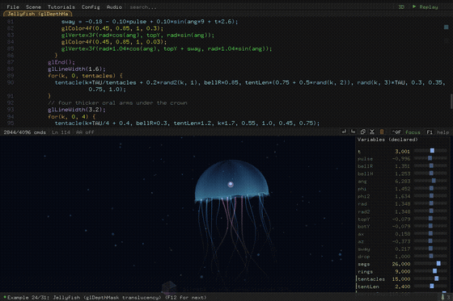
</div>

```c
// additive glow with depth writes OFF (reads stay on) — the translucency
// trick: without it the bell's far side z-fights its near side.
glEnable(GL_BLEND);  glBlendFunc(GL_SRC_ALPHA, GL_ONE);
glEnable(GL_DEPTH_TEST);  glDepthMask(GL_FALSE);

pulse = sin(t*1.6);  bellR = 1.5*(1 + 0.10*pulse);   // the bell breathes
for(i, 0, rings) {                  // latitude strips, crown down to the rim
  glBegin(GL_TRIANGLE_STRIP);
  for(j, 0, segs+1) { /* ring vertices; alpha fades toward the edge */ }
  glEnd();
}

tentacle(angAt, attach, len, phase, amp, cr, cg, cb) {
  glBegin(GL_LINE_STRIP);           // a swaying strand, alpha fading to the tip
  for(s, 0, 14) { /* sway = f(t, phase, depth-along-strand) */ }
  glEnd();
}
for(k, 0, tentacles) { tentacle(...); }

glDepthMask(GL_TRUE);  glDisable(GL_BLEND);          // leave GL as we found it
```

<sub>*(abridged — load the example for the full source)*</sub>

---

### Snowfall — 550 deterministic particles

No particle system, no stored state. Each flake is a pure function of its
index and `t`, wrapped with `rem(...)`, so the whole field replays identically.

<!-- images/showcase/snowfall.gif
     Shot: the full flake field drifting and falling; a few seconds is plenty.
     Generate: scripts/docs-assets.sh sc-snowfall
     Intent: density + motion — sell "550 particles, zero stored state". -->
<div align="center">
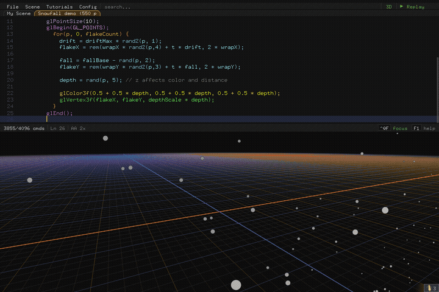
</div>

```c
glPointSize(10);
glBegin(GL_POINTS);
  for (p, 0, 550) {
    drift  = driftMax * rand2(p, 1);
    flakeX = rem(wrapX * rand2(p,4) + t * drift,  2 * wrapX);
    fall   = fallBase - rand(p, 2);
    flakeY = rem(wrapY * rand2(p,3) + t * fall,   2 * wrapY);
    // depth -> shade; nearer flakes brighter
  }
glEnd();
```

<sub>*(abridged — load the example for the full source)*</sub>

---

### Parametric torus

Two nested loops sweep a `GL_QUAD_STRIP` around the tube and the ring. The
same example exports cleanly to `.ply` — it's the one in the
[`--export-ply` docs](ADVANCED_USAGE.md#mesh-export-ply).

<!-- images/showcase/parametric-torus.png — docs-assets.sh sc-parametric-torus
     Static geometry (two nested for-loops, no t), so a still, not a GIF. -->
<div align="center">

</div>

```c
for(i, 0, n) {
  glBegin(GL_QUAD_STRIP);
  for(j, 0, n+1) {
    v = j*TAU/n;  u = i*TAU/n;
    glColor3f(sin(u)*0.4+0.6, cos(v)*0.4+0.6, 0.5);
    glVertex3f((R + r*cos(v))*cos(u), (R + r*cos(v))*sin(u), r*sin(v));
    u = (i+1)*TAU/n;
    glVertex3f((R + r*cos(v))*cos(u), (R + r*cos(v))*sin(u), r*sin(v));
  }
  glEnd();
}
```

---

### Recursive triangle tree

A `branch(depth, size, spin)` function that calls itself — recursion,
inlined by the flattener, capped at depth 64.

<!-- images/showcase/recursive-tree.gif
     Shot: the branching triangle tree; animate t so the spin parameter sways.
     Generate: scripts/docs-assets.sh sc-recursive-tree
     Intent: "the REPL does recursion" in one image. -->
<div align="center">

</div>

```c
branch(depth, size, spin) {
  glColor3f(0.25 + depth*0.14, 0.45 + 0.2*sin(spin), 1 - depth*0.12);
  glBegin(GL_LINE_LOOP);  /* the triangle */  glEnd();
  if(depth > 0) {
    /* recurse: shrink + rotate two children */
  }
}
```

---

## ✦ The full gallery

Grouped by what they show off. Load any with `./gl-repl --example "<name>"`.

### Curves & line art

<table>
<tr>
<td width="33%" align="center">

<!-- images/showcase/spirograph.gif
     scripts/docs-assets.sh sc-spirograph -->
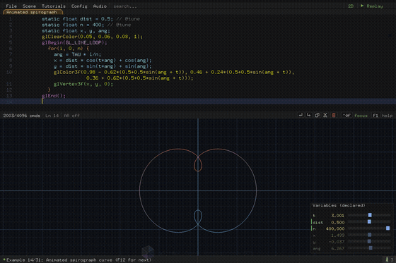

**Animated spirograph**
<br><sub>epitrochoid swept by `t`</sub>

</td>
<td width="33%" align="center">

<!-- images/showcase/ripple-ring.gif
     scripts/docs-assets.sh sc-ripple-ring -->


**Traveling ripple ring**
<br><sub>a wave running around a loop</sub>

</td>
<td width="33%" align="center">


**Animated ring**
<br><sub>`for` + `t`, line loop + fan</sub>

</td>
</tr>
<tr>
<td align="center">

<!-- images/showcase/bezier.png
     Still is fine. Cursor parked on a control-point line so the guides show:
     GLR_EDIT_LINE=<n> + SIGUSR1 capture, or record a short gif.
     ./gl-repl --example "Bezier curve with guides" -->
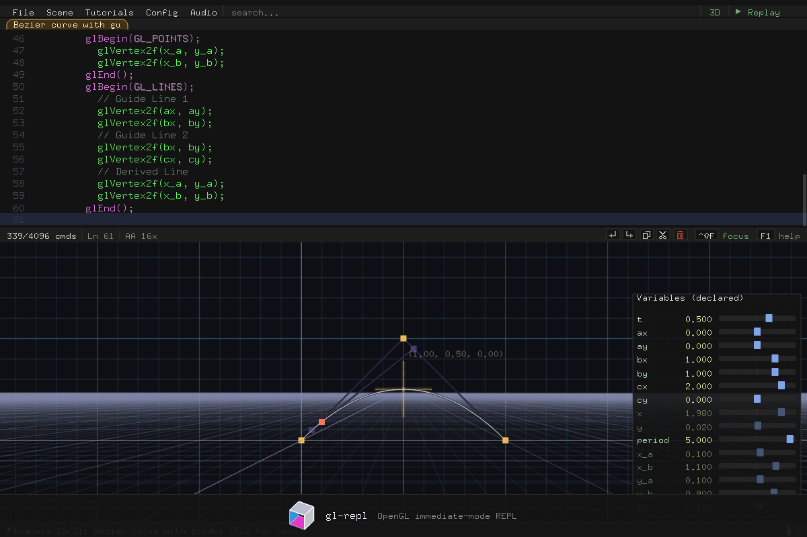

**Bézier curve**
<br><sub>with control-point guides</sub>

</td>
<td align="center">

<!-- images/showcase/de-casteljau.png
     Still is fine. ./gl-repl --example "Scratch arrays (de Casteljau curve)" -->
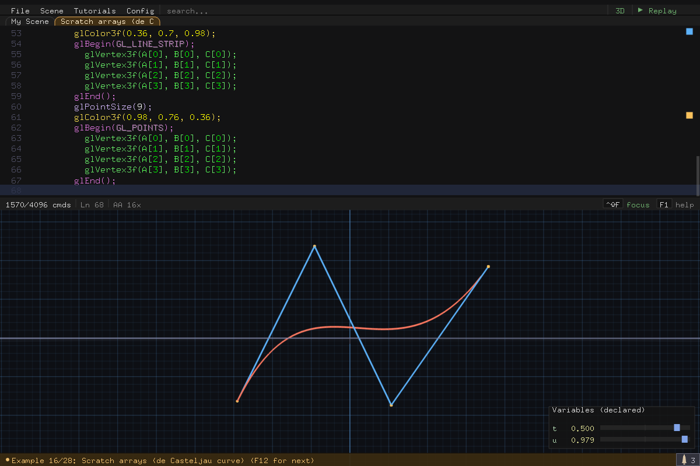

**de Casteljau curve**
<br><sub>built with scratch arrays `A/B/C`</sub>

</td>
<td align="center">

<!-- images/showcase/orbit-plot.png
     Still is fine — the point is the bitmap label() text annotating the plot.
     ./gl-repl --example "Annotated orbit plot (labels)" -->


**Annotated orbit plot**
<br><sub>bitmap `label(...)` text</sub>

</td>
</tr>
</table>

### Surfaces

<table>
<tr>
<td width="33%" align="center">

<!-- images/showcase/wave-surface.gif
     scripts/docs-assets.sh sc-wave-surface
     Intent: the lighting rolling across the wave — normals are the star. -->
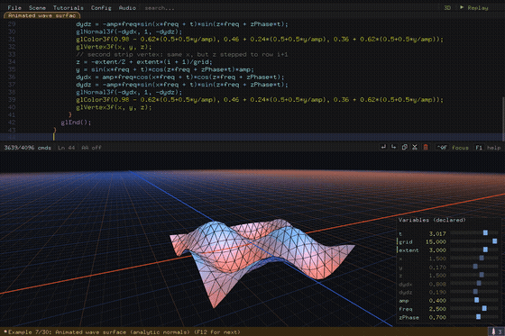

**Animated wave surface**
<br><sub>analytic per-vertex normals</sub>

</td>
<td width="33%" align="center">

<!-- images/showcase/ringed-planet.gif — docs-assets.sh sc-ringed-planet
     (stands in for the retired "Procedural terrain" example). -->


**Ringed planet**
<br><sub>sphere + ring bands, nebula sky</sub>

</td>
<td width="33%" align="center">

<!-- images/showcase/lit-cube.png
     Still. The default example 0 — lighting + material basics.
     ./gl-repl --example "Lit cube" -->
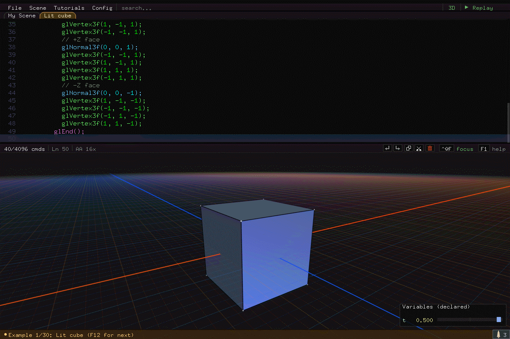

**Lit cube**
<br><sub>lighting + material basics</sub>

</td>
</tr>
</table>

### Particles & effects

<table>
<tr>
<td width="33%" align="center">


**Glow sprites**
<br><sub>additive blend + point attenuation</sub>

</td>
<td width="33%" align="center">

<!-- images/showcase/grass.gif
     scripts/docs-assets.sh sc-grass -->


**Swaying grass field**
<br><sub>`rand` placement, `t` sway</sub>

</td>
<td width="33%" align="center">

<!-- images/showcase/torus-knot.gif
     scripts/docs-assets.sh sc-torus-knot -->
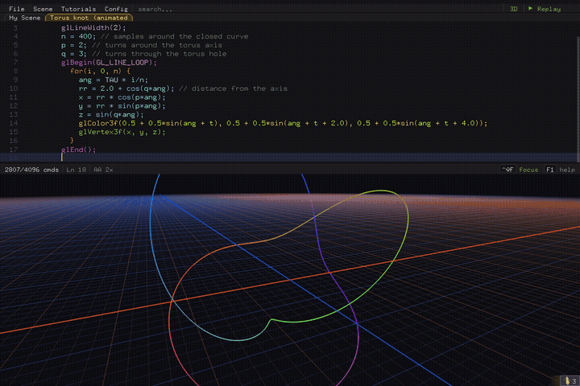

**Torus knot**
<br><sub>`(p,q)` knot, one `GL_LINE_LOOP`</sub>

</td>
</tr>
</table>

### Functions, branching & recursion

<table>
<tr>
<td width="33%" align="center">

<!-- images/showcase/function-demo.png
     Still. ./gl-repl --example "Function demo (named func)" -->


**Named function**
<br><sub>define once, reuse</sub>

</td>
<td width="33%" align="center">

<!-- images/showcase/function-polygons.png
     Still. ./gl-repl --example "Function polygons (args + for)" -->
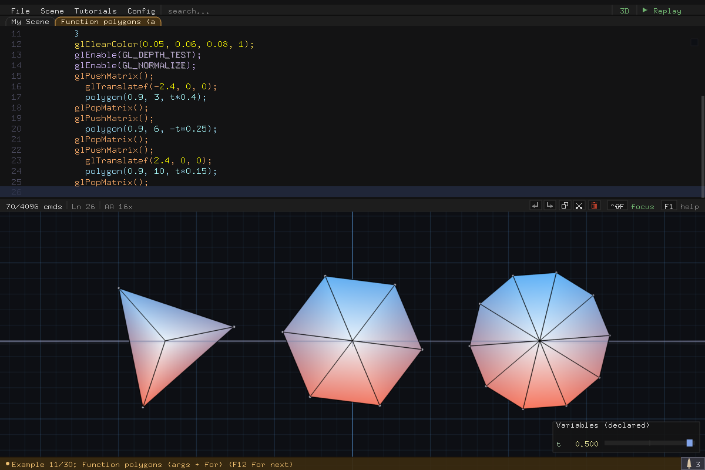

**Function polygons**
<br><sub>args + `for`</sub>

</td>
<td width="33%" align="center">

<!-- images/showcase/conditional-colors.gif
     scripts/docs-assets.sh sc-conditional-colors -->


**Conditional colors**
<br><sub>`if` + `t`</sub>

</td>
</tr>
</table>

### Big scenes

<table>
<tr>
<td width="33%" align="center">


**Orrery**
<br><sub>`label()` text tracking 3D orbits</sub>

</td>
<td width="33%" align="center">

<!-- images/showcase/whale.gif
     scripts/docs-assets.sh sc-whale
     Intent: the flagship scene — lit model + particles together. -->
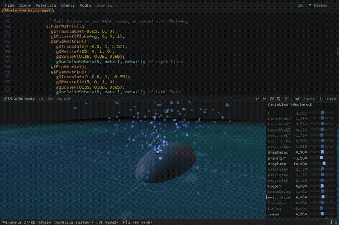

**Whale**
<br><sub>particle system + lit model</sub>

</td>
<td width="33%" align="center">

<!-- images/showcase/stress-test.gif — docs-assets.sh sc-stress-test
     (example: "Dusk lighthouse atoll (stress test)"). -->
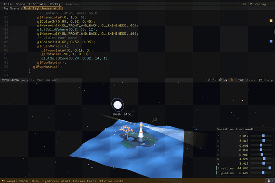

**Dusk lighthouse atoll**
<br><sub>everything at once</sub>

</td>
</tr>
</table>

### Tessellation & guides

<table>
<tr>
<td width="50%" align="center">


**GLU tessellator**
<br><sub>concave polygon (+ cutout variant)</sub>

</td>
<td width="50%" align="center">


**Transform stress**
<br><sub>translate / rotate / scale guides</sub>

</td>
</tr>
</table>

---

## ✦ Beyond the still image

The REPL isn't only a renderer — these are worth a GIF of the *interaction*:

<table>
<tr>
<td width="33%" align="center">

<!-- images/showcase/feature-time.gif — docs-assets.sh sc-feature-time
     A real t-driven clip (Conditional colors). The interactive "freeze, then
     press Ctrl+T to start it moving" beat can't be scripted headlessly, but
     the motion here is genuine. -->
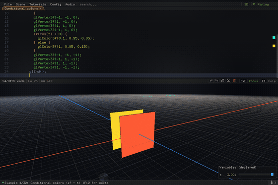

**`Ctrl+T` — time**
<br><sub>everything written in `t` moves</sub>

</td>
<td width="33%" align="center">


**`Ctrl+R` — replay**
<br><sub>watch the scene draw itself</sub>

</td>
<td width="33%" align="center">

<!-- feature-sliders — NOT captured (interactive: dragging a variable-panel
     slider while the scene responds live). images/variable-panel.png is the
     still stand-in shown below. -->


**Live sliders**
<br><sub>drag a `float`, scene responds</sub>

</td>
</tr>
<tr>
<td align="center">


**Transform guides**
<br><sub>see what a `glRotatef` line does</sub>

</td>
<td align="center">

<!-- images/showcase/feature-ply.png — STAND-IN (docs-assets.sh sc-feature-ply
     reuses the parametric-torus scene). The ideal shot is its exported .ply
     opened in MeshLab/Blender:
     ./gl-repl --example "Parametric torus (nested for)" --export-ply torus.ply -->
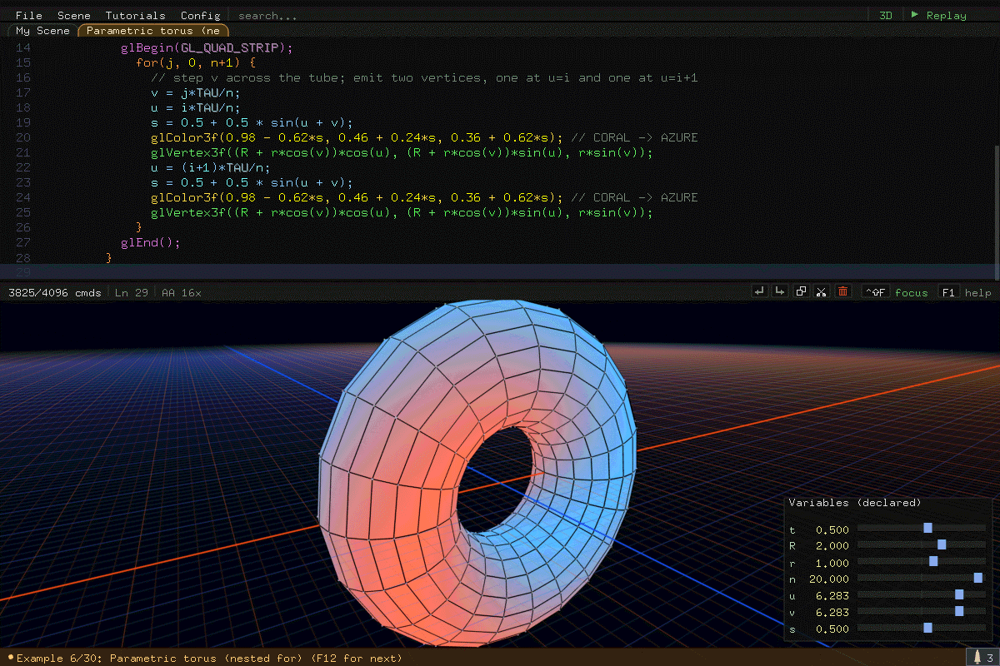

**`F11` — `.ply` export**
<br><sub>take the geometry anywhere</sub>

</td>
<td align="center">

<!-- images/showcase/feature-export-c.png — STAND-IN (docs-assets.sh
     sc-feature-export-c reuses a full-UI scene to show "it's all code in the
     panel"). The ideal shot is the exported output.c open in an editor beside
     the running standalone binary — "it round-trips" in one image. -->
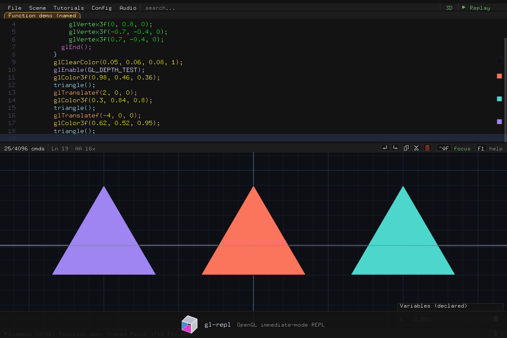

**`Ctrl+S` — standalone C**
<br><sub>round-trips as `output.c`</sub>

</td>
</tr>
</table>

---

<div align="center">

<sub>· · ·</sub>

<sub>back to the <a href="../README.md">README</a> · the <a href="USER_GUIDE.md">User Guide</a> covers every feature shown here</sub>

</div>
