# gl-repl User Guide (Draft)

gl-repl is an interactive OpenGL interpreter. You type classic immediate-mode
GL commands and see geometry render live as you type, with interactive overlays
guiding each edit. Every command stays in an editable code panel, so a scene is
a readable list of GL calls you can revisit, tweak, animate, replay
step-by-step, and export as a standalone C program.

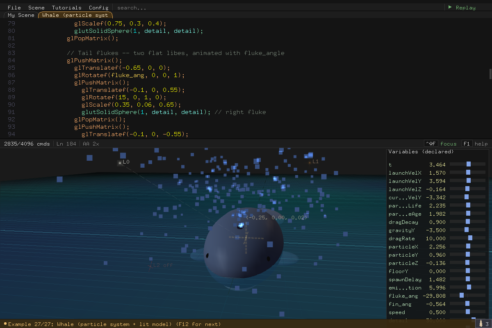

This guide follows the shape of a session: you [start the app](#getting-started),
get your bearings from the [built-in examples](#built-in-examples) and guided
[tutorials](#tutorials), then [write some code](#writing-code) in
[the REPL language](#the-repl-language),
[make it move](#making-it-move), lean on the [visual feedback](#seeing-what-youre-doing)
to understand and debug what you built, and finally [keep and ship](#scenes--workspaces)
the result. Reference material — the full [CLI](#command-line-options) and
[keyboard](#keyboard--mouse-reference) listings — sits at the end. For headless
rendering, recording, and every environment variable, see
[`ADVANCED_USAGE.md`](ADVANCED_USAGE.md); for project internals,
[`ARCHITECTURE.md`](ARCHITECTURE.md).

## Contents

- [Getting Started](#getting-started)
- [Built-in Examples](#built-in-examples)
- [Tutorials](#tutorials)
- [Guided Tours](#guided-tours)
- [Writing Code](#writing-code)
- [The REPL Language](#the-repl-language)
- [Making It Move](#making-it-move)
- [Seeing What You're Doing](#seeing-what-youre-doing)
- [Replay](#replay)
- [Scenes & Workspaces](#scenes--workspaces)
- [Exporting & Importing](#exporting--importing)
- [Tunable Variables (`// @tune`)](#tunable-variables--tune)
- [Performance & Scope](#performance--scope)
- [Profiling & Diagnostics](#profiling--diagnostics)
- [Music](#music)
- [Command-Line Options](#command-line-options)
- [Keyboard & Mouse Reference](#keyboard--mouse-reference)

---

## Getting Started

Run a fresh session, or reload earlier work:

```bash
./gl-repl                  # fresh session
./gl-repl output.c         # reload a saved scene
./gl-repl workspace/       # load every *.c in a directory as scenes
```

### The window


Top to bottom:

- **Menu bar** — *File*, *Scene*, *Tutorials*, *Tours*, *Config*, *Audio*
  dropdowns, a *search...* slot (same as Ctrl+F), and the *Replay* button at
  the far right.
- **Scene tabs** — one tab per open scene (here *First Triangle* and *Ring
  Sketch*). Click to switch.
- **Code panel** — the live, editable list of GL commands. By default it sits
  above the viewport; cycle its position (Left / Top / Bottom / Hidden) with
  **Ctrl+B** or the *Code panel* config item.
- **Status bar** — command count, current line, the accumulation indicator
  (`AA 1x` / `Blur 8x`), and clickable controls for undo/redo, copy/cut,
  clearing all commands, *focus* ([code focus](#keeping-the-buffer-tidy)),
  and *F1 help*.
- **3D viewport** — your geometry, rendered every frame. Drag to orbit,
  scroll to zoom.
- **Variable panel** — bottom-right overlay listing every declared variable
  with a draggable slider (see [The Variable Panel](#the-variable-panel)).
- **Message line** — the bottom row shows the most recent status message.
  Click the small button at its right end to pop up the recent-message
  history.

For a guided flythrough of the menus — browsing the example flyouts, the
tutorial catalog, config toggles, and a replay — generate the 36-second
menu-tour video (with soundtrack; videos are not checked in):

```bash
scripts/record-video.sh --script scripts/video/menu-tour.pointer \
    --example "gl-repl logo" --duration 36 --out menu-tour     # -> menu-tour.mp4
```

### Your first triangle

Type each line, then press `;` or Enter to commit it:

```c
glColor3f(0.98, 0.76, 0.36)
glBegin(GL_TRIANGLES)
glVertex3f(0, 1, 0)
glVertex3f(-1, -1, 0)
glVertex3f(1, -1, 0)
glEnd()
```


> [!NOTE]
> Depth testing is not enabled yet, so the grid behind the triangle remains
> visible. Add `glEnable(GL_DEPTH_TEST)` before `glBegin(GL_TRIANGLES)` to turn
> on depth testing.

The triangle appears as soon as the vertices commit. Now:

- Drag in the viewport to orbit, scroll to zoom.
- Press **Ctrl+T** and change a vertex to `glVertex3f(sin(t), 1, 0)` to
  animate it.
- Press **F12** to flip through the built-in examples for ideas.
- Press **F1** for the built-in help overlay — its *Commands* tab lists every
  supported command, and its *Keys* tab is the full keyboard reference. Esc
  or a click outside dismisses it.

---

## Built-in Examples

**F12** cycles forward through the 35 built-in examples, then any saved
scenes, wrapping to the start; **Shift+F12** cycles backward. The Scene menu
lists them grouped by tag. `./gl-repl --list-examples` prints the compiled-in
set.
Developers can point the app at an editable catalog with
`./gl-repl --examples-dir examples --example <name-or-idx>`:

```
 1  gl-repl logo                                        19  Annotated orbit plot (labels)
 2  Rotating cube                                       20  GLU concave arrow
 3  Animated ring (for + t)                             21  GLU concave arrow cutout
 4  Conditional colors (if + t)                         22  GLU concave arrow extrusion
 5  Transform stress (translate/rotate/scale guides)    23  Glow sprites (blend + point attenuation)
 6  Parametric torus (nested for)                       24  Snowfall particles
 7  Animated wave surface (analytic normals)            25  Swaying grass field (rand + t)
 8  Torus knot (animated)                               26  Jellyfish (glDepthMask translucency)
 9  2D assignment sketch (vars only)                    27  Dusk lighthouse atoll (stress test)
10  Function demo (named func)                          28  Orrery (labels track 3D orbits)
11  Function polygons (args + for)                      29  Whale (particle system + lit model)
12  Function branching (args + if)                      30  Teapot carousel (transform stacks + glow points)
13  Recursive triangle tree (func + recursion)          31  Ringed planet (nebula skies)
14  Sierpinski carpet (2D recursion)                    32  Aurora observatory (dish tracks the sky)
15  Sierpinski sponge (3D recursion)                    33  Bubble sort (scratch arrays)
16  Animated spirograph curve                           34  Clip planes carve solids (glClipPlane)
17  Traveling ripple ring                               35  Fog ring tunnel (glFog)
18  Bezier curve with guides
```

Examples may carry their own presentation presets (grid theme, backdrop,
camera, 2D mode...). Loading an example resets the scene-presentation
settings to defaults first, then applies the example's presets — so examples
always look as authored, and your camera carries over unless the example
sets its own.

Editing an example automatically promotes it to a user scene (see
[Scenes & Workspaces](#scenes--workspaces)) — you never modify the built-ins
themselves.

---

## Tutorials

The **Tutorials** menu offers guided, step-by-step lessons rendered directly
in the code panel — instruction comments appear with a typewriter reveal, and
each step either asks you to type a command (autocomplete ghost text shows
the expected call), acknowledge a short note, change a setting, or drag a
variable slider to a target.

- Tutorials are grouped by tag (hover a tag row for its flyout); flyouts
  group entries under difficulty subheadings.
- While a tutorial is active, the menu gains **Restart Tutorial** and
  **Exit Tutorial** entries.
- Instruction lines are locked — the tutorial guards them against edits
  until you finish or exit.
- **Beginner:** *First Triangle*, *Color & Transform*, *Feature Tour*,
  *Variable Slider*, *First Animation*, *Points & Lines*, *GLUT Solids Tour*,
  and *First Loop*.
- **Intermediate:** *Depth Test Triangle*, *Lighting Basics*, *Color
  Interpolation*, *Line Stipple*, *Blending & Transparency*, *Depth Mask &
  Draw Order*, *Fog*, *Clip Planes*, *Materials & Shininess*, *Normals & Shade
  Model*, *Culling & Winding*, and *Bitmap Text*.
- **Advanced:** *Functions*, *If & Conditionals*, and *Scratch Arrays*.

---

## Guided Tours

Where a tutorial asks *you* to type, the **Tours** menu drives the app for
you: pick an entry and a synthetic pointer takes over — gliding through
menus, hovering flyouts, clicking, and typing, with an on-screen cursor,
click ripples, spotlight rings, and captions narrating each step. Press any
key or click anywhere to stop a tour and take back control (a finished tour
hands control back by itself).

- *Menus & Examples* — browses the Scene example flyouts, loads a showcase
  scene, peeks at Tutorials, toggles a Config overlay, and runs a replay.
- *Editing Basics* — creates a fresh scene and types a spinning triangle
  plus a torus, line by line, showing commits and the autocomplete ghost.
- *Camera & Views* — orbit drags, wheel zoom, and the focus-origin ease.

Tours aim at named UI elements (menus, rows, buttons) resolved against the
live layout as they play, so they work at any window size. Each action starts
when the previous glide, click, typed text, or intentional pause has completed,
rather than relying on absolute timestamps. Captions remain on screen for their
declared duration while the actions they describe continue; a tour uses an
explicit pause when text needs an exclusive reading beat. The web build ships a
browser-safe tour catalog; Editing Basics uses the shell's top **new** button
because the native File menu is replaced by web controls.

---

## Writing Code

The code panel works like a text editor: write and modify your scene's source
there. Unlike a normal editor, gl-repl renders the scene live as you type.

### Committing lines

New and edited lines are checked before they become part of the scene.

- Press **`;`** or **Enter** to commit the current line. If it is valid,
  gl-repl applies it and moves to the next line. If not, the error is
  highlighted and the line stays active so you can fix it.
- Moving to another line with **Up/Down** or by clicking attempts to commit
  your edit automatically. Valid edits are kept; invalid edits are discarded
  and the previous committed version is restored. This keeps every inactive
  line valid.
- Press **Esc** to discard an edit yourself.

### Autocomplete

Autocomplete appears as you type:


Your own functions complete too. Once a slot is defined, both spellings are
offered — the bare `func3(` and any name you gave it (`drawCube(`) — and the
parameter hint after the open paren names that definition's parameters.

### Editing what's there

Selection, clipboard (**Ctrl+C / Ctrl+X / Ctrl+V**), and undo/redo
(**Ctrl+Z / Ctrl+Y**) work like a normal editor. Right-click a GL command for
a short description. **Ctrl+D** deletes the current line or selection;
**Ctrl+L** clears the scene and restores the [five editable display
defaults](#display-default-commands).

**Ctrl+F** opens case-insensitive search over the buffer; **Up / Down** move
to the previous / next match. Press **Enter** for the next match, or **Esc**
to close it. If text is highlighted in the edit line when you press Ctrl+F,
that text seeds the find field and searching starts from it; with nothing
highlighted the previous query is kept.

### Replace

**Tab** in the find bar opens the replace row underneath it and cycles focus
through *find field → replace field → whole-word chip*. In the replace field,
**Enter** runs **Replace All**; the *Replace* button rewrites just the match
you are parked on. Clicking any of the three widgets focuses (and, for the
chip, toggles) it.

The **word** chip switches matching from plain substring to whole identifiers,
and it applies to the search as well as the replace — the match count and the
highlights always show exactly what a replace would rewrite. Turn it on before
renaming something short: without it, replacing `r` also hits the `r` inside
`glColor3f`.

Replace All is the tool for **renaming a variable or a function**. A rename
cannot be done one line at a time — the REPL rejects a declaration whose name
is still referenced below it, and rejects a use of a name that is not declared
yet — so the whole document is rewritten and validated in a single
transaction. If the result does not parse, nothing changes: the document, its
variables, and its scratch arrays are restored, and the status line names the
offending line. A successful replace is one **Ctrl+Z** away from being undone,
and variable values (including anything you dialed in with a `@tune` slider)
carry across the rename.

Two things worth knowing: matching is case-insensitive, so `Radius` and
`radius` are both replaced; and a replacement that pushes a line past the
256-character limit fails the whole operation rather than truncating.

### Display default commands

```c
glEnable(GL_COLOR_MATERIAL);
glColorMaterial(GL_FRONT_AND_BACK, GL_AMBIENT_AND_DIFFUSE);
glLightModeli(GL_LIGHT_MODEL_TWO_SIDE, GL_TRUE);
glMaterialfv(GL_FRONT_AND_BACK, GL_SPECULAR, (GLfloat[]){0.4, 0.4, 0.4, 1});
glMaterialf(GL_FRONT_AND_BACK, GL_SHININESS, 30);
```

These defaults reduce boilerplate for a lit scene. They are ordinary editable
commands, so feel free to modify, remove, or replace them.

### Adjusting values without retyping

Two in-panel widgets close the loop between "committed line" and "number I
want to nudge" without a retype-and-recommit round trip.

**The inline numeric stepper.** Put the cursor on any number in a committed
line and a small up/down stepper appears at the panel's right edge:


- **Click** the arrows to nudge the value (step scales with the value's
  magnitude).
- **Right-click** steps coarse (×10); **Shift+click** steps fine (×1/5).

The line re-commits automatically, so the scene updates as you click.

**The color picker.** Committed `glColor3f` / `glColor4f` / `glClearColor` /
`glMaterialfv` lines show a small color swatch at the right edge of the code
panel. Click it to open the floating picker:


- HSV color controls with a hex readout.
- Palette tabs: **Basic**, **Full**, **Neon** (the curated accent set used by
  the built-in examples, named after the active palette in
  [`accent_palette.h`](../accent_palette.h)), and **Harmony**.
- Changes write back to the source line in real time.

### Inspecting OpenGL state

Right-click a visually blank row in the code panel to inspect OpenGL state at
that point in the program. The row may already be committed or may be the
current, still-uncommitted empty input row.


The popup opens on the state **your program** wrote before that row. The
generated `init()` and `display()` setup writes far more state than a typical
scene does — often by a factor of ten — so those rows start folded behind the
**[+] N from setup** chip on the title row. Click it to fold them in; they draw
in a muted tone so the two groups stay distinguishable. Explicit writes that
happen to match the initial OpenGL default are kept either way, so touched-ness
stays visible.

The current value is always visible; click the **[+] default/source** chip in
the column header to add the initial default and the source of the latest
write — `init()`, generated `display()`, or a user `display()` line. The line
number it quotes is the one in the code panel's left margin, so it stays
right whether or not code focus is hiding the derived C boilerplate (those
hidden rows are counted in the margin numbering).

A light's parameter rows appear only while that light can affect the frame —
that is, while it is enabled, or if your program set one of its parameters
itself. Four disabled lights would otherwise contribute twenty rows of
unreachable state.

Modelview matrices use four aligned rows. Light positions are shown in both
world and eye coordinates when available. Use the mouse wheel for a long
report; click elsewhere or send input to the editor to dismiss it.

### Keeping the buffer tidy

| Key | Action |
|---|---|
| Ctrl+\ | Reformat all lines (re-indent blocks) |
| Ctrl+/ | Toggle `//` comment on the current line |
| Ctrl+Shift+S | Split a multi-name `float` declaration into one decl per line (also File → Split Declaration) |
| Ctrl+Shift+F | Toggle code focus — the first-run view shows just your code; turn it off to show generated C/workspace chrome (also the *focus* keycap) |
| Ctrl+B | Cycle code panel layout: Left / Top / Bottom / Hidden |
| PgUp / PgDn | Scroll the active panel or overlay |

More code-panel toggles live in the Config menu: **Wrap at commas**
(long calls wrap at argument boundaries), **Syntax highlight**
(Ctrl+Shift+Y; Off / On / On+Shadow), and **Paren match** / **Paren scope**
(highlight the matching bracket under the caret, and the span of the
enclosing parens).

---

## The REPL Language

The language is immediate-mode OpenGL with just enough structure around it —
variables, loops, functions, conditionals — to build real scenes. Every
numeric argument everywhere is a full math expression.

### Supported GL commands

- [`glBegin(MODE)`](https://docs.gl/gl2/glBegin), [`glEnd()`](https://docs.gl/gl2/glEnd)
- [`glVertex3f(x,y,z)`](https://docs.gl/gl2/glVertex), [`glVertex2f(x,y)`](https://docs.gl/gl2/glVertex)
- [`glNormal3f(x,y,z)`](https://docs.gl/gl2/glNormal)
- [`glColor3f(r,g,b)`](https://docs.gl/gl2/glColor), [`glColor4f(r,g,b,a)`](https://docs.gl/gl2/glColor)
- [`glClearColor(r,g,b,a)`](https://docs.gl/gl2/glClearColor) — background clear color; channels
  clamp to >= 0.15 (prevents a fully black background from hiding geometry)
- [`glTranslatef(x,y,z)`](https://docs.gl/gl2/glTranslate), [`glScalef(sx,sy,sz)`](https://docs.gl/gl2/glScale),
  [`glRotatef(deg,x,y,z)`](https://docs.gl/gl2/glRotate)
- [`glPushMatrix()`](https://docs.gl/gl2/glPushMatrix), [`glPopMatrix()`](https://docs.gl/gl2/glPushMatrix),
  [`glLoadIdentity()`](https://docs.gl/gl2/glLoadIdentity)
- [`glMultMatrixf(A)`](https://docs.gl/gl2/glMultMatrix) — post-multiply by a
  scratch array read as a 4x4 (see [Arbitrary matrices](#arbitrary-matrices))
- [`glPolygonMode(face,mode)`](https://docs.gl/gl2/glPolygonMode) — `GL_FILL`,
  `GL_LINE`, or `GL_POINT` rasterization, per face
- [`glPolygonOffset(factor,units)`](https://docs.gl/gl2/glPolygonOffset) — depth
  nudge for coplanar passes; needs `glEnable(GL_POLYGON_OFFSET_FILL)`
- [`glPushAttrib(mask)`](https://docs.gl/gl2/glPushAttrib), [`glPopAttrib()`](https://docs.gl/gl2/glPushAttrib) —
  save/restore a group of GL state (see Scoping state below). `mask` is one or
  more of `GL_CURRENT_BIT`, `GL_POINT_BIT`, `GL_LINE_BIT`, `GL_POLYGON_BIT`,
  `GL_LIGHTING_BIT`, `GL_FOG_BIT`, `GL_DEPTH_BUFFER_BIT`, `GL_TRANSFORM_BIT`,
  `GL_ENABLE_BIT`, `GL_COLOR_BUFFER_BIT`, OR'd with `|`, or
  `GL_ALL_ATTRIB_BITS` for all ten supported groups. `GL_FOG_BIT` scopes the
  `glFog*` parameters; the `GL_FOG`
  enable flag rides both `GL_FOG_BIT` and `GL_ENABLE_BIT`
- [`glEnable(CAP)`](https://docs.gl/gl2/glEnable), [`glDisable(CAP)`](https://docs.gl/gl2/glEnable)
  - CAP: `GL_DEPTH_TEST`, `GL_LIGHTING`, `GL_COLOR_MATERIAL`, `GL_NORMALIZE`,
    `GL_LINE_SMOOTH`, `GL_POINT_SMOOTH`, `GL_BLEND`, `GL_CULL_FACE`, `GL_FOG`,
    `GL_LIGHT0..GL_LIGHT3`, `GL_CLIP_PLANE0..GL_CLIP_PLANE5`
- [`glShadeModel(MODE)`](https://docs.gl/gl2/glShadeModel)
- [`glPointSize(size)`](https://docs.gl/gl2/glPointSize), [`glLineWidth(width)`](https://docs.gl/gl2/glLineWidth)
- [`glPointParameterfv(GL_POINT_DISTANCE_ATTENUATION, const, linear, quadratic)`](https://docs.gl/gl2/glPointParameter)
- [`glBlendFunc(GL_SRC_ALPHA, GL_ONE_MINUS_SRC_ALPHA | GL_ONE)`](https://docs.gl/gl2/glBlendFunc)
- [`glColorMaterial(face, mode)`](https://docs.gl/gl2/glColorMaterial)
- [`glMaterialfv(face, pname, (GLfloat[]){r, g, b, a})`](https://docs.gl/gl2/glMaterial)
- [`glLightModeli(pname, param)`](https://docs.gl/gl2/glLightModel), [`glFrontFace(mode)`](https://docs.gl/gl2/glFrontFace)
- [`glDepthFunc(func)`](https://docs.gl/gl2/glDepthFunc), [`glDepthMask(GL_TRUE|GL_FALSE)`](https://docs.gl/gl2/glDepthMask)
- [`glColorMask(r, g, b, a)`](https://docs.gl/gl2/glColorMask) — each channel GL_TRUE/GL_FALSE or 0/1
- [`glClear(mask)`](https://docs.gl/gl2/glClear) — clear again part-way down a scene (see Clearing
  mid-scene). `mask` is `GL_COLOR_BUFFER_BIT`, `GL_DEPTH_BUFFER_BIT`, or both
  OR'd with `|`
- [`glClearDepth(depth)`](https://docs.gl/gl2/glClearDepth) — the depth value a
  `GL_DEPTH_BUFFER_BIT` clear writes. GL clamps it to 0..1 and defaults to 1
  (the far plane); a lower value makes the cleared buffer reject geometry
  further away than that depth. Scoped by `GL_DEPTH_BUFFER_BIT` on the
  attribute stack, alongside `glDepthFunc` / `glDepthMask`
- [`glEdgeFlag(GL_TRUE|GL_FALSE)`](https://docs.gl/gl2/glEdgeFlag) — scalar boundary-edge flag; 0/1 accepted
- [`glClipPlane(plane, (GLdouble[]){a, b, c, d})`](https://docs.gl/gl2/glClipPlane) — user clip
  plane (see Clip planes)
- [`glFogi(GL_FOG_MODE, GL_LINEAR|GL_EXP|GL_EXP2)`](https://docs.gl/gl2/glFog),
  [`glFogf(pname, value)`](https://docs.gl/gl2/glFog) with pname `GL_FOG_DENSITY`,
  `GL_FOG_START`, or `GL_FOG_END`, and
  [`glFogfv(GL_FOG_COLOR, (GLfloat[]){r, g, b, a})`](https://docs.gl/gl2/glFog) —
  distance fog; enable with `glEnable(GL_FOG)` (see built-in example *Fog ring
  tunnel*)
- [`glRasterPos3f(x, y, z)`](https://docs.gl/gl2/glRasterPos) — position for bitmap text (see label below)

[`glMaterialfv`](https://docs.gl/gl2/glMaterial) also accepts the flat shorthand
`glMaterialfv(face, pname, r, g, b, a)` — the parser rewrites it to the
compound-literal form. [`glClipPlane`](https://docs.gl/gl2/glClipPlane) and
[`glFogfv`](https://docs.gl/gl2/glFog) accept the same flat shorthand
(`glClipPlane(plane, a, b, c, d)`, `glFogfv(GL_FOG_COLOR, r, g, b, a)`).

### GLUT solid shapes

- [`glutSolidTorus(inner, outer, nsides, rings)`](https://github.com/freeglut/freeglut/blob/master/doc/api.md#152-glutwiretorus-glutsolidtorus)
- [`glutSolidCube(size)`](https://github.com/freeglut/freeglut/blob/master/doc/api.md#155-glutwirecube-glutsolidcube)
- [`glutSolidSphere(radius, slices, stacks)`](https://github.com/freeglut/freeglut/blob/master/doc/api.md#151--glutwiresphere-glutsolidsphere)
- [`glutSolidTeapot(size)`](https://github.com/freeglut/freeglut/blob/master/doc/api.md#1511-glutwireteapot-glutsolidteapot-glutwireteacup)
- [`glutSolidCone(base, height, slices, stacks)`](https://github.com/freeglut/freeglut/blob/master/doc/api.md#154-glutwirecone-glutsolidcone)

### GLU tessellator (concave / complex polygons)

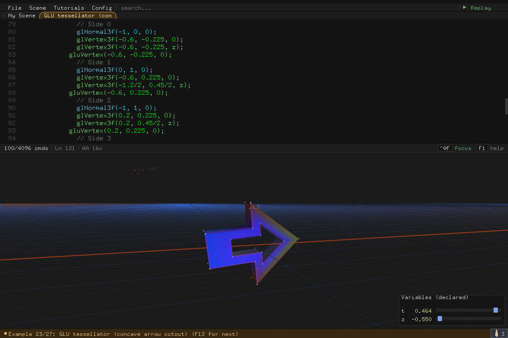

`gluTess` polygons handle concave outlines, and multiple contours in one
polygon create holes (odd winding rule). See built-in examples *GLU
concave arrow*, *GLU concave arrow cutout*, and *GLU concave arrow
extrusion* for the syntax in action.

- `gluBegin(GLU_POLYGON)` — start a tessellated polygon (REPL syntax over
  [`gluTessBeginPolygon`](https://registry.khronos.org/OpenGL-Refpages/gl2.1/xhtml/gluTessBeginPolygon.xml))
- `gluBegin(GLU_CONTOUR)` — start a contour within the polygon (REPL syntax
  over [`gluTessBeginContour`](https://registry.khronos.org/OpenGL-Refpages/gl2.1/xhtml/gluTessBeginContour.xml))
- `gluEnd()` — end the current contour or polygon, tracked by nesting depth
  (REPL syntax over [`gluTessEndContour`](https://registry.khronos.org/OpenGL-Refpages/gl2.1/xhtml/gluTessEndContour.xml) /
  [`gluTessEndPolygon`](https://registry.khronos.org/OpenGL-Refpages/gl2.1/xhtml/gluTessEndPolygon.xml))
- `gluNormal(nx, ny, nz)` — set the per-vertex normal (REPL syntax over
  [`gluTessNormal`](https://registry.khronos.org/OpenGL-Refpages/gl2.1/xhtml/gluTessNormal.xml))
- `gluColor(r, g, b[, a])` — set the per-vertex color; alpha defaults to 1.0
  when omitted (REPL-only convenience, no direct GLU equivalent)
- `gluVertex(x, y, z)` — add a vertex to the current contour (REPL syntax
  over [`gluTessVertex`](https://registry.khronos.org/OpenGL-Refpages/gl2.1/xhtml/gluTessVertex.xml))

### Bitmap text — `label()`

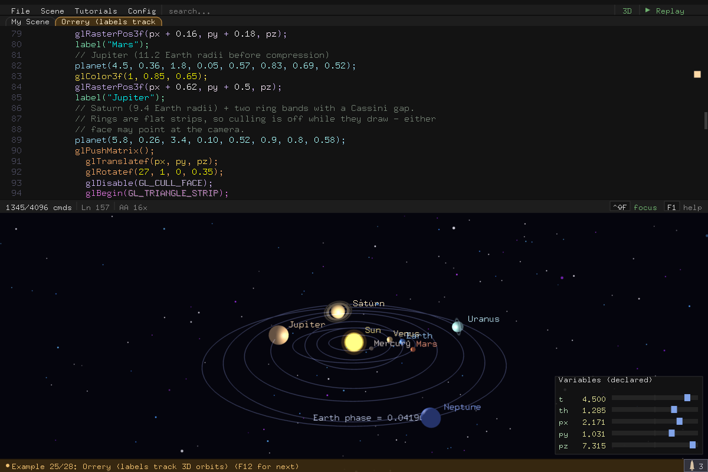

```c
glRasterPos3f(x, y, z);      // place the text anchor (transforms apply)
label("Earth phase = %f", t);
```

- `label("fmt", a, b, c, d)` draws bitmap text at the current raster
  position. Up to 4 substitution args; `%f` substitutes a value, `%%` is a
  literal percent. The string literal between the quotes is limited to 64
  characters and may not contain `//`, `(`, `)`, `,`, or backslashes.
- This is a REPL convenience, not a real GL call — exported C files include
  a self-contained `label()` helper so they still compile standalone.

### Clip planes

```c
glClipPlane(GL_CLIP_PLANE0, (GLdouble[]){0.2, 1, 0.3, 0.4});
glEnable(GL_CLIP_PLANE0);
```

`glClipPlane` sets the plane equation `a*x + b*y + c*z + d >= 0` — GL keeps
the half-space the inequality selects and clips everything on the other
side. Six planes are available (`GL_CLIP_PLANE0..5`); each does nothing
until its cap is enabled. The equation is interpreted in the coordinate
frame active at the call, so transforms before the line position the plane
just like they position geometry.

Coefficients are full expressions, so a plane can animate — a `d` driven by
`t` sweeps a live cross-section through the scene:

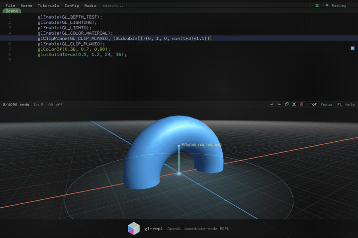

A plane equation is hard to picture from four numbers, so the cursor draws
it for you — see [the clip-plane guide](#the-clip-plane-guide). Exporting
keeps clip planes standalone-compilable: the C file routes the equation
through a small `repl_gldouble4` helper (compound literals are C99; the
export targets C89) and reload converts it back.

The *Clip planes carve solids (glClipPlane)* example walks the three core
moves — one plane (a sphere becomes a dome), two planes meeting at an angle
(a 120° wedge), and an animated `d` (a cutaway sweeping through a torus).

### Clearing mid-scene

```c
glClear(GL_DEPTH_BUFFER_BIT);
glClear(GL_COLOR_BUFFER_BIT | GL_DEPTH_BUFFER_BIT);
```

The REPL already clears colour and depth before it runs your first line, so
`glClear` is not the frame setup it is in a normal GL program — it is a line
you put *in the middle* of a scene to clear again from there down.

The useful one is `GL_DEPTH_BUFFER_BIT`. It throws away the depth of
everything drawn so far, so geometry below the line draws over what came
before it no matter how far away it is — the classic way to sit a HUD, a
gizmo, or an inset object on top of a scene without moving it:

```c
glutSolidTeapot(0.6);
glClear(GL_DEPTH_BUFFER_BIT);   // everything below wins the depth test
glColor3f(0.98, 0.45, 0.4);
glutSolidCube(0.3);             // ...so the cube is never hidden by the teapot
```

`GL_COLOR_BUFFER_BIT` repaints the scene with the current
[`glClearColor`](https://docs.gl/gl2/glClearColor), erasing geometry drawn
above the line. It is confined to the 3D viewport, so it cannot touch the
code panel or the menu bar — the rest of the window keeps the background the
frame started with.

`mask` is one bit, or both OR'd with `|`. Unlike every other numeric
argument, it is not an expression: only these two tokens are accepted, and
the line is stored in a fixed order regardless of how you spell it
(`GL_DEPTH_BUFFER_BIT | GL_COLOR_BUFFER_BIT` commits as
`GL_COLOR_BUFFER_BIT | GL_DEPTH_BUFFER_BIT`). The stencil and accumulation
bits are not offered: nothing in the REPL writes stencil, and clearing the
accumulation buffer would fight the accum effects under [Rendering
quality](#rendering-quality).

### Wireframe & decals — glPolygonMode, glPolygonOffset

`glPolygonMode(face, mode)` picks how polygons rasterize: `GL_FILL` (the
default), `GL_LINE` for edges only, or `GL_POINT` for their corners. It is a
wireframe of the geometry you already submitted — no second set of line
primitives to build, and `face` (`GL_FRONT`, `GL_BACK`, `GL_FRONT_AND_BACK`)
can give the two sides different treatments:

```c
glPolygonMode(GL_FRONT_AND_BACK, GL_LINE);
glutSolidSphere(1, 24, 16);       // the same sphere, as wireframe
glPolygonMode(GL_FRONT_AND_BACK, GL_FILL);
```

`glPolygonOffset(factor, units)` exists for the pass you draw *on top of*
another. Two coplanar surfaces have mathematically equal depth, so the depth
test can't order them and the result speckles — the artefact known as
z-fighting. The offset shifts polygon depths a hair before the test, and
negative values pull toward the viewer:

```c
glEnable(GL_POLYGON_OFFSET_FILL);
glPolygonOffset(-1, -1);          // pull the decal in front of the wall
glColor3f(1, 0.4, 0.2);
glBegin(GL_QUADS); /* … the decal, drawn on the wall's plane … */ glEnd();
glDisable(GL_POLYGON_OFFSET_FILL);
```

`factor` scales with the polygon's depth slope (how steeply it recedes) and
`units` is a fixed multiple of the smallest resolvable depth difference;
`(-1, -1)` is the conventional starting pair for both. **The offset only
applies while the matching capability is enabled** — `GL_POLYGON_OFFSET_FILL`
for filled polygons, `GL_POLYGON_OFFSET_LINE` and `GL_POLYGON_OFFSET_POINT`
for the other two `glPolygonMode` modes. Setting an offset without enabling
one of those does nothing at all, which is the usual reason a decal still
flickers.

The two commands are made for each other: a wireframe drawn over its own solid
is the same z-fight, so `glPolygonMode(GL_FRONT_AND_BACK, GL_LINE)` plus
`glEnable(GL_POLYGON_OFFSET_LINE)` is how an outlined-solid pass stays clean.

### Scoping state with glPushAttrib

`glPushAttrib(mask)` saves a group of GL state; the matching `glPopAttrib()`
puts it back. Use them to make a local change without it leaking into the
rest of the scene:

```c
glColor3f(0.2, 0.6, 1);
glPushAttrib(GL_CURRENT_BIT | GL_LINE_BIT);
  glColor3f(1, 0.3, 0.3);   // red, and…
  glLineWidth(4);           // …fat lines, but only until the pop
  glBegin(GL_LINE_LOOP); glVertex3f(-1, 0, 0); glVertex3f(1, 0, 0); glEnd();
glPopAttrib();              // colour and line width snap back to blue / 1
```

`mask` names which *groups* of state to save, one or more of `GL_CURRENT_BIT`
(colour, normal, raster position, edge flag), `GL_POINT_BIT`, `GL_LINE_BIT`,
`GL_POLYGON_BIT` (cull + winding + polygon mode/offset), `GL_LIGHTING_BIT`
(materials, shade model,
lights), `GL_FOG_BIT` (fog mode / density / start / end / colour),
`GL_DEPTH_BUFFER_BIT`, `GL_TRANSFORM_BIT` (clip planes), `GL_ENABLE_BIT`
(every `glEnable`/`glDisable` toggle), and `GL_COLOR_BUFFER_BIT` (blend, clear
colour, colour mask). The `GL_FOG` enable flag is saved by both `GL_FOG_BIT`
and `GL_ENABLE_BIT`, matching real GL. Join several with `|` — like `glClear`'s
mask it is a fixed set of tokens (no expressions), canonicalised to a stable
order. `GL_ALL_ATTRIB_BITS` is a compact alias for the union of every group the
REPL can currently change; its scope therefore grows if a later release adds
another supported group.

Two editor affordances make the scope visible. Park the cursor on a
`glPushAttrib` line and each mask token lights up in its own colour, and every
earlier line whose value the push *saves* gets a matching gutter marker
("what's about to be protected"). Park it on the `glPopAttrib` and the lines
whose changes the pop *reverts* light up instead ("what snaps back here"). A
push or pop with no partner gets the same red gutter warning as an unmatched
`glPushMatrix`.

### Math expressions

Every numeric argument is a full expression, evaluated when the line runs:

- **Operators:** `+ - * / %` and parentheses; comparisons
  `> < >= <= == !=`; logical `&& || !`.
- **Functions:** `sin`, `cos`, `tan`, `asin`, `acos`, `atan`, `atan2(y, x)`,
  `sqrt`, `abs`, `pow`, `log` (base 10), `ln` (base e), `min`, `max`,
  `clamp(x, lo, hi)`, `lerp(a, b, s)`, `smoothstep(e0, e1, x)`, `sign`,
  `floor`, `ceil`, `round`, `fmod`, `rem`, `rand(seed[, iter])`,
  `rand2(seed[, iter])`. `fmod` is the C `fmodf` (result takes the sign of the
  dividend); `rem` is the IEEE remainder via `remainderf` (rounds the quotient
  to nearest, so the result can differ in sign).
- **Constants:** `PI`, `TAU`, `e`.

`rand` returns a deterministic value in `[0, 1]` for a given (seed, iter)
pair; `rand2` is the same hash mapped to `[-1, 1]` — useful for centered
jitter. Determinism means particle systems look the same every frame and
every run — it is the stateless substitute for storing random values, a
pattern covered in [Working without state](#working-without-state).

`atan2(y, x)` is the inverse of the polar pair: it returns the angle in
`[-PI, PI]` from the +X axis to `(x, y)`, using both signs to pick the right
quadrant (unlike a plain `y/x` ratio). It is how a shape turns to face
something — `glRotatef(atan2(tz, tx) * 180 / PI, 0, 1, 0)` aims the local +X
axis at the target `(tx, tz)`, and `atan2` of a vertex's own coordinates
recovers the polar angle a ring was built from. Plain `atan(x)` takes a slope
instead of a pair, so it can only answer within `(-PI/2, PI/2)` — reach for it
when you already have a ratio (a tilt from `rise/run`), and for anything built
from two coordinates prefer `atan2`. `asin` and `acos` invert the other two:
both clamp their argument to `[-1, 1]` first, so a dot product that drifts a
hair past 1 returns `0` rather than a NaN that would erase the geometry
mid-edit.

`clamp`, `lerp`, `smoothstep`, and `sign` are the animation-shaping set — the
things most scenes end up spelling out by hand:

```c
clamp(x, lo, hi)         // x held inside [lo, hi]; replaces min(max(x, lo), hi)
lerp(a, b, s)            // a at s=0, b at s=1, straight line between
smoothstep(e0, e1, x)    // 0 below e0, 1 above e1, eased curve in between
sign(x)                  // -1, 0, or 1
```

`lerp` is the one to reach for whenever something moves *from* one value *to*
another: `lerp(1, 3, s)` grows a radius, and nesting a `sin` in the blend
factor gives an oscillation between two poses. It is deliberately **not**
clamped, so `s` past 1 (or below 0) overshoots the endpoints — that is how
springy easings are written, and `clamp(s, 0, 1)` is the hard stop when you
don't want it.

`smoothstep` is the fade whose start and stop you can't see: it leaves `e0` and
arrives at `e1` with zero slope, where a bare `lerp` visibly kinks at both
ends. Feed it a *distance* for a soft edge (`smoothstep(4, 2, dist)` fades a
glow in as geometry approaches) or a *time* for an entrance
(`smoothstep(0, 1, t)`). Its edges may run either direction: passing `e0 > e1`
ramps from 1 down to 0.

`sign` returns exactly `0` at `0` — it is not a rounding function, it answers
"which side". Multiplying by it mirrors a value about the origin
(`sign(x) * 0.5` snaps to one side or the other), and it turns a comparison
into arithmetic without an `if`.

### Variables

```c
float x, y, z;          // declare before use
x = 1.5;                // assign (any expression)
glVertex3f(x, y, z);    // use anywhere a number is expected
```

- Declarations are hoisted to the top of the program automatically, so every
  reference follows its declaration.
- Up to 31 user variables (plus the predefined `t`).
- Variables persist across commits and are saved/loaded with the scene.
- Initializers are allowed: `float n = 1;`.

### Scratch arrays

`A[16]`, `B[16]`, and `C[16]` are three fixed global arrays for loop and
recursive algorithms:

```c
A[0] = 0;
A[1] = 1;
A[0] = A[0] + (A[1] - A[0]) * 0.25;
glVertex3f(A[0], 0, 0);
```

Indices truncate to int and must stay in `0..15`. Like variables, scratch
arrays persist and round-trip through save/load.

### Arbitrary matrices

Sixteen cells is also exactly a 4x4 matrix, which is what `glMultMatrixf`
reads them as:

```c
A[0] = 1;                 // the identity matrix: 1s down the diagonal
A[5] = 1;
A[10] = 1;
A[15] = 1;
glMultMatrixf(A);         // post-multiply the current matrix by A
```

The argument is a bare array name — `A`, `B`, or `C`. Not an expression, not a
subscript, not a list of numbers: the array *is* the matrix, and you fill it
with ordinary `A[k] = ...` lines above the call, in the same block. Cells you
never assign are zero, so write all sixteen (or at least every one your matrix
needs non-zero — an unassigned `A[15]` leaves the matrix singular and your
geometry gone).

The layout is OpenGL's **column-major** order, the same one `glGetFloatv`
returns: `A[0..3]` is the first column, `A[4..7]` the second, and — the one
worth memorizing — `A[12]`, `A[13]`, `A[14]` hold the translation.

`glTranslatef`, `glRotatef`, and `glScalef` cover almost everything, and they
read far better than sixteen assignments; reach for `glMultMatrixf` only for
what they cannot express between them. A shear is one. A mirror is another.
The classic is the planar shadow projection — the matrix that squashes
geometry onto a plane as seen from a light, so drawing the shape a second
time through it draws its shadow:

```c
float lx, ly, lz;         // light position, over a floor at y = 0
lx = 2;
ly = 4;
lz = 1;
A[0] = ly;                // only five cells are non-zero for this one;
A[4] = -lx;               // the rest of A must be 0, which is how a
A[6] = -lz;               // freshly reset scratch array already reads
A[7] = -1;
A[10] = ly;
A[15] = ly;
glPushMatrix();
glMultMatrixf(A);
glColor3f(0.1, 0.1, 0.12);   // draw the geometry again, flattened and dark
glutSolidTeapot(1);
glPopMatrix();
```

(One statement per line, as everywhere else in the REPL — the sixteen cells
are sixteen lines when a matrix needs all of them.)

The values are read when the frame is built, at that point in the program, so
a matrix assembled from `t` animates like any other expression — and the
transform guides, replay, and overlays all follow it, because they see the
same matrix the frame did.

### For-loops

```c
for(i, 0, 24) glVertex3f(cos(i*TAU/24), sin(i*TAU/24), 0);

for(i, 0, n, 2) {        // optional step argument; multi-line body
    glVertex3f(i, 0, 0);
}
```

The parser accepts up to 64 nested blocks. In practice, useful nesting is
limited first by the flat-command budget and the number of loop-iterator
variables in scope. Loop bounds can be expressions (and can animate with
`t`).

### Functions

```c
func1(radius, sides) {            // func0..func9, up to 10 params
    for(i, 0, sides) {
        glVertex3f(radius*cos(i*TAU/sides), radius*sin(i*TAU/sides), 0);
    }
}
drawCube() {                      // or any name — aliases to a free funcN slot
    glutSolidCube(1);
}

func1(1.5, 6);                    // call (parens always required)
drawCube();
```

Ten function slots are available. Recursion works when paired with an
`if(...)` guard — see the *Recursive triangle tree* example.

### Conditionals

```c
if(t > 1) {
    glColor3f(1, 0, 0);
}
```

### Labels & goto (experimental, top-level only)

```c
:loop                    // declare a jump target (colon syntax)
goto loop                // jump back; pair with if(...) to exit
```

(Note the distinction: `:name` / `name:` is a goto target; `label("...")` is
the bitmap-text call.)

### Comments

Type `// text` directly to add a comment line. `Ctrl+/` toggles a comment on
an existing line. A `// @tune` tag on a `float` declaration marks it as a
tunable knob (see [Tunable Variables](#tunable-variables--tune)).

---

## Making It Move

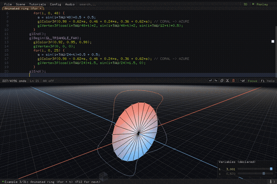

`t` is the one predefined variable — it exists in every session without a
declaration, starts at `0`, and while playing advances a fixed 1/60 s per
rendered frame. Use it in any expression:

```c
glRotatef(t*45, 0, 1, 0);
glVertex3f(sin(t), cos(t), 0);
```

This is the whole animation model: there is no keyframe data and no
accumulated state. The scene re-evaluates every frame, so anything written
in terms of `t` animates — loop bounds, colors, transforms, vertex
positions — and a frame is a *pure function of `t`*. The same `t` always
produces the same picture, which is what makes the scrubbing below (and
headless capture) exactly reproducible.

- **Ctrl+T** plays/pauses time (the *Auto time* config item is the same
  toggle).
- **Ctrl+Shift+T** resets time `t` to zero.
- `--time <secs>` (or the `GLR_TIME` env var) sets the starting `t` when
  launching — handy for headless captures of a later moment.

### Working without state

A frame being a pure function of `t` cuts both ways: there is nowhere to
*accumulate* anything between frames. You cannot write `pos = pos + vel`
once per frame and expect `pos` to remember where it was — next frame the
scene re-evaluates from source, not from last frame's values. Scenes that
would normally keep state use one of three patterns instead. They read a
little differently from typical game-loop code, but they are not harder
to write — and they are *easier to debug*, because any moment can be
reproduced exactly by setting `t`, without replaying history to get there.

**Deterministic randomness instead of stored random state.** Where a
game loop would roll a particle's attributes once and store them, here
each particle recomputes them every frame from `rand(seed, iter)` /
`rand2` — the same (seed, iter) pair always returns the same value, so a
particle's "random" drift, size, or tint is a stable per-particle
constant keyed on its index. The *Snowfall particles* example
derives every flake's drift, fall speed, and depth from `rand(p, slot)`
with the particle index `p` as the seed; *Swaying grass field (rand + t)*
does the same per blade (position, height, sway phase, tint), with a
comment documenting its seed-slot convention so the RNG streams stay
independent.

**Integrate velocity in closed form.** Physics normally accumulates:
`vel += accel*dt; pos += vel*dt`. Statelessly, position must instead be
the *integral* of the velocity function, evaluated at the particle's age.
For constant acceleration that is the familiar projectile polynomial; for
dampened (decaying) velocity it is the integral of the decay curve. The
*Whale (particle system + lit model)* example does both, with the math
worked out in its comments: `computeVerticalMotion` integrates gravity
(`launchY + gravityY/2*age^2 + launchVelY*age`), and
`computeDriftX`/`computeDriftZ` integrate an exponentially decaying
horizontal velocity (`velX(s) = launchVelX * dragDecay^(dragRate*s)`) to
get drift-with-drag. Looping lifetimes fall out of `fmod`:
`age = fmod(t - spawnDelay, particleLife)` respawns each particle forever
with no bookkeeping.

**Replay the algorithm from the start.** Some scenes really are
history-dependent — a sort's array order depends on every swap before it.
The stateless version recomputes that history each frame: start from the
initial state and re-run the algorithm's steps up to the count implied by
`t`. The *Bubble sort (scratch arrays)* example re-seeds `A[0..15]` with
a deterministic shuffle and re-runs its compare-and-swap loops every
frame, gating each compare on `p*15 + j < steps` where `steps` derives
from `t` — the bars freeze mid-sort at exactly the right compare, and
dragging the time slider scrubs the sort forwards *and backwards*.

The payoff of all three is the same: reproducibility. A glitch spotted at
`t ≈ 7.3` is inspected by pausing and dragging `t` to 7.3 — no waiting,
no lucky re-run, no divergent state. It is also what makes
[replay](#replay), timeline scrubbing, and `--time`-anchored headless
captures possible at all. The cost is recomputation — the replay pattern
in particular redoes work proportional to what `t` implies, every frame —
see [Performance & Scope](#performance--scope) for where that ceiling
sits and how export lifts it.

### The Variable Panel


The variable panel (bottom-right) lists `t` plus every declared variable with
its current value and a slider:

- **Left-click drag** on a row scrubs the value linearly (0.1 units/px).
- **Right-click drag** is the *fast* scrub: the same linear scrub at 10×
  the rate (1.0 units/px), for covering large ranges quickly.
- **Shift + click drag** is the *slow* scrub: linear deltas at 1/5 speed
  (0.02 units/px), for dialing in a precise value.
- Toggle the panel with **`** backquote or the *Variable panel* config item.

Row brightness distinguishes knobs from storage:

- **Bright** — read-only parameter/config variables; best for sliders.
- **Dim** — variables written by committed `name = expr;` lines. You can
  drag them, but a later assignment may overwrite the value.
- A [`// @config`](ADVANCED_USAGE.md#config-variables--config) tag on the
  declaration keeps a row bright even though the program assigns it — for
  bounds-keeping writes like `n = min(20, max(n, 3));` that clamp a knob
  rather than compute state.
- The [`// @tune`](#tunable-variables--tune) accent is separate from
  brightness. `t` only dims if your source explicitly assigns `t = ...;`.

Slider edits are undoable and go through the normal commit pipeline; when a
declaration exists, dragging rewrites its initializer.

Because `t` is just a variable, it gets a row in the variable panel like any
other — and dragging that row is a timeline scrubber. Pause with **Ctrl+T**,
then drag the `t` row to move the whole animation back and forth; release
and press **Ctrl+T** again to resume playing from wherever you left it. The
usual drag speeds apply: plain drag scrubs linearly, **right-click drag** is
the fast scrub, **Shift+drag** the slow one.

---

## Seeing What You're Doing

Immediate-mode GL is invisible state: the current color, the current
matrix, the winding of the polygon you just typed. Most of gl-repl's
surface area exists to make that state *visible* — guides that draw what
the cursor line means, overlays that annotate the geometry, and display
options that dress the stage. This section walks them roughly in the order
you meet them: camera first, then the cursor-following guides, then the
scene-wide diagnostics and looks.

### Camera & views

| Input | Action |
|---|---|
| Left-drag (viewport) | Orbit around the target |
| Right-drag | Pan in the XZ plane |
| Shift+Right-drag | Pan vertically (Y) |
| Scroll wheel | Zoom, with momentum |
| Ctrl+O | Focus origin — ease the orbit target back to (0,0,0) |
| Ctrl+Shift+C | Reset the camera to its default pose (eased) |
| Ctrl+Shift+R | Toggle camera auto-rotate |
| Ctrl+Shift+V | Toggle View mode: 3D perspective / 2D ortho |
| Ctrl+Shift+E | Toggle Projection: Perspective / Ortho (free camera) |

**2D mode.** *View mode* (Ctrl+Shift+V, or the CAMERA section of the Config
menu) switches between the 3D perspective camera and a flat 2D orthographic
projection — useful for plots, sketches, and UI-like drawings. Examples that
declare `@cfg view_mode = RENDER3D_VIEW_2D` start in 2D automatically.

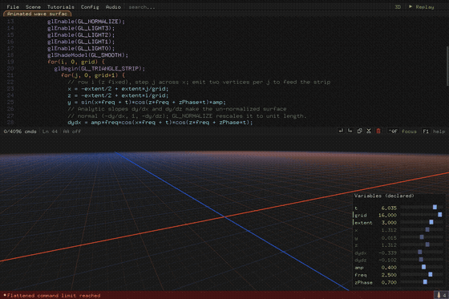

**Projection.** *Projection* (Ctrl+Shift+E) toggles between perspective and
orthographic projection while keeping the free, interactive camera. Unlike
*View mode* (which flattens and locks the camera to a top-down 2D view), it
keeps the current orbit angle, so you can navigate the scene
orthographically. Examples can declare `@cfg projection = PROJ_ORTHO`.

### Vertex entry guides

While a `glVertex3f(` line is still being typed, the scene shows where the
vertex *could* land given what's entered so far — one guide per remaining
degree of freedom, colored by the axis you typed (X red, Y green, Z blue):

- **One coordinate typed** → a translucent graph-paper sheet spanning the
  two open axes, with integer grid lines (the zero lines brighter), a
  dashed ghost rim visible through geometry, and an `x = 1.2` readout
  naming the pinned coordinate:

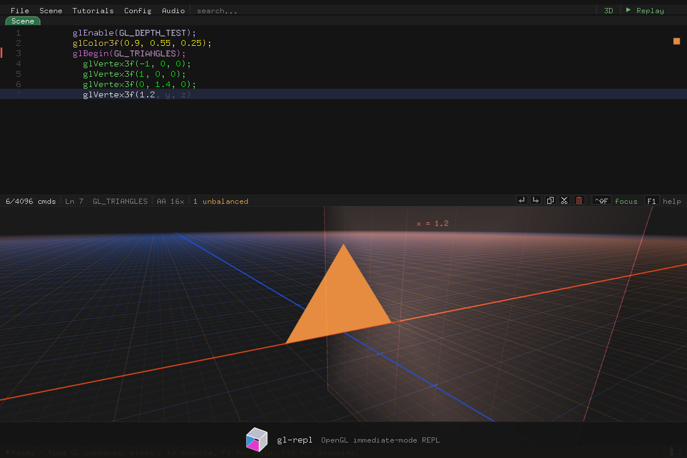

- **Two coordinates typed** → the locus collapses to a line along the one
  open axis, with integer tick dots (the 0 tick larger), end fades, a
  dashed ghost pass through occluders, and the still-free axis named at
  the positive end:

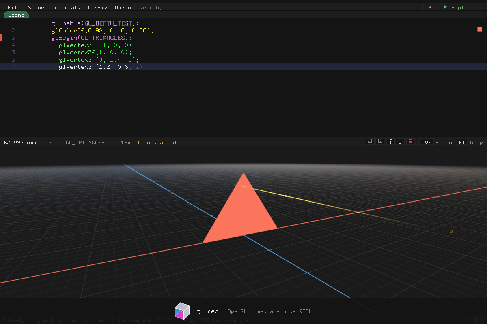

- **All three typed** → a pulsing point marker at the exact position (also
  shown when the cursor sits on a committed vertex line).

`glVertex2f` pins `z = 0` implicitly, so its first coordinate already
narrows the guide to a line. Guides follow the cursor's transform context —
inside a `glPushMatrix`/`glTranslatef` frame the sheet and line render in
that frame, matching where the vertex will actually land.

### Cursor guides & vertex overlays

Once lines are committed, the cursor keeps pointing into the scene. A
crosshair guide marks the vertex your cursor line refers to, with its
position label — move the cursor through a `glBegin` block and the guide
follows:


The overlay toggles annotate geometry scene-wide:


- **Vertex labels** (F7): Off / Index / Index+Pos / Index+World /
  Index+World Fine — numbers each vertex of the primitive at the cursor,
  optionally with its coordinates.
- **Label & highlight scope** (F8): First instance / All instances / At vertex /
  Visible only / Single polygon — controls how broadly cursor-bound overlays
  are shown around repeated function/loop instances.
- **Normal vectors** (Ctrl+Shift+N): draws each vertex's normal as an arrow.
- **Vertex outlines** (Ctrl+Shift+O) and **Vertex points** (Ctrl+Shift+P):
  outline polygons and mark vertices *(both on by default)*.
- **Polygon highlight** (Ctrl+P): highlights the polygon under the cursor line.
  Cycles Off / On / **Clipped & culled**. Both draw the highlight; they differ
  over your `glClipPlane` and `glEnable(GL_CULL_FACE)` calls. On draws the
  cursor's shape **as authored** — the whole sphere a plane cuts into a dome,
  both sides of a culled shell — so you can see the geometry you wrote. Clipped
  & culled draws only what the frame draws, like every other overlay.

Vertex outlines and vertex points always report the geometry the frame
actually shows:

- **Clip planes** — an outline stops where the shape does, and no point is
  drawn on a clipped-away face.
- **Culling** — back-face outlines vanish under `glEnable(GL_CULL_FACE)`,
  following your own `glCullFace` / `glFrontFace` rule. Authored vertex points
  are the exception: GL never culls point primitives, and a vertex shared by a
  front and a back face still sits on a face you can see, so the dots stay.
  Points on `glutSolid*` meshes do cull, since those draw as polygons.
- **Color mask** — geometry drawn under a `glColorMask` with no live color
  channel gets no outline and no dots: a depth-only seed pass puts nothing on
  screen to outline.

The cursor highlight is the deliberate exception to all of it. It draws through
a color mask (finding the line you're editing matters even when its geometry is
an invisible depth seed), and under Polygon highlight = On it ignores clipping
and culling too — so you can get a cut, culled outline with a whole-shape
highlight over it.
- **Auto-normals**: maintains generated `glNormal3f` lines for your
  geometry so lighting works without hand-written normals.

Decluttered label scopes give active edit-guide text priority: vertex labels
move to a nearby row, or are omitted when the bounded layout has no clear row,
rather than covering partial-vertex, normal, clip-plane, translate, or rotate
labels. **At vertex** remains the explicit exact-position mode and bypasses
this decluttering.

**Single polygon** scope narrows labels and the polygon highlight down to
just the one primitive your cursor is building, instead of the whole
`glBegin`/`glEnd` block — handy for a multi-face batch like a cube drawn as
one `glBegin(GL_QUADS)` with several faces packed into it. The cursor's
position between vertex lines picks the primitive: any line up through a
primitive's last vertex belongs to it, and the next line starts the next
one.


Here the cursor sits on the second quad's `glVertex3f(1.6, -0.8, 0)` line;
only that quad outlines and labels (`v4`..`v7`) — the first quad is left
alone even though both share the same `glBegin`/`glEnd` pair.

### Transform guides

With **Transform guides** on (Ctrl+Shift+X), placing the cursor on a committed
`glTranslatef` / `glRotatef` / `glScalef` line draws an overlay arrow or arc
showing what that line does — color-coded by axis (X=red, Y=green, Z=blue
blends), with a pulse traveling along the path:

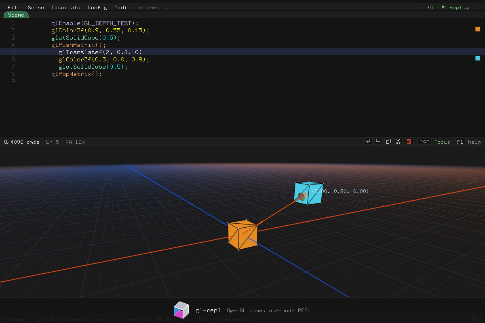

Guides only appear when the line parsed cleanly and your current input
matches the committed source — partial or mid-edit lines are skipped.

All guides share an "axes pulse" visual language: a dim solid base line or
arc with a bright dot traveling along it and a short fading trail behind.
The color is derived from the command's vector so the shape of the motion
reads at a glance:

- **Translate** — shaft color is `(|tx|, |ty|, |tz|)` normalized by its max
  component, mapped to RGB. A pure-axis translation reads as a pure axis
  color (`glTranslatef(2, 0, 0)` → red, `glTranslatef(0, 0, -3)` → blue);
  diagonals blend. A 4-fin pyramid arrowhead marks the tip.
- **Rotate** — shaft color is `(|ax|, |ay|, |az|)` normalized, so a Y-axis
  rotation reads green. The axis stub through the rotation pivot shares the
  color; the pulse dot sweeps along the arc so direction is unambiguous.
  (When the "before" point lies on the rotation axis the arc collapses to a
  point — hover a rotate line whose pivot is off-axis to see the sweep.)
- **Scale** — shaft color is `(|sx-1|, |sy-1|, |sz-1|)` normalized, so the
  color highlights which axes deviate from identity (`glScalef(2, 1, 1)`
  reads red). The arrow runs from the "before" point to the component-wise
  scaled result. If the "before" point is at the origin, a 3-axis gizmo is
  drawn instead: a gray unit reference segment and a pulsing arrow per axis
  in that axis's color.

#### What is the "before" point?

OpenGL applies transforms in reverse source order when computing a vertex:
`M_1 · M_2 · ... · M_n · v`. That means the cursor's command `C_k` operates
on the point that the *later* commands `C_{k+1..n}` have already placed.
The guide starts at that point. Accumulation of the post-cursor transforms
stops at the first draw call (`glBegin`, the `glutSolid*` shapes, a tess
polygon) — transforms after an intervening draw don't factor in.

#### Guide mode

The Config menu has an **Xform guide mode** toggle with two options:

- **World** — the guide is rendered in world axes at the world origin: the
  strict OpenGL reverse-order reading of your line, independent of
  surrounding transforms. Cursor on the last line of

  ```
  glTranslatef(0, 0, 2);
  glRotatef(45, 0, 1, 0);
  glTranslatef(0, 0, -2);   // cursor here
  ```

  shows an arrow from `(0, 0, 0)` to `(0, 0, -2)` along world Z.

- **Frame** *(default)* — the guide anchors at the scene-world position the
  full pre-cursor modelview has carried the origin to, so it lines up
  visually with geometry drawn by earlier `func0()` / `glBegin` blocks.
  Only the anchor comes from the pre-cursor matrix — the guide itself still
  draws with world-axis orientation. Cursor on the second translate in

  ```
  glTranslatef(2, 0, 0);
  func0();
  glTranslatef(-4, 0, 0);   // cursor here
  func0();
  ```

  anchors the guide at `x = 2`, so the arrow runs `(2, 0, 0)` →
  `(-2, 0, 0)`, matching the rendered triangles. World mode would draw
  `(0, 0, 0)` → `(-4, 0, 0)`.

The *Transform stress* example (F12 to cycle to it) is built to exercise
all three transform guides (translate, rotate, scale) at once.

### The clip-plane guide

Park the cursor on a committed `glClipPlane` line and the plane draws
itself: a translucent gridded disc lying in the plane, a dashed ghost rim
that reads through occluding geometry, and an arrow pointing into the
*kept* half-space with a `P0 =(a, b, c, d)` readout. If the program never
enables that plane's cap, the guide dims and the readout appends `(off)`.


Like the vertex guides, the disc renders in the coordinate frame active at
the call, so it sits exactly where the plane cuts.

### Winding & face diagnosis

**Winding** (Ctrl+Shift+B) re-renders the scene with front-facing polygons
in green and back-facing ones in red (as decided by the active
`glFrontFace`), so flipped or inside-out faces stand out immediately:


Both triangles here list three vertices; only the order differs. When
culling or lighting misbehaves, this view usually names the culprit in one
glance.

### Wireframe & hidden-line

**Ctrl+G** cycles Off / Wireframe / Hidden-line.


Wireframe draws polygon edges over the scene. Hidden-line goes further: it
draws all edges first in a muted color, seeds the depth buffer with filled
polygons, then redraws visible edges bright — so the silhouette reads
clearly while occluded structure stays faint. Tip: vertex outlines/points
are on by default and draw over the wires; turn them off for a clean
wireframe look.

### Depth view

**Ctrl+N** cycles the Depth view: **Off / Linear / Scene / Split** — a
grayscale rendering of the depth buffer, for seeing what depth testing
actually sees. Near surfaces are bright, far ones dark, and empty
background is black:


- **Linear** spreads the gray ramp across the whole near/far range of the
  projection. Faithful, but since most scenes occupy a small slice of that
  range, everything tends to read bright and flat — use it when you care
  about absolute depth (e.g. how close geometry sits to the near plane).
- **Scene** stretches the ramp over *your geometry's* actual depth extent
  instead, so the nearest surface is white and the farthest keeps a dim
  floor above the background — full contrast for spotting depth ordering
  and z-fighting candidates. The range follows the scene smoothly as it
  animates.
- **Split** keeps the normal render and overlays the scene-normalized
  depth image on the right half, pixel-aligned — the same column of pixels
  in both halves is the same fragment, so you can read color and depth
  side by side.

The depth snapshot is taken right after your geometry draws, before the
grid, backdrop, and axes render — so the helpers never appear in the depth
image (notice the grid on Split's normal half only). It works during
replay, pairs with wireframe/hidden-line (they seed real depths), and the
depth image is taken from the final accumulation pass, so AA and motion
blur keep working in Split's normal half. On the web build the row is
inert — WebGL cannot read the depth buffer back.

### The Config menu

Everything above — and the stage dressing below — has a home menu. Open the
**Config** dropdown (or press **Ctrl+Shift+K**). Items are grouped into
sections — hovering a section opens a flyout of its items, and the trailing
**All** row shows the entire table at once (the mouse wheel scrolls flyouts
taller than the window):

- **RENDERING** — MSAA, Line smooth, Accum effect, Accum passes, Point attenuation,
  Post FX Scope, Post FX Effect
- **TIME & REPLAY** — Auto time, Replay, Replay mode, Replay expand
- **SCENE** — Grid, Grid major, Grid extent, Grid brightness, Axes, Backdrop, Light theme,
  Light indicators
- **CAMERA** — View mode, Projection, Camera rotate, Focus origin, Reset camera
- **GEOMETRY** — Wireframe, Winding, Auto-normals
- **OVERLAYS** — Label & highlight scope, Vertex labels, Vertex points, Vertex outlines,
  Vertex outline style, Normal vectors, Polygon highlight, Transform guides
- **INTERFACE** — Variable panel, Compute profile, Memory profile, Code panel,
  Wrap at commas, Syntax highlight, Paren match, Paren scope

**Left-click** a flyout item to cycle it forward, **right-click** to cycle
backward. Multi-state items show their current state name.

Function keys drive the most common cycles directly (**Shift+F*n*** steps
backward):

| Key | Cycles |
|---|---|
| F2 | Grid theme |
| F3 | Grid extent |
| F4 | Grid brightness |
| F5 | Backdrop |
| F6 | Axes theme |
| F7 | Vertex labels |
| F8 | Label & highlight scope |
| F9 | Light theme |
| F10 | Post FX Scope |

### Grid & axes

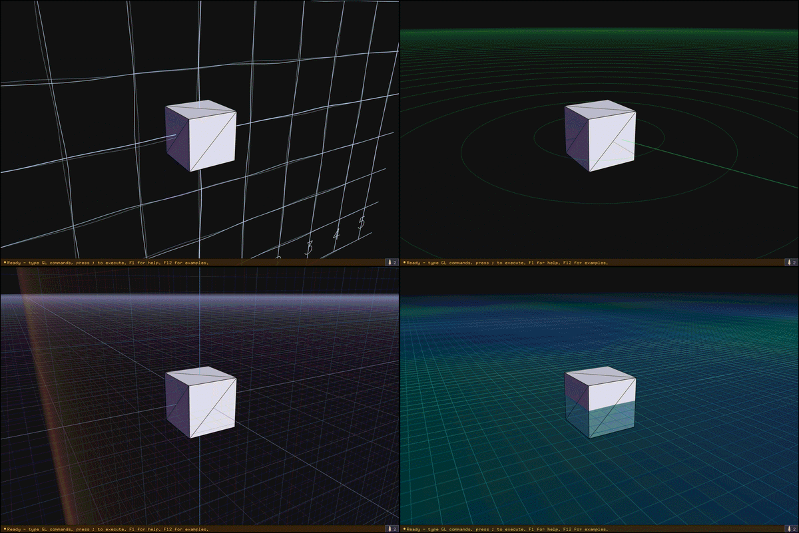

Twelve directly-selectable grid themes (**F2**): Off, Classic, Tron, Ember,
Ocean, XZ Ruler *(default)*, Adaptive Planes, Radar, Tilled Field, Sketchbook,
Neon Graph, Graph Planes. Some backdrops enable hidden companion grids; see
[Advanced Usage](ADVANCED_USAGE.md#cfg-backdropgrid-pairing).
**Grid major** (Ctrl+Shift+G) cycles the major-tick spacing (1/2/5/10),
**Grid extent** (F3) the grid's reach (Close / Mid / Far), and **Grid
brightness** (F4) the line weight (Dim / Normal / Bright / Bold). Theme
changes cross-fade, so a newly chosen grid takes a few seconds to fully appear.

Seven axes themes (**F6**): Off *(default)*, Classic, Pulse, Neon, Compass,
Gizmo, Ruler.

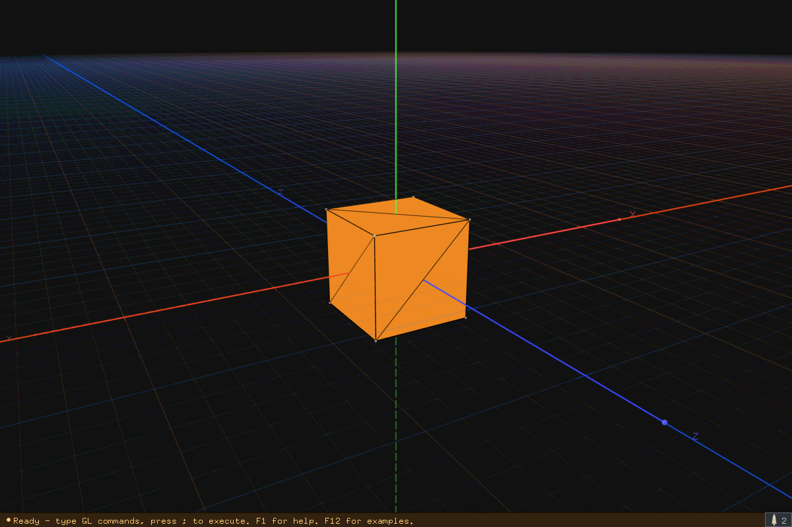

### Backdrops


**F5** cycles the scene backdrop: Off *(default)*, Cityscape, Stars,
City+Stars, Sunset, Aurora, Nebula, Polar Day, Polar Day+Snow.

Some backdrops enable a hidden companion grid. Nebula selects Star Chart;
see [Advanced Usage](ADVANCED_USAGE.md#cfg-backdropgrid-pairing) for the
`@cfg` details.

### Lighting


**Light themes** (**F9**) are preset light rigs: Default (three colored
keys), Headlight (light 0 rides the camera), Solar (light 0 at the world
origin — for orbit/planet scenes), Studio (warm key / cool rim / warm fill),
Neon (saturated magenta/cyan/lime triad).

> [!NOTE]
> A theme only positions and colors
> the four light slots — your program still chooses which ones are on via
> `glEnable(GL_LIGHT0..3)`.

**Light indicators** (Ctrl+Shift+L) draw a marker at each light's position
(labelled `L0..L3`, with *off* noted for disabled lights), so you can see
where the rig sits.

### Rendering quality

- **MSAA** (Ctrl+U) — hardware multisampling on/off.
- **Line smooth** — GL line antialiasing.
- **Accum effect** (Ctrl+Shift+U) + **Accum passes** (Ctrl+= / Ctrl+−) — the
  accumulation buffer drives antialiasing and motion blur:
  - **AA** *(default, 1 pass)* — jitters the camera frustum per pass.
  - **Blur** — re-renders the scene per pass across the frame's
    animation-time window, so spinning geometry smears realistically —
    even while the camera moves (the camera itself stays crisp). Scenes
    that don't use `t` fall back to AA jitter.
  - **Blur Cam** — blurs camera motion only; falls back to AA when still.
  - Passes: 1/2/4/8/12/16. The status bar shows the active mode
    (`AA 1x`, `Blur 16x`). Blur is expensive — every pass is a full scene
    render. `--noaccum` disables the accumulation buffer entirely.

  

- **Point attenuation** — distance-attenuated point sprites
  (`glPointParameterfv`); used by the glow/particle examples. On hardware
  without the entry point the REPL falls back to a distance-based
  `glPointSize` approximation.

  

- **Post FX Scope** (F10 forward / Shift+F10 backward) — where the selected
  effect applies: Off / 3D View / Frame.
- **Post FX Effect** — the selected operation: Chromatic aberration, Vignette,
  Scanlines, or Film grain.

---

## Replay


Replay executes your program one command at a time so you can watch the
scene assemble — geometry appears incrementally, older geometry fades in a
ghosted pass, and the code panel highlights each line as it runs, with
loop-variable values substituted into the displayed text.

| Key | Action |
|---|---|
| **Ctrl+R** (or the Replay button) | Start / stop replay |
| **Space** | Pause / resume |
| **+** / **−** | Faster / slower |
| **Left** / **Right** | Step backward / forward (while paused) |
| **Ctrl+K** | Jump the replay to the cursor line (first geometry at/after it) |
| **m** / **M** | Toggle replay mode: Polygon / Vertex granularity |
| **e** / **E** | Toggle Replay expand while playback is live |
| **n** / **N** | Cycle replay normals: off / vector / vector + direction |
| **v** / **V** | Toggle the replay focused-vertex label |
| **Esc** | Stop replay |

The HUD at the bottom of the viewport shows play state, position, and speed.
When a replay has finished, **Space** restarts it from the beginning.
Two related config items: **Replay mode** (Polygon steps a primitive at a
time, Vertex steps a vertex at a time) and **Replay expand** (whether loops
expand iteration-by-iteration).

---

## Scenes & Workspaces

gl-repl keeps up to 8 scenes in memory, shown as tabs below the menu bar.

- **Examples first** — a fresh launch opens on the default example. A user
  scene is created when you choose File -> New Scene, load a scene file or
  workspace, or edit an example.
- **Auto-promotion** — editing a built-in example forks it into a fresh
  scene slot named after the example. Subsequent edits accumulate there.
- **Rename** — File → Rename Scene opens an inline prompt in the status bar
  (Enter commits, Esc cancels). Names become filenames on export, so `/`,
  `\` and `:` are filtered.
- **Switching** — click a scene tab, or cycle with F12 / Shift+F12.

### Saving and loading

| Menu | Action |
|---|---|
| File → New Scene | Start a fresh scene |
| File → Save Scene (Ctrl+S) | Export the active scene as standalone C |
| File → Load Scene | Load a `.c` file into a new scene slot |
| File → Load Scene from Clipboard (macOS) | Load clipboard text, or the first Markdown fenced code block, into a new scene slot |
| File → Save Workspace | Write every open scene as `<name>.c` in a directory |
| File → Load Workspace | Load every `*.c` in a directory as scenes |

A workspace is just a directory of exported scene files. Once one is bound
and more than 8 scenes are open, the least-recently-used slot is
automatically saved to the workspace directory before being replaced.
Single files and workspaces round-trip freely — scene names and the
workspace binding are carried in `@scene-name` / `@workspace-dir` header
comments.

---

## Exporting & Importing

### Standalone C export

**Ctrl+S** (File → Save Scene) writes a complete, compilable GLUT/OpenGL C
program — header comments carry the REPL state (variables, config, camera),
your functions become C functions, and your commands become the `display()`
body. The generated file is **C89-compliant**, so it builds anywhere a GL/GLUT
toolchain exists, old machines included:

```bash
cc -std=c89 -Wall -o scene output.c -lglut -lGL -lGLU -lm     # Linux
cc -std=c89 -Wall -o scene output.c -framework OpenGL -framework GLUT -lm  # macOS
```

Everything round-trips: `./gl-repl output.c` reloads the file with
variables, settings, camera, scene name, and `// @tune` tags intact.

`Ctrl+Q` quits and saves a recovery copy to a temp file.

### Editing exported code & reimporting

The exported file is meant to be worked on. You can extend it by hand in C
and load it back — on reload, the commands between the `// Snippet start` /
`// Snippet end` markers are imported, so edits inside that span come home to
the REPL. Two rules keep the round trip clean:

- **Stay inside the REPL language** for the snippet section — the supported
  commands and syntax in [The REPL Language](#the-repl-language). Lines the
  importer doesn't recognize are skipped with a warning. (Anything goes
  *outside* the snippet markers, but those edits live only in the C file.)
- **Stay within the command budget** — the source document holds 1024
  lines and its flattened program 8192 commands (the status bar shows
  flat usage, e.g. `1345/8192 cmds`). Loops count once as source but
  every unrolled iteration lands in the flat program, so a heavy
  particle loop reaches the flat cap long before line 1024.

  To see *where* the budget goes, watch the last left-aligned status-bar
  segment as you move the cursor: `fn cmds 2480` on or inside a function
  definition (its total expansion across every call site), `scope cmds 230`
  inside a `for`/`if` block (the block's per-frame cost), `call cmds 96` on
  a call line (that call's inclusive expansion), `line cmds 12` on a plain
  line that expands more than once. For an offline breakdown,
  `./gl-repl --example "bubble sort (scratch arrays)" --flat-histogram`
  prints per-function and per-line costs sorted by spend.

> **Advanced — extending the REPL itself.** If you want a GL call the REPL
> doesn't speak yet, the interpreter is built to be extended: see
> [*Adding A New Command*](ARCHITECTURE.md#adding-a-new-command) in
> `ARCHITECTURE.md` for the full recipe (command type, spec-table row,
> executor case, replay annotation, help text, save/load round-trip). To
> raise the flat command budget, bump `MAX_FLAT_COMMANDS` in
> [`config.h`](../config.h) — it is `#ifndef`-guarded, so
> `-DMAX_FLAT_COMMANDS=16384` on the compiler command line works without
> editing the file (`MAX_EDITOR_COMMANDS` is the separate source-line cap).
> Expect proportionally more per-frame work: the flattened program
> re-executes every frame.

### Mesh export (PLY)

**F11** (File → Export .ply) captures the current scene as an ASCII PLY mesh
named after the active scene — `glVertex` polygons, GLU-tessellated shapes,
and GLUT solids all export through one GL feedback pass. Authored per-vertex
normals are preserved; the rest are synthesized and smoothed. Line
primitives export as PLY edges; point primitives export as loose vertices
(a point cloud).

Headless / scripted capture:

```bash
./gl-repl --example "2d assignment sketch (vars only)" --export-ply out.ply    # capture frame 1, exit
./gl-repl --example "2d assignment sketch (vars only)" --export-ply out.ply --export-ply-srgb   # decode colors sRGB->linear
```

Use `--export-ply-srgb` when the viewer is color-managed and treats PLY
colors as linear (otherwise the mesh looks washed out).

---

## Tunable Variables (`// @tune`)

Use `// @tune` on a `float` declaration when a scene parameter should become
a keyboard-adjustable knob in the exported standalone C program.

```c
float amp = 1.5; // @tune
float freq = 2;  // @tune

glBegin(GL_TRIANGLES);
glVertex3f(amp, 0, 0);
glVertex3f(0, freq, 0);
glVertex3f(0, 0, amp);
glEnd();
```

The tag is a bare trailing comment token. It matches `// @tune`, not names
like `// @tuned=5`. If a declaration line contains multiple names, every name
on that line is tagged:

```c
float amp = 1, freq = 2; // @tune
```

Tagged variables are still normal REPL variables while you are authoring. In
the variable panel, tagged rows get an accent mark so you can see which
values will export as knobs:


### Exported controls

When you save/export C, each tagged variable becomes a keyboard knob in the
standalone program. The generated program also draws a small HUD listing each
knob, its current value, and its keys.

Knobs are assigned in declaration order:

| Knob | Raise | Lower |
|---|---:|---:|
| 1 | `q` | `a` |
| 2 | `w` | `s` |
| 3 | `e` | `d` |
| 4 | `r` | `f` |
| 5 | `t` | `g` |
| 6 | `y` | `h` |
| 7 | `u` | `j` |
| 8 | `i` | `k` |
| 9 | `o` | `l` |

Only the first 9 tagged variables get keyboard controls. If more are tagged,
the export keeps the first 9 and writes a note in the generated C that the
rest were capped.

### Step size

The exported knobs use the same step size as the in-app numeric stepper:

| Current value magnitude | Step |
|---:|---:|
| `< 10` | `0.05` |
| `10..99.999` | `0.5` |
| `100..999.999` | `5` |

The pattern continues by decade — values in the thousands step by `50`,
and so on (the step is `0.05` scaled by the value's power of ten).

The same modifier keys apply in the exported program:

| Modifier | Effect |
|---|---:|
| Shift | fine step, `x0.2` |
| Ctrl | coarse step, `x10` |
| Shift+Ctrl | fine then coarse, `x2` total |

There is no range clamp. A tunable can go negative or very large if you keep
pressing its keys.

### Values that stick

A tunable only persists if your display body does not overwrite it every
frame. This works:

```c
float radius = 2; // @tune

glutSolidSphere(radius, 32, 16);
```

This appears inert in the exported program because the assignment runs again
on every display call:

```c
float radius = 2; // @tune

radius = 2;
glutSolidSphere(radius, 32, 16);
```

Use tunables for parameter-style values that the scene reads, not values the
scene recomputes unconditionally each frame.

### Export and reload

`// @tune` survives export/import round trips. The exported C carries a
marker for each tagged declaration, and reloading that file reconstructs the
original declaration with `// @tune` so the variable-panel badge and future
exports keep working.

The generated keyboard controls live only in the standalone exported C.
Inside gl-repl, adjust values through the variable panel or inline numeric
steppers.

---

## Performance & Scope

The REPL is an interpreter. Every frame it re-evaluates expressions, and
while anything is animating it re-flattens the whole program — loops
unrolled, functions inlined, every argument expression parsed and evaluated
again. That is what makes the live experience possible (edit any line, drag
any slider, scrub time backwards), but it costs real CPU. Scenes built on
the [stateless patterns](#working-without-state) — especially the
replay-from-the-start kind — add their own recompute cost on top, since
each frame redoes all the work `t` implies.

The exported C program has none of that machinery — it is the same scene as
plain compiled GL calls, roughly **100× lighter on the CPU**. So the
workflow for pushing limits is:

1. Sketch and tune the scene in the REPL until it looks right.
2. Tag the parameters you still want to play with as `// @tune`.
3. Export, compile, and push the numbers (particle counts, tessellation,
   iteration depth) in the standalone program — via the exported tune knobs
   or by editing the C directly.

A scene that drops frames in the REPL at 500 particles will typically run
thousands in the export without effort.

That division of labor is by design: the REPL is a **launchpad, debugging
aid, and educational environment** — a place to see immediate-mode GL
respond line by line — not a platform to build a complete application on.
The export is the product; the REPL is where it is born.

> **Honest footnote on interpreter speed.** There is plenty of low-hanging
> fruit in the interpreter — identifier lookup is a series of string
> compares where a trie would do, and the per-frame flatten is a complete
> pass where a partial recompile of only the dirty range would suffice.
> These are deliberate omissions: optimizing further heads toward building
> a virtual machine, and the project's complexity has already grown well
> past its original intention. If the REPL feels slow, that's the signal to
> export.

---

## Profiling & Diagnostics

When a scene starts feeling heavy, the built-in profilers show where the
frame goes before you reach for the export.

### The compute profile (Ctrl+W)

**Ctrl+W** cycles the compute profile through Off / FPS / Sections /
Histogram. *FPS* shows only the frame-rate graph. *Sections* adds the full
collapsible per-section timing tree. *Histogram* adds the section-distribution
graph as the final, more expensive diagnostic surface.

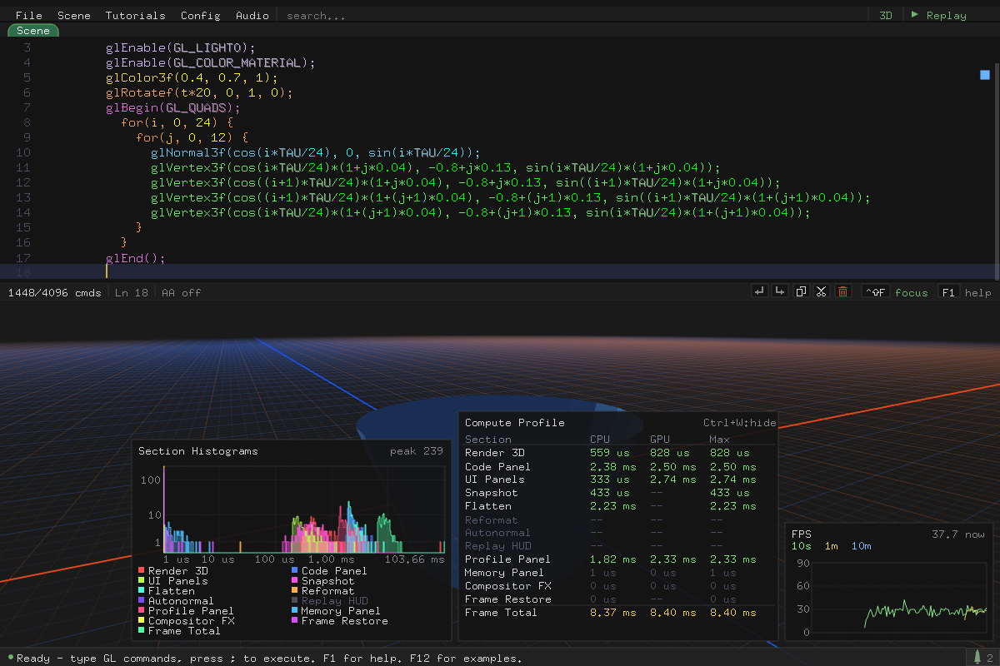

Three floating panels work together:

- **The section listing** (right) breaks the frame into named sections —
  *Render 3D*, *Code Panel*, *Flatten*, and so on, down to *Frame Total*.
  The **CPU** column is a running average of wall-clock time per frame; the
  **GPU** column comes from asynchronous GL timer queries (no stalls — the
  numbers arrive a few frames late), and reads `--` where the driver lacks
  timer queries or a section emits no GL. **Max** shows the worse of the
  two averages — the number to watch when deciding what to trim. Sections
  that did nothing this frame dim out.
- **The section histograms** (center) overlay every top-level section's
  timing distribution on one graph. Both axes are logarithmic: microsecond
  sections and a 100 ms stall fit on the same plot, so a rare spike shows
  up as a small bump far to the right instead of vanishing into an average.
  Each section keeps its listing color; the legend below maps them.
- **The FPS plot** (bottom-right) graphs frame rate over the last 10
  seconds, minute, and 10 minutes as three overlaid series, with the
  current rate in the corner.

Histogram mode is the tool for *hitches*: a scene that averages 60 fps but
stutters once a second shows a clean main hump plus a second bump at the
stall duration — and the bump's color names the section responsible. The
histograms accumulate from load (they reset when you switch examples), so
leave the panel up while you reproduce the hiccup.

GPU timing needs timer-query support (GL 3.3 / `ARB_timer_query`, or the
`EXT_timer_query` fallback); `GLR_NO_GPU_PROF=1` disables it explicitly, and
the GPU column then reads `--`.

### Memory, messages, and startup

- **Memory profile** (Ctrl+Shift+W) — a floating panel with the process RSS
  history, a session baseline, and the delta since baseline. Useful for
  confirming a long editing session isn't growing without bound.
- **Message history** — click the button at the right end of the bottom
  message line to review recent status messages (parse errors you dismissed,
  save confirmations, budget warnings).
- **Ctrl+Shift+D** — dump debug state to stdout.
- Startup prints an init trace (`[init +N.NNNs] <phase>`) to stderr — useful
  for locating slow startup phases; `--detailed-prof` adds finer phases.

---

## Music

gl-repl plays background `.mp3`s found at startup, in filename order, from
three places combined:

1. **`./assets`** next to where you run it — override with `--assets <dir>`
   or `GLR_ASSETS_DIR`.
2. **Bundled with the app** — the macOS `gl-repl.app` ships a sample track.
3. **Your music folder** — `~/Library/Application Support/gl-repl/Music` on
   macOS (XDG data dir on Linux), created on first run; drop `.mp3`s there.

| Key | Action |
|---|---|
| Ctrl+Shift+A | Play / pause |
| Ctrl+Left / Ctrl+Right | Previous / next track |

`--no-audio` skips audio entirely. The play/pause state persists across
runs.

---

## Command-Line Options

```
./gl-repl [file.c | workspace-dir]   load a saved scene or a directory of scenes

--example <name|idx>   start on a built-in example (case-insensitive name or 1-based index)
--examples-dir <dir>   load examples from <dir>/catalog.ini and <dir>/scenes/
--list-examples        print the built-in examples and exit
--time <secs>          initial animation time t (also GLR_TIME; --time wins)
--window <WxH>         initial window size (default 1200x800)
--export-ply <path>    capture frame 1 geometry to PLY, then exit
--export-ply-srgb      decode vertex colors sRGB -> linear during PLY export
--assets <dir>         scan this dir for *.mp3 (also GLR_ASSETS_DIR)
--no-audio             skip audio init entirely
--noaccum              disable the accumulation buffer (AA + motion blur)
--dump-code            print the loaded buffer to stdout
--flat-histogram       print per-function / per-line flat-command costs
                       (where the 8192 budget goes; works with --example)
--detailed-prof        verbose startup timing trace (also GLR_DETAILED_PROF=1)
-h, --help             usage
```

Useful environment variables: `GLR_TIME`, `GLR_ASSETS_DIR`,
`GLR_EDIT_LINE=<n>` (park the cursor on source line *n* after load — poses
cursor-bound overlays like transform guides for headless captures),
`GLR_TYPE_KEYS=<text>` (feed keystrokes through the keyboard dispatch after
load — poses mid-typing states like the vertex entry guides and the
autocomplete popup),
`GLR_OPEN_COLOR_PICKER=<n>` (open the color picker on source line *n* —
poses the picker, which otherwise needs a swatch click),
`GLR_ACCUM_PASSES=<n>` (accumulation AA sample count, 1/2/4/8/12/16 — lets
headless captures smooth 3D edges at full UI text size),
`GLR_TICK_PER_FRAME=1` (advance the complete fixed-dt simulation once per
rendered frame for deterministic offline recordings),
`GLR_VIEW_TOGGLE_AT=<secs,...>` (toggle 2D/3D mode during deterministic
captures; implicitly enables `GLR_TICK_PER_FRAME`),
`GLR_NO_POINT_PARAMETER=1` (force the no-`glPointParameterfv` fallback),
`GLR_NO_GPU_PROF=1` (disable GPU timer-query profiling),
`GLR_AUDIO_HITCH_MS` (audio worker stall-warning threshold).

For scripted screenshots and GIF/MP4 recordings, the deterministic
frame-record mode captures exactly N rendered frames and exits — every
screenshot and GIF in this guide was generated that way
(`scripts/docs-assets.sh`). For fully *headless* rendering with no window at
all, build with `FREEGLUT_OSMESA=1`; both are covered in
[*Headless rendering (OSMesa)* in `ADVANCED_USAGE.md`](ADVANCED_USAGE.md#headless-rendering-osmesa).

---

<a id="keyboard-mouse"></a>
## Keyboard & Mouse Reference

Press **F1** in-app for the always-current version of this list (the Keys
tab), plus the full command reference (the Commands tab).
For shortcut-maintenance details, reserved control-key aliases, and the
`scripts/keymap.sh` audit helper, see
[Advanced Usage -> Keyboard map tooling](ADVANCED_USAGE.md#keyboard-map-tooling).

### Editing

| Key | Action |
|---|---|
| `;` | Commit current line |
| Enter | Insert new line |
| Backspace | Delete character or selected lines |
| Tab | Autocomplete (Tab/Enter accepts) |
| Up / Down | Navigate lines |
| Left / Right | Move cursor within line |
| Home / Ctrl+A | Start of line |
| End / Ctrl+E | End of line |
| Shift+Arrows / Home / End | Extend selection |
| Ctrl+C / Ctrl+X / Ctrl+V | Copy / cut / paste |
| Ctrl+Z / Ctrl+Y | Undo / redo |
| Ctrl+D | Delete line or selection |
| Ctrl+L | Clear all commands |
| Ctrl+F | Search (seeded from highlighted text) |
| Tab (find bar) | Cycle find field / replace field / whole-word chip |
| Enter (replace field) | Replace all matches |
| Ctrl+\ | Reformat buffer |
| Ctrl+/ | Toggle comment |
| Ctrl+Shift+S | Split multi-variable declaration |
| Ctrl+Shift+F | Toggle code focus |
| Ctrl+B | Cycle code panel layout |
| Ctrl+Shift+Y | Cycle syntax highlight |
| Right-click GL command | Show a short description of that command |
| Right-click empty line | Toggle the [OpenGL state inspector](#inspecting-opengl-state) at that point |
| Esc | Clear input / close overlay |

### Scene & rendering

| Key | Action |
|---|---|
| Ctrl+T | Play/pause time |
| Ctrl+Shift+T | Reset time to 0 |
| Ctrl+Shift+B | Winding |
| Ctrl+R | Start/stop replay (Ctrl+K jump to cursor) |
| Ctrl+G | Wireframe |
| Ctrl+N | Depth view (Off / Linear / Scene / Split) |
| Ctrl+U | MSAA |
| Ctrl+Shift+U | Accum effect |
| Ctrl+Shift+G | Grid major spacing |
| Ctrl+= / Ctrl+− | Accum passes up/down |
| Ctrl+Shift+X | Transform guides |
| Ctrl+Shift+N | Normal vectors |
| Ctrl+Shift+O | Vertex outlines |
| Ctrl+Shift+L | Light indicators |
| Ctrl+Shift+P | Vertex points |
| Ctrl+P | Polygon highlight (Off / On / Clipped & culled) |
| Ctrl+Shift+K | Open Config menu |
| Ctrl+W / Ctrl+Shift+W | CPU / memory profile panel |
| F2–F10 | Config cycles (Shift steps backward) — see [The Config menu](#the-config-menu) |
| F11 | Export .ply |
| F12 / Shift+F12 | Next / previous example or scene |
| F1 | Help overlay |
| ` | Variable panel |

### Camera

| Key | Action |
|---|---|
| Left-drag | Orbit |
| Right-drag | Pan XZ (Shift+Right-drag: pan Y) |
| Scroll | Zoom (with momentum) |
| Ctrl+O | Focus origin |
| Ctrl+Shift+C | Reset camera |
| Ctrl+Shift+R | Auto-rotate |
| Ctrl+Shift+V | 2D / 3D view mode |
| Ctrl+Shift+E | Projection (Perspective / Ortho) |

### Session & audio

| Key | Action |
|---|---|
| Ctrl+S | Save scene |
| Ctrl+Q | Quit (saves recovery file) |
| Ctrl+Shift+D | Debug state dump |
| Ctrl+Shift+A | Play / pause |
| Ctrl+Left / Ctrl+Right | Previous / next track |

> **macOS note:** Cmd+letter works the same as Ctrl+letter. F11 may be
> claimed by the system's "Show Desktop" — use File → Export .ply instead.
