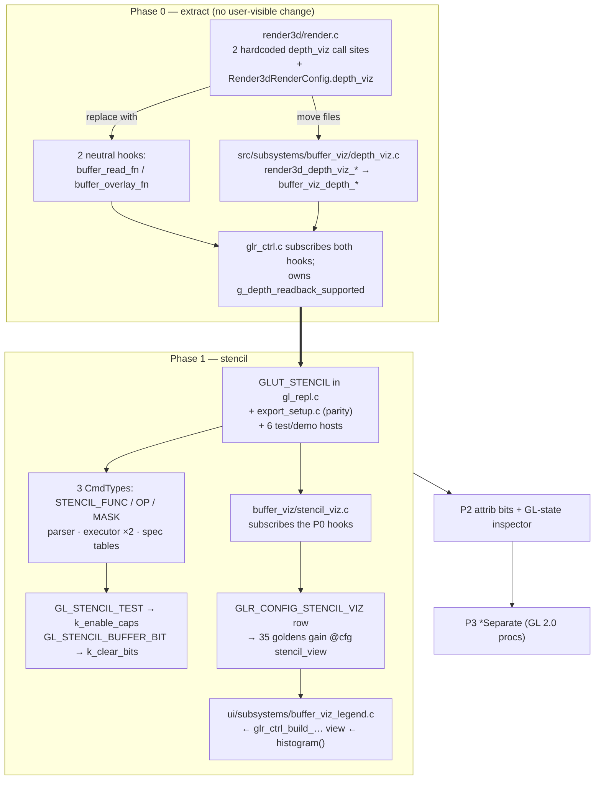

# Stencil buffer support + `buffer_viz` subsystem

## Context

The REPL exposes depth, blend, cull, fog and clip-plane state but no stencil at
all. The omission is currently *documented as intentional* in three places that
this change invalidates:

- `src/repl/command_spec.c:123-128` — the `k_clear_bits` comment: *"no REPL
  command writes stencil"*.
- `tests/test_repl_core_parse.c:1570` — `glClear(GL_STENCIL_BUFFER_BIT)` pinned
  in the **rejected** list.
- `docs/USER_GUIDE.md:549-552` — *"The stencil and accumulation bits are not
  offered."*

Two motivations. Stencil unlocks a class of classic immediate-mode techniques
(masking, planar reflections, outline passes, CSG-ish carving). And stencil is
*invisible* — unlike color and depth you cannot tell from the rendered frame
whether your mask did what you meant, so the visualization is what makes the
feature teachable rather than a nice-to-have.

Two structural facts shape the work.

**No GL context in the tree requests a stencil buffer.** `gl_repl.c:264` is
`GLUT_DOUBLE | GLUT_RGBA | GLUT_DEPTH | GLUT_MULTISAMPLE`. Every stencil command
is a silent no-op until that changes — and the *exported* C prologue
(`src/repl/export_setup.c:393`, `:416`, both `GLUT_DOUBLE|GLUT_RGB|GLUT_DEPTH|
GLUT_MULTISAMPLE`) has the identical gap, so exported scenes would render
differently from the REPL, breaking the project's parity invariant.

**Buffer inspection doesn't belong to render3d.** The shipped depth-viz lives in
`src/render3d/` and forced a `depth_viz` int into `Render3dRenderConfig`
(`render_types.h:275`) plus two hardcoded call sites inside the frame pipeline
(`render.c:836-841`, `:955-967`). Rather than adding a second copy of that
coupling, this plan extracts both into a `src/subsystems/buffer_viz/` peer.
`scripts/check/check-render3d-no-upper-layers.sh` explicitly forbids
`src/render3d/` from including `subsystems/`, so the extraction *must* go through
neutral hooks — render3d offers "here is a point where you may read the buffers",
with no idea what for.

## Confirmed decisions

| Decision | Choice |
|---|---|
| Placement | **`src/subsystems/buffer_viz/`** — depth_viz moves there, stencil_viz joins it; render3d owns no buffer inspection |
| Color mapping | Config row cycles **Off / Palette / Ramp / Split**. Palette = deterministic value→color + legend; Ramp = min/max reusing depth-viz's EMA range |
| Stencil clear | **Strict + warn.** No host-side stencil clear; warn when the viz is on and the program never clears stencil |
| Legend | **Corner panel with per-value pixel counts**, drawn by the UI layer from a controller-built view |
| Phasing | **P0** extract buffer_viz · **P1** stencil commands + viz · **P2** attrib bits + state inspector · **P3** `*Separate` |
| Web | Commands work everywhere; **viz native/OSMesa only** (WebGL cannot read `GL_STENCIL_INDEX`) |

Phase 0 is a **behavior-preserving refactor of a shipped feature** and lands and
is verified on its own before any stencil work starts. If it proves messier than
expected, Phase 1 can still fall back to mirroring depth_viz inside render3d —
but then the asymmetry is permanent, which is what this ordering avoids.

## Shape of the change



Frame-pipeline placement, unchanged by the refactor:

```
render_3d_scene_pass:  setup → fill → [post_fill_fn] → ((buffer_read_fn)) → helpers → overlays
render3d_draw_scene:   … accum resolve … → [post_resolve_overlays_fn] → ((buffer_overlay_fn)) → post filter
glr_ctrl_display_frame:  render3d_draw_scene() → … → PROF_UI_PANELS block → ui_buffer_viz_legend_render()
```

---

# Phase 0 — extract `src/subsystems/buffer_viz/`

Pure refactor. **No user-visible change**: same modes, same config key, same
`@cfg` slug (`depth_view`), same goldens, same pixels.

## 0.1 Two neutral hooks in render3d

`Render3dRenderConfig` already carries this idiom — `post_fill_fn`
(`render_types.h:145-146`, fired `render.c:777`) and `post_resolve_overlays_fn`
(`:165-166`, fired `render.c:945`). `post_fill_fn` is already taken by the replay
fades, so add two dedicated hooks rather than fighting over them:

```c
/* Fires at the fill/helpers boundary: user geometry and the replay-fade
 * post_fill hook have written their depths, the backdrop/grid have not.
 * is_final_pass is 0 on every accumulation pass but the last. */
void (*buffer_read_fn)(void *user_data, int is_final_pass,
                       int sx, int sy, int sw, int sh);
void  *buffer_read_user_data;

/* Fires after post_resolve_overlays_fn, before the scene post-filter, so
 * Post FX applies uniformly across a Split seam. `proj` is the canonical
 * jitter-free active projection for this frame. */
void (*buffer_overlay_fn)(void *user_data,
                          const Render3dProjectionDesc *proj,
                          int sx, int sy, int sw, int sh);
void  *buffer_overlay_user_data;
```

The `proj` parameter is **required** and is a correction to the naive extraction:
`render3d_depth_viz_render()` takes a `const Render3dProjectionDesc *` today
(passed `&state->active_projection` at `render.c:961`) to linearize eye depth.
`Render3dProjectionDesc` is already a public render3d type (`render.h:60-68`) with
a public getter (`render3d_get_active_projection`, `render.h:143`, already called
by the controller at `glr_ctrl.c:2483`), so passing it through keeps the hook
neutral frame metadata rather than viz vocabulary.

These **replace** the hardcoded blocks at `render.c:836-841` and `:955-967`. The
`is_final_pass` flag is free — `render_3d_scene_pass()` already receives exactly
that as its `capture_depth` parameter (`render.c:824`, set on the last pass only
at `:918`, `:924`); rename it to `is_final_pass` and forward it. The `dv_on` gate
(`render.c:853`) disappears: the hooks fire unconditionally and the subscriber
no-ops when its modes are all Off.

Delete `Render3dRenderConfig.depth_viz` (`render_types.h:269-275`), its validation
in `render3d_draw_scene` (`render.c:138-139`), and the `#include "depth_viz.h"`
(`render.c:8`). Move the `render3d_depth_viz_reset()` call out of
`render3d_init_gl()` (`render.c:72`) — the controller now owns that from
`glr_ctrl_init_gl`.

Update the stale comment at `src/render3d/postprocess_filter.h:70-72`, which
names depth-viz as a client of `render3d_post_2d_begin/_end`; the bracket stays,
the client is now a subsystem.

## 0.2 Move the module

`src/render3d/depth_viz.{c,h}` → `src/subsystems/buffer_viz/depth_viz.{c,h}`.
`SUBSYSTEMS_SRCS = $(wildcard src/subsystems/*/*.c)` (`Makefile:498`) picks the
directory up automatically; `RENDER3D_SRCS`'s wildcard drops it just as
automatically.

**Rename the prefix** `render3d_depth_viz_*` → `buffer_viz_depth_*`, and
`Render3dDepthVizMode` / `Render3dDepthVizRange` → `BufferVizDepthMode` /
`BufferVizRange` (the range type is deliberately un-prefixed by buffer kind — it
is shared with stencil RAMP in Phase 1). `check-module-prefixes.sh` is a denylist
of specifically eliminated names and will not force this, but the convention will
(`replay_*`, `variable_panel_*`, `color_picker_*` are the sibling precedents).
`buffer_viz_` is a **new top-level prefix**, which CLAUDE.md says must be
documented rather than merely introduced → add the boundary note to
`docs/MODULES.md` (subsystem table around `:548-558`, and the layer prose at
`:178-182`).

The subsystem keeps including render3d headers for `Render3dProjectionDesc`
(`render.h`) and the `render3d_post_2d_begin/_end` bracket
(`postprocess_filter.h:77-79`). This direction is established, not novel:
`src/subsystems/edit_overlays/edit_overlays.c` already includes `render3d/*`
headers and calls `glReadPixels`. Dependencies still point downward (layer 5 →
3.5); the guard only forbids the inverse.

## 0.3 Controller wiring

`src/app/glr_ctrl.c` subscribes both hooks when building the frame config, and
keeps ownership of the policy it already owns:

- the capability mask at `glr_ctrl.c:1352-1353` now sets the subsystem's mode
  directly instead of zeroing a render-config field;
- `g_depth_readback_supported`, its `..._for_test` seam, its reason string
  (`:1184-1199`) and its probe (`:3200-3213`) stay exactly where they are — that
  is controller policy, not viz code.

## 0.4 Profiling — move `prof_begin` into the subsystem

`PROF_RENDER3D_DEPTH_VIZ` (`prof_sections.h:51-52`) → `PROF_BUFFER_VIZ_DEPTH`,
label updated in `src/app/glr_prof.c:52`. **Keep the enum constant inside the
render3d index range** and keep `PROF_RENDER3D_LAST` pointing at the last section
in it: the aggregate at `glr_ctrl.c:2188` / `:2262` is an *index* sweep
(`PROF_RENDER3D_SETUP … PROF_RENDER3D_LAST`), so moving the constant out of the
range would change what the render3d row reports in the profile panel — a
user-visible change this refactor must not make.

Because the sweep is index-based, the `prof_begin` / `prof_accum_end` calls
themselves move **into the buffer_viz TU** rather than bracketing the hook call
in render.c. That keeps the hook genuinely neutral (render3d never names a
buffer_viz section), still satisfies `check-prof-sections-instrumented` (which
scans `gl_repl.c` + all of `src/`), and stops charging time to the section on
frames where nothing is subscribed.

While here: `src/app/glr_prof.c:26` claims `PROF_RENDER3D_LAST` aliases
`_POST_PROCESS` — already stale, fix it.

## 0.5 Build + tests

- `test_depth_viz_OBJS` (`Makefile:962-971`) — swap `src/render3d/depth_viz.o` for
  `src/subsystems/buffer_viz/depth_viz.o`. It also links `postprocess_filter.o`
  and `postprocess_surface.o`; both stay. Registration in `TEST_BINS`
  (`Makefile:812`) and the `CORE_TEST_BINS` filter-out (`:854`) is unchanged.
- `tests/test_depth_viz.c` — mechanical rename only (`#include
  "subsystems/buffer_viz/depth_viz.h"`, `buffer_viz_depth_map`,
  `BUFFER_VIZ_DEPTH_*`). Its synthetic-buffer assertions are the proof the
  refactor preserved behavior. **Do not modify the assertions.**
- `tests/test_render3d_render.c:548-577` (`test_depth_viz_render_modes`) — this
  drives `cfg.depth_viz` and asserts `validate_render_config` rejects
  out-of-range values. That field is gone, so the test must be rewritten as a
  hook-subscription structural test (install a `buffer_read_fn` /
  `buffer_overlay_fn` that counts calls; assert the read fires once per frame on
  the final pass in both the single-pass and 16-pass accum branches). The
  mode-range rejection assertions **migrate to `test_depth_viz.c`** against
  `buffer_viz_depth_render`, since range validation is now the subsystem's job.
- `render3d_demo` (`tools/render3d_demo/`) simply stops linking depth_viz.

## 0.6 Phase 0 exit criteria

`make test`, `make test_depth_viz`, `make check-state-ownership`, and a
**before/after OSMesa capture of the same scene in all four depth modes that is
byte-identical**. If the captures differ, the refactor is wrong.

---

# Phase 1 — stencil commands, clear bit, visualization

## 1.1 Give the context a stencil buffer

Add `GLUT_STENCIL` to `glutInitDisplayMode`:

- `gl_repl.c:264` — the real one.
- `src/repl/export_setup.c:393` and `:416` — **required for export parity.**
  (Note both spell `GLUT_RGB`, not `GLUT_RGBA`; leave that alone, just add the
  bit.)
- Demo/test hosts so they match: `tools/render3d_demo/render3d_demo.c:793`,
  `tests/test_render3d_render.c:1414`, `tests/test_ui_gl_state.c:252`,
  `tests/test_attrib_bits_gl.c:423`, `tests/test_tour_overlay_feedback.c:340`,
  `bench/bench_repl.c:1883`.

OSMesa needs nothing — the vendored fork already maps `GLUT_STENCIL` → 8 stencil
bits (`third_party/freeglut/src/osmesa/fg_window_osmesa.c:38-49`).

## 1.2 The three commands

Follow skill `gl-repl-new-command`. New `CmdType`s go **next to their relatives**
(`src/repl/command.h:33-36` — append-stable, never reorder): `CMD_STENCIL_FUNC`,
`CMD_STENCIL_OP`, `CMD_STENCIL_MASK` beside `CMD_DEPTH_FUNC` (`command.h:54`).

**`glStencilOp(sfail, dpfail, dppass)`** — three enum slots, so it rides the
generalized table-driven path with a new `k_stencil_ops` table (`GL_KEEP`,
`GL_ZERO`, `GL_REPLACE`, `GL_INCR`, `GL_DECR`, `GL_INVERT`; `GL_INCR_WRAP` /
`GL_DECR_WRAP` only if a runtime probe allows). One wrinkle:
`format_enum_command_text` (`src/repl/parser.c:537-568`) threads `def->fmt` only
for 1, 2 and 4 slots — a 3-slot command falls to the generic `", "` join, which
produces identical text but leaves `fmt` dead. **Add a `num_slots == 3` branch.**

**`glStencilFunc(func, ref, mask)`** — mixed enum + two integers. No slot kind
covers that shape, and `ENUM_OR_EXPR` is explicitly reserved (one slot in the
whole tree, `command_spec.h:63-66`). Use a **custom parser branch** modelled on
`parse_fogf` (`parser.c:1213-1270`), registered with a **negative `num_args`** in
`k_enum_command_specs[]` — the sign convention (`command_spec.h:200-205`) means
"custom branch, `abs()` is the autocomplete slot count". Dispatch from
`try_parse_custom_arg_command` (`parser.c:1363-1383`).

> **Do not use `split_three_args`** (`parser.c:791-805`). It is `strchr`-based and
> paren-naive; it works for `glMaterialfv` only because the expression there is
> the *last* slot. For `glStencilFunc` the expression is the **middle** slot, so
> `glStencilFunc(GL_EQUAL, min(i,3), 0xFF)` would split wrong. Use
> `repl_scan_next_arg_delim()` (`src/repl/eval.h:428`), per CLAUDE.md.

Slot 0 **reuses `k_depth_funcs`** verbatim (`command_spec.c:65-75`) — already
exactly the eight comparison functions stencil needs. Reuse it rather than
cloning; a distinct usage hint belongs on the slot, not in a duplicate table.

**`glStencilMask(mask)`** — a single integer, also a small custom branch rather
than a plain `k_std_command_specs` row, so hex handling stays confined to the two
stencil parsers.

### ref / mask value policy

`GLCmd.args[]` is `float args[8]` (`command.h:104`); values round-trip exactly
only below 2²⁴, so `glStencilMask(0xFFFFFFFF)` cannot round-trip. Not a real
restriction — `GLUT_STENCIL` yields an **8-bit** buffer:

- Clamp `ref` and `mask` to **0..255**, rounded to integer. Out of range is a
  parse rejection with a clear message, not a silent clamp.
- Accept **`0xNN` and decimal** on input. The expression evaluator has no hex
  support (no `0x` / `strtol` anywhere in `src/repl/eval.c`), and hex is how every
  stencil example is written. Handle `0x` with a local `strtol` in the two stencil
  branches — **do not extend the expression language**, which would touch number
  scanning at `eval.c:1111` plus the highlighter classifiers at `:1455-1489` and
  drag in unrelated churn.
- Emit masks canonically as `0x%02X`, `ref` as decimal. Export writes canonical
  text and import re-parses it, so this round-trips as long as the parser accepts
  what it emits.
- `ref` additionally accepts an **expression** (via
  `parser_capture_expr_span(ctx, REPL_EXPR_ROLE_CMD_ARG_LIST_LENIENT, 1, …)`, the
  `parse_fogf` precedent at `parser.c:1248`) so `glStencilFunc(GL_EQUAL, i, 0xFF)`
  animates in a loop. `mask` stays literal-only, consistent with the `glClear`
  bitfield rationale that a mask is not a quantity to animate.

### Executor — two switches, both mandatory

`src/repl/executor.c`:
- `repl_apply_state_cmd()` (`:320-451`) — emit the GL calls. Has a `default:`,
  so a miss here is silent at compile time; it is caught at runtime by
  `repl_exec_cursor_warn_unhandled_state()` (`executor.c:995`), which logs once
  per type when the cluster lists a type the apply helper doesn't handle.
- The exhaustive cluster in `repl_exec_cursor_step()` (`:934-1000`) — **no
  `default:` by design** (see the comment at `:892-903`), so a missing case is a
  `-Wswitch` warning. That is the intended tripwire; let it fire, then add the
  three cases to the delegating run alongside `CMD_DEPTH_FUNC`.

### flatten — no change

`flatten_range()` branches only on control-flow types; everything else falls
through to `flatten_reparse_line` (`src/repl/flatten.c:1110`). Constant-arg
stencil commands survive reflatten for free; `ref` expressions re-evaluate on the
normal warm-compiled path.

### Spec tables

`src/repl/command_spec.c`, **alphabetical by GL name**: rows in
`k_enum_command_specs[]`, and `g_command_type_specs[]` entries using
`CMD_TYPE_SPEC_NAMED_NOT_IN_BEGIN(..., CMD_CAT_STATE)` — real GL rejects these
inside `glBegin`, and not-in-begin specs **must** carry a `display_name` (pinned
by `tests/test_replay_walk.c:593-606`). Add to `k_func_completions[]` (around
`command_spec.c:275-295`, in the Render state run) — source order is
load-bearing for F1 row order and Tab priority, so place deliberately, not
alphabetically.

## 1.3 The two enum additions

**`GL_STENCIL_TEST` → `k_enable_caps`** (`command_spec.c:21-43`, alphabetical →
after `GL_POINT_SMOOTH`, currently the last entry). Mostly free:
- `src/repl/gl_state_inspector.c:417-431` seeds its cap table from this list, so
  the state panel picks it up automatically. `REPL_GL_STATE_MAX_CAPS` is 32,
  21 used → 22.
- Autocomplete is slot-indexed off the table — automatic.
- `glEnable`'s `help_desc` (`command_spec.c:278-282`) **hand-lists every cap**
  across four lines. Manual edit (and `glDisable` says "same caps as glEnable",
  so it needs nothing).
- `cap_group_bit()` (`attrib_bits.c:53-77`) is **Phase 2**. Left alone, the cap
  degrades to `GL_ENABLE_BIT` only — incomplete but correct, and it does not trip
  the `test_repl_state.c:1867` ratchet (which keys on `CmdType`; `CMD_ENABLE`
  already has a row).

**`GL_STENCIL_BUFFER_BIT` → `k_clear_bits`** (`command_spec.c:129-133`). Table
order **is** canonical emission order, so append after `GL_DEPTH_BUFFER_BIT`.
Rewrite the comment at `:123-128` — its stated rationale is now half false (the
accum-bit half still holds). Do **not** add it to `k_attrib_bits` (Phase 2).

The executor already passes the mask through (`executor.c:432`) and the
controller's scissor bounds it to the scene rect, so the clear needs no executor
change.

## 1.4 Clear policy: strict, with a warning

**No host-side stencil clear.** `glr_ctrl_clear_chrome()` (`glr_ctrl.c:1001-1030`)
is untouched. The program's own `glClear` *is* the frame's clear for the scene
rect; a renderer-side stencil clear would make the user's
`GL_STENCIL_BUFFER_BIT` decorative and desynchronize the REPL from its exported C.

The hazard that leaves is real — omit the bit and stencil accumulates across
frames — so add the warning. Scan the flat program for a `CMD_CLEAR` whose mask
carries `GL_STENCIL_BUFFER_BIT`; if the viz is on and none exists, post a status
message. `flatten_flat_lighting_enabled` (`src/repl/flatten.c:1123-1137`) is the
exact precedent for a flat-program predicate — add `repl_flat_clears_stencil()`
beside it. Post once per program change, not per frame (the status ring holds 16).

## 1.5 `src/subsystems/buffer_viz/stencil_viz.{c,h}`

Same shape as the now-relocated depth_viz — **pure GL-free conversion core plus a
thin GL shell** (`depth_viz.h:57-87` is the model), subscribing to the Phase 0
hooks alongside it. Both modules' `buffer_read` / `buffer_overlay` entry points
are multiplexed by one small `buffer_viz.c` dispatcher that the controller
installs, so the single-slot hooks stay single-slot.

```c
typedef enum BufferVizStencilMode {
    BUFFER_VIZ_STENCIL_OFF = 0,
    BUFFER_VIZ_STENCIL_PALETTE,  /* deterministic value -> color + legend */
    BUFFER_VIZ_STENCIL_RAMP,     /* min/max normalized, EMA-smoothed */
    BUFFER_VIZ_STENCIL_SPLIT,    /* right half, palette-mapped */
    BUFFER_VIZ_STENCIL_COUNT
} BufferVizStencilMode;

typedef struct BufferVizStencilHistogram {
    unsigned int counts[256];
    int distinct;      /* non-zero bins */
    int total_px;
    int valid;
} BufferVizStencilHistogram;

void buffer_viz_stencil_reset(void);
void buffer_viz_stencil_capture(int sx, int sy, int sw, int sh);
void buffer_viz_stencil_render(BufferVizStencilMode mode,
                               int sx, int sy, int sw, int sh);
void buffer_viz_stencil_map(const unsigned char *stencil, int count,
                            BufferVizStencilMode mode, BufferVizRange *range,
                            unsigned char *rgb_out);           /* pure, testable */
const BufferVizStencilHistogram *buffer_viz_stencil_histogram(void);
```

- **Readback:** `glReadPixels(sx, sy, sw, sh, GL_STENCIL_INDEX, GL_UNSIGNED_BYTE,
  buf)`. Unlike depth's float rows, byte rows are **not** naturally aligned —
  bracket with `glPixelStorei(GL_PACK_ALIGNMENT, 1)` save/restore. (Depth
  deliberately skips this; see the note at `depth_viz.c:229`.)
- **Histogram** is computed in the same scan RAMP already needs for min/max, so
  the legend counts are free and need no second pass.
- **Palette** — fixed 16-entry table indexed `value & 15`, so a given value is
  always the same color regardless of what else is on screen. Value 0 renders as
  the untouched scene darkened, so "nothing written" reads differently from
  "wrote a 0". The palette lives **with this code, not in `theme.c`** —
  `docs/MODULES.md:640` keeps computed/data palettes out of `ui_theme`.
- **RAMP** reuses `BufferVizRange` and its EMA smoothing (`depth_viz.c:26-29`,
  alpha 0.25, 2.0× snap) rather than re-deriving it. This shared range type is a
  concrete payoff of putting both viz modules in one directory.
- **Draw:** POT `GL_RGB` texture (not `GL_LUMINANCE` — palette is color),
  `glTexSubImage2D` with `GL_UNPACK_ALIGNMENT` save/restore, `GL_NEAREST`, one
  screen-space `GL_QUADS`, bracketed by `render3d_post_2d_begin/_end`. **No
  `glDrawPixels`** — absent from both the web build and the GL stubs. The bracket
  already disables `GL_STENCIL_TEST` (`postprocess_filter.c:135`), conveniently.
  Unlike depth, stencil needs no projection, so `stencil_viz` ignores the hook's
  `proj` argument.
- **Profiling:** `PROF_BUFFER_VIZ_STENCIL` beside Phase 0's
  `PROF_BUFFER_VIZ_DEPTH`, inside the render3d index range;
  `PROF_RENDER3D_LAST` moves to point at it.

## 1.6 Config key + capability gate

Per skill `gl-repl-config-toggle`. Naming trap: the row struct is
**`GlrConfigItem`** (`src/app/glr_config.h:85-102`); `ReplConfigItem`
(`src/repl/cfg_baseline.h:32-35`) is the unrelated `@cfg` slug/value pair.

- `GLR_CONFIG_STENCIL_VIZ` in `src/app/glr_config.h` (beside
  `GLR_CONFIG_DEPTH_VIZ:66`).
- `g_cfg_items[]` row in `src/app/glr_actions.c` under `### GEOMETRY`, directly
  after Depth view (`:463-465`), with
  `stencil_viz_names[] = {"Off","Palette","Ramp","Split"}`.
  **Label it "Stencil view"** — `glr_config_item_slug()` derives the `@cfg` slug
  from the label via `cfg_slug_from_label`, yielding `stencil_view`, matching
  `depth_view`.
  **Do not set `.is_special`** — despite the name it means "GLUT special-key
  (F-key) binding" (`glr_config.h:87`), not "special row". With no keybinding the
  row carries only `.label`, `.key`, `.state_count`, `.state_names`.
- `CFG_DEFAULT_STENCIL_VIZ 0` in `src/app/glr_defaults.h` (beside
  `CFG_DEFAULT_DEPTH_VIZ:67`).
- Storage in `presentation` (`src/app/glr_state.h:66-72`), an arm in
  `config_value_ptr()` (`glr_config.c:216+` — that switch *is* the ownership
  declaration and the compiler flags a key that forgets to claim one), and a
  reset line in `glr_state_presentation_reset_example_defaults()`
  (`glr_state.c:124-158`).
- **Do NOT add it to `cfg_key_in_scene_subset()`** (`glr_actions.c:534-560`) —
  `GLR_CONFIG_DEPTH_VIZ` is deliberately absent from that list; buffer viz is a
  session inspection tool, not per-scene presentation. Match depth.
- **No `Render3dRenderConfig` field** — Phase 0 removed that pattern. The
  controller sets the subsystem mode directly.
- **No keybinding initially.** `make keymap-list` shows free slots; a binding also
  drags in `check-user-guide-keymap`. Menu-only first.

**Capability gate** — an exact twin of the depth machinery:
`g_stencil_readback_supported` (default 1 so tests exercise it) mirroring
`glr_ctrl.c:1184`, a `glr_ctrl_set_stencil_readback_supported_for_test` seam
(`:1186`), a `glr_ctrl_stencil_readback_unsupported_reason()` string
(`:1190-1199`), a 1×1 `glReadPixels(0,0,1,1, GL_STENCIL_INDEX, GL_UNSIGNED_BYTE,
…)` probe beside the depth probe (`:3200-3213`), a hard
`#if defined(__EMSCRIPTEN__)` disable, menu refusal with a status message
(`glr_actions.c:1089-1101`), and forcing the mode to Off every frame. `@cfg`
header loads bypass the refusal so files round-trip. **This is what enforces
"commands everywhere, viz native-only."**

### Golden-fixture consequence

Verified: there are **35** goldens in `tests/testdata/repl_examples_ui/`, each
carrying **43** `/* @cfg … */` lines (note the block-comment spelling, not `//`),
with `/* @cfg depth_view = 0 */` at line 25. The new key adds
`/* @cfg stencil_view = 0 */` at line 26 in all 35 files, shifting the rest.
Regenerate with `make rebuild-golden`; single file via
`build/release/test_repl_core_examples --dump-index N`. Rebuild `BUILD=debug`
first. Headroom: `REPL_CFG_MAX_ITEMS` is 48 (`cfg_baseline.h:27`), 43 → 44. Fine,
but `test_workspace_header_budget_worst_case` (`tests/test_repl_core_io.c:2844-2905`)
is the test that fires if it ever isn't.

## 1.7 Legend panel

Data flows **up by pull**; dependencies still point only down:

```
buffer_viz_stencil_histogram()             (subsystem owns the buffer; plain struct)
  -> glr_ctrl_build_buffer_viz_legend_view()   (controller adapts)
    -> ui_buffer_viz_legend_render(view)       (UI draws)
```

New UI module at **`src/ui/subsystems/buffer_viz_legend.{c,h}`** — not
`src/ui/support/`. `src/ui/subsystems/` is the mirror tier for peer subsystems
(`replay_hud.c` ↔ `subsystems/replay/`, `color_picker.c` ↔
`subsystems/color_picker/`, `variable_panel.c` ↔ `subsystems/variable_panel/`);
`src/ui/support/` holds only the neutral `cpuprof` / `memprof` panels that the
standalone subsystem demos link (`check-subsystem-demo-isolation.sh`).

Drawn in the `PROF_UI_PANELS` block of `glr_ctrl_display_frame`, alongside
`ui_gl_state_panel_render` (`glr_ctrl.c:~2280`) — that pairing
(`glr_ctrl_build_gl_state_panel_view()` → `ui_gl_state_panel_render(view)`) is the
exact structural precedent to copy.

Rows: swatch + value + pixel count, **only for values present**, sorted by value,
with a total. Reuse the layout idiom from `hist_draw_legend()`
(`src/ui/support/cpuprof.c:999-1051`) — colored `glRectf` swatch plus
`gl2d_draw_string(…, FONT_SMALL)`. There is no generic legend widget, so this is a
new one modelled on that.

Guards: `check-renderer-purity` (no `repl_*_set_*`, no `repl_state_*_mut()`, no
pointer-deref mutation under `src/ui/**/*.c`), `check-ui-returns-hits-only`,
`check-ui-renderer-takes-view`, `check-views-flat`, `check-views-by-value-snapshot`.
Render-only — no hit-test unless a later phase wants click-to-isolate.

## 1.8 GL stubs

`tests/gl-stubs/include/GL/gl.h` — inline no-op `glStencilFunc`, `glStencilOp`,
`glStencilMask` (models: `glBlendFunc:279`, `glDepthFunc:302`), plus the enums
verified missing: `GL_KEEP 0x1E00`, `GL_INCR 0x1E02`, `GL_DECR 0x1E03`,
`GL_INVERT 0x150A`, `GL_INCR_WRAP 0x8507`, `GL_DECR_WRAP 0x8508`,
`GL_STENCIL_INDEX 0x1901`, `GL_PACK_ALIGNMENT 0x0D05`. Verified already present:
`GL_STENCIL_TEST:162`, `GL_STENCIL_BUFFER_BIT:94` (and a duplicate at `:114` —
leave it, out of scope), `GL_REPLACE:229`, `GL_ZERO:244`, `GL_NEVER:72`,
`GL_ALWAYS:79`, `GL_UNSIGNED_BYTE:235`, `GL_UNPACK_ALIGNMENT:97`, `GL_NEAREST:236`,
`glPixelStorei:270`, `glTexSubImage2D:276`, and `GLUT_STENCIL` (`freeglut.h:21`).

`tests/gl-stubs/include/GL/gl_stub_counts.h` — three `X(...)` entries.

## 1.9 Docs — one is build-gated

- **`src/repl/command_descriptions.txt` — enforced.**
  `scripts/gen_command_descriptions.py` parses the `CmdType` enum *and*
  `k_enable_caps[]` and **hard-fails** on a missing or extra entry
  (`make check-command-descriptions`, `Makefile:1830`). Needs `[command
  CMD_STENCIL_FUNC]`, `[command CMD_STENCIL_OP]`, `[command CMD_STENCIL_MASK]`,
  `[capability GL_STENCIL_TEST]`. Also amend the `glClear` entry
  (`command_descriptions.txt:189`) — it currently asserts *"The REPL already
  clears both at the start of every frame"*, which is both stale and now
  actively misleading for stencil.
- `docs/USER_GUIDE.md:403-406` (the `glEnable` CAP list — **already drifted**,
  omits `GL_LINE_STIPPLE` and `GL_MULTISAMPLE`; fix while there) and `:549-552`
  (the "stencil and accumulation bits are not offered" paragraph — the stencil
  half is now wrong).
- `CLAUDE.md` **and** `AGENTS.md` — the Supported Commands block is duplicated
  verbatim across both; add the three commands to each.
- `docs/MODULES.md` — the `src/subsystems/buffer_viz/` rows and the new
  `buffer_viz_` prefix boundary note (Phase 0), plus the
  `src/ui/subsystems/buffer_viz_legend.c` row.
- `docs/ARCHITECTURE.md:2030-2080` — the add-a-command checklist is **stale**
  (references `enums1`/`enums2` and a 4-arg `CMD_TYPE_SPEC` that no longer exist).
  Worth fixing opportunistically; not required.

## 1.10 Tests

**Inverted (currently assert rejection):**
- `tests/test_repl_core_parse.c:1570` — drop `glClear(GL_STENCIL_BUFFER_BIT)` from
  `k_bad[]`, add positive cases mirroring `:1500-1556` (single bit, `|` join,
  reordered/unspaced canonicalization, dedupe).
- `:1730` — `glPushAttrib(GL_STENCIL_BUFFER_BIT)` **stays rejected** in Phase 1.

**Extended:**
- `tests/test_repl_export_all_commands.c` — the three `CmdType`s into
  `expected_commands[]` (`:58-108`) and `editor_feed_line("glStencil…;")` into the
  mega-example (`:368-395`).
- `tests/test_repl_executor.c:166-200` (`test_enum_arg_gl_trace`) — argument-order
  assertions. This test exists because a multi-enum arg shift is invisible to call
  counts, and `glStencilOp`'s three same-table slots are exactly that hazard.
- `tests/test_repl_core_extra.c:1793` and `tests/test_repl_executor.c:513-560` pass
  automatically once the spec rows exist.
- **New `tests/test_stencil_viz.c`** — pure-core tests over synthetic buffers
  (palette determinism, histogram counts, empty/uniform buffers, degenerate ramp
  span), modelled on `tests/test_depth_viz.c` and sharing its Makefile shape
  (`OBJS` = test + `buffer_viz/stencil_viz.o` + `render3d/postprocess_filter.o` +
  `postprocess_surface.o` + `gl_stub_counts.o`; register in `TEST_BINS` and add to
  the `CORE_TEST_BINS` filter-out at `Makefile:854`).
- New parse tests: hex and decimal `ref`/`mask`, the 0..255 rejection, `ref` as an
  expression, and specifically `glStencilFunc(GL_EQUAL, min(i,3), 0xFF)` to pin
  the paren-aware split.

**Ratchet:** `check-tier-c-function-size`
(`scripts/baselines/tier-c-function-size.txt`, `parse_command: 335`,
`flatten_range: 91`). The stencil parsers are separate static functions so
`parse_command` grows only by dispatch lines — and the dispatch actually lives in
`try_parse_custom_arg_command`, not `parse_command` itself, so the baseline may
well not move. The file's own guidance says to *lower* it when extracting, never
quietly raise it far.

---

# Phase 2 — attrib bits + GL-state inspector

Gated by the ratchet at `tests/test_repl_state.c:1866-1879`: any `CmdType` with
non-zero `repl_attrib_bits_for_type()` must have a row in `k_gl_state_cell_cases[]`
(there is a `gl_state_cell_case_excused()` escape hatch; do not use it). Phase 1
keeps stencil at zero bits to stay outside the ratchet; Phase 2 opts in
deliberately.

- `src/repl/attrib_bits.c` — `ITEM_KIND_STENCIL_*` (`:22-45`), `item_group_bit`
  (`:85-108`), `repl_attrib_bits_for_cmd` (`:121-150`), `repl_attrib_cells_for_cmd`
  (`:260-395`), `cap_group_bit(GL_STENCIL_TEST)` (`:53-77`).
- `GL_STENCIL_BUFFER_BIT` into `k_attrib_bits` (`command_spec.c:143-155`), enabling
  `glPushAttrib(GL_STENCIL_BUFFER_BIT)`; invert `test_repl_core_parse.c:1730`. The
  table requires a single bit < 2²⁴ for float round-trip; `0x00000400` qualifies.
- `src/repl/gl_state_inspector.c` — fields in `ReplGlTrackedState` (`:73-192`),
  `gl_state_apply_cmd` cases (~`:938`), `gl_state_restore_attrib_groups`
  (`:786-830`), report rows (~`:1412`, ~`:1474`).
- Rows in `k_gl_state_cell_cases[]` (`tests/test_repl_state.c:1704-1877`); models at
  `CMD_DEPTH_FUNC:1769` / `CMD_BLEND_FUNC:1783`. Matching entries in
  `tests/test_attrib_bits_gl.c` and `tests/test_repl_core_commit.c:1873-1890`, `:2567`.

# Phase 3 — separate-face variants

`glStencilFuncSeparate(face, func, ref, mask)` and
`glStencilOpSeparate(face, sfail, dpfail, dppass)` — 4 args each, within
`args[8]`. Two more `CmdType`s and custom parse branches following Phase 1's.

These are **GL 2.0 entry points**, unlike everything else in the tree, so they
need extension-advertise + proc-load treatment
(`glr_ctrl_load_point_parameter_proc`, `glr_ctrl.c:214-238`), gated on
`glutExtensionSupported` — **never on a non-NULL proc pointer**, because GLX's
`GetProcAddress` returns a callable stub for any name (`glr_ctrl.c:251-253`).
gl4es may not expose them, so expect to gate the commands themselves on the web
build — a different posture from Phase 1, and why they are last.

---

# Verification

```bash
make gl-repl && make test          # ASan + UBSan
make test_depth_viz                # Phase 0 regression proof
make test_stencil_viz              # Phase 1 pure-core proof
make test_repl_core_parse
make test_repl_core_examples       # after `make rebuild-golden`
make check-command-descriptions    # hard-fails on a missing catalog entry
make check-c99
make check-state-ownership         # full guard suite incl. render3d/ui purity
make test-stubs && make gl-repl USE_GL_STUBS=1   # after touching stubs
make web                           # commands must still build for gl4es
```

Cross-check under real GCC (local `gcc` is Apple clang):

```bash
ssh gracemont 'cd ~/code/openGL/samples/gen-ai/gl-repl && \
  git pull --ff-only origin main && make check-c99 && make test-stubs'
```

**Phase 0 gate:** before/after OSMesa captures of one scene in all four depth-viz
modes must be **byte-identical**. Anything else means the extraction changed
behavior. Also confirm the Compute Profile panel's render3d aggregate is
unchanged — that is what the index-range decision in §0.4 protects.

**Phase 1 end-to-end** (skill `gl-repl-capture`): build headless
(`make gl-repl FREEGLUT_OSMESA=1`) and capture a scene that writes a mask —
disable color/depth writes, `glStencilFunc(GL_ALWAYS, 1, 0xFF)`,
`glStencilOp(GL_KEEP, GL_KEEP, GL_REPLACE)`, draw the mask geometry, re-enable
writes, draw through `glStencilFunc(GL_EQUAL, 1, 0xFF)`. Confirm: the masked
render is correct; Palette shows two flat colors with a two-row legend whose
counts sum to the scene rect; Ramp and Split agree; and **omitting
`GL_STENCIL_BUFFER_BIT` from `glClear` produces the warning** plus visible
frame-to-frame accumulation. Vertex outlines default ON and pollute shots —
disable via the snippet's `@cfg`.

**Export parity:** export that scene, compile the standalone C, confirm identical
render. This is the check that catches a forgotten `GLUT_STENCIL` in
`export_setup.c`.

**Web:** commands compile and run under `make web`; the stencil-viz row is refused
with the capability message rather than silently doing nothing.

# Risks

- **`GLUT_STENCIL` changes pixel-format selection on every platform.** Requesting
  stencil can select a different visual, in principle perturbing MSAA/accum.
  Verify accum effects and MSAA still work immediately after 1.1 — this is the one
  change that could regress unrelated features, and it lands first so that
  surfaces early.
- **Phase 0 refactors a working, shipped feature.** Mitigations: `test_depth_viz.c`
  is a pure-core suite whose assertions must not change, plus the byte-identical
  capture gate. If Phase 0 turns messy, Phase 1 can still fall back to mirroring
  depth_viz inside render3d at the cost of permanent asymmetry.
- **`test_render3d_render.c:548-577` cannot be preserved as-is.** It asserts on a
  config field that Phase 0 deletes, so unlike `test_depth_viz.c` it must be
  rewritten. Keep the rewrite structural (hook fired / not fired) so it still
  proves something the hook extraction could break.
- **Two new hooks are a wider render3d API.** `buffer_read_fn` / `buffer_overlay_fn`
  are neutral by design, but a third subscriber would want a subscriber list
  rather than a single slot. The `buffer_viz.c` dispatcher keeps depth and stencil
  behind one slot each; keep them single-slot until something outside buffer_viz
  needs them.
- **`ENUM_OR_EXPR` growth avoided, dispatch growth incurred.** `glStencilFunc`'s
  enum+int shape is a genuine gap in the slot-kind model. Custom branches are the
  established answer (six precedents in `try_parse_custom_arg_command`) but add to
  the parser. If Phase 3 adds a fourth stencil branch, build a proper
  `ENUM_THEN_INTS` slot kind instead.
- **The legend is the first of its kind.** Nothing in the tree currently hops viz
  metadata subsystem → controller → UI, so expect the view-struct boundary to need
  one iteration against `check-views-flat` / `check-views-by-value-snapshot`.
