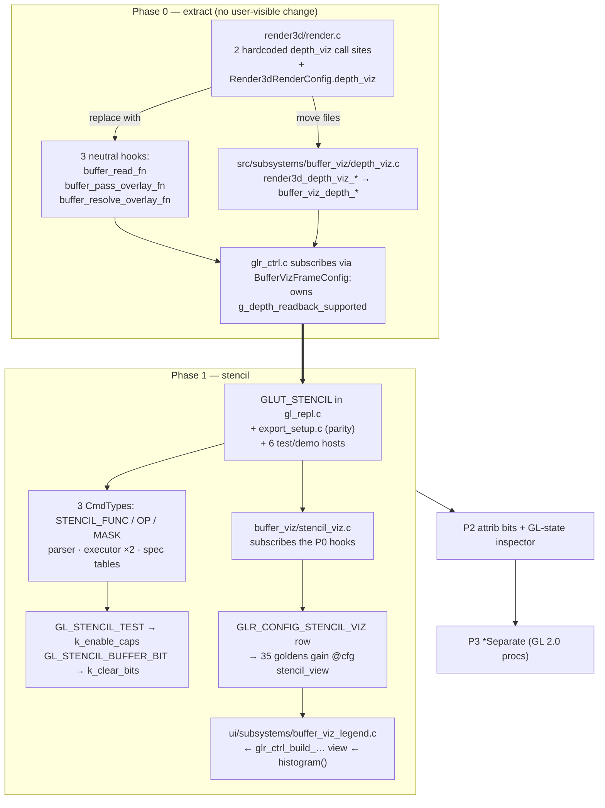

# Stencil buffer support + `buffer_viz` subsystem

## Context

The REPL exposes depth, blend, cull, fog and clip-plane state but no stencil at
all. The omission is currently *documented as intentional* in three places that
this change invalidates:

- `src/repl/command_spec.c:123-128` — the `k_clear_bits` comment: *"no REPL
  command writes stencil"*.
- `tests/test_repl_core_parse.c:1570` — `glClear(GL_STENCIL_BUFFER_BIT)` pinned
  in the **rejected** list.
- `docs/USER_GUIDE.md:549-552` — *"The stencil and accumulation bits are not
  offered."*

Two motivations. Stencil unlocks a class of classic immediate-mode techniques
(masking, planar reflections, outline passes, CSG-ish carving). And stencil is
*invisible* — unlike color and depth you cannot tell from the rendered frame
whether your mask did what you meant, so the visualization is what makes the
feature teachable rather than a nice-to-have.

Two structural facts shape the work.

**No GL context in the tree requests a stencil buffer.** `gl_repl.c:264` is
`GLUT_DOUBLE | GLUT_RGBA | GLUT_DEPTH | GLUT_MULTISAMPLE`. Every stencil command
is a silent no-op until that changes — and the *exported* C prologue
(`src/repl/export_setup.c:393`, `:416`, both `GLUT_DOUBLE|GLUT_RGB|GLUT_DEPTH|
GLUT_MULTISAMPLE`) has the identical gap, so exported scenes would render
differently from the REPL, breaking the project's parity invariant.

**Buffer visualization is becoming an inspection subsystem, so it gets one.**
The shipped depth-viz lives in `src/render3d/` and forced a `depth_viz` int into
`Render3dRenderConfig` (`render_types.h:275`) plus two hardcoded call sites
inside the frame pipeline (`render.c:836-841`, `:955-967`). Rather than adding a
second copy of that coupling, this plan extracts both into a
`src/subsystems/buffer_viz/` peer.

Be honest about the strength of this argument: render3d *already* owns
framebuffer capture and post-processing (`postprocess_filter.c` captures the
resolved color image), so "buffer inspection is categorically outside render3d's
boundary" is **not** an established fact of the architecture. The justification
is forward-looking rather than definitional — buffer viz is expected to grow CPU
data products (histograms, legends, per-value counts) and consumers above the
renderer (a UI legend, later possibly hit-testing and click-to-isolate), and
those are subsystem concerns, not renderer concerns. If stencil were the only
addition ever contemplated, keeping it beside depth_viz in render3d would be the
proportionate call.

render3d still *executes* every viz pass — it is merely agnostic to what the
passes are for. `scripts/check/check-render3d-no-upper-layers.sh` forbids
`src/render3d/` from including `subsystems/`, so the extraction *must* go through
neutral hooks: render3d offers "here is a point where you may read or composite",
with no idea what for.

## Confirmed decisions

| Decision | Choice |
|---|---|
| Placement | **`src/subsystems/buffer_viz/`** — depth_viz moves there, stencil_viz joins it; render3d executes the passes but stays agnostic |
| Color mapping | Config row cycles **Off / Palette / Ramp / Split**. Palette = deterministic value→color + legend; Ramp = min/max reusing depth-viz's EMA range |
| Stencil compositing | **Sparse RGBA overlay, `stencil == 0` fully transparent**, composited *inside* each scene pass after helpers and **before** edit overlays |
| Stencil clear | **Strict + warn.** No host-side stencil clear; warn when the viz is on and the program never clears stencil |
| Legend | **Corner panel with per-value pixel counts**, bounded to top-N by count, drawn by the UI layer from a controller-built view |
| Host passes | Grid/backdrop/axes and edit overlays run with **`GL_STENCIL_TEST` suspended**; geometry-reporting overlays are the deliberate exception |
| Phasing | **P0** extract buffer_viz · **P1** stencil commands + viz + host-pass policy · **P2** attrib bits + state inspector · **P3** `*Separate` |
| Web | Commands work everywhere; **viz native/OSMesa only** (WebGL cannot read `GL_STENCIL_INDEX`) |

Phase 0 is a **behavior-preserving refactor of a shipped feature** and lands and
is verified on its own before any stencil work starts. If it proves messier than
expected, Phase 1 can still fall back to mirroring depth_viz inside render3d —
but then the asymmetry is permanent, which is what this ordering avoids.

## Shape of the change



Frame-pipeline placement. **Depth and stencil composite at different points, by
design** — depth is a full-rect replacement that must sit on the resolved image,
stencil is a sparse overlay that must sit *under* the edit overlays:

```
render_3d_scene_pass:   setup → fill → [post_fill_fn] → ((buffer_read_fn))
                              → helpers → ((buffer_pass_overlay_fn)) → overlays
render3d_draw_scene:    … accum resolve … → [post_resolve_overlays_fn]
                              → ((buffer_resolve_overlay_fn)) → post filter
glr_ctrl_display_frame: render3d_draw_scene() → … → PROF_UI_PANELS → ui_buffer_viz_legend_render()
```

| Hook | Fires | Subscriber | Why there |
|---|---|---|---|
| `buffer_read_fn` | after fill, before helpers | depth (final pass), stencil (**every** pass) | user + replay geometry has written; grid/backdrop have not |
| `buffer_pass_overlay_fn` | after helpers, before overlays | **stencil** | keeps outlines/points/guides drawn *on top* of the viz; accumulates consistently across passes |
| `buffer_resolve_overlay_fn` | post-resolve, before post filter | **depth** (unchanged behavior) | full-rect replacement; Post FX applies uniformly across a Split seam |

The third hook is a **correction to the original design**, which composited
everything at the resolve point. That would have drawn the viz quad on top of the
per-pass edit overlays *and* the post-resolve bitmap labels, since
`post_resolve_overlays_fn` fires at `render.c:945-951` and the depth-viz render
at `:955-966` — after it. UI panels were never at risk; they draw later, in the
controller.

---

# Phase 0 — extract `src/subsystems/buffer_viz/`

Pure refactor. **No user-visible change**: same modes, same config key, same
`@cfg` slug (`depth_view`), same goldens, same pixels.

## 0.1 Three neutral hooks in render3d

`Render3dRenderConfig` already carries this idiom — `post_fill_fn`
(`render_types.h:145-146`, fired `render.c:777`) and `post_resolve_overlays_fn`
(`:165-166`, fired `render.c:945`). `post_fill_fn` is already taken by the replay
fades, so add dedicated hooks rather than fighting over them.

Phase 0 needs only the first and third (that is all depth_viz uses). **Add all
three now** — the mid-pass hook is what Phase 1's stencil overlay requires, and
introducing it during the refactor, while `test_depth_viz` and the byte-identical
capture gate are the active safety net, is cheaper than reopening `render.c`
later.

```c
/* Fires at the fill/helpers boundary: user geometry and the replay-fade
 * post_fill hook have written their buffers, the backdrop/grid have not.
 * is_final_pass is 0 on every accumulation pass but the last; subscribers
 * that only want one read per frame gate on it, subscribers that composite
 * per pass ignore it. */
void (*buffer_read_fn)(void *user_data, int is_final_pass,
                       int sx, int sy, int sw, int sh);
void  *buffer_read_user_data;

/* Fires after the helper passes (backdrop/grid/axes), before the edit
 * overlays, once per accumulation pass. For subscribers that composite a
 * sparse overlay which must remain UNDER the outlines/points/guides. */
void (*buffer_pass_overlay_fn)(void *user_data, int is_final_pass,
                               int sx, int sy, int sw, int sh);
void  *buffer_pass_overlay_user_data;

/* Fires after post_resolve_overlays_fn, before the scene post-filter, so
 * Post FX applies uniformly across a Split seam. `proj` is the canonical
 * jitter-free active projection for this frame. For full-rect replacements
 * that belong on the resolved image. */
void (*buffer_resolve_overlay_fn)(void *user_data,
                                  const Render3dProjectionDesc *proj,
                                  int sx, int sy, int sw, int sh);
void  *buffer_resolve_overlay_user_data;
```

`buffer_pass_overlay_fn` slots into `render_3d_scene_pass` between
`render3d_pass_helpers()` and `render3d_pass_overlays()` (`render.c:842-843`).

**Per-frame config travels through `user_data`, not a hidden subsystem global.**
The controller passes a `BufferVizFrameConfig *` (the two modes plus the scene
rect) as the `user_data` for all three hooks, so the modes in effect for a frame
are explicit at the call site and the subsystem holds no ambient mode state that
a test would have to reach around. Only the GPU-resident caches (texture name,
CPU buffers, EMA range, histogram) stay module-static.

The `proj` parameter is **required** and is a correction to the naive extraction:
`render3d_depth_viz_render()` takes a `const Render3dProjectionDesc *` today
(passed `&state->active_projection` at `render.c:961`) to linearize eye depth.
`Render3dProjectionDesc` is already a public render3d type (`render.h:60-68`) with
a public getter (`render3d_get_active_projection`, `render.h:143`, already called
by the controller at `glr_ctrl.c:2483`), so passing it through keeps the hook
neutral frame metadata rather than viz vocabulary.

`buffer_read_fn` and `buffer_resolve_overlay_fn` **replace** the hardcoded blocks
at `render.c:836-841` and `:955-967`. The `is_final_pass` flag is free —
`render_3d_scene_pass()` already receives exactly that as its `capture_depth`
parameter (`render.c:824`, set on the last pass only at `:918`, `:924`); rename it
to `is_final_pass` and forward it **without** using it as a gate. The `dv_on`
gate (`render.c:853`) disappears: all three hooks fire unconditionally and the
subscriber no-ops when its modes are Off. That inversion is what lets depth
(final pass only) and stencil (every pass) share one hook.

Delete `Render3dRenderConfig.depth_viz` (`render_types.h:269-275`), its validation
in `render3d_draw_scene` (`render.c:138-139`), and the `#include "depth_viz.h"`
(`render.c:8`). Move the `render3d_depth_viz_reset()` call out of
`render3d_init_gl()` (`render.c:72`) — the controller now owns that from
`glr_ctrl_init_gl`.

Update the stale comment at `src/render3d/postprocess_filter.h:70-72`, which
names depth-viz as a client of `render3d_post_2d_begin/_end`; the bracket stays,
the client is now a subsystem.

## 0.2 Move the module

`src/render3d/depth_viz.{c,h}` → `src/subsystems/buffer_viz/depth_viz.{c,h}`.
`SUBSYSTEMS_SRCS = $(wildcard src/subsystems/*/*.c)` (`Makefile:498`) picks the
directory up automatically; `RENDER3D_SRCS`'s wildcard drops it just as
automatically.

**Rename the prefix** `render3d_depth_viz_*` → `buffer_viz_depth_*`, and
`Render3dDepthVizMode` / `Render3dDepthVizRange` → `BufferVizDepthMode` /
`BufferVizRange` (the range type is deliberately un-prefixed by buffer kind — it
is shared with stencil RAMP in Phase 1). `check-module-prefixes.sh` is a denylist
of specifically eliminated names and will not force this, but the convention will
(`replay_*`, `variable_panel_*`, `color_picker_*` are the sibling precedents).
`buffer_viz_` is a **new top-level prefix**, which CLAUDE.md says must be
documented rather than merely introduced → add the boundary note to
`docs/MODULES.md` (subsystem table around `:548-558`, and the layer prose at
`:178-182`).

The subsystem keeps including render3d headers for `Render3dProjectionDesc`
(`render.h`) and the `render3d_post_2d_begin/_end` bracket
(`postprocess_filter.h:77-79`). This direction is established, not novel:
`src/subsystems/edit_overlays/edit_overlays.c` already includes `render3d/*`
headers and calls `glReadPixels`. Dependencies still point downward (layer 5 →
3.5); the guard only forbids the inverse.

## 0.3 Controller wiring

`src/app/glr_ctrl.c` subscribes all three hooks when building the frame config, and
keeps ownership of the policy it already owns:

- the capability mask at `glr_ctrl.c:1352-1353` now sets the subsystem's mode
  directly instead of zeroing a render-config field;
- `g_depth_readback_supported`, its `..._for_test` seam, its reason string
  (`:1184-1199`) and its probe (`:3200-3213`) stay exactly where they are — that
  is controller policy, not viz code.

## 0.4 Profiling — move `prof_begin` into the subsystem

`PROF_RENDER3D_DEPTH_VIZ` (`prof_sections.h:51-52`) → `PROF_BUFFER_VIZ_DEPTH`,
label updated in `src/app/glr_prof.c:52`. **Keep the enum constant inside the
render3d index range** and keep `PROF_RENDER3D_LAST` pointing at the last section
in it: the aggregate at `glr_ctrl.c:2188` / `:2262` is an *index* sweep
(`PROF_RENDER3D_SETUP … PROF_RENDER3D_LAST`), so moving the constant out of the
range would change what the render3d row reports in the profile panel — a
user-visible change this refactor must not make.

Because the sweep is index-based, the `prof_begin` / `prof_accum_end` calls
themselves move **into the buffer_viz TU** rather than bracketing the hook call
in render.c. That keeps the hook genuinely neutral (render3d never names a
buffer_viz section), still satisfies `check-prof-sections-instrumented` (which
scans `gl_repl.c` + all of `src/`), and stops charging time to the section on
frames where nothing is subscribed.

While here: `src/app/glr_prof.c:26` claims `PROF_RENDER3D_LAST` aliases
`_POST_PROCESS` — already stale, fix it.

## 0.5 Build + tests

- `test_depth_viz_OBJS` (`Makefile:962-971`) — swap `src/render3d/depth_viz.o` for
  `src/subsystems/buffer_viz/depth_viz.o`. It also links `postprocess_filter.o`
  and `postprocess_surface.o`; both stay. Registration in `TEST_BINS`
  (`Makefile:812`) and the `CORE_TEST_BINS` filter-out (`:854`) is unchanged.
- `tests/test_depth_viz.c` — mechanical rename only (`#include
  "subsystems/buffer_viz/depth_viz.h"`, `buffer_viz_depth_map`,
  `BUFFER_VIZ_DEPTH_*`). Its synthetic-buffer assertions are the proof the
  refactor preserved behavior. **Do not modify the assertions.**
- `tests/test_render3d_render.c:548-577` (`test_depth_viz_render_modes`) — this
  drives `cfg.depth_viz` and asserts `validate_render_config` rejects
  out-of-range values. That field is gone, so the test must be rewritten as a
  hook-subscription structural test. The mode-range rejection assertions
  **migrate to `test_depth_viz.c`** against `buffer_viz_depth_render`, since
  range validation is now the subsystem's job.

  Make the replacement pin **hook order and cardinality**, since that contract is
  what the whole extraction rests on and nothing else tests it. Install counting
  stubs for all three hooks and assert, for single-pass, 16-pass accum, blur, and
  replay-active configurations:
  - relative order is always `read → pass_overlay → resolve_overlay`;
  - `read` and `pass_overlay` fire **once per accumulation pass**, with
    `is_final_pass` true on exactly one of them;
  - `resolve_overlay` fires **exactly once per frame** in both the accum and
    non-accum branches;
  - `resolve_overlay` fires *after* `post_resolve_overlays_fn` and *before* the
    post filter.
- `render3d_demo` (`tools/render3d_demo/`) simply stops linking depth_viz.

## 0.6 Phase 0 exit criteria

`make test`, `make test-depth-viz`, `make check-state-ownership`, and a
**before/after OSMesa capture of the same scene in all four depth modes that is
byte-identical**. If the captures differ, the refactor is wrong.

---

# Phase 1 — stencil commands, clear bit, visualization

## 1.1 Give the context a stencil buffer

Add `GLUT_STENCIL` to `glutInitDisplayMode`:

- `gl_repl.c:264` — the real one.
- `src/repl/export_setup.c:393` and `:416` — **required for export parity.**
  (Note both spell `GLUT_RGB`, not `GLUT_RGBA`; leave that alone, just add the
  bit.)
- Demo/test hosts so they match: `tools/render3d_demo/render3d_demo.c:793`,
  `tests/test_render3d_render.c:1414`, `tests/test_ui_gl_state.c:252`,
  `tests/test_attrib_bits_gl.c:423`, `tests/test_tour_overlay_feedback.c:340`,
  `bench/bench_repl.c:1883`.

OSMesa needs nothing — the vendored fork already maps `GLUT_STENCIL` → 8 stencil
bits (`third_party/freeglut/src/osmesa/fg_window_osmesa.c:38-49`).

**Query the actual width; do not assume 8.** That OSMesa mapping proves what the
*vendored headless backend requests*, not what an arbitrary native GLUT visual
provides. Add to `glr_ctrl_init_gl`, beside the accum-bits probe at
`glr_ctrl.c:3192` and using the same probe-and-mask idiom:

```c
GLint stencil_bits = 0;
glGetIntegerv(GL_STENCIL_BITS, &stencil_bits);
(void)glGetError();   /* a GLES context may raise GL_INVALID_ENUM */
glr_state_render_mut()->stencil_bits = (int)stencil_bits;
```

Surface it in the init trace and in the capability-refusal message, and treat
`stencil_bits == 0` as "viz unavailable" alongside the readback probe — a context
that silently granted no stencil planes is exactly the failure a user would
otherwise spend an hour on. `GL_STENCIL_BITS` and `glClearStencil` appear
**nowhere** in the tree today, so both are new.

### `glClearStencil` — deliberately deferred, and say so

Without it the user cannot choose the clear value, so `glClear(GL_STENCIL_BUFFER_BIT)`
always clears to whatever the context default is (0 unless something set it).
That is a coherent subset for masking work — build a mask on a zeroed buffer,
test against it — and it keeps Phase 1's surface small. It is **not** the
complete basic stencil state family, and the plan should not imply otherwise.

Add `glClearStencil(n)` in Phase 2 alongside the attrib-bits work (it belongs to
`GL_STENCIL_BUFFER_BIT`'s attribute group anyway, so the two land naturally
together). Until then, `docs/USER_GUIDE.md` must state that the stencil clear
value is fixed at 0.

## 1.2 The three commands

Follow skill `gl-repl-new-command`. New `CmdType`s go **next to their relatives**
(`src/repl/command.h:33-36` — append-stable, never reorder): `CMD_STENCIL_FUNC`,
`CMD_STENCIL_OP`, `CMD_STENCIL_MASK` beside `CMD_DEPTH_FUNC` (`command.h:54`).

**`glStencilOp(sfail, dpfail, dppass)`** — three enum slots, so it rides the
generalized table-driven path with a new `k_stencil_ops` table: `GL_KEEP`,
`GL_ZERO`, `GL_REPLACE`, `GL_INCR`, `GL_DECR`, `GL_INVERT`.

> **`GL_INCR_WRAP` / `GL_DECR_WRAP` are omitted from Phase 1**, and *not* gated on
> a runtime probe. The spec tables are `static const` data driving parse and
> autocomplete; making an entry conditional on a probe means a scene that parses
> on one machine is **rejected on another**, which breaks scene-file round-trip
> and export parity — the exact invariant the rest of this plan is organized
> around defending. The only clean options are "always present" or "absent", and
> with an 8-bit buffer and masking-style scenes, `GL_INCR`/`GL_DECR` cover the
> real use cases. If they are wanted later, add them **unconditionally** (both
> are core since GL 1.4).

One wrinkle:
`format_enum_command_text` (`src/repl/parser.c:537-568`) threads `def->fmt` only
for 1, 2 and 4 slots — a 3-slot command falls to the generic `", "` join, which
produces identical text but leaves `fmt` dead. **Add a `num_slots == 3` branch.**

**`glStencilFunc(func, ref, mask)`** — mixed enum + two integers. No slot kind
covers that shape, and `ENUM_OR_EXPR` is explicitly reserved (one slot in the
whole tree, `command_spec.h:63-66`). Use a **custom parser branch** modelled on
`parse_fogf` (`parser.c:1213-1270`), registered with **`num_args = -1`** in
`k_enum_command_specs[]` — the sign convention (`command_spec.h:200-205`) means
"custom branch, `abs()` is the autocomplete slot count". **`-1`, not `-3`**: only
slot 0 is an enum slot that autocomplete can offer candidates for; `ref` and
`mask` are custom integer slots with no enum table behind them. Dispatch from
`try_parse_custom_arg_command` (`parser.c:1363-1383`).

> **Do not use `split_three_args`** (`parser.c:791-805`). It is `strchr`-based and
> paren-naive; it works for `glMaterialfv` only because the expression there is
> the *last* slot. For `glStencilFunc` the expression is the **middle** slot, so
> `glStencilFunc(GL_EQUAL, min(i,3), 0xFF)` would split wrong. Use
> `repl_scan_next_arg_delim()` (`src/repl/eval.h:428`), per CLAUDE.md.

Slot 0 **reuses `k_depth_funcs`** verbatim (`command_spec.c:65-75`) — already
exactly the eight comparison functions stencil needs. Reuse it rather than
cloning; a distinct usage hint belongs on the slot, not in a duplicate table.

**`glStencilMask(mask)`** — a single integer, also a small custom branch rather
than a plain `k_std_command_specs` row, so hex handling stays confined to the two
stencil parsers.

### ref / mask value policy

`GLCmd.args[]` is `float args[8]` (`command.h:104`); values round-trip exactly
only below 2²⁴, so `glStencilMask(0xFFFFFFFF)` cannot round-trip.

The 0..255 range is therefore a **deliberate REPL restriction**, framed as such —
it is *not* derived from a portable guarantee about the context (see §1.1: query
`GL_STENCIL_BITS`, don't assume). It keeps values inside float-exact range, and
matches the 8-bit buffer every target in practice provides.

- Restrict `ref` and `mask` to **0..255**. A *literal* out of range is a parse
  rejection with a clear message.
- **Truncate toward zero; do not round.** Exported C passes the value to a
  `GLint ref` parameter, where C's float→int conversion truncates. Rounding in
  the REPL would make `glStencilFunc(GL_EQUAL, i*0.6, 0xFF)` disagree with its own
  exported source — a parity break of exactly the kind §1.1 exists to prevent.
- Put the conversion in **one helper**, e.g.
  `repl_stencil_clamp_ref(float v, int *out)`, and call it from every path that
  can produce a value: the parser, the warm flatten path, and any rebake.
- Accept **`0xNN` and decimal** on input. The expression evaluator has no hex
  support (no `0x` / `strtol` anywhere in `src/repl/eval.c`), and hex is how every
  stencil example is written. Handle `0x` with a local `strtol` in the two stencil
  branches — **do not extend the expression language**, which would touch number
  scanning at `eval.c:1111` plus the highlighter classifiers at `:1455-1489` and
  drag in unrelated churn.
- Emit masks canonically as `0x%02X`, `ref` as decimal. Export writes canonical
  text and import re-parses it, so this round-trips as long as the parser accepts
  what it emits.
- `ref` additionally accepts an **expression** (via
  `parser_capture_expr_span(ctx, REPL_EXPR_ROLE_CMD_ARG_LIST_LENIENT, 1, …)`, the
  `parse_fogf` precedent at `parser.c:1248`) so `glStencilFunc(GL_EQUAL, i, 0xFF)`
  animates in a loop. `mask` stays literal-only, consistent with the `glClear`
  bitfield rationale that a mask is not a quantity to animate.

### Executor — two switches, both mandatory

`src/repl/executor.c`:
- `repl_apply_state_cmd()` (`:320-451`) — emit the GL calls. Has a `default:`,
  so a miss here is silent at compile time; it is caught at runtime by
  `repl_exec_cursor_warn_unhandled_state()` (defined `executor.c:586`, called at
  `:992`), which logs once
  per type when the cluster lists a type the apply helper doesn't handle.
- The exhaustive cluster in `repl_exec_cursor_step()` (`:934-1000`) — **no
  `default:` by design** (see the comment at `:892-903`), so a missing case is a
  `-Wswitch` warning. That is the intended tripwire; let it fire, then add the
  three cases to the delegating run alongside `CMD_DEPTH_FUNC`.

### flatten — one change (a dynamic `ref` bypasses its own policy)

`flatten_range()` branches only on control-flow types; everything else falls
through to `flatten_reparse_line` (`src/repl/flatten.c:1110`), so constant-arg
stencil commands survive reflatten for free. **But an animated `ref` does not
keep the policy above.** The warm compiled path assigns the evaluated float
straight into the command:

```c
/* flatten.c:697-703 */
if (v.found) {
    tmp.args[k] = v.value;          /* raw float — no clamp, no truncation */
    repl_flatten_expr_note_value(&ctx->expr, v.deps);
}
```

Its *only* post-evaluation correction is a `CMD_CLEAR_COLOR` clamp
(`flatten.c:707-713`), added for exactly this reason and explicitly commented as
mirroring the parser's fixup. So `glStencilFunc(GL_EQUAL, sin(t)*400, 0xFF)`
parses fine (the literal check never sees it) and then feeds `-372.6` to
`glStencilFunc` on some frames.

**Add a `CMD_STENCIL_FUNC` arm beside the `CMD_CLEAR_COLOR` one**, calling the
same `repl_stencil_clamp_ref()` helper the parser uses. Out-of-range at *runtime*
clamps silently rather than rejecting — a per-frame parse error is not a usable
failure mode for an animated value, and clamping is what the GL spec does with
`ref` anyway.

Tests this needs, none of which exist for the `CMD_CLEAR_COLOR` precedent either:
fractional `ref`, negative `ref`, `ref > 255`, `ref` from a loop variable, from a
predef var, across a warm-cache reflatten, and an exported-C comparison
confirming the truncation matches.

### Spec tables

`src/repl/command_spec.c`, **alphabetical by GL name**: rows in
`k_enum_command_specs[]`, and `g_command_type_specs[]` entries using
`CMD_TYPE_SPEC_NAMED_NOT_IN_BEGIN(..., CMD_CAT_STATE)` — real GL rejects these
inside `glBegin`, and not-in-begin specs **must** carry a `display_name` (pinned
by `tests/test_replay_walk.c:593-606`). Add to `k_func_completions[]` (around
`command_spec.c:275-295`, in the Render state run) — source order is
load-bearing for F1 row order and Tab priority, so place deliberately, not
alphabetically.

## 1.3 The two enum additions

**`GL_STENCIL_TEST` → `k_enable_caps`** (`command_spec.c:21-43`, alphabetical →
after `GL_POINT_SMOOTH`, currently the last entry). Mostly free:
- `src/repl/gl_state_inspector.c:417-431` seeds its cap table from this list, so
  the state panel picks it up automatically. `REPL_GL_STATE_MAX_CAPS` is 32,
  21 used → 22.
- Autocomplete is slot-indexed off the table — automatic.
- `glEnable`'s `help_desc` (`command_spec.c:278-282`) **hand-lists every cap**
  across four lines. Manual edit (and `glDisable` says "same caps as glEnable",
  so it needs nothing).
- `cap_group_bit()` (`attrib_bits.c:53-77`) is **Phase 2**. Left alone, the cap
  degrades to `GL_ENABLE_BIT` only — incomplete but correct, and it does not trip
  the `test_repl_state.c:1867` ratchet (which keys on `CmdType`; `CMD_ENABLE`
  already has a row).

**`GL_STENCIL_BUFFER_BIT` → `k_clear_bits`** (`command_spec.c:129-133`). Table
order **is** canonical emission order, so append after `GL_DEPTH_BUFFER_BIT`.
Rewrite the comment at `:123-128` — its stated rationale is now half false (the
accum-bit half still holds). Do **not** add it to `k_attrib_bits` (Phase 2).

The executor already passes the mask through (`executor.c:432`) and the
controller's scissor bounds it to the scene rect, so the clear needs no executor
change.

## 1.4 Clear policy: strict, with a warning

**No host-side stencil clear.** `glr_ctrl_clear_chrome()` (`glr_ctrl.c:1001-1030`)
is untouched. The program's own `glClear` *is* the frame's clear for the scene
rect; a renderer-side stencil clear would make the user's
`GL_STENCIL_BUFFER_BIT` decorative and desynchronize the REPL from its exported C.

The hazard that leaves is real — omit the bit and stencil accumulates across
frames — so add the warning. Scan the flat program for a `CMD_CLEAR` whose mask
carries `GL_STENCIL_BUFFER_BIT`; if the viz is on and none exists, post a status
message. `flatten_flat_lighting_enabled` (`src/repl/flatten.c:1123-1137`) is the
exact precedent for a flat-program predicate — add `repl_flat_clears_stencil()`
beside it. Post once per program change, not per frame (the status ring holds 16).

## 1.5 `src/subsystems/buffer_viz/stencil_viz.{c,h}`

Same shape as the now-relocated depth_viz — **pure GL-free conversion core plus a
thin GL shell** (`depth_viz.h:57-87` is the model), subscribing to the Phase 0
hooks alongside it. All three hooks are multiplexed by one small `buffer_viz.c`
dispatcher that the controller installs — it reads the `BufferVizFrameConfig`
from `user_data` and fans out to whichever module the frame's modes select — so
the single-slot hooks stay single-slot. Depth subscribes `read` (final pass only)
and `resolve_overlay`; stencil subscribes `read` and `pass_overlay`, both every
pass.

```c
typedef enum BufferVizStencilMode {
    BUFFER_VIZ_STENCIL_OFF = 0,
    BUFFER_VIZ_STENCIL_PALETTE,  /* deterministic value -> color + legend */
    BUFFER_VIZ_STENCIL_RAMP,     /* min/max normalized, EMA-smoothed */
    BUFFER_VIZ_STENCIL_SPLIT,    /* right half, palette-mapped */
    BUFFER_VIZ_STENCIL_COUNT
} BufferVizStencilMode;

typedef struct BufferVizStencilHistogram {
    unsigned int counts[256];
    int distinct;      /* non-zero bins */
    int total_px;
    int valid;
} BufferVizStencilHistogram;

void buffer_viz_stencil_reset(void);
void buffer_viz_stencil_capture(int sx, int sy, int sw, int sh);
void buffer_viz_stencil_render(BufferVizStencilMode mode,
                               int sx, int sy, int sw, int sh);
/* Pure, testable. Writes 4 bytes per input: palette/ramp color, and
 * alpha 0 for value 0 (transparent) or the configured overlay alpha
 * otherwise. Zero-vs-nonzero is the only distinction the buffer supports. */
void buffer_viz_stencil_map(const unsigned char *stencil, int count,
                            BufferVizStencilMode mode, BufferVizRange *range,
                            unsigned char *rgba_out);
const BufferVizStencilHistogram *buffer_viz_stencil_histogram(void);
```

- **Readback:** `glReadPixels(sx, sy, sw, sh, GL_STENCIL_INDEX, GL_UNSIGNED_BYTE,
  buf)`. Unlike depth's float rows, byte rows are **not** naturally aligned —
  bracket with `glPixelStorei(GL_PACK_ALIGNMENT, 1)` save/restore. (Depth
  deliberately skips this; see the note at `depth_viz.c:229`.)
- **Histogram** is computed in the same scan RAMP already needs for min/max, so
  the legend counts are free and need no second pass.
- **Palette** — fixed 16-entry table indexed `value & 15`, so a given value is
  always the same color regardless of what else is on screen. The palette lives
  **with this code, not in `theme.c`** — `docs/MODULES.md:640` keeps computed/data
  palettes out of `ui_theme`.

  **Documented aliasing:** `value & 15` gives values 16 apart the same swatch (1
  and 17 collide). Accepted, not overlooked — real stencil scenes use a handful of
  low values, and the legend prints the numeric value beside every swatch, so a
  collision is disambiguated wherever it can actually be seen. Say so in
  `docs/USER_GUIDE.md` rather than leaving a user to discover it.
- **Zero is transparent, and that is the whole compositing model.** `stencil == 0`
  → alpha 0, leaving the rendered scene untouched. `stencil != 0` → palette color
  at a fixed alpha. This is what keeps the viz from painting over the entire 3D
  viewport, and it is why Split only needs to restrict *where* the overlay applies,
  not what it contains.

  > **A limit worth stating in the docs, not just here:** a stencil readback
  > cannot distinguish "never written", "cleared to 0", and "the program
  > explicitly wrote 0" — all three are byte `0`. With zero transparent, an
  > explicit write of 0 is therefore invisible. Write provenance would need a
  > second coverage buffer or a diagnostic replay pass; it is not recoverable
  > from the stencil data. The contract the viz promises is **"zero vs
  > non-zero"**, never write history.
- **RAMP** reuses `BufferVizRange` and its EMA smoothing (`depth_viz.c:26-29`,
  alpha 0.25, 2.0× snap) rather than re-deriving it. This shared range type is a
  concrete payoff of putting both viz modules in one directory. RAMP keeps the
  same zero-transparent rule so the two modes composite identically.

  **Compute the range over non-zero bins only.** Zero is the clear value and
  dominates virtually every scene, so feeding the whole buffer to the EMA pins
  `min` at 0 permanently and degrades RAMP to a fixed `0..max` ramp — losing
  exactly the contrast the mode exists to provide. Since zeros are transparent
  they contribute nothing visible anyway. The histogram scan already walks every
  bin, so skipping bin 0 when deriving `min`/`max` is free.

  **Update the EMA once per frame, not once per pass.** Stencil captures on every
  accumulation pass (below), so a naive `buffer_viz_stencil_map()` per pass would
  run the smoothing 16× per frame at max accum — changing its effective time
  constant relative to depth's and letting the palette drift *between blur
  samples of the same frame*, which shows up as color banding across the
  accumulated result. Instead: compute a frame-local range on the first pass,
  reuse it unchanged for every remaining pass of that frame, and fold it into the
  persistent EMA exactly once. Same fix keeps the histogram stable — publish the
  final pass's histogram, not a per-pass one, or the legend counts flicker.
- **Draw: POT `GL_RGBA` texture with blending**, `glTexSubImage2D` with
  `GL_UNPACK_ALIGNMENT` save/restore, `GL_NEAREST`, one screen-space `GL_QUADS`,
  bracketed by `render3d_post_2d_begin/_end`. **No `glDrawPixels`** — absent from
  both the web build and the GL stubs.

  The bracket needs one adjustment at the call site, **not** a change to the
  bracket itself: `render3d_post_2d_begin` disables `GL_BLEND` and sets
  `GL_TEXTURE_ENV_MODE` to `GL_REPLACE` (`postprocess_filter.c:133-139`), which is
  right for depth's full-rect replacement and fatal for a sparse overlay — an RGB
  quad through it overwrites every pixel in the scene rect, zero-valued background
  included. Since the bracket opens with `glPushAttrib(GL_ALL_ATTRIB_BITS)`
  (`:110`), `stencil_viz` can simply re-enable blending inside it
  (`glEnable(GL_BLEND)`, `glBlendFunc(GL_SRC_ALPHA, GL_ONE_MINUS_SRC_ALPHA)`) and
  the `glPopAttrib` in `_end` restores everything. `GL_REPLACE` stays correct —
  it takes RGB *and* alpha from the texture, which is exactly what drives the
  sparse composite.

  The bracket also disables `GL_STENCIL_TEST` (`:135`), which matters more than it
  looks: without it the overlay quad would be clipped by the very stencil state it
  is trying to visualize.

  Unlike depth, stencil needs no projection, so `stencil_viz` subscribes to
  `buffer_pass_overlay_fn` (no `proj` argument) rather than the resolve hook.
- **Cost, stated explicitly:** compositing per pass means the stencil buffer is
  **read back once per accumulation pass** while the viz is on — up to 16× per
  frame at max accum passes, versus depth's once. This is accepted for a
  diagnostic mode. The alternative — forcing a single effective accum pass while
  stencil viz is active — is *not* chosen, because silently changing the
  accumulation effect while an inspection tool is on is a worse surprise than a
  slower frame. If it ever becomes a problem, make it a visible choice, not a
  silent one.
- **Both viz modes on at once: depth wins where it paints.** Nothing prevents
  Depth view and Stencil view being enabled together, and they composite at
  different points — the sparse stencil overlay lands mid-pass, depth's full-rect
  replacement lands at resolve, *after* it. So depth simply covers stencil
  wherever depth draws; the stencil overlay survives only in the live half of
  depth-Split. **Accept this rather than interlocking the two config rows**: it
  falls directly out of the compositing order, Split-vs-full is a legible way to
  see both, and having one menu row silently switch another off is a worse
  surprise than an occluded overlay. Document it in the user guide; do not add
  controller logic to force one off.
- **Replay fades write stencil too.** The fade batches re-execute old state
  commands through `post_fill_fn`, which fires *before* `buffer_read_fn`, so
  fade-batch stencil writes land in the buffer the viz captures. Harmless — the
  next frame's clear resets it and the main render already happened — but it means
  legend rows can appear during a fade that correspond to no currently-visible
  geometry. Worth a sentence in the user guide so it doesn't read as a bug.
- **Profiling:** `PROF_BUFFER_VIZ_STENCIL` beside Phase 0's
  `PROF_BUFFER_VIZ_DEPTH`, inside the render3d index range;
  `PROF_RENDER3D_LAST` moves to point at it.

## 1.6 Stencil vs. host passes (helpers, overlays, replay)

Enabling `GL_STENCIL_TEST` changes fragment visibility for **everything drawn
afterwards**, and the frame does not end when user geometry does. Left
unspecified, a program doing `glEnable(GL_STENCIL_TEST)` +
`glStencilFunc(GL_EQUAL, 1, 0xFF)` would have its stencil test silently clip the
grid, the axes, the backdrop, the cursor outline and the vertex points — host
chrome the user never asked to mask. The helper passes push attributes but do not
neutralize stencil state.

This is the same class of problem `overlay_gl_track_cmd` already solves for
clip planes, culling and `glFrontFace` (`src/subsystems/edit_overlays/edit_overlays.c`),
and it cannot be deferred to Phase 2 with the inspector — Phase 2 is about
*reporting* state, this is about *correctness of the rendered frame*.

**The contract:**

| Pass | Stencil behavior | Rationale |
|---|---|---|
| Backdrop / grid / axes / orbit target / **light indicators** (`render3d_pass_helpers`) | **Suspend `GL_STENCIL_TEST`** | Host chrome is not the user's geometry; masking it is never what was meant |
| Polygon outlines, vertex points, geometry guides | **Reproduce** the user's stencil visibility | These report *what the geometry did*; an outline around masked-away geometry is a lie. Same principle as the existing clip/cull mirroring |
| Cursor / current-block highlight | **Suspend** | Matches the existing Polygon-highlight On behavior, which already suspends clip planes and culling so the cursor's subject stays visible |
| Bitmap labels (`post_resolve_overlays_fn`) | **Suspend** | Screen-anchored annotation, not geometry |
| Replay fades | Reproduce (they re-execute the program's own state) | Already the case via `post_fill_fn`; needs a test, not a change |

**Writes, not just tests.** An overlay pass that redraws user geometry inherits
the program's `glStencilOp` and will *write* to the stencil buffer as a side
effect — corrupting the buffer the viz is about to read and, worse, the mask a
later pass depends on. Overlay walks must force `glStencilOp(GL_KEEP, GL_KEEP,
GL_KEEP)` (and `glStencilMask(0)` for belt and braces) unless they are
deliberately reproducing a mask-building pass.

### Implementation — two separate pieces

**(a) Helper suspension lives in render3d, not in the overlay walker.** The
contract above covers `render3d_pass_helpers`, but that pass has nothing to do
with `edit_overlays.c`. Bracket it in `render.c` with a neutral disable that
names no viz vocabulary:

```c
glPushAttrib(GL_ENABLE_BIT);
glDisable(GL_STENCIL_TEST);
render3d_pass_helpers(&frame_ctx);
glPopAttrib();
```

`GL_ENABLE_BIT` scoping restores the user's stencil test before
`buffer_pass_overlay_fn` and the edit overlays run, so neither sees a modified
enable state.

**One bracket covers all host chrome**, because the prerequisite commit
(`render3d_lights_render` moved from `render3d_pass_overlays` to the tail of
`_pass_helpers`) made the two pass functions align with the two stencil
categories exactly:

- `render3d_pass_helpers` — backdrop, grid, axes, orbit target, light gizmos.
  All host chrome. **Suspend.**
- `render3d_pass_overlays` — `post_overlays_fn` only. All geometry reporting.
  **Reproduce**, with per-draw exceptions handled inside `edit_overlays.c`.

Before that move, light indicators sat at the head of `_pass_overlays` and would
have needed their own bracket — widening the helpers bracket was not an option,
since it would also have swallowed the geometry-reporting overlays that must
*keep* the stencil test.

**(b) Overlay tracking in `edit_overlays.c`** is more than the three functions
the earlier draft named. The full list:

- **New stencil fields in `OverlayGlState`** (`:290-295`) — test enable, func/ref/mask,
  and the three op slots.
- `overlay_gl_apply_cmd` (`:349-390`) — mirror `CMD_STENCIL_FUNC` and
  `GL_STENCIL_TEST` alongside the clip/cull cases. **`CMD_STENCIL_OP` and
  `CMD_STENCIL_MASK` must be *consumed* (tracked, return 1) but never applied to
  overlay draws** — they are write state, and overlay passes must not write.
- `overlay_gl_restore_frame` (`:398-437`) — restore the new fields under
  `glPushAttrib(GL_ENABLE_BIT)` scoping, like the existing members.
- `overlay_gl_reset` (`:473`) — leave stencil **disabled** at the end of a walk,
  so the label and guide passes that follow start from a known baseline rather
  than inheriting whatever the last tracked command set.
- `overlay_gl_suspend` / `_resume` (`:491-518`) — the stencil counterpart, used
  by the cursor-highlight path that already suspends clip planes and culling.
- **Establish a known baseline at the start of every walk**, don't assume the
  frame left one.
- **Enforce `glStencilMask(0)` and `glStencilOp(GL_KEEP, GL_KEEP, GL_KEEP)` for
  the whole duration of every overlay draw.** This is the subtle one: without it,
  a tracked user `glStencilMask(0xFF)` re-applied mid-walk would silently reopen
  writes that the walk had disabled at entry, and the overlay would corrupt the
  mask a later pass depends on — and the buffer the viz is about to read.

`overlay_gl_track_cmd` (`:446-470`) needs no change; it delegates everything that
isn't push/pop attrib.

**Tests:** a replay test over a masked scene (the clamped flat count must not
change what the mask means), and an overlay test asserting outlines follow the
stencil test while the grid does not. `tests/test_edit_overlays.c` has seven
`CMD_ENABLE` sites to model on.

## 1.7 Config key + capability gate

Per skill `gl-repl-config-toggle`. Naming trap: the row struct is
**`GlrConfigItem`** (`src/app/glr_config.h:85-102`); `ReplConfigItem`
(`src/repl/cfg_baseline.h:32-35`) is the unrelated `@cfg` slug/value pair.

- `GLR_CONFIG_STENCIL_VIZ` in `src/app/glr_config.h` (beside
  `GLR_CONFIG_DEPTH_VIZ:66`).
- `g_cfg_items[]` row in `src/app/glr_actions.c` under `### GEOMETRY`, directly
  after Depth view (`:463-465`), with
  `stencil_viz_names[] = {"Off","Palette","Ramp","Split"}`.
  **Label it "Stencil view"** — `glr_config_item_slug()` derives the `@cfg` slug
  from the label via `cfg_slug_from_label`, yielding `stencil_view`, matching
  `depth_view`.
  **Do not set `.is_special`** — despite the name it means "GLUT special-key
  (F-key) binding" (`glr_config.h:87`), not "special row". With no keybinding the
  row carries only `.label`, `.key`, `.state_count`, `.state_names`.
- `CFG_DEFAULT_STENCIL_VIZ 0` in `src/app/glr_defaults.h` (beside
  `CFG_DEFAULT_DEPTH_VIZ:67`).
- Storage in `presentation` (`src/app/glr_state.h:66-72`) and an arm in
  `config_value_ptr()` (`glr_config.c:216+` — that switch *is* the ownership
  declaration and the compiler flags a key that forgets to claim one).
- **Do NOT add a reset line to `glr_state_presentation_reset_example_defaults()`**
  (`glr_state.c:124-158`). Verified: `depth_viz` appears exactly once in
  `glr_state.c` — the initializer at `:71` — and is deliberately *not* reset
  there. Buffer viz is a session inspection tool that should survive an example
  load, not per-scene presentation. Match depth exactly.
- **Do NOT add it to `cfg_key_in_scene_subset()`** (`glr_actions.c:534-560`) —
  `GLR_CONFIG_DEPTH_VIZ` is deliberately absent from that list, for the same
  reason.
- **No `Render3dRenderConfig` field** — Phase 0 removed that pattern. The
  controller fills the frame-local `BufferVizFrameConfig` (§0.1) that travels
  through the hooks' `user_data`; it does not set an ambient subsystem mode.
- **No keybinding initially.** `make keymap-list` shows free slots; a binding also
  drags in `check-user-guide-keymap`. Menu-only first.

**Capability gate** — an exact twin of the depth machinery:
`g_stencil_readback_supported` (default 1 so tests exercise it) mirroring
`glr_ctrl.c:1184`, a `glr_ctrl_set_stencil_readback_supported_for_test` seam
(`:1186`), a `glr_ctrl_stencil_readback_unsupported_reason()` string
(`:1190-1199`), a 1×1 `glReadPixels(0,0,1,1, GL_STENCIL_INDEX, GL_UNSIGNED_BYTE,
…)` probe beside the depth probe (`:3200-3213`), a hard
`#if defined(__EMSCRIPTEN__)` disable, menu refusal with a status message
(`glr_actions.c:1089-1101`), and forcing the mode to Off in the
`BufferVizFrameConfig` the controller builds each frame. `@cfg`
header loads bypass the refusal so files round-trip. **This is what enforces
"commands everywhere, viz native-only."**

### Golden-fixture consequence

Verified: there are **35** goldens in `tests/testdata/repl_examples_ui/`, each
carrying **43** `/* @cfg … */` lines (note the block-comment spelling, not `//`),
with `/* @cfg depth_view = 0 */` at line 25. The new key adds
`/* @cfg stencil_view = 0 */` at line 26 in all 35 files, shifting the rest.
Regenerate with `make rebuild-golden`; single file via
`build/release/test_repl_core_examples --dump-index N`. Rebuild `BUILD=debug`
first. Headroom: `REPL_CFG_MAX_ITEMS` is 48 (`cfg_baseline.h:27`), 43 → 44. Fine,
but `test_workspace_header_budget_worst_case` (`tests/test_repl_core_io.c:2844-2905`)
is the test that fires if it ever isn't.

## 1.8 Legend panel

Data flows **up by pull**; dependencies still point only down:

```
buffer_viz_stencil_histogram()             (subsystem owns the buffer; plain struct)
  -> glr_ctrl_build_buffer_viz_legend_view()   (controller adapts)
    -> ui_buffer_viz_legend_render(view)       (UI draws)
```

New UI module at **`src/ui/subsystems/buffer_viz_legend.{c,h}`** — not
`src/ui/support/`. `src/ui/subsystems/` is the mirror tier for peer subsystems
(`replay_hud.c` ↔ `subsystems/replay/`, `color_picker.c` ↔
`subsystems/color_picker/`, `variable_panel.c` ↔ `subsystems/variable_panel/`);
`src/ui/support/` holds only the neutral `cpuprof` / `memprof` panels that the
standalone subsystem demos link (`check-subsystem-demo-isolation.sh`).

Drawn in the `PROF_UI_PANELS` block of `glr_ctrl_display_frame`, alongside
`ui_gl_state_panel_render` (`glr_ctrl.c:~2280`) — that pairing
(`glr_ctrl_build_gl_state_panel_view()` → `ui_gl_state_panel_render(view)`) is the
exact structural precedent to copy.

Rows: swatch + value + pixel count, **only for values present**, with a total.

**Bound the row count.** A valid capture may contain all 256 values, and the
panel has no clipping, scrolling or paging — an unbounded legend can exceed the
viewport. Cap at **top-N by pixel count** (N ≈ 8, tuned to the panel), value
ascending as the tiebreak, with a trailing `+N more` row when truncated. Always
retain the zero row and the total, since "how much is background" is the question
the panel most often answers. The 16-color aliasing noted in §1.5 is why rows
print the numeric value, not just a swatch — two listed rows can legitimately
share a color.

Selection happens in the **controller's view builder**, not the renderer: the
histogram is raw data, "which 8 rows" is a presentation decision, and
`check-renderer-purity` wants the UI drawing a prepared view rather than deriving
one. Reuse the layout idiom from `hist_draw_legend()`
(`src/ui/support/cpuprof.c:999-1051`) — colored `glRectf` swatch plus
`gl2d_draw_string(…, FONT_SMALL)`. There is no generic legend widget, so this is a
new one modelled on that.

Guards: `check-renderer-purity` (no `repl_*_set_*`, no `repl_state_*_mut()`, no
pointer-deref mutation under `src/ui/**/*.c`), `check-ui-returns-hits-only`,
`check-ui-renderer-takes-view`, `check-views-flat-types`, `check-views-by-value-snapshot`.
Render-only — no hit-test unless a later phase wants click-to-isolate.

## 1.9 GL stubs

`tests/gl-stubs/include/GL/gl.h` — inline no-op `glStencilFunc`, `glStencilOp`,
`glStencilMask` (models: `glBlendFunc:279`, `glDepthFunc:302`), plus the enums
verified missing: `GL_KEEP 0x1E00`, `GL_INCR 0x1E02`, `GL_DECR 0x1E03`,
`GL_INVERT 0x150A`, `GL_STENCIL_INDEX 0x1901`, `GL_PACK_ALIGNMENT 0x0D05`, and
**`GL_STENCIL_BITS 0x0D57`** — verified absent, and now required by the §1.1
capability query (`GL_SAMPLES:154` and `GL_ACCUM_RED_BITS:155` are the neighbours
to add it beside; note `glGetIntegerv`'s stub at `:350` special-cases `GL_SAMPLES`,
so decide what it should report for stencil bits — 8 keeps the stub build
exercising the enabled path).

`GL_INCR_WRAP` / `GL_DECR_WRAP` are **not** needed — those enums are dropped from
Phase 1 (§1.2).

Verified already present: `GL_STENCIL_TEST:162`, `GL_STENCIL_BUFFER_BIT:94`,
`GL_REPLACE:229`, `GL_ZERO:244`, `GL_NEVER:72`, `GL_ALWAYS:79`,
`GL_UNSIGNED_BYTE:235`, `GL_UNPACK_ALIGNMENT:97`, `GL_NEAREST:236`,
`glPixelStorei:270`, `glTexSubImage2D:276`, and `GLUT_STENCIL` (`freeglut.h:21`).
`GL_STENCIL_BUFFER_BIT` is defined **twice** (`:94` and `:114`) — pre-existing and
harmless, but dedupe it in passing while you are in the file.

`tests/gl-stubs/include/GL/gl_stub_counts.h` — three `X(...)` entries.

## 1.10 Docs — one is build-gated

- **`src/repl/command_descriptions.txt` — enforced.**
  `scripts/gen_command_descriptions.py` parses the `CmdType` enum *and*
  `k_enable_caps[]` and **hard-fails** on a missing or extra entry
  (`make check-command-descriptions`, `Makefile:1830`). Needs `[command
  CMD_STENCIL_FUNC]`, `[command CMD_STENCIL_OP]`, `[command CMD_STENCIL_MASK]`,
  `[capability GL_STENCIL_TEST]`. Also amend the `glClear` entry
  (`command_descriptions.txt:189`) — it currently asserts *"The REPL already
  clears both at the start of every frame"*, which is both stale and now
  actively misleading for stencil.
- `docs/USER_GUIDE.md:403-406` (the `glEnable` CAP list — **already drifted**,
  omits `GL_LINE_STIPPLE` and `GL_MULTISAMPLE`; fix while there) and `:549-552`
  (the "stencil and accumulation bits are not offered" paragraph — the stencil
  half is now wrong).

  A new stencil section must state four things a user would otherwise hit as
  bugs: the clear value is **fixed at 0** (no `glClearStencil` until Phase 2,
  §1.1); `ref`/`mask` are restricted to **0..255** and truncate rather than round
  (§1.2); the viz shows **zero vs non-zero only** and cannot show that a program
  explicitly wrote 0 (§1.5); and the palette **repeats every 16 values**, which is
  why rows print numbers (§1.5, §1.8). Add a note that replay fades can
  contribute legend rows during a fade (§1.5).
- `CLAUDE.md` — add the three commands to the Supported Commands block.
  (`AGENTS.md` is a **symlink** to `CLAUDE.md`, not a duplicate copy; one edit
  covers both. The earlier draft of this plan claimed otherwise.)
- `docs/MODULES.md` — the `src/subsystems/buffer_viz/` rows and the new
  `buffer_viz_` prefix boundary note (Phase 0), plus the
  `src/ui/subsystems/buffer_viz_legend.c` row.
- `docs/ARCHITECTURE.md:2030-2080` — the add-a-command checklist is **stale**
  (references `enums1`/`enums2` and a 4-arg `CMD_TYPE_SPEC` that no longer exist).
  Worth fixing opportunistically; not required.

## 1.11 Tests

**Inverted (currently assert rejection):**
- `tests/test_repl_core_parse.c:1570` — drop `glClear(GL_STENCIL_BUFFER_BIT)` from
  `k_bad[]`, add positive cases mirroring `:1500-1556` (single bit, `|` join,
  reordered/unspaced canonicalization, dedupe).
- `:1730` — `glPushAttrib(GL_STENCIL_BUFFER_BIT)` **stays rejected** in Phase 1.

**Extended:**
- `tests/test_repl_export_all_commands.c` — the three `CmdType`s into
  `expected_commands[]` (`:58-108`) and `editor_feed_line("glStencil…;")` into the
  mega-example (`:368-395`).
- `tests/test_repl_executor.c:166-200` (`test_enum_arg_gl_trace`) — argument-order
  assertions. This test exists because a multi-enum arg shift is invisible to call
  counts, and `glStencilOp`'s three same-table slots are exactly that hazard.
- `tests/test_repl_core_extra.c:1793` and `tests/test_repl_executor.c:513-560` pass
  automatically once the spec rows exist.
- **New `tests/test_stencil_viz.c`** — pure-core tests over synthetic buffers
  (palette determinism, histogram counts, empty/uniform buffers, degenerate ramp
  span), modelled on `tests/test_depth_viz.c` and sharing its Makefile shape
  (`OBJS` = test + `buffer_viz/stencil_viz.o` + `render3d/postprocess_filter.o` +
  `postprocess_surface.o` + `gl_stub_counts.o`; register in `TEST_BINS` and add to
  the `CORE_TEST_BINS` filter-out at `Makefile:854`).
- New parse tests: hex and decimal `ref`/`mask`, the 0..255 rejection, `ref` as an
  expression, and specifically `glStencilFunc(GL_EQUAL, min(i,3), 0xFF)` to pin
  the paren-aware split.
- **Dynamic-`ref` suite** (§1.2, the flatten fix — this is the one with no
  existing precedent to copy, since the `CMD_CLEAR_COLOR` clamp it mirrors is
  itself untested): fractional, negative, `> 255`, loop-variable, predef-var,
  survives a warm-cache reflatten, and an exported-C comparison confirming
  truncation matches C's float→`GLint` conversion.

  > Landed as a **value-level** comparison (`test_repl_flatten_rebake.c`'s
  > `c_stencil_ref()` oracle plus the export-text assertion in
  > `test_repl_export_all_commands.c`), not through
  > `test_export_trace_parity`: that harness compares per-symbol *call
  > counts*, never argument values, so it structurally cannot see a
  > truncation difference. It carries a `stencil_mask` curated program
  > anyway — the one place exported stencil C is compiled at all.
  >
  > Note the resulting divergence, which is intended: an out-of-range
  > *animated* `ref` is clamped REPL-side but passed raw by the exported C.
  > The rendered results still agree because GL clamps `ref` itself.
- **Host-pass suite** (§1.6): grid/axes unaffected by an active stencil test;
  polygon outlines *are* affected; cursor highlight is not; an overlay redraw
  leaves the stencil buffer byte-identical (no writes leaked through an inherited
  `glStencilOp`); a replay over a masked scene at several clamp limits.

**Ratchet:** `check-tier-c-function-size`
(`scripts/baselines/tier-c-function-size.txt`, `parse_command: 335`,
`flatten_range: 91`). The stencil parsers are separate static functions so
`parse_command` grows only by dispatch lines — and the dispatch actually lives in
`try_parse_custom_arg_command`, not `parse_command` itself, so the baseline may
well not move. The file's own guidance says to *lower* it when extracting, never
quietly raise it far.

---

# Phase 2 — attrib bits + GL-state inspector  ✅ landed

Gated by the ratchet at `tests/test_repl_state.c:1866-1879`: any `CmdType` with
non-zero `repl_attrib_bits_for_type()` must have a row in `k_gl_state_cell_cases[]`
(there is a `gl_state_cell_case_excused()` escape hatch; do not use it). Phase 1
keeps stencil at zero bits to stay outside the ratchet; Phase 2 opts in
deliberately.

- **`glClearStencil(n)`** — deferred here from Phase 1 (§1.1). It belongs to the
  `GL_STENCIL_BUFFER_BIT` attribute group, so it lands naturally with the
  attrib-bits work rather than needing its own pass. Single int arg, 0..255, same
  `repl_stencil_clamp_ref()` helper.

  **It cannot be a plain `k_std_command_specs` row.** That path accepts ordinary
  float expressions and the warm flatten path writes the evaluated value straight
  into `args[]` — recreating the dynamic-`ref` bug §1.2 exists to fix, in a
  command whose whole job is to seed the buffer the viz reads. Either give it a
  custom integer parser branch like `glStencilMask`, or add an explicit
  `CMD_CLEAR_STENCIL` arm to the flatten post-evaluation fixup beside
  `CMD_STENCIL_FUNC`. Do one of the two deliberately; do not let it default onto
  the std path.

  > **Landed as both, because the value takes an expression.** The clear value is
  > a *quantity* like the clear colour and clear depth — both of which animate in
  > this REPL — so making it literal-only would have made it the odd one out in
  > its own family. It therefore shares `glStencilFunc`'s ref slot verbatim
  > (extracted as `parse_stencil_quantity_slot()`): expression allowed, literal
  > out of range rejected, animated value clamped. Accepting an expression is
  > exactly what makes the flatten arm mandatory rather than optional, so both
  > post-evaluation sites in `flatten.c` carry a `CMD_CLEAR_STENCIL` arm beside
  > the `CMD_STENCIL_FUNC` one.

  Once it exists, drop the "clear value is fixed at 0" note from
  `docs/USER_GUIDE.md`.
- `src/repl/attrib_bits.c` — `ITEM_KIND_STENCIL_*` (`:22-45`), `item_group_bit`
  (`:85-108`), `repl_attrib_bits_for_cmd` (`:121-150`), `repl_attrib_cells_for_cmd`
  (`:260-395`), `cap_group_bit(GL_STENCIL_TEST)` (`:53-77`).
- `GL_STENCIL_BUFFER_BIT` into `k_attrib_bits` (`command_spec.c:143-155`), enabling
  `glPushAttrib(GL_STENCIL_BUFFER_BIT)`; invert `test_repl_core_parse.c:1730`. The
  table requires a single bit < 2²⁴ for float round-trip; `0x00000400` qualifies.

  > **The table is not the only thing sized by that count.** `k_attrib_bits`
  > order *is* the canonical bit index, and `REPL_ATTRIB_BIT_COUNT`
  > (`attrib_bits.h`) sizes `k_attrib_bit_colors[]` in
  > `src/ui/app/repl_code_panel.c` — the per-bit hues for the push-line mask
  > tokens and the gutter markers. An eleventh bit needs the count bumped and a
  > hue inserted **at the same index** (stencil sorts between depth and
  > transform, ascending GL value), or the last group silently loses its colour.
  > `test_repl_code_panel_document` catches it.
- `src/repl/gl_state_inspector.c` — fields in `ReplGlTrackedState` (`:73-192`),
  `gl_state_apply_cmd` cases (~`:938`), `gl_state_restore_attrib_groups`
  (`:786-830`), report rows (~`:1412`, ~`:1474`).
- Rows in `k_gl_state_cell_cases[]` (`tests/test_repl_state.c:1704-1877`); models at
  `CMD_DEPTH_FUNC:1769` / `CMD_BLEND_FUNC:1783`. Matching entries in
  `tests/test_attrib_bits_gl.c` and `tests/test_repl_core_commit.c:1873-1890`, `:2567`.

# Phase 3 — separate-face variants

`glStencilFuncSeparate(face, func, ref, mask)` and
`glStencilOpSeparate(face, sfail, dpfail, dppass)` — 4 args each, within
`args[8]`. Two more `CmdType`s.

They are **not** symmetric, and the split decides the parser work:

- `glStencilOpSeparate` is four pure enum slots, so it rides the generalized
  table-driven path with no new parser code — and the 4-slot `fmt` branch in
  `format_enum_command_text` already exists.
- `glStencilFuncSeparate` is the **enum + int shape again** (two enums, then `ref`
  and `mask`), i.e. a third custom branch after `glStencilFunc` and
  `glStencilMask`.

That means the rule stated in this plan's own risk list — *"if Phase 3 adds a
fourth stencil branch, build a proper `ENUM_THEN_INTS` slot kind"* — **will fire
at Phase 3**, and it is better to plan for it now than to discover it as a
surprise. Build `ENUM_THEN_INTS` as the first step of Phase 3 and migrate
`glStencilFunc` / `glStencilMask` onto it, rather than adding a third
hand-written branch. That also retires the `parse_command` size-ratchet pressure
noted in §1.11.

These are **GL 2.0 entry points**, unlike everything else in the tree, so they
need extension-advertise + proc-load treatment
(`glr_ctrl_load_point_parameter_proc`, `glr_ctrl.c:214-238`), gated on
`glutExtensionSupported` — **never on a non-NULL proc pointer**, because GLX's
`GetProcAddress` returns a callable stub for any name (`glr_ctrl.c:251-253`).
gl4es may not expose them, so expect to gate the commands themselves on the web
build — a different posture from Phase 1, and why they are last.

---

# Verification

```bash
make gl-repl && make test          # ASan + UBSan
make test-depth-viz                # Phase 0 regression proof
make test-stencil-viz              # Phase 1 pure-core proof
make test-repl-core-parse
make test-repl-core-examples       # after `make rebuild-golden`
make check-command-descriptions    # hard-fails on a missing catalog entry
make check-c99
make check-state-ownership         # full guard suite incl. render3d/ui purity
make test-stubs && make gl-repl USE_GL_STUBS=1   # after touching stubs
make web                           # commands must still build for gl4es
```

Cross-check under real GCC (local `gcc` is Apple clang):

```bash
ssh gracemont 'cd ~/code/openGL/samples/gen-ai/gl-repl && \
  git pull --ff-only origin main && make check-c99 && make test-stubs'
```

**Phase 0 gate:** before/after OSMesa captures of one scene in all four depth-viz
modes must be **byte-identical**. Anything else means the extraction changed
behavior. Also confirm the Compute Profile panel's render3d aggregate is
unchanged — that is what the index-range decision in §0.4 protects.

**Phase 1 end-to-end** (skill `gl-repl-capture`): build headless
(`make gl-repl FREEGLUT_OSMESA=1`) and capture a scene that writes a mask —
disable color/depth writes, `glStencilFunc(GL_ALWAYS, 1, 0xFF)`,
`glStencilOp(GL_KEEP, GL_KEEP, GL_REPLACE)`, draw the mask geometry, re-enable
writes, draw through `glStencilFunc(GL_EQUAL, 1, 0xFF)`. Confirm:

- the masked render is correct;
- **the viz is sparse** — with Palette on, pixels where `stencil == 0` show the
  ordinary rendered scene, not a flat fill. This is the check that catches an
  RGB/`GL_REPLACE` regression (§1.5);
- **edit overlays draw on top of the viz** — turn vertex outlines and points on
  deliberately for this shot and confirm they are visible over the colored
  region. This is the check that catches a wrong composite point;
- **UI panels and the legend are unaffected** — they draw in the controller,
  after render3d returns;
- the legend's counts sum to the scene rect, and Ramp and Split agree with
  Palette;
- **grid and axes are not clipped** by the active stencil test (§1.6);
- **omitting `GL_STENCIL_BUFFER_BIT` from `glClear` produces the warning** plus
  visible frame-to-frame accumulation;
- under a multi-pass accum effect the overlay still composites correctly rather
  than appearing at 1/N intensity.

Note that vertex outlines default ON and normally pollute capture shots — here
they are the subject of one check, so take both a with and a without shot.

**Export parity:** export that scene, compile the standalone C, confirm identical
render. This is the check that catches a forgotten `GLUT_STENCIL` in
`export_setup.c`.

**Web:** commands compile and run under `make web`; the stencil-viz row is refused
with the capability message rather than silently doing nothing.

# Risks

- **`GLUT_STENCIL` changes pixel-format selection on every platform.** Requesting
  stencil can select a different visual, in principle perturbing MSAA/accum.
  Verify accum effects and MSAA still work immediately after 1.1 — this is the one
  change that could regress unrelated features, and it lands first so that
  surfaces early.
- **Phase 0 refactors a working, shipped feature.** Mitigations: `test_depth_viz.c`
  is a pure-core suite whose assertions must not change, plus the byte-identical
  capture gate. If Phase 0 turns messy, Phase 1 can still fall back to mirroring
  depth_viz inside render3d at the cost of permanent asymmetry.
- **`test_render3d_render.c:548-577` cannot be preserved as-is.** It asserts on a
  config field that Phase 0 deletes, so unlike `test_depth_viz.c` it must be
  rewritten. Keep the rewrite structural (hook fired / not fired) so it still
  proves something the hook extraction could break.
- **Three new hooks are a wider render3d API.** They are neutral by design, but a
  second *independent* subscriber would want a subscriber list rather than a
  single slot. The `buffer_viz.c` dispatcher keeps depth and stencil behind one
  slot each; keep them single-slot until something outside buffer_viz needs them.
- **Stencil viz reads back once per accumulation pass** (§1.5), unlike depth's
  once per frame. At 16 accum passes with a large scene rect that is a real cost.
  It is accepted deliberately — silently collapsing the accumulation effect while
  an inspection tool is on would be a worse surprise — but if it bites, make the
  mitigation explicit and visible rather than automatic.
- **Host-pass stencil policy (§1.6) is the highest-risk correctness area.** It
  touches `edit_overlays.c`, which already carries subtle clip/cull/front-face
  mirroring, and a mistake there is visible only in specific overlay+mask
  combinations. It is also the part with the least existing test coverage to lean
  on. Budget for it accordingly; it is not a footnote to the command work.
- **Zero-provenance is unrecoverable** (§1.5). Users *will* ask why
  `glStencilOp(..., GL_ZERO)` produces no visible change in the viz. The answer
  belongs in `docs/USER_GUIDE.md` at the point the feature is introduced, not in
  a support conversation.
- **`ENUM_OR_EXPR` growth avoided, dispatch growth incurred.** `glStencilFunc`'s
  enum+int shape is a genuine gap in the slot-kind model. Custom branches are the
  established answer (six precedents in `try_parse_custom_arg_command`) but add to
  the parser. If Phase 3 adds a fourth stencil branch, build a proper
  `ENUM_THEN_INTS` slot kind instead.
- **The legend is the first of its kind.** Nothing in the tree currently hops viz
  metadata subsystem → controller → UI, so expect the view-struct boundary to need
  one iteration against `check-views-flat-types` / `check-views-by-value-snapshot`.
