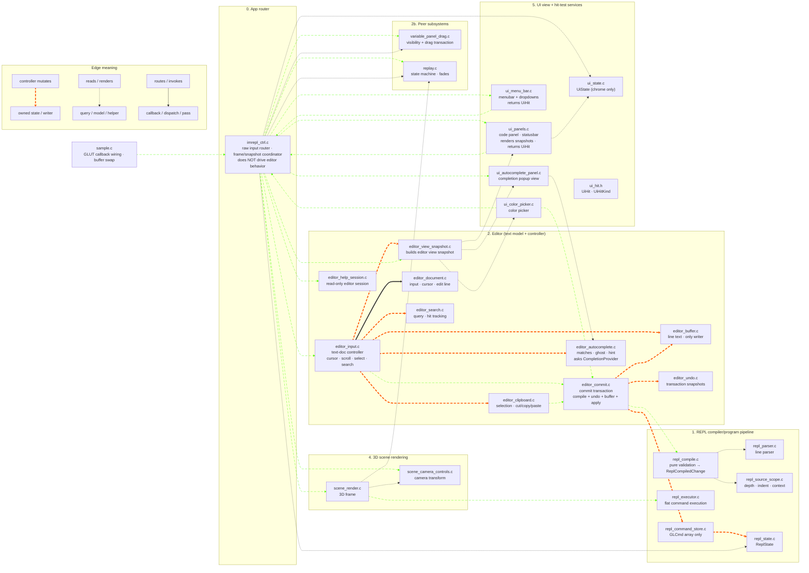

# MODULES.md Update: Editor Uses UI As Its View

This file contains the intended `MODULES.md` update for the corrected editor/UI/controller boundary.

Directly overwriting `MODULES.md` through the GitHub contents API is currently blocked because the connector does not expose the current blob SHA for the large file. This document preserves the replacement language and Mermaid diagram so it can be applied to `MODULES.md` without ambiguity.

## Replacement Four-Role Ownership Contract

```text
Editor = text model + controller.
    Owns text-document behavior: editable source text, read-only text documents,
    cursor, selection, scroll, search, autocomplete state, clipboard, undo/redo,
    cursor blink, keyboard/mouse handling for text documents, and source commit
    orchestration.

    The editor uses UI as its view. It exposes editor snapshots for UI to render,
    and it consumes neutral UI hit-test results to interpret mouse/pointer input.
    UI does not decide text behavior.

UI = view + hit-test/render services.
    Provides the view for the editor and other subsystems. Draws glyphs,
    highlights, gutters, panels, widgets. Measures text. Hit-tests visual
    rows/chars/buttons/swatches/sliders. Returns neutral UiHit results.
    Does not own text behavior or editor state.

REPL = validator/compiler for committed source.
    Given proposed source text + context, returns ReplCompiledChange or diagnostic.
    Does not own editor state. Does not own UI state. Does not write editor text.
    Does not call set_status.

imrepl_ctrl = thin router + frame/snapshot coordinator.
    Receives raw GLUT events, determines focus/region, asks UI for hit-test
    results, routes events to the owning subsystem, builds snapshots, and relays
    diagnostics/status messages. It does not implement editor behavior and does
    not drive the editor UI.
```

The key distinction:

```text
The editor drives text-document UI behavior.
The editor uses UI as its view.
imrepl_ctrl routes the event.
UI draws, measures, and hit-tests.
```

## New Section: Editor Uses UI As Its View

The editor is the model/controller for text documents. UI is the view layer the editor uses to present that model and to map pixels back to document positions.

```text
EditorState
  -> editor_build_view_snapshot(...)
  -> UI renders text, highlights, cursor, gutters, overlays, popup geometry

Mouse/pointer input
  -> UI hit-tests visual geometry and returns UiHit
  -> imrepl_ctrl routes the event + UiHit to the editor
  -> editor interprets the hit in terms of text-document behavior
```

UI can know about rectangles, rows, columns, glyph bounds, swatches, and panel regions. UI should not know that Ctrl+G means search, that Tab accepts an autocomplete candidate, that scrolling should follow the cursor, or that a source-line edit requires a REPL commit. Those are editor decisions.

The editor should not render glyphs or duplicate hit-test math. It asks UI for view services. But UI should not own editor state or editor policy.

```text
Editor model/controller:  what the text document is and how editing behaves
UI view:                  how that document appears and where the user clicked
imrepl_ctrl router:        which subsystem receives this event
REPL compiler:             whether committed source text is valid
```

## Updated MODULES Mermaid Diagram



Reading the diagram:

- UI is the editor's view. It renders editor snapshots and returns passive `UiHit` results. It does not decide editor behavior.
- `imrepl_ctrl` routes raw input to owners and builds frame snapshots. It does not mirror the editor API.
- The editor is the text model/controller. It mutates `EditorState` directly for cursor, scroll, selection, search, autocomplete, clipboard, and undo.
- `editor_commit` is the only editor path that crosses into REPL via `repl_compile`. On success it updates undo + buffer + command store as one transaction. On failure nothing mutates.
- `repl_compile` is pure. `repl_command_store` mutates command arrays only; `editor_buffer` mutates line text only.
- Variable panel and replay are peer subsystems. They may provide overlays or UI panels; they are not editor-owned.

## Boundary Rule Updates

```text
check-ui-returns-hits-only
    ui_*.c input helpers do not call repl_action_*, repl_command_store_*,
    editor_*_mut*, repl_state_*_mut*, or peer-subsystem mutators directly.
    They compute a UiHit and return it.

check-imrepl-not-editor-mirror
    imrepl_ctrl must not accumulate one wrapper per editor operation.
    New editor behavior belongs behind editor_handle_* or editor_* APIs.
```
