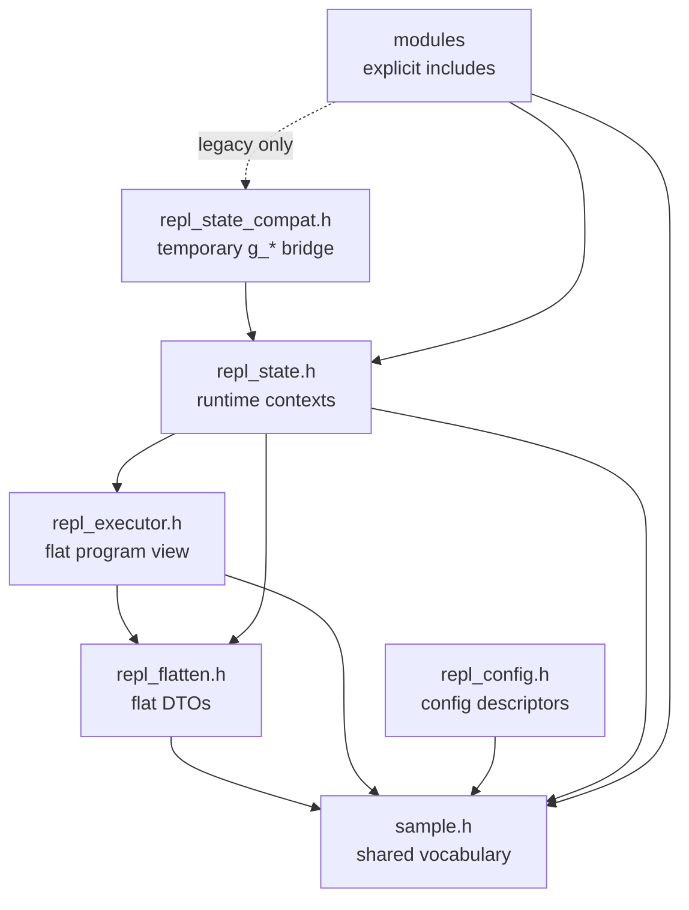

# Phase 2 State Header Design

## Status

This is the 100% design contract for the `sample.h` and `repl_state.h`
endpoint of Phase 2. It is not the implementation. It fixes the ownership
decisions that were left open in the earlier sketch and defines the target
header shapes, state contexts, compatibility strategy, and reset order.

The implementation should still land in small behavior-preserving commits. The
headers can be migrated domain by domain; no slice should combine broad state
movement with semantic changes.

## Scope

This document covers only the Phase 2 state-header boundary:

- What remains in `sample.h`.
- What moves out of `sample.h`.
- What `repl_state.h` owns.
- The exact runtime state contexts to expose.
- The focused APIs that replace broad `extern g_*` access.
- The temporary compatibility path.

It does not redesign the command language, file format, GLUT entrypoint,
sample-local structure, command store, parser, flattener, executor, UI
renderers, import/export format, or replay behavior.

## Final Decisions

1. `sample.h` becomes shared vocabulary only. It must not include
   `repl_state.h` and must not expose live mutable state.
2. `repl_state.h` owns process-wide REPL runtime contexts and focused
   accessors. It can include `sample.h`, but not the other way around.
3. `g_edit_line` becomes `ReplDocumentState.edit_line_idx`. The edited line is
   document selection, while `ReplEditorInputState.cursor_pos` is text cursor
   position inside the input buffer.
4. Source command mutations still route through `ReplCommandStore`. State owns
   storage/defaults/dirty flags, not command mutation policy.
5. Config moves from raw `int *` table entries to a `ReplConfigKey` based API.
   UI/config descriptors become immutable metadata, and actions perform
   mutations through config setters.
6. `FlatProgramView`, `ReplFlattenOptions`, and `ReplFlattenResult` are not
   runtime state. They move to pipeline headers (`repl_flatten.h` /
   `repl_executor.h`) before `repl_state.h` is considered clean.
7. `FlatCmdLocalVars` is a flat-program type. `repl_state.h` may include the
   pipeline header that defines it, but should not define it itself.
8. Lights, tessellator resources, accumulation settings, quality toggles, and
   clear color stay in `ReplRenderState` for Phase 2. A later split may extract
   `ReplLightingState`, but Phase 2 should not block on that.
9. Autocomplete cursor pixel coordinates belong to code-panel runtime state,
   not the autocomplete model. The autocomplete model owns matches, selection,
   ghost text, and hint text.
10. Workspace directory belongs to scene/workspace runtime state. Import/export
    owns pending imported metadata and workspace-header render buffers.
11. Generated scaffold strings and enum/name tables are immutable descriptors,
    not runtime state. They should become `static const` data in focused modules
    or descriptor accessors, not fields in `ReplRuntimeState`.
12. Module-private static state stays private to the owning module unless more
    than one module needs to read or mutate it. Phase 2 targets broad exposed
    global state, not every file-scope cache.

## Target Include Graph



`sample.h` sits at the bottom as shared vocabulary. State-aware modules include
`repl_state.h` directly. Legacy modules may temporarily include
`repl_state_compat.h`, but `sample.h` must never include that compatibility
header.

## `sample.h` Contract

### Responsibility

`sample.h` should define shared vocabulary that is stable across the sample:

- Command and presentation enum vocabulary that is still cross-module.
- `GLCmd`, `SceneLight`, `TessVertex`, `EnumEntry`, and `FuncCompletion`.
- Fixed capacities that affect storage, tests, or file compatibility.
- Default macros used by definitions, reset helpers, examples, and tests.
- Small stateless transform helpers used by executor and overlay/render code.

### Keep In `sample.h` For Phase 2

```c
#ifndef SAMPLE_H
#define SAMPLE_H

#include <gl_includes.h>
#include <stddef.h>
#include <stdint.h>

#include "repl_eval.h" /* For MAX_NAMES_PER_DECL until command types split. */

#define MAX_COMMANDS    (2 * 4096)
#define MAX_LINE_LEN    256
#define MAX_INPUT_LEN   1024
#define MAX_USER_SCENES 8
#define USER_SCENE_NAME_MAX 64
#define REPL_WORKSPACE_DIR_MAX 1024

#define FONT_MONO       GLUT_BITMAP_9_BY_15
#define FONT_SMALL      GLUT_BITMAP_8_BY_13
#define FONT_W          9
#define FONT_H          15
#define FONT_SMALL_W    8
#define FONT_SMALL_H    13
#define LINE_H          18
#define CODE_MARGIN_X   10
#define CODE_MARGIN_Y   8
#define STATUSBAR_H     22

#define MAX_ACCUM_SAMPLES 16
#define ACCUM_STEP_COUNT  5
#define MAX_LIGHTS        4
#define TESS_VERT_BUF_SIZE 256
#define CAM_LINE_COUNT 4
#define RENDER_STATE_LINE_COUNT 3

#define REPL_OUTLINE_POLYGON_OFFSET_FACTOR (-0.01f)
#define REPL_OUTLINE_POLYGON_OFFSET_UNITS  (-100.0f)

/* CFG_DEFAULT_* macros remain here until config descriptors own defaults. */

typedef enum GridTheme GridTheme;             /* Body can remain here. */
typedef enum AxesTheme AxesTheme;             /* Body can remain here. */
typedef enum CodePanelLayout CodePanelLayout; /* Body can remain here. */
typedef enum CmdType CmdType;                 /* Body remains here in Phase 2. */
typedef enum ReplayState ReplayState;
typedef enum ReplayMode ReplayMode;
typedef enum ProfilePanelMode ProfilePanelMode;

typedef struct GLCmd GLCmd;
typedef struct SceneLight SceneLight;
typedef struct TessVertex TessVertex;
typedef struct EnumEntry EnumEntry;
typedef struct FuncCompletion FuncCompletion;

int  is_transform_cmd(CmdType type);
void apply_transform_cmd(const GLCmd *cmd);
void apply_tracked_transform_cmd(const GLCmd *cmd, int *matrix_depth);
void unwind_tracked_transform_stack(int *matrix_depth);

#endif /* SAMPLE_H */
```

The real header can keep enum and struct bodies inline. The sketch above names
the owned concepts rather than requiring a C forward-declaration style that
anonymous enums cannot support.

### Move Out Of `sample.h`

| Current content | Target |
|-----------------|--------|
| `#include "repl_state.h"` | Remove. State-aware modules include `repl_state.h` explicitly. |
| `extern g_*` runtime state | `repl_state.h` accessors plus temporary `repl_state_compat.h`. |
| `MAX_AC_MATCHES` | `repl_autocomplete.h`, unless tests need a public limit. |
| `CfgItem` | `repl_config.h`; replace raw pointers with `ReplConfigKey`. |
| `CP_CLEAR_MAX_V` | `ui_color_picker.h` or `ui_color_picker.c`; it is color-picker policy. |
| Search row APIs | `repl_search.h` / code-panel document headers. |
| Flatten/execution APIs | `repl_flatten.h` and `repl_executor.h`. |
| Replay behavior APIs | `repl_replay.h`; `sample.h` keeps only shared replay enums if needed. |
| UI drawing helpers | `ui_draw.h` or `ui_gl.h`. |
| `set_status()` | `repl_status_set()` in `repl_state.h` or a tiny `repl_status.h`. |
| Export/import helpers | `repl_export.h`. |

## `repl_state.h` Contract

### Responsibility

`repl_state.h` exposes the process-wide runtime state contexts and focused
accessors. It should not expose broad `extern g_*` declarations after the
migration is complete.

The live runtime object is private to `repl_state.c`:

```c
/* repl_state.c */
static ReplRuntimeState g_repl_state;
```

No production module should declare that object directly.

### Access Policy

| Access form | Meaning |
|-------------|---------|
| `const ReplFooState *repl_state_foo(void)` | Read-only access for render/UI/export/tests. |
| `ReplFooState *repl_state_foo_mut(void)` | Direct mutable access for the owning module or migration bridge only. |
| `ReplFooState repl_state_foo_snapshot(void)` | Stable value capture for frame/export operations. |
| `repl_state_foo_reset()` | Domain reset that restores defaults and invariants. |
| Focused helper | Preferred mutation path for non-owner modules. |

Direct `*_mut()` calls should be rare outside the module that owns the
behavior. For example, `repl_command_store.c` can mutate document storage;
`ui_menu_bar.c` should call config/action APIs instead of mutating config
fields.

## Runtime Structs

These are the final Phase 2 context structs for `repl_state.h`. Field names are
the target names for Phase 10 naming/comment cleanup.

### Document And Flat Program

```c
typedef struct ReplDocumentState {
    GLCmd cmds[MAX_COMMANDS];
    int   cmd_count;
    int   edit_line_idx;
    int   normals_dirty;
} ReplDocumentState;

typedef struct ReplFlatProgramState {
    GLCmd            cmds[MAX_COMMANDS];
    FlatCmdLocalVars local_vars[MAX_COMMANDS];
    int              cmd_count;
    int              dirty;
    int              user_lighting_enabled;
    int              current_block_begin_idx;
    int              current_block_end_idx;
    int              current_block_source_line_idx;
} ReplFlatProgramState;
```

Mappings:

- `g_cmds` -> `document.cmds`
- `g_num_cmds` -> `document.cmd_count`
- `g_edit_line` -> `document.edit_line_idx`
- `g_normals_dirty` -> `document.normals_dirty`
- `g_flat_cmds` -> `flat_program.cmds`
- `g_num_flat_cmds` -> `flat_program.cmd_count`
- `g_flat_dirty` -> `flat_program.dirty`
- `g_flat_cmd_local_vars` -> `flat_program.local_vars`
- `g_user_lighting_enabled` -> `flat_program.user_lighting_enabled`
- `g_current_block_begin` -> `flat_program.current_block_begin_idx`
- `g_current_block_end` -> `flat_program.current_block_end_idx`
- `g_current_block_line` -> `flat_program.current_block_source_line_idx`

Behavior ownership:

- `ReplCommandStore` remains the source-command mutation boundary.
- `repl_flatten.c` owns `ReplFlatProgramState` rebuilds.
- Dirty helpers replace ad hoc `g_flat_dirty = 1` / `g_normals_dirty = 1`.

### Variables And Time

```c
typedef struct ReplVariableState {
    ExprVar vars[MAX_PREDEF_VARS];
    int     var_count;
    int     time_var_idx;
    int     time_playing;
    float   anim_time;
} ReplVariableState;
```

Mappings:

- `g_predef_vars` -> `variables.vars`
- `g_num_predef_vars` -> `variables.var_count`
- `g_t_var_idx` -> `variables.time_var_idx`
- `g_t_playing` -> `variables.time_playing`
- `g_anim_time` -> `variables.anim_time`

Behavior ownership:

- Declaration/register/undeclare behavior remains in `repl_eval.c` and
  `repl_commit.c`.
- Variable-panel dragging remains in `repl_var_drag.c`.
- Time advancement/reset should use focused helpers:
  `repl_state_time_advance(dt)` and `repl_state_time_reset_to_zero()`.

### Editor Input

```c
typedef struct ReplEditorInputState {
    char input[MAX_INPUT_LEN];
    int  input_len;
    int  cursor_pos;
    char pending_newline[MAX_INPUT_LEN];
    int  pending_newline_len;
    int  insert_mode;
} ReplEditorInputState;
```

Mappings:

- `g_input` -> `editor_input.input`
- `g_input_len` -> `editor_input.input_len`
- `g_cursor_pos` -> `editor_input.cursor_pos`
- `g_newline_buf` -> `editor_input.pending_newline`
- `g_newline_len` -> `editor_input.pending_newline_len`
- `g_inserting` -> `editor_input.insert_mode`

Behavior ownership:

- `repl_editor.c` owns keyboard routing and text cursor movement.
- Commit behavior remains in `repl_commit.c`.

### Selection And Clipboard

```c
typedef struct ReplSelectionState {
    int anchor_idx;
    int end_idx;
} ReplSelectionState;

typedef struct ReplClipboardState {
    GLCmd cmds[MAX_COMMANDS];
    int   cmd_count;
} ReplClipboardState;
```

Mappings:

- `g_sel_anchor` -> `selection.anchor_idx`
- `g_sel_end` -> `selection.end_idx`
- `g_clipboard` -> `clipboard.cmds`
- `g_clipboard_count` -> `clipboard.cmd_count`

Behavior ownership:

- `repl_clipboard.c` owns selection semantics and copy/cut/paste behavior.
- Code-panel mouse code should call selection APIs, not mutate fields.

### Code Panel And UI Runtime

```c
typedef struct ReplCodePanelRuntimeState {
    float panel_frac;
    int   resizing_panel;
    int   scroll;
    int   scroll_follow_cursor;
    int   cursor_visible;
    int   blink_tick;
    int   cursor_px;
    int   cursor_py;
} ReplCodePanelRuntimeState;

typedef struct ReplHelpState {
    int visible;
    int tab_idx;
    int scroll;
} ReplHelpState;

typedef struct ReplVariablePanelState {
    int visible;
} ReplVariablePanelState;

typedef struct ReplProfilePanelState {
    int mode;
} ReplProfilePanelState;

typedef struct ReplStatusState {
    char text[256];
    int  ttl;
} ReplStatusState;
```

Mappings:

- `g_panel_frac` -> `code_panel.panel_frac`
- `g_resizing_panel` -> `code_panel.resizing_panel`
- `g_scroll` -> `code_panel.scroll`
- `g_scroll_follow_cursor` -> `code_panel.scroll_follow_cursor`
- `g_cursor_on` -> `code_panel.cursor_visible`
- `g_blink_tick` -> `code_panel.blink_tick`
- `g_cursor_px` -> `code_panel.cursor_px`
- `g_cursor_py` -> `code_panel.cursor_py`
- `g_show_help` -> `help.visible`
- `g_help_tab` -> `help.tab_idx`
- `g_help_scroll` -> `help.scroll`
- `g_show_var_panel` -> `variable_panel.visible`
- `g_show_profile_panel` -> `profile_panel.mode`
- `g_status` -> `status.text`
- `g_status_ttl` -> `status.ttl`

Behavior ownership:

- `ui_panels.c` owns code-panel row rendering and cursor anchor publication.
- `ui_help_overlay.c`, `ui_variable_panel.c`, and `ui_profile_panel.c` render
  their specific regions.
- `repl_status_set()` replaces `set_status()` as the state API. `set_status()`
  can remain as a compatibility wrapper during migration.

### Search And Autocomplete

```c
typedef struct ReplSearchState {
    int  active;
    char query[MAX_INPUT_LEN];
    int  query_len;
    int  cursor_pos;
    int  hit_line_idx;
    int  hit_char_idx;
    int  hit_ordinal;
    int  match_count;
} ReplSearchState;

typedef struct ReplAutocompleteState {
    const char *matches[MAX_AC_MATCHES];
    int         match_count;
    int         selected_idx;
    char        ghost[MAX_LINE_LEN];
    char        hint[MAX_LINE_LEN];
} ReplAutocompleteState;
```

Mappings:

- `g_search_active` -> `search.active`
- `g_search_query` -> `search.query`
- `g_search_query_len` -> `search.query_len`
- `g_search_cursor_pos` -> `search.cursor_pos`
- `g_search_hit_line` -> `search.hit_line_idx`
- `g_search_hit_char` -> `search.hit_char_idx`
- `g_search_hit_ordinal` -> `search.hit_ordinal`
- `g_search_match_count` -> `search.match_count`
- `g_ac_matches` -> `autocomplete.matches`
- `g_ac_count` -> `autocomplete.match_count`
- `g_ac_sel` -> `autocomplete.selected_idx`
- `g_ac_ghost` -> `autocomplete.ghost`
- `g_ac_hint` -> `autocomplete.hint`

Behavior ownership:

- Search behavior remains in `repl_search.c`.
- Completion matching remains in `repl_autocomplete.c`.
- Autocomplete popup placement reads `code_panel.cursor_px/cursor_py`.

### Camera, Pointer, And Viewport

```c
typedef struct ReplCameraState {
    float rx;
    float ry;
    float dist;
    float tx;
    float ty;
    float tz;
    float motion_glow;
    int   auto_rotate;
} ReplCameraState;

typedef struct ReplPointerState {
    int mouse_x;
    int mouse_y;
    int mouse_button;
} ReplPointerState;

typedef struct ReplViewportState {
    int window_w;
    int window_h;
} ReplViewportState;
```

Mappings:

- `g_cam_rx` -> `camera.rx`
- `g_cam_ry` -> `camera.ry`
- `g_cam_dist` -> `camera.dist`
- `g_cam_tx` -> `camera.tx`
- `g_cam_ty` -> `camera.ty`
- `g_cam_tz` -> `camera.tz`
- `g_cam_motion_glow` -> `camera.motion_glow`
- `g_cam_rotate` -> `camera.auto_rotate`
- `g_mouse_x` -> `pointer.mouse_x`
- `g_mouse_y` -> `pointer.mouse_y`
- `g_mouse_btn` -> `pointer.mouse_button`
- `g_win_w` -> `viewport.window_w`
- `g_win_h` -> `viewport.window_h`

Behavior ownership:

- `repl_camera_controls.c` owns pointer-driven camera mutation.
- Camera momentum internals (`g_mouse_mods`, `g_vel_*`) stay module-private.
- Rendering consumes camera/viewport snapshots through `SceneRenderConfig` and
  `FrameRenderContext`.

### Presentation Config

```c
typedef struct ReplPresentationState {
    int wireframe;
    int grid_theme;
    int grid_major_idx;
    int grid_extent_idx;
    int axes_theme;
    int show_vertex_labels;
    int show_normal_vectors;
    int show_vertex_indices;
    int show_vertex_outlines;
    int show_vertex_points;
    int show_vertex_guides;
    int xform_guide_mode;
    int autonormal;
    int show_light_indicators;
    int backdrop_mode;
    int highlight_current_poly;
    int ortho_mode;
    int wrap_at_comma;
    int code_panel_layout;
} ReplPresentationState;
```

Mappings:

- `g_wireframe` -> `presentation.wireframe`
- `g_grid_theme` -> `presentation.grid_theme`
- `g_grid_major_idx` -> `presentation.grid_major_idx`
- `g_grid_extent_idx` -> `presentation.grid_extent_idx`
- `g_axes_theme` -> `presentation.axes_theme`
- `g_show_vnums` -> `presentation.show_vertex_labels`
- `g_show_normals` -> `presentation.show_normal_vectors`
- `g_show_indices` -> `presentation.show_vertex_indices`
- `g_show_outlines` -> `presentation.show_vertex_outlines`
- `g_show_vpoints` -> `presentation.show_vertex_points`
- `g_show_guides` -> `presentation.show_vertex_guides`
- `g_xform_guide_mode` -> `presentation.xform_guide_mode`
- `g_autonormal` -> `presentation.autonormal`
- `g_show_lights` -> `presentation.show_light_indicators`
- `g_backdrop_mode` -> `presentation.backdrop_mode`
- `g_highlight_current_poly` -> `presentation.highlight_current_poly`
- `g_ortho_mode` -> `presentation.ortho_mode`
- `g_wrap_at_comma` -> `presentation.wrap_at_comma`
- `g_code_panel_layout` -> `presentation.code_panel_layout`

Behavior ownership:

- `repl_actions.c` owns config mutations.
- Examples may reset this subset with
  `repl_state_presentation_reset_example_defaults()`.
- Camera is intentionally excluded from example-presentation reset except when
  an example supplies explicit camera metadata.

### Render Resources And Quality

```c
typedef struct ReplRenderState {
    int use_accum;
    int accum_aa_enabled;
    int accum_samples;
    float accum_jitter_x;
    float accum_jitter_y;
    int multisample_enabled;
    int line_smooth_enabled;
    int point_attenuation_enabled;
    float clear_color[4];

    GLUquadric    *quadric;
    GLUtesselator *tess;
    TessVertex     tess_verts[TESS_VERT_BUF_SIZE];
    int            tess_vert_count;
    SceneLight     lights[MAX_LIGHTS];
} ReplRenderState;

typedef struct ReplRenderDerivedState {
    float focus_vertex[3];
    int   focus_vertex_valid;
} ReplRenderDerivedState;
```

Mappings:

- `g_use_accum` -> `render.use_accum`
- `g_accum_aa_enabled` -> `render.accum_aa_enabled`
- `g_accum_samples` -> `render.accum_samples`
- `g_accum_jitter_x` -> `render.accum_jitter_x`
- `g_accum_jitter_y` -> `render.accum_jitter_y`
- `g_multisample_enabled` -> `render.multisample_enabled`
- `g_line_smooth_enabled` -> `render.line_smooth_enabled`
- `g_init_attenuate_points` -> `render.point_attenuation_enabled`
- `g_clear_color` -> `render.clear_color`
- `g_quadric` -> `render.quadric`
- `g_tess` -> `render.tess`
- `g_tess_verts` -> `render.tess_verts`
- `g_tess_vert_count` -> `render.tess_vert_count`
- `g_lights` -> `render.lights`
- `g_focus_vtx` -> `render_derived.focus_vertex`
- `g_focus_vtx_valid` -> `render_derived.focus_vertex_valid`

Behavior ownership:

- `repl_core.c` / GL init creates and destroys GL resources until that lifecycle
  moves to a dedicated render-resource module.
- `scene_lights.c` owns per-pass light setup from `render.lights`.
- `repl_executor.c` may update `user_lighting_enabled` in flat-program state
  and emit GL calls that affect render-time lighting.
- Focus-grid frame prep updates `render_derived.focus_vertex`. It is initialized
  at process start and should not be reset by `repl_state_reset_all()` unless
  that behavior is intentionally rebaselined with tests.

### Replay

```c
typedef struct ReplReplayRuntimeState {
    int   active;
    int   state;
    int   pc;
    int   mode;
    float speed;
    float accum;
    float fade_speed;
    int   src_line_idx;
    int   total_flat_cmds;
    int   expand_args;
} ReplReplayRuntimeState;
```

Mappings:

- `g_replay_active` -> `replay.active`
- `g_replay_state` -> `replay.state`
- `g_replay_pc` -> `replay.pc`
- `g_replay_mode` -> `replay.mode`
- `g_replay_speed` -> `replay.speed`
- `g_replay_accum` -> `replay.accum`
- `g_replay_fade_speed` -> `replay.fade_speed`
- `g_replay_src_line` -> `replay.src_line_idx`
- `g_replay_total_flat` -> `replay.total_flat_cmds`
- `g_replay_expand_args` -> `replay.expand_args`

Behavior ownership:

- `repl_replay.c` owns the replay state machine.
- Replay fade batches stay module-private in `repl_replay.c`; render reads them
  through existing replay APIs.

### Scenes, Examples, And Workspace

```c
typedef struct ReplSceneRuntimeState {
    int  active_example_idx;
    char workspace_dir[REPL_WORKSPACE_DIR_MAX];
} ReplSceneRuntimeState;
```

Mappings:

- `g_example_idx` -> `scenes.active_example_idx`
- `g_workspace_dir` -> `scenes.workspace_dir`

Behavior ownership:

- User-scene slots, active user-scene index, scene tick, LRU eviction, and
  inline rename state remain private to `repl_scenes.c` /
  `repl_inline_rename.c`.
- `repl_state.h` only owns the cross-module workspace/example fields that are
  currently exposed as globals.

### Variable Drag

```c
typedef struct ReplVariableDragState {
    int   var_idx;
    int   log_mode;
    float start_value;
    int   start_x;
} ReplVariableDragState;
```

Mappings:

- `g_drag_var` -> `variable_drag.var_idx`
- `g_drag_log_mode` -> `variable_drag.log_mode`
- `g_drag_start_val` -> `variable_drag.start_value`
- `g_drag_start_x` -> `variable_drag.start_x`

Behavior ownership:

- `repl_var_drag.c` owns the drag transaction and source-command writeback.
- Variable panel rendering reads this state but does not mutate it.

### Import And Export Runtime

```c
#define MAX_WORKSPACE_HEADER_LINES 48
#define WORKSPACE_HEADER_LINE_LEN  96

typedef struct ReplImportExportState {
    char workspace_header_lines[MAX_WORKSPACE_HEADER_LINES]
                               [WORKSPACE_HEADER_LINE_LEN];
    int  workspace_header_line_count;
    char render_state_lines[RENDER_STATE_LINE_COUNT][64];
    char cam_lines[CAM_LINE_COUNT][96];
    const char *export_scene_name_hint;
    char pending_scene_name[USER_SCENE_NAME_MAX];
    char pending_workspace_dir[REPL_WORKSPACE_DIR_MAX];
} ReplImportExportState;
```

Mappings:

- `g_workspace_header_lines` -> `import_export.workspace_header_lines`
- `g_workspace_header_line_count` -> `import_export.workspace_header_line_count`
- `g_render_state_lines` -> `import_export.render_state_lines`
- `g_cam_lines` -> `import_export.cam_lines`
- `g_export_scene_name_hint` -> `import_export.export_scene_name_hint`
- `g_pending_scene_name` -> `import_export.pending_scene_name`
- `g_pending_workspace_dir` -> `import_export.pending_workspace_dir`

Behavior ownership:

- Import/export behavior stays in `repl_export.c`.
- Header/footer string tables, config names, grid names, axes names, and
  scaffold descriptors become immutable module-local data or descriptor APIs.
- `g_scratch_buf` is not carried forward. Replace it with stack buffers or
  focused module-local scratch where needed.

### Complete Runtime Container

```c
typedef struct ReplRuntimeState {
    ReplDocumentState         document;
    ReplFlatProgramState      flat_program;
    ReplVariableState         variables;
    ReplEditorInputState      editor_input;
    ReplSelectionState        selection;
    ReplClipboardState        clipboard;
    ReplCodePanelRuntimeState code_panel;
    ReplHelpState             help;
    ReplVariablePanelState    variable_panel;
    ReplVariableDragState     variable_drag;
    ReplProfilePanelState     profile_panel;
    ReplStatusState           status;
    ReplSearchState           search;
    ReplAutocompleteState     autocomplete;
    ReplCameraState           camera;
    ReplPointerState          pointer;
    ReplViewportState         viewport;
    ReplPresentationState     presentation;
    ReplRenderState           render;
    ReplRenderDerivedState    render_derived;
    ReplReplayRuntimeState    replay;
    ReplSceneRuntimeState     scenes;
    ReplImportExportState     import_export;
} ReplRuntimeState;
```

## Focused State API

`repl_state.h` should expose this API shape after Phase 2. Some functions may
be implemented as inline wrappers during migration, but the names should be the
stable endpoint.

```c
void repl_state_init_defaults(void);
void repl_state_reset_all(void);

const ReplDocumentState *repl_state_document(void);
ReplDocumentState       *repl_state_document_mut(void);
void repl_state_document_reset(void);

const ReplFlatProgramState *repl_state_flat_program(void);
ReplFlatProgramState       *repl_state_flat_program_mut(void);
void repl_state_flat_program_reset(void);
void repl_state_mark_flat_dirty(void);
void repl_state_mark_normals_dirty(void);
FlatProgramView repl_state_flat_program_view(void);

const ReplVariableState *repl_state_variables(void);
ReplVariableState       *repl_state_variables_mut(void);
void repl_state_variables_reset(void);
void repl_state_time_advance(float dt);
void repl_state_time_reset_to_zero(void);

const ReplEditorInputState *repl_state_editor_input(void);
ReplEditorInputState       *repl_state_editor_input_mut(void);
void repl_state_editor_input_reset(void);

const ReplSelectionState *repl_state_selection(void);
ReplSelectionState       *repl_state_selection_mut(void);
void repl_state_selection_clear(void);

const ReplClipboardState *repl_state_clipboard(void);
ReplClipboardState       *repl_state_clipboard_mut(void);
void repl_state_clipboard_clear(void);

const ReplCodePanelRuntimeState *repl_state_code_panel(void);
ReplCodePanelRuntimeState       *repl_state_code_panel_mut(void);
void repl_state_code_panel_reset(void);

const ReplHelpState *repl_state_help(void);
ReplHelpState       *repl_state_help_mut(void);
void repl_state_help_reset(void);

const ReplVariablePanelState *repl_state_variable_panel(void);
ReplVariablePanelState       *repl_state_variable_panel_mut(void);

const ReplVariableDragState *repl_state_variable_drag(void);
ReplVariableDragState       *repl_state_variable_drag_mut(void);
void repl_state_variable_drag_reset(void);

const ReplProfilePanelState *repl_state_profile_panel(void);
ReplProfilePanelState       *repl_state_profile_panel_mut(void);

const ReplStatusState *repl_state_status(void);
void repl_status_set(const char *message);
void repl_status_clear(void);
void repl_status_tick(void);

const ReplSearchState *repl_state_search(void);
ReplSearchState       *repl_state_search_mut(void);
void repl_state_search_clear(void);

const ReplAutocompleteState *repl_state_autocomplete(void);
ReplAutocompleteState       *repl_state_autocomplete_mut(void);
void repl_state_autocomplete_clear(void);

const ReplCameraState *repl_state_camera(void);
ReplCameraState       *repl_state_camera_mut(void);
ReplCameraState        repl_state_camera_snapshot(void);
void repl_state_camera_reset_default(void);

const ReplPointerState *repl_state_pointer(void);
ReplPointerState       *repl_state_pointer_mut(void);

const ReplViewportState *repl_state_viewport(void);
ReplViewportState       *repl_state_viewport_mut(void);

const ReplPresentationState *repl_state_presentation(void);
ReplPresentationState       *repl_state_presentation_mut(void);
ReplPresentationState        repl_state_presentation_snapshot(void);
void repl_state_presentation_reset_defaults(void);
void repl_state_presentation_reset_example_defaults(void);

const ReplRenderState *repl_state_render(void);
ReplRenderState       *repl_state_render_mut(void);
void repl_state_render_reset_defaults(void);
void repl_state_render_init_resources(void);
void repl_state_render_destroy_resources(void);

const ReplRenderDerivedState *repl_state_render_derived(void);
ReplRenderDerivedState       *repl_state_render_derived_mut(void);

const ReplReplayRuntimeState *repl_state_replay(void);
ReplReplayRuntimeState       *repl_state_replay_mut(void);
void repl_state_replay_reset(void);

const ReplSceneRuntimeState *repl_state_scenes(void);
ReplSceneRuntimeState       *repl_state_scenes_mut(void);
void repl_state_workspace_set_dir(const char *dir);
const char *repl_state_workspace_dir(void);

const ReplImportExportState *repl_state_import_export(void);
ReplImportExportState       *repl_state_import_export_mut(void);
void repl_state_import_export_reset(void);
void repl_state_refresh_workspace_header_lines(void);
int  repl_state_parse_workspace_header_line(const char *line);
```

The old transitional `ReplCommandState`, `ReplEditorState`, `ReplViewState`,
`ReplUiState`, `ReplRenderState` pointer-bundle facade should be removed after
callers migrate to the concrete contexts above. If a temporary bridge is still
needed, rename those facades with a `Compat` suffix so they do not look like
the final state model.

## Config API Endpoint

`CfgItem` should move out of `sample.h` and become immutable descriptor data.
The key list below is the complete replacement for today's raw pointer table.

```c
typedef enum ReplConfigKey {
    REPL_CONFIG_MSAA = 0,
    REPL_CONFIG_LINE_SMOOTH,
    REPL_CONFIG_ACCUM_AA,
    REPL_CONFIG_WIREFRAME,
    REPL_CONFIG_POINT_ATTENUATION,
    REPL_CONFIG_AUTO_TIME,
    REPL_CONFIG_REPLAY,
    REPL_CONFIG_REPLAY_MODE,
    REPL_CONFIG_REPLAY_EXPAND,
    REPL_CONFIG_GRID_THEME,
    REPL_CONFIG_GRID_MAJOR,
    REPL_CONFIG_GRID_EXTENT,
    REPL_CONFIG_AXES_THEME,
    REPL_CONFIG_VERTEX_GUIDES,
    REPL_CONFIG_XFORM_GUIDE_MODE,
    REPL_CONFIG_LIGHT_INDICATORS,
    REPL_CONFIG_POLY_HIGHLIGHT,
    REPL_CONFIG_BACKDROP,
    REPL_CONFIG_CAMERA_ROTATE,
    REPL_CONFIG_AUTO_NORMALS,
    REPL_CONFIG_VERTEX_LABELS,
    REPL_CONFIG_NORMAL_VECTORS,
    REPL_CONFIG_VERTEX_OUTLINES,
    REPL_CONFIG_VERTEX_POINTS,
    REPL_CONFIG_VARIABLE_PANEL,
    REPL_CONFIG_CPU_PROFILE,
    REPL_CONFIG_CODE_PANEL_LAYOUT,
    REPL_CONFIG_WRAP_AT_COMMA,
    REPL_CONFIG_AUDIO_MODE,
    REPL_CONFIG_COUNT
} ReplConfigKey;

typedef struct ReplConfigItem {
    const char *label;
    int key_code;
    int is_special;
    ReplConfigKey key;
    int state_count;
    const char *const *state_names;
    int section_header;
} ReplConfigItem;

const ReplConfigItem *repl_config_items(int *count);
const ReplConfigItem *repl_config_item_at(int idx);
int  repl_config_get(ReplConfigKey key);
int  repl_config_state_count(ReplConfigKey key);
const char *repl_config_state_name(ReplConfigKey key, int value);
void repl_config_set(ReplConfigKey key, int value);
int  repl_config_cycle(ReplConfigKey key, int delta);
```

`REPL_CONFIG_AUDIO_MODE` is action-backed. It should delegate to the audio
module rather than storing audio engine internals in `ReplRuntimeState`.

## Global Inventory And Target Owners

This table maps every currently broad, non-static runtime global to its Phase 2
owner. Module-private `static g_*` variables are intentionally not listed here
unless they currently leak through headers.

| Current global(s) | Target owner |
|-------------------|--------------|
| `g_cmds`, `g_num_cmds`, `g_edit_line`, `g_normals_dirty` | `ReplDocumentState` |
| `g_flat_cmds`, `g_num_flat_cmds`, `g_flat_dirty`, `g_flat_cmd_local_vars` | `ReplFlatProgramState` |
| `g_user_lighting_enabled`, `g_current_block_begin`, `g_current_block_end` | `ReplFlatProgramState` |
| `g_predef_vars`, `g_num_predef_vars`, `g_t_var_idx`, `g_t_playing`, `g_anim_time` | `ReplVariableState` |
| `g_input`, `g_input_len`, `g_cursor_pos`, `g_newline_buf`, `g_newline_len`, `g_inserting` | `ReplEditorInputState` |
| `g_sel_anchor`, `g_sel_end` | `ReplSelectionState` |
| `g_clipboard`, `g_clipboard_count` | `ReplClipboardState` |
| `g_panel_frac`, `g_resizing_panel`, `g_scroll`, `g_scroll_follow_cursor`, `g_cursor_on`, `g_blink_tick`, `g_cursor_px`, `g_cursor_py` | `ReplCodePanelRuntimeState` |
| `g_show_help`, `g_help_tab`, `g_help_scroll` | `ReplHelpState` |
| `g_show_var_panel` | `ReplVariablePanelState` |
| `g_show_profile_panel` | `ReplProfilePanelState` |
| `g_status`, `g_status_ttl` | `ReplStatusState` |
| `g_search_active`, `g_search_query`, `g_search_query_len`, `g_search_cursor_pos`, `g_search_hit_line`, `g_search_hit_char`, `g_search_hit_ordinal`, `g_search_match_count` | `ReplSearchState` |
| `g_ac_matches`, `g_ac_count`, `g_ac_sel`, `g_ac_ghost`, `g_ac_hint` | `ReplAutocompleteState` |
| `g_cam_rx`, `g_cam_ry`, `g_cam_dist`, `g_cam_tx`, `g_cam_ty`, `g_cam_tz`, `g_cam_motion_glow`, `g_cam_rotate` | `ReplCameraState` |
| `g_mouse_x`, `g_mouse_y`, `g_mouse_btn` | `ReplPointerState` |
| `g_win_w`, `g_win_h` | `ReplViewportState` |
| `g_wireframe`, `g_grid_theme`, `g_grid_major_idx`, `g_grid_extent_idx`, `g_axes_theme`, `g_show_vnums`, `g_show_normals`, `g_show_indices`, `g_show_outlines`, `g_show_vpoints`, `g_show_guides`, `g_xform_guide_mode`, `g_autonormal`, `g_show_lights`, `g_backdrop_mode`, `g_highlight_current_poly`, `g_ortho_mode`, `g_wrap_at_comma`, `g_code_panel_layout` | `ReplPresentationState` |
| `g_use_accum`, `g_accum_aa_enabled`, `g_accum_samples`, `g_accum_jitter_x`, `g_accum_jitter_y`, `g_multisample_enabled`, `g_line_smooth_enabled`, `g_init_attenuate_points`, `g_clear_color`, `g_quadric`, `g_tess`, `g_tess_verts`, `g_tess_vert_count`, `g_lights` | `ReplRenderState` |
| `g_focus_vtx`, `g_focus_vtx_valid` | `ReplRenderDerivedState` |
| `g_replay_active`, `g_replay_state`, `g_replay_pc`, `g_replay_mode`, `g_replay_speed`, `g_replay_accum`, `g_replay_fade_speed`, `g_replay_src_line`, `g_replay_total_flat`, `g_replay_expand_args` | `ReplReplayRuntimeState` |
| `g_example_idx`, `g_workspace_dir` | `ReplSceneRuntimeState` |
| `g_drag_var`, `g_drag_log_mode`, `g_drag_start_val`, `g_drag_start_x` | `ReplVariableDragState` |
| `g_workspace_header_lines`, `g_workspace_header_line_count`, `g_render_state_lines`, `g_cam_lines`, `g_export_scene_name_hint`, `g_pending_scene_name`, `g_pending_workspace_dir` | `ReplImportExportState` |
| `g_scratch_buf` | Remove; use stack or module-local buffers. |
| `g_grid_names`, `g_grid_major_names`, `g_grid_extent_names`, `g_axes_names`, `g_grid_major_steps`, `g_grid_extents` | Immutable descriptor data and accessors, not runtime state. |
| `g_header_pre`, `g_header_post`, `g_footer_pre_init`, `g_footer_post_init` | `static const` export scaffold data, not runtime state. |
| `g_cfg_items`, `CFG_ITEM_COUNT` | `repl_config.h` descriptor API, not runtime state. |

## Module-Private State Policy

These state groups should remain private to their owning modules unless a real
cross-module reader appears:

- `repl_audio.c`: audio engine, sound handle, playlist, persisted audio file,
  pending seek/start, mute/pause/loop internals.
- `repl_camera_controls.c`: pointer modifiers and camera velocity/momentum.
- `repl_replay.c`: fade batches, replay baseline variable snapshots, replay
  saved time state.
- `repl_source_scope.c`: depth caches.
- `repl_undo.c`: undo/redo rings.
- `ui_color_picker.c`: picker HSV/alpha geometry and drag state.
- `ui_menu_bar.c`: open menu, hover row, animation timestamps.
- `ui_panels.c`: code-panel drag transaction.
- `ui_profile_panel.c`: profiler timing arrays.
- `repl_inline_rename.c`: inline rename buffer and target slot.
- `repl_scenes.c`: user-scene slots, active slot, scene tick/LRU metadata.

Keeping these private is part of the design. Phase 2 should not centralize
state just because it exists; it should centralize broad shared state that
currently leaks through shared headers.

## Reset And Initialization Order

`repl_state_reset_all()` must preserve current `repl_reset_state()` behavior and
the example/reset invariants. The required order is:

1. Reset source document through `ReplCommandStore`, not by raw array writes.
2. Reset flat-program count, dirty flag, lighting flag, current-block indices,
   and local-var snapshots.
3. Reset editor input, pending-newline buffer, insert mode, selection, and
   clipboard.
4. Reset user-scene/workspace runtime by calling the existing scene reset API;
   clear active example index.
5. Reset editor/UI transients that are not document data: scroll, follow-cursor,
   cursor blink, help state, status, variable-panel drag, menu/search overlays.
6. Reset render quality defaults: MSAA, line smoothing, accumulation AA,
   point attenuation, panel fraction, code-panel layout, wrap-at-comma.
7. Reset animation time and predefined variables with `init_predef_vars()`;
   recache the `t` variable index.
8. Clear autocomplete and search state.
9. Reset clear color and import/export generated render/camera header buffers.
10. Invalidate source-depth caches.
11. Mark flat program and normals dirty.

`repl_state_presentation_reset_example_defaults()` is narrower. It resets only
example-owned presentation settings:

- wireframe
- grid theme, grid major, grid extent
- axes theme
- vertex labels, vertex indices, normal vectors, outlines, points, guides
- transform guide mode
- light indicators
- backdrop
- camera auto-rotate

It must not reset camera position/orientation, code-panel layout, MSAA/line
quality, variable values, workspace state, search state, or undo/redo.

## Compatibility Strategy

The migration should have two compatibility phases.

### Phase A: move declarations, keep real globals

Create `repl_state_compat.h` and move the broad `extern g_*` declarations there.
Remove `#include "repl_state.h"` from `sample.h`. Any module still using globals
includes `repl_state_compat.h` explicitly. This makes dependencies visible
without changing storage yet.

### Phase B: replace storage by context fields

For each domain, move storage into `g_repl_state` and add temporary aliases only
for files not yet migrated:

```c
#define g_cmds      (repl_state_document_mut()->cmds)
#define g_num_cmds  (repl_state_document_mut()->cmd_count)
#define g_edit_line (repl_state_document_mut()->edit_line_idx)
```

Use aliases only inside `repl_state_compat.h`. Delete aliases domain by domain
as production modules switch to focused APIs.

Do not hide compatibility includes behind `sample.h`; that would recreate the
current state leak.

## 100% Design Completion Criteria

This design is complete when:

1. Every broad current global has a target owner or an explicit retirement
   path in the inventory table.
2. `sample.h` has a defined final responsibility and a removal list.
3. `repl_state.h` has concrete context structs and stable accessor names.
4. Ambiguous ownership decisions are resolved in this document.
5. Reset order and example-presentation reset scope are specified.
6. The compatibility strategy preserves reviewable migration without hiding
   globals through shared headers.

The implementation remains future work. Completion of this document should let
Phase 10 naming/comment cleanup proceed against a stable intended boundary.

## Implementation Work Remaining

1. Add the new `ReplRuntimeState` contexts to `repl_state.h` / `repl_state.c`
   alongside the existing pointer-bundle facade.
2. Move `FlatProgramView`, `ReplFlattenOptions`, and `ReplFlattenResult` to
   focused pipeline headers.
3. Add `repl_config.h` and convert config descriptors from raw pointers to
   `ReplConfigKey`.
4. Add `repl_state_compat.h`, move broad extern declarations there, and remove
   the `sample.h` -> `repl_state.h` include.
5. Migrate domains one at a time from real globals to `g_repl_state` fields.
6. Replace non-owner direct writes with focused helpers.
7. Retire `g_scratch_buf` and module/name/scaffold globals that are immutable
   descriptor data.
8. Add focused tests for state defaults, reset order, example-presentation
   reset, dirty helpers, status, autocomplete clearing, config cycling, and
   import/export metadata.
9. Run `make test-stubs TEST_JOBS=4` after each domain migration.
10. Delete compatibility aliases and the old pointer-bundle facade after all
    production callers use focused state APIs.
