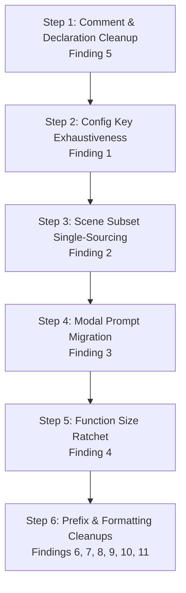

# `src/app` Clarity, Consistency & Maintainability Review

## Status - REVISED & PEER-REVIEWED (2026-08-13)

A comprehensive review of `src/app` (33 `.c` + 34 `.h`, ~24,200 lines: 22,450 in the
frame-time controller band, 1,722 in `boot/`) evaluating code clarity, naming and
architectural consistency, API ownership, duplication, comment fidelity, and
extensibility.

This document represents an independent assessment and peer-review synthesis of the
prior review draft. All findings carry verified `file:line` citations against the
current codebase.

---

## Executive Verdict

**`src/app` is architecturally sound, well-layered, and maintains clear boundaries
between the boot lifecycle and the frame-time controller.**

The module accomplishes the challenging job of acting as the application's composition
root, GLUT event router, and frame coordinator without polluting lower-level subsystems
(`src/repl`, `src/editor`, `src/ui`, `src/render3d`). The one-way dependency boundary
enforced by `check-app-boot-band` and `check-glr-ctrl-not-editor-mirror` functions as intended.

**Significant cleanup or broad architectural refactoring is NOT warranted.**
Specifically:
- **Do NOT decompose `glr_ctrl.c` across multiple files based on line count alone.** Its
  functions are linear pipelines with load-bearing ordering. Splitting them into a web of
  smaller files would obscure sequential execution and lifecycle constraints without reducing
  actual complexity.
- **Do NOT replace enum switches with dynamic function-pointer tables.** Compile-time
  exhaustiveness via `-Werror=switch` is far safer than runtime NULL dereference hazards.

The actual defects in `src/app` are concrete, localized, and cheap to resolve:
non-exhaustive enum dispatches, duplicated roster tables, comment/declaration drift from
past refactors, and minor naming inconsistencies.

---

## Review & Critique of Prior Agent's Plan

This assessment reviewed the previous plan draft, verified all claims against the live
codebase, and identified key points of agreement, nuance, and additional findings:

| Prior Finding | Live Code Verification | Verdict & Nuance |
|---|---|---|
| **#1 Config Key Dispatches** | `glr_config.c:285,345` | **Strongly Agree.** Dispatches have `default:` masking missing keys. Additionally, `glr_config_get()` handles `AUDIO_MODE` and `ACCUM_PASSES` via pre-switch `if` statements that should be integrated into the switch arms. |
| **#2 God-Function Ratchet** | `glr_ctrl.c`, `glr_actions.c` | **Partial Disagreement on Priority / Tooling.** Downgraded from **High** to **Medium**. `glr_action_menu_item_activate` (277 lines) and `glr_ctrl_init_gl` (286 lines) are simple switches and bootstrap scripts, not algorithmic god-functions like `parse_command` (289 lines). Ratchet should target `glr_ctrl_display_frame` specifically. |
| **#3 Scene Subset Roster** | `glr_actions.c:460,505`, `glr_state.c:145` | **Strongly Agree.** Four separate lists, and `tests/test_glr_actions.c:2044-2082` does *not* test roster completeness despite the header comment's claim. |
| **#4 Host/Bridge Installer Idioms** | `glr_ctrl.c:3996`, `glr_clipboard.c:243` | **Nuance / Clarification.** "Host" vs "Bridge" naming is actually architecturally meaningful (Host = app implements interface for a subsystem; Bridge = app provides adapter to REPL export). The true issue is inline statics in `glr_ctrl.c` vs dedicated TUs, and `glr_clipboard.c`'s bare `g_bridge`. |
| **#5 Modal Dispatches & Strings** | `glr_ctrl.c:2365`, `glr_actions.c:1493` | **Strongly Agree.** String formatting belongs in `glr_modal.c`, not `glr_ctrl_build_ui_snapshot`. |
| **#6 Comment / Declaration Drift** | `glr_ctrl.h`, `glr_ctrl.c`, `glr_actions.h` | **Strongly Agree & Expanded.** Verified all 7 prior cases and discovered **4 additional instances** of stale comments and orphaned declarations (detailed in Finding 5 below). |
| **#7 `splash` Prefix Anomaly** | `boot/splash.{c,h}` | **Agree.** Only module in `boot/` omitting the `glr_` prefix. |
| **#8 `glr_ctrl_open_*` Duplication** | `glr_ctrl.c:4589-4660` | **Agree.** Mechanical extraction of shared synthetic click helper. |
| **#9 `glr_audio.c` Dual Backend Docs** | `glr_audio.{c,h}` | **Agree.** Header documentation should explicitly describe the Emscripten vs miniaudio backend split. |
| **#10 `glr_tour_snapshot` Tutorial Slice** | `glr_tour_snapshot.c:73,109` | **Agree.** Direct mut accessor write-through should be replaced with symmetric capture/restore helpers. |

---

## Prioritized Findings

---

### 1. `GlrConfigKey` dispatches are non-exhaustive, and documentation understates required edits

**Priority: High**

**Location:**
- [`src/app/glr_config.h:31-82`](file:///Users/drew/src/code/openGL/samples/gen-ai/gl-repl/src/app/glr_config.h#L31-L82)
- [`src/app/glr_config.c:232-347`](file:///Users/drew/src/code/openGL/samples/gen-ai/gl-repl/src/app/glr_config.c#L232-L347)
- [`src/app/glr_actions.c:296-438`](file:///Users/drew/src/code/openGL/samples/gen-ai/gl-repl/src/app/glr_actions.c#L296-L438)
- [`.claude/skills/gl-repl-config-toggle/SKILL.md`](file:///Users/drew/src/code/openGL/samples/gen-ai/gl-repl/.claude/skills/gl-repl-config-toggle/SKILL.md)

**Problem:**
Adding a new configuration key touches multiple sites:
1. `GlrConfigKey` enum in `glr_config.h`
2. `g_cfg_items[]` descriptor table in `glr_actions.c`
3. `config_value_ptr()` write map in `glr_config.c`
4. `glr_config_get()` read map in `glr_config.c`
5. `glr_config_set()` special-case handler in `glr_config.c` (for enums, derived values, or lifecycles)
6. `k_cfg_scene_defaults[]` in `glr_actions.c` (if scene-scoped)

Both `config_value_ptr()` and `glr_config_get()` end with `default:`, so omitting a newly added enum key compiles without any `-Wswitch` warnings. A missed key compiles cleanly, renders in the menu, but silently reads 0 and fails to mutate storage.

Furthermore:
- `glr_config_get()` handles `GLR_CONFIG_AUDIO_MODE` and `GLR_CONFIG_ACCUM_PASSES` via pre-switch `if` statements (`glr_config.c:293-296`) rather than switch cases, creating structural asymmetry with `config_value_ptr()`.
- The comment at `glr_config.c:289-291` calls `glr_config_get()` the "read-side twin" of `config_value_ptr()`, but four enum keys return `NULL` in the write map while returning valid values in the read map.
- `.claude/skills/gl-repl-config-toggle/SKILL.md` opens with "The one required edit", naming only `g_cfg_items[]` in `glr_actions.c`, which actively misguides future automated and manual edits.

**Practical Cost:**
Silent feature breakage when adding configuration toggles. The UI appears to function, but values do not persist or mutate.

**Smallest Reasonable Improvement:**
1. Remove `default:` from both `switch (key)` statements in `glr_config.c`.
2. Move `GLR_CONFIG_AUDIO_MODE` and `GLR_CONFIG_ACCUM_PASSES` inside the `glr_config_get()` switch.
3. Explicitly handle `GLR_CONFIG_NONE` and `GLR_CONFIG_COUNT` in both switches.
4. Update `glr_config.h` header doc and `.claude/skills/gl-repl-config-toggle/SKILL.md` to accurately document all required modification sites.

---

### 2. Scene subset roster is duplicated across four sites with a false test coverage claim

**Priority: Medium**

**Location:**
- [`src/app/glr_actions.c:460-487`](file:///Users/drew/src/code/openGL/samples/gen-ai/gl-repl/src/app/glr_actions.c#L460-L487) (`cfg_key_in_scene_subset`)
- [`src/app/glr_actions.c:505-529`](file:///Users/drew/src/code/openGL/samples/gen-ai/gl-repl/src/app/glr_actions.c#L505-L529) (`k_cfg_scene_defaults[]`)
- [`src/app/glr_state.c:145-179`](file:///Users/drew/src/code/openGL/samples/gen-ai/gl-repl/src/app/glr_state.c#L145-L179) (`glr_state_presentation_reset_example_defaults`)
- [`src/app/glr_ctrl.c:3426-3430`](file:///Users/drew/src/code/openGL/samples/gen-ai/gl-repl/src/app/glr_ctrl.c#L3426-L3430) (`glr_ctrl_reset_example_chrome`)
- [`tests/test_glr_actions.c:2044-2082`](file:///Users/drew/src/code/openGL/samples/gen-ai/gl-repl/tests/test_glr_actions.c#L2044-L2082)

**Problem:**
The list of 22 configuration keys that belong to a scene's scope (reset on F12 example switches and saved in scene `@cfg` headers) is maintained independently in four places:
1. `cfg_key_in_scene_subset()`: 22-case switch in `glr_actions.c`
2. `k_cfg_scene_defaults[]`: 22-row struct array in `glr_actions.c`
3. `glr_state_presentation_reset_example_defaults()`: 20 field assignments in `glr_state.c`
4. `glr_ctrl_reset_example_chrome()`: 2 peer field resets (`camera_rotate`, `variable_panel`) in `glr_ctrl.c`

`glr_actions.c:499-500` claims: *"Keep it complete against cfg_key_in_scene_subset()... test_glr_actions.c pins the coverage."* In reality, `tests/test_glr_actions.c:2044-2082` only tests symbol string formatting (`"grid" == "GRID_THEME_RADAR"`), never validating roster completeness.

**Practical Cost:**
If a new scene-scoped setting is added to `cfg_key_in_scene_subset` but omitted from `glr_state_presentation_reset_example_defaults`, the setting serializes into `.glr` files but **fails to reset across F12 example switches**, leaking state across scenes.

**Smallest Reasonable Improvement:**
1. Make `k_cfg_scene_defaults[]` the authoritative roster in `glr_actions.c`.
2. Rewrite `cfg_key_in_scene_subset(key)` to simply return `cfg_scene_default_for_key(key, NULL);`.
3. Add a unit test verifying that every key in `k_cfg_scene_defaults[]` resets to its expected default after `glr_ctrl_reset_example_chrome(-1)`.

---

### 3. Modal prompt formatting and commit dispatch split across files with non-exhaustive handling

**Priority: Medium**

**Location:**
- [`src/app/glr_ctrl.c:2365-2397`](file:///Users/drew/src/code/openGL/samples/gen-ai/gl-repl/src/app/glr_ctrl.c#L2365-L2397)
- [`src/app/glr_actions.c:1498-1582`](file:///Users/drew/src/code/openGL/samples/gen-ai/gl-repl/src/app/glr_actions.c#L1498-L1582)
- [`src/app/glr_modal.h`](file:///Users/drew/src/code/openGL/samples/gen-ai/gl-repl/src/app/glr_modal.h)
- [`src/app/glr_modal.c`](file:///Users/drew/src/code/openGL/samples/gen-ai/gl-repl/src/app/glr_modal.c)

**Problem:**
Each `GlrModalKind` requires handling in two separate places outside `glr_modal.c`:
- **Commit logic:** `glr_action_modal_commit()` in `glr_actions.c` (ends with `default: return 0;`).
- **Prompt formatting:** `glr_ctrl_build_ui_snapshot()` in `glr_ctrl.c` (ends with `default: break;`).

Four of the five prompt formatting arms in `glr_ctrl.c` duplicate the exact same format string and arguments:
```c
"%s: %s_   %s%s[Enter] %s   [Esc] cancel"
```
If a new modal kind is added, reaching the `default:` in `glr_ctrl.c` causes the modal to activate and capture all keyboard input while displaying an **empty prompt message** with no instructions to the user.

**Practical Cost:**
UI snapshot building in `glr_ctrl.c` contains misplaced presentation text formatting for modals. Adding a new modal kind risks silent failure where prompt text is completely blank.

**Smallest Reasonable Improvement:**
1. Move modal prompt formatting to `glr_modal.c` behind `glr_modal_format_prompt(char *out, size_t out_sz)`.
2. Back the standard prompt strings with a compact table:
   ```c
   static const struct { GlrModalKind kind; const char *noun; const char *verb; } k_prompts[] = {
       { GLR_MODAL_WORKSPACE_NEW,       "New workspace",     "create" },
       { GLR_MODAL_WORKSPACE_SAVE_AS,   "Save workspace as", "save"   },
       { GLR_MODAL_WORKSPACE_OPEN_PATH, "Open workspace",    "open"   },
       { GLR_MODAL_SCENE_SAVE_AS,       "Save scene as",     "save"   },
   };
   ```
3. Call `glr_modal_format_prompt(snap->app_modal_message, sizeof(snap->app_modal_message))` from `glr_ctrl_build_ui_snapshot`.
4. Remove `default:` from `glr_action_modal_commit` in `glr_actions.c`.

---

### 4. Large controller functions lack formal size boundaries

**Priority: Medium**

**Location:**
- [`src/app/glr_ctrl.c:2935-3368`](file:///Users/drew/src/code/openGL/samples/gen-ai/gl-repl/src/app/glr_ctrl.c#L2935-L3368) (`glr_ctrl_display_frame`: 433 lines)
- [`src/app/glr_ctrl.c:4191-4477`](file:///Users/drew/src/code/openGL/samples/gen-ai/gl-repl/src/app/glr_ctrl.c#L4191-L4477) (`glr_ctrl_init_gl`: 286 lines)
- [`src/app/glr_ctrl.c:2246-2530`](file:///Users/drew/src/code/openGL/samples/gen-ai/gl-repl/src/app/glr_ctrl.c#L2246-L2530) (`glr_ctrl_build_ui_snapshot`: 284 lines)
- [`src/app/glr_actions.c:1585-1862`](file:///Users/drew/src/code/openGL/samples/gen-ai/gl-repl/src/app/glr_actions.c#L1585-L1862) (`glr_action_menu_item_activate`: 277 lines)
- [`src/app/glr_ctrl.c:1611-1862`](file:///Users/drew/src/code/openGL/samples/gen-ai/gl-repl/src/app/glr_ctrl.c#L1611-L1862) (`glr_ctrl_build_scene_config`: 251 lines)

**Problem:**
The project maintains a size ratchet for `src/repl` functions in `scripts/check/check-tier-c-function-size.sh` (`parse_command`: 289 lines, `flatten_range`: 89 lines). Meanwhile, `src/app` contains 5 functions that equal or exceed `parse_command` in length.

`src/app/README.md:19-25` explicitly identifies `glr_ctrl.c` bloat as a "known design pressure, not a license to add new feature behavior", yet no automated guard prevents these functions from growing larger.

**Practical Cost:**
`glr_ctrl_display_frame` orchestrates 15 sequential profiler stages with load-bearing call ordering. Without friction against adding new inline blocks, future features tend to accrete into `display_frame` rather than helper functions.

**Smallest Reasonable Improvement:**
1. Establish a size ratchet baseline for `glr_ctrl_display_frame` (433 lines) to prevent further growth.
2. If decomposing in the future, extract the self-contained panel overlay tail (`glr_ctrl.c:3228-3342`, ~115 lines from `PROF_CODE_PANEL` through `PROF_COMPOSITOR`) into `glr_ctrl_render_overlay_panels()`.

---

### 5. Comment, declaration, and include drift across 11 specific sites

**Priority: Medium**

**Location:**
1. [`src/app/glr_ctrl.h:36-45`](file:///Users/drew/src/code/openGL/samples/gen-ai/gl-repl/src/app/glr_ctrl.h#L36-L45): Doc comment for `glr_ctrl_open_color_picker` is misplaced above `glr_ctrl_set_code_panel_scroll`'s doc comment.
2. [`src/app/glr_ctrl.h:139-148`](file:///Users/drew/src/code/openGL/samples/gen-ai/gl-repl/src/app/glr_ctrl.h#L139-L148): Two duplicate doc comment blocks stacked above `glr_ctrl_build_gl_state_panel_view`.
3. [`src/app/glr_ctrl.c:965-970`](file:///Users/drew/src/code/openGL/samples/gen-ai/gl-repl/src/app/glr_ctrl.c#L965-L970): Comment above `glr_ctrl_restore_hidden_code_panel` starts mid-sentence (`/* The action\n * writes...`).
4. [`src/app/glr_ctrl.c:981-986`](file:///Users/drew/src/code/openGL/samples/gen-ai/gl-repl/src/app/glr_ctrl.c#L981-L986): Comment above `glr_ctrl_reset_transients` starts mid-sentence (`/* The body reaches...`).
5. [`src/app/glr_ctrl.c:3380-3383`](file:///Users/drew/src/code/openGL/samples/gen-ai/gl-repl/src/app/glr_ctrl.c#L3380-L3383): Stale comment `/* Idempotent app-service installer... */` sits above `k_example_tag_defaults[]`, 600 lines away from `glr_ctrl_install_app_services()`.
6. [`src/app/glr_ctrl.c:4710-4728`](file:///Users/drew/src/code/openGL/samples/gen-ai/gl-repl/src/app/glr_ctrl.c#L4710-L4728): 19-line banner `/* Router helpers: non-editor input concerns */` sits immediately above `glr_ctrl_tick()`, long after router helpers were moved to `glr_ctrl_router.c`.
7. [`src/app/glr_actions.h:110-117`](file:///Users/drew/src/code/openGL/samples/gen-ai/gl-repl/src/app/glr_actions.h#L110-L117): Doc comment for `glr_actions_apply_defaults()` is separated from its declaration by two `#define`s and another declaration.
8. [`src/app/glr_camera_export.h:23`](file:///Users/drew/src/code/openGL/samples/gen-ai/gl-repl/src/app/glr_camera_export.h#L23): Contains orphaned declaration `void glr_ctrl_view_record_external_3d_pose(float rx, float ry, float tz);` which is never defined in or called by `glr_camera_export.c` (it is defined in `glr_ctrl_view_transition.c:118` and declared in `glr_ctrl.h:493`).
9. [`src/app/glr_actions.h:45`](file:///Users/drew/src/code/openGL/samples/gen-ai/gl-repl/src/app/glr_actions.h#L45): Stale comment `GLR_FILE_ITEM_EXPORT_PLY, /* F11: capture geometry to output.ply */`. F11 is bound to `GLR_NEXT_TUTORIAL` in `keymap.h`; Export PLY has no F11 key binding.
10. [`src/app/glr_actions.h:92-108`](file:///Users/drew/src/code/openGL/samples/gen-ai/gl-repl/src/app/glr_actions.h#L92-L108): Audio menu layout comment lists `[g + AUDIO_OFF_SEP]`, `[g + AUDIO_OFF_PLAY]`, `[g + AUDIO_OFF_NEXT]`, `[g + AUDIO_OFF_PREV]`, `[g + AUDIO_OFF_LOOP]`, completely omitting `GLR_AUDIO_OFF_BACK10` and `GLR_AUDIO_OFF_FWD10` which exist in the enum.
11. [`src/app/glr_ctrl_replay_annotations.h:9`](file:///Users/drew/src/code/openGL/samples/gen-ai/gl-repl/src/app/glr_ctrl_replay_annotations.h#L9): Function declared as `void glr_publish_replay_annotations(const ReplReplayAnnotationOutput *out);` (omits `_ctrl_` prefix), despite the file being named `glr_ctrl_replay_annotations.h` and the include guard being `GLR_CTRL_REPLAY_ANNOTATIONS_H`.

**Practical Cost:**
Misleads developers navigating the codebase; orphan declarations create false dependency assumptions.

**Smallest Reasonable Improvement:**
Perform a clean sweep to delete orphaned/duplicate comments (items 2, 5, 6, 8), relocate misplaced comments (items 1, 7), update stale comments (items 9, 10), and fix incomplete sentences (items 3, 4).

---

### 6. Asymmetric and drifting function prefixes in `glr_actions.h` / `glr_actions.c`

**Priority: Medium**

**Location:**
- [`src/app/glr_actions.h`](file:///Users/drew/src/code/openGL/samples/gen-ai/gl-repl/src/app/glr_actions.h)
- [`src/app/glr_actions.c`](file:///Users/drew/src/code/openGL/samples/gen-ai/gl-repl/src/app/glr_actions.c)

**Problem:**
`glr_actions.h` exports public functions under four distinct naming prefixes:
1. `glr_actions_*`: `glr_actions_apply_defaults`, `glr_actions_install_export_cfg_bridge`, `glr_actions_set_msaa_label`, `glr_actions_apply_audio_cfg_mode`
2. `glr_action_*`: `glr_action_toggle_audio_play_pause`, `glr_action_toggle_view_mode`, `glr_action_cursor_blink_reset`, `glr_action_menu_item_activate`, `glr_action_save_active_scene`, `glr_action_open_workspace_index`, `glr_action_open_workspace_path`
3. `glr_scene_*`: `glr_scene_example_count`, `glr_scene_example_name`, `glr_scene_menu_slot_for_dense_index`, `glr_scene_load_example`, `glr_scene_load_user_slot`
4. `glr_cfg_*`: `glr_cfg_cycle_row`, `glr_cfg_handle_ascii_shortcut`, `glr_cfg_handle_special_shortcut`

`glr_actions_*` vs `glr_action_*` is pure plural/singular drift within the same header. Furthermore, having `glr_scene_*` functions live in `glr_actions.c` makes it non-obvious whether scene operations belong to `repl/scenes.c`, `app/glr_actions.c`, or `app/glr_ctrl_router.c`.

**Practical Cost:**
Developers looking for an action function cannot predict whether it begins with `glr_action_` or `glr_actions_`, and searching for scene functions leads across three separate subsystems.

**Smallest Reasonable Improvement:**
Standardize public action functions on `glr_action_*`. Clearly demarcate the `glr_scene_*` and `glr_cfg_*` helper groups in `glr_actions.h` with structured section headers explaining their role as menu-adapter shims.

---

### 7. `boot/splash` is the only module in `src/app` omitting the `glr_` prefix

**Priority: Low**

**Location:**
- [`src/app/boot/splash.h`](file:///Users/drew/src/code/openGL/samples/gen-ai/gl-repl/src/app/boot/splash.h)
- [`src/app/boot/splash.c`](file:///Users/drew/src/code/openGL/samples/gen-ai/gl-repl/src/app/boot/splash.c)

**Problem:**
`boot/splash.{c,h}` exports `splash_active()`, `splash_skip()`, `splash_render()`. Every other module in `src/app` and `src/app/boot/` uses the `glr_` prefix (`glr_cli`, `glr_boot_dumps`, `glr_init_trace`, `glr_capture_env`, `glr_frame_pacer`). The include guard in `splash.h:1` is already `GLR_SPLASH_H`.

**Practical Cost:**
Minor convention inconsistency.

**Smallest Reasonable Improvement:**
Rename to `boot/glr_splash.{c,h}` and export `glr_splash_*`. (Affects 5 call sites in `gl_repl.c` and `Makefile`).

---

### 8. Capture-affordance `glr_ctrl_open_*` helpers duplicate identical synthetic click sequences

**Priority: Low**

**Location:**
- [`src/app/glr_ctrl.c:4589-4660`](file:///Users/drew/src/code/openGL/samples/gen-ai/gl-repl/src/app/glr_ctrl.c#L4589-L4660)

**Problem:**
`glr_ctrl_open_gl_state_popup()`, `glr_ctrl_open_assign_plot()`, and `glr_ctrl_open_command_description()` duplicate the identical 6-line UI snapshot resolution and right-click event dispatch:
```c
glr_ctrl_build_ui_snapshot(&snap);
if (!ui_repl_code_panel_source_line_point(&snap, line, &x, &y))
    return 0;
glr_ctrl_scripted_passive_motion(x, y);
glr_ctrl_scripted_mouse(GLUT_RIGHT_BUTTON, GLUT_DOWN, x, y);
glr_ctrl_scripted_mouse(GLUT_RIGHT_BUTTON, GLUT_UP, x, y);
```
Comments in the code explicitly note this duplication (`:4622`: *"Same shape as glr_ctrl_open_gl_state_popup"*, `:4645`: *"Third of the same shape"*).

**Practical Cost:**
Minor code duplication; any update to the retry/coordinate mapping contract must be copied three times.

**Smallest Reasonable Improvement:**
Extract `static int glr_ctrl_right_click_source_line(int line)` returning 0 if the row is off-screen. Each public affordance calls the helper and evaluates its own predicate.

---

### 9. `glr_audio.c` contains two complete backends without top-level header documentation

**Priority: Low**

**Location:**
- [`src/app/glr_audio.h:4-36`](file:///Users/drew/src/code/openGL/samples/gen-ai/gl-repl/src/app/glr_audio.h#L4-L36)
- [`src/app/glr_audio.c:1-51,332,1036`](file:///Users/drew/src/code/openGL/samples/gen-ai/gl-repl/src/app/glr_audio.c#L1-L51)

**Problem:**
`glr_audio.c` (2,464 lines) is cleanly partitioned into two backends:
1. Emscripten Web Audio backend (`:332-1035`, ~700 lines using `EM_JS`)
2. Native miniaudio backend (`:1036-2464`, ~1,400 lines with dedicated worker thread)

However, `glr_audio.h` describes the module exclusively as a *"Thin wrapper over miniaudio"*, and `glr_audio.c`'s opening 50-line comment only describes miniaudio threading. A reader searching for web audio architecture receives no signal from the headers.

**Practical Cost:**
Discoverability barrier for developers working on the web build.

**Smallest Reasonable Improvement:**
Update `glr_audio.h` and the file banner in `glr_audio.c` to explicitly document the dual-backend architecture and line boundaries. Splitting into separate `.c` files is not recommended as both share the playlist management preamble.

---

### 10. `glr_tour_snapshot.c` handles tutorial slice via direct mutable pointer assignment

**Priority: Low**

**Location:**
- [`src/app/glr_tour_snapshot.c:73,109`](file:///Users/drew/src/code/openGL/samples/gen-ai/gl-repl/src/app/glr_tour_snapshot.c#L73)

**Problem:**
`glr_tour_snapshot.c` captures and restores 13 subsystem state slices. 12 slices use symmetric `*_capture(&s->slice)` and `*_restore(&s->slice)` APIs. The 13th (tutorial) writes directly through a mutable accessor:
```c
s->tutorial = tutorial_state_view();       /* capture */
*tutorial_state_mut() = s->tutorial;       /* restore */
```

**Practical Cost:**
Bypasses the established capture/restore encapsulation pattern maintained by the rest of the codebase.

**Smallest Reasonable Improvement:**
Add `tutorial_state_capture(TutorialRuntimeState *out)` and `tutorial_state_restore(const TutorialRuntimeState *in)` in `subsystems/tutorial/tutorial_state.h`.

---

### 11. Bridge/host static naming and inline placement in `glr_ctrl.c`

**Priority: Low**

**Location:**
- [`src/app/glr_ctrl.c:3512,3533,3894,3977,3992`](file:///Users/drew/src/code/openGL/samples/gen-ai/gl-repl/src/app/glr_ctrl.c#L3512)
- [`src/app/glr_clipboard.c:243`](file:///Users/drew/src/code/openGL/samples/gen-ai/gl-repl/src/app/glr_clipboard.c#L243)
- [`src/app/README.md`](file:///Users/drew/src/code/openGL/samples/gen-ai/gl-repl/src/app/README.md)

**Problem:**
Eleven host/bridge implementations are installed by `glr_ctrl_install_app_services()`. Five have dedicated translation units (`glr_color_picker_bridge.c`, `glr_assign_plot_bridge.c`, `glr_camera_export.c`, `glr_actions.c`, `glr_clipboard.c`), while six live inline in `glr_ctrl.c` (`g_glr_host_effects`, `g_export_projection_bridge_impl`, `g_export_light_bridge_impl`, `g_glr_var_value_source`, `g_glr_help_fkey_provider`).

In `glr_clipboard.c:243`, the bridge static is named bare `g_bridge` instead of `g_glr_clipboard_bridge`.

**Practical Cost:**
Unclear guidelines on when a new service adapter warrants a dedicated `glr_*_bridge.c` file vs inline implementation in `glr_ctrl.c`.

**Smallest Reasonable Improvement:**
1. Document the placement rule in `src/app/README.md`: *Bridges requiring nontrivial adapter logic (e.g. parsing, formatting, external dependencies) get their own `glr_*_bridge.c`; lightweight 1-line callback adapters stay inline in `glr_ctrl.c`.*
2. Rename `g_bridge` to `g_glr_clipboard_bridge` in `glr_clipboard.c`.

---

## Patterns Working Exceptionally Well

The following conventions in `src/app` are well-designed and should be maintained as standard models across the project:

1. **`glr_camera.h` Non-Obvious Call Ordering Documentation:**
   Every function with temporal constraints explicitly documents when it must or must not be called (e.g. `glr_camera_destination()` vs `glr_camera()` during transitions; `set_target_decay()` only after `ease_to()`).
2. **`glr_ctrl_router.c` Event Dispatch Sandwich:**
   Physical vs scripted input arbitration cleanly splits tour transport from shared dispatch logic, maintaining consistent behavior across user interactions and automated playback.
3. **`glr_config.h` X-Macro Ladder (`GLR_ACCUM_PASS_LADDER`):**
   Derives menu labels, sample count step tables, and startup CLI validation from a single macro definition, eliminating synchronization drift.
4. **Depth Snapshot Lifecycle (`glr_ctrl.c`):**
   Depth capture is tied to post-`glFinish` timing to avoid pipeline stalls, and cache invalidation is keyed to the editor undo generation so document resets automatically purge stale depth.
5. **Two-Band Enforcement (`check-app-boot-band`):**
   Strict one-way dependency flow (`gl_repl.c` → `boot/` → controller → subsystems) prevents runtime controller code from acquiring startup lifecycle dependencies.
6. **`glr_tour_presence.c` Self-Contained Animation State Machine:**
   Animation logic and phase transitions are driven by pure frame counters with no GL dependencies, allowing comprehensive unit testing under stub environments.

---

## Recommended Execution Plan



### Step 1: Immediate Comment & Header Cleanup (Finding 5)
- **Effort:** ~15 minutes | **Risk:** Zero
- Relocate misplaced doc comments, remove stale banners/orphans, and fix stale F11 / audio layout descriptions.

### Step 2: Config Switch Exhaustiveness (Finding 1)
- **Effort:** ~30 minutes | **Risk:** Low
- Remove `default:` from `config_value_ptr()` and `glr_config_get()`.
- Move `AUDIO_MODE` and `ACCUM_PASSES` into switch cases.
- Update `.claude/skills/gl-repl-config-toggle/SKILL.md` and `glr_config.h`.

### Step 3: Single-Source Scene Subset Defaults (Finding 2)
- **Effort:** ~20 minutes | **Risk:** Low
- Derive `cfg_key_in_scene_subset()` from `k_cfg_scene_defaults[]`.
- Add test asserting reset coverage for all 22 scene keys.

### Step 4: Encapsulate Modal Prompts (Finding 3)
- **Effort:** ~30 minutes | **Risk:** Low
- Move prompt table formatting to `glr_modal.c`.
- Remove `default:` from `glr_action_modal_commit()`.

### Step 5: Controller Frame Size Ratchet (Finding 4)
- **Effort:** ~15 minutes | **Risk:** Zero
- Add `glr_ctrl_display_frame` to function size check script.

### Step 6: Targeted Cleanups (Findings 6, 7, 8, 9, 10, 11)
- **Effort:** ~45 minutes | **Risk:** Low
- Rename `splash` → `glr_splash`, extract `glr_ctrl_right_click_source_line()`, add tutorial snapshot capture/restore helpers, standardize action prefixes, and update audio/README docs.
