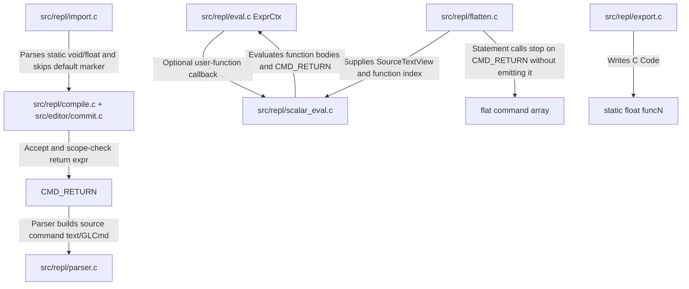

# Float-Returning REPL Functions

## Status — NOT STARTED (2026-05-23 audit)

No `CMD_RETURN` in the command model; user functions remain
`static void`-shaped at export. Stays in `not-started/`.

## Summary
Implement `return expr;` inside REPL functions and make every user function conceptually return a `float`, defaulting to `0.0f` when no explicit return is reached. Existing statement calls like `func0(...);` keep working and ignore the return value. New expression calls like `glVertex3f(func0(4), 0, 0);` and `x = func0(n);` evaluate through a scalar function evaluator. Expression-called functions are scalar-only: if evaluation reaches a GL/render/state command before returning, flatten/evaluation fails with a status error instead of silently skipping side effects.

## Key Changes
- Add `CMD_RETURN` to the command model and specs.
  - Support only `return expr;`; `return;` is out of scope for v1.
  - Treat `CMD_RETURN` as a source-level command only. It must never be emitted into the flat command array walked by `src/repl/executor.c`.
  - Wire both commit paths: the live editor `editor_try_commit_*` chain and the non-editor `repl_compile_dispatch` / `repl_load_apply_line` path. The parser may build the final `GLCmd`, but scope validation must run before parser fallback can accept a top-level return.
  - Reject top-level returns and require the enclosing open block stack to contain a `CMD_FUNC_DEF`; use an explicit source-scope helper such as `repl_source_scope_is_inside_function_at()` so `return` inside nested `if` / `for` blocks within a function is accepted.
  - Normalize as `return <expr>;`, preserve raw expression text in the editor buffer, and mark it dynamic when it references predef vars, locals, scratch arrays, or user function calls.
  - Register `CMD_RETURN` in the control-flow / keyword syntax category so code-panel highlighting matches `if` / `for` / function syntax.
  - Add `return` to reserved identifiers so it cannot be used as a variable or function alias.

- Add user-function support to expression evaluation without making `repl_eval.c` depend on document state.
  - Extend `ExprCtx` with an optional user-function callback plus user data; existing callers without the callback keep current behavior.
  - Widen expression-call argument storage from the current built-in-only `float args[2]` shape to `MAX_EXPR_VARS` so user functions can use the same parameter limit as function definitions.
  - Add a helper that detects `funcN(...)` or alias calls in expressions so parser/commit paths preserve those expressions for flatten-time evaluation instead of folding them to `0`. This helper must feed both validation and runtime-value detection; today identifier validation ignores identifiers followed by `(` and `input_has_*vars` skips them, so user-function expressions need explicit coverage in both places.
  - Extend the existing expression translators rather than treating them as new APIs. Either add focused alias helpers (`repl_eval_expr_expand_func_aliases_to_c`, `repl_eval_expr_restore_func_aliases_from_c`) and call them from export/import, or deliberately extend `repl_eval_expr_to_c` / `repl_eval_c_expr_to_repl` to also map function aliases. Pick one implementation path before coding; the lower-risk default is separate alias helpers so the math-name translator contract stays narrow.

- Add a REPL-owned scalar function evaluator.
  - New REPL module walks function bodies from source commands plus a caller-supplied `SourceTextView`, binds params as local `ExprVar`s, evaluates `if`/`for` control flow, handles nested scalar function calls, and returns the first reached `CMD_RETURN`. It must follow the `flatten.c` pattern (`ReplFlattenOptions.text` / `flatten_src_text`) and must not call editor-buffer APIs from `src/repl/`.
  - Return a structured result such as `{ ok, value, err }`, not a bare `float`. If no return is reached, report success with value `0.0f`; recursion, visit-budget, arity, undefined-function, or side-effect errors report failure and a diagnostic. Never encode an error as a successful `0.0f`.
  - Re-evaluate `CMD_RETURN` expressions with the current local/predef/scratch values whenever the function is called. A dynamic return such as `return t * 2;` must track `t` frame by frame when used in `glVertex3f(func0(), 0, 0);`.
  - Use the same recursion depth and visit-budget style as flattening; surface errors through caller-owned buffers, not `set_status`.
  - In scalar mode, reject reached non-scalar commands: GL draw/state/tessellation commands, global/scratch assignments, var declarations, statement `CMD_CALL`, `CMD_GOTO`, and `CMD_GOTO_LABEL`. Use `return funcN(...);` for nested scalar calls.

- Integrate with flattening.
  - Statement-call flattening still expands function bodies for drawing as today.
  - When flattening a statement function call, a reached `CMD_RETURN` stops expansion of that call body and resumes after the call site; the returned value is ignored and the `CMD_RETURN` is not appended to the flat array.
  - Change `flatten_range()` and its recursive callers to propagate a "return reached" signal through nested `for`, `if`, and function-call frames. A `return` reached inside a nested loop within a function must stop the loop and the current function call, not just the innermost range.
  - All flatten-time expression evaluation sites use the callback-aware evaluator: GL args, `if` conditions, `for` bounds, var assignment RHS, scratch index/RHS, and return expressions.
  - Top-level expressions that reference undefined functions fail like existing strict top-level statement calls.

## Export And Import
- Export every REPL function as `static float funcN(...)`, not `static void`.
  - Emit forward prototypes for all exported functions before definitions so recursion and mutual recursion compile in C.
  - Statement calls still emit as `funcN(...);`; C ignores the returned value.
  - `CMD_RETURN` emits `return <translated_expr>;`.
  - Always append `return 0.0f; /* @repl-default-return */` before the closing brace of each generated C function so C fallthrough is valid while preserving REPL default-return semantics. Keep the marker C89-compatible because exported files advertise C89 compilation and the exporter already rewrites line comments for C89 output.

- Make exported C use slot names, not aliases, in executable function calls.
  - Keep existing `// @func N = alias` directives for REPL round-trip.
  - When emitting `CMD_CALL` statements or expressions containing user function calls, rewrite aliases to `funcN(...)` in C output so saved code compiles.
  - On import, directives restore aliases before function/call lines are fed back into the REPL, so editor text can normalize back to alias form.

- Update import.
  - Accept both legacy `static void funcN(...)` and new `static float funcN(...)` headers.
  - Feed user-authored `return expr;` lines into the parser as `CMD_RETURN`.
  - Ignore only the generated fallback line carrying `@repl-default-return` before feeding function-body lines into `repl_load_apply_line`; do not drop user-authored `return 0;`.

## Test Plan
- Parser/commit tests:
  - `return n + 1;` parses inside `funcN` through both the live editor path and `repl_load_apply_line`, and rejects outside a function.
  - `return` is reserved for variable declarations and aliases.
  - Return expressions preserve aliases, locals, predefs, scratch reads, and nested user-function calls in editor text.
  - `return 0;` parses as a normal expression-literal return, not as a special syntax case.

- Flatten/evaluator tests:
  - `func0(n) { if(n <= 1) { return 1; } return n * func0(n - 1); }` used in `glVertex3f(func0(4), 0, 0);` flattens to `x == 24`.
  - A function with no return used in an expression evaluates to `0`.
  - A statement-called drawing function still renders/expands as before when it has no return.
  - A statement-called function stops expanding commands after a reached `return`.
  - A `return` reached inside a nested `for` or `if` inside a statement-called function propagates out of the whole function call.
  - No `CMD_RETURN` is present in the flat array after flattening.
  - A dynamic return expression using `t`, a predef variable, scratch reads, or function params re-evaluates with current values on each flatten.
  - An expression-called function whose reached path contains `glVertex3f`, `glColor3f`, assignment, scratch assignment, `goto`, a label, or statement `funcN();` fails with a clear status.
  - Recursion and mutual recursion hit the existing depth/visit-budget protections.

- Export/import tests:
  - Saved C contains `static float funcN` prototypes and definitions.
  - Explicit returns export as C `return` statements.
  - Missing returns export with `return 0.0f; /* @repl-default-return */`.
  - Reloading exported code restores user-authored returns but does not create an extra editor line for generated default returns.
  - Alias-backed functions used in expressions export executable C using `funcN(...)`, while import restores the alias directive and editor display.
  - Exported recursive and mutually recursive scalar functions compile under the normal test/export path.

- Run focused and full checks:
  - `make test_eval`
  - `make test_repl_core_parse`
  - `make test_repl_core_commit`
  - `make test_repl_core_io`
  - `make test`
  - `make test-stubs`
  - `make check-c99`

## Assumptions
- v1 supports `return expr;` only; use `return 0;` for an explicit zero return.
- No local variable declaration feature is added in this work.
- Expression-called user functions are scalar-only and side-effect-free; statement calls remain the path for drawing/procedural functions.
- All exported REPL functions become `float` functions, and statement callers intentionally ignore the result.
- `CMD_RETURN` is never an executable GL command; it is source/control-flow metadata consumed by flatten/scalar evaluation/export.

## 6. Effort Evaluation (Appendix)

This section contains a comprehensive analysis and effort evaluation for implementing this plan.

### 6.1 Architectural Overview & Planned Changes

To support `return expr;` inside REPL functions and evaluate user-defined functions dynamically within expressions, we need to modify several core components of the compiler, parser, evaluator, and import/export pipelines:

### 6.2 File-by-File Impact Assessment

Here is a list of all files that must be created or modified, along with the estimated Lines of Code (LOC) additions/deletions:

| File | Target Reference | Role / Necessary Modifications | Est. Lines Changed | Complexity |
| :--- | :--- | :--- | :---: | :---: |
| **`src/repl/command.h`** | [command.h](file:///Users/drew/src/code/openGL/samples/gen-ai/gl-repl-worktree/src/repl/command.h) | Add `CMD_RETURN` to `CmdType` enum. | +5 / -0 | Low |
| **`src/repl/command_spec.c`** | [command_spec.c](file:///Users/drew/src/code/openGL/samples/gen-ai/gl-repl-worktree/src/repl/command_spec.c) | Register `CMD_RETURN` command spec metadata, F1 help text, and the control-flow / keyword syntax category. | +15 / -0 | Low |
| **`src/repl/source_scope.h` / `.c`** | [source_scope.h](file:///Users/drew/src/code/openGL/samples/gen-ai/gl-repl-worktree/src/repl/source_scope.h) | Implement a new query `repl_source_scope_is_inside_function_at()` to determine if a line has a function block open in its enclosing stack. | +25 / -0 | Low |
| **`src/repl/parser.h` / `.c`** | [parser.h](file:///Users/drew/src/code/openGL/samples/gen-ai/gl-repl-worktree/src/repl/parser.h) | Parse `return expr;` into `CMD_RETURN`, preserve expression source text, mark dynamic returns, and validate user-function calls in expressions when `strict_refs` is active. Parser diagnostics still flow through `ReplParseContext.err_buf`. | +90 / -10 | Medium |
| **`src/repl/eval.h` / `.c`** | [eval.h](file:///Users/drew/src/code/openGL/samples/gen-ai/gl-repl-worktree/src/repl/eval.h) | Define `ExprUserFuncCallback` and extend `ExprCtx`. Widen built-in call arg storage from the current `float args[2]` to `MAX_EXPR_VARS`. Resolve custom functions in expressions and forward calls to the callback. Add user-function-aware validation/runtime-reference detection. Add focused alias rewrite helpers, or explicitly extend the existing `repl_eval_expr_to_c` / `repl_eval_c_expr_to_repl` translators. | +140 / -20 | High |
| **`src/repl/text_helpers.h` / `.c`** | [text_helpers.h](file:///Users/drew/src/code/openGL/samples/gen-ai/gl-repl-worktree/src/repl/text_helpers.h) | Extend `parse_expr_list_exact` or introduce `parse_expr_list_exact_cb` to forward user-function callback parameters. | +20 / -5 | Low |
| **`src/repl/compile.c`** | [compile.c](file:///Users/drew/src/code/openGL/samples/gen-ai/gl-repl-worktree/src/repl/compile.c) | Add a pure `return` compile validator for the loader / non-editor path, using the source-scope helper to reject returns outside a function. Add `return` to reserved identifier handling via eval/alias checks. | +50 / -0 | Medium |
| **`src/editor/commit.c` / `.h`** | [commit.c](file:///Users/drew/src/code/openGL/samples/gen-ai/gl-repl-worktree/src/editor/commit.c) | Add the live-editor `editor_try_commit_return` wrapper or route `return` through an existing statement chain so semicolon, Enter, and `editor_feed_line` paths all accept it before generic parser fallback. | +45 / -0 | Medium |
| **`src/repl/scalar_eval.h` / `.c`** | *(New Files)* | **New Module:** Walk function bodies using source commands plus `SourceTextView`, bind parameters, evaluate loop and conditional control-flow, recurse nested scalar calls, propagate return out of nested loops/ifs, reject side effects (`GL`, assignments, declarations, statement calls, goto/labels), enforce depth/visit budgets, and return `{ ok, value, err }`. | +260 / -0 | High |
| **`src/repl/flatten.c`** | [flatten.c](file:///Users/drew/src/code/openGL/samples/gen-ai/gl-repl-worktree/src/repl/flatten.c) | Integrate `scalar_eval` callback into expression evaluation. Modify `flatten_range`, `flatten_for_loop`, `flatten_call`, and `flatten_if_block` to propagate a return-reached flag without appending `CMD_RETURN` to the flat command stream. | +120 / -15 | High |
| **`src/repl/export.c`** | [export.c](file:///Users/drew/src/code/openGL/samples/gen-ai/gl-repl-worktree/src/repl/export.c) | Format exported function headers as `static float funcN`; emit forward prototypes; rewrite alias calls to slot names in statements and expressions; translate `CMD_RETURN`; append the C89-compatible fallback `return 0.0f; /* @repl-default-return */`. | +90 / -10 | Medium |
| **`src/repl/import.c`** | [import.c](file:///Users/drew/src/code/openGL/samples/gen-ai/gl-repl-worktree/src/repl/import.c) | Accept both `static void` and `static float` headers. Feed user-authored returns into the loader. Skip only generated default-return marker lines before `repl_load_apply_line`. Restore aliases before function/call lines are parsed. | +55 / -5 | Medium |
| **Total** | | | **~825 LOC** | **Medium-High** |

### 6.3 Day-by-Day Implementation Phase Breakdown

The total effort is estimated at **7 to 10 Developer Days**. Below is the suggested implementation schedule:

#### Day 1: Grammar, Parser & Compiler Setup
* **Goal**: Enable the REPL to recognize the `return expr;` statement.
* **Actions**:
  1. Add `CMD_RETURN` to `command.h` and its specifications to `command_spec.c`, including the control-flow syntax category.
  2. Implement block checking helper `repl_source_scope_is_inside_function_at()`.
  3. Modify `parser.c` to match `return expr;`, creating a `CMD_RETURN` structure and preserving expression text.
  4. Write compile checks in `compile.c` to reject `return` statements outside functions.
  5. Validate that `return` is a reserved identifier.
  6. Add the live editor commit wrapper / dispatch slot so `return` works through semicolon, Enter, and `editor_feed_line`.

#### Day 2: Expression Context Extension
* **Goal**: Upgrade the math evaluator to parse and dispatch user-defined functions in expressions.
* **Actions**:
  1. Extend `ExprCtx` with the user function callback and user data fields.
  2. Modify `eval_primary` in `eval.c` to parse arguments into an array sized `MAX_EXPR_VARS`.
  3. If a parsed identifier is a custom function name or alias followed by `(`, route it through the callback.
  4. Implement `parse_expr_list_exact_cb` to forward callbacks.
  5. Update identifier validation and runtime-value detection so user-function calls are known, dynamic expressions instead of ignored `ident(` tokens.
  6. Add focused alias expression rewrite helpers, or deliberately extend the existing math translators with alias handling.

#### Day 3: Scalar Function Evaluator Module
* **Goal**: Build a secure, side-effect-free interpreter to run user function bodies during expression flattening.
* **Actions**:
  1. Create `scalar_eval.h` and `scalar_eval.c`.
  2. Implement `repl_scalar_eval_function()` over source commands plus caller-owned `SourceTextView`; no editor-buffer access from `src/repl/`.
  3. Walk target function commands, unroll loops (`CMD_FOR_BEGIN`), evaluate branches (`CMD_IF_BEGIN`), and propagate return out of nested loops/ifs.
  4. Add strict validation to reject drawing commands (`glVertex`, `glColor`), state changes (`glEnable`), global assignments, scratch assignments, var declarations, statement calls, goto, and labels.
  5. Enforce recursion depth and visit budgets to prevent hang/crash scenarios.
  6. Return a structured success/error result, with fallthrough as successful `0.0f`.

#### Day 4: Integration with Flattening & Execution
* **Goal**: Wire up the scalar evaluator to the flattening phase.
* **Actions**:
  1. Set up the `user_func_cb` callback pointing to the scalar evaluator in all flatten-time `repl_eval_expr` call sites (variables, index lookups, condition checks).
  2. Adjust `flatten_range()` and its recursive callers to return an execution-halt flag on `CMD_RETURN` to immediately exit the current function statement expansion frame.
  3. Ensure `CMD_RETURN` is never appended to the flat command array.
  4. Test rendering and geometry generation with nested expressions.

#### Day 5: Export / Import Translation Parity
* **Goal**: Ensure that REPL scenes containing return statements can be exported to C and re-imported seamlessly.
* **Actions**:
  1. Update `export.c` to write forward function prototypes and export definitions as `static float funcN(...)`.
  2. Write alias-rewriting rules using the chosen alias helper/translator path.
  3. Always append `return 0.0f; /* @repl-default-return */` before function closing braces in the exported file.
  4. Update `import.c` to handle `static float` headers, feed user returns, and discard generated default returns.

#### Day 6: Test Suite and Portability Verification
* **Goal**: Validate correctness, verify portability, and fix regressions.
* **Actions**:
  1. Write detailed tests in `tests/test_eval.c` for custom function evaluation (including recursion, bounds checks, parameter bindings).
  2. Write compiler and parser tests in `tests/test_repl_compile.c` and `tests/test_repl_core_parse.c`.
  3. Add round-trip tests to `tests/test_repl_core_io.c`.
  4. Add flatten tests for no-flat-`CMD_RETURN`, return propagation out of nested loops/ifs, dynamic `t` returns, and side-effect rejection.

#### Day 7: Full Verification
* **Goal**: Run the normal and portability gates after integration.
* **Actions**:
  1. Run the focused tests listed above.
  2. Run `make test` and `make test-stubs`.
  3. For portability-sensitive changes, execute `make check-c99` and sync+test under GCC on Ubuntu (`make test-stubs` / `make check-c99` via `ssh gracemont`).

### 6.4 Key Risks and Mitigation Strategies

* **Infinite Recursion / Call Loop**:
  * *Risk*: A recursive function like `func0(n) { return func0(n); }` could crash the program with a stack overflow or freeze the frame loop.
  * *Mitigation*: The scalar evaluator must carry a `recursion_depth` (bounded by `max_call_depth`) and a `visit_budget` (decremented per command processed). If limits are exceeded, evaluation halts, writes a formatted diagnostic, and returns an error result. Do not return a successful `0.0f` for errors because fallthrough already uses `0.0f`.
* **State Pollution via Side Effects**:
  * *Risk*: Expressions are expected to be pure and side-effect-free, but a function evaluated inside an expression might write to scratch arrays (`A[0] = 5;`) or modify state.
  * *Mitigation*: The scalar evaluator will explicitly reject `CMD_VAR_ASSIGN`, `CMD_SCRATCH_ASSIGN`, `CMD_VAR_DECLARE`, GL-drawing/state operations, statement `CMD_CALL`, `CMD_GOTO`, and `CMD_GOTO_LABEL`. Statement-called functions will continue to be expanded as today, allowing state changes until they reach `return`.
* **Alias Name Collisions**:
  * *Risk*: A user function alias might shadow built-in functions or constants (e.g. naming a function `sin` or `PI`).
  * *Mitigation*: Ensure `repl_func_alias_name_is_valid()` rejects reserved words, constants, and built-ins.
* **Return Propagation Drift**:
  * *Risk*: `flatten_range()` starts returning a signal, but one recursive caller ignores it and continues after a reached `return`.
  * *Mitigation*: Update `flatten_range`, `flatten_for_loop`, `flatten_if_block`, and `flatten_call` together, and add tests where `return` sits inside nested loops and conditionals.
* **C89 Export Drift**:
  * *Risk*: The generated default-return marker uses `//`, conflicting with the exported file's C89 compile contract.
  * *Mitigation*: Emit the marker as `/* @repl-default-return */` and make import detect that token regardless of block-comment normalization.

### 6.5 Design Decisions & Assumptions (Confirmed)

* **No Local Variables**: Functions will only use parameter bindings as local variables. No local variable declarations inside user functions are supported in this phase.
* **Float-returning Only**: Every user function conceptually returns a `float` (defaulting to `0.0f` on fallthrough). Statement calls will invoke the functions and discard the returned float.
* **Shared Limits**: The scalar evaluator will reuse the existing recursion depth limits (`max_call_depth`) and visit budgets from the flattening context to avoid duplicate configurations.
* **Scalar-only & Pure**: User functions called in expressions are strictly evaluated as scalar-only and side-effect-free. Any GL drawing, state change, declaration, or assignment within the evaluated path will trigger an error.
* **Source View Boundary**: New REPL modules read source text through `SourceTextView` passed by their caller. They do not call editor-buffer APIs directly.
* **Return Literal Is Ordinary**: `return 0;` is a valid `return expr;` using the literal expression `0`, not a separate grammar branch.
