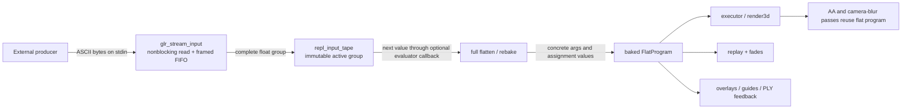

# Streamed Numeric Input

## Status - NOT STARTED (2026-07-25)

Design drafted; no implementation commits have landed. This plan belongs in
`not-started/` until the first implementation change is made, then moves to
`plans/active/`.

## Summary

Add an opt-in native stdin transport and a reserved REPL expression atom named
`input`. An external process writes framed groups of floats to `gl-repl`.
Each complete group is latched as an immutable input tape, and each evaluation
of `input` during flattening returns the next value from that tape.

The resulting flat program contains only ordinary commands with concrete,
baked float arguments. It contains no stream reads and no `input` operations.
That is the load-bearing design choice:

- accumulation AA executes the same baked geometry for every jitter sample;
- replay and replay fades walk the same deterministic flat commands;
- loop expansion consumes one or more values per expanded iteration;
- variable and scratch assignments are resolved in normal flat-stream order;
- animation-time blur may rebake at different `t` values, but rewinds and
  reuses the same immutable tape for each sub-sample.

The initial native interface is:

```bash
producer | ./gl-repl --stream-input scene.c
```

Example stream:

```text
[0.1, 0.2, 0.3]
[0.4, 0.5, 0.6]
```

Example scene:

```c
glBegin(GL_LINES);
glVertex3f(input, input, input);
glVertex3f(input, input, input);
glEnd();
```

The first group bakes to the equivalent of:

```c
glVertex3f(0.1, 0.2, 0.3);
glVertex3f(0.4, 0.5, 0.6);
```

## Goals

1. Let a native external process drive REPL numeric expressions through a
   simple text pipe with no socket, plugin, or GL integration requirement.
2. Preserve the current two-level command model: source remains symbolic;
   the flat program remains self-contained and executable without evaluator or
   transport access.
3. Make a complete delimited group the atomic unit of visual change. A partial
   pipe write must never produce partially updated geometry.
4. Give `input` deterministic, left-to-right consumption semantics across GL
   arguments, assignments, loops, conditionals, and function expansion.
5. Keep accumulation AA, camera blur, animation-time blur, replay, fade
   batches, overlays, feedback capture, and other flat-array consumers on the
   existing baked-command path.
6. Keep transport I/O out of `src/repl/`. The REPL layer owns tape semantics;
   the application layer owns file descriptors, nonblocking reads, framing,
   queueing, and lifecycle.
7. Preserve save/import round-tripping for scenes containing `input`, even
   though a standalone exported C file has no live REPL pipe in v1.

## Non-goals

- Arbitrary text commands over stdin. The stream contains floats and framing
  only; it is not a second editor or command protocol.
- Bidirectional IPC, acknowledgements, producer discovery, or process
  management.
- Named pipes, sockets, UDP, MIDI, serial devices, or WebSockets in v1. They
  may later feed the same transport-independent tape API.
- A Web/Emscripten stdin implementation in v1. The web build rejects
  `--stream-input` clearly; a future JavaScript or WebSocket bridge can publish
  groups through the same REPL API.
- Persistent input history in undo, user-scene snapshots, recovery files, or
  workspace metadata. Input groups are ephemeral process data.
- Making declaration initializers execute every frame. Existing declaration
  semantics remain commit-time initialization.
- Preserving live stream behavior in standalone exported C in v1. Exported C
  uses a documented zero-valued placeholder while retaining an importable
  representation of `input`.
- Eliminating full flattening for new groups. A group may change loop counts,
  selected `if` arms, and function-call bindings, so activation deliberately
  requests a full flatten.

## User-Facing Semantics

### The `input` expression atom

`input` is a reserved, zero-argument expression atom. It is not a variable,
function, command, or new `CmdType`.

Each value-producing evaluation of `input` returns the current tape value and
advances the tape cursor by one. Consumption follows the evaluator's existing
left-to-right order. This includes multiple occurrences inside one expression:

```c
glVertex3f(input, input, input);
A[0] = input + input;
```

The first line consumes three values in x/y/z order. The second consumes two
values and adds them. The expression engine already evaluates boolean
operators without short-circuiting; `input` follows that existing rule, so
both sides of `&&` and `||` consume if they contain `input`.

`input` must be added to the reserved-identifier set. These are rejected:

```c
float input;
func0(input) { }
```

An alias named `input` is rejected for the same reason.

### Loops, branches, and calls

Consumption follows the actual flatten traversal, after loops are expanded,
conditions are selected, and function calls are entered:

```c
float height;

for(i, 0, 10) {
  height = input;
  glVertex2f(i, height);
}
```

This consumes ten values. An inactive `if` arm and an uncalled function body
consume nothing. A function called twice consumes from its body twice.

`input` is allowed in structural expressions such as loop bounds, conditions,
and call arguments:

```c
for(i, 0, input) { ... }
if(input > 0) { ... }
func0(input);
```

Those forms make later consumption data-dependent, but remain deterministic
for one immutable tape. The external producer is responsible for sending the
correct number of values for the path its earlier values select.

### Declarations

This does **not** continuously consume input:

```c
float height = input;
```

Declarations are evaluated and canonicalized at commit/load time and their
`CMD_VAR_DECLARE` rows are source-only no-ops during flatten. To prevent a
scene that appears valid but silently freezes at its initial value, v1 rejects
`input` in a declaration initializer with a focused diagnostic:

```text
input is not allowed in declarations; declare the variable, then assign it
```

The streaming form is:

```c
float height;
height = input;
```

Imported `static float` declarations follow the same rule after translation.

### Behavior without an active group

The token remains syntactically valid whether or not `--stream-input` is
present, so a saved streaming scene can load before transport setup.

- With `--stream-input`, a source program that references `input` waits for
  the first complete group. Chrome and the editor render normally; the scene
  keeps its prior valid flat program, or remains empty on initial launch.
- Without `--stream-input`, an attempted flatten containing `input` fails with
  `input: no active group` rather than silently treating it as a variable or
  baking zero.
- A source program with no `input` references starts normally even when the
  option is present.

### End of stream

EOF closes the transport but does not clear the scene. The most recently
published flat program remains visible and interactive. The status surface
reports that the stream ended. Closing stdin is not an application quit
request.

## Wire Protocol

### Grammar

V1 uses ASCII brackets for group framing and commas or ASCII whitespace as
value delimiters:

```text
stream := ignored* group*
group  := '[' separators* (float separators+)* float? separators* ']'
separators := comma | ASCII whitespace
```

`float` is parsed with `strtof` under the C locale behavior already used by
the evaluator. Decimal and scientific notation, signs, `NAN`, and `INFINITY`
follow `strtof`; hexadecimal floats are not promised as public protocol even
if a host libc happens to accept them.

Examples:

```text
[1,2,3]
[ 1.0  2.0  3.0 ]
[
  -1.5e-2,
  4,
  8.25
]
```

### Synchronization and recovery

- Bytes before the first `[` are discarded. This lets a consumer attach to a
  noisy or already-running producer and synchronize at a boundary.
- `[` while already inside a group abandons the partial group and starts a new
  one. It is an explicit resynchronization marker, not nesting.
- `]` outside a group is ignored.
- Invalid non-separator text inside a group rejects that partial group and
  returns to the seek-`[` state.
- Framing and float tokens may cross arbitrary `read()` chunk boundaries.
- An empty `[]` group is valid only for a program whose flatten consumes zero
  inputs; otherwise it fails the normal underflow check.

### Limits

Introduce named, documented caps rather than unbounded allocation:

```c
#define GLR_STREAM_GROUP_QUEUE_CAP 4
#define GLR_STREAM_GROUP_VALUE_CAP 262144
#define GLR_STREAM_READ_BUF_SIZE 4096
```

The exact values may be adjusted after a memory/benchmark pass, but their
roles must stay separate:

- value cap bounds one group independently of `MAX_FLAT_COMMANDS` because one
  command can contain many expression slots and structural expressions also
  consume values;
- queue cap bounds latency and memory;
- read buffer bounds each nonblocking syscall and retains any unparsed suffix
  when the complete-group queue becomes full.

A group exceeding the value cap is discarded until the next `[`, with a
single status/error count update rather than one message per byte.

### Backpressure and ordering

V1 is lossless FIFO, not newest-value-wins:

1. Complete groups enter a bounded four-slot FIFO.
2. At most one group is activated per displayed frame when the live source
   references `input` and replay is inactive. Otherwise complete groups remain
   queued and eventually backpressure the producer.
3. When the FIFO is full, the application stops reading stdin. Any unread
   suffix from the last read stays in the application read buffer.
4. The operating-system pipe eventually fills and backpressures the producer.

This makes group order observable and testable. A later `--stream-policy
latest` mode may discard old groups for low-latency sensor visualization, but
it is not part of v1.

## Core Invariants

1. **No I/O below the app layer.** Expression evaluation reads only a supplied
   immutable tape cursor; it never calls `read`, `poll`, `select`, or `fcntl`.
2. **One group, one atomic flat-program publication.** Partial or invalid
   groups cannot alter live geometry.
3. **No `input` in the flat array.** Every emitted GL/state/assignment command
   carries concrete values in `args[]` or its existing payload.
4. **No dependency-analysis consumption.** Cache compilation, identifier
   validation, commit-time parsing, dependency-only evaluation, autocomplete,
   guides, export scans, and source diagnostics never advance a tape.
5. **A refresh is rewindable.** Every full flatten or in-place rebake starts
   with tape cursor zero. A failed rebake followed by a full-flatten fallback
   rewinds again before the fallback.
6. **Multipass stability.** AA and camera blur execute the already-baked
   program. Animation-time blur may evaluate expressions again, but each
   sub-sample starts at tape index zero and never reads the transport.
7. **Replay pins geometry.** No queued group is activated while replay is
   active. The transport may fill its bounded queue and then backpressure the
   producer.
8. **Existing source/state ordering remains authoritative.** Scalar and
   scratch assignments consume and bake in the same flatten order they use
   today; the executor re-applies only those baked values.
9. **Transport state is ephemeral.** It is not included in undo, scene,
   workspace, recovery, or tour snapshots.

## Pipeline Design



### Why consumption occurs during flattening

The current executor deliberately does not evaluate expression text. Flatten
evaluates variable-bearing command arguments with loop/function bindings live,
stores concrete values in each flat command, and the executor consumes those
values untouched. Assignments follow the same rule to avoid double-applying
self-referential updates.

That means `input` belongs at the expression/flatten boundary, not in
`executor.c`. Baking into the source `GLCmd` would be incorrect because one
source loop-body command may expand into many flat commands, each of which
must receive different values.

### Tape API

Add a REPL-owned, transport-independent module:

```text
src/repl/input_tape.h
src/repl/input_tape.c
```

Its public surface should be small and typed. Representative shape:

```c
typedef struct {
    const float *values;
    int value_count;
    int cursor;
    int underflow;
} ReplInputTapeCursor;

void repl_input_tape_publish(const float *values, int count,
                             unsigned long generation);
int  repl_input_tape_active(void);
unsigned long repl_input_tape_source_generation(void);
void repl_input_tape_cursor_begin(ReplInputTapeCursor *cursor);
int  repl_input_tape_cursor_next(void *user_data, float *value_out);
```

Names and exact ownership may change during implementation, but preserve these
properties:

- publication copies or transfers a completed group atomically;
- cursors reference immutable active values;
- each flatten/rebake receives its own cursor;
- underflow is recorded on the cursor and returned as a structured flatten
  failure;
- dependency-only passes receive no value-producing callback;
- the active tape survives until another complete group is published;
- queueing stays app-owned rather than leaking file-descriptor policy into the
  REPL.

The active tape is ephemeral, like the live expression cache. Document why it
is intentionally outside `ReplRuntimeState` snapshots, or add a dedicated
ephemeral slice if ownership guards make that clearer. Do not silently include
potentially megabytes of producer data in undo or scene snapshots.

### Expression callback

Extend both evaluator paths with an optional input callback:

```c
typedef int (*ReplExprInputNextFn)(void *user_data, float *value_out);
```

Append the callback and user data to `ExprCtx` so existing positional C99
initializers remain source-compatible. Add the same pair to
`ReplExprEvalEnv` for compiled programs.

Text evaluation changes:

- `eval_primary()` recognizes the exact bare identifier `input` before normal
  local/predef resolution;
- when a callback is installed, it requests the next value;
- when none is installed, value evaluation records a missing-input error and
  yields a harmless `0.0f` only as the evaluator's total-function fallback;
  the enclosing compile/flatten result must still fail;
- `input(...)` remains invalid; this is an atom, not a builtin call.

Compiled evaluation changes:

- add `EXPR_OP_INPUT` beside `EXPR_OP_CONST`, `EXPR_OP_VAR`, and
  `EXPR_OP_SCRATCH`;
- compile the bare token directly to that opcode;
- execute it through the optional callback;
- mark programs containing it with `has_input`, analogous to
  `has_scratch_read`, so structural dependency and diagnostics can be
  conservative without reparsing text.

Do not model `input` as a hidden predefined variable. A predef read is stable
within one expression evaluation, while repeated `input` reads must advance.
It also would consume one of the fixed 32 predef slots and confuse dependency
masks, declarations, variable-panel state, snapshots, and export.

### Dynamic-expression and validation integration

Update the shared identifier/runtime-value predicates so `input`:

- validates as a known expression atom;
- makes a command `has_vars=1`, ensuring flatten re-evaluates it rather than
  appending its commit-time placeholder args verbatim;
- counts as a runtime value in command arguments, assignment RHS/index,
  conditions, loop headers, and function call arguments;
- is a reserved declaration and alias name;
- can be found by a cached whole-source `source_uses_input` query.

Do not add `input` to `ReplExprDepMask`. All 32 bits are already meaningful as
predef slots, and group activation directly requests a full dirty refresh.
For a structural compiled program containing input, return conservative
all-predef dependencies or mark the live flat program non-rebakeable for
unrelated value changes. The implementation must ensure a `t` rebake cannot
skip a structural input read and shift later tape positions.

The simplest correct rule is:

- any structural expression containing `input` makes the flat program
  require a full flatten for every later relevant predef change;
- value-only `input` expressions remain eligible for rebake, provided the tape
  cursor is rewound before the rebake walk.

### Full-flatten and rebake transaction boundaries

Add the tape cursor to `ReplFlattenOptions` and `ReplRebakeOptions`, or to an
equivalent explicit evaluation-services struct used by both. Temporary
flatten callers that do not want stream values pass `NULL`.

At every refresh attempt:

1. construct a fresh cursor over the active tape;
2. run full flatten or rebake;
3. reject the result if the cursor underflowed;
4. on the base group-activation refresh, also reject if values remain unused;
5. if rebake fails and falls back to full flatten, construct another cursor at
   zero before the fallback;
6. publish the new flat commands only after the whole transaction succeeds.

Cold-cache flattening currently evaluates expression values and then may run a
compiled dependency-only pass over the same expression. The dependency pass
must use a no-consume environment. It may return dependency metadata and a
dummy value, but must never call the tape callback.

### Atomic flat-program publication

An underflow discovered late in a loop must not leave half of the live flat
array updated. Use the existing reusable `repl_flatten_program()` shape to
flatten a newly activated group into staging commands/local snapshots, then
publish the count, commands, provenance, dependency state, and assignment
post-state together.

The transaction must account for flatten-time predef/scratch mutations:

1. snapshot the starting predef and scratch values;
2. flatten into staging storage;
3. capture the successful post-flatten values;
4. restore the starting values on failure;
5. on success, copy/swap the staged flat program into live state and install
   the post-flatten values according to the current frame-state contract.

Prefer a reusable heap/statically allocated staging buffer over large stack
arrays. Include it in memory-profile accounting. Do not double the permanent
flat capacity silently without documenting the memory cost.

Source edits that are unrelated to a newly activated group continue through
the ordinary refresh path. If such an edit introduces `input` while no active
tape exists, retain the previous valid flat program and surface the waiting or
missing-input status; do not publish a program that only reflects part of the
new source.

## Application Transport

Add:

```text
src/app/glr_stream_input.h
src/app/glr_stream_input.c
```

This module owns:

- enabling/disabling the feature from CLI options;
- saving stdin's original flags and installing `O_NONBLOCK` on native builds;
- bounded read-buffer management;
- the seek/start/value/end framing state machine;
- the bounded FIFO of complete groups;
- EOF and parser diagnostics;
- one-group-per-frame activation;
- replay gating and backpressure;
- shutdown restoration/cleanup.

It must not own expression semantics or mutate flat commands directly. Group
activation calls the tape publication API and then marks the flat program full
dirty through the normal REPL state notification seam.

### Polling point

Poll stdin from the native 60 Hz host callback before requesting redisplay, or
through a narrow controller tick hook invoked there. Reads must be nonblocking
and bounded; no transport operation may delay GLUT's event loop.

Activation should occur before `glr_ctrl_display_frame()` reaches
`repl_refresh_flat_program()`, ensuring the just-published group can bake into
the displayed frame. Multiple complete groups read in one poll remain queued;
only one activates for that frame.

`Ctrl+C` remains the existing SIGINT save-and-quit path. Reading stdin does not
replace GLUT window keyboard input.

### CLI

Extend `GlrCliOptions` and `glr_cli_parse()` with:

```text
--stream-input  Read framed numeric input groups from stdin
```

The option is deliberately boolean in v1. The positional argument remains the
scene/workspace path, so stdin is never ambiguous between source and numeric
data.

Compatibility rules:

- native macOS/Linux: supported;
- Emscripten: fail before window creation with a clear unsupported message;
- `--dump-code`: allowed because it does not need to evaluate the group;
- `--dump-flat` and `--flat-histogram`: reject when paired with
  `--stream-input` in v1 because dump-only paths exit before the event loop;
- `--export-ply`: wait for the first valid group, render it, then export;
- `--example`, workspace loading, tours, audio, and capture remain otherwise
  unchanged.

Document that piping typically detaches terminal stdin but does not affect
keyboard shortcuts in the GLUT window.

## Accumulation Effects

### Accum AA

No special execution path is needed after the base flatten. AA changes only
projection jitter and executes the exact same baked flat program for every
sample. The tape cursor is not consulted inside the accumulation loop.

### Blur Cam

Camera blur interpolates camera pose while keeping geometry fixed. It likewise
executes the same baked flat program and never consults the tape.

### Animation-time Blur

Animation-time blur intentionally evaluates the scene at multiple transient
`t` values. The active group is an immutable tape for the whole displayed
frame:

1. restore the frame's predef/scratch baseline;
2. set the transient sample `t`;
3. reset a new cursor to tape index zero;
4. rebake or full-flatten using that same tape;
5. execute the resulting sub-sample;
6. repeat for the next `t`.

The base refresh requires exact tape consumption. Blur sub-samples may consume
fewer values when `t` selects a different branch; unused tail values are
allowed for the sub-sample. If a sub-sample requires more values than the tape
contains, abandon animation blur for that displayed frame and render the
already-valid base baked program using the existing AA fallback. Report the
condition once, not once per accumulation sample.

This preserves input values across the temporal shutter while allowing `t` to
move. It also prevents an accumulation pass from draining later queued groups.

## Replay and Other Flat Consumers

### Replay

Replay operates on the flat program current at `replay_start()`:

- queued groups are not activated while `replay_active()` is true;
- the transport may continue reading until its complete-group FIFO fills;
- a full FIFO stops stdin reads and backpressures the producer;
- when replay stops, normal one-group-per-frame activation resumes;
- replay fade batches continue using their captured/baked command data.

This avoids changing command count, provenance, or values underneath replay's
flat-program PC and source-line mapping.

Replay annotations and value tracing must read baked flat command arguments or
the stored local snapshots. Any annotation path that re-evaluates source text
must receive no input callback and must never advance the live tape.

### Guides, overlays, diagnostics, and export tools

Existing consumers should continue to receive `FlatProgramView` and therefore
need no transport dependency:

- cursor vertex/normal guides;
- edit overlays and transform guides;
- replay fades and HUD;
- GL-state inspection;
- flat histogram/provenance queries;
- PLY feedback capture;
- render3d user geometry execution.

Any consumer that intentionally refreshes the live flat program must use the
central refresh boundary so tape rewind and atomic publication cannot be
bypassed.

## Save, Export, and Import

The existing save format is standalone C and also serves as the round-trip
workspace format. Streaming scenes must remain saveable.

### V1 export representation

When a source expression contains `input`, the expression-to-C translator
emits a reserved helper call:

```c
repl_stream_input()
```

The exporter emits the helper once when needed:

```c
/* Live streamed input is a gl-repl runtime feature.
 * Standalone export uses 0.0f placeholders; re-import restores `input`. */
static float repl_stream_input(void) {
  return 0.0f;
}
```

This keeps the exported file valid C99/C89-style project output without
pretending it implements the live transport. Returning a constant also avoids
C's unspecified function-argument evaluation order changing stream
consumption.

The C-to-REPL translator maps the exact helper call back to bare `input` on
import. Reserve the helper identifier against user declarations and function
aliases, and add a needs bit such as `needs_stream_input_placeholder` so
unrelated exports do not gain an unused static function warning.

Do not export `input` as a stateful `repl_input_next()` call in v1. Calls in
`glVertex3f(next(), next(), next())` and many compound expressions have no
portable left-to-right evaluation guarantee in C99, so that output would not
match REPL semantics.

### Snapshot values

The live tape and its queued groups are not serialized. The exported helper
therefore produces zero-valued placeholders when the C file is compiled and
run directly. The header comment must make this limitation obvious.

A future explicit snapshot export could emit the current fully flattened
geometry, but that is a separate feature because it changes loops, animation,
assignments, and source-level structure.

## Diagnostics and Observability

Expose enough state to debug a producer without opening a profiler:

- waiting for first group;
- active group generation/sequence number;
- active value count and consumed count from the last successful base flatten;
- complete groups queued;
- EOF/disconnected state;
- malformed/restarted/oversized group counters;
- underflow (`needed value N, group has M`);
- unused values (`consumed N of M`);
- animation-blur fallback caused by sub-sample underflow.

The first implementation may use the status bar plus stderr for persistent
transport errors. Do not emit one log line per float or per 60 Hz poll. A
small read-only snapshot struct should leave room for a later UI panel without
letting UI code read live transport globals.

## Implementation Phases

### Phase 1 - Pure framing parser and tape model

Add the transport-independent foundations and tests before touching stdin:

1. Add `src/repl/input_tape.{c,h}` with immutable publication, cursor rewind,
   next-value, generation, and underflow accounting.
2. Add a pure byte-fed framing parser, either file-private to
   `glr_stream_input.c` with a separately testable API or as a neutral support
   module if another transport will immediately reuse it.
3. Pin resynchronization, chunk-split tokens, malformed groups, caps, FIFO
   pressure, EOF, and numeric parsing in unit tests.
4. Add memory/resource constants to the owning header rather than `config.h`
   unless another module genuinely needs them.

Exit criterion: arbitrary byte chunking produces the same group sequence, and
tape cursors are independently rewindable and never mutate published values.

### Phase 2 - Language and expression-cache integration

1. Reserve and validate bare `input` in `eval.c` identifier handling.
2. Reject it in declaration initializers with the focused diagnostic.
3. Extend runtime-value/`has_vars` detection across parser and compile paths.
4. Append the optional callback to `ExprCtx`.
5. Add `EXPR_OP_INPUT`, program `has_input` metadata, and callback fields to
   `ReplExprEvalEnv`.
6. Keep compile/validation/dependency passes non-consuming.
7. Add text-versus-compiled differential tests, including expressions with
   multiple input atoms and operators.

Exit criterion: text and compiled evaluators consume the same tape values in
the same order, while commit/validation/dependency operations consume none.

### Phase 3 - Flatten, rebake, and atomic publication

1. Thread an explicit tape cursor through `ReplFlattenOptions`, parser context,
   direct-evaluation fast paths, conditions, loop headers, call arguments,
   scalar/scratch assignments, and command-argument parsing.
2. Reset the cursor at every refresh/fallback boundary.
3. Make structural input use force conservative full refreshes for subsequent
   predef changes.
4. Add exact-consumption validation for base group activation.
5. Stage group-driven flatten output and publish it atomically with dependency
   metadata and assignment post-state.
6. Mark full dirty only after a group becomes active; preserve the prior flat
   program when a group is rejected.
7. Add differential tests for cold cache, warm cache, forced text mode, full
   flatten, rebake, and rebake-to-full fallback.

Exit criterion: the sample programs in this plan bake expected values, and an
underflow at the last loop iteration cannot partially alter live geometry.

### Phase 4 - Native stdin transport and CLI

1. Add `GlrCliOptions.stream_input` and help text.
2. Add `src/app/glr_stream_input.{c,h}`.
3. Install nonblocking stdin after CLI/bootstrap ordering is resolved but
   before the main loop.
4. Poll, parse, queue, and activate through a narrow host/controller hook.
5. Restore descriptor flags and free buffers at shutdown.
6. Implement native/web and dump/export option compatibility checks.
7. Add status snapshots and rate-limited stderr diagnostics.

Exit criterion: a slow producer never freezes the UI, partial writes remain
invisible, and a fast producer is backpressured without losing group order.

### Phase 5 - Accumulation and replay integration

1. Prove AA and camera blur never invoke the tape after base flatten.
2. Rewind the active tape per animation-time blur sub-sample.
3. Implement base-versus-sub-sample consumption validation and AA fallback.
4. Gate group activation while replay is active.
5. Audit replay annotations and fade paths for accidental source re-evaluation
   with a consuming callback.
6. Test replay start/stop with queued input and changing flat command counts.

Exit criterion: captures from AA/replay are deterministic and no render pass
consumes a later queued group.

### Phase 6 - Save/import, documentation, and guards

1. Add the zero-valued `repl_stream_input()` export helper and needs flag.
2. Translate helper calls back to `input` on import.
3. Add export/import round-trip and exported-C compile tests.
4. Update `docs/USER_GUIDE.md`, `docs/ADVANCED_USAGE.md`, CLI help, supported
   expression lists, and architecture/module ownership docs.
5. Add any new TU to explicit demo/test source lists not covered by
   `$(wildcard src/repl/*.c)`.
6. Run the full local guard suite and real-GCC verification for the POSIX/C99
   additions.

Exit criterion: streaming scenes round-trip, unrelated exports are unchanged,
and all documented commands/tests pass.

## File-by-File Impact

Expected new files:

| File | Responsibility |
|---|---|
| `src/repl/input_tape.h` / `.c` | Immutable active group, rewindable cursors, consumption/error metadata; no I/O |
| `src/app/glr_stream_input.h` / `.c` | Native stdin lifecycle, nonblocking reads, framing, FIFO, activation, replay gate |
| `tests/test_repl_input_tape.c` | Tape/cursor semantics and expression integration, if not folded into evaluator tests |
| `tests/test_glr_stream_input.c` | Pure framing/FIFO/chunking/lifecycle policy tests |

Expected modified files:

| File/group | Change |
|---|---|
| `src/repl/eval.{c,h}` | Reserve/validate/evaluate `input`; callback; translators; runtime-value detection |
| `src/repl/expr_program.{c,h}` | `EXPR_OP_INPUT`, `has_input`, compiled callback evaluation |
| `src/repl/flatten_expr.{c,h}` | Consuming value evaluation versus non-consuming dependency evaluation |
| `src/repl/flatten.{c,h}` / `pipeline.h` | Tape cursor threading, rewind boundaries, structural conservatism, atomic publish |
| `src/repl/parser.{c,h}` and `src/repl/text_helpers.{c,h}` | Forward evaluation service through command/argument helpers |
| `src/repl/compile.c` | Declaration-initializer rejection and `has_vars` coverage |
| `src/repl/state*.{c,h}` | Cached `source_uses_input`, group-triggered dirty notification if housed here |
| `src/repl/export*.c` / `import.c` | Placeholder helper, needs scan, reverse translation, round-trip |
| `src/app/boot/glr_cli.{c,h}` | `--stream-input`, compatibility validation, help |
| `gl_repl.c` | Transport bootstrap/poll/shutdown hooks at the GLUT host boundary |
| `src/app/glr_ctrl.c` | Waiting gate, group activation/refresh ordering, blur and replay coordination |
| `src/app/README.md`, `docs/MODULES.md`, `docs/ARCHITECTURE.md` | Ownership and frame-pipeline documentation |
| `docs/USER_GUIDE.md`, `docs/ADVANCED_USAGE.md` | User syntax, protocol, CLI, examples, limits |
| `Makefile` | New tests and any explicit non-wildcard source lists |

Do not add a new top-level prefix. Use existing `repl_*` and `glr_*`
ownership naming.

## Test Plan

### Framing and transport

- Discard noise before the first `[`.
- Parse groups split at every possible byte boundary, including inside signs,
  exponents, and delimiters.
- Accept comma-only, whitespace-only, and mixed separators.
- Restart on nested `[`, ignore stray `]`, and recover after malformed text.
- Reject oversized groups and resynchronize at the next `[`.
- Preserve FIFO order across several reads and group activations.
- Stop consuming read-buffer bytes when the queue fills; resume without loss.
- EOF retains the last active group and changes status once.
- `EAGAIN`/`EWOULDBLOCK` is a normal no-data result, not an error.
- Descriptor setup/restore is idempotent in tests and shutdown paths.

### Evaluator and cache parity

- `input` validates and cannot be declared or used as an alias.
- `input()` rejects as an invalid call form.
- A declaration initializer containing `input` rejects with the specified
  guidance.
- `input + input * input` consumes left-to-right on text and compiled paths and
  yields bit-identical results.
- Commit-time parse, cache compilation, identifier validation, dependency
  scans, and guide evaluation consume zero values.
- Cold-cache value evaluation consumes once even though a dependency pass
  follows.
- Missing callback and tape underflow become structured failures.

### Flattening

- `glVertex3f(input,input,input)` bakes three consecutive values.
- Two source vertices bake six values and leave no input opcode or reference in
  the flat commands.
- A ten-iteration loop consumes ten values and bakes distinct heights.
- Inactive branches and uncalled functions consume none.
- Called functions consume in call/expansion order.
- Input-driven loop bound and condition select the correct topology.
- Scalar and scratch assignments consume once, update later expressions in
  stream order, and leave baked assignment values for the executor.
- Base activation rejects unused and missing values.
- Late underflow retains the previous complete flat program and value tables.
- Warm cache, cold cache, `GLR_NO_FLATTEN_CACHE=1`, and forced-reparse reference
  paths produce identical flat programs and consumption counts.
- A failed rebake-to-full fallback restarts at tape index zero.

### Accumulation

- AA with 2/4/8/12/16 passes consumes the group only during base flatten.
- camera blur consumes only during base flatten.
- time blur rewinds the same tape for every `t` sample and never touches the
  next queued group.
- time blur with stable input consumption renders all samples.
- a sub-sample underflow falls back to the valid base frame without partially
  publishing the failed sub-sample.

### Replay

- Replay of an input-baked program advances through fixed command values.
- Queued groups do not activate during replay.
- A full queue backpressures rather than replacing replay geometry.
- Replay stop resumes FIFO activation.
- Fade batches and annotations do not consume tape values.
- A streamed group that changes loop trip count remains safe across replay
  start/stop.

### Save/import and CLI

- A streaming scene exports compilable C containing one placeholder helper.
- Re-import restores exact `input` expression atoms.
- An unrelated scene's exported text remains unchanged.
- Exported placeholder behavior is zero-valued and documented in the file.
- `--stream-input` leaves the positional scene/workspace argument intact.
- unsupported web and dump combinations fail before opening a window.
- `--export-ply` waits for and captures the first complete valid group.

### Commands and guards

Run at minimum:

```bash
make test-eval
make test-repl-flatten-differential
make test-repl-flatten-deps
make test-repl-flatten-rebake
make test-repl-core-parse
make test-repl-core-commit
make test-repl-core-io
make test-glr-cli
make test
make test-stubs
make gl-repl USE_GL_STUBS=1
make gl-repl
make check-c99
make check-state-ownership
```

Because this adds POSIX descriptor handling and C99-visible interfaces, run
the documented real-GCC check on `gracemont` after the branch is available:

```bash
ssh gracemont 'cd ~/code/openGL/samples/gen-ai/gl-repl && \
  git pull --ff-only origin <branch> && \
  make check-c99 && make test-stubs'
```

## Acceptance Criteria

The feature is complete when all of the following are true:

1. `producer | ./gl-repl --stream-input scene.c` renders one atomic baked
   program per complete input group without blocking UI input.
2. No partial/malformed/underflowing group can partially alter the displayed
   flat program.
3. Every `input` read has deterministic expanded-program order on cold,
   cached, and forced-text evaluator paths.
4. The published flat array contains only ordinary concrete commands and can
   be executed repeatedly without transport/evaluator access.
5. All AA sample counts, camera blur, time blur, replay, replay fades,
   overlays, and PLY export obey the tape-reuse rules above.
6. Replay pins its current program and group activation resumes safely after
   replay ends.
7. Streaming scenes save and re-import without losing `input`, and exported C
   compiles with the documented zero-placeholder behavior.
8. Native EOF, malformed data, group mismatch, queue pressure, and unsupported
   platform/CLI combinations have clear, rate-limited diagnostics.
9. The full test/guard suite and real-GCC stub checks pass.

## Risks and Mitigations

| Risk | Mitigation |
|---|---|
| A consuming evaluator hook advances during cache dependency analysis | Separate consuming value environments from dependency-only environments; pin with cold-cache tests |
| A group updates half the flat array before underflow is discovered | Stage group-driven flatten output and publish flat/value state atomically |
| Time blur drains or shifts the tape | Fresh cursor at index zero per sub-sample; never read stdin from render/evaluator code |
| Structural input is skipped by an in-place rebake | Mark structural-input programs conservatively full-refresh for relevant value changes |
| Replay command indices change under incoming data | Suspend group activation during replay and backpressure when the FIFO fills |
| Producer outruns 60 Hz rendering | Bounded lossless FIFO plus pipe backpressure; leave drop/latest policy for a later explicit mode |
| Saved streaming scenes become invalid standalone C | Export a zero-valued helper and reverse-translate it on import |
| C argument evaluation order changes streaming semantics | Never export a stateful next-value C helper in v1 |
| Large groups cause unbounded memory growth | Named group/queue caps, reusable buffers, memory-profile accounting |
| Platform-specific stdin code leaks into the language pipeline | App-owned transport with a callback/tape boundary; Emscripten rejects v1 flag |

## Estimated Effort

This is a medium-to-high implementation because expression evaluation has a
cold text path, a compiled cache path, dependency-only passes, rebake, full
flatten, and several multipass consumers that must agree.

| Area | Estimate |
|---|---:|
| Pure parser, queue, tape model, unit tests | 1-2 days |
| Evaluator/cache/validation integration | 2-3 days |
| Flatten/rebake threading and atomic publication | 2-4 days |
| Native CLI/descriptor lifecycle and diagnostics | 1-2 days |
| Accumulation/replay integration | 1-2 days |
| Export/import/docs/full verification | 2-3 days |
| **Total** | **9-16 developer days** |

A non-transactional prototype with stdin, brackets, one active group, and no
export/replay polish could be demonstrated much sooner. Do not merge that
shape as the finished feature: the cache double-evaluation and multipass cases
are exactly where a superficially working prototype would skip or drain input
values.

## Future Extensions

The tape publication boundary intentionally permits later transports without
changing the language or flat-program model:

- named FIFO or `--stream-input <path>`;
- low-latency `latest` queue policy with dropped-group counters;
- Unix-domain or TCP sockets;
- UDP groups carrying sequence numbers;
- serial or device adapters;
- WebSocket/JavaScript publication in the web build;
- binary float framing after the text protocol is stable;
- capture/record files that replay timestamped input groups deterministically;
- a small UI transport panel using the read-only status snapshot.

These extensions should publish the same complete float groups. None should
introduce transport reads into expression evaluation or execution.
