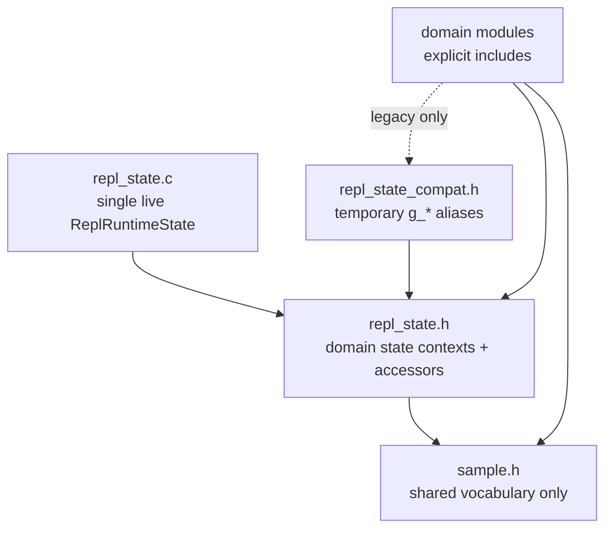

# Phase 2 State Header Sketch

## Scope

This note sketches the target shape of `sample.h` and `repl_state.h` once
Phase 2 is substantially complete. It is intentionally an 80% design, not the
full Phase 2 implementation plan. The purpose is to make the desired header
boundary concrete before the final naming/comment pass in Phase 10.

The focus is:

- What `sample.h` should still own.
- What `repl_state.h` should own.
- Which state context structs and focused state APIs should exist.
- Which ownership calls are still uncertain.
- What work remains to reach a fully defined 100% state boundary.

Non-goals:

- Moving every file in this slice.
- Redesigning the command language, file format, GLUT entrypoint, or sample
  structure.
- Replacing the command-store, parser, flattener, executor, UI, render, import,
  or replay APIs that already exist.

## Target Dependency Shape

Today `sample.h` includes `repl_state.h`, and `repl_state.h` depends on
`sample.h` being included first. That keeps old call sites working, but it also
makes global state visible anywhere that wants the shared command types.

The Phase 2 target should invert that relationship:



`sample.h` should be safe to include when a file only needs the REPL command
vocabulary. `repl_state.h` should be included explicitly by files that need
runtime state access. Temporary global compatibility should be isolated in a
separate header rather than smuggled through `sample.h`.

## `sample.h` Target

### Responsibility

`sample.h` should become a shared vocabulary header:

- Common fixed limits that define serialized or in-memory data sizes.
- Cross-module enums and structs that are not owned by one focused module yet.
- Minimal fixed-function OpenGL helpers used by more than one rendering pass.
- Small compatibility includes while the codebase is still sample-local.

It should not expose live mutable runtime state.

### 80% Sketch

```c
#ifndef SAMPLE_H
#define SAMPLE_H

#include <gl_includes.h>
#include <stddef.h>
#include <stdint.h>

#include "repl_eval.h" /* Needed until ExprVar-dependent structs move. */

/* Stable capacities shared by command storage, import/export, tests, and UI. */
#define MAX_COMMANDS    (2 * 4096)
#define MAX_LINE_LEN    256
#define MAX_INPUT_LEN   1024

/* UI constants still shared by code panel, HUD, and status strip. */
#define FONT_MONO       GLUT_BITMAP_9_BY_15
#define FONT_SMALL      GLUT_BITMAP_8_BY_13
#define FONT_W          9
#define FONT_H          15
#define FONT_SMALL_W    8
#define FONT_SMALL_H    13
#define LINE_H          18
#define CODE_MARGIN_X   10
#define CODE_MARGIN_Y   8
#define STATUSBAR_H     22

/* Render/export constants with file-format or generated-code implications. */
#define MAX_LIGHTS        4
#define TESS_VERT_BUF_SIZE 256
#define CAM_LINE_COUNT 4
#define RENDER_STATE_LINE_COUNT 3
#define REPL_OUTLINE_POLYGON_OFFSET_FACTOR (-0.01f)
#define REPL_OUTLINE_POLYGON_OFFSET_UNITS  (-100.0f)

/* Defaults that are reused by definitions, resets, examples, and tests. */
#define CFG_DEFAULT_* ...

typedef enum GridTheme GridTheme;
typedef enum AxesTheme AxesTheme;
typedef enum CodePanelLayout CodePanelLayout;
typedef enum CmdType CmdType;
typedef enum ReplayState ReplayState;
typedef enum ReplayMode ReplayMode;
typedef enum ProfilePanelMode ProfilePanelMode;

typedef struct GLCmd GLCmd;
typedef struct TessVertex TessVertex;
typedef struct SceneLight SceneLight;
typedef struct EnumEntry EnumEntry;
typedef struct FuncCompletion FuncCompletion;

int  is_transform_cmd(CmdType type);
void apply_transform_cmd(const GLCmd *cmd);
void apply_tracked_transform_cmd(const GLCmd *cmd, int *matrix_depth);
void unwind_tracked_transform_stack(int *matrix_depth);

#endif /* SAMPLE_H */
```

The exact syntax above is illustrative. C does not allow forward declarations
of anonymous enums, so the real header may keep the enum bodies directly in
`sample.h` until a later split moves them to focused type headers.

### Keep In `sample.h` For Phase 2

| Category | Why it can stay for now |
|----------|--------------------------|
| `CmdType` and `GLCmd` | They are the shared command model used by parser, command store, flattening, execution, UI, export, replay, and tests. Moving them needs a dedicated `repl_command_types.h` slice. |
| Grid/axes/code-panel enums | They are used across editor actions, rendering, export metadata, examples, and tests. They can move later with config ownership. |
| `TessVertex` and `SceneLight` | They bridge command execution, render resources, export, and tests. They can move later to render/executor type headers. |
| Default macros | They prevent drift between definitions, reset helpers, examples, and tests. Keep until defaults become typed config descriptors. |
| Transform inline helpers | They are small, shared by executor and overlays, and are not stateful. They can move later to `repl_transform.h` if desired. |

### Move Out Of `sample.h`

| Current content | Target home |
|-----------------|-------------|
| `#include "repl_state.h"` | Remove. Files that need state include `repl_state.h` explicitly. |
| Any `extern g_*` state | `repl_state.h` accessors or focused domain headers during migration. |
| Autocomplete limits such as `MAX_AC_MATCHES` | `repl_autocomplete.h` unless UI/tests truly need the capacity. |
| `CfgItem` | `repl_config.h` or `repl_actions.h`, because it describes UI/config mutation metadata rather than command vocabulary. |
| Search row APIs | `repl_search.h` / code-panel document APIs. |
| Replay APIs | `repl_replay.h`, with `sample.h` keeping only shared enums if needed. |
| Execute/flatten APIs | `repl_executor.h` and `repl_flatten.h`. |
| `draw_string`, `draw_quad`, `begin_2d`, `end_2d` | A small `ui_gl.h` or `ui_draw.h`. |
| `set_status` | A status/UI state API, likely `repl_status.h` or `repl_ui_state.h`. |

## `repl_state.h` Target

### Responsibility

`repl_state.h` should define domain context structs and focused state accessors.
It should name ownership boundaries without making every field globally mutable
from every module.

The target is a single live runtime object in `repl_state.c`, split into
domain-owned sub-contexts:

```c
typedef struct ReplRuntimeState {
    ReplDocumentState      document;
    ReplEditorInputState   editor;
    ReplSelectionState     selection;
    ReplCameraState        camera;
    ReplViewportState      viewport;
    ReplPresentationState  presentation;
    ReplRenderState        render;
    ReplReplayState        replay;
    ReplUiRuntimeState     ui;
    ReplSearchState        search;
    ReplAutocompleteState  autocomplete;
    ReplImportExportState  import_export;
} ReplRuntimeState;
```

The global object should stay private to `repl_state.c`. Callers use focused
accessors, snapshots, and mutation helpers.

### Access Policy

| Access type | Intended users | Rule |
|-------------|----------------|------|
| Mutable context pointer | Owning module and transitional compatibility code | Allowed only where the module owns the side effects. |
| Const context pointer | Render/export/UI readers | Allowed for read-only display, export, and tests. |
| Snapshot struct | Render frame, export, tests | Preferred where a frame or file write should use stable values. |
| Focused mutation helper | Non-owner modules | Preferred over direct field writes. |

For example, `scene_render.c` should prefer a render/presentation snapshot.
`repl_command_store.c` may mutate `ReplDocumentState`. `ui_menu_bar.c` should
emit an action or call a focused setter rather than writing config fields
directly.

## Proposed Context Structs

### Document And Flat Program

```c
typedef struct ReplDocumentState {
    GLCmd source_cmds[MAX_COMMANDS];
    int   source_cmd_count;
    int   edit_line_idx;
    int   normals_dirty;
} ReplDocumentState;

typedef struct ReplFlatProgramState {
    GLCmd            flat_cmds[MAX_COMMANDS];
    FlatCmdLocalVars local_vars[MAX_COMMANDS];
    int              flat_cmd_count;
    int              flat_dirty;
    int              user_lighting_enabled;
} ReplFlatProgramState;
```

Likely APIs:

```c
ReplDocumentState       *repl_state_document_mut(void);
const ReplDocumentState *repl_state_document(void);
ReplFlatProgramState    *repl_state_flat_program_mut(void);
const ReplFlatProgramState *repl_state_flat_program(void);

void repl_state_document_reset(void);
void repl_state_mark_flat_dirty(void);
void repl_state_mark_normals_dirty(void);
FlatProgramView repl_flat_program_view_live(void);
```

Most source-command edits should still route through `ReplCommandStore`; the
state API only owns storage, defaults, and dirty flags.

### Editor Input

```c
typedef struct ReplEditorInputState {
    char input[MAX_INPUT_LEN];
    int  input_len;
    int  cursor_pos;
    char pending_newline[MAX_INPUT_LEN];
    int  pending_newline_len;
    int  insert_mode;
} ReplEditorInputState;
```

Likely APIs:

```c
ReplEditorInputState       *repl_state_editor_input_mut(void);
const ReplEditorInputState *repl_state_editor_input(void);
void repl_state_editor_input_reset(void);
```

Open question: `edit_line_idx` can live here instead of in document state. The
document owns the array, but the editor owns which line is being edited. The
command store currently needs both, so the final choice should follow whichever
reduces cross-module mutation.

### Selection And Clipboard

```c
typedef struct ReplSelectionState {
    int anchor_idx;
    int end_idx;
} ReplSelectionState;

typedef struct ReplClipboardState {
    GLCmd cmds[MAX_COMMANDS];
    int   cmd_count;
} ReplClipboardState;
```

Likely APIs:

```c
ReplSelectionState       *repl_state_selection_mut(void);
const ReplSelectionState *repl_state_selection(void);
ReplClipboardState       *repl_state_clipboard_mut(void);
const ReplClipboardState *repl_state_clipboard(void);
void repl_state_selection_clear(void);
void repl_state_clipboard_clear(void);
```

The behavior APIs should remain in `repl_clipboard.c`; `repl_state.h` only
stores the live buffers.

### Camera And Viewport

```c
typedef struct ReplCameraState {
    float rx;
    float ry;
    float dist;
    float tx;
    float ty;
    float tz;
    float motion_glow;
    int   auto_rotate;
} ReplCameraState;

typedef struct ReplPointerState {
    int mouse_x;
    int mouse_y;
    int mouse_button;
} ReplPointerState;

typedef struct ReplViewportState {
    int window_w;
    int window_h;
    int scene_x;
    int scene_y;
    int scene_w;
    int scene_h;
} ReplViewportState;
```

Likely APIs:

```c
ReplCameraState       *repl_state_camera_mut(void);
const ReplCameraState *repl_state_camera(void);
ReplCameraState        repl_state_camera_snapshot(void);

ReplPointerState      *repl_state_pointer_mut(void);
ReplViewportState     *repl_state_viewport_mut(void);
const ReplViewportState *repl_state_viewport(void);
```

`repl_camera_controls.c` should own direct camera/pointer mutation. Rendering
should consume a snapshot through `SceneRenderConfig` / `FrameRenderContext`.

### Presentation Config

```c
typedef struct ReplPresentationState {
    int wireframe;
    int grid_theme;
    int grid_major_idx;
    int grid_extent_idx;
    int axes_theme;
    int show_vertex_labels;
    int show_normal_vectors;
    int show_vertex_indices;
    int show_vertex_outlines;
    int show_vertex_points;
    int show_vertex_guides;
    int xform_guide_mode;
    int show_light_indicators;
    int backdrop_mode;
    int highlight_current_poly;
    int current_block_begin_idx;
    int current_block_end_idx;
    int ortho_mode;
    int wrap_at_comma;
    int code_panel_layout;
} ReplPresentationState;
```

Likely APIs:

```c
typedef enum ReplConfigKey ReplConfigKey;

ReplPresentationState       *repl_state_presentation_mut(void);
const ReplPresentationState *repl_state_presentation(void);
ReplPresentationState        repl_state_presentation_snapshot(void);

void repl_state_presentation_reset_defaults(void);
void repl_state_presentation_reset_example_defaults(void);
int  repl_config_get(ReplConfigKey key);
void repl_config_set(ReplConfigKey key, int value);
int  repl_config_cycle(ReplConfigKey key, int delta);
```

The config item table should eventually point at config keys, not raw `int *`
addresses. That is the main step that lets menus/actions stop carrying global
field pointers around.

### Render Resources And Quality

```c
typedef struct ReplRenderState {
    int use_accum;
    int accum_aa_enabled;
    int accum_samples;
    float accum_jitter_x;
    float accum_jitter_y;
    int multisample_enabled;
    int line_smooth_enabled;
    int attenuate_points;
    float clear_color[4];

    GLUquadric    *quadric;
    GLUtesselator *tess;
    TessVertex     tess_verts[TESS_VERT_BUF_SIZE];
    int            tess_vert_count;
    SceneLight     lights[MAX_LIGHTS];
} ReplRenderState;
```

Likely APIs:

```c
ReplRenderState       *repl_state_render_mut(void);
const ReplRenderState *repl_state_render(void);
void repl_state_render_reset_defaults(void);
void repl_state_render_init_resources(void);
void repl_state_render_destroy_resources(void);
```

Open question: `lights` may deserve a separate `ReplLightingState`, because it
is manipulated by command execution, scene-light setup, export, and UI
indicators. Keeping it in render state is acceptable for Phase 2.

### Replay

```c
typedef struct ReplReplayState {
    int   active;
    int   state;
    int   pc;
    int   mode;
    float speed;
    float accum;
    float fade_speed;
    int   src_line_idx;
    int   total_flat_cmds;
    int   expand_args;
} ReplReplayState;
```

Likely APIs:

```c
ReplReplayState       *repl_state_replay_mut(void);
const ReplReplayState *repl_state_replay(void);
void repl_state_replay_reset(void);
```

Replay behavior should remain in `repl_replay.c`. Fade batches may stay module
private unless export, render, or tests need structured access.

### UI Runtime

```c
typedef struct ReplUiRuntimeState {
    float panel_frac;
    int   resizing_panel;
    int   scroll;
    int   scroll_follow_cursor;
    int   cursor_on;
    int   blink_tick;
    float anim_time;
    int   t_playing;
    int   t_var_idx;
    int   show_help;
    int   help_tab;
    int   help_scroll;
    int   show_var_panel;
    int   drag_var;
    int   drag_log_mode;
    float drag_start_val;
    int   drag_start_x;
    int   show_profile_panel;
    char  status[256];
    int   status_ttl;
} ReplUiRuntimeState;
```

Likely APIs:

```c
ReplUiRuntimeState       *repl_state_ui_mut(void);
const ReplUiRuntimeState *repl_state_ui(void);
void repl_state_ui_reset(void);
void repl_status_set(const char *message);
void repl_status_clear(void);
```

`set_status()` can remain as a compatibility wrapper around `repl_status_set()`
until callers are migrated.

### Search And Autocomplete

```c
typedef struct ReplSearchState {
    int  active;
    char query[MAX_INPUT_LEN];
    int  query_len;
    int  cursor_pos;
    int  hit_line_idx;
    int  hit_char_idx;
    int  hit_ordinal;
    int  match_count;
} ReplSearchState;

typedef struct ReplAutocompleteState {
    const char *matches[MAX_AC_MATCHES];
    int         match_count;
    int         selected_idx;
    char        ghost[MAX_LINE_LEN];
    char        hint[MAX_LINE_LEN];
    int         cursor_px;
    int         cursor_py;
} ReplAutocompleteState;
```

Likely APIs:

```c
ReplSearchState       *repl_state_search_mut(void);
const ReplSearchState *repl_state_search(void);
ReplAutocompleteState *repl_state_autocomplete_mut(void);
const ReplAutocompleteState *repl_state_autocomplete(void);
void repl_state_autocomplete_clear(void);
```

These are model states. Search behavior stays in `repl_search.c`, and
autocomplete matching stays in `repl_autocomplete.c`.

### Import/Export Runtime

```c
typedef struct ReplImportExportState {
    char workspace_header_lines[MAX_WORKSPACE_HEADER_LINES]
                               [WORKSPACE_HEADER_LINE_LEN];
    int  workspace_header_line_count;
    char scratch_buf[256];
    char render_state_lines[RENDER_STATE_LINE_COUNT][64];
    char cam_lines[CAM_LINE_COUNT][96];
    int  init_attenuate_points;
} ReplImportExportState;
```

Likely APIs:

```c
ReplImportExportState       *repl_state_import_export_mut(void);
const ReplImportExportState *repl_state_import_export(void);
void repl_state_import_export_reset(void);
void repl_refresh_workspace_header_lines(void);
int  repl_parse_workspace_header_line(const char *line);
```

The generated scaffold string tables (`g_header_pre`, `g_header_post`, etc.)
are not runtime state. They should become `static const` tables in
`repl_export.c` or typed scaffold descriptors exposed by `repl_export.h`.

## Focused State API Shape

The minimum post-Phase-2 API should have these groups:

```c
void repl_state_init_defaults(void);
void repl_state_reset_all(void);

ReplDocumentState       *repl_state_document_mut(void);
const ReplDocumentState *repl_state_document(void);

ReplEditorInputState       *repl_state_editor_input_mut(void);
const ReplEditorInputState *repl_state_editor_input(void);

ReplCameraState        repl_state_camera_snapshot(void);
ReplPresentationState  repl_state_presentation_snapshot(void);
ReplRenderState       *repl_state_render_mut(void);
const ReplRenderState *repl_state_render(void);

void repl_state_mark_flat_dirty(void);
void repl_state_mark_normals_dirty(void);
void repl_state_autocomplete_clear(void);
void repl_status_set(const char *message);
```

For direct mutation, the naming convention should be explicit:

- `*_mut()` means the caller is taking responsibility for side effects.
- No suffix means read-only context.
- `*_snapshot()` means a frame/file operation should not observe mid-operation
  changes.
- `reset_*()` means defaults are restored with all related invariants.

## Compatibility During Migration

The clean target is no broad `extern g_*` declarations in `sample.h` or
`repl_state.h`. The practical migration can use a compatibility header:

```c
/* repl_state_compat.h - temporary only */
#define g_cmds        (repl_state_document_mut()->source_cmds)
#define g_num_cmds    (repl_state_document_mut()->source_cmd_count)
#define g_edit_line   (repl_state_document_mut()->edit_line_idx)
#define g_flat_cmds   (repl_state_flat_program_mut()->flat_cmds)
```

This should be used sparingly and removed file by file. The compatibility
header should not be included by `sample.h`, because that would recreate the
current global-state leak.

Arrays and address-taking call sites may make macro compatibility awkward.
Where a macro would become unclear, keep a temporary real global and add a
comment naming the target context field. The goal is reviewable migration, not
a single risky rewrite.

## Uncertainties

These need decisions before the design is 100% defined:

1. **`edit_line_idx` ownership.** It can live with the document because
   command-store insert/replace/delete logic needs it, or with editor input
   because it is cursor state. The less leaky option depends on the remaining
   command-store callers.
2. **Config key model.** `CfgItem` currently stores raw `int *value`. A full
   state boundary wants `ReplConfigKey` plus getters/setters. The table shape
   needs one pass through `repl_actions.c`, `ui_menu_bar.c`, examples, export,
   and tests.
3. **Command type header split.** `CmdType` and `GLCmd` probably deserve
   `repl_command_types.h`, but leaving them in `sample.h` is acceptable for
   Phase 2 if the priority is removing mutable global state first.
4. **`FlatProgramView` and flatten DTO ownership.** These are not runtime state.
   They may stay in `repl_state.h` short term, but the cleaner endpoint is
   `repl_flatten.h` / `repl_executor.h`.
5. **Lights and tessellator ownership.** They are render resources but also
   touched by execution and export. Keeping them in `ReplRenderState` is fine
   for Phase 2; a later split may introduce `ReplLightingState`.
6. **Replay fade batches.** The replay state listed here covers public runtime
   fields. Fade batches can stay private in `repl_replay.c` unless render tests
   or snapshots need explicit access.
7. **Search/autocomplete ownership.** These are domain models with UI
   coordinates mixed in. `cursor_px/cursor_py` may belong in UI layout rather
   than autocomplete state.
8. **Immutable export/name tables.** Name arrays and scaffold strings are
   currently exposed as globals. Some should become static const data, while
   others may become config descriptors.
9. **Reset order.** `repl_state_reset_all()` must preserve current behavior
   around examples, camera inheritance, presentation defaults, workspace
   metadata, and undo/redo clearing. That needs tests before finalizing.

## Work Needed For 100%

1. Add `ReplRuntimeState` and the domain structs to `repl_state.h` /
   `repl_state.c`, with defaults matching the current global definitions.
2. Stop including `repl_state.h` from `sample.h`; include it explicitly from
   modules that need state.
3. Move `extern g_*` declarations out of `repl_state.h` into a temporary
   `repl_state_compat.h`, or replace them directly with focused accessors.
4. Replace individual global definitions with fields in the live
   `ReplRuntimeState`, one domain at a time.
5. Add reset/init helpers per domain and route existing scattered initialization
   through them.
6. Convert config metadata from raw pointers to keys/setters so actions own
   mutations and UI only renders choices.
7. Move non-state DTOs (`FlatProgramView`, flatten options/results) to focused
   pipeline headers when call sites are ready.
8. Add focused tests for default values, reset behavior, dirty flag behavior,
   autocomplete clearing, status setting, and presentation example reset.
9. Run the existing baseline after each domain migration:
   `make test-stubs TEST_JOBS=4`, plus focused parser/commit/io/example suites
   when command or import/export state is touched.
10. Delete the compatibility aliases once no production module includes them.

