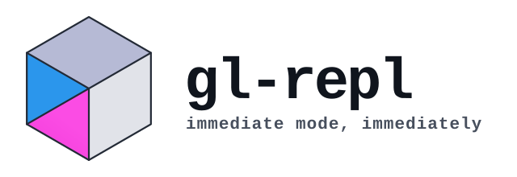

<picture>
  <source media="(prefers-color-scheme: dark)" srcset="../docs/images/glrepl-wordmark-dark.svg">
  
</picture>

[](https://github.com/drewwoods/gl-repl/actions/workflows/ci-macos.yml)
[](https://github.com/drewwoods/gl-repl/actions/workflows/ci-linux.yml)

An interactive interpreter for fixed-function OpenGL — the scene renders beside
the source that made it. No build step.

```bash
make gl-repl && ./gl-repl                     # macOS: brew install cmake
./gl-repl --example "Torus knot"              # F12 cycles all 41
```

Linux: `sudo apt install freeglut3-dev`. Also runs in the browser — `make web`.


<sub>the built-in **Highlights** tour</sub>

<a href="../docs/SHOWCASE.md"></a>
&nbsp;
<a href="../docs/SHOWCASE.md"></a>
&nbsp;
<a href="../docs/SHOWCASE.md"></a>

<sub>three of 41 built-in scenes, each a screenful of typed GL — **[browse the showcase →](../docs/SHOWCASE.md)**</sub>

- **Render as you type** — edit a `glVertex3f`, see it move.
- **`Ctrl+T` for time** — reference `t` anywhere, animation with no boilerplate.
- **A real little language** — loops, functions, `if`, a math library; an
  expression goes anywhere a number does.
- **Live values** — a slider on every float, a stepper on every number, a
  picker on every color.
- **`Ctrl+R` replays your draws** — the scene assembles call by call.
- **`Ctrl+S` exports standalone C** — no REPL, no runtime of ours.

---

[**User Guide**](../docs/USER_GUIDE.md) ·
[Showcase](../docs/SHOWCASE.md) ·
[Advanced Usage](../docs/ADVANCED_USAGE.md) ·
[Contributing](../docs/CONTRIBUTING.md) ·
[Modules](../docs/MODULES.md) ·
[Architecture](../docs/ARCHITECTURE.md)

Press `F1` in-app for the full key reference.

<sub>C99 · OpenGL 1.1 · GLU · freeglut · MIT</sub>
