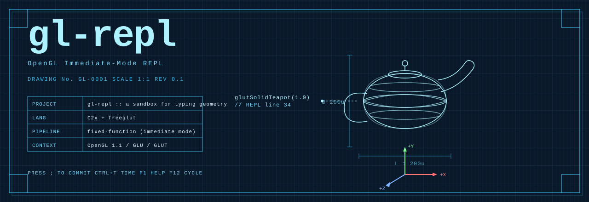
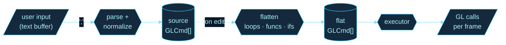

<div align="center">



</div>

<table width="100%">
<tr>
<td width="60%">

> **DRAWING No.** GL-0001 &nbsp; · &nbsp; **REV** 0.1 &nbsp; · &nbsp; **SCALE** 1:1
>
> An interactive command interpreter for fixed-function OpenGL. The user types GL calls; geometry renders in real time alongside the source that produced it. No textures, no shaders, no scene files. Geometry and color, on purpose.

</td>
<td width="40%">


<br>


</td>
</tr>
</table>

---

### §1 &nbsp;&nbsp; What it is

A REPL for the OpenGL most graphics tutorials apologise for. You type:

```c
glRotatef(t * 30, 0, 1, 0);
glutSolidTeapot(1.0);
```

— and a teapot spins. The point of immediate mode is the locality: the geometry is in the code, the code is on screen, edits land instantly. There is no bundle to rebuild, no buffer to bind, no shader to recompile. *(The point of immediate mode is also that the entire spec fits in your head.)*

> [!NOTE]
> The aesthetic is intentional. So is the constraint. By restricting the palette to geometry and color — no textures, no shaders, no images — the expressiveness of the form has to come from composition. The repo is also a small bet that this is more fun than it sounds.

---

### §2 &nbsp;&nbsp; Specification

| Field | Value |
|---|---|
| Pipeline | OpenGL 1.1 fixed-function · GLU · GLUT/freeglut |
| Source language | C2x (gcc with AddressSanitizer in debug) |
| Editor model | document-of-record + flat-expansion cache |
| Persistence | exported as standalone C (`output.c`), workspaces as directories of `*.c` |
| Variables | one predefined (`t`), up to 23 user-declared (`float name;`) |
| Scratch | three fixed arrays `A[8] B[8] C[8]` |
| Limits | flatten visit budget 200,000 · call depth 64 · undo ring 32 deep |

---

### §3 &nbsp;&nbsp; Assembly

```bash
# macOS
brew install freeglut
make sample          # or: make glut for the system framework

# Linux
sudo apt install freeglut3-dev
make sample

# Run
./sample                        # fresh session
./sample output.c               # reload saved file
./sample workspace/             # load every *.c under workspace/ as a scene
make test                       # run all tests
```

<details>
<summary><b>Build flags</b></summary>

| Flag | Purpose |
|---|---|
| `USE_GL_STUBS=1` | No system GL needed; uses the vendored stubs under `tests/gl-stubs/` |
| `NO_POINT_PARAMETER=1` | Replaces `glPointParameterfv(GL_POINT_DISTANCE_ATTENUATION,...)` with a per-call `glPointSize` scaling, for drivers without the extension |
| `make scene_demo` | Standalone scene binary; proves `src/scene/` has no hard dep on the REPL |
| `make check-state-ownership` | Full inventory of ownership / contract guards |

</details>

---

### §4 &nbsp;&nbsp; Data flow

The pipeline is *source → flat → GL*. Each edit invalidates the flat cache; the next frame rebuilds it before executing.



> **`source`** is the document. **`flat`** is the cache. The user only edits the document; the cache is regenerated by `flatten_commands()` whenever the source changes, before the next executor pass.

---

### §5 &nbsp;&nbsp; Interface

<table>
<tr>
<th align="left">Editor</th>
<th align="left">Runtime</th>
</tr>
<tr>
<td>

| | |
|---|---|
| `;` | commit |
| `↑ ↓` | navigate |
| `Tab` | autocomplete |
| `Ctrl+Z / Y` | undo · redo |
| `Ctrl+R` | reformat |
| `Ctrl+F` | find |
| `Ctrl+C / X / V` | copy · cut · paste |

</td>
<td>

| | |
|---|---|
| `Ctrl+T` | toggle time `t` |
| `Ctrl+G` | replay (step) |
| `Ctrl+S` | save → `output.c` |
| `F1` | help |
| `F2..F11` | overlays |
| `F12` | cycle examples & scenes |

</td>
</tr>
</table>

---

### §6 &nbsp;&nbsp; Supported drawing surface &nbsp;*(extract — full set in [`AGENTS.md`](AGENTS.md))*

```c
/* primitives ------------------------------------------------------ */
glBegin(MODE);  glVertex3f(x,y,z);  glNormal3f(x,y,z);  glEnd();
glColor3f(r,g,b);  glColor4f(r,g,b,a);

/* transforms ------------------------------------------------------ */
glTranslatef(x,y,z);  glRotatef(deg, x,y,z);  glScalef(sx,sy,sz);
glPushMatrix();  glPopMatrix();  glLoadIdentity();

/* state ----------------------------------------------------------- */
glEnable(GL_DEPTH_TEST | GL_LIGHTING | GL_COLOR_MATERIAL | ...);
glShadeModel(GL_SMOOTH | GL_FLAT);
glPointSize(s);  glLineWidth(w);
glColorMaterial(face, mode);  glMaterialf(face, pname, value);

/* solids ---------------------------------------------------------- */
glutSolidTorus(inner, outer, nsides, rings);
glutSolidCube(s);  glutSolidSphere(r, sl, st);
glutSolidCone(b, h, sl, st);  glutSolidTeapot(s);

/* host-language --------------------------------------------------- */
float name;
var = sin(t * TAU);
for(i, 0, 12) { /* body */ }
func0(args)   { /* body */ }
if(expr)      { /* body */ }
A[0] = rand2(t);
```

---

### §7 &nbsp;&nbsp; Worked example

```c
glEnable(GL_DEPTH_TEST);
glEnable(GL_LIGHTING);
glEnable(GL_LIGHT0);
glTranslatef(0, 0, -5);
glRotatef(t * 30, 0, 1, 0);
glColor3f(0.25, 0.79, 1.0);
glutSolidTeapot(1.0);
```

Press `Ctrl+T`. The teapot rotates. Every line is independently editable; the rotation rate is just the scalar in front of `t`.

> [!TIP]
> The `rand` and `rand2` functions are deterministic hashes of `(seed, iter)`. The same input produces the same output every frame — particles look animated *because they're a function of `t`*, not because state accumulates.

---

### §8 &nbsp;&nbsp; Revisions

<details>
<summary><b>Open items</b></summary>

- Bezier example completion
- Solar-system example
- Sunset-grid example
- 2D mode: camera down Z, click-drag panning on z = 0
- Loading animation (zoom-in opener)
- In-REPL tutorial popups
- Light setup exposed as REPL geometry
- Worktree support in the ownership guards
- Address the 8-simultaneously-visible-variables cap in nested scopes

</details>

---

<div align="center">
<sub>· · ·</sub><br>
<sub>see also <a href="ARCHITECTURE.md">ARCHITECTURE.md</a> · <a href="MODULES.md">MODULES.md</a> · <a href="CALLGRAPH_GUIDE.md">CALLGRAPH_GUIDE.md</a> · <a href="AGENTS.md">AGENTS.md</a></sub><br><br>
<sub><code>END  OF  DRAWING  ────────────────────────────────────────</code></sub>
</div>
