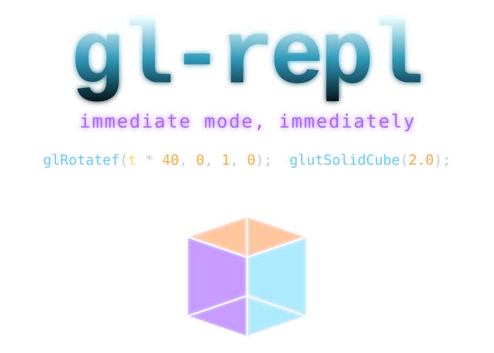
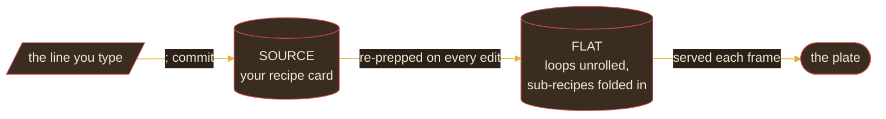

<div align="center">



<br>

# 🍳 &nbsp; The Immediate-Mode Cookbook

<sub>*Small-batch geometry, made to order. &nbsp; Serves 1 viewport. &nbsp; Prep time: one keystroke.*</sub>

<br>


</div>

---

## From the Kitchen

Most graphics tools hand you a frozen dinner: load the model, microwave the
shader, plate the buffers. **gl-repl** is a kitchen. You type a line of
fixed-function OpenGL, finish it with `;`, and it's served — geometry rendered
the instant you commit, right beside the recipe that made it.

Everything is cooked from raw ingredients: vertices, transforms, color, light.
No textures, no shaders, no pre-made sauces. The flavor has to come from
technique, and that's the whole appeal.

> [!TIP]
> **No reservation required.** &nbsp; `make sample && ./sample` — you're seated.

---

## 🧺 &nbsp; Stocking the Pantry

```bash
# macOS
brew install freeglut
make sample              # builds with vendored freeglut (Cocoa)

# Linux
sudo apt install freeglut3-dev
make sample
```

<details>
<summary><b>Other pantry staples</b></summary>

```bash
make glut                       # use the system GLUT framework
make test                       # taste-test everything (debug: ASan + UBSan)
make sample USE_GL_STUBS=1      # cook without a real GL stove (CI)
./sample output.c               # reheat a saved dish
./sample workspace/             # lay out a whole tasting menu (*.c per scene)
```
</details>

---

## 🥄 &nbsp; Ingredients

Keep these on hand. They're the entire larder.

**Proteins** *(the things you draw)*
```c
glBegin(MODE);  glVertex3f(x,y,z);  glNormal3f(x,y,z);  glEnd();
glColor3f(r,g,b);  glColor4f(r,g,b,a);
```

**Pre-shaped cuts** *(the GLUT solids — no butchering required)*
```c
glutSolidTeapot(size);      glutSolidSphere(radius, slices, stacks);
glutSolidCube(size);        glutSolidTorus(inner, outer, nsides, rings);
glutSolidCone(base, height, slices, stacks);
```

**Seasoning** *(transforms — apply to taste; OpenGL reads them last-first)*
```c
glTranslatef(x,y,z);  glRotatef(deg, x,y,z);  glScalef(sx,sy,sz);
glPushMatrix();  glPopMatrix();  glLoadIdentity();
```

**Heat** *(light & material — turns flat dough into something with a crust)*
```c
glEnable(GL_LIGHTING);  glEnable(GL_LIGHT0);
glShadeModel(GL_SMOOTH);
glColorMaterial(face, mode);  glMaterialfv(face, pname, (GLfloat[]){r,g,b,a});
```

**Leavening** *(the host language — makes a little batter rise into a lot)*
```c
float name;                    // a measuring cup
var = sin(t * TAU);            // mix to taste
for(i, 0, 12) { /* body */ }   // repeat the fold
func0(args) { /* body */ }     // a sub-recipe
A[0] = rand2(t);               // scratch bowls A/B/C, slots 0..7
```

<sub>Spice rack: <code>sin cos tan sqrt abs pow min max floor ceil fmod rem rand rand2</code> · <code>PI TAU</code> · <code>t</code> is time.</sub>

---

## 👨‍🍳 &nbsp; Recipe: A Spinning, Lit Teapot

> **Serves** one viewport · **Active time** about 30 seconds · **Yields** one rotating teapot

**Method**

1. **Preheat the depth test and the lights.**
   ```c
   glEnable(GL_DEPTH_TEST);
   glEnable(GL_LIGHTING);
   glEnable(GL_LIGHT0);
   ```
2. **Push the work back from the lens** so it fits the pan.
   ```c
   glTranslatef(0, 0, -5);
   ```
3. **Fold in a turn** — the `t` is what makes it move.
   ```c
   glRotatef(t * 30, 0, 1, 0);
   ```
4. **Glaze with color, then drop the teapot in.**
   ```c
   glColor3f(0.82, 0.30, 0.36);
   glutSolidTeapot(1.0);
   ```
5. **Press `Ctrl+T` to bring it up to temperature.** It turns. The rotation
   rate is just the number in front of `t` — adjust to taste.

> [!NOTE]
> **Why it moves without stirring.** &nbsp; `t` advances each frame and the
> scene is *recomputed*, not nudged. `rand`/`rand2` are deterministic hashes of
> their seed, so a "lively" sprinkle of particles is really a fixed function of
> `t` — plate it twice, get the same dish twice.

---

## 🔥 &nbsp; How the Kitchen Works

There are two prep stations and one rule.



- **Source** is your recipe card — the only thing you write on.
- **Flat** is the mise en place — loops unrolled, functions inlined. Re-prepped
  automatically the moment the card changes.
- **The rule:** never write on the mise en place. It's regenerated, never edited.

---

## 🍽️ &nbsp; Table Service *(the controls)*

| Key | At the table | | Key | In the kitchen |
|---|---|---|---|---|
| `;` | serve this line | | `Ctrl+T` | toggle time `t` |
| `Tab` | autocomplete | | `Ctrl+G` | replay each draw |
| `↑ ↓` | browse the menu | | `Ctrl+S` | save to `output.c` |
| `Ctrl+Z / Y` | undo · redo | | `F1` | help |
| `Ctrl+F` | find a dish | | `F2..F11` | overlays |
| `Ctrl+R` | reformat | | `F12` | next example / scene |

<sub>On macOS, <b>Cmd</b>+letter is the same as <b>Ctrl</b>+letter to the editor.</sub>

---

## 📦 &nbsp; Leftovers & Takeaway

Press **Ctrl+S** to save the current dish as `output.c` — a standalone,
compilable C file you can drop into your own engine. Press **F11** to box up
the geometry as an ASCII `.ply` mesh. Everything round-trips; nothing is
trapped in the kitchen.

---

## 📝 &nbsp; Recipes Still Being Tested

- [ ] A Bézier dessert
- [ ] A solar-system platter
- [ ] A sunset-grid side
- [ ] A proper 2D mode (camera down Z, click-drag pans the z=0 plane)
- [ ] A plated arrival animation (zoom-in opener)
- [ ] In-app tutorial cards
- [ ] The light setup, served as visible REPL geometry

---

<div align="center">

<sub>· · ·</sub>

<sub>more in the back of the book · <a href="ARCHITECTURE.md">ARCHITECTURE.md</a> · <a href="MODULES.md">MODULES.md</a> · <a href="AGENTS.md">AGENTS.md</a></sub>

<br>

<sub><i>Bon appétit — now type something.</i></sub>

</div>
