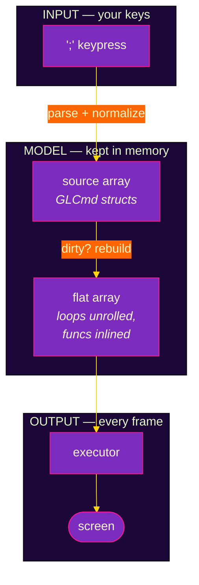

<div align="center">



</div>

```
╔══════════════════════════════════════════════════════════════════════════════╗
║  C:\GL-REPL>  type README.md                                                 ║
║                                                                              ║
║  SYS_3D.EXE   gl-repl v0.1   immediate-mode opengl, but you live inside it   ║
╚══════════════════════════════════════════════════════════════════════════════╝
```

<div align="center">


</div>

---

## `>` &nbsp;A C:\ PROMPT AND A WORLD

Most graphics tools want you to load a model. **gl-repl** wants you to *type* one. A line at a time, terminated by `;`, executed before your finger leaves the key.

It is a sandbox for the fixed-function OpenGL pipeline — the one that built the demos, the screensavers, and half the 90s. The whole API surface is small. The whole point is the loop:

```
        ┌─── you type ───┐
        │                │
        ▼                │
    [ commit ; ]         │
        │                │
        ▼                │
    [  flatten  ]   <────┴──  edit again, the flat array invalidates
        │                     and rebuilds before the next frame
        ▼
    [ execute → screen ]
```

---

## `>` &nbsp;BOOT SEQUENCE

```ansi
C:\> brew install freeglut          # or: apt install freeglut3-dev
C:\> make sample
   gcc -c sample.c                   [OK]
   gcc -c src/repl/parser.c          [OK]
   gcc -c src/scene/render.c         [OK]
   ...
   link -> ./sample                  [OK]
C:\> ./sample
   ▒ INIT GL CONTEXT 800x600
   ▒ HELP: F1                        [READY]
```

<sub>Other entrypoints: `./sample output.c` reloads a saved session · `./sample workspace/` loads every <code>*.c</code> as a scene · `--dump-code` prints the buffer · <code>make test</code> runs everything.</sub>

---

## `>` &nbsp;ON-SCREEN

<table>
<tr><td>

```
╔════ EDITOR ═════════════════╗
║ 1  glEnable(GL_LIGHTING);   ║
║ 2  glEnable(GL_LIGHT0);     ║
║ 3  glTranslatef(0,0,-5);    ║
║ 4  glRotatef(t*30,0,1,0);   ║
║ 5  glColor3f(1,.4,.9);      ║
║ 6  glutSolidTeapot(1.0)█    ║   ← cursor
╚═════════════════════════════╝
```

</td><td>

```
┌─── 3D VIEW ─────────────────┐
│        .─────.              │
│      ／       ＼            │
│     |    ▓▓▓   |   <- it    │
│      ＼       ／      spins │
│        '─────'              │
└─────────────────────────────┘
```

</td></tr>
</table>

The code panel on the left is editable. The 3D view on the right reflects whatever the source commands say, the instant `;` lands.

---

## `>` &nbsp;THE COMMAND PARADE

<details open>
<summary><b>· DRAW</b></summary>

```c
glBegin(GL_TRIANGLES); glVertex3f(x,y,z); glEnd();
glColor3f(r,g,b);  glNormal3f(x,y,z);
glutSolidCube(size);
glutSolidSphere(radius, slices, stacks);
glutSolidTorus(inner, outer, nsides, rings);
glutSolidTeapot(size);
glutSolidCone(base, height, slices, stacks);
```
</details>

<details>
<summary><b>· TRANSFORM</b></summary>

```c
glTranslatef(x,y,z);
glRotatef(deg, x,y,z);
glScalef(sx, sy, sz);
glPushMatrix(); glPopMatrix(); glLoadIdentity();
```
</details>

<details>
<summary><b>· LIGHT</b></summary>

```c
glEnable(GL_LIGHTING);
glEnable(GL_LIGHT0); ... glEnable(GL_LIGHT3);
glShadeModel(GL_SMOOTH);
glColorMaterial(face, mode);   /* GL_AMBIENT|GL_DIFFUSE|GL_SPECULAR|GL_EMISSION */
glMaterialf(face, pname, value);
```
</details>

<details>
<summary><b>· MATH</b></summary>

```c
float a, b, c;            // declare
a = sin(t * TAU) * 0.5;   // assign
for(i, 0, 12) { /* body */ }
A[0] = rand(t);           // scratch arrays A/B/C, indices 0..7
```

`sin cos tan sqrt abs pow min max floor ceil fmod rem rand rand2` · `PI TAU` · `t` is time.

</details>

---

## `>` &nbsp;THE PIPELINE, VISUALIZED



---

## `>` &nbsp;KEY MAP

| 🗝️ | what it does |
|---|---|
| `;` | execute current line |
| `Enter` | new line |
| `Tab` | autocomplete |
| `↑/↓` | walk lines |
| `Ctrl+Z / Ctrl+Y` | undo · redo (32 deep) |
| `Ctrl+T` | toggle the time variable `t` |
| `Ctrl+G` | replay — step through draws |
| `Ctrl+R` | reformat the buffer |
| `Ctrl+F` | find |
| `Ctrl+S` | save to `output.c` |
| `F1` | help overlay |
| `F2..F11` | toggle overlays (grid, axes, normals, vertex points…) |
| `F12` | cycle examples and user scenes |

> [!IMPORTANT]
> On macOS, **Cmd+letter** is normalized to its Ctrl equivalent. `Cmd+B` and `Ctrl+B` are the same keystroke to the editor.

---

## `>` &nbsp;UNDER THE HOOD

There are two data structures and one rule:

- **`source`** — what you typed. The truth.
- **`flat`** — what the source expands to when loops unroll and functions inline. Rebuilt automatically the first frame after an edit.
- **the rule** — the source is the only thing you ever edit. The flat array is regenerated, never written to.

Everything else is plumbing: the parser turns text into `GLCmd` structs; `repl_execute_program()` walks the flat array each frame and emits real GL calls; the editor maintains an input buffer, an undo ring, an autocomplete provider. See **[`ARCHITECTURE.md`](ARCHITECTURE.md)** for the full layered diagram.

---

## `>` &nbsp;TODO.TXT *(actual contents of the actual TODO)*

- complete the bezier example
- make a solar system example
- 2D mode: camera down Z, click-drag pans on the z=0 plane
- loading animation similar to glkit-examples (zoom-in opener)
- in-REPL tutorial popups
- expose the light setup as REPL geometry (so you can see where lights live)
- guards should support git worktree
- address the 8-visible-variable limit

---

<div align="center">

`█ █ █  ▄  █ █ █  ▄  █ █ █`

<sub>licensed MIT · built on freeglut + OpenGL 1.1 · type something</sub>

<sub><code>C:\> _</code></sub>

</div>
