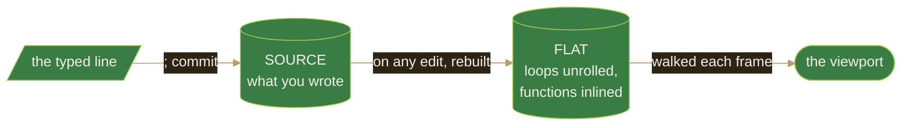

<div align="center">



<br>

### A Field Guide to Immediate-Mode Geometry

<sub>*Being an illustrated record of the things one may draw by typing, &nbsp;and the means by which they are observed in the wild.*</sub>

<br>


</div>

---

## Preface

This is a small ecosystem in which geometry is **typed into existence**. You
enter a line of fixed-function OpenGL, terminate it with `;`, and the form it
describes appears — at once — in a viewport beside the source that summoned it.
Nothing is hidden in a data file; the vertices are right there in the text,
and a change to the text is a change to the world on the very next frame.

The guide that follows catalogs what lives here, how to recognize it, and how
to coax it into view. The territory is deliberately small. There are no
textures and no shaders — only geometry and color — because an animal stripped
of its camouflage is easier to *understand*.

> *"To name a thing is to begin to see it."*

---

## How to Use This Guide

```
brew install freeglut          # macOS  (Linux: apt install freeglut3-dev)
make sample                    # raise a specimen from source
./sample                       # observe in a fresh habitat
./sample workspace/            # observe a whole colony (every *.c as a scene)
```

<details>
<summary><b>Other expeditions</b></summary>

```
make glut                      # observe using the system GLUT framework
make test                      # verify the population (debug: ASan + UBSan)
make sample USE_GL_STUBS=1     # raise one without a live GL habitat (CI)
./sample --example torus       # begin on a known specimen
./sample --list-examples       # enumerate the catalog
```
</details>

---

## Taxonomy

The inhabitants fall into a few families. Learn to tell them apart by silhouette.

### Family · *Primitiva* (the drawn things)

> The base population. Plotted vertex by vertex, between a `glBegin` and its
> `glEnd`. Color and surface normal are properties carried on each animal.

```c
glBegin(GL_TRIANGLES);  glVertex3f(x,y,z);  glNormal3f(x,y,z);  glEnd();
glColor3f(r,g,b);       glColor4f(r,g,b,a);
```

### Family · *Solida* (the GLUT solids)

> Larger fauna, fully formed. Recognize the **teapot** by its handle; the
> **torus** by its hole. They graze wherever the modelview has carried them.

```c
glutSolidTeapot(size);                       glutSolidCube(size);
glutSolidSphere(radius, slices, stacks);     glutSolidCone(base, height, sl, st);
glutSolidTorus(inner, outer, nsides, rings);
```

### Family · *Transforma* (the unseen movers)

> Never visible themselves, but they bend the space every later specimen
> stands in. Note that OpenGL reads them in **reverse** source order.

```c
glTranslatef(x,y,z);  glRotatef(deg, x,y,z);  glScalef(sx,sy,sz);
glPushMatrix();  glPopMatrix();  glLoadIdentity();
```

### Family · *Lumina* (light & material)

> The conditions of observation. Without them, the solids appear as flat
> shadow-shapes; with them, the surface normals catch and the form emerges.

```c
glEnable(GL_LIGHTING);  glEnable(GL_LIGHT0);   /* up to GL_LIGHT3 */
glShadeModel(GL_SMOOTH);
glColorMaterial(face, mode);   glMaterialfv(face, pname, (GLfloat[]){r,g,b,a});
```

---

## The Migratory Variable `t`

The single most important behavior to recognize is **motion driven by time**.
Press **Ctrl+T** and the predefined variable `t` begins to advance. Any form
written as a function of `t` will move — not because state accumulates, but
because each frame is *recomputed* from the current `t`.

```c
glRotatef(t * 30, 0, 1, 0);   // a steady turn; the 30 is degrees per unit t
```

> [!NOTE]
> **On the deterministic `rand`.** &nbsp; `rand(seed)` and `rand2(seed)` are
> hashes, not accumulators — the same input yields the same output every frame.
> A flock of particles *appears* alive because it is a pure function of `t`,
> which makes the whole field reproducible. Observe the same scene twice and
> you observe the same thing.

---

## Lifecycle of a Specimen

Every form passes through the same three stages between keystroke and pixel.



> The **source** is the living document — the only thing you edit. The **flat**
> form is its expansion, regrown automatically after every change. You tend the
> source; the flat colony takes care of itself.

---

## Observer's Controls

<table>
<tr><th align="left">To edit the record</th><th align="left">To observe the field</th></tr>
<tr><td>

| | |
|---|---|
| `;` | commit the line |
| `Tab` | autocomplete |
| `↑ ↓` | walk the lines |
| `Ctrl+Z / Y` | undo · redo |
| `Ctrl+R` | reformat |
| `Ctrl+F` | find |

</td><td>

| | |
|---|---|
| `Ctrl+T` | begin / pause time |
| `Ctrl+G` | replay each draw |
| `Ctrl+S` | preserve to `output.c` |
| `F1` | the help plate |
| `F2..F11` | overlays (grid, normals…) |
| `F12` | next specimen / scene |

</td></tr>
</table>

---

## A First Sighting

Type these lines and you will have observed a lit, turning teapot — the most
common animal in this habitat:

```c
glEnable(GL_DEPTH_TEST);
glEnable(GL_LIGHTING);
glEnable(GL_LIGHT0);
glTranslatef(0, 0, -5);
glRotatef(t * 30, 0, 1, 0);
glColor3f(0.9, 0.5, 0.2);
glutSolidTeapot(1.0);
```

Press **Ctrl+T**. It turns. Each line is editable; the creature responds at once.

---

## Specimens Not Yet Cataloged

<details>
<summary><b>Field notes — awaiting collection</b></summary>

- A Bézier specimen (in progress)
- A solar-system colony
- A sunset-grid biome
- A true 2D mode (camera down Z, click-drag panning on the z=0 plane)
- An arrival animation (a zoom-in opener)
- In-habitat tutorial plates
- The light sources, rendered as visible REPL geometry
- Relief of the 8-visible-variable limit in nested scopes

</details>

---

<div align="center">

<sub>🌿</sub>

<sub>Preserved specimens may be exported to <code>.ply</code> (press <b>F11</b>) and studied elsewhere.</sub>

<sub>further reading · <a href="ARCHITECTURE.md">ARCHITECTURE.md</a> · <a href="MODULES.md">MODULES.md</a> · <a href="AGENTS.md">AGENTS.md</a></sub>

</div>
