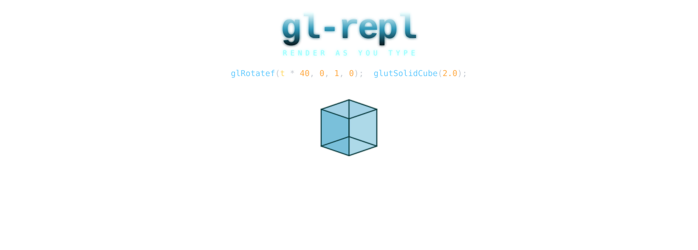
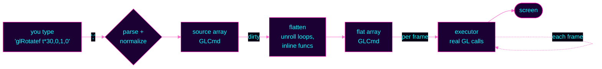

<div align="center">




<br>

<!-- arcade-style badge strip -->


<br><br>

<h3>

`>` &nbsp;TYPE&nbsp;GL&nbsp;COMMANDS&nbsp;&nbsp;`;`&nbsp;TO&nbsp;COMMIT&nbsp;&nbsp;`▶`&nbsp;WATCH&nbsp;GEOMETRY&nbsp;APPEAR

</h3>

</div>

---

> [!TIP]
> **INSERT COIN.** &nbsp; `make sample && ./sample`

---

## ▌ WHAT IS THIS

A live OpenGL command interpreter. You type fixed-function GL, press `;`, and geometry renders in real time alongside the code that produced it. The whole point is the loop:

```
┌────────────────┐    ;    ┌────────────────┐         ┌────────────────┐
│  YOU TYPE A    │ ──────▶ │  PARSE + FLAT  │ ──────▶ │  RENDER NOW.   │
│  GL CALL       │         │  + COMMIT      │         │  NEXT FRAME.   │
└────────────────┘         └────────────────┘         └────────────────┘
```

No data files. No scene graph. No shaders. Just `glBegin`, `glVertex3f`, and the satisfaction of watching `glRotatef(t*30, 0, 1, 0);` make a thing spin.

<br>

## ▌ HIGH SCORES &nbsp; *(things you get for free)*

| | |
|---|---|
| ★ &nbsp; **Immediate mode, immediately.** | The geometry lives in your code. Edit a `glVertex3f`, see the vertex move. |
| ★ &nbsp; **Time as a variable.** | `Ctrl+T` toggles `t`. Reference it anywhere. Animation, no boilerplate. |
| ★ &nbsp; **Replay your draws.** | Step through the flat command stream. Watch each call paint its piece. |
| ★ &nbsp; **Export to standalone C.** | Anything you build round-trips as a single `output.c` you can drop in your own engine. |
| ★ &nbsp; **No textures.** | Geometry and color, on purpose. The expressiveness is the point. |

<br>

## ▌ START THE GAME

```bash
brew install freeglut          # macOS — Linux: apt install freeglut3-dev
make sample                    # main binary
./sample                       # fresh session
./sample workspace/            # or load every *.c under workspace/
```

<details>
<summary><b>▾ &nbsp; Other build targets</b></summary>

```bash
make glut                      # system GLUT (macOS framework)
make test                      # all tests
make sample USE_GL_STUBS=1     # builds w/o system GL — for CI
make sample NO_POINT_PARAMETER=1   # for drivers w/o GL_POINT_DISTANCE_ATTENUATION
```

</details>

<br>

## ▌ THE PIPELINE

Source commands become flat commands become GL calls. Each frame.



<br>

## ▌ CABINET CONTROLS

<table>
<tr>
<td align="center" width="50%">

**◆ &nbsp; EDIT**

```
  ;    commit current line
 Tab   autocomplete
 ↑/↓   navigate lines
Ctrl+Z undo
Ctrl+R reformat all
Ctrl+F find
```

</td>
<td align="center" width="50%">

**◆ &nbsp; PLAY**

```
Ctrl+T  toggle time variable t
Ctrl+G  replay (step through draws)
Ctrl+S  save to output.c
 F1     help overlay
 F12    cycle examples + scenes
```

</td>
</tr>
</table>

<br>

## ▌ SUPPORTED COMMANDS &nbsp; *(the move list)*

<details>
<summary><b>▾ &nbsp; Drawing primitives</b></summary>

```c
glBegin(MODE);  glEnd();
glVertex3f(x,y,z);   glVertex2f(x,y);
glNormal3f(x,y,z);
glColor3f(r,g,b);    glColor4f(r,g,b,a);
```
</details>

<details>
<summary><b>▾ &nbsp; Transforms</b></summary>

```c
glTranslatef(x,y,z);
glRotatef(deg, x,y,z);
glScalef(sx,sy,sz);
glPushMatrix();  glPopMatrix();  glLoadIdentity();
```
</details>

<details>
<summary><b>▾ &nbsp; GLUT solids</b></summary>

```c
glutSolidTorus(inner, outer, nsides, rings);
glutSolidCube(size);
glutSolidSphere(radius, slices, stacks);
glutSolidCone(base, height, slices, stacks);
glutSolidTeapot(size);
```
</details>

<details>
<summary><b>▾ &nbsp; Lighting + material</b></summary>

```c
glEnable(GL_LIGHTING);  glEnable(GL_LIGHT0..3);
glShadeModel(GL_SMOOTH | GL_FLAT);
glColorMaterial(face, mode);
glMaterialf(face, pname, value);
glLightModeli(pname, param);
```
</details>

<details>
<summary><b>▾ &nbsp; Math, variables, loops</b></summary>

```c
float name;                    // declare a variable
var = sin(t * PI);             // assign
for(i, 0, 12) { /* body */ }   // loop
func0(args) { /* body */ }     // define
A[0] = rand2(t);               // scratch arrays A/B/C, [0..7]
```

Functions: `sin cos tan sqrt abs pow min max floor ceil fmod rem rand rand2`
Constants: `PI`, `TAU` &nbsp; • &nbsp; Predefined: `t` (time)
</details>

<br>

## ▌ A 30-SECOND DEMO

Type these. Watch what happens.

```c
glEnable(GL_DEPTH_TEST);
glEnable(GL_LIGHTING);
glEnable(GL_LIGHT0);
glTranslatef(0, 0, -5);
glRotatef(t * 30, 0, 1, 0);
glColor3f(1, 0.4, 0.8);
glutSolidTorus(0.3, 0.9, 24, 48);
```

Now press `Ctrl+T`. The torus spins. That's it — that's the whole loop.

<br>

> [!NOTE]
> **Why "immediate mode"?** &nbsp; Modern OpenGL hides geometry behind buffers, shaders, and binding ceremonies. Immediate mode keeps the vertices *in your source*. You can read the geometry. That's a feature, not a regression.

<br>

## ▌ ROADMAP &nbsp; *(coin slot accepting suggestions)*

- [ ] Bezier example
- [ ] Solar system example
- [ ] Sunset grid example
- [ ] 2D mode (camera down Z, click-drag pans on z=0)
- [ ] Loading animation (zoom-in opening shot)
- [ ] In-REPL tutorial popups
- [ ] Light setup exposed as REPL geometry (see where each light lives)

<br>

---

<div align="center">

`◆ ◆ ◆`

<sub>built for the love of <code>glBegin</code> &nbsp;·&nbsp; see <a href="ARCHITECTURE.md">ARCHITECTURE.md</a> &nbsp;·&nbsp; <a href="MODULES.md">MODULES.md</a> &nbsp;·&nbsp; <a href="AGENTS.md">AGENTS.md</a></sub>

<br>

<sub><code>// PLAYER 1 — READY</code></sub>

</div>
