<div align="center">



</div>

```
GL-REPL(1)                     General Commands Manual                     GL-REPL(1)
```

## NAME

**gl-repl** — interactive immediate-mode OpenGL command interpreter

## SYNOPSIS

**gl-repl** \[*file*.c] \[*workspace*/] \[**--noaccum**] \[**--no-audio**]
\[**--example** *name*|*n*] \[**--export-ply** *out*.ply] \[**--assets** *dir*]

## DESCRIPTION

**gl-repl** reads fixed-function OpenGL calls one line at a time. You type a
command, terminate it with **;**, and the geometry it describes is rendered
immediately in a 3D viewport beside a live panel of the source that produced
it. There is no project to build, no buffer to bind, no shader to compile —
the vertices live in your code, and an edit lands on the next frame.

The interpreter is small on purpose. It speaks OpenGL 1.1 plus the GLUT solids,
a handful of math functions, and a thin host language (variables, `for`, simple
functions). The restraint is the point: with no textures and no shaders, every
result has to come from geometry and color.

A given line is parsed into a **source** command, the source array is expanded
into a **flat** array (loops unrolled, functions inlined), and the flat array
is walked each frame to emit real GL calls. You only ever edit the source; the
flat array is a cache, rebuilt automatically whenever the source changes.

## OPTIONS

A summary of the command-line options is included below.

| Option | Effect |
|---|---|
| *file*.c | Reload a previously saved session from a single file. |
| *workspace*/ | Load every `*.c` under the directory as a separate scene. |
| **--example** *name*\|*n* | Start on a built-in example (case-insensitive name or 0-based index). |
| **--list-examples** | Print the built-in examples and exit. |
| **--export-ply** *out*.ply | Capture geometry to an ASCII PLY mesh on frame 1, then exit. |
| **--export-ply-srgb** | With the above, decode vertex colors sRGB → linear. |
| **--noaccum** | Disable accumulation-buffer anti-aliasing. |
| **--assets** *dir* | Scan *dir* for `*.mp3` instead of `./assets`. |
| **--no-audio** | Skip audio initialization entirely. |
| **--dump-code** | Print the loaded buffer to stdout and continue. |

## INSTALLATION

```sh
# macOS
brew install freeglut
make sample            # vendored static freeglut, Cocoa backend
                       #   (make glut uses the system framework instead)

# Linux
sudo apt install freeglut3-dev
make sample

./sample               # fresh session
make test              # build and run the suite (debug: ASan + UBSan)
```

## ENVIRONMENT

| Variable | Meaning |
|---|---|
| `GLR_ASSETS_DIR` | Music directory; the **--assets** flag overrides it. |
| `GLR_NO_POINT_PARAMETER` | Force the no-`glPointParameterfv` fallback path on capable hardware. |
| `GLR_AUDIO_HITCH_MS` | Lower the audio-worker hitch-report threshold (default 50). |
| `USE_GL_STUBS=1` | *(build-time)* Compile against bundled no-op GL headers — no system GL needed. |

## KEYS

```
;          commit the current line          Ctrl+T   toggle time variable t
Enter      insert a new line                Ctrl+G   replay (step through draws)
Tab        autocomplete                     Ctrl+R   reformat the buffer
Up/Down    navigate lines                   Ctrl+S   save to output.c
Ctrl+Z/Y   undo / redo (ring 32 deep)       F1       help overlay
Ctrl+F     find                             F2..F11  toggle overlays
Ctrl+C/X/V copy / cut / paste               F12      cycle examples and scenes
```

On macOS, **Cmd**+*letter* is normalized to its **Ctrl** equivalent.

## LANGUAGE

```c
/* primitives */     glBegin(MODE); glVertex3f(x,y,z); glNormal3f(x,y,z); glEnd();
                     glColor3f(r,g,b);  glColor4f(r,g,b,a);
/* transforms */     glTranslatef(x,y,z); glRotatef(deg,x,y,z); glScalef(sx,sy,sz);
                     glPushMatrix(); glPopMatrix(); glLoadIdentity();
/* state */          glEnable(CAP); glShadeModel(MODE); glPointSize(s); glLineWidth(w);
/* solids */         glutSolidTeapot(s); glutSolidSphere(r,sl,st); glutSolidCube(s);
                     glutSolidTorus(in,out,n,r); glutSolidCone(b,h,sl,st);
/* host language */  float name;   var = sin(t * TAU);
                     for(i, 0, 12) { ... }   func0(args) { ... }   if(expr) { ... }
                     A[0] = rand2(t);   /* scratch arrays A/B/C, indices 0..7 */
```

Math: `sin cos tan sqrt abs pow min max floor ceil fmod rem rand rand2` ·
constants `PI TAU` · `t` is the predefined time variable.

## EXAMPLES

A spinning, lit teapot — the canonical first session:

```c
glEnable(GL_DEPTH_TEST);
glEnable(GL_LIGHTING);
glEnable(GL_LIGHT0);
glTranslatef(0, 0, -5);
glRotatef(t * 30, 0, 1, 0);
glColor3f(0.25, 0.79, 1.0);
glutSolidTeapot(1.0);
```

Press **Ctrl+T** to start time. The rotation rate is just the scalar in front
of `t`; every line is independently editable.

## FILES

```
output.c       default save target (a standalone, compilable C file)
workspace/     a directory of *.c scenes, round-tripped via @-headers
~/Library/Application Support/gl-repl/Music   per-user music folder (macOS)
```

## DIAGNOSTICS

`repl_audio: worker hitch: <op> took N ms` — an audio lifecycle op exceeded the
hitch threshold (see `GLR_AUDIO_HITCH_MS`). `[init +N.NNNs] <phase>` — startup
wall-clock trace, one line per phase.

## SEE ALSO

[**ARCHITECTURE.md**](ARCHITECTURE.md)(7),
[**MODULES.md**](MODULES.md)(7),
[**CALLGRAPH_GUIDE.md**](CALLGRAPH_GUIDE.md)(7),
[**AGENTS.md**](AGENTS.md)(7)

## BUGS

The cursor edit-guide can land at the local origin for a cursor inside a
`funcN` body whose args reference loop-local variables. Nested scopes are
capped at 8 simultaneously-visible variables. Report others in the tracker.

## STANDARDS

Builds `-std=c99`, project-wide, no exceptions — old machines, old GCC.
Depends only on OpenGL 1.1, GLU, and GLUT/freeglut.

```
gl-repl 0.1                          2026-06-01                            GL-REPL(1)
```
