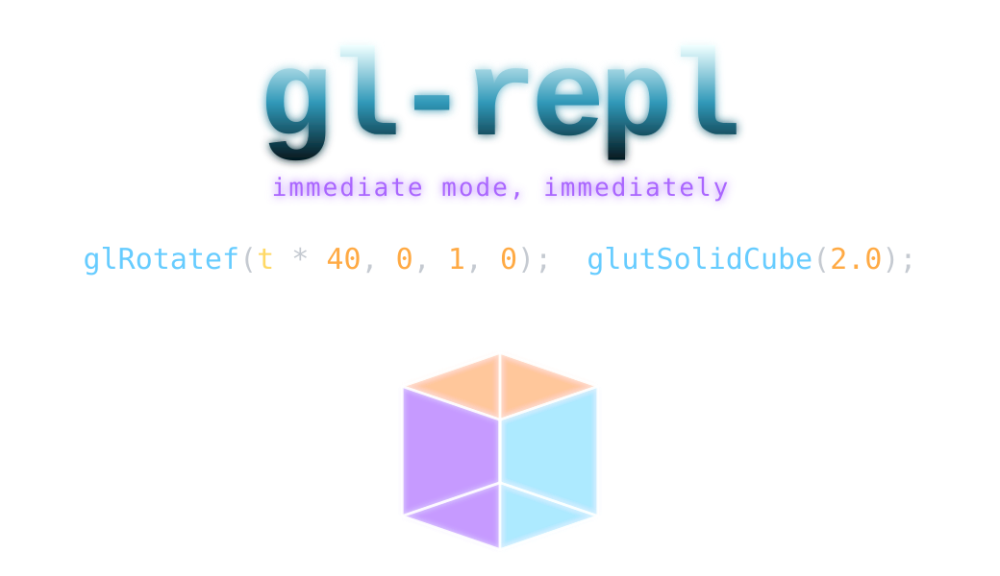

<div align="center">

<br>



<br><br>

**gl-repl**

<sub>Type a GL command. Press `;`. Watch it render.</sub>

<br>

</div>

<br>

An interactive interpreter for fixed-function OpenGL. You write one line of GL,
commit it, and the geometry appears immediately — beside the source that made
it. No build step. No shaders. No scene files. Geometry and color, nothing else.

<br>

```c
glRotatef(t * 30, 0, 1, 0);
glutSolidTeapot(1.0);
```

<sub>A teapot. It spins. The rotation rate is the number in front of `t`.</sub>

<br>
<br>

---

<br>

### Run

```bash
brew install freeglut     # macOS  ·  Linux: apt install freeglut3-dev
make sample
./sample
```

<br>

`./sample output.c` reloads a file. `./sample workspace/` loads a directory of
scenes. `make test` runs the suite.

<br>
<br>

---

<br>

### Idea

You only edit one thing: the **source**. The interpreter expands it into a
**flat** form — loops unrolled, functions inlined — and walks that flat form
every frame to emit real GL calls. The flat form is a cache. It is never
edited, only rebuilt, the moment the source changes.

<br>

```
   source  ──commit──▶  [ unchanged until you type ]
      │
      └──on edit──▶  flat  ──every frame──▶  screen
```

<br>
<br>

---

<br>

### Language

<table>
<tr><td valign="top" width="50%">

```c
glBegin(MODE);
glVertex3f(x, y, z);
glNormal3f(x, y, z);
glEnd();

glColor3f(r, g, b);

glTranslatef(x, y, z);
glRotatef(deg, x, y, z);
glScalef(sx, sy, sz);
```

</td><td valign="top" width="50%">

```c
glutSolidTeapot(s);
glutSolidSphere(r, sl, st);
glutSolidTorus(in, out, n, r);

glEnable(GL_LIGHTING);
glEnable(GL_LIGHT0);

float name;
var = sin(t * TAU);
for(i, 0, 12) { … }
```

</td></tr>
</table>

<sub>Math: `sin cos tan sqrt abs pow min max floor ceil fmod rem rand rand2`. Constants: `PI`, `TAU`. `t` is time.</sub>

<br>
<br>

---

<br>

### Keys

<table>
<tr>
<td><code>;</code></td><td>commit</td>
<td width="40"></td>
<td><code>Ctrl+T</code></td><td>toggle time</td>
</tr>
<tr>
<td><code>Tab</code></td><td>autocomplete</td>
<td></td>
<td><code>Ctrl+G</code></td><td>replay</td>
</tr>
<tr>
<td><code>↑ ↓</code></td><td>navigate</td>
<td></td>
<td><code>Ctrl+S</code></td><td>save</td>
</tr>
<tr>
<td><code>Ctrl+Z</code></td><td>undo</td>
<td></td>
<td><code>F1</code></td><td>help</td>
</tr>
<tr>
<td><code>Ctrl+F</code></td><td>find</td>
<td></td>
<td><code>F12</code></td><td>next example</td>
</tr>
</table>

<br>
<br>

---

<br>

<div align="center">

<sub>C99 · OpenGL 1.1 · freeglut · MIT</sub>

<br>

<sub><a href="ARCHITECTURE.md">Architecture</a> &nbsp;·&nbsp; <a href="MODULES.md">Modules</a> &nbsp;·&nbsp; <a href="AGENTS.md">Agents</a></sub>

<br>
<br>

</div>
