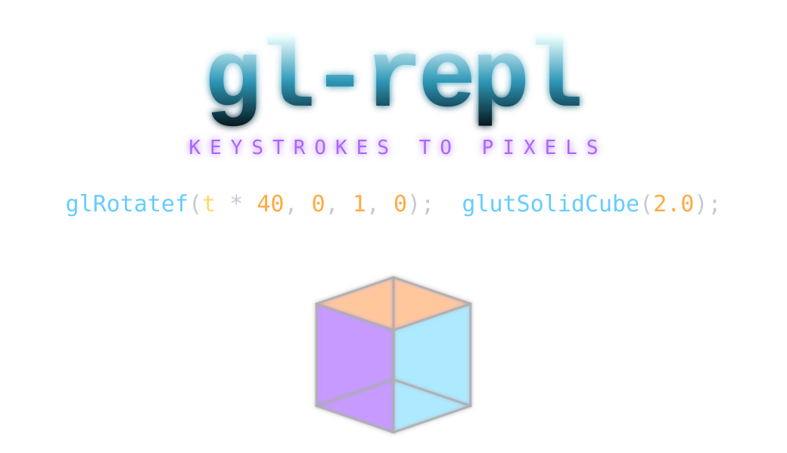

<div align="center">



<br>

# Showcase

<sub>What a few dozen lines of fixed-function OpenGL look like when the geometry lives in the code.</sub>

<br>

<sub>Every scene below ships in the binary. Cycle them with <b>F12</b>, or load one directly:</sub>

```bash
./sample --example "Torus knot (animated)"     # by name (case-insensitive)
./sample --example 15                          # or by index
./sample --list-examples                        # canonical names + indices
```

</div>

---

> [!NOTE]
> **Capturing these:** each GIF is one `--example` away. Load it, press `Ctrl+T`
> if it's animated, record ~6s, loop. Filenames below match the `` tags;
> the full shot list is in [`assets/README.md`](assets/README.md).

---

## ✦ Featured

A few scenes worth seeing with their source — note how short each one is. The
whole program is what you'd type into the REPL; there is no other file.

### Torus knot

A `(p, q)` knot traced as a single `GL_LINE_LOOP`, hue cycling along the curve.

<!-- TODO: GIF — ./sample --example "Torus knot (animated)" + Ctrl+T -->
<div align="center">

</div>

```c
n = 400;  p = 2;  q = 3;            // samples, winds around axis / through hole
glBegin(GL_LINE_LOOP);
  for(i, 0, n) {
    ang = TAU * i/n;
    rr = 2.0 + cos(q*ang);          // distance from the axis
    glColor3f(0.5 + 0.5*sin(ang + t), 0.5 + 0.5*sin(ang + t + 2), 0.5 + 0.5*sin(ang + t + 4));
    glVertex3f(rr*cos(p*ang), rr*sin(p*ang), sin(q*ang));
  }
glEnd();
```

---

### Snowfall — 550 deterministic particles

No particle system, no stored state. Each flake is a pure function of its index
and `t`, wrapped with `rem(...)`, so the whole field replays identically.

<!-- TODO: GIF — ./sample --example "Snowfall demo (550 particles)" + Ctrl+T -->
<div align="center">

</div>

```c
glPointSize(10);
glBegin(GL_POINTS);
  for (p, 0, 550) {
    drift  = driftMax * rand2(p, 1);
    flakeX = rem(wrapX * rand2(p,4) + t * drift,            2 * wrapX);
    fall   = fallBase - rand(p, 2);
    flakeY = rem(wrapY * rand2(p,3) + t * fall,             2 * wrapY);
    // depth → shade; nearer flakes brighter
    ...
  }
glEnd();
```

---

### Parametric torus

Two nested loops sweep a `GL_QUAD_STRIP` around the tube and the ring. The same
example exports cleanly to `.ply` (it's the one in `--export-ply` docs).

<!-- TODO: GIF — ./sample --example "Parametric torus (nested for)" ; slow camera orbit if you can -->
<div align="center">

</div>

```c
for(i, 0, n) {
  glBegin(GL_QUAD_STRIP);
  for(j, 0, n+1) {
    v = j*TAU/n;  u = i*TAU/n;
    glColor3f(sin(u)*0.4+0.6, cos(v)*0.4+0.6, 0.5);
    glVertex3f((R + r*cos(v))*cos(u), (R + r*cos(v))*sin(u), r*sin(v));
    u = (i+1)*TAU/n;
    glVertex3f((R + r*cos(v))*cos(u), (R + r*cos(v))*sin(u), r*sin(v));
  }
  glEnd();
}
```

---

### Recursive triangle tree

A `branch(depth, size, spin)` function that calls itself — recursion, inlined by
the flattener, capped at depth 64.

<!-- TODO: GIF — ./sample --example "Recursive triangle tree (func + recursion)" + Ctrl+T -->
<div align="center">

</div>

```c
branch(depth, size, spin) {
  glColor3f(0.25 + depth*0.14, 0.45 + 0.2*sin(spin), 1 - depth*0.12);
  glBegin(GL_LINE_LOOP);  /* the triangle */  glEnd();
  if(depth > 0) {
    /* recurse: shrink + rotate two children */
  }
}
```

---

## ✦ The full gallery

Grouped by what they show off. Load any with `./sample --example "<name>"`.

### Curves & line art

<table>
<tr>
<td width="33%" align="center">

<!-- TODO: GIF — "Animated spirograph curve" + Ctrl+T -->


**Animated spirograph**
<br><sub>epitrochoid swept by `t`</sub>

</td>
<td width="33%" align="center">

<!-- TODO: GIF — "Traveling ripple ring" + Ctrl+T -->


**Traveling ripple ring**
<br><sub>a wave running around a loop</sub>

</td>
<td width="33%" align="center">

<!-- TODO: GIF — "Animated ring (for + t)" + Ctrl+T -->


**Animated ring**
<br><sub>`for` + `t`, line loop + fan</sub>

</td>
</tr>
<tr>
<td align="center">

<!-- TODO: GIF — "Bezier curve with guides" -->


**Bézier curve**
<br><sub>with control-point guides</sub>

</td>
<td align="center">

<!-- TODO: GIF — "Scratch arrays (de Casteljau curve)" -->


**de Casteljau curve**
<br><sub>built with scratch arrays `A/B/C`</sub>

</td>
<td align="center">

<!-- TODO: GIF — "Annotated orbit plot (labels)" -->


**Annotated orbit plot**
<br><sub>bitmap `label(...)` text</sub>

</td>
</tr>
</table>

### Surfaces

<table>
<tr>
<td width="33%" align="center">

<!-- TODO: GIF — "Animated wave surface (analytic normals)" + Ctrl+T -->


**Animated wave surface**
<br><sub>analytic per-vertex normals</sub>

</td>
<td width="33%" align="center">

<!-- TODO: GIF — "Procedural terrain (rand grid + sin ripple)" + Ctrl+T -->


**Procedural terrain**
<br><sub>`rand` grid + `sin` ripple</sub>

</td>
<td width="33%" align="center">

<!-- TODO: GIF — "Lit cube" -->


**Lit cube**
<br><sub>lighting + material basics</sub>

</td>
</tr>
</table>

### Particles & blending

<table>
<tr>
<td width="50%" align="center">

<!-- TODO: GIF — "Glow sprites (blend + point attenuation)" + Ctrl+T -->


**Glow sprites**
<br><sub>additive blend + point attenuation</sub>

</td>
<td width="50%" align="center">

<!-- TODO: GIF — "Snowfall demo (550 particles)" + Ctrl+T -->


**Snowfall** *(featured above)*
<br><sub>550 deterministic flakes</sub>

</td>
</tr>
</table>

### Functions, branching & recursion

<table>
<tr>
<td width="33%" align="center">

<!-- TODO: GIF — "Function demo (named func)" -->


**Named function**
<br><sub>define once, reuse</sub>

</td>
<td width="33%" align="center">

<!-- TODO: GIF — "Function polygons (args + for)" -->


**Function polygons**
<br><sub>args + `for`</sub>

</td>
<td width="33%" align="center">

<!-- TODO: GIF — "Conditional colors (if + t)" + Ctrl+T -->


**Conditional colors**
<br><sub>`if` + `t`</sub>

</td>
</tr>
</table>

### Advanced

<table>
<tr>
<td width="33%" align="center">

<!-- TODO: GIF — "GLU tessellator (concave arrow)" -->


**GLU tessellator**
<br><sub>concave polygon (+ cutout variant)</sub>

</td>
<td width="33%" align="center">

<!-- TODO: GIF — "Transform stress (translate/rotate/scale guides)" -->


**Transform stress**
<br><sub>translate / rotate / scale guides</sub>

</td>
<td width="33%" align="center">

<!-- TODO: GIF — "Stress test (all features)" + Ctrl+T -->


**Stress test**
<br><sub>everything at once</sub>

</td>
</tr>
</table>

---

## ✦ Beyond the still image

The REPL isn't only a renderer — these are worth a GIF of the *interaction*:

<table>
<tr>
<td width="33%" align="center">

<!-- TODO: GIF — Ctrl+T toggling time on any animated example -->


**`Ctrl+T` — time**
<br><sub>everything written in `t` moves</sub>

</td>
<td width="33%" align="center">

<!-- TODO: GIF — Ctrl+R replay stepping through a scene with the fade trail + HUD -->


**`Ctrl+R` — replay**
<br><sub>watch the scene draw itself</sub>

</td>
<td width="33%" align="center">

<!-- TODO: GIF — dragging a variable slider and the scene responding live -->


**Live sliders**
<br><sub>drag a `float`, scene responds</sub>

</td>
</tr>
<tr>
<td align="center">

<!-- TODO: GIF — cursor on a transform line, the arc/arrow guide drawing in 3D -->


**Transform guides**
<br><sub>see what a `glRotatef` line does</sub>

</td>
<td align="center">

<!-- TODO: GIF — F11 export, then the .ply opened in MeshLab/Blender -->


**`F11` — `.ply` export**
<br><sub>take the geometry anywhere</sub>

</td>
<td align="center">

<!-- TODO: GIF — Ctrl+S then ./sample output.c reloading the same scene -->


**`Ctrl+S` — standalone C**
<br><sub>round-trips as `output.c`</sub>

</td>
</tr>
</table>

---

<div align="center">

<sub>· · ·</sub>

<sub>READMEs: <a href="../README-blueprint.md">blueprint</a> · <a href="../README-minimal.md">minimal</a> · <a href="../README-manpage.md">man page</a> · <a href="../README-cookbook.md">cookbook</a> · <a href="../README-field-guide.md">field guide</a></sub>

<br>

<sub>see also <a href="../../ARCHITECTURE.md">ARCHITECTURE.md</a> · <a href="../../MODULES.md">MODULES.md</a></sub>

</div>
