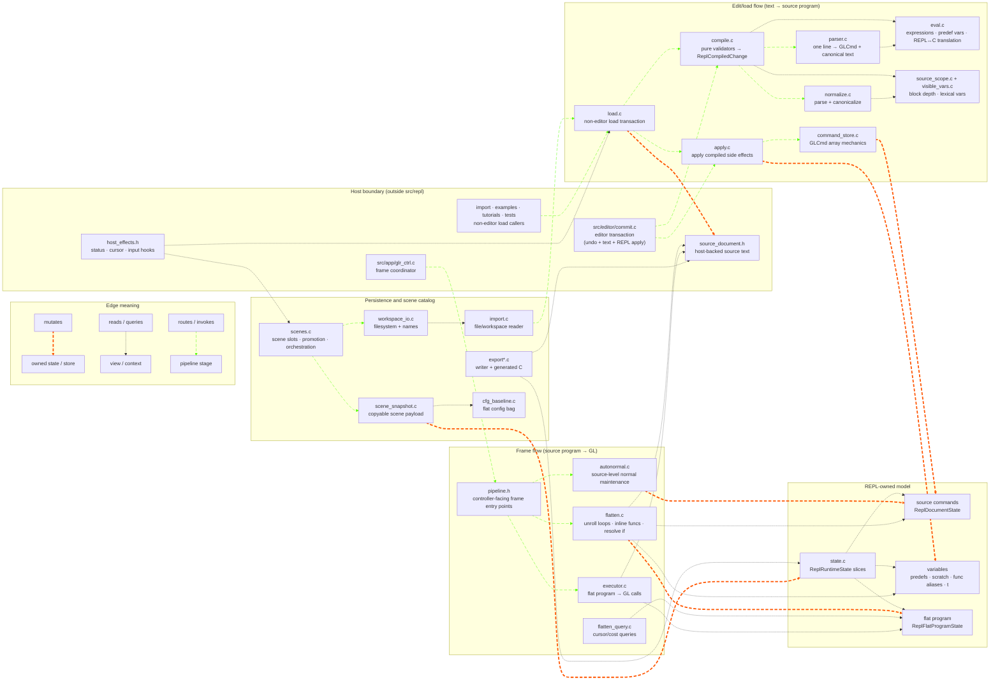
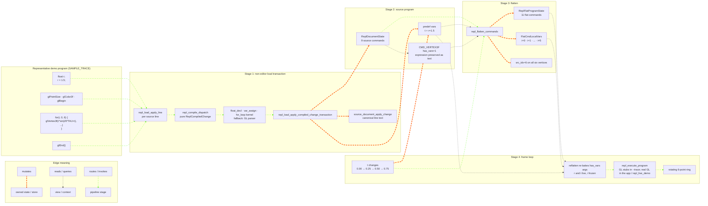

# `src/repl` - Architecture (Draft)

> The deep companion to [`README.md`](README.md). The README is the
> one-screen orientation ("what a REPL pipeline is, what files exist");
> this document is the working reference: the data model, the two
> end-to-end flows (commit and frame), each pipeline stage in detail,
> the state-ownership model, and the boundaries that keep this layer
> independent of the rest of the app.
>
> Whole-tree context lives in [`../../docs/MODULES.md`](../../docs/MODULES.md)
> (ownership map) and [`../../docs/ARCHITECTURE.md`](../../docs/ARCHITECTURE.md)
> (per-frame app narrative). This file never assumes you've read those -
> it describes `src/repl` as a self-contained interpreter.
>
> To *add* a command or new REPL syntax, see the step-by-step checklist and
> its structured-syntax companion in
> [`../../docs/ARCHITECTURE.md`](../../docs/ARCHITECTURE.md) - *Adding A New Command* and
> *Adding New REPL Commands*. This file is the why/how-it-works; those are the
> how-to.

---

## 1. The shape of the thing

`src/repl` is an **interpreter pipeline** for a small domain-specific
language. The language is a friendly subset of immediate-mode OpenGL -
`glBegin`/`glVertex3f`/`glColor3f`/`glRotatef`/… - plus light control
flow (`for`, `if`, `func0..func9`), scalar variables, and fixed scratch
arrays. The "effects" at the end of the pipeline are live GL calls that
draw geometry.

Strip away the editor and the screen and what remains is the textbook
interpreter shape:

```
source text ──parse──▶ commands ──compile/validate──▶ change ──apply──▶ program model
                                                                            │
                                                              ┌─────────────┘
                                                              ▼
                                          program model ──flatten──▶ flat program ──execute──▶ GL
```

The standard interpreter parts map cleanly onto files:

| Interpreter part | Here |
|---|---|
| Lexer / parser → AST | [`parser.c`](parser.c) → [`GLCmd`](command.h#L122) records |
| Symbol / spec table | [`command_spec.c`](command_spec.c) (per-command arity, arg kinds, highlight category) |
| Expression evaluator | [`eval.c`](eval.c) (recursive descent: `+ - * / %`, comparisons, `sin`/`cos`/…, variables) |
| Static validation / compile pass | [`compile.c`](compile.c) → [`ReplCompiledChange`](compile.h#L130) (**pure**; never mutates) |
| Mutation / "linker" | [`apply.c`](apply.c) + [`command_store.c`](command_store.c) (write the program model) |
| IR lowering | [`flatten.c`](flatten.c) (unroll loops, inline functions, resolve `if`) |
| Bytecode VM / executor | [`executor.c`](executor.c) (walk the flat program, emit GL) |

The defining design choice is the **two-level command model** (§3): the
source program (loops and calls intact) is lowered into a flat program
(everything unrolled and inlined) that the executor re-runs every frame.
Re-flattening per frame is what makes `t`-driven animation and live
variable edits take effect without an explicit recompile.

---

## 2. Two flows, one model

Everything in this directory serves one of two flows over the shared
program model in [`state.c`](state.c):

```
   EDIT FLOW (occasional, on user commit)        FRAME FLOW (every frame, 60 Hz)
   ─────────────────────────────────────        ──────────────────────────────
   input text                                    is the program dirty?
      │ parse + compile  (pure)                      │ yes → flatten + autonormal
      ▼                                              ▼
   ReplCompiledChange                             flat program
      │ apply            (mutates runtime state)     │ execute
      ▼                                              ▼
   source command array  ───────dirty flag────────▶ GL calls (pixels)
```

- The **edit flow** turns a line of text into a validated mutation of
  the *source* command array, and marks the flat program dirty.
- The **frame flow** rebuilds the *flat* program from source when dirty,
  then walks it emitting GL.

The two flows are deliberately decoupled by the dirty flag: editing
never touches GL, and rendering never re-parses text it doesn't have to.

### Component interaction map



---

## 3. The two-level command model

This is the core data structure. Read this section before anything else.

### 3.1 [`GLCmd`](command.h#L122) - the universal command record

A single [`GLCmd`](command.h#L122) ([`command.h`](command.h)) represents one command in *either* level.
It is a **pure parse result** - it carries type, evaluated args, flags,
and provenance, but **no source text**. The per-line canonical text
lives in the editor's buffer, not here. That omission is what keeps the
pipeline editor-agnostic (and is what lets the standalone demo supply
its own line store).

```c
typedef struct {
    CmdType  type;             // CMD_VERTEX3F, CMD_FOR_BEGIN, …  (command.h enum)
    float    args[8];          // evaluated numeric args; GL enums stored here too
    int      num_args;
    int      var_idx;          // predef slot for CMD_VAR_ASSIGN
    int      valid;            // deleted commands stay allocated but skipped
    int      is_auto;          // synthesized (e.g. auto-normal)
    int      has_vars;         // expr references vars → must re-evaluate from text
    union { … } payload;       // tagged on type: decl / assign / label / matrix
    // provenance - see 3.3
    int      src_cmd_idx, call_src_cmd_idx, root_call_src_cmd_idx;
    unsigned func_scope_mask;
    int      call_depth;
} GLCmd;
```

Two design notes worth internalizing:

- **There is no `mode` field.** Every enum-backed command (`glEnable`,
  `glDepthFunc`, even the hand-rolled `glMaterialfv`/`glPointParameterfv`
  branches) stores its GL enums in `args[]` alongside numeric args.
  GLenums in use are `< 2^24`, so `(GLenum)args[i]` round-trips through
  float32 losslessly. The *absence* of the field is the
  compiler-enforced invariant - no grep guard needed.
- **`payload` is a tagged union** keyed on `type`: `payload.decl` for
  `CMD_VAR_DECLARE`, `payload.assign` for `CMD_VAR_ASSIGN`, `payload.label`
  for `CMD_LABEL`, and `payload.matrix` for `CMD_MULT_MATRIXF`; it is zeroed
  for everything else. The assignment arm preserves a flat local target's
  pre-write value for replay expansion because the regular local snapshot is
  post-write. The union saves ~64 bytes/command vs. side-by-side fields.

[`CmdType`](command.h#L44) ordering is **append-stable**: switch dispatch in [`executor.c`](executor.c),
[`flatten.c`](flatten.c), [`parser.c`](parser.c), and [`replay_annotations.c`](../subsystems/replay/replay_annotations.c) keys on these values,
so a new command goes next to its relatives - never reorder existing
entries. [`command.h`](command.h) also exposes the *control-flow taxonomy* as inline
predicates (`repl_cmd_is_transform`, `repl_cmd_emits_vertex`,
`repl_cmd_is_block_head/_end`, `repl_cmd_is_glut_solid`,
`repl_cmd_starts_geometry_emit`, `repl_cmd_consumes_current_color`).
These are a separate axis from [`CmdSyntaxCategory`](command_spec.h#L152) in [`command_spec.h`](command_spec.h),
which is the *visual* (syntax-highlight) taxonomy - don't fold one
through the other.

### 3.2 Source array vs. flat array

| | Source array | Flat array |
|---|---|---|
| Accessor | `repl_state_document_cmds()` / `_count()` | `repl_state_flat_program_cmds()` / `_count()` |
| Contents | what the user wrote: loops, calls, `if` intact | fully expanded: loops unrolled, funcs inlined, `if` resolved |
| Mutated by | the **edit flow** (compile → apply) | the **frame flow** (`flatten`) |
| Lifetime | persists across frames | rebuilt whenever dirty |
| Capacity | `MAX_EDITOR_COMMANDS` (1024) | `MAX_FLAT_COMMANDS` (8192) |

A `for(i, 0, 4) { glVertex3f(i,0,0) }` is **three** source commands
(`CMD_FOR_BEGIN` / body / `CMD_FOR_END`) but **four** flat commands (one
`CMD_VERTEX3F` per iteration). The 8192 flat cap is the real budget -
example authors hoist loop-invariant work to stay under it.

### 3.3 Provenance: mapping flat → source

Each flat command remembers where it came from so cursor highlighting,
guides, replay, and cost attribution can map a flat command back to the
line that produced it:

- `src_cmd_idx` - the owning *source* line.
- `call_src_cmd_idx` - the immediate call site that expanded it.
- `root_call_src_cmd_idx` - the outermost call site in nested expansion.
- `func_scope_mask` - bitset of `funcN` scopes active at flatten time
  (a *set*, so it can't count repeated recursive entries of one slot).
- `call_depth` - every call frame counted (so recursion depth *is*
  visible, unlike the mask).

[`flatten_query.c`](flatten_query.c) reads these to answer "how much of the flat budget is
spent on the line under the cursor?" (a loop body counts once per
iteration; a function counts across all call sites). `--flat-histogram`
surfaces it on the CLI.

### 3.4 Per-flat-command local variable snapshots

Loop counters, function parameters and function-scoped locals don't exist in
the source command's own scope. When [`flatten.c`](flatten.c) emits a flat command, it snapshots
the live lexical bindings into a parallel [`FlatCmdLocalVars`](flatten.h#L43) array
([`repl_state_flat_program_local_vars()`](state_views.h#L179)):

```c
typedef struct {
    int num_vars;
    ExprVar vars[MAX_EXPR_VARS];
    int num_active_loops;
    FlatCmdActiveLoop active_loops[MAX_EXPR_VARS];
} FlatCmdLocalVars;
```

The re-evaluation itself happens at *flatten* time, not execution time:
each re-flatten evaluates a `has_vars` command's argument expressions with
the loop / call bindings live on its own walk - that's how `glVertex3f(i,
sin(t), 0)` inside a loop gets both the right `i` (per unrolled iteration)
and the right `t` (live each frame, because a playing `t` re-flattens per
frame - §3.5, §13.2). The executor consumes the baked `args[]` untouched
(§5.3). The stored snapshot array serves consumers that must reconstruct a
flat command's scope after the fact - replay's value-tracing annotations
read it to display per-instance bindings. The separate `active_loops` list is
dynamic ancestry rather than lexical scope: it follows calls so a loop header
can still show its iterator while replay is executing in a callee, without
making a caller's iterator visible to expressions inside that callee. When
recursion activates the same source loop more than once, the innermost entry
wins.

Replay associates an earlier assignment with the active invocation using
stable flat-command provenance (`func_scope_mask`, `call_depth`, immediate and
root call sites) plus nearest-earlier execution order. It must never compare
`FlatCmdLocalVars` values for that match: those values are effective command
state and therefore change after every local assignment within one invocation.

The snapshot is *frozen* at emit time, and that is what makes function-local
dataflow structural rather than value-only: `rebake_one_cmd` re-evaluates an
assignment against the snapshot it captured and has no way to thread a local's
new value into the snapshots of the commands after it. So every dependency
feeding an assignment whose resolved target is a local is reported structural
(§5.2), forcing a full reflatten instead of an in-place rebake.

### 3.5 The dirty flags and value-change routing

Frame flow is gated by a full-dirty flag plus a *value-change* channel, both on
[`ReplFlatProgramState`](state_views.h#L52) ([`state_views.h`](state_views.h)):

- `ReplDocumentState.normals_dirty` - source-level auto-normals need a
  rebuild.
- `ReplDocumentState.source_uses_time` / `_dirty` - lazy whole-source scan for
  real `t` identifier references. It no longer gates the flat-program dirty
  decision (see below); it now feeds only the *blur-axis* choice (does the
  scene animate on `t` at all, §Accumulation Motion Blur).
- `ReplFlatProgramState.dirty` - the flat program is stale and needs a full
  re-flatten (source edits, declare/undeclare, structural value changes).
- `ReplFlatProgramState.args_dirty_mask` / `structural_dep_mask` /
  `value_dep_mask` / `rebake_ok` - the phase-3 dependency-routing state. Each
  full flatten records, per predef root, which roots can change flat-stream
  *topology* (`structural`) versus only baked *values* (`value`), and whether
  every `has_vars` command has compiled programs (`rebake_ok`).

Source mutations still mark the whole program dirty via
[`repl_state_mark_flat_dirty()`](state_notify.h#L4) /
[`repl_state_mark_source_dirty()`](state_notify.h#L5) ([`state_notify.h`](state_notify.h)).
A predef *value* change (a time tick, a slider-drag `SET_VALUE`) instead routes
through [`repl_state_notify_predef_value_changed()`](state_notify.h) by the changed
slot's bit:

```text
changed ∈ structural_dep_mask  -> full dirty (args_dirty_mask cleared)
changed ∈ value_dep_mask       -> OR the bit into args_dirty_mask (rebake)
                                  (escalates to full dirty when !rebake_ok)
otherwise                      -> no flat work (root unused by this program)
```

At frame top the controller re-flattens when `dirty` is set, otherwise re-bakes
in place when `args_dirty_mask` is non-empty (§Phase-3b rebake), otherwise does
nothing. A full flatten always clears `args_dirty_mask` - it subsumes any
pending value dirt. The source-uses-time cache is still refreshed lazily on the
next time query, for the blur-axis use.

This routing has a larger effect on **Accum Blur** than its single-refresh
timings suggest. Time blur samples 2/4/8/12/16 transient `t` values per
displayed frame and calls
[`repl_refresh_flat_program_for_deps()`](pipeline.h#L26) for every sample. For a stable-topology
scene, Phase 3 turns all of those refreshes into in-place rebakes; only a
structural `t` dependency requires full flattening. The avoided work therefore
scales with the accumulation-pass count. Testing shows this is the practical
enabler for time blur on most examples, particularly under Emscripten, rather
than merely a roughly 0.2 ms refinement to an ordinary one-sample frame.

The Compute Profile reports that multiplied cost as a displayed-frame total:
the initial refresh and every time-blur subframe refresh are accumulated into
one **Flatten** or **Rebake** sample and committed after the last subframe.
Flatten's `reparse` / assignment children follow the same frame scope. Rebake's
`eval walk` child measures the existing-flat-stream expression evaluation and
argument writes with one timing bracket per rebake, leaving the parent-only
remainder as value-table snapshots, rollback, and refresh bookkeeping.
Refreshes outside the display frame (exports, diagnostics, replay freshness,
and benchmarks) still publish one profiler sample per call.

---

## 4. The edit flow (compile → apply)

A committed line of text becomes a validated change to the source array
in two strictly separated phases.

### 4.1 Compile is pure; apply mutates

[`compile.c`](compile.c) contains the static-validation pass. Its contract is
absolute and machine-checked:

> A `repl_compile_*` function is **pure**: no editor mutation, no
> command-store mutation, no status mutation, no undo entry. It returns
> a [`ReplCompiledChange`](compile.h#L130) describing what *should* happen, or fills an
> `err` buffer.

The compiler reads everything it needs from a [`ReplCompileContext`](compile.h#L178)
snapshot (current cmds, edit line, source-scope view, predef table,
func aliases) - it never reaches into REPL globals. Build one with
`repl_compile_context_from_live(edit_line_idx)`; the caller supplies the
cursor because pipeline code does not call editor accessors.

[`apply.c`](apply.c) is the dual. [`repl_apply_compiled_change()`](apply.h#L74) mutates the
REPL runtime command array **only** - it does not touch source text,
status, undo, predef registrations, or aliases. Those cascades are
separate calls (`repl_apply_predef_ops`, `repl_apply_scratch_ops`,
`repl_apply_alias_ops`) so the orchestrator can sequence them correctly
relative to undo capture.

### 4.2 [`ReplCompiledChange`](compile.h#L130) - the descriptor

A compiled change ([`compile.h`](compile.h)) is a *source-command-level* plan, not a
flat program. Its `kind` selects the meaningful fields:

| Kind | Meaning |
|---|---|
| `REPL_COMPILED_NO_CHANGE` | nothing to mutate (may still carry predef side-effects) |
| `REPL_COMPILED_INSERT_ONE` | insert `cmds[0]`/`text[0]` at `pos` |
| `REPL_COMPILED_REPLACE_ONE` | replace cmd at `pos` |
| `REPL_COMPILED_INSERT_MANY` | insert `cmds[0..count)` at `pos` |
| `REPL_COMPILED_DELETE_RANGE` | delete `count` cmds from `pos` |

Beyond the source edit it carries replayable side-effect lists:

- `predef_ops[]` - `DECLARE` / `UNDECLARE` / `SET_VALUE` against the
  variable table. Apply runs `UNDECLARE`s first and cascades
  `CMD_VAR_ASSIGN.var_idx` compaction when a slot is freed.
- `scratch_ops[]` - writes to `A`/`B`/`C[]`.
- `alias_op` - a pending `funcN` alias publish.
- An optional **pre-insert delete** (`delete_pos`/`delete_count`) lets a
  single atomic plan express "delete a range, then insert at a new
  position" (used by block comment-toggle). `pos` is in *post-delete*
  coordinates - compile does that math so apply doesn't.

This descriptor is the seam that decouples validation from mutation:
tests and the demo can compile-and-inspect without ever mutating state.

### 4.3 The compile dispatcher and handler order

[`repl_compile_dispatch()`](compile.h#L286) walks per-kind validators in **canonical
order** and returns the first non-`NO_CHANGE` result:

```
float_decl → var_assign → if_branch → close_brace → for_loop → func_def → if_block
```

The order is load-bearing: `float_decl` **must** precede `var_assign`,
or `float x;` parses as an assignment to an identifier named `float`.
`if_branch` **must** precede `close_brace`, or `} else ...` lines are
consumed as plain block closes before the branch-separator grammar sees
them.
`NO_CHANGE` from all handlers means "not a statement I own" - the caller
falls through to the generic GL [`parser.c`](parser.c).

Block constructs share a **kernel** (`repl_compile_*_kernel`) between two
callers: the lean loader's thin wrapper and the editor's richer wrapper
(which adds header-replace, one-liner-body, and paired-end branches).
The kernel does the parse/validate work; the wrappers shape it into the
right [`ReplCompiledChange`](compile.h#L130). This is why import, examples, and live typing
all agree on what a valid `for(...)` is.

### 4.4 The two apply paths

The compile/apply pair is wired into two orchestrators, each owning its
own text-mutation step:

```
Editor-input commit            (src/editor/commit.c)
    editor_undo_begin
    editor_buffer_apply_compiled_change   // EditorState text
    repl_apply_compiled_change            // REPL runtime cmd store
    repl_apply_alias_ops                  // func aliases
    editor_undo_commit

Lean source loader             (src/repl/load.c)
    repl_load_apply_compiled_change_transaction
        source_document_apply_change      // neutral text port
        repl_apply_compiled_change        // REPL runtime cmd store
        repl_apply_alias_ops              // func aliases
```

[`load.c`](load.c) is the non-editor entry: the importer, example loader, tutorial
comment injector, and tests call [`repl_load_apply_line()`](load.h#L78), which picks an
insertion index, compiles the line, and applies it without touching any
editor input widget. Keeping it separate from [`compile.c`](compile.c) preserves the
purity boundary - [`compile.c`](compile.c) only *describes* changes; [`load.c`](load.c) owns the
apply orchestration.

[`command_store.c`](command_store.c) underneath is the lowest layer: pure [`GLCmd`](command.h#L122) array
mechanics (insert/replace/delete/load, range normalization, capacity
checks). It owns array shifting and bounds; callers own parsing, undo,
variable registration, and cursor policy. Cursor shifting is opt-in per
call via `ReplStoreMutOpts.cursor_inout` - the store never holds a cursor
pointer.

---

## 5. The frame flow (flatten → autonormal → execute)

Driven once per frame from the controller via [`pipeline.h`](pipeline.h) entry points,
before render3d renders.

### 5.1 Autonormal maintenance

[`autonormal.c`](autonormal.c) keeps `glNormal3f` commands in sync with the geometry, at
the **source** level. When enabled and `normals_dirty` is set,
[`repl_recompute_autonormals()`](pipeline.h#L51) recomputes face normals (cross product of
triangle edges, normalized) and inserts/updates `is_auto` `CMD_NORMAL3F`
commands ahead of the vertices that feed them. Because it edits the
source array (and can shift the cursor), it runs *before* flatten and
takes the edit-line by reference.

The caller passes a `ReplAutoNormalMode`, not a flag.
`REPL_AUTONORMAL_FACE` is the walk above. `REPL_AUTONORMAL_SMOOTH` runs a
separate accumulate-and-weld pass instead: each face adds its *unnormalized*
normal (magnitude = 2x area, so the average is area-weighted) to every one of
its own vertices, coincident positions within the block are welded so a corner
repeated as several `glVertex3f` lines shades as one, then each sum is
normalized. The weld matches positions **exactly**, on the float bit patterns
(±0 canonicalized), through a per-block open-addressed table - the coordinates
are parsed source literals, so the same corner written the same way is bit-equal,
and exactness is what keeps the pass linear instead of an O(nv²) tolerance sweep
that a large unrolled mesh could not afford. A position that matches nothing
keeps its own face normal, so a break in the geometry stays flat-shaded exactly
at the break.

Tessellator contours are a third walk, entered on `CMD_TESS_BEGIN_CONTOUR`.
They get **one** `is_auto` `CMD_TESS_NORMAL` at the top of the contour, not one
per `CMD_TESS_VERTEX`: GLU re-triangulates the contour into faces with no 1:1
correspondence to the `gluVertex` rows, so the contour is the only unit a
synthesized normal can describe - which is also why `REPL_AUTONORMAL_SMOOTH`
routes here unchanged (a contour is planar, so averaging within it returns the
contour normal). The normal comes from Newell's method over every edge rather
than a cross product of the first three vertices, because a contour is an
arbitrary polygon whose leading vertices may be collinear or locally concave;
the immediate-mode `GL_POLYGON` case deliberately keeps its first-three cross
product so existing scenes' normals do not move. A hand-written `gluNormal`
anywhere in the contour suppresses the pass for that whole contour. The two passes stay separate functions - the face walk leans on
per-primitive "which vertex owns this face" rules that stop meaning anything
once a vertex can hold several faces. Both modes emit one normal row per
vertex, so switching modes rewrites the existing `is_auto` rows in place
rather than inserting a second set.

### 5.2 Flatten - lowering source to flat

[`repl_flatten_program()`](flatten.h#L141) ([`flatten.c`](flatten.c)) expands the source array into the
flat array:

- **for-loops** iterate `[start, end)` by `step`, half-open, re-parsing
  the body each iteration with the loop var bound. The iterator is prepended to
  a *fresh* scope array per nesting level, and the outer entries are copied back
  out after each pass - without that, a local accumulated inside the loop would
  reset every iteration;
- **function calls** (`CMD_CALL`) inline the matching `CMD_FUNC_DEF`
  body into a **lexical** frame: the callee's parameters bound to the actual
  args (evaluated in the caller, before the frame exists), then the callee's own
  `float` declarations at `0.0f`. Nothing of the caller's scope is copied in -
  a caller local must not hide a global the callee reads, which is what the
  exported C would do - and the frame is never copied back, so recursion is
  isolated by construction;
- **if-blocks** evaluate the `if` condition, then same-depth
  `CMD_ELSE_IF` separators in source order, then the optional
  `CMD_ELSE`, emitting only the first selected arm.

Expansion is recursive and **bounded**:

- `MAX_FLATTEN_CALL_DEPTH = 64` - recursion depth ceiling.
- `MAX_FLATTEN_VISIT_BUDGET = 200000` - total command visits, so one
  runaway loop can't hang the frame.

On overflow it returns `ok = 0` with a status message and leaves the
prior flat program in place. Every emitted flat command gets its
provenance (§3.3) and a [`FlatCmdLocalVars`](flatten.h#L43) snapshot (§3.4).

#### Expression paths and cache lifecycle

Flatten has one control-flow walk and several progressively cheaper expression
paths. They all produce the same baked [`GLCmd`](command.h#L122) stream:

1. A command whose `has_vars` is 0 is appended verbatim from the committed
   source array. `has_vars` is decided at commit time against predefs and the
   enclosing loop/function bindings, so its baked args cannot change between
   frames. The enclosing [`FlatCmdLocalVars`](flatten.h#L43) snapshot is still
   recorded for replay annotations.
2. On an uncached variable-bearing numeric command, the direct evaluator uses
   the committed command type/arity to extract and evaluate only the known
   argument list. Scalar assignments similarly evaluate their already
   canonical REPL RHS. Unsupported shapes fall through to the general parser,
   with `ReplParseContext.skip_text` suppressing unused canonical rendering.
3. With a READY cache line, compiled expression programs evaluate those same
   argument, condition, loop-bound, call-argument, and assignment roles. The
   loop/call/branch walk itself is never cached or replaced by a VM.

[`expr_program.c`](expr_program.c) owns the expression bytecode and arena-backed
per-line index. [`flatten_expr.c`](flatten_expr.c) is the narrow integration
boundary: it owns line build state, parser capture callbacks, warm evaluation,
dependency accumulation, and compiled-only rebake lookups.
[`flatten.c`](flatten.c) asks it for values by `(source line, expression role,
ordinal)` and does not manipulate program handles or cache entries.

The live cache is ephemeral process state returned by
[`repl_expr_cache_live()`](expr_program.h#L105); it is deliberately outside
[`ReplRuntimeState`](state.h#L18), undo snapshots, scene snapshots, and saved
workspaces. Its allocation is capped by `REPL_EXPR_CACHE_MAX_BYTES` (16 MiB by
default), and a warm evaluation allocates nothing. Each source line is in one
of three externally visible states:

- **EMPTY** - not attempted since the last invalidation. The next text/direct
  visit installs a capture sink and compiles the exact expression spans that
  visit consumes.
- **READY** - all captured programs for the line compiled; later full
  flattens and eligible rebakes use them directly.
- **FAILED** - parsing, compilation, capture, or the allocation cap failed.
  Full flatten keeps using the direct/text fallback for that line. Rebake never
  guesses from a FAILED/stale line; it escalates through the refresh boundary
  to a full flatten.

Source mutation invalidates the whole live expression cache at the single
[`repl_state_mark_source_dirty()`](state_notify.h#L5) seam. Inserts/deletes therefore need no cache
index surgery. Example/workspace loads, undo/redo, declaration reshapes, and
source rewrites already cross that seam. Variable-slider motion changes only a
live predef value and keeps the cache warm; its one release-time declaration
rewrite invalidates the cache normally. FAILED lines become EMPTY and may be
attempted again only after such an invalidation.

Compiled evaluation also returns a predef dependency mask. A full flatten
stores the union of structural dependencies (loop bounds, selected conditions,
and frozen call-argument locals), value dependencies, and whether every
variable-bearing emitted command is rebakeable. The live
[`repl_refresh_flat_program()`](pipeline.h#L22) boundary then chooses:

- full dirty or a changed structural root → full flatten;
- changed value-only root with complete READY programs → in-place rebake;
- no relevant changed root → no flatten work.

Assignments are replayed in flat-stream order during rebake, including
constant assignments: although a constant assignment's own baked arg does not
change, its write may reset the input to a later self-referential assignment.
Any failed partial rebake restores predef/scratch state and full-flattens before
the refresh boundary returns.

A scalar assignment resolves its target *lexically* on every flatten visit
rather than trusting the `var_idx` frozen onto the source command at commit
time. `var_idx` is a storage hint, not the authority: inserting a legal local
over an existing global has to retarget older assignment rows without rewriting
them. The first name match in the ordered scope array decides - LOCAL writes the
frame slot and its dep mask, PARAM or LOOP fails the flatten defensively (the
edit guards exist to keep that state unreachable), and no scoped match keeps the
predef path. When the resolved target is a local, the RHS dependencies are
reported **structural** (§3.4), so any predef change that can reach a local
forces a full reflatten rather than a value-only rebake.

Both halves of that resolution are made pay-for-use, because it runs per
assignment per visit - grass pays it 3645 times per flatten:

- **The scan runs only inside a frame that binds a local.** `flatten_call` is
  the only place a LOCAL binding enters a frame, so it computes
  `ctx->frame_has_locals` once and saves/restores it around the callee's body;
  loops and if-blocks inherit it (they add LOOP bindings and nothing else).
  With no LOCAL in the array the resolution provably yields "no scoped match",
  so the persisted `var_idx` is already the answer. Release and debug take the
  same branch - `GLR_DEBUG_CHECKS` builds additionally run the full resolution
  on the skipped path to keep looking for the unreachable PARAM/LOOP target and
  for a `frame_has_locals` that has drifted from the frame it summarises.
- **The LHS name itself is memoised per source row** on the expression cache
  (`repl_expr_cache_line_lhs_*`), since it is a pure function of the row's text
  and inherits that cache's single invalidation seam
  (`repl_state_mark_source_dirty`). The memo is deliberately independent of the
  row's program state - the name is well defined on a cold, failed, or
  never-compiled row - and the `force_reparse` differential reference never
  reads it.

#### Disabling the expression cache

There are three intentional disable/reference modes:

| Scope | Mechanism | What remains enabled |
|---|---|---|
| Live application/benchmark process | Start with `GLR_NO_FLATTEN_CACHE=1` | Literal and direct-evaluation fast paths remain; every relevant value change full-flattens and no rebake is attempted. |
| One [`repl_flatten_program()`](flatten.h#L141) call | Set `ReplFlattenOptions.expr_cache = NULL` | Same cache-free direct/text behavior, without changing the live cache or other callers. |
| Strong differential reference | Set `force_reparse = 1` (normally with `expr_cache = NULL`) | Disables the literal/direct paths as well as compiled evaluation and forces the legacy general-parser path. |

`GLR_NO_FLATTEN_CACHE` is a diagnostic/startup switch, not a live toggle: it
is read once on the first live flatten, so restart the process after changing
it. There is no file-format or UI setting. The cache-free mode is a supported
correctness/performance reference, exercised alongside cold- and warm-cache
paths by
[`tests/test_repl_flatten_differential.c`](../../tests/test_repl_flatten_differential.c).

The live frame path goes through `repl_flatten_commands(edit_line_idx)`, but
the engine is reusable: tests and replay tools flatten into a *temporary*
buffer and pass a [`FlatProgramView`](flatten.h#L58) over it, never touching
the live arrays.

### 5.3 Execute - flat program to GL

[`repl_execute_program()`](executor.h#L199) ([`executor.c`](executor.c)) walks `flat_cmds[0..count)`
emitting GL. Key behaviors:

- **Baked args only.** Every command renders from its flatten-baked
  `args[]` - the executor never evaluates expression text. `sin(t*speed)`
  animates because a playing `t` marks the flat program dirty and the
  per-frame re-flatten re-bakes `has_vars` args (§3.5, §13.2), not because
  of any execute-time re-evaluation.
- **Matrix-stack tracking.** `repl_executor_apply_tracked_transform_cmd`
  maintains a depth counter (push++/pop--) that overlays read to color
  geometry by transform depth. The GL matrix stack - not [`GLCmd`](command.h#L122) - is the
  canonical transform truth at execution time.
- **Replay clamp.** The caller passes `flat_cmd_count` (full count, or
  the replay program counter when replay is active) so only commands up
  to the PC render.
- **A cursor API** (`repl_exec_cursor_begin/step/end/...`) exposes the
  same machinery one command at a time, so specialized passes (replay
  fade batches, the `.ply` feedback capture, the hidden-line wireframe
  pass) drive normal REPL semantics while skipping pass-local commands.
- **Point-size portability.** When the GL context lacks
  `glPointParameterfv`, the executor falls back to scaling `glPointSize`
  by `REPL_POINT_SIZE_REF_DIST / camera_distance` via a
  controller-installed `ReplExecutorCameraDistanceFn`. The hardware path
  and software path share `REPL_POINT_SIZE_REF_DIST` so they can't drift.
- **Feedback-normal encoding.** With `encode_feedback_normals` set (the
  PLY export pass), the executor mirrors each vertex's world-space normal
  into the texcoord channel and brackets primitives with `glPassThrough`
  markers, so the mesh writer can distinguish authored normals from
  synthesized ones.

[`executor.c`](executor.c) is the **only** live-GL translation unit in this layer.

---

## 6. Runtime state and ownership

### 6.1 [`ReplRuntimeState`](state.h#L18) - the owned slices

[`state.c`](state.c) owns the process-global REPL runtime, exposed as a struct of
typed slices ([`state_views.h`](state_views.h)):

| Slice | Holds |
|---|---|
| [`ReplDocumentState`](state_views.h#L42) | source `GLCmd[]`, count, capacity, `normals_dirty`, cached source-uses-`t` metadata |
| [`ReplFlatProgramState`](state_views.h#L52) | flat `GLCmd[]`, `FlatCmdLocalVars[]`, dirty flag, cursor-block range, user-lighting flag |
| [`ReplVariableState`](state_views.h#L84) | predef var table, scratch arrays `A/B/C`, `funcN` aliases, the `t` clock (`anim_time`, `time_playing`) |
| [`ReplRenderState`](state_views.h#L118) | the runtime-mutated render *tail*: `light_enabled_mask`, `clear_color[]` |
| [`ReplSceneRuntimeState`](state_views.h#L140) | active example index, bound workspace dir |
| [`ReplImportExportState`](state_views.h#L149) | cached header/render/camera text + pending import metadata |

[`repl_state_capture()`](state.h#L29) / [`repl_state_restore()`](state.h#L30) snapshot exactly these
slices - and nothing else (no editor, UI, replay, or app presentation
state).

### 6.2 The views/owners split

State access is intentionally two-tiered:

- **[`state_views.h`](state_views.h)** - read-only, by-value getters
  (`repl_state_document_cmds()`, `repl_state_variables()`, …). Safe to
  include from `render3d_*` and `ui_*`.
- **[`state_owners.h`](state_owners.h)** - mutable `_mut()` / `_writable()`
  owner accessors, setters, and reset helpers. For owner modules and the
  controller only; broad command-array mutators are intentionally absent.

[`repl_state_ensure_sentinels()`](state_owners.h#L132) patches the non-zero defaults (most
importantly the array capacities - under raw BSS zero-fill they'd be 0
and reject every insert). It's idempotent and matters for CLI paths like
`--dump-code` that skip `glr_ctrl_init_gl`.

### 6.3 What this layer does *not* own

The render slice is a tail, not the whole picture. Dimensional light data
(positions/colors/eye-space), and policy toggles (MSAA, line smoothing,
accumulation AA, grid/axes visibility) are **app-owned** in `glr_state` -
the REPL only tracks *which light slots the program enabled* as a
bitmask. Likewise the **edit-line cursor** is editor-owned; pipeline code
receives it as a parameter or through the host bridge (§7), never from a
REPL accessor. These exclusions are enforced by guards (§10).

---

## 7. The host-effects bridge

`src/repl` must not link the editor, UI, or app shell - but loader,
scene-switch, snippet-import, and replay code legitimately need host
actions (clear the input buffer, scroll the panel, set a status message,
read/write the cursor). The bridge ([`host_effects.h`](host_effects.h)) is how it asks for
those *by purpose* without naming an implementation.

The controller installs a [`ReplHostEffects`](host_effects.h#L37) table once at startup; REPL
code calls dispatchers (`repl_dispatch_*`, `repl_set_status`,
`repl_set_status_error`). **Any unset callback is a no-op** - which is
exactly why pure REPL tests and the standalone demo "just work" with no
host: status messages go nowhere, `edit_line_get` returns 0,
`edit_line_set` does nothing.

What flows through it: status / error messages, example-presentation
reset (with the example's tag mask), input reset, insert-mode-off,
scroll-to-line, tutorial teardown, edit-line get/set, cursor parking,
completion clear/update, input read, and time-playing toggle.

The export path uses the same pattern with dedicated bridges
([`ReplExportLightBridge`](export.h#L176), cfg/camera bridges) so [`export.c`](export.c) can emit
live light/config/camera state without including any render3d or app
header - verified by `check-repl-export-via-bridge`.

---

## 8. Variables, scratch arrays, and time

[`eval.c`](eval.c) is a recursive-descent expression evaluator over floats:
binary `+ - * / %`, unary minus, parens, comparisons, the math function
set (`sin`, `cos`, `sqrt`, `pow`, `min`, `max`, `floor`, `fmod`, `rand`,
`rand2`, …), and constants (`PI`, `TAU`, `e`). It also translates between
the two accepted surface syntaxes:

```
REPL:  sin(t), pow(2,3),   for(i, 0, 10, 0.5) { … }
C:     sinf(t), powf(2,3),  for (float i=0; i<10; i+=0.5) { … }   ← auto-translated on parse
```

Two distinct, independent capacity limits live in [`config.h`](../../config.h) (the long
rationale is in [`eval.h`](eval.h)):

- **`MAX_PREDEF_VARS = 32`** - global `float x;` slots the user can
  declare at once. One is reserved for built-in `t`, so 31 user-declarable
  slots remain; the float-decl compiler rejects declarations that would
  exceed the 32-slot table with "variable table full (max 32)".
- **`MAX_EXPR_VARS = 32`** - the lexical scope size for *one* expression
  parse: visible loop iterators, function parameters, and function-scoped
  locals. Predefined globals are
  supplied separately through [`ReplPredefView`](eval.h#L179) / [`ExprCtx`](eval.h#L143), so a full predef
  table does not consume expression-local slots.
  [`collect_visible_vars_in()`](visible_vars.h#L33) ([`visible_vars.c`](visible_vars.c)) builds this per parse;
  it reads no live state, so compile passes its context's document view.

**Function-scoped locals.** A `float x;` declaration *inside* a function body
declares a local rather than a predef. The `CMD_VAR_DECLARE` row carries
`var_idx == REPL_VAR_IDX_LOCAL`, `build_decl_predef_ops` emits nothing, and the
binding exists only for the duration of one flattened call - so the variable
panel, `@tune` knobs, the replay baseline, the export prologue and the
slot-shift cascade, all keyed on predef slots, never see it. `static float x;`
selects the global path from *any* cursor position, so the keyword rather than
the cursor chooses storage, and canonical text (`float` vs `static float`)
records the choice.

The three binder kinds ride the ordered scope array as a parallel
[`ReplVisibleVarKind`](visible_vars.h#L20) array - LOOP, PARAM, LOCAL. That tag
is not a diagnostic detail: a scalar assignment resolves its target against the
same array and only a LOCAL is writable, which is what keeps a parameter or a
loop iterator constant even when it shadows a writable outer binding.

Name collisions follow C rather than a blanket ban. Locals hoist to the
function-body top, the same scope as the parameter list, so a local colliding
with a parameter or with another local of that body is a *redefinition* and is
rejected; shadowing an outer binding - a global, or an enclosing loop iterator -
is legal and resolves innermost-first, which [`eval_primary`](eval.c) already
does by searching `ctx->vars` before the predef table. Capacity is a
whole-function property, `params + locals + deepest loop nesting <=
MAX_EXPR_VARS` (`compile_func_scope_peak` in [`compile.c`](compile.c)), because
`flatten_for_loop` prepends its iterator to a fresh scope array per nesting
level and would otherwise drop an outer binding at the cap.

**Scratch arrays** `A`/`B`/`C` (`REPL_SCRATCH_ARRAY_COUNT ×
REPL_SCRATCH_ARRAY_LEN` = 3×8 floats) are fixed global runtime storage
for loop/recursive algorithms, indexed `0..15`, written and read with
ordinary expression syntax.

**Time.** `t` is the predefined animation clock. [`time.c`](time.c) →
[`state_owners.h`](state_owners.h) advance it (`repl_advance_time`, `+= 1/60 s`/frame when
playing), reset it, or set it (`--time`/`GLR_TIME`). The transient
variant (`repl_state_time_set_transient`) overrides only the `t` binding
without disturbing the free-running clock - used by motion-blur sub-frame
sampling, where the caller re-flattens at the sub-step `t` and restores
afterward.

Advancing or setting `t` marks the flat program dirty only when the current
source uses the `t` identifier. A cached whole-source scan keeps static scenes
from re-flattening just because the clock is playing; if source text is
unavailable for a non-empty command store, the check falls back to dirtying
conservatively. See §13 for why `t`-dependent programs still re-flatten and what
it would take to narrow that further.

---

## 9. Control flow

| Construct | Source cmds | Flattened to |
|---|---|---|
| `for(var, start, end[, step]) { … }` | `CMD_FOR_BEGIN` / body / `CMD_FOR_END` | body repeated per iteration, var bound |
| `funcN(params) { … }` / aliased `NAME { … }` | `CMD_FUNC_DEF` / body / `CMD_FUNC_END` | inlined at each `CMD_CALL`, params bound |
| `if(expr) { … } else if(expr) { … } else { … }` | `CMD_IF_BEGIN` / arm bodies split by `CMD_ELSE_IF` / `CMD_ELSE` / `CMD_IF_END` | first true arm emitted; optional else arm emitted as fallback |
| `break;` / `continue;` | `CMD_BREAK` / `CMD_CONTINUE` | nothing - a flatten-time signal consumed by the innermost enclosing `flatten_for_loop` |
| `:name` / `name:`, `goto name` | `CMD_GOTO_LABEL` / `CMD_GOTO` | resolved at execute (bounded by `REPL_GOTO_LOOP_LIMIT`) |

**Loop jumps** are the one construct that flattens to nothing at all.
`CMD_BREAK` / `CMD_CONTINUE` raise `FlattenContext.loop_signal` and return;
every walk that can sit between the statement and its loop unwinds on it
(`flatten_range` returns, `flatten_if_block` returns through it), and the
innermost `flatten_for_loop` consumes it - *after* copying loop-body variable
writes back, so an assignment that ran before the break is not lost.
`flatten_call` clears the signal at the frame boundary and fails the frame:
a callee's break must not reach the caller's loop, which is also why the
parser rejects a `break` with no loop in the same function body
(`repl_source_scope_in_loop_at`). Because they never reach the flat program,
the executor's arms are no-ops, replay never steps them, and no dep
bookkeeping is needed - the guarding `if` condition is already noted
structural, which is what forces a re-flatten rather than a value-only
rebake when the guard's inputs change.

**Functions** are a fixed table of 10 slots (`func0..func9`). The slot is
the load-bearing identity stored in `args[0]`; a user-chosen alias
(`drawCube`) is a display + parser-recognition layer on top, carried
per-scene in `ReplVariableState.func_aliases`. The compiler resolves an
alias to a *pending* `alias_op` and never writes the table - apply
publishes it after the source mutation succeeds, so a failed insert can't
strand an alias pointing at a nonexistent row.

`goto` is the one construct resolved at *execute* time rather than
flatten time, because its target can depend on runtime state; the
executor and the replay-annotation walker share `REPL_GOTO_LOOP_LIMIT`
(100000 jumps) to bail out of a runaway loop with a status message.

---

## 10. Boundaries and invariants

`src/repl` owns the **program model and compiler**. It does **not** own
editor state, UI state, replay *runtime* state (a `src/subsystems/` peer),
or live input dispatch. The only live GL is [`executor.c`](executor.c).

These boundaries are not just convention - they're ratcheted by guards in
`make check-state-ownership` (and a couple that run standalone):

- `check-repl-export-via-bridge` - [`export.c`](export.c) reaches host data only
  through bridges, never via `render3d_*`/`glr_*` includes.
- `check-repl-state-no-glr-state` - REPL pipeline TUs don't include
  [`glr_state.h`](../app/glr_state.h).
- `check-include-style` - project-local headers use `""`, vendored/system
  use `<>`.
- `check-duplicate-api-decls`, `check-keymap-no-dup`,
  `check-trailing-whitespace` - hygiene ratchets.
- The whole layer compiles `-std=c99` (`make check-c99`); use
  `STATIC_ASSERT` (never raw `_Static_assert`) and prototyped function
  pointer typedefs.

The structural payoff is provable: the standalone demo
([`tools/repl_demo/`](../../tools/repl_demo/)) links *only* this
pipeline - parse → command store → flatten → execute - with no editor,
controller, or UI in the link set, and an empty [`stubs.c`](../../tools/repl_demo/stubs.c). If the
pipeline ever grew a hidden dependency on a peer layer, the demo would
fail to link. See the README's "demo" section for what it exercises.

---

## 11. A worked example: the `repl_demo --trace`

Everything above is concrete in one place: the standalone demo's `--trace`
mode. It loads one small program through the *real* non-editor pipeline
and narrates every stage, so you can watch the backend run with no
editor, controller, or UI in the link set.

```bash
make repl-demo USE_GL_STUBS=1   # headless; no GL dev libs needed
./repl_demo --trace
```

The program (`SAMPLE_TRACE` in [`tools/repl_demo/repl_demo.c`](../../tools/repl_demo/repl_demo.c)) is chosen
to touch every part of the pipeline - a declaration, an assignment, a
typed-as-text loop, and a `has_vars` body:

```c
float r;
r = 1.5;
glPointSize(7)
glColor3f(0.30, 0.85, 1.00)
glBegin(GL_LINE_LOOP)
for(i, 0, 6) {
  glVertex3f(r * sin(i / 6 * TAU + t), r * cos(i / 6 * TAU + t), 0)
}
glEnd()
```

### Trace coverage diagram



### Stage 1 - text → compile → apply  (`repl_load_apply_line`)

Each line is fed to [`repl_load_apply_line()`](load.h#L78) ([`load.c`](load.c)) - the same
non-editor entry the example loader and file importer use (§4.4). For
each line it builds a [`ReplCompileContext`](compile.h#L178), runs `repl_compile_dispatch`
(falling back to the GL parser), and applies the resulting
[`ReplCompiledChange`](compile.h#L130) to the source array + variable table:

```
float r;       src+1 (now 1)  [t=0.00 r=0.00]   ← compile float_decl → predef DECLARE r
r = 1.5;       src+1 (now 2)  [t=0.00 r=1.50]   ← compile var_assign → predef SET_VALUE
glPointSize(7) src+1 (now 3)  [t=0.00 r=1.50]   ← GL parser → CMD_POINT_SIZE
for(i, 0, 6) { src+1 (now 6)  [t=0.00 r=1.50]   ← for-loop kernel → CMD_FOR_BEGIN
...
```

The `[t=… r=…]` readout *is* the predef-variable side-effects (§4.2)
landing: `r` appears after the decl, gets `1.50` after the assignment.
This is the compile-is-pure / apply-mutates seam (§4.1) running live.

### Stage 2 - the source program  (`repl_state_document_cmds`)

The nine source commands, control flow still folded:

```
idx type              has_vars
5   CMD_FOR_BEGIN     -
6   CMD_VERTEX3F      yes        ← expression preserved as text, not baked
7   CMD_FOR_END       -
```

The loop is three commands (§3.2); the body carries `has_vars` (§3.1) so
each re-flatten knows to re-evaluate it from text (§5.2).

### Stage 3 - flatten  (`repl_flatten_commands`)

[`repl_flatten_program()`](flatten.h#L141) (§5.2) lowers the nine source commands to eleven
flat ones - the loop body unrolled into six vertices, the `CMD_FOR_BEGIN`
/ `CMD_FOR_END` / `CMD_VAR_DECLARE` markers consumed:

```
idx type           src_idx depth local-var snapshot
4   CMD_VERTEX3F   6       0     i=0     ← provenance (§3.3) + FlatCmdLocalVars (§3.4)
5   CMD_VERTEX3F   6       0     i=1
...
9   CMD_VERTEX3F   6       0     i=5
```

All six vertices map back to source line 6 (`src_idx`), and each froze
its own `i` binding. `r` and `t` are *not* in the snapshot - they resolve
live from the predef table at evaluation time.

### Stage 4 - the frame loop  (re-flatten per frame)

Bump `t`, re-flatten, and the `has_vars` body re-bakes against the live
table (§5.2/§8) - the first vertex moves, i.e. the ring rotates:

```
t=0.00   glVertex3f(  0.000,   1.500,   0.000)
t=0.25   glVertex3f(  0.371,   1.453,   0.000)
t=0.50   glVertex3f(  0.719,   1.316,   0.000)
```

In the live app [`executor.c`](executor.c) walks this flat program emitting the GL
calls (§5.3). `repl_demo` itself never does: it is headless in every build,
and stage 4 above reads the *baked* flat args rather than executing. To see
the same parse → flatten → execute path drive a real GL context outside the
app, run [`repl_live_demo`](../../tools/repl_live_demo/README.md) - same pipeline, plus a
GLUT window, a file watcher, and the variable panel.

The demo deliberately leaves the host-effects bridge (§7) mostly unset:
status messages no-op, the cursor is a file-local int. That's the proof
the pipeline needs no host - [`tools/repl_demo/stubs.c`](../../tools/repl_demo/stubs.c) is empty, and
`nm repl_demo` shows zero `editor_*` / `glr_ctrl_*` / `ui_*` symbols.

### What this example represents

`--trace` is a representative **language-pipeline** path: it uses the same
non-editor loader that import/examples/tutorial helpers use, then follows the
same source-command, flat-command, and executor data that the frame loop uses.
It is the right quick check for the compile/apply seam, variable side effects,
typed structured blocks, flatten provenance, local-var snapshots, and
`has_vars` animation.

It is deliberately not a miniature full app. It does not exercise editor undo,
selection, autocomplete, cursor/input post-effects, code-panel rendering,
scene-tab capacity/promotion, workspace save orchestration, full import/export
metadata bridges, or tutorial/replay UI presentation. Those behaviors are
owned outside `src/repl` or at its host boundary; keeping them out of the demo
is the point of the link-boundary proof.

---

## 12. Map of the territory

Grouped by role. (The README carries the same map as a flat table; this
grouping is the mental model.)

**Core types & taxonomy**
[`command.h`](command.h) (CmdType, GLCmd, control-flow predicates) ·
[`command_spec.c`](command_spec.c)/`.h` (per-command descriptor tables) ·
[`control_flow.h`](control_flow.h), [`color_limits.h`](color_limits.h), [`util.h`](util.h) (shared constants/helpers)

**Edit flow (text → program model)**
[`parser.c`](parser.c)/`.h` (line → GLCmd + canonical text) ·
[`normalize.c`](normalize.c)/`.h` (parse-and-normalize) ·
[`eval.c`](eval.c)/`.h` (expressions, REPL↔C translation, predef vars) ·
[`compile.c`](compile.c)/`.h` (pure validators → ReplCompiledChange) ·
[`apply.c`](apply.c)/`.h` (apply a change to REPL runtime state) ·
[`command_store.c`](command_store.c)/`.h` (low-level GLCmd array mechanics) ·
[`load.c`](load.c)/`.h` (non-editor line loader + apply transaction) ·
[`visible_vars.c`](visible_vars.c)/`.h`, [`text_helpers.c`](text_helpers.c)/`.h`, [`source_scope.c`](source_scope.c)/`.h`,
[`format.c`](format.c)/`.h`, [`reformat.c`](reformat.c)/`.h`, [`bootstrap.c`](bootstrap.c)/`.h`

**Frame flow (program model → GL)**
[`flatten.c`](flatten.c)/`.h` (source → flat program) ·
[`flatten_query.c`](flatten_query.c)/`.h` (live flat cost/cursor queries) ·
[`autonormal.c`](autonormal.c) (auto glNormal3f maintenance) ·
[`executor.c`](executor.c)/`.h` (walk flat program, emit GL) ·
[`transform_utils.h`](transform_utils.h) (shared matrix tracking) ·
[`pipeline.h`](pipeline.h) (controller-facing frame entry points) ·
[`program_query.c`](program_query.c)/`.h`, [`geometry_query.h`](geometry_query.h) (read-only program queries)

**State & ownership**
[`state.c`](state.c)/`.h` ([`ReplRuntimeState`](state.h#L18) storage, capture/restore) ·
[`state_views.h`](state_views.h) (read API + slice types) ·
[`state_owners.h`](state_owners.h) (mutable API + resets) ·
[`state_notify.h`](state_notify.h) (dirty-flag invalidation) ·
[`time.c`](time.c)/`.h` (the `t` clock) ·
[`host_effects.c`](host_effects.c)/`.h` (host side-effect bridge)

**Persistence (save/load)**
[`export.c`](export.c) (writer core + light bridge) ·
[`import.c`](import.c) (reader / import state machine) ·
[`export_setup.c`](export_setup.c) (file-scope C boilerplate) ·
[`export_prologue.c`](export_prologue.c) (globals/predef prologue) ·
[`export_display.c`](export_display.c) (the `display()` body) ·
[`export_cmd_writer.c`](export_cmd_writer.c) (per-command C emission) ·
[`export_glr.c`](export_glr.c) (the `.glr` authoring format - no C scaffold) ·
[`export.h`](export.h), [`export_internal.h`](export_internal.h), [`export_state.h`](export_state.h),
[`export_format_shared.h`](export_format_shared.h)

**Scenes & workspaces**
[`scenes.c`](scenes.c)/`.h` (explicit user-scene slots, promotion, managed workspaces) ·
[`scene_snapshot.c`](scene_snapshot.c)/`.h` (copyable scene payload) ·
[`workspace_io.c`](workspace_io.c)/`.h` (filesystem + file-naming mechanics) ·
[`cfg_baseline.c`](cfg_baseline.c)/`.h` (flat key/value config bag)

**Program-adjacent data**
[`examples.c`](examples.c)/`.h` (generated built-in example catalog facade; authored from repository-level `examples/catalog.ini` + `examples/scenes/`) ·
[`example_loader.c`](example_loader.c)/`.h` (example load + `@cfg`/`// camera` metadata) ·
[`tutorials.c`](tutorials.c)/`.h` (tutorial catalog) ·
[`catalog_tags.h`](catalog_tags.h) (shared example/tutorial tag-bit helper) ·
[`help_text.c`](help_text.c)/`.h` (F1 help tables) ·
[`keymap_format.c`](keymap_format.c) (user-facing keybinding labels)

---

## 13. Performance: per-frame flattening, the command limit, and dropping both

Design rationale + future work. This explains why an animated `t` re-flattens
the whole program every frame, what that buys, and what it would take to stop
paying for it. A staged implementation plan for both escape routes - the
structure-stable fast path (§13.5) and the control-flow-interpreting VM
(§13.6) - lives in
[docs/plans/done/rethinking-flattening-behaviour.md](../../docs/plans/done/rethinking-flattening-behaviour.md).

### 13.1 The cost, and why the flat-command cap exists

The flat program is both **rebuilt** (flatten + assignment evaluation) and
**walked** (execute) every frame, and both costs scale with the flat command
count. In practice flatten + variable assignment can run **~8 ms per frame**
for a large program - over half of a 60 Hz budget. `MAX_FLAT_COMMANDS = 8192`,
the cap on the flat array, is the lever that bounds it: cap the materialized length
and you cap the per-frame flatten *and* execute cost at once.
`MAX_FLATTEN_VISIT_BUDGET = 200000` is the matching guard on flatten's own work
so one runaway loop can't hang the rebuild. Example authors hoist
loop-invariant work specifically to stay under the flat cap - the budget is real
because it is paid every frame.

When expansion exceeds the flat-array capacity, flattening stops producing an
executable program but continues a bounded diagnostic count. It reuses the
already-invalid destination as a circular scratch buffer, so the status bar can
show the exact required count (for example `9000/8192 cmds`) without allocating
a second flat array. The executable count remains zero; replay, rendering,
export, and flat-program queries never see the wrapped contents as valid.

### 13.2 Why `t` can force a re-flatten

[`repl_state_time_advance()`](state_owners.h#L60) updates the visible `t` binding whenever the
clock is playing ([`state.c`](state.c)). If the current source mentions `t`, it also
sets `flat_program.dirty = 1`, so the controller rebuilds the flat program. That
is *required* because flatten is the only stage that resolves **program
structure**, and structure can depend on `t`:

- **loop bounds** - `for(i, 0, floor(t))` changes the iteration count, hence
  the flat length;
- **`if` / `else if` arm selection** - flatten emits only the taken arm and
  strips the markers (§9), so which body is present changes with the condition;
- **function-call inlining** - call args that depend on `t` change the inlined
  body's local-var snapshots, and can feed loop bounds inside the callee.

The executor cannot do any of these: it is a flat linear walker with no
control-flow handling. (The dead `CMD_IF_BEGIN` walker was removed precisely
because branch selection is a flatten-time concern - §9.)

### 13.3 What re-flattening buys (the simplification)

Re-flattening per frame is a deliberate trade of CPU for simplicity:

- **The executor stays trivial.** It walks `flat_cmds[0..count)` emitting GL
  straight from the baked `args[]` - no expression evaluation, no loop
  counter, no arm skip-scan, no call stack, no execute-time visit budget.
- **The flat array is correct-by-construction each frame.** There is no
  incremental "patch the flat program when `t` changed" path to get wrong.
- **One static bound governs per-frame cost.** Because the thing walked every
  frame *is* the materialized flat array, `MAX_FLAT_COMMANDS` is a single,
  cheap-to-enforce cap - no dynamic emission accounting at execute time.
- **Downstream consumers read the materialized array for free** - provenance
  (`src_cmd_idx`, `func_scope_mask`, …; §3.3), cursor-block highlight, replay
  PC clamping and fade batches, and `--flat-histogram` cost attribution all
  read a concrete array of resolved commands.

### 13.4 The redundancy worth noticing

The executor never evaluates expression text - every command renders from the
`args[]` baked by the most recent flatten (§5.3). So when `t` is live, the
per-frame re-flatten is not an optimization detail; it is the **only**
mechanism that animates `glVertex3f(sin(t), …)`, `glColor3f(t, …)`,
`glRotatef(t, …)`. The redundancy is that the full re-flatten conflates two
jobs, and for the *common* animation case only one of them is needed:

- **Arg re-baking** - re-evaluating leaf `has_vars` expressions against the
  live variable table. This is the part animation actually needs, and its
  inputs (the source line text, the per-command local-var snapshot §3.4, the
  live predef table) all survive from the previous flatten.
- **Structure resolution** - loop unrolling, `if` / `else if` arm selection,
  call inlining, provenance stamping, and re-parsing every line (including
  ones with no variables at all). When `t` appears only in leaf positions,
  this recomputes a byte-identical structure every frame.

Re-flatten is only *required* when `t` reaches a **structural** position: a
loop bound, an `if` / `else if` condition, or a call arg (call-arg values are
frozen into the §3.4 snapshots, and nothing short of a full flatten refreshes
them).

(Assignments are the wrinkle in "leaves are free": `A[0] = A[0] + 1` is
evaluated and baked at flatten time, and the executor deliberately does *not*
re-evaluate `CMD_VAR_ASSIGN` / `CMD_SCRATCH_ASSIGN` to avoid double-applying
self-referential updates. Any scheme that skips the full flatten must still
re-run assignments sequentially - see §13.5 and §13.6.)

### 13.5 Incremental win: a structure-stable fast path

The first cheap improvement keeps the two-level model and skips the rebuild for
programs that cannot depend on time at all. [`ReplDocumentState`](state_views.h#L42) carries a lazy
whole-source `source_uses_time` cache; source mutations invalidate it, and the
next `t` tick scans real source text with `repl_eval_source_uses_ident(...,
"t")`. If no real `t` token appears, the tick leaves the flat program clean and
the profile panel's flattening section drops to zero for static examples such as
the parametric torus. Full time-motion blur uses the same query before doing
sub-frame refreshes.

Phase 3 adds a stricter structure-stability check **paired with an in-place arg
re-bake pass**. (Skipping the re-flatten outright would
freeze the animation: the executor consumes baked args and evaluates nothing -
§13.4 - so something must still re-bake `has_vars` args each frame.)

- On a variable change (the `t` tick, or a slider drag), decide whether that
  variable can reach a structural position - a loop bound, branch condition, or
  a call arg - directly or transitively through assignments.
- If it cannot, **don't re-flatten**; instead walk the *existing* flat array
  in program order, re-evaluating each `has_vars` command's args from its
  source line + its local-var snapshot (§3.4) and re-applying assignments
  sequentially. Structure, provenance, snapshots, and counts stay untouched,
  so every flat-array consumer keeps working by construction. If it can,
  re-flatten as today.

Against the original parser-heavy path this removes most of a multi-millisecond
full flatten for the typical "`t` only drives vertices / colors / transforms"
program with no executor rewrite. After Phase 2 made one warm full flatten much
cheaper, Phase 3 can look like only a small additional win in isolation; Accum
Blur makes that win material by repeating it for every sample. The hard part is
the classifier: it must be conservative (assignment chains, scratch arrays, and
`funcN` params can launder `t` into a bound), and getting it wrong silently
freezes an animation. A safe cut is a whole-program property computed once
per edit (not per frame): re-flatten unless every `for` header, `if` /
`else if` condition, and call-arg list is free of predef vars, scratch
arrays, and `rand`/`rand2`. The worked plan - classifier rule, dirty-flag
routing, the re-bake pass, and its differential test strategy - is Phase A of
[docs/plans/done/rethinking-flattening-behaviour.md](../../docs/plans/done/rethinking-flattening-behaviour.md).

### 13.6 Bigger future work: a control-flow-interpreting executor

To drop per-frame flatten entirely, flatten becomes a one-time **compile** pass
(run on edit, not per frame) and the executor becomes a small VM that
interprets control flow over a compiled-once stream:

- **Keep loops / ifs / calls symbolic** in the compiled stream instead of
  unrolling and inlining them. Re-introduce the `if` / `else if` walker (the
  one removed in §9) - keep the `CMD_IF_BEGIN` / `CMD_ELSE_IF` / `CMD_ELSE` /
  `CMD_IF_END` markers and skip-scan to the selected arm at execute time. Add a
  loop interpreter that re-evaluates the bound and threads a per-iteration
  variable scope, and a call frame for `funcN` inlining / recursion.
- **Evaluate assignments at execute time** in program order (today they are
  baked at flatten), threading the mutable variable scope through loop and call
  frames.
- **Replace the static flat-length cap with a runtime budget.** With loops
  symbolic, the compiled program is short (a loop is a few instructions, not N
  copies), so `MAX_FLAT_COMMANDS` as a *storage* limit can relax sharply. But
  per-frame *work* is still O(emitted ops), so a dynamic per-frame
  emission / visit budget must be checked during execution - the same shape as
  today's `REPL_GOTO_LOOP_LIMIT` guard, with clamp + status on overflow
  (mirroring the current flatten-budget overflow handling).

This is where the command-limit logic genuinely complicates, especially with
`t` in loops: a bound like `for(i, 0, 1000*t)` grows without any source edit,
so the runtime budget - not a static array length - becomes the thing that must
clamp it and surface a diagnostic *mid-frame*.

**Trade-off summary.** The VM design pays the flatten / analysis cost once per
edit instead of per frame (removing the ~8 ms for animation) and lets the
storage limit relax because loops aren't materialized; per-frame cost drops to
O(emitted GL ops), which is paid anyway. The price is real: control-flow
complexity moves back into the executor, and every consumer that currently
reads the materialized flat array - provenance / cursor highlight, replay PC
and fade batches, `--flat-histogram` - needs a way to attribute work over a
symbolic walk instead of a concrete array. The current design is the deliberate
opposite bet: pay CPU every frame to keep the executor and all its consumers
dumb and the cost model a single static cap. A staged design for this VM - with
the "VM is the one flattener" shape, milestones, and per-consumer migration
stories - is Phase B of
[docs/plans/done/rethinking-flattening-behaviour.md](../../docs/plans/done/rethinking-flattening-behaviour.md).
